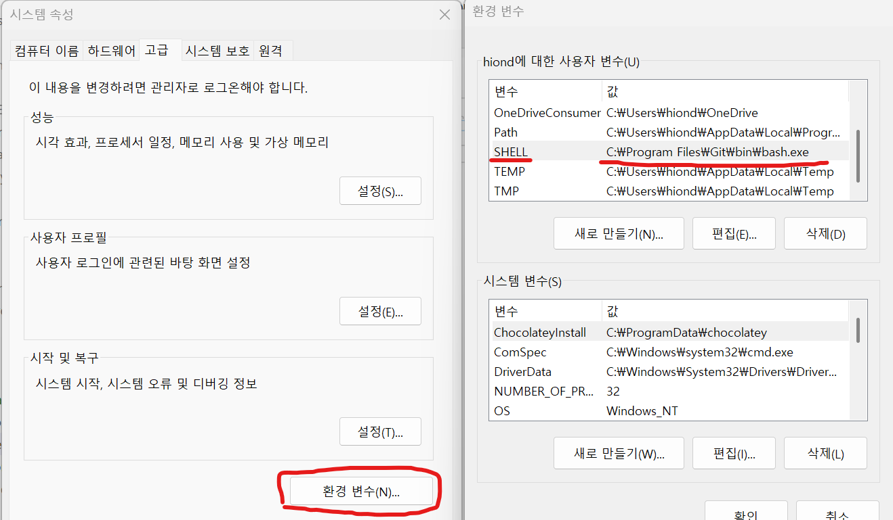
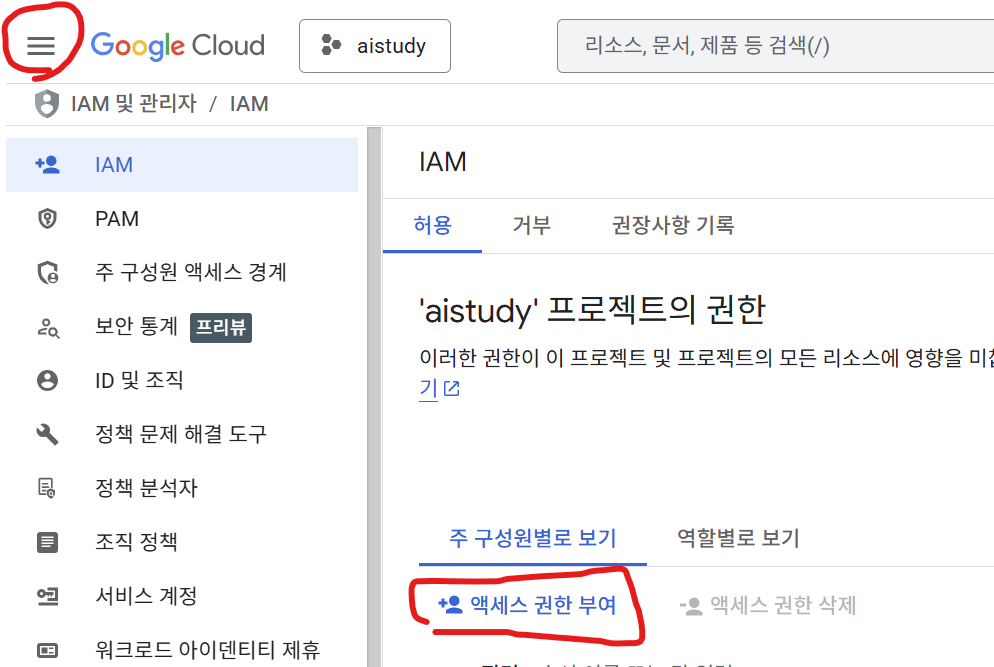
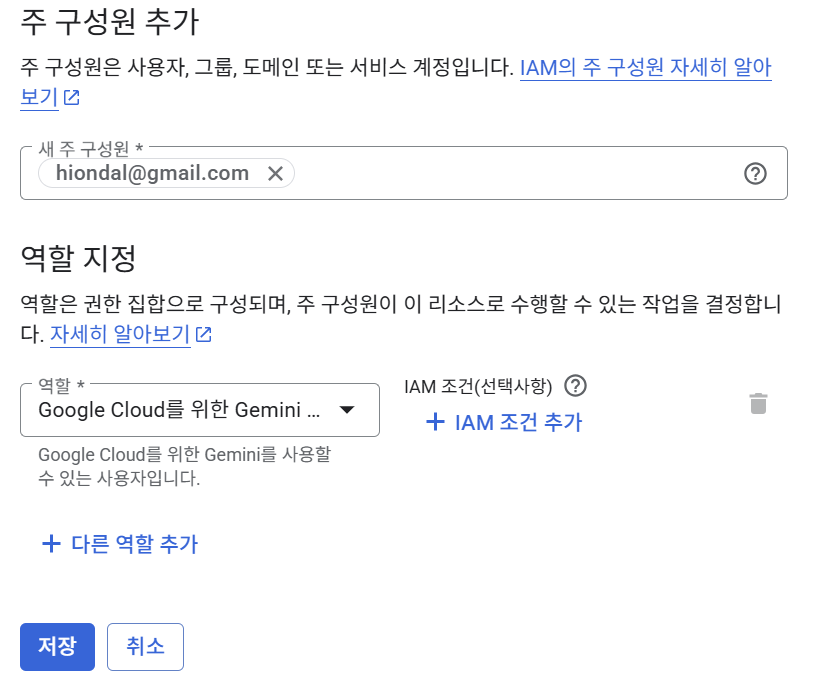
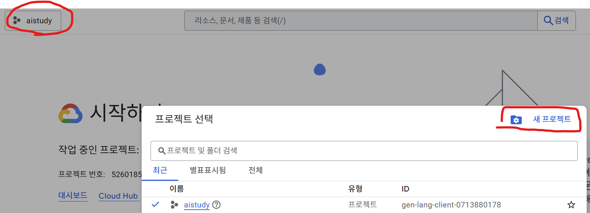
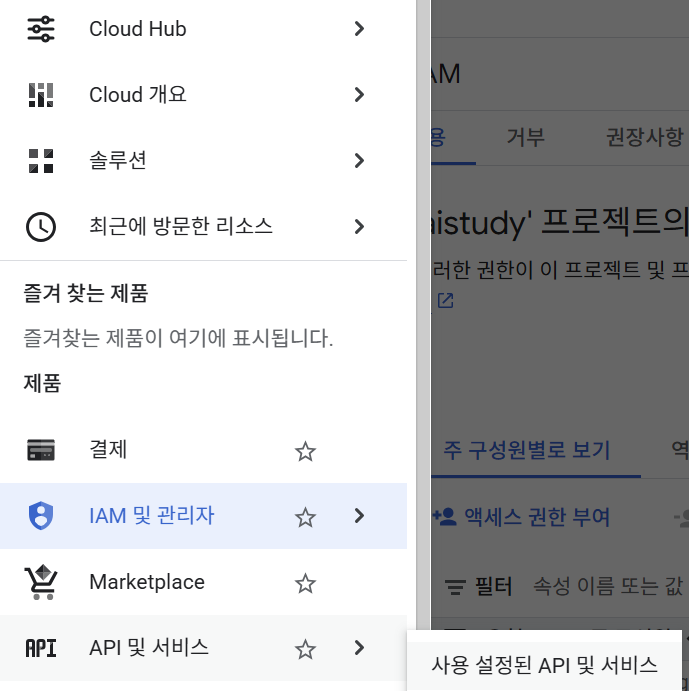
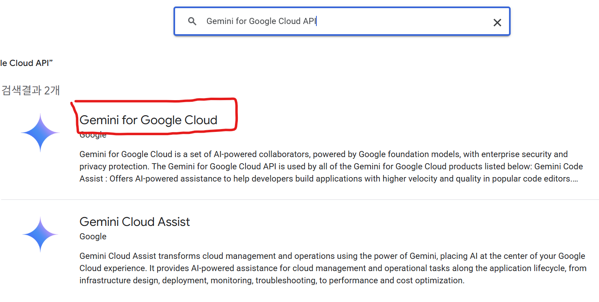

# Oh My OpenCode 가이드

- [Oh My OpenCode 가이드](#oh-my-opencode-가이드)
  - [1. 개요](#1-개요)
    - [핵심 특징](#핵심-특징)
    - [주요 수치](#주요-수치)
  - [2. 시스템 요구사항](#2-시스템-요구사항)
  - [3. 설치 방법](#3-설치-방법)
    - [Step 1: OpenCode 설치](#step-1-opencode-설치)
    - [Step 2: Oh My OpenCode 설치](#step-2-oh-my-opencode-설치)
      - [권장 방법: bunx 사용](#권장-방법-bunx-사용)
      - [대안: npm 사용](#대안-npm-사용)
      - [대안: bun 사용](#대안-bun-사용)
      - [대안: yarn 사용](#대안-yarn-사용)
      - [대안: pnpm 사용](#대안-pnpm-사용)
    - [Step 3: 설치 확인](#step-3-설치-확인)
    - [Step 4: 프로젝트 실행](#step-4-프로젝트-실행)
  - [4. 인증 설정](#4-인증-설정)
    - [Anthropic (Claude)](#anthropic-claude)
    - [Google Gemini (Antigravity OAuth)](#google-gemini-antigravity-oauth)
    - [OpenAI (ChatGPT)](#openai-chatgpt)
    - [GitHub Copilot (Fallback Provider)](#github-copilot-fallback-provider)
  - [5. 주요 에이전트 (Agents)](#5-주요-에이전트-agents)
    - [Sisyphus (메인 에이전트)](#sisyphus-메인-에이전트)
    - [Oracle](#oracle)
    - [Frontend UI/UX Engineer](#frontend-uiux-engineer)
    - [Librarian](#librarian)
    - [Explore](#explore)
    - [Document Writer](#document-writer)
    - [Prometheus (Planner)](#prometheus-planner)
    - [Metis (Plan Consultant)](#metis-plan-consultant)
    - [OpenCode-Builder](#opencode-builder)
  - [6. 주요 기능](#6-주요-기능)
    - [6.1 Background Tasks](#61-background-tasks)
    - [6.2 LSP/AST-Grep 지원](#62-lspast-grep-지원)
      - [LSP 서버 설치 방법](#lsp-서버-설치-방법)
    - [6.3 Hooks 시스템](#63-hooks-시스템)
    - [6.4 MCP 통합](#64-mcp-통합)
    - [6.5 세션 관리 도구](#65-세션-관리-도구)
    - [6.6 look\_at 도구](#66-look_at-도구)
    - [6.7 Categories 기능](#67-categories-기능)
    - [6.8 Interactive Terminal](#68-interactive-terminal)
    - [6.9 Google 멀티 계정 로드밸런싱](#69-google-멀티-계정-로드밸런싱)
  - [7. 슬래시 커맨드 (Slash Commands)](#7-슬래시-커맨드-slash-commands)
    - [기본 커맨드](#기본-커맨드)
    - [세션 관리](#세션-관리)
    - [프로젝트 설정](#프로젝트-설정)
    - [편집 및 실행취소](#편집-및-실행취소)
    - [표시 옵션](#표시-옵션)
    - [자동 실행 루프 (Oh My OpenCode 전용)](#자동-실행-루프-oh-my-opencode-전용)
    - [사용 예시](#사용-예시)
  - [8. AGENTS.md 파일](#8-agentsmd-파일)
    - [개요](#개요)
    - [생성 방법: `/init` 명령어](#생성-방법-init-명령어)
    - [왜 필요한가?](#왜-필요한가)
    - [프로젝트 규모별 필요성](#프로젝트-규모별-필요성)
    - [플랫폼별 파일명](#플랫폼별-파일명)
    - [작동 방식](#작동-방식)
  - [9. Oh My OpenCode 설정 (Configuration)](#9-oh-my-opencode-설정-configuration)
    - [설정 파일 위치](#설정-파일-위치)
    - [설정 파일 형식](#설정-파일-형식)
    - [기본 설정 예시](#기본-설정-예시)
    - [에이전트 모델 오버라이드 예시](#에이전트-모델-오버라이드-예시)
  - [10. 매직 키워드](#10-매직-키워드)
    - [`ultrawork` / `ulw`](#ultrawork--ulw)
    - [`search` / `find` / `찾아` / `検索`](#search--find--찾아--検索)
    - [`analyze` / `investigate` / `분석` / `調査`](#analyze--investigate--분석--調査)
    - [`ultrathink` / `think deeply`](#ultrathink--think-deeply)
  - [11. 업데이트](#11-업데이트)
  - [12. 제거 (Uninstallation)](#12-제거-uninstallation)
  - [13. 문제 해결](#13-문제-해결)
    - [설치 문제](#설치-문제)
    - [설정 문제](#설정-문제)
    - [지원 채널](#지원-채널)
  - [14. Gemini 역할 추가 및 API 활성화](#14-gemini-역할-추가-및-api-활성화)
  - [14. 참고 링크](#14-참고-링크)
  - [15. 라이선스](#15-라이선스)


---

## 1. 개요

**Oh My OpenCode**: [OpenCode](https://opencode.ai) 기반 특화 오케스트레이션 레이어.   
배터리 포함형 에이전트, 훅, 워크플로우 제공으로 복잡한 빌드 파이프라인 및 멀티 레포 구조 처리 가능.

### 핵심 특징
- **Multi-Agent Orchestration**: 다수 전문화 에이전트의 병렬 작업 수행
- **Batteries-Included**: 에이전트, 훅, MCP, LSP 지원 등 전체 기능 포함
- **Build Pipeline Aware**: 복잡한 레포 구조 및 빌드 시스템 자동 인식
- **Highly Configurable**: JSON 설정 기반 전체 측면 커스터마이징 지원

### 주요 수치
- **GitHub Stars**: 18.3K+
- **Forks**: 1.3K+
- **OpenCode 기반**: 60K+ GitHub Stars, 650,000+ 월간 사용자

[Top](#oh-my-opencode-가이드)

---

## 2. 시스템 요구사항

- **OpenCode** 1.0.133 이상 (1.0.150+ 권장)
- Node.js 또는 Bun 런타임 (설치 시에만 필요, CLI 실행 후 불필요)
- 지원 플랫폼: macOS (ARM64, x64), Linux (x64, ARM64, Alpine/musl), Windows (x64)

[Top](#oh-my-opencode-가이드)

---

## 3. 설치 방법

**Window 사용자 필수 작업**
- Window Terminal에서 **Git Bash 터미널**에서 작업
- OS 환경변수 "SHELL" 추가하고 git bash 패스 지정    
  이 작업을 안하면 Git Pull/Push가 안됨    
  (Window CMD/Powershell에서 export명령이 동작 안하므로 기본 Shell을 Git Bash로 바꿔야 함)    
  ```
  SHELL="C:\Program Files\Git\bin\bash.exe"
  ```  
         
  
### Step 1: OpenCode 설치

Oh My OpenCode는 OpenCode 플러그인으로, OpenCode 선행 설치 필요.

```bash
# Linux/macOS
curl -fsSL https://opencode.ai/install | bash

# npm 사용
npm install -g opencode-ai

# bun 사용
bun install -g opencode-ai

# yarn 사용
yarn global add opencode-ai

# pnpm 사용
pnpm add -g opencode-ai
```

### Step 2: Oh My OpenCode 설치

#### 권장 방법: bunx 사용
```bash
bunx oh-my-opencode install
```

#### 대안: npm 사용
```bash
npm install -g oh-my-opencode
```

#### 대안: bun 사용
```bash
bun install -g oh-my-opencode
```

#### 대안: yarn 사용
```bash
yarn global add oh-my-opencode
```

#### 대안: pnpm 사용
```bash
pnpm add -g oh-my-opencode
```

### Step 3: 설치 확인

```bash
# OpenCode 버전 확인
opencode --version

# 설정 파일 확인
cat ~/.config/opencode/opencode.json
# "oh-my-opencode"가 plugin 배열에 포함 필수
```

### Step 4: 프로젝트 실행
 
```bash
cd your-project
opencode
```

[Top](#oh-my-opencode-가이드)

---

## 4. 인증 설정

### Anthropic (Claude)

```bash
opencode auth login
# Provider: Anthropic 선택
# Login method: Claude Pro/Max 선택
# 브라우저 OAuth 플로우 완료
```

### Google Gemini (Antigravity OAuth)

1. `~/.config/opencode/opencode.json` 플러그인 추가:
```json
{
  "plugin": [
    "oh-my-opencode",
    "opencode-antigravity-auth@latest"
  ]
}
```

2. 인증 수행:
```bash
opencode auth login
# Provider: Google 선택
# Login method: OAuth with Google (Antigravity) 선택
```

### OpenAI (ChatGPT)

```bash
opencode auth login
# Provider: OpenAI 선택
# Login method: ChatGPT Plus/Pro 선택
# 브라우저 OAuth 플로우 완료
```

### GitHub Copilot (Fallback Provider)

```bash
opencode auth login
# Provider: GitHub Copilot 선택
# 브라우저 인증 완료
```

[Top](#oh-my-opencode-가이드)

---

## 5. 주요 에이전트 (Agents)

### Sisyphus (메인 에이전트)
- **역할**: 지능적 계획 및 실행
- **모델**: Opus 4.5 High
- **특징**: 기본 활성화, TODO 관리 및 작업 완료까지 지속 실행

### Oracle
- **역할**: 설계 및 디버깅
- **모델**: GPT 5.2 Medium
- **사용 시점**: 아키텍처 결정, 복잡한 문제 해결 시

### Frontend UI/UX Engineer
- **역할**: 프론트엔드 개발
- **모델**: Gemini 3 Pro
- **사용 시점**: UI/UX 작업, 시각적 변경 시

### Librarian
- **역할**: 공식 문서, 오픈소스 구현체, 코드베이스 탐색
- **모델**: Claude Sonnet 4.5
- **사용 시점**: 외부 라이브러리 사용법, 문서 조회 시

### Explore
- **역할**: 고속 코드베이스 탐색 (Contextual Grep)
- **모델**: Grok Code
- **사용 시점**: 파일 검색, 패턴 발견 시

### Document Writer
- **역할**: 기술 문서 작성
- **모델**: Gemini 3 Flash
- **사용 시점**: README, API 문서, 가이드 작성 시

### Prometheus (Planner)
- **역할**: 작업 계획 수립
- **특징**: work-planner 방법론 기반 계획 에이전트

### Metis (Plan Consultant)
- **역할**: 사전 분석 및 숨은 요구사항 파악
- **사용 시점**: 계획 수립 전 요구사항 분석 시

### OpenCode-Builder
- **역할**: 빌드 에이전트
- **특징**: OpenCode 기본 빌드 에이전트

[Top](#oh-my-opencode-가이드)

---

## 6. 주요 기능

### 6.1 Background Tasks
다수 에이전트 병렬 실행으로 효율성 극대화:
```
background_task(agent="explore", prompt="Find all files matching pattern X")
background_task(agent="librarian", prompt="Lookup documentation for Z")
```

**동시성 관리 설정** (`oh-my-opencode.json`):
```json
{
  "background_task": {
    "defaultConcurrency": 5,
    "providerConcurrency": {
      "anthropic": 3,
      "openai": 5,
      "google": 10
    },
    "modelConcurrency": {
      "anthropic/claude-opus-4-5": 2,
      "google/gemini-3-flash": 10
    }
  }
}
```

| 옵션 | 설명 | 기본값 |
|------|------|--------|
| `defaultConcurrency` | 전체 기본 동시 실행 수 | 5 |
| `providerConcurrency` | 프로바이더별 동시 실행 수 | - |
| `modelConcurrency` | 모델별 동시 실행 수 (최우선 적용) | - |

**우선순위**: `modelConcurrency` > `providerConcurrency` > `defaultConcurrency`

**활용 예시**:
- 비싼 모델(Opus) 제한: 비용 급증 방지
- 저렴한 모델(Flash) 확장: 병렬 처리 극대화
- `0` 설정 시: 무제한 동시 실행

### 6.2 LSP/AST-Grep 지원

**기능**:
- 코드 분석, 타입 체크, 리팩토링, 심볼 검색

**사용 가능 도구**:
- `lsp_hover`: 심볼 정보 조회
- `lsp_goto_definition`: 정의로 이동
- `lsp_find_references`: 참조 검색
- `lsp_diagnostics`: 오류/경고 조회
- `lsp_rename`: 심볼 이름 변경
- `ast_grep_search`: AST 기반 코드 패턴 검색
- `ast_grep_replace`: AST 기반 코드 패턴 치환

#### LSP 서버 설치 방법

Oh My OpenCode에서 LSP 기능 사용 시 해당 언어의 Language Server 선행 설치 필요.

**주요 언어별 설치 명령어**:

| 언어 | LSP 서버 | 설치 명령어 |
|------|----------|-------------|
| **TypeScript/JavaScript** | typescript-language-server | `npm i -g typescript-language-server typescript` |
| **Python** | basedpyright | `pip install basedpyright` |
| **Python** (대안) | pyright | `pip install pyright` |
| **Python** (린터) | ruff | `pip install ruff` |
| **Go** | gopls | `go install golang.org/x/tools/gopls@latest` |
| **Rust** | rust-analyzer | `rustup component add rust-analyzer` |
| **C/C++** | clangd | Windows: `winget install LLVM.clangd`<br>macOS: `brew install llvm`<br>Linux: `sudo apt install clangd` |
| **Vue** | vue-language-server | `npm i -g @vue/language-server` |
| **Svelte** | svelte-language-server | `npm i -g svelte-language-server` |
| **Ruby** | ruby-lsp | `gem install ruby-lsp` |
| **Java** | jdtls | Eclipse JDT.LS 별도 설치 필요 |
| **Bash** | bash-language-server | `npm i -g bash-language-server` |
| **YAML** | yaml-language-server | `npm i -g yaml-language-server` |
| **Lua** | lua-language-server | [GitHub Releases](https://github.com/LuaLS/lua-language-server/releases)에서 다운로드 |
| **PHP** | intelephense | `npm i -g intelephense` |
| **Dart** | dart | Dart SDK에 포함 |
| **Elixir** | elixir-ls | [GitHub Releases](https://github.com/elixir-lsp/elixir-ls/releases)에서 다운로드 |
| **Zig** | zls | `zig fetch` 또는 [GitHub Releases](https://github.com/zigtools/zls/releases) |
| **C#** | csharp-ls | `dotnet tool install -g csharp-ls` |
| **Haskell** | haskell-language-server | `ghcup install hls` |
| **Nix** | nixd | `nix profile install nixpkgs#nixd` |

**자주 사용하는 조합 일괄 설치**:

```bash
# 웹 개발 (TypeScript + Vue + Bash)
npm i -g typescript-language-server typescript @vue/language-server bash-language-server

# Python 개발
pip install basedpyright ruff

# 풀스택 개발
npm i -g typescript-language-server typescript @vue/language-server bash-language-server yaml-language-server
pip install basedpyright
```

**설치 확인**:

OpenCode 실행 후 LSP 서버 상태 확인:
```
lsp_servers
```

설치된 서버는 `[installed]`로 표시.

**설정 예시** (`oh-my-opencode.json`):
```json
{
  "lsp": {
    "typescript-language-server": {
      "command": ["typescript-language-server", "--stdio"],
      "extensions": [".ts", ".tsx"],
      "priority": 10
    },
    "pylsp": {
      "command": ["pylsp"],
      "extensions": [".py"],
      "priority": 10
    }
  }
}
```

### 6.3 Hooks 시스템

30+ 내장 훅 기반 워크플로우 자동화.

**주요 훅 목록**:
| 훅 이름 | 기능 |
|---------|------|
| `todo-continuation-enforcer` | TODO 작업 지속 실행 |
| `preemptive-compaction` | 선제적 세션 압축 |
| `auto-update-checker` | 업데이트 확인 |
| `empty-task-response-detector` | 빈 응답 감지 |
| `thinking-block-validator` | 추론 블록 검증 |
| `tool-output-truncator` | 도구 출력 자동 truncate |
| `ralph-loop` | Ralph Loop 기능 |
| `context-window-monitor` | 컨텍스트 윈도우 모니터링 |
| `session-recovery` | 세션 복구 |

**특정 훅 비활성화** (`oh-my-opencode.json`):
```json
{
  "disabled_hooks": ["comment-checker", "agent-usage-reminder"]
}
```

### 6.4 MCP 통합

**기본 제공 MCP**:
| MCP | 기능 | 기본 상태 |
|-----|------|----------|
| **Context7** | 최신 라이브러리 공식 문서 조회 | 활성화 |
| **grep.app** | GitHub 레포지토리 전체 코드 검색 | 활성화 |
| **Exa** | 웹 검색 | 활성화 |

**특정 MCP 비활성화** (`oh-my-opencode.json`):
```json
{
  "disabled_mcps": ["context7", "grep_app"]
}
```

### 6.5 세션 관리 도구

| 도구 | 기능 | 사용 예시 |
|------|------|----------|
| `session_list` | 세션 목록 조회 | `session_list(limit=10)` |
| `session_read` | 메시지/히스토리 조회 | `session_read(sessionId="abc123")` |
| `session_search` | 전체 텍스트 검색 | `session_search(query="아키텍처")` |
| `session_info` | 메타데이터 및 통계 | `session_info(sessionId="abc123")` |

### 6.6 look_at 도구

PDF, 이미지, 다이어그램 등 멀티모달 콘텐츠 분석.

**지원 파일 형식**:
- 이미지: `.jpg`, `.png`, `.webp`, `.heic`
- 비디오: `.mp4`, `.mov`, `.avi`, `.webm`
- 오디오: `.mp3`, `.wav`, `.aac`, `.ogg`
- 문서: `.pdf`, `.txt`, `.csv`, `.md`

**사용 예시**:
```
look_at(file_path="/path/to/document.pdf", goal="주요 요구사항 추출")
```

### 6.7 Categories 기능

도메인별 작업 위임 시스템.

**기본 제공 카테고리**:
| 카테고리 | 용도 | 모델 |
|----------|------|------|
| `visual-engineering` | UI/UX 작업 | Gemini 3 Pro |
| `ultrabrain` | 복잡한 알고리즘, 비즈니스 로직 | GPT 5.2 |
| `quick` | 빠른 유틸리티 작업 | Claude Haiku 4 |
| `writing` | 문서화, 기술 작성 | Gemini 3 Flash |

**커스텀 카테고리 설정** (`oh-my-opencode.json`):
```json
{
  "categories": {
    "my-visual": {
      "model": "google/gemini-3-pro-preview",
      "temperature": 0.8,
      "prompt_append": "접근성과 현대적 디자인 패턴에 집중"
    }
  }
}
```

**사용 예시**:
```
sisyphus_task(category="visual-engineering", prompt="반응형 네비게이션 바 생성")
```

### 6.8 Interactive Terminal

Tmux 통합 기반 대화형 터미널. 장시간 실행 프로세스에 적합.

**사용 예시**:
```bash
# 세션 생성
interactive_bash(tmux_command="new-session -d -s omo-dev")

# 명령 전송
interactive_bash(tmux_command="send-keys -t omo-dev 'npm install' Enter")

# 세션 목록 조회
interactive_bash(tmux_command="list-sessions")

# 세션 종료
interactive_bash(tmux_command="kill-session -t omo-dev")
```

**참고**: `omo-` 접두사 세션은 OpenCode 종료 시 자동 정리.

### 6.9 Google 멀티 계정 로드밸런싱

최대 10개 Google 계정 지원, 자동 failover.

**설정 방법**:

1. 플러그인 추가 (`~/.config/opencode/opencode.json`):
```json
{
  "plugin": [
    "oh-my-opencode",
    "opencode-antigravity-auth@1.2.8"
  ]
}
```

2. 다중 계정 인증:
```bash
opencode auth login
# Provider: Google 선택
# Login method: OAuth with Google (Antigravity) 선택
# Add another account? (y/n): y  ← 추가 계정 등록
```

3. 에이전트 모델 오버라이드 (`oh-my-opencode.json`):
```json
{
  "agents": {
    "frontend-ui-ux-engineer": {
      "model": "google/antigravity-gemini-3-pro-high"
    },
    "document-writer": {
      "model": "google/antigravity-gemini-3-flash"
    }
  }
}
```

**로드밸런싱 동작**:
- 1개 계정: sticky (고정)
- 2~5개 계정: hybrid (기본)
- 5개 이상: round-robin (순환)

[Top](#oh-my-opencode-가이드)

---

## 7. 슬래시 커맨드 (Slash Commands)

OpenCode 프롬프트에서 `/`로 시작하는 명령어 입력으로 다양한 기능 실행 가능.

### 기본 커맨드

| 커맨드 | 별칭 | 설명 | 단축키 |
|--------|------|------|--------|
| `/help` | — | 도움말 표시 | `ctrl+x h` |
| `/exit` | `/quit`, `/q` | OpenCode 종료 | `ctrl+x q` |
| `/new` | `/clear` | 새 세션 시작 | `ctrl+x n` |
| `/models` | — | 사용 가능한 모델 목록 | `ctrl+x m` |
| `/themes` | `/theme` | 테마 목록 및 변경 | `ctrl+x t` |

### 세션 관리

| 커맨드 | 별칭 | 설명 | 단축키 |
|--------|------|------|--------|
| `/sessions` | `/resume`, `/continue` | 세션 목록 및 전환 | `ctrl+x l` |
| `/rename` | - | 세션 이름 변경 | - |
| `/compact` | `/summarize` | 현재 세션 압축 (토큰 절약) | `ctrl+x c` |
| `/share` | — | 현재 세션 공유 | `ctrl+x s` |
| `/unshare` | — | 세션 공유 해제 | — |
| `/export` | — | 대화를 마크다운으로 내보내기 | `ctrl+x x` |

### 프로젝트 설정

| 커맨드 | 별칭 | 설명 | 단축키 |
|--------|------|------|--------|
| `/init` | — | AGENTS.md 파일 생성/업데이트 | `ctrl+x i` |
| `/connect` | — | 프로바이더 추가 (API 키 설정) | — |

### 편집 및 실행취소

| 커맨드 | 별칭 | 설명 | 단축키 |
|--------|------|------|--------|
| `/editor` | — | 외부 에디터로 메시지 작성 | `ctrl+x e` |
| `/undo` | — | 마지막 메시지 실행취소 (파일 변경 복원, Git 필요) | `ctrl+x u` |
| `/redo` | — | 실행취소한 메시지 다시 실행 (Git 필요) | `ctrl+x r` |

### 표시 옵션

| 커맨드 | 별칭 | 설명 | 단축키 |
|--------|------|------|--------|
| `/thinking` | — | 추론 과정 표시 토글 | — |

### 자동 실행 루프 (Oh My OpenCode 전용)

| 커맨드 | 설명 |
|--------|------|
| `/ralph-loop "작업 설명"` | 작업 완료까지 자동 반복 실행 루프 시작 |
| `/cancel-ralph` | 활성화된 Ralph Loop 중지 |

**Ralph Loop란?**

복잡하고 긴 작업을 에이전트가 알아서 끝까지 완료하도록 맡기는 기능.   
일반 프롬프트는 에이전트가 중간에 멈추면 사용자가 "계속해"를 입력해야 하지만, Ralph Loop는 자동 진행.
  
**Use Case**:
- 대규모 마이그레이션 (JavaScript → TypeScript 전환)
- 전체 기능 구현 (회원가입, 로그인, 비밀번호 재설정 등)
- 레거시 코드 리팩토링
- 전체 API 엔드포인트 테스트 코드 작성
- 밤새 작업 맡기기 (켜놓고 자도 됨)

**특징**:
- 작업 완료까지 에이전트 자동 작업 지속
- 완료 감지: `<promise>DONE</promise>` 출력 시 종료
- 최대 반복 횟수 도달 시 자동 종료 (기본값: 100회)
- `/cancel-ralph`로 수동 중지 가능

**사용 예시**:
```bash
# 대규모 마이그레이션
> /ralph-loop "이 프로젝트를 JavaScript에서 TypeScript로 전환해줘"

# 전체 기능 구현
> /ralph-loop "사용자 인증 시스템 구현해줘 (회원가입, 로그인, 비밀번호 재설정)"

# 최대 반복 횟수 지정
> /ralph-loop "코드베이스 리팩토링" --max-iterations=50

# 루프 중지
> /cancel-ralph
```

### 사용 예시

```bash
# 프로젝트 초기 설정
> /init

# 세션이 길어졌을 때 압축
> /compact

# 모델 변경
> /models

# 이전 세션 이어서 작업
> /sessions

# 대화 내용 내보내기
> /export
```

[Top](#oh-my-opencode-가이드)

---

## 8. AGENTS.md 파일

### 개요

**AGENTS.md**: AI 코딩 에이전트가 프로젝트 작업 시 참고하는 지침서.    
프로젝트 구조, 코드 스타일, 실행 방법 등을 명시하여 에이전트가 일관된 코드 생성하도록 함.   

### 생성 방법: `/init` 명령어

OpenCode에서 `/init` 명령어 실행 시 현재 프로젝트 분석하여 AGENTS.md 파일 자동 생성.  

```bash
# 프로젝트 디렉토리에서 OpenCode 실행
cd your-project
opencode

# OpenCode 프롬프트에서 /init 실행
> /init
```

`/init` 명령어 실행 시:
1. 프로젝트 구조 자동 분석
2. 사용 중인 언어/프레임워크 감지
3. 빌드/테스트 명령어 추출
4. 코드 스타일 패턴 파악
5. AGENTS.md 파일 생성

### 왜 필요한가?

| 상황 | AGENTS.md 없음 | AGENTS.md 있음 |
|------|----------------|----------------|
| **코드 스타일** | 추측하거나 일반적인 스타일 적용 | 프로젝트 컨벤션 즉시 적용 |
| **실행 방법** | "어떻게 실행하나요?" 질문 필요 | 바로 명령어 실행 |
| **API 패턴** | 공식 문서 기반 일반 코드 | 프로젝트에 맞는 패턴 사용 |
| **토큰 사용** | 탐색에 토큰 낭비 | 핵심 작업에 집중 |

### 프로젝트 규모별 필요성

```
소규모 (파일 5개 이하)     → 있으면 좋음
중규모 (파일 10~50개)      → 권장
대규모 (파일 50개 이상)    → 필수
팀 프로젝트               → 필수
```

### 플랫폼별 파일명

| 플랫폼 | 파일명 |
|--------|--------|
| Claude Code | `CLAUDE.md` 또는 `AGENTS.md` |
| OpenCode / Oh My OpenCode | `AGENTS.md` |
| Cursor | `.cursor/rules/` 또는 `.cursorrules` |
| GitHub Copilot | `.github/copilot-instructions.md` |

### 작동 방식

```
┌─────────────────────────────────────────────────────────┐
│  사용자: "로그인 API 추가해줘"                           │
└─────────────────────────────────────────────────────────┘
                          ↓
┌─────────────────────────────────────────────────────────┐
│  AI 에이전트가 AGENTS.md 읽음                           │
│  ─────────────────────────────────────────────────────  │
│  • 프로젝트 구조 파악                                   │
│  • 코드 스타일 확인 (snake_case, 타입힌트 등)           │
│  • API 패턴 참고                                        │
│  • 테스트 실행 방법 확인                                │
└─────────────────────────────────────────────────────────┘
                          ↓
┌─────────────────────────────────────────────────────────┐
│  기존 코드베이스 스타일에 맞는 코드 생성                 │
└─────────────────────────────────────────────────────────┘
```

[Top](#oh-my-opencode-가이드)

---

## 9. Oh My OpenCode 설정 (Configuration)

### 설정 파일 위치
- **프로젝트별**: `.opencode/oh-my-opencode.json` (우선 적용)
- **사용자 전역**: `~/.config/opencode/oh-my-opencode.json`

### 설정 파일 형식
- **JSONC 지원**: 주석(`//`, `/* */`) 및 trailing comma 허용
- **Schema URL** (IDE 자동완성용):
  ```
  https://raw.githubusercontent.com/code-yeongyu/oh-my-opencode/master/assets/oh-my-opencode.schema.json
  ```

### 기본 설정 예시

```json
{
  "agents": {
    "sisyphus": { "enabled": true },
    "oracle": { "enabled": true },
    "frontend-ui-ux-engineer": { "enabled": true },
    "librarian": { "enabled": true },
    "explore": { "enabled": true }
  },
  "hooks": {
    "todo-continuation-enforcer": { "enabled": true },
    "comment-checker": { "enabled": true }
  },
  "mcps": {
    "context7": { "enabled": true },
    "grep-app": { "enabled": true }
  },
  "lsp": {
    "enabled": true
  }
}
```

### 에이전트 모델 오버라이드 예시

```json
{
  "agents": {
    "frontend-ui-ux-engineer": { 
      "model": "google/antigravity-gemini-3-pro-high" 
    },
    "document-writer": { 
      "model": "google/antigravity-gemini-3-flash" 
    }
  }
}
```

[Top](#oh-my-opencode-가이드)

---

## 10. 매직 키워드

프롬프트에 특정 키워드 포함 시 관련 기능 자동 활성화.

### `ultrawork` / `ulw`
전체 기능 활성화:
- 병렬 에이전트 실행
- 백그라운드 태스크
- 심층 탐색
- 작업 완료까지 지속 실행

```
ulw 프로젝트에 다크모드 기능 추가
```

### `search` / `find` / `찾아` / `検索`
검색 모드 활성화:
- 코드베이스 탐색 강화
- 파일 패턴 검색

### `analyze` / `investigate` / `분석` / `調査`
분석 모드 활성화:
- 심층 코드 분석
- 문제 원인 조사

### `ultrathink` / `think deeply`
심층 추론 모드:
- 복잡한 문제에 대한 깊은 사고
- 아키텍처 설계 시 활용

[Top](#oh-my-opencode-가이드)

---

## 11. 업데이트

```bash
# npm 사용
npm update -g oh-my-opencode

# bun 사용
bun update -g oh-my-opencode
```

`auto-update-checker` 훅 기본 활성화로 업데이트 가능 시 알림 수신.

[Top](#oh-my-opencode-가이드)

---

## 12. 제거 (Uninstallation)

```bash
# npm 사용
npm uninstall -g oh-my-opencode

# bun 사용
bun remove -g oh-my-opencode
```

설정 파일 완전 삭제:
```bash
rm ~/.config/opencode/oh-my-opencode.json
rm .opencode/oh-my-opencode.json  # 프로젝트별 설정
```

[Top](#oh-my-opencode-가이드)

---

## 13. 문제 해결

### 설치 문제
- Node.js 최신 버전 사용 여부 확인
- 다른 패키지 매니저 시도
- 전역 설치 권한 확인
- 캐시 정리: `npm cache clean --force` 또는 `bun pm cache rm`

### 설정 문제
- OpenCode 1.0.133 이상 사용 여부 확인
- JSON 파일 유효성 검증
- 설정 디렉토리 권한 확인

### 지원 채널
- [GitHub Issues](https://github.com/code-yeongyu/oh-my-opencode/issues)
- [Discord 커뮤니티](https://discord.gg/PUwSMR9XNk)

[Top](#oh-my-opencode-가이드)

---

## 14. Gemini 역할 추가 및 API 활성화     
Opencode에서 Gemini AI 모델을 사용하려면 필수임     
1. Gemini for Google Cloud User 역할 추가      
   - IAM 및 관리자 > IAM 클릭 후 액세스 권한 부여 클릭 
        
   - 주사용자에 본인 google 계정 이메일 입력. 'Gemini for Google Cloud User' 역할 지정   
       

2. 프로젝트 만들기(기존에 없거나 새로 등록할 경우)      
  https://console.cloud.google.com/ 접근 후 로그인    
  프로젝트 만들기  
    

1. API활성화    
   - API 및 서비스 > 사용 설정된 API 및 서비스 선택   
       
   - 'Gemini for Google Cloud API' API 존재 확인   
   - 없으면 좌측 메뉴에서 '라이브러리' 선택 후 API검색   
         
   - API 사용 활성화 
     API 활성화는 "Oh My Opencode"에서 Gemini 구독을 사용하기 위한 설정임.   
     사용 시 **API 사용료가 과금되지는 않음**      

---

## 14. 참고 링크

- **공식 웹사이트**: https://ohmyopencode.com
- **GitHub**: https://github.com/code-yeongyu/oh-my-opencode
- **OpenCode**: https://opencode.ai
- **DeepWiki 문서**: https://deepwiki.com/code-yeongyu/oh-my-opencode

[Top](#oh-my-opencode-가이드)

---

## 15. 라이선스

SUL-1.0 (Sisyphus Use License)

[Top](#oh-my-opencode-가이드)

---

*문서 작성일: 2026년 1월 18일*
*작성자: 에듀핵 (최은정)*
