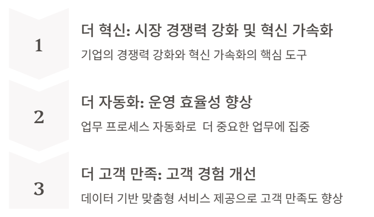

# AI 어플리케이션 개요

- [AI 어플리케이션 개요](#ai-어플리케이션-개요)
  - [학습 목표](#학습-목표)
  - [AI 어플리케이션의 필요성](#ai-어플리케이션의-필요성)
    - ["더 혁신"](#더-혁신)
    - ["더 자동화"](#더-자동화)
    - ["더 고객만족"](#더-고객만족)
  - [AI 어플리케이션 핵심 구성요소](#ai-어플리케이션-핵심-구성요소)
    - [SAS(Scheduler-Agent-Supervisor) 패턴](#sasscheduler-agent-supervisor-패턴)
    - [5대 핵심 구성요소](#5대-핵심-구성요소)
    - [Agent Flow 패턴](#agent-flow-패턴)
    - [트랜스포머 모델 (LLM의 핵심)](#트랜스포머-모델-llm의-핵심)
  - [AI 어플리케이션 아키텍처와 개발 흐름](#ai-어플리케이션-아키텍처와-개발-흐름)
    - [기본 아키텍처 구성](#기본-아키텍처-구성)
    - [데이터 흐름 이해](#데이터-흐름-이해)
    - [RAG 시스템의 데이터 흐름](#rag-시스템의-데이터-흐름)
    - [MSA 환경에서의 AI 서비스 통합](#msa-환경에서의-ai-서비스-통합)
  - [Cloud LLM API 비교 및 선택 가이드](#cloud-llm-api-비교-및-선택-가이드)
    - [주요 LLM 제공사 개요](#주요-llm-제공사-개요)
    - [토큰 비용 계산 예시](#토큰-비용-계산-예시)
    - [Groq API](#groq-api)
      - [API 사용 비용 (유료 플랜, per 1M tokens)](#api-사용-비용-유료-플랜-per-1m-tokens)
      - [Rate Limit 비교 (무료 vs 유료)](#rate-limit-비교-무료-vs-유료)
      - [주요 LLM 제공사 비용 비교](#주요-llm-제공사-비용-비교)
    - [프롬프트 엔지니어링 기초](#프롬프트-엔지니어링-기초)
      - [프롬프트 엔지니어링이란?](#프롬프트-엔지니어링이란)
      - [핵심 프롬프트 기법](#핵심-프롬프트-기법)
      - [실습하기](#실습하기)
  - [Python 기초](#python-기초)
    - [Python 소개](#python-소개)
    - [개발 환경 설정](#개발-환경-설정)
    - [Python 코드 구성 요소](#python-코드-구성-요소)
    - [Python 기본 문법](#python-기본-문법)
    - [가상환경과 패키지 관리](#가상환경과-패키지-관리)
    - [AI 개발에 자주 쓰이는 문법](#ai-개발에-자주-쓰이는-문법)

---

## 학습 목표
- AI 어플리케이션의 비즈니스 가치 이해  
- 주요 LLM API의 특징과 선택 기준 습득
- 프롬프트 엔지니어링 기초 이해 및 개발 환경 구성

[Top](#ai-어플리케이션-개요)

---

## AI 어플리케이션의 필요성

AI 어플리케이션이 비즈니스에 가져다주는 핵심 가치는 크게 세 가지로 요약      

 

### "더 혁신" 
AI는 더 빠르고 깊게 데이터를 분석하고 이해하여 **데이터 기반의 빠른 의사결정과 혁신적인 솔루션 제공**     
기업은 AI를 활용한 혁신적인 서비스와 제품을 통해 **새로운 수익원 확보 또는 시장 경쟁력 강화** 가능   

### "더 자동화" 
문서 작성, 데이터 입력, 고객 응대 등 시간 소모적인 업무를 AI가 대신 처리함으로써 **비용 절감** 및   
직원들은 더 **창의적이고 전략적인 업무에 집중** 가능     

### "더 고객만족"  
각 고객의 선호와 행동 패턴을 학습하여 맞춤형 서비스 제공으로 **고객 만족도와 충성도** 향상

[Top](#ai-어플리케이션-개요)

---

## AI 어플리케이션 핵심 구성요소

AI 어플리케이션 개발에 무엇이 필요한지 인간의 협업하는 방식으로 고민

### SAS(Scheduler-Agent-Supervisor) 패턴

AI 어플리케이션의 핵심 구조는 클라우드 아키텍처 패턴인 **SAS(Scheduler-Agent-Supervisor) 패턴**과 동일
세 역할이 무한루프(∞)처럼 반복 협업하는 **애자일 협업 사이클**로 동작

| 역할 | 설명 |
|:---|:---|
| **Scheduler(계획)** | 작업 계획 수립, 어떤 순서로 무엇을 할지 결정 |
| **Agent(실행)** | 계획에 따라 실제 작업 수행 (LLM 호출, Tool 실행 등) |
| **Supervisor(감독)** | 관찰/통제 |

동작 흐름: Scheduler가 계획을 수립하면 Agent가 실행하고, Supervisor가 검증한 후 다음 반복으로 이어짐

### 5대 핵심 구성요소

AI 어플리케이션 개발의 핵심 구성요소는 5가지

| 구성요소 | 설명 |
|:---|:---|
| **① Workflow 관리** | 복잡한 에이전트 흐름 제어. Scheduler 역할 수행 |
| **② LLM 인터페이스** | 프롬프트 구성부터 응답 파싱까지 연결. Agent의 두뇌 역할 |
| **③ RAG(Retrieval-Augmented Generation)** | 내/외부 문서 검색으로 LLM 지식 보강 |
| **④ Tools 연동** | LLM이 외부 API/함수를 자율적으로 호출 |
| **⑤ Harness** | 관찰/통제하여 비용/성능/보안 최적화 |

### Agent Flow 패턴

AI 어플리케이션의 실행 흐름은 크게 두 가지 패턴으로 구분

**패턴 A: Chain (선형 파이프라인)**
개발자가 흐름을 설계하는 **선형 파이프라인** (RAG는 선택적 구성요소)

```
Input: 질문/요청
  ↓
1. RAG: 내/외부 문서 검색
  ↓
2. Prompt 구성: 질문 + RAG 결과
  ↓
3. LLM 호출 → 응답 생성
  ↓
4. Output Parser: 응답 구조화
  ↓
Output: 답변 리턴
```

LCEL 체인 구성 예시:
```python
from langchain_core.runnables import RunnablePassthrough

# RAG 체인 파이프라인
rag_chain = (
    {"context": retriever, "question": RunnablePassthrough()}
    | prompt_template
    | llm
    | output_parser
)

# 실행
answer = rag_chain.invoke("질문")
```

- 핵심: 개발자가 파이프라인 설계, 선형 흐름 (1회 실행)
- 적합: 문서 Q&A, 요약, 번역 등 정형화된 작업

**패턴 B: Agent (자율형 루프)**
LLM이 스스로 판단하고 행동하는 **자율적 루프**

```
Input: 질문/요청
  ↓
1. Prompt 구성: 질문 + Tools 정의 + (RAG)
  ↓
  ┌──────────── React Loop ────────────┐
  │ 2. LLM 호출                         │
  │   ↓                                 │
  │ 판단(Reasoning)                     │
  │   ├─ 도구 필요 → 3. Tool 실행(Action)│
  │   │   → 결과를 컨텍스트에 추가       │
  │   │   → Observation → 2번으로 반복   │
  │   └─ 답변 가능 → 응답 생성 → 루프 종료│
  └─────────────────────────────────────┘
  ↓
4. Output Parser: 응답 구조화 (Text, JSON)
  ↓
Output: 답변 리턴
```

- 핵심: LLM이 흐름을 주도, 도구 선택/실행 반복
- React Loop: Reasoning → Action → Observation (추론 → 행동 → 관찰) 반복
- RAG로 내/외부 문서 검색한 결과를 프롬프트에 추가하는 건 질문/요청에 따라 판단 필요
- 적합: 복잡한 작업, 멀티스텝 추론

### 트랜스포머 모델 (LLM의 핵심)

LLM은 응답 생성 시 **트랜스포머(Transformer)** 모델 사용
트랜스포머 모델은 사람이 상대방 말을 이해하고 한 단어씩 최적의 답변을 하는 것과 동일

> 질문: "철수가 영희에게 눈을 뿌렸어"
> 답변: "응, 눈싸움하다 그랬대"

**인코더(Encoder) - 전체 문장 한번에 의미와 관계 파악**

| 단계 | 동작 | 기술 |
|:---|:---|:---|
| 단어로 쪼개고 순서 기억 | "철수가 1번, 영희에게 2번, 눈을 3번, 뿌렸어 4번" | Embedding + Positional Encoding |
| 단어들 사이 관계 파악 | "뿌렸어"의 주어는? → 1번 "철수가"와 연결 | Self-Attention |
| 문맥에 맞게 의미 확정 | "눈"이 뭐지? + "부리다" → 눈(Snow)으로 확정 | Feed Forward Network |

**디코더(Decoder) - 최적의 다음 응답 생성**

| 단계 | 동작 | 기술 |
|:---|:---|:---|
| 지금까지 뭐라고 말했는지 확인 | "응"까지 말함 → 긍정했으니 구체적 정보를 덧붙여야 함 | Masked Self Attention |
| 상대 말 다시 참고 | "뿌렸어"라고 물었으니 → 왜 그랬는지 말해주자 | Cross-Attention |
| 다음 단어 결정 | "눈싸움하다"가 적절 → 출력 | Feed Forward Network |

[Top](#ai-어플리케이션-개요)

---

## AI 어플리케이션 아키텍처와 개발 흐름
### 기본 아키텍처 구성
AI 어플리케이션의 기본 아키텍처는 전통적인 3-Tier 구조 기반      
- Presentation Layer: 사용자 인터페이스 담당, 웹, 모바일 앱, 또는 API 형태로 구현    
- Application Layer: 비즈니스 로직과 AI 통합을 처리하는 핵심 계층     
- Data Layer: 데이터 저장소와 벡터 데이터베이스 포함  
  
핵심 컴포넌트
- API Gateway: 인증, 요청 라우팅, Rate Limiting 담당 
- AI Service: LLM API 호출과 프롬프트 관리 수행
- Vector Store: RAG 구현을 위한 임베딩 저장 및 유사도 검색 제공
- Cache Layer: 응답 캐싱을 통해 비용 최적화  
  
### 데이터 흐름 이해
기본적인 요청-응답 흐름은 6단계로 구성  
- 요청자 입력 수신
- 입력 전처리 및 유효성 검증 
- 시스템 메시지와 사용자 메시지를 조합하여 프롬프트 구성
- LLM API 호출 
- 응답 후처리 및 검증
- 결과를 요청자에게 반환

> **참고**: 데이터 흐름의 상세 구조는 [Agent Flow 패턴](#agent-flow-패턴) 참조
> 패턴 A(Chain)는 위 6단계의 선형 흐름, 패턴 B(Agent)는 LLM이 주도하는 반복 루프

### RAG 시스템의 데이터 흐름
RAG 시스템은 두 가지 흐름으로 구분  
- 인덱싱 단계: 
  - 문서 수집 후 적절한 크기로 청킹
  - 각 청크를 임베딩 모델로 벡터화한 후 벡터 DB에 저장     
- 검색 단계: 
  - 사용자 질의가 들어오면 동일한 임베딩 모델로 질의 벡터화
  - 벡터 DB에서 유사도 검색을 수행하여 관련 문서 획득
  - 검색된 문서를 컨텍스트로 LLM에 전달
  
### MSA 환경에서의 AI 서비스 통합
마이크로서비스 아키텍처(MSA) 환경에서 AI 서비스 통합 시 몇 가지 패턴 고려 필요  
- AI 기능은 전용 마이크로서비스로 분리 권장 
- 시간이 오래 걸리는 AI 작업은 메시지 큐를 통한 비동기 처리 적합  
- Redis를 활용한 응답 캐싱으로 비용 절감 가능  
- 외부 API 장애에 대비한 Circuit Breaker 패턴, Rate Limit 패턴, Retry 패턴 등 필요

| 패턴 | 쉬운 설명 | 예시 |
|:---|:---|:---|
| **Circuit Breaker** | 반복 실패 시 일정 시간 호출을 차단하여 시스템 보호. 전기 차단기처럼 과부하 방지 | LLM API가 3번 연속 실패하면 30초간 호출 중단 후 재시도 |
| **Rate Limit** | 일정 시간 내 요청 횟수를 제한하여 과도한 호출 방지. API 비용 폭증과 서버 과부하 예방 | 분당 최대 60회 요청으로 제한, 초과 시 대기 |
| **Retry** | 일시적 오류 발생 시 간격을 두고 재시도. 네트워크 불안정 등 일시적 장애 극복 | 실패 시 1초 → 2초 → 4초 간격으로 최대 3회 재시도 |

[Top](#ai-어플리케이션-개요)

---

## Cloud LLM API 비교 및 선택 가이드

> **참고**: Local LLM(Ollama, LM Studio 등)은 [13.Local LLM](13.Local%20LLM.md)에서 다룸

### 주요 LLM 제공사 개요
| 제공사 | 특징 | Use Case | 모델정보 |
|:---|:---|:---|:---|
| OpenAI (GPT) | 가장 넓은 생태계와 풍부한 문서화, 안정적인 성능. Function Calling, JSON Mode, Vision 기능 지원 | 범용 챗봇, 멀티모달 작업, API 연동이 많은 서비스 | [Models](https://developers.openai.com/api/docs/models) |
| Anthropic (Claude) | 200K 토큰의 긴 컨텍스트 윈도우, Constitutional AI 기반 안전성, 우수한 코드 생성 능력 | 코드 생성/리뷰, 긴 문서 분석, 안전성이 중요한 서비스 | [Models](https://platform.claude.com/docs/en/about-claude/models/overview) |
| Google (Gemini) | 네이티브 멀티모달 처리, 100만 토큰 초대형 컨텍스트 윈도우 | 대용량 문서 처리, 이미지+텍스트 통합 분석 | [Models](https://ai.google.dev/gemini-api/docs/models?hl=ko) |
| Groq | 초고속 추론 엔진(LPU), 오픈소스 모델 호스팅, 무료 플랜 제공. 최대 1,000 TPS 속도 | 빠른 응답이 필요한 서비스, 비용 절감, 오픈소스 모델 활용 | [Console](https://console.groq.com/home) |

> **Constitutional AI**: Anthropic이 개발한 AI 안전성 기법.
> AI가 스스로 자신의 응답을 검토하고 수정하여 유해한 콘텐츠를 줄이는 자기 개선 방식

### 토큰 비용 계산 예시
실제 서비스에서 비용 예측을 위해 토큰 계산 방법 이해 필요   
일반적으로 영어 기준 1토큰은 약 4글자, 한국어 기준 1토큰은 약 1.5글자에 해당   

| 모델 | 입력 (1M 토큰) | 출력 (1M 토큰) |
|:---|:---:|:---:|
| GPT-4o | \$2.50 | \$10.00 |
| GPT-4o-mini | \$0.15 | \$0.60 |
| Claude 3.5 Sonnet | \$3.00 | \$15.00 |
| Gemini 1.5 Pro | \$1.25 | \$5.00 |

비용 계산 예시 (환율 1,450원 기준):
일일 1만 건의 챗봇 대화 처리 시, 평균 입력 500토큰, 출력 300토큰 가정 시
일일 총 토큰은 입력 500만, 출력 300만 토큰
GPT-4o 사용 시 월 \$1,275 (약 185만원), GPT-4o-mini 사용 시 월 \$76.5 (약 11만원)로 약 94%의 비용 절감 가능

### Groq API
Groq는 자체 개발한 LPU(Language Processing Unit) 칩 기반의 초고속 추론 엔진 제공  
오픈소스 LLM(Llama, Qwen, Mistral 등)을 호스팅하며, 무료 플랜으로도 API 사용 가능  
OpenAI 호환 API 형식을 지원하여 기존 코드의 최소 수정으로 전환 가능

- **공식 문서**: https://console.groq.com/docs
- **API 콘솔**: https://console.groq.com

#### API 사용 비용 (유료 플랜, per 1M tokens)

| 모델 | 속도 (TPS) | 입력 (1M 토큰) | 출력 (1M 토큰) | 비고 |
|:---|:---:|:---:|:---:|:---|
| Llama 3.1 8B Instant | 840 | \$0.05 | \$0.08 | 가장 저렴, 빠른 응답 |
| GPT OSS 20B | 1,000 | \$0.075 | \$0.30 | 128K 컨텍스트 |
| GPT OSS 120B | 500 | \$0.15 | \$0.60 | 128K 컨텍스트 |
| Llama 4 Scout 17Bx16E | 594 | \$0.11 | \$0.34 | MoE 아키텍처 |
| Llama 4 Maverick 17Bx128E | 562 | \$0.20 | \$0.60 | MoE 아키텍처 |
| Qwen3 32B | 662 | \$0.29 | \$0.59 | 131K 컨텍스트 |
| Llama 3.3 70B Versatile | 394 | \$0.59 | \$0.79 | 범용 고성능 |
| Kimi K2 1T | 200 | \$1.00 | \$3.00 | 256K 컨텍스트, 1조 파라미터 |

> 참고: 캐시된 입력 토큰은 50% 할인 적용. 음성 모델(Whisper)은 별도 과금 체계 적용

#### Rate Limit 비교 (무료 vs 유료)

| 모델 | 무료 플랜 RPM | 무료 플랜 TPM | 무료 플랜 RPD | 무료 플랜 TPD |
|:---|:---:|:---:|:---:|:---:|
| Llama 3.1 8B Instant | 30 | 6K | 14.4K | 500K |
| Llama 3.3 70B Versatile | 30 | 12K | 1K | 100K |
| Llama 4 Scout 17Bx16E | 30 | 30K | 1K | 500K |
| Llama 4 Maverick 17Bx128E | 30 | 6K | 1K | 500K |
| Qwen3 32B | 60 | 6K | 1K | 500K |
| Kimi K2 Instruct | 60 | 10K | 1K | 300K |
| GPT OSS 20B / 120B | 30 | 8K | 1K | 200K |
| Whisper Large v3 | 20 | - | 2K | - |

- RPM: Requests Per Minute, RPD: Requests Per Day
- TPM: Tokens Per Minute, TPD: Tokens Per Day
- 유료 플랜(Developer)은 무료 플랜 대비 높은 Rate Limit 제공 (계정별 상이)
- 정확한 유료 플랜 한도는 https://console.groq.com/settings/limits 에서 확인 가능

#### 주요 LLM 제공사 비용 비교

동일 성능대 모델 기준, 1M 토큰당 비용 비교:

| 구분 | 모델 | 입력 (1M 토큰) | 출력 (1M 토큰) |
|:---|:---|:---:|:---:|
| OpenAI | GPT-4o | \$2.50 | \$10.00 |
| OpenAI | GPT-4o-mini | \$0.15 | \$0.60 |
| Anthropic | Claude 3.5 Sonnet | \$3.00 | \$15.00 |
| Google | Gemini 1.5 Pro | \$1.25 | \$5.00 |
| Groq | Llama 3.3 70B | \$0.59 | \$0.79 |
| Groq | Llama 3.1 8B | \$0.05 | \$0.08 |
| Groq | Llama 4 Maverick | \$0.20 | \$0.60 |

> Groq는 오픈소스 모델 호스팅 방식으로 상용 모델 대비 비용이 크게 저렴
> GPT-4o 대비 Llama 3.3 70B는 입력 약 76%, 출력 약 92% 저렴

### 프롬프트 엔지니어링 기초
#### 프롬프트 엔지니어링이란?
프롬프트 엔지니어링은 LLM에서 원하는 결과를 얻기 위해 입력(프롬프트)을 설계하는 기술     
모델의 능력을 최대한 활용하기 위한 핵심 스킬이며, 별도의 코드 작성 없이 AI의 동작을 조정할 수 있는 방법  
동일한 모델이라도 프롬프트에 따라 결과 품질이 크게 달라지므로 매우 중요    
  
#### 핵심 프롬프트 기법
- 시스템 메시지와 유저 메시지
  - 시스템 메시지: AI의 역할 명시
  - 유저 메시지: 요청자의 프롬프트 
  ```
  from dotenv import load_dotenv
  import os
  from openai import OpenAI

  load_dotenv()

  client = OpenAI(
      api_key=os.environ.get("OPENAI_API_KEY")
  )

  system_message = {
      "role": "system",
      "content": "당신은 정확하고 간결한 AI 뉴스 요약을 제공하는 테크 뉴스 전문가입니다."
  }

  user_message = {
      "role": "user",
      "content": "오늘의 Top 3 AI 뉴스를 알려주세요. 각각 간단한 요약도 포함해 주세요."
  }

  response = client.chat.completions.create(
      model="gpt-4o-mini",
      temperature=0.7,
      messages=[system_message, user_message]
  )

  print(response.choices[0].message.content)
  ```

- Zero-shot vs One-shot vs Few-shot
  - Zero-shot: 예시 없이 지시만으로 작업 수행 방식 
  - One-shot: 1개 예시를 제공하여 패턴을 학습시키는 방식
  - Few-shot: 몇 가지 예시를 제공하여 패턴을 학습시키는 방식 
  일반적으로 Few-shot이 더 일관성 있는 결과 제공    

  예제 개발 요청 프롬프트:   
  ```
  aid: 
  [목표]
  zero-shot, one-shot, few-shot을 비교할 수 있는 예제 제작
  [역할]
  당신은 AI 개발자임
  [입력]
  OpenAI LLM 호출 참조: `references/apikey/openai-api.py`
  [작업요청]
  - 프로그램 실행하면 shot을 선택하도록 함 
  - 적절한 예제를 3개 나한테 추천하고 내가 선택한 예제로 개발 
  [출력]
  `hands-on/01.ai-overview/` 하위에 작성 
  ```  
      
- Chain of Thought (CoT): 
  복잡한 문제를 단계별로 생각하도록 유도하는 기법 
  '단계별로 생각해보세요' 문구 추가 시 수학이나 논리 문제에서 정확도 크게 향상   

- 효과적인 프롬프팅 작성 가이드  
  - 사람에게 업무 지시한다고 생각하고 작성
  - 목적별 섹션을 나눠 명확하고 구체적으로 작성: 예) 요청사항, 참고자료, 예제, 결과파일 

#### 실습하기
작업 디렉토리 작성  
```
mkdir -p ~/workspace
cd ~/workspace
```
'aistudy' 로컬에 클론
```
git clone https://github.com/cna-bootcamp/aistudy.git
cd aistudy
```

LLM 사용 실습
```
cd references/apikey
python openai-api.py
```

Shot 실습
```
cd ../prompt
python sentiment_shot_comparison.py
```
  

[Top](#ai-어플리케이션-개요)

---

## Python 기초

### Python 소개

**Python이란?**  
1991년 귀도 반 로섬(Guido van Rossum)이 개발한 고급 프로그래밍 언어.  
읽기 쉬운 문법과 풍부한 라이브러리 생태계가 특징.

**AI 개발에서 Python이 사용되는 이유**  
- **풍부한 AI/ML 라이브러리**: TensorFlow, PyTorch, LangChain 등 대부분의 AI 도구가 Python 지원
- **쉬운 문법**: 프로토타이핑이 빠르고 코드 가독성이 높음
- **활발한 커뮤니티**: 문제 해결을 위한 자료와 예제가 풍부함
- **LLM API 공식 지원**: OpenAI, Anthropic, Google 등 모든 주요 LLM 제공사가 Python SDK 제공

### 개발 환경 설정

**Python 설치 확인**  
터미널에서 Python 버전 확인:
```bash
python --version
# 또는
python3 --version
```
Python 3.10 이상 권장.

**VS Code 기본 설정**  
1. VS Code 설치 후 Python 확장 프로그램 설치
2. 명령 팔레트(Ctrl+Shift+P) → "Python: Select Interpreter" → 사용할 Python 버전 선택

**터미널 사용법 기초**  
| 명령어 | 설명 |
|--------|------|
| `cd 폴더명` | 디렉토리 이동 |
| `ls` (Mac/Linux) / `dir` (Windows) | 파일 목록 확인 |
| `python 파일명.py` | Python 파일 실행 |

### Python 코드 구성 요소

**계층 구조**
```
표준 라이브러리 모듈 (os, json, sys)     ← Python 기본 내장, 설치 불필요
외부 패키지 (Package)                    ← pip install로 설치
  └── 모듈 (Module)                      ← 패키지 내 단일 .py 파일
        ├── 클래스 (Class)
        │     ├── 메서드 (함수)
        │     └── 속성 (변수)
        ├── 함수 (Function)
        └── 변수 (Variable)

데코레이터 (Decorator)    ← 함수/클래스에 기능 추가 (@로 시작)
인스턴스 (Instance)       ← 클래스로 생성한 객체
```

Python 코드를 읽을 때 알아야 할 핵심 용어:

| 용어 | 설명 | 예시 |
|------|------|------|
| **패키지 (Package)** | 외부 기능 모음, `pip install`로 설치 | `langchain`, `openai`, `tenacity` |
| **모듈 (Module)** | 단일 `.py` 파일 (표준 라이브러리 또는 패키지 내) | `os`, `json`, `sys` |
| **클래스 (Class)** | 객체 생성 템플릿, 대문자로 시작 | `TavilySearch`, `ChatOpenAI` |
| **함수 (Function)** | 재사용 가능한 코드 블록, `def`로 정의 | `load_dotenv()`, `print()` |
| **데코레이터 (Decorator)** | 함수에 기능 추가, `@`로 시작 | `@retry`, `@lru_cache` |
| **인스턴스 (Instance)** | 클래스로 생성한 객체 | `search = TavilySearch()` |

**코드 예시로 이해하기**  
```python
# tenacity = 패키지, retry = 함수(데코레이터)
from tenacity import retry

# langchain_tavily = 패키지, TavilySearch = 클래스
from langchain_tavily import TavilySearch

# TavilySearch 클래스로 인스턴스 생성
search = TavilySearch(max_results=5)

# 인스턴스의 메서드(함수) 호출
result = search.invoke("검색어")
```

### Python 기본 문법

**변수와 자료형**  
```python
# 문자열 (str)
name = "LangChain"

# 숫자 (int, float)
count = 10
temperature = 0.7

# 불리언 (bool)
is_active = True
```

**리스트와 딕셔너리**  
```python
# 리스트: 순서가 있는 데이터 모음
tools = ["TavilySearch", "YouTubeSearchTool", "WebBaseLoader"]
print(tools[0])  # "TavilySearch"

# 딕셔너리: 키-값 쌍의 데이터 모음
config = {
    "model": "gpt-4o-mini",
    "temperature": 0.7,
    "max_tokens": 1000
}
print(config["model"])  # "gpt-4o-mini"
```

**조건문 (if/elif/else)**  
```python
score = 85

if score >= 90:
    grade = "A"
elif score >= 80:
    grade = "B"
else:
    grade = "C"

print(grade)  # "B"
```

**반복문 (for/while)**  
```python
# for 반복문: 리스트 순회
tools = ["Tavily", "DuckDuckGo", "YouTube"]
for tool in tools:
    print(f"Tool: {tool}")

# while 반복문: 조건이 참인 동안 반복
count = 0
while count < 3:
    print(count)
    count += 1
```

**함수 정의 (def)**  
```python
def greet(name):
    """인사 메시지 반환"""
    return f"안녕하세요, {name}님!"

message = greet("개발자")
print(message)  # "안녕하세요, 개발자님!"
```

**클래스 정의 (class)**  

| 구분 | 설명 |
|------|------|
| `self` | 인스턴스 자기 자신을 가리키는 참조 (관례적 이름, 예약어는 아님) |
| 정의 시 | 메서드의 첫 번째 파라미터로 반드시 `self` 작성 |
| 호출 시 | Python이 자동으로 전달하므로 `self` 생략 |

```python
class SearchTool:
    """검색 도구 클래스"""
    
    def __init__(self, name, max_results=5):
        self.name = name              # 인스턴스 속성
        self.max_results = max_results
    
    def search(self, query):
        """검색 실행 메서드"""
        return f"{self.name}에서 '{query}' 검색 (최대 {self.max_results}개)"

# 인스턴스 생성 및 사용
tool = SearchTool("Tavily", max_results=3)
result = tool.search("LangChain 튜토리얼")
print(result)  # "Tavily에서 'LangChain 튜토리얼' 검색 (최대 3개)"
```

### 가상환경과 패키지 관리

**가상환경이란?**  
프로젝트별로 독립된 Python 환경을 생성하는 기능.  
프로젝트마다 다른 버전의 패키지를 사용할 수 있어 충돌 방지.

**venv 생성 및 활성화**  
```bash
# 가상환경 생성
python -m venv venv

# 활성화 (Windows CMD/PowerShell)
venv\Scripts\activate

# 활성화 (Windows Git Bash)
source venv/Scripts/activate

# 활성화 (Mac/Linux)
source venv/bin/activate

# 비활성화
deactivate
```

**pip으로 패키지 설치**  
```bash
# 단일 패키지 설치
pip install langchain-openai

# 특정 버전 설치
pip install openai==1.0.0

# 설치된 패키지 목록 확인
pip list
```

**requirements.txt 사용법**  
```bash
# 현재 환경의 패키지 목록 저장
pip freeze > requirements.txt

# requirements.txt로 패키지 일괄 설치
pip install -r requirements.txt
```

requirements.txt 예시:
```
langchain-openai==0.1.0
langchain-tavily==0.1.0
python-dotenv==1.0.0
```

### AI 개발에 자주 쓰이는 문법

**import 문 이해하기**  
```python
# 모듈 전체 가져오기
import os

# 모듈에서 특정 항목만 가져오기
from dotenv import load_dotenv

# 패키지의 하위 모듈에서 클래스 가져오기
from langchain_openai import ChatOpenAI

# 별칭(alias) 사용
import numpy as np
```

**환경변수 관리 (dotenv)**  
API 키 등 민감한 정보는 코드에 직접 작성하지 않고 `.env` 파일로 관리.

`.env` 파일:
```
OPENAI_API_KEY=sk-...
TAVILY_API_KEY=tvly-...
```

Python 코드:
```python
from dotenv import load_dotenv
import os

# .env 파일 로드 (현재 디렉토리)
load_dotenv()

# 환경변수 읽기
api_key = os.environ.get("OPENAI_API_KEY")
```

특정 경로의 `.env` 파일 로드:
```python
from pathlib import Path
from dotenv import load_dotenv
import os

# 현재 파일 기준 상대 경로로 .env 파일 로드
# __file__: 현재 실행 중인 Python 파일의 경로
# .parent: 부모 디렉토리
env_path = Path(__file__).parent.parent / ".env"
load_dotenv(env_path)

# 환경변수 읽기
api_key = os.environ.get("OPENAI_API_KEY")
```

> **참고**: `Path(__file__).parent`는 현재 파일의 부모 디렉토리를 의미합니다.  
> 예를 들어 `hands-on/02.multiturn/chatbot/travel_planner.py`에서 `hands-on/.env`를 읽으려면 `.parent.parent.parent / ".env"`를 사용합니다.

**예외 처리 (try/except/finally)**  
API 호출 등 오류 가능성이 있는 코드는 예외 처리로 안전하게 실행.

기본 구조:
```python
from langchain_tavily import TavilySearch

search = TavilySearch()

try:
    result = search.invoke("검색어")
    print(result)
except Exception as e:
    print(f"검색 실패: {e}")
finally:
    # 성공/실패 관계없이 항상 실행되는 코드
    print("검색 작업 종료")
```

에러 유형별 예외 처리:
```python
from openai import OpenAI, APIError, RateLimitError, AuthenticationError

client = OpenAI()

try:
    response = client.chat.completions.create(
        model="gpt-4o-mini",
        messages=[{"role": "user", "content": "안녕하세요"}]
    )
    print(response.choices[0].message.content)

except AuthenticationError:
    print("인증 실패: API 키를 확인하세요")

except RateLimitError:
    print("요청 한도 초과: 잠시 후 다시 시도하세요")

except APIError as e:
    print(f"API 오류 (상태코드: {e.status_code}): {e.message}")

except Exception as e:
    print(f"예상치 못한 오류: {e}")

finally:
    print("API 호출 완료")
```

> **참고**: `finally` 블록은 예외 발생 여부와 관계없이 항상 실행됩니다.  
> 파일 닫기, 연결 해제, 리소스 정리 등에 주로 사용합니다.

**타입 힌트 - 코드 가독성과 자동완성 지원**
함수의 입력과 출력 타입을 명시하여 IDE 자동완성과 코드 가독성 향상.
독스트링(Docstring)을 함께 활용하면 함수의 목적, 파라미터, 반환값을 문서화 가능.
`"""..."""` (삼중 따옴표) 안에 작성하며, IDE에서 함수 위에 마우스를 올리면 자동으로 표시됨.
```python
def greet(name: str) -> str:
    """인사 메시지를 반환하는 함수

    Args:
        name (str): 인사 대상의 이름

    Returns:
        str: "안녕하세요, {name}님!" 형식의 인사 메시지
    """
    return f"안녕하세요, {name}님!"

def add_numbers(a: int, b: int) -> int:
    """두 정수를 더한 결과 반환"""
    return a + b
```

**데이터 검증 - Pydantic BaseModel과 Field**  
Pydantic은 데이터 검증과 설정 관리를 위한 라이브러리로, LLM 응답 파싱에 자주 사용됩니다.

```python
from pydantic import BaseModel, Field
from typing import Optional, List

class BookRecommendation(BaseModel):
    """도서 추천 결과를 담는 데이터 모델"""
    
    title: str = Field(description="책 제목")
    author: str = Field(description="저자명")
    summary: str = Field(description="책 요약 (2-3문장)")
    rating: float = Field(ge=0, le=5, description="평점 (0~5)")
    tags: List[str] = Field(default=[], description="관련 태그 목록")
    isbn: Optional[str] = Field(default=None, description="ISBN (선택)")

# 인스턴스 생성 (자동 검증)
book = BookRecommendation(
    title="클린 코드",
    author="로버트 C. 마틴",
    summary="좋은 코드를 작성하는 방법을 다룬 책입니다.",
    rating=4.5,
    tags=["프로그래밍", "소프트웨어 공학"]
)

# 딕셔너리로 변환
print(book.model_dump())
```

| Field 옵션 | 설명 | 예시 |
|------------|------|------|
| `description` | 필드 설명 (LLM 프롬프트에 활용) | `Field(description="책 제목")` |
| `default` | 기본값 | `Field(default="unknown")` |
| `ge` | Greater than or Equal (이상, ≥) | `Field(ge=0)` |
| `le` | Less than or Equal (이하, ≤) | `Field(le=100)` |
| `gt` | Greater Than (초과, >) | `Field(gt=0)` |
| `lt` | Less Than (미만, <) | `Field(lt=100)` |
| `min_length`, `max_length` | 문자열 길이 제한 | `Field(min_length=1)` |

**LangChain with_structured_output() 활용 - LLM 응답을 구조화된 데이터로 파싱**

```python
from langchain_openai import ChatOpenAI
from pydantic import BaseModel, Field
from typing import List

# 1. 응답 구조 정의
class MovieReview(BaseModel):
    """영화 리뷰 분석 결과"""
    title: str = Field(description="영화 제목")
    sentiment: str = Field(description="감정 분석 결과: positive, negative, neutral 중 하나")
    score: int = Field(ge=1, le=10, description="평점 (1~10)")
    keywords: List[str] = Field(description="핵심 키워드 3개")

# 2. LLM에 구조화된 출력 설정
llm = ChatOpenAI(model="gpt-4o-mini", temperature=0)
structured_llm = llm.with_structured_output(MovieReview)

# 3. 호출 - 응답이 자동으로 MovieReview 객체로 파싱됨
result = structured_llm.invoke("다음 리뷰를 분석해줘: 정말 재미있는 영화였어요! 배우들의 연기가 훌륭했고 스토리도 탄탄했습니다.")

print(result.title)      # 영화 제목
print(result.sentiment)  # "positive"
print(result.score)      # 8
print(result.keywords)   # ["연기", "스토리", "재미"]
```

> **참고**: `with_structured_output()`을 사용하면 LLM이 지정된 Pydantic 모델 형식에 맞춰 응답을 생성하고, 자동으로 파싱하여 객체로 반환합니다.

[Top](#ai-어플리케이션-개요)
