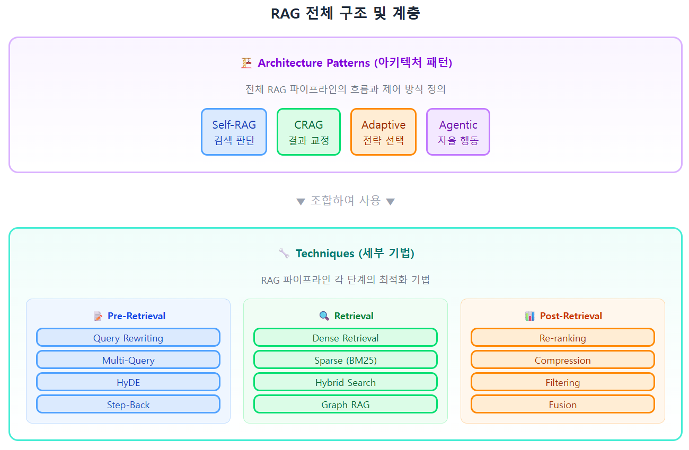
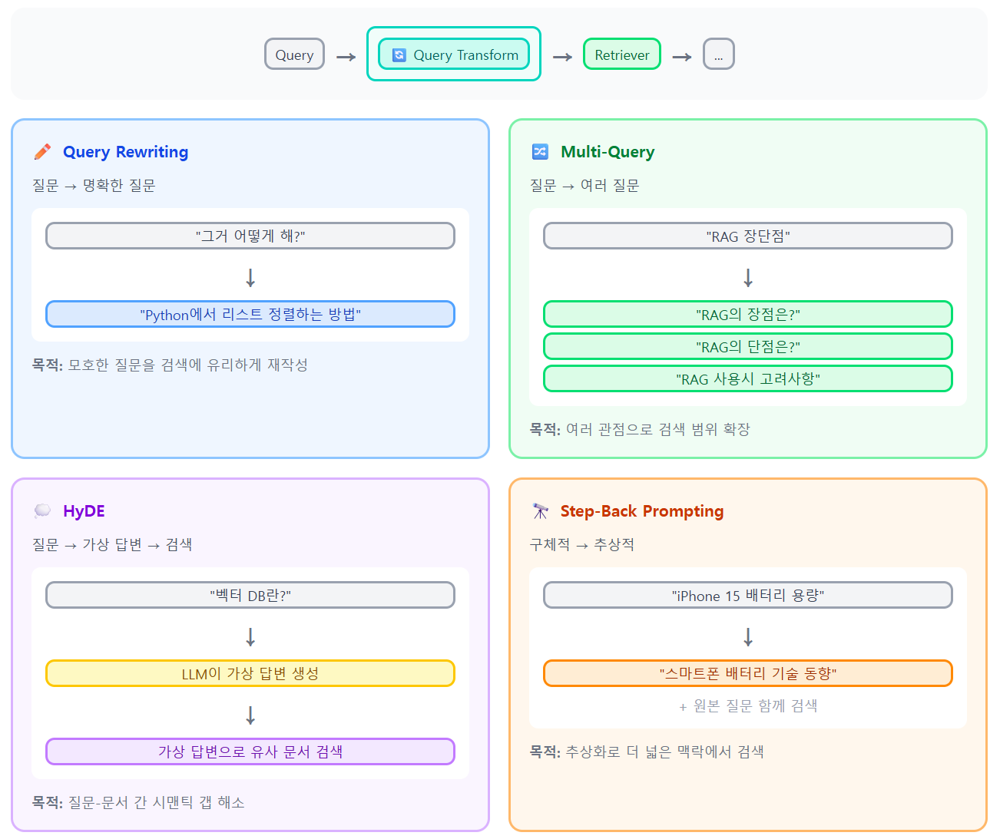
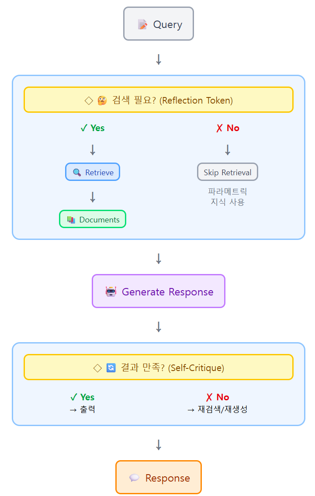
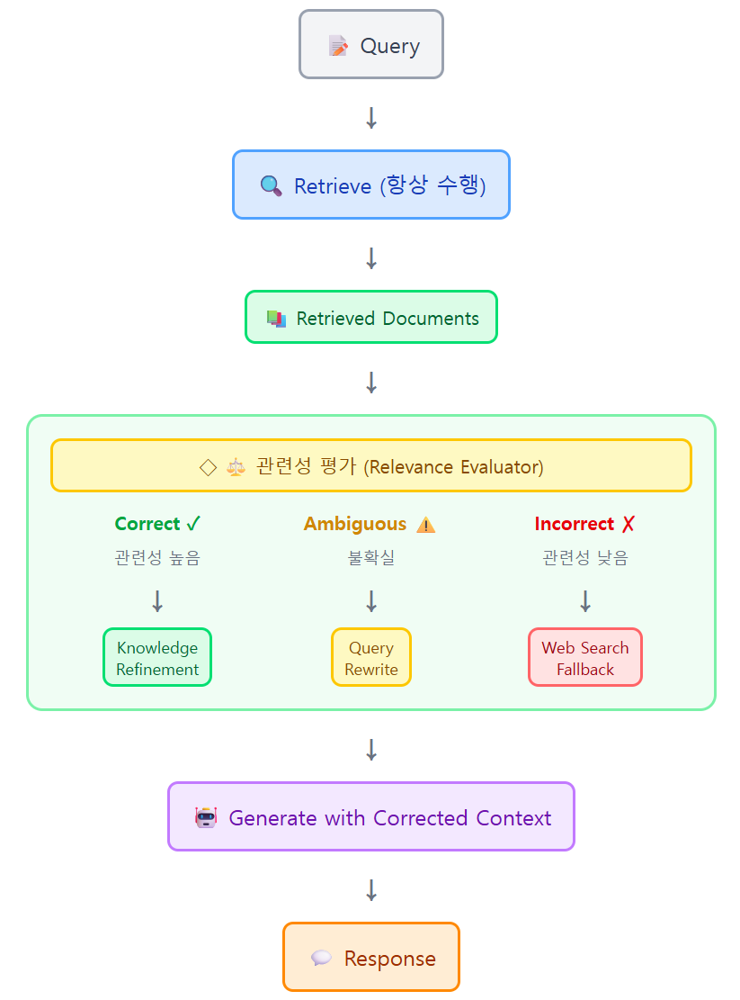
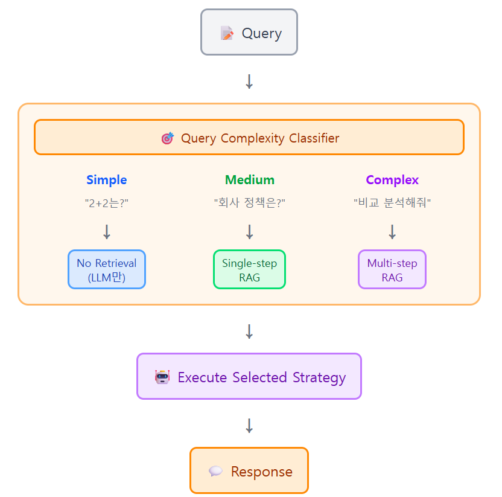
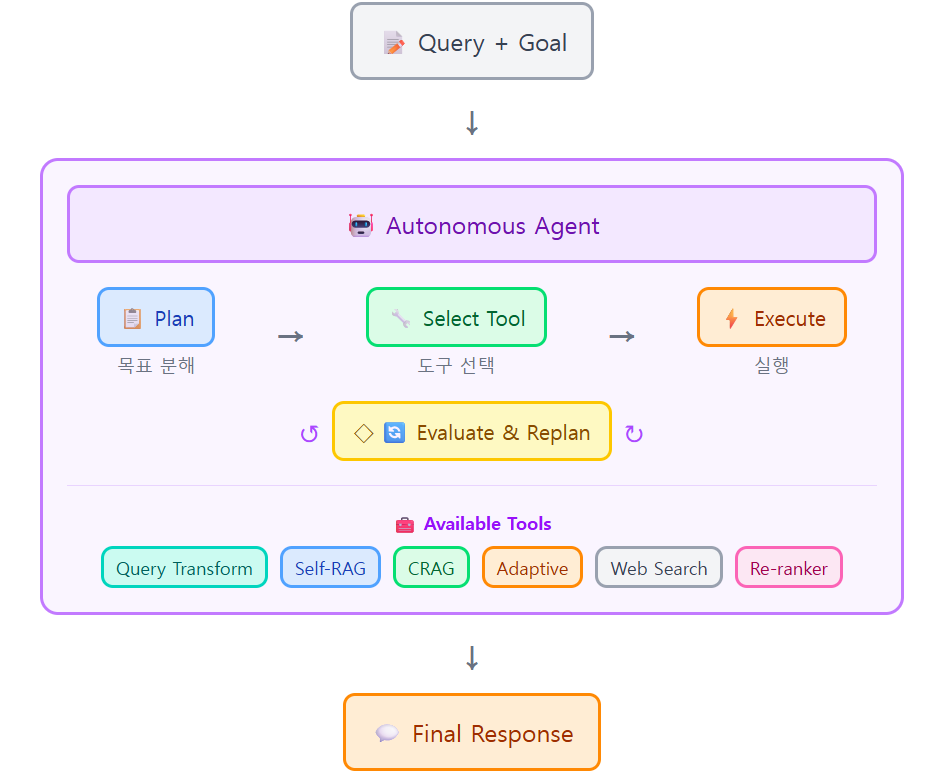

# 10. RAG (Retrieval-Augmented Generation)

> LangChain 기반 검색 증강 생성 가이드

- [10. RAG (Retrieval-Augmented Generation)](#10-rag-retrieval-augmented-generation)
  - [학습 목표](#학습-목표)
- [1. WHY - 왜 RAG가 필요한가?](#1-why---왜-rag가-필요한가)
  - [1.1 LLM의 현실적 한계](#11-llm의-현실적-한계)
  - [1.2 RAG가 제공하는 가치](#12-rag가-제공하는-가치)
  - [1.3 RAG 패러다임 분류](#13-rag-패러다임-분류)
- [2. RAG 파이프라인 기초](#2-rag-파이프라인-기초)
  - [2.1 Indexing (Load - Split - Embed - Store)](#21-indexing-load---split---embed---store)
    - [2.1.1 문서 로드 (Load)](#211-문서-로드-load)
    - [2.1.2 텍스트 분할 (Split / Chunking)](#212-텍스트-분할-split--chunking)
      - [왜 분할이 필요한가?](#왜-분할이-필요한가)
      - [RecursiveCharacterTextSplitter의 동작](#recursivecharactertextsplitter의-동작)
      - [chunk\_size 결정 가이드](#chunk_size-결정-가이드)
    - [2.1.3 임베딩이란?](#213-임베딩이란)
    - [2.1.4 벡터 데이터베이스](#214-벡터-데이터베이스)
  - [2.2 Retrieval (검색 메커니즘)](#22-retrieval-검색-메커니즘)
- [3. RAG 아키텍처](#3-rag-아키텍처)
- [4. Techniques - 세부 기법](#4-techniques---세부-기법)
  - [4.1 Pre-Retrieval](#41-pre-retrieval)
  - [4.2 Retrieval](#42-retrieval)
    - [4.2.1 Sparse Retrieval](#421-sparse-retrieval)
    - [4.2.2 Dense Retrieval](#422-dense-retrieval)
    - [4.2.3 Hybrid Search](#423-hybrid-search)
    - [4.2.4 GraphRAG 소개](#424-graphrag-소개)
  - [4.3 Post-Retrieval](#43-post-retrieval)
    - [Re-ranking](#re-ranking)
      - [동작 원리: Bi-Encoder vs Cross-Encoder](#동작-원리-bi-encoder-vs-cross-encoder)
      - [오픈소스 모델 (Self-hosted)](#오픈소스-모델-self-hosted)
      - [API 기반 모델 (상용)](#api-기반-모델-상용)
      - [선택 가이드](#선택-가이드)
      - [사용 예시 (BGE Reranker)](#사용-예시-bge-reranker)
      - [검색 전략: Retrieve More, Rerank Better](#검색-전략-retrieve-more-rerank-better)
    - [Compression](#compression)
    - [Filtering](#filtering)
    - [Fusion](#fusion)
- [5. Architecture Patterns - 아키텍처 패턴](#5-architecture-patterns---아키텍처-패턴)
    - [왜 패턴을 구분하는가?](#왜-패턴을-구분하는가)
  - [5.1 Basic RAG (Naive RAG)](#51-basic-rag-naive-rag)
  - [5.2 Self-RAG](#52-self-rag)
  - [5.3 CRAG (Corrective RAG)](#53-crag-corrective-rag)
  - [5.4 Adaptive RAG](#54-adaptive-rag)
  - [5.5 Agentic RAG](#55-agentic-rag)
- [6. 평가: RAGAS 지표](#6-평가-ragas-지표)
- [7. 프로덕션 고려사항](#7-프로덕션-고려사항)
- [8. 실습](#8-실습)
  - [8.0 인덱싱 프롬프트](#80-인덱싱-프롬프트)
  - [8.1 기본 RAG 구현](#81-기본-rag-구현)
  - [8.2 Query-transformation](#82-query-transformation)
  - [8.3 Hybrid search](#83-hybrid-search)
  - [8.4 Re-ranking](#84-re-ranking)
  - [8.5 Self-RAG](#85-self-rag)
- [Appendix](#appendix)
  - [A. 주요 라이브러리 설치](#a-주요-라이브러리-설치)
  - [B. 환경 변수 설정 (.env)](#b-환경-변수-설정-env)
  - [C. 참고 자료](#c-참고-자료)


---

## 학습 목표

- RAG의 개념과 필요성 이해
- RAG 파이프라인의 전체 흐름 파악 (Indexing → Retrieval → Generation)
- Query Transformation, Re-ranking 등 세부 기법 습득
- Architecture Patterns (Self-RAG, CRAG, Adaptive, Agentic) 비교 이해
- LangChain을 활용한 RAG 시스템 구현 및 평가 방법 학습

[Top](#10-rag-retrieval-augmented-generation)


---

# 1. WHY - 왜 RAG가 필요한가?

---

## 1.1 LLM의 현실적 한계

LLM은 방대한 지식을 보유하고 있으나 실전 적용 시 핵심 문제가 발생함

| 한계점 | 설명 |
|--------|------|
| **할루시네이션** | 모델이 모르는 내용에 대해 그럴싸한 거짓말을 생성 |
| **지식 단절** | 학습 데이터 마감 시점 이후의 최신 정보를 알지 못함 |
| **도메인 특화 어려움** | 기업 내부 문서나 비공개 데이터는 학습 데이터에 미포함 |

[Top](#10-rag-retrieval-augmented-generation)


---

## 1.2 RAG가 제공하는 가치

RAG는 LLM을 재학습시키지 않고도 외부 지식을 활용하게 함

| 가치 | 설명 |
|------|------|
| **정확성 및 신뢰성** | 답변의 근거가 되는 원본 문서를 참조하여 할루시네이션 억제 |
| **최신성 유지** | 데이터베이스 업데이트만으로 최신 정보를 즉시 반영 |
| **투명성** | 답변에 출처(Source Citation)를 명시하여 검증 가능성 제공 |
| **비용 효율성** | 파인튜닝 없이 기존 API를 활용하여 경제적으로 시스템 구축 |

[Top](#10-rag-retrieval-augmented-generation)


---

## 1.3 RAG 패러다임 분류

> **용어 출처**: Gao et al. (2023) 서베이 논문에서 정립된 학술 용어임  
> 논문: "Retrieval-Augmented Generation for Large Language Models: A Survey"  
> (arXiv:2312.10997)

| 학술 용어 | LangChain 공식 용어 | 설명 |
|-----------|---------------------|------|
| **Naive RAG** | 2-Step RAG | 문서 로드 → 검색 → 답변 생성의 단순 구조 |
| **Advanced RAG** | Hybrid RAG | 검색 전처리, 재정렬(Re-ranking) 등 최적화 포함 |
| **Modular RAG** | Agentic RAG | 에이전트가 검색 여부를 동적으로 판단 |

> **"Naive"의 의미**: 컴퓨터 과학에서 "단순/기본 구현"을 뜻함  
> (예: Naive Bayes). 최적화 없는 기초적인 접근 방식을 의미함

[Top](#10-rag-retrieval-augmented-generation)


---

# 2. RAG 파이프라인 기초

---

## 2.1 Indexing (Load - Split - Embed - Store)

데이터를 검색 가능한 형태로 변환하는 사전 준비 과정임

> **암기 팁: "불쪼임"** - 불러와서, 쪼개서, 임베딩하여 저장

| 단계 | 작업 내용 | 관련 컴포넌트 |
|------|----------|---------------|
| **Load (불러와서)** | PDF, HTML, DB 등 다양한 소스에서 텍스트 추출 | `DocumentLoader` |
| **Split (쪼개서)** | LLM 컨텍스트 크기에 맞춰 적절한 크기(Chunk)로 분할 | `TextSplitter` |
| **Embed (임베딩)** | 텍스트를 고차원 수치 벡터로 변환 | `Embeddings` |
| **Store (저장)** | 벡터와 원본 텍스트를 전용 DB에 저장 | `VectorStore` |

### 2.1.1 문서 로드 (Load)

RAG 시스템의 첫 단계는 다양한 소스에서 문서를 불러오는 것임

**LangChain DocumentLoader의 역할**:
- 파일/웹/DB 등 다양한 소스에서 텍스트 추출
- 메타데이터(출처, 페이지 번호 등)를 함께 보존
- 통일된 `Document` 객체로 변환

**주요 DocumentLoader 종류**:

| Loader | 용도 | 예시 |
|--------|------|------|
| `PyPDFLoader` | PDF 파일 | 법률 문서, 논문, 보고서 |
| `TextLoader` | 텍스트 파일 | .txt, .md 파일 |
| `CSVLoader` | CSV 파일 | 표 형식 데이터 |
| `WebBaseLoader` | 웹 페이지 | 블로그, 뉴스 기사 |
| `DirectoryLoader` | 폴더 전체 | 여러 파일 일괄 로드 |
| `UnstructuredLoader` | 복잡한 문서 | 이미지, 표가 섞인 문서 |

**코드 예시**:

```python
from langchain_community.document_loaders import PyPDFLoader

# PDF 로드
loader = PyPDFLoader("특허법.pdf")
documents = loader.load()

# 결과: Document 객체 리스트
# [Document(page_content="제1조(목적)...", metadata={"source": "특허법.pdf", "page": 0}), ...]
```

**Document 객체 구조**:

```python
Document(
    page_content="제42조(특허출원) ① 특허를 받으려는...",  # 텍스트 내용
    metadata={
        "source": "특허법.pdf",    # 출처 파일명
        "page": 7                  # page_content가 추출된 페이지 번호
    }
)
```

### 2.1.2 텍스트 분할 (Split / Chunking)

LLM 컨텍스트 크기 제한과 검색 효율을 위해 문서를 작은 조각(Chunk)으로 분할함

#### 왜 분할이 필요한가?

| 문제 | 해결 |
|------|------|
| LLM 컨텍스트 제한 | GPT-4o-mini는 128K 토큰이지만, 긴 문서는 여러 청크로 분할 필요 |
| 검색 정확도 | 큰 문서 전체보다 관련 부분만 검색하는 것이 정확함 |
| 비용 절감 | 필요한 부분만 LLM에 전달하여 토큰 비용 절감 |

#### RecursiveCharacterTextSplitter의 동작
**주요 파라미터**:

| 파라미터 | 설명 | 일반 권장값 |
|----------|------|-------------|
| chunk_size | 청크 최대 크기 (문자 수) | 500~1500 |
| chunk_overlap | 청크 간 겹침 (문자 수) | chunk_size의 10~20% |
| separators | 분할 우선순위 | 문서 구조에 맞게 커스텀 |


```python
from langchain.text_splitter import RecursiveCharacterTextSplitter

text_splitter = RecursiveCharacterTextSplitter(
    chunk_size=800,        # 청크 최대 크기
    chunk_overlap=200,     # 청크 간 겹치는 부분
    separators=[
        "\n제",            # 1순위: 조문 단위
        "\n①", "\n②",     # 2순위: 항 단위
        "\n\n",            # 3순위: 단락
        "\n",              # 4순위: 줄바꿈
        " "                # 5순위: 공백
    ]
)

chunks = text_splitter.split_documents(documents)
```

**separators의 역할**:

1. **우선순위 기반 분할**: 리스트 앞쪽 구분자부터 시도
2. **의미 보존**: 조문 → 항 → 단락 순서로 자연스럽게 분할
3. **재귀적 처리**: 큰 청크는 다음 구분자로 재분할

**예시**:

```
원본 (1500자):
"제42조(특허출원) ① 특허를 받으려는 자는... (700자)
② 제1항에 따른 특허출원서에는... (800자)"

분할 과정:
Step 1: "\n제"로 시도 → 1500자 (여전히 큼)
Step 2: "\n①"로 재분할 → 700자, 800자 (성공)

결과:
청크1: "제42조(특허출원) ① 특허를 받으려는 자는..." (700자)
청크2: "② 제1항에 따른 특허출원서에는..." (800자)
```

**chunk_overlap의 역할**:

```
청크1: [제42조 ① 특허를 받으려는 자는 다음 각 호의 사항을 기재한...]
청크2:                          [다음 각 호의 사항을 기재한... ② 제1항에...]
                                 ↑
                         200자 겹침 (overlap)
```

- **맥락 보존**: 청크 경계에서 잘린 문맥을 다음 청크에서도 볼 수 있음
- **검색 품질 향상**: "각 호의 사항"이 두 청크 모두에 있어 검색 누락 방지

#### chunk_size 결정 가이드

청크 크기는 **"검색 정밀도"와 "충분한 컨텍스트"** 사이의 균형점임

| 청크 크기 | 장점 | 단점 |
|-----------|------|------|
| **작음** (200~500) | 검색 정밀도 높음, 관련 부분만 정확히 찾음 | 문맥 부족, 여러 청크 필요 |
| **큼** (1000~2000) | 풍부한 문맥 제공 | 불필요한 내용 포함, 토큰 비용 증가 |

**도메인별 권장 chunk_size**:

| 도메인 | 권장 크기 | 이유 |
|--------|----------|------|
| **Q&A / FAQ** | 200~500 | 짧은 질답 쌍, 정밀한 매칭 필요 |
| **기술 문서** | 500~1000 | 함수/클래스 단위, 코드 블록 보존 |
| **법률 문서** | 500~1000 | 조문 단위, 항/호 맥락 유지 |
| **학술 논문** | 1000~1500 | 긴 문단, 인용/참조 맥락 필요 |
| **채팅 로그** | 200~400 | 대화 턴 단위 |

---

### 2.1.3 임베딩이란?

임베딩(Embedding)은 텍스트를 컴퓨터가 이해할 수 있는 숫자 배열(벡터)로 변환하는 기술임

**핵심 원리**:  
의미가 비슷한 단어는 벡터 공간에서 가까운 위치에 배치됨

```
"고양이" → [0.2, 0.8, 0.1, ...]  (1536차원 벡터)
"강아지" → [0.3, 0.7, 0.2, ...]  (고양이와 유사한 위치 - 둘 다 반려동물)
"자동차" → [0.9, 0.1, 0.4, ...]  (고양이와 먼 위치 - 의미가 다름)
```

> **Word2Vec의 유명한 예시**  
> 벡터(왕) - 벡터(남자) + 벡터(여자) ≈ 벡터(여왕)  
> → "왕:남자 = 여왕:여자"라는 의미적 관계가 벡터 연산으로 표현됨

> **벡터의 각 값은 무엇인가?**  
> 개념적으로 각 차원은 텍스트의 어떤 "특성"을 나타냄.  
> 단, 사람이 정의한 것이 아니라 신경망이 자동으로 학습한 추상적 특성임.  
> 예: "57번째 값이 무엇을 뜻하나요?" → 정확히 알 수 없음.  
> 중요한 것은 벡터 전체가 만드는 "의미 공간에서의 위치"임.

| 개념 | 설명 |
|------|------|
| **벡터** | 숫자들의 배열. 예: [0.1, 0.5, 0.3] |
| **차원** | 벡터의 길이. OpenAI는 1536차원, 일부 모델은 768차원 |
| **의미적 유사도** | 비슷한 의미의 문장은 벡터 공간에서 가까이 위치함 |
| **코사인 유사도** | 두 벡터 간 각도로 유사도 측정 (1에 가까울수록 유사) |

**주요 임베딩 모델**:   
| 모델 | 오픈/상용 | 제공사 | 크기 | 장점 | 단점 |
|------|-----------|--------|------|------|------|
| text-embedding-3 | 상용 | OpenAI | large, small | 안정적 API, 차원 축소 지원 | 다국어 성능 낮음 (41위) |
| gemini-embedding | 상용 | Google | - | 상용 API 중 최고 성능 (4위) | 최대 토큰 2048 제한 |
| Cohere embed | 상용 | Cohere | v3, v4, light | 다국어 강점 (18위), 128K (v4) | 영어 전용 모델 성능 낮음 |
| Voyage | 상용 | Voyage AI | 3.5, 3, lite | 도메인 특화 (코드/법률/금융), 32K | 범용 성능 중간 (28위) |
| KaLM-Embedding-Gemma3 | 오픈 | KaLM | 12B | 현재 SOTA (1위) | 고사양 GPU 필요 |
| llama-embed-nemotron | 오픈 | NVIDIA | 8B | 오픈소스 최상위 (2위) | 대용량 GPU 필요 |
| Qwen3-Embedding | 오픈 | Alibaba | 8B, 4B, 0.6B | 크기 대비 최고 (3~8위), 다양한 크기 | 대형 모델은 GPU 필요 |
| E5 | 오픈 | Microsoft | large, mistral-7b | MIT 라이센스, 다국어 우수 (11위) | prefix 필요 (query:/passage:) |
| BGE | 오픈 | BAAI | m3, large, small | 8K 토큰, 다국어, Dense+Sparse | 영어 전용 성능 중간 |
| embeddinggemma | 오픈 | Google | 300m | 경량 (12위), 무료 | 최대 토큰 2048 제한 |

**한국어 임베딩 추천 모델:**    
| 모델 | 출처 | 특징 | 추천 용도 |
|------|------|------|-----------|
| ko-sroberta-multitask | KoSentence | 한국어 특화 SBERT | 한국어 전용 |
| KoSimCSE | KAIST | SimCSE 한국어 버전 | 연구/실험 |
| **multilingual-e5-large-instruct** | Microsoft | MTEB 11위 | **다국어 최고** |
| **Qwen3-Embedding** | Alibaba | MTEB 3~8위 | **한중일 우수** |
| **bge-m3** | BAAI | MTEB 30위 | 다국어 검색 |
| Cohere embed-multilingual | Cohere | 상용 API | 간편한 API |
  
**MTEB 리더보드**    
Massive Text Embedding Benchmark는 임베딩 평가 테스트로 그 결과를 아래 리더보드에서 확인할 수 있음    
https://huggingface.co/spaces/mteb/leaderboard    

Top 3 평가 Task Types   
| 순위 | Task Type | 중요도 | 중요한 이유 |
|------|-----------|--------|-------------|
| 1 | **Retrieval** | ⭐⭐⭐⭐⭐ | RAG/검색이 임베딩 최대 활용처. 검색 품질 = 서비스 품질 |
| 2 | **STS** | ⭐⭐⭐⭐ | 의미 유사도 측정은 임베딩의 본질적 능력. 기초 역량 지표 |
| 3 | **Classification** | ⭐⭐⭐⭐ | 가장 보편적인 NLP 다운스트림 태스크. 전이 학습 품질 측정 |
       
참고) [임베딩 모델](https://github.com/cna-bootcamp/aistudy/blob/main/agentic-ai/reference/embedding-model.md) 참조   
  
### 2.1.4 벡터 데이터베이스

벡터 데이터베이스는 수억 개의 벡터 중 유사한 벡터를 빠르게 찾는 전용 저장소임

**일반 DB와의 차이**:
- 일반 DB: "이름 = '홍길동'" 처럼 정확한 값 검색
- 벡터 DB: "이 벡터와 가장 비슷한 벡터 Top 5" 검색  
  (ANN, Approximate Nearest Neighbor: 근사 최근접 이웃)

**주요 벡터 데이터베이스 비교**  

| DB | 유형 | 특징 | Use Case |
|----|------|------|----------|
| **ChromaDB** (크로마) | 오픈소스 (로컬/서버) | 설치 간편, Python 친화적, 메타데이터 필터링 지원 | 프로토타이핑, 소규모 프로젝트, 학습용 |
| **FAISS** (페이스) | 오픈소스 (로컬) | Meta 개발, 고속 유사도 검색, GPU 가속 지원 | 대규모 벡터 검색, 연구/실험 환경 |
| **Pinecone** (파인콘) | 관리형 클라우드 | 서버리스, 자동 스케일링, 실시간 인덱스 업데이트 | 프로덕션 서비스, 엔터프라이즈 환경 |
| **Weaviate** (위비에이트) | 오픈소스/클라우드 | GraphQL API, 하이브리드 검색, 모듈형 벡터화 | 복잡한 쿼리, 멀티모달 검색 |

> **선택 기준**  
> - **개발/학습**: ChromaDB (설치 간편, 무료)  
> - **대규모 실험**: FAISS (고성능, GPU 활용)  
> - **프로덕션**: Pinecone (관리 부담 최소화) 또는 Weaviate (유연성)

[Top](#10-rag-retrieval-augmented-generation)


---

## 2.2 Retrieval (검색 메커니즘)

사용자 질문과 가장 관련 있는 청크를 찾는 과정임

> **암기 팁: "문탐생"** - 문의 → 탐색 → 생성

| 단계 | 작업 | 설명 |
|------|------|------|
| **문 (문의)** | Query Embedding | 사용자 질문을 벡터로 변환 |
| **탐 (탐색)** | Similarity Search | 벡터 DB에서 유사한 문서 청크 Top K개 검색 |
| **생 (생성)** | Context Injection | 검색된 문서를 프롬프트에 삽입하여 LLM에 전달 |

[Top](#10-rag-retrieval-augmented-generation)


---

# 3. RAG 아키텍처   
  
  
**RAG 아키텍처 보기:** 아래 프롬프트 입력         
````
아래 명령을 수행한 후 URL을 얻은 후 웹브라우저로 오픈
```   
cd agentic-ai/tools/jsx-viewer
./run.sh ./jsx/rag-architecture.jsx
```
````

# 4. Techniques - 세부 기법

RAG 파이프라인 각 단계에서 적용할 수 있는 최적화 기법들임


---

## 4.1 Pre-Retrieval

검색 전 쿼리를 변환하여 검색 품질을 향상시키는 기법임

  
  
| 기법 | 변환 | 적합한 상황 |
|------|------|-------------|
| **Query Rewriting** | 질문 → 명확한 질문 | 모호하거나 구어체 질문 |
| **Multi-Query** | 질문 → 여러 질문 | 복합적 질문, 비교 분석 |
| **HyDE** | 질문 → 가상 답변 | 질문-문서 형식 차이가 클 때 |
| **Step-Back** | 구체적 → 추상적 | 배경 지식이 필요한 질문 |

**Query Rewriting**:
```
"그거 어떻게 해?" → "Python에서 리스트를 정렬하는 방법"
```

**Multi-Query**:
```
"RAG 장단점" → "RAG의 장점은?" + "RAG의 단점은?" + "RAG 사용시 고려사항"
```

**HyDE (Hypothetical Document Embeddings)**:
```
"벡터 DB란?" → LLM이 가상 답변 생성 → 가상 답변으로 유사 문서 검색
```

**Step-Back Prompting**:
```
"iPhone 15 배터리 용량" → "스마트폰 배터리 기술 동향" + 원본 질문 함께 검색
```

[Top](#10-rag-retrieval-augmented-generation)


---

## 4.2 Retrieval

| 검색 방식 | 특징 |
|-----------|------|
| **Sparse Retrieval** | 키워드 일치 기반 (BM25, TF-IDF). 정확한 용어 매칭에 강점 |
| **Dense Retrieval** | 의미적 유사성 기반 (임베딩 벡터). 맥락 파악에 강점 |
| **Hybrid Search** | 키워드와 의미 검색을 결합하여 양쪽의 장점 수용 |
| **Graph RAG** | Knowledge Graph와 벡터 검색을 결합. 관계 기반 추론 가능 |

> Sparse 와 Dense 이름의 유래  
> Sparse는 '희귀한' 이라는 뜻이고 Dense는 '밀집된'이라는 뜻   
> 벡터 표현 방식의 차이 때문임   
> Sparse Vector는 Vector값 중 해당되는 단어만 숫자 값이 있고 나머지는 0임. 즉 0이 아닌 것이 희귀함  
> Dense Vector는 Vector값 모두가 의미가 있는 숫자 값임  

### 4.2.1 Sparse Retrieval

**키워드 일치** 기반의 전통적인 검색 방식임

**BM25 (Best Matching 25)**:

가장 널리 쓰이는 Sparse Retrieval 알고리즘으로, TF-IDF의 개선 버전임

```
BM25 점수 = Σ IDF(q) × (TF × (k1 + 1)) / (TF + k1 × (1 - b + b × (문서길이/평균길이)))
```

| 요소 | 설명 |
|------|------|
| **TF (Term Frequency)** | 문서 내 검색어 출현 빈도 |
| **IDF (Inverse Document Frequency)** | 전체 문서에서 검색어의 희귀도 |
| **k1, b** | 하이퍼파라미터 (기본: k1=1.5, b=0.75) |

**LangChain 구현**:

```python
from langchain_community.retrievers import BM25Retriever

# 문서로부터 BM25 검색기 생성
bm25_retriever = BM25Retriever.from_documents(documents)
bm25_retriever.k = 5  # Top 5 반환

results = bm25_retriever.invoke("특허 출원 방법")
```

| 장점 | 단점 |
|------|------|
| 빠른 검색 속도 | 동의어/유의어 처리 불가 |
| 정확한 키워드 매칭 | 문맥 파악 어려움 |
| 임베딩 불필요 (비용 없음) | 오타에 취약 |

**적합한 상황**: 전문 용어가 많은 법률/의료 문서, 정확한 키워드 매칭이 중요한 경우

### 4.2.2 Dense Retrieval

**의미적 유사성** 기반의 검색 방식으로, 임베딩 벡터를 활용함

**동작 원리**:

```
Query: "특허 신청하는 방법"
         ↓ 임베딩
Query Vector: [0.12, -0.34, 0.56, ...]
         ↓ 코사인 유사도
Document Vectors와 비교 → Top K 반환
```

**LangChain 구현**:

```python
from langchain_openai import OpenAIEmbeddings
from langchain_community.vectorstores import FAISS

# 임베딩 및 벡터 저장소 생성
embeddings = OpenAIEmbeddings()
vectorstore = FAISS.from_documents(documents, embeddings)

# Dense Retriever 생성
dense_retriever = vectorstore.as_retriever(search_kwargs={"k": 5})

results = dense_retriever.invoke("특허 신청하는 방법")
# "특허 출원 방법" 문서도 검색됨 (의미적 유사성)
```

| 장점 | 단점 |
|------|------|
| 동의어/유의어 이해 | 임베딩 API 비용 발생 |
| 문맥 파악 가능 | 정확한 키워드 매칭 약함 |
| 오타에 강건함 | 인덱싱 시간 필요 |

**적합한 상황**: 자연어 질문, 의미 기반 검색이 필요한 경우

### 4.2.3 Hybrid Search

Sparse와 Dense 검색을 **결합**하여 양쪽의 장점을 취하는 방식임

**왜 Hybrid인가?**

| 질문 | Sparse (BM25) | Dense (임베딩) |
|------|---------------|----------------|
| "BM25 알고리즘" | ✅ 정확히 찾음 | △ 유사 개념도 반환 |
| "검색 잘하는 방법" | ✗ 키워드 없음 | ✅ 의미로 찾음 |
| "특허법 제42조" | ✅ 정확히 찾음 | △ 관련 조문도 반환 |

**RRF (Reciprocal Rank Fusion)**:

두 검색 결과의 순위를 결합하는 알고리즘임

```
RRF_score(d) = Σ 1 / (k + rank_i(d))

예시 (k=60):
문서 A: BM25 1위, Dense 3위 → 1/(60+1) + 1/(60+3) = 0.0164 + 0.0159 = 0.0323
문서 B: BM25 5위, Dense 1위 → 1/(60+5) + 1/(60+1) = 0.0154 + 0.0164 = 0.0318
→ 문서 A가 최종 상위
```

**LangChain 구현**:

```python
from langchain.retrievers import EnsembleRetriever
from langchain_community.retrievers import BM25Retriever

# Sparse Retriever (BM25)
bm25_retriever = BM25Retriever.from_documents(documents)
bm25_retriever.k = 5

# Dense Retriever (벡터 검색)
dense_retriever = vectorstore.as_retriever(search_kwargs={"k": 5})

# Hybrid: 두 검색기 결합
hybrid_retriever = EnsembleRetriever(
    retrievers=[bm25_retriever, dense_retriever],
    weights=[0.5, 0.5]  # 동일 가중치
)

results = hybrid_retriever.invoke("특허법 제42조 출원 방법")
```

**가중치 조정 가이드**:

| 상황 | BM25 가중치 | Dense 가중치 |
|------|-------------|--------------|
| 전문 용어가 많은 문서 | 0.6~0.7 | 0.3~0.4 |
| 자연어 질문이 주로 들어옴 | 0.3~0.4 | 0.6~0.7 |
| 균형 잡힌 검색 필요 | 0.5 | 0.5 |

| 장점 | 단점 |
|------|------|
| 키워드 + 의미 검색 모두 가능 | 두 검색기 관리 필요 |
| 검색 품질 향상 | 약간의 속도 저하 |
| 단일 방식의 약점 보완 | 가중치 튜닝 필요 |

### 4.2.4 GraphRAG 소개

GraphRAG는 Knowledge Graph와 벡터 검색을 결합한 Advanced RAG 기법임

**일반 RAG vs GraphRAG**:

| 구분 | 일반 RAG | GraphRAG |
|------|----------|----------|
| **검색 방식** | 의미적 유사도만 사용 | 유사도 + 엔티티 관계 탐색 |
| **장점** | 구현 간단 | 관계 기반 추론 가능 |
| **예시** | "삼성전자 주가" 검색 | "삼성전자의 자회사들" 관계 탐색 |

**Knowledge Graph 지원 DB**:

| DB | 특징 |
|----|------|
| **Neo4j** (네오포제이) | 대표적인 그래프 DB, 벡터 인덱스 지원 (v5.11+) |
| **ArangoDB** (아랑고) | 멀티모델 DB (그래프 + 문서 + 벡터) |

> **참고**: GraphRAG는 Knowledge Graph, 그래프 DB(Neo4j) 등  
> 선수 지식이 필요하여 별도 교재에서 상세히 다룰 예정임

[Top](#10-rag-retrieval-augmented-generation)


---

## 4.3 Post-Retrieval

1차 검색 결과를 더 정밀하게 처리하는 기법들임

| 기법 | 설명 | 목적 |
|------|------|------|
| **Re-ranking** | 검색 결과를 재정렬 | 관련성 높은 문서를 상위로 |
| **Compression** | 문서 내용을 압축/요약 | 토큰 비용 절감, 노이즈 제거 |
| **Filtering** | 관련 없는 문서 제거 | 품질 낮은 컨텍스트 배제 |
| **Fusion** | 여러 검색 결과 통합 | 다양한 소스의 결과 병합 |

### Re-ranking

1차 검색(Top 100) 결과를 더 정밀하게 재정렬(Top 5)하는 전용 모델임  
1차 검색보다 느리지만 정확도가 높은 Cross-Encoder 방식을 사용함

#### 동작 원리: Bi-Encoder vs Cross-Encoder

**실생활 비유로 이해하기**:

```
[Bi-Encoder] = 사진으로 집 찾기
1. 모든 집을 미리 사진 촬영 (문서 벡터화)
2. 내가 원하는 집 사진 준비 (질문 벡터화)
3. 사진끼리 비교해서 비슷한 집 100개 추출
→ 빠르지만 사진만 보고 판단 (실제 내부는 모름)

[Cross-Encoder] = 직접 방문해서 확인
1. 100개 집을 직접 방문
2. 나와 집이 함께 있을 때 얼마나 잘 맞는지 확인
3. 가장 잘 맞는 상위 10개 선정
→ 느리지만 정확함 (실제로 함께 있어봐야 알 수 있음)
```

**기술적 동작 방식**:

```
[Bi-Encoder - 1차 검색 (빠름, 대량 처리)]
질문: "특허 출원 방법은?"           → [Bi-Encoder] → [0.2, 0.8, 0.1, ...]
문서1: "특허 출원은 특허청에..."   → [Bi-Encoder] → [0.3, 0.7, 0.2, ...]
문서2: "상표 등록은..."            → [Bi-Encoder] → [0.1, 0.2, 0.9, ...]

코사인 유사도 계산:
  질문 ↔ 문서1 = 0.95 (높음)
  질문 ↔ 문서2 = 0.32 (낮음)
→ 문서1 선택

[Cross-Encoder - Re-ranking (느림, 정밀)]
["특허 출원 방법은?" + "특허 출원은 특허청에..."] → [Cross-Encoder] → 0.98
["특허 출원 방법은?" + "상표 등록은..."]         → [Cross-Encoder] → 0.21
→ 질문과 문서의 단어 간 상호작용까지 분석하여 더 정확한 점수 산출
```

| 구분 | Bi-Encoder (1차 검색) | Cross-Encoder (Re-ranking) |
|------|----------------------|---------------------------|
| 입력 | 질문, 문서 각각 독립 인코딩 | 질문+문서를 하나로 결합하여 입력 |
| 출력 | 벡터 (유사도 계산용) | 관련성 점수 (0~1) |
| 속도 | 빠름 (벡터 사전 계산) | 느림 (매번 쌍으로 계산) |
| 정확도 | 상대적 낮음 | 높음 (단어 간 상호작용 분석) |
| 용도 | 대량 문서에서 후보 추출 | 후보 문서 정밀 재정렬 |

#### 오픈소스 모델 (Self-hosted)

| 모델명 | 특징 | 추천 상황 |
|--------|------|-----------|
| **BAAI/bge-reranker-v2-m3** | 100개 이상 언어 지원, 다국어 환경에 최적화 | 범용 다국어 환경, 가성비 중시 |
| **dragonkue/bge-reranker-v2-m3-ko** | BGE-reranker-v2-m3 기반 한국어 최적화 튜닝 | 한국어 전용 서비스 |
| **BAAI/bge-reranker-v2-gemma** | gemma-2b 기반 LLM 리랭커, 영어/다국어 성능 우수 | 더 높은 정확도 필요 시 |
| **BAAI/bge-reranker-v2.5-gemma2-lightweight** | 토큰 압축, 레이어별 경량화 지원 | 리소스 제약 환경 |

#### API 기반 모델 (상용)

| 서비스 | 모델 | 특징 |
|--------|------|------|
| **Cohere** | rerank-v4.0-pro/fast | 100개 이상 언어 성능 학습, 한국어 포함 |
| **Jina AI** | jina-reranker-v2-base-multilingual | 100개 이상 언어 지원, 1024 토큰 컨텍스트 |
| **Jina AI** | jina-reranker-v3 | 한국어 73.83점 달성, 교착어 형태소 처리에 강점 |

#### 선택 가이드

- **효율성 우선** → `bge-reranker-v2-m3` 또는 경량화 모델의 낮은 레이어 사용
- **한국어 특화** → `dragonkue/bge-reranker-v2-m3-ko` (오픈소스) 또는 `jina-reranker-v3` (API)
- **최고 성능** → `bge-reranker-v2-gemma` 또는 레이어별 모델
- **엔터프라이즈** → Cohere `rerank-v4.0-pro` (SLA, 프라이빗 배포 옵션 제공)

#### 사용 예시 (BGE Reranker)

```python
from FlagEmbedding import FlagReranker

reranker = FlagReranker('dragonkue/bge-reranker-v2-m3-ko', use_fp16=True)
scores = reranker.compute_score([
    ['한국어 질문', '관련 문서 내용'],
    ['한국어 질문', '다른 문서 내용']
], normalize=True)
```

#### 검색 전략: Retrieve More, Rerank Better

1차 검색 범위를 넓게 잡고 Re-ranking으로 정밀하게 걸러내는 전략임

```
[검색 흐름]
사용자 질문 → 1차 검색 (Top 50~100) → Re-ranking → 최종 Top 5 → LLM
               ↑ 넓은 범위               ↑ 정밀 재정렬
```

| 파라미터 | 설명 | 권장값 |
|----------|------|--------|
| **INITIAL_K** | 1차 검색에서 가져올 문서 수 | 50~100 |
| **RERANK_K** | Re-ranking 후 최종 사용할 문서 수 | 3~5 |

**왜 넓게 검색하는가?**

- Bi-Encoder(1차 검색)는 빠르지만 정확도가 상대적으로 낮음
- 관련 문서가 상위권에서 누락될 수 있음
- 넓게 가져온 후 Cross-Encoder로 정밀하게 재정렬하면 recall과 precision 모두 향상

**INITIAL_K 설정 가이드**:

| INITIAL_K | 상황 |
|-----------|------|
| 20~30 | 응답 속도 우선, 간단한 질문 |
| 50~100 | 품질 우선 (권장), 복잡한 질문 |
| 100+ | 대규모 문서, 높은 recall 필요 시 |

**비용 관점**:

- INITIAL_K를 높여도 LLM에는 RERANK_K개만 전달됨
- 토큰 비용은 동일하게 유지됨
- Re-ranking 처리 시간만 약간 증가 (수십 ms 수준)


### Compression

검색된 문서의 내용을 압축하거나 요약하여 LLM에 전달함

**왜 필요한가?**
- 검색된 문서가 너무 길면 토큰 비용 증가
- 문서 내 질문과 무관한 내용이 노이즈로 작용
- LLM 컨텍스트 윈도우 제한

**주요 방식**:

| 방식 | 설명 |
|------|------|
| **Extractive** | 질문과 관련된 문장만 추출 |
| **Abstractive** | LLM으로 문서 내용을 요약 |
| **LLMChainExtractor** | LLM이 관련 부분만 선별 추출 |

```python
from langchain.retrievers import ContextualCompressionRetriever
from langchain.retrievers.document_compressors import LLMChainExtractor

# 압축기 설정
compressor = LLMChainExtractor.from_llm(llm)

# 압축 검색기 생성
compression_retriever = ContextualCompressionRetriever(
    base_compressor=compressor,
    base_retriever=retriever
)
```

### Filtering

관련성이 낮은 문서를 제거하여 컨텍스트 품질을 높임

**필터링 기준**:

| 기준 | 설명 |
|------|------|
| **유사도 임계값** | 코사인 유사도가 특정 값 이하인 문서 제거 |
| **메타데이터** | 날짜, 카테고리, 출처 등으로 필터링 |
| **중복 제거** | 내용이 유사한 문서 중 하나만 유지 |
| **길이 필터** | 너무 짧거나 긴 문서 제외 |

```python
# 유사도 임계값 필터링
retriever = vectorstore.as_retriever(
    search_kwargs={
        "k": 10,
        "score_threshold": 0.7  # 0.7 이상만 반환
    }
)

# 메타데이터 필터링
retriever = vectorstore.as_retriever(
    search_kwargs={
        "k": 5,
        "filter": {"category": "법률"}
    }
)
```

### Fusion

여러 검색 방식이나 쿼리의 결과를 통합하여 최종 문서 집합을 구성함

**Reciprocal Rank Fusion (RRF: 역순위 융합)**:

여러 검색 결과의 순위를 결합하여 최종 점수를 계산함

```
RRF_score = Σ (1 / (k + rank_i))
```

- `k`: 상수 (보통 60)
- `rank_i`: i번째 검색 결과에서의 순위

**활용 예시**:

| 시나리오 | 설명 |
|----------|------|
| **Hybrid Search** | Dense + Sparse 검색 결과 통합 |
| **Multi-Query** | 여러 변형 질문의 검색 결과 병합 |
| **Multi-Index** | 여러 벡터 DB의 결과 통합 |

```python
from langchain.retrievers import EnsembleRetriever

# Dense + Sparse 검색기 결합
ensemble_retriever = EnsembleRetriever(
    retrievers=[dense_retriever, sparse_retriever],
    weights=[0.5, 0.5]  # 가중치 설정
)
```

[Top](#10-rag-retrieval-augmented-generation)


---

# 5. Architecture Patterns - 아키텍처 패턴

전체 RAG 파이프라인의 흐름과 제어 방식을 정의하는 패턴들임

### 왜 패턴을 구분하는가?

Agentic RAG가 앞의 패턴들을 포함하는 상위 개념이지만, 패턴 구분이 필요한 이유:

**1. 비용/복잡도 트레이드오프**

| 패턴 | LLM 호출 | 구현 복잡도 | 적합 상황 |
|------|----------|-------------|-----------|
| Basic RAG | 1회 | 낮음 | 단순 Q&A, PoC |
| Self-RAG | 1~2회 | 중간 | 검색 필요 여부가 다양하고, 결과 품질이 대체로 양호 (교정 불필요) |
| CRAG | 2~3회 | 중간 | 검색 품질 불안정하여 재검색/웹 검색 등 적극적 교정 필요 |
| Adaptive | 2~4회 | 높음 | 쿼리 복잡도 다양 |
| Agentic | N회 | 최고 | 복잡한 멀티스텝 태스크 |

모든 상황에 Agentic RAG는 **과잉 설계**임. 요구사항에 맞는 최소 패턴 선택이 효율적

**2. Agentic RAG 설계 시 부품 선택**

```python
# Agentic RAG 내부 도구 설계 - 필요한 부품만 조합
tools = [
    검색_도구,           # 기본
    Self_RAG_판단,       # 선택: 검색 스킵 기능 필요?
    CRAG_교정,           # 선택: 쿼리 재작성/웹 검색 필요?
    Adaptive_라우터,     # 선택: 전략 분기 필요?
]
```

**3. 디버깅/최적화 용이**

문제 발생 시 어느 레이어 문제인지 파악 가능:
- 검색 결과가 나쁨 → CRAG 교정 로직 점검
- 불필요한 검색 → Self-RAG 판단 로직 점검
- 전략 선택 오류 → Adaptive 라우터 점검

> **패턴 구분 = Agentic RAG의 부품 카탈로그**
> 필요한 부품만 조합해서 **적정 복잡도의 시스템**을 설계하기 위함

```
┌─────────────────────────────────────────────────────────────┐
│  Architecture Patterns (아키텍처 패턴)                       │
├─────────────────────────────────────────────────────────────┤
│                                                             │
│  Self-RAG      │  CRAG         │  Adaptive    │  Agentic   │
│  ──────────    │  ────         │  ────────    │  ───────   │
│  검색 판단     │  결과 교정    │  전략 선택   │  자율 행동 │
│                                                             │
└─────────────────────────────────────────────────────────────┘
```

**아키텍처 패턴 비교**:

| 구분 | Self-RAG | CRAG | Adaptive | Agentic |
|------|----------|------|----------|---------|
| **핵심 질문** | 검색할까? | 결과 맞나? | 어떤 전략? | 어떻게 행동? |
| **작동 시점** | 검색 전 | 검색 후 | 라우팅 시 | 전체 과정 |
| **자율성** | ⭐⭐ | ⭐⭐ | ⭐⭐⭐ | ⭐⭐⭐⭐⭐ |

---

## 5.1 Basic RAG (Naive RAG)

단순 검색 → 생성의 단방향 파이프라인임

```
Query → Retriever → Documents → LLM Generator → Response
```

**한계점**:
- 항상 검색 수행 (불필요한 검색)
- 검색 결과 품질 검증 없음
- 단일 검색 전략만 사용
- Query Transformation 없음

[Top](#10-rag-retrieval-augmented-generation)


---

## 5.2 Self-RAG

모델이 **스스로 검색 필요 여부를 판단**하고, 검색 결과와 생성된 답변을 **자체 검증**하는 기법임
   

```
Query → [Retrieve] 검색 필요? 
         ↓ Yes              ↓ No
        검색 수행         직접 답변 (파라메트릭 지식)
         ↓
        [IsRel] 관련 있는 문서?
         ↓ Yes
        답변 생성 → [IsSup] 답변이 문서에 근거?
                     ↓ Yes
                    [IsUse] 답변이 유용? → 최종 출력
```

**Reflection Tokens**:

| 토큰 | 역할 |
|------|------|
| `[Retrieve]` | 검색이 필요한지 판단 |
| `[IsRel]` | Is Relevant: 검색된 문서가 질문과 관련 있는지 평가 |
| `[IsSup]` | Is Supportive: 생성된 답변이 문서에 근거하는지 검증 |
| `[IsUse]` | Is Usefule: 최종 답변이 유용한지 평가 |

[Top](#10-rag-retrieval-augmented-generation)


---

## 5.3 CRAG (Corrective RAG)

검색 결과의 **관련성을 평가하고 교정**하는 기법임

   
  
```
Query → Retrieve (항상 수행) → Documents
                                 ↓
                     [Relevance Evaluator] 관련성 평가
                     ↓           ↓           ↓
                  Correct    Ambiguous    Incorrect
                     ↓           ↓           ↓
                 Knowledge    Query      Web Search
                 Refinement   Rewrite    Fallback
                     ↓           ↓           ↓
                     └───────────┴───────────┘
                                 ↓
                         Generate Response
```

**Self-RAG와 차이점**:

| 구분 | Self-RAG | CRAG |
|------|----------|------|
| 검색 수행 | 조건부 (필요시만) | 항상 수행 |
| 품질 검증 | ✅ 있음 (`[IsRel]`, `[IsSup]`) | ✅ 있음 (Relevance Evaluator) |
| 검증 방식 | 모델 내장 토큰 (Fine-tuning 필요) | 별도 Evaluator (프롬프트 기반) |
| **교정 액션** | ❌ 없음 | ✅ Query Rewrite, Web Search Fallback |

- **공통점**: 둘 다 검색 결과 품질을 검증함
- **핵심 차이**: CRAG는 품질이 낮을 때 **적극적으로 교정**(쿼리 재작성, 웹 검색 등)하지만,
  Self-RAG는 낮은 품질 점수를 반환할 뿐 교정 액션 없음

[Top](#10-rag-retrieval-augmented-generation)


---

## 5.4 Adaptive RAG

쿼리 복잡도에 따라 **전략을 동적으로 선택**하는 기법임
  
  
```
Query → [Query Complexity Classifier]
              ↓           ↓           ↓
           Simple      Medium      Complex
           "2+2는?"   "회사 정책은?" "비교 분석해줘"
              ↓           ↓           ↓
         No Retrieval  Single-step   Multi-step
          (LLM만)        RAG           RAG
              ↓           ↓           ↓
              └───────────┴───────────┘
                          ↓
                   Execute Strategy → Response
```

**핵심**: 단순 쿼리는 빠르게, 복잡 쿼리는 정밀하게 처리

[Top](#10-rag-retrieval-augmented-generation)


---

## 5.5 Agentic RAG

자율적 에이전트가 **계획-실행-평가를 반복**하며 문제를 해결하는 기법임
  
  
```
Query + Goal → [Autonomous Agent]
                      ↓
               ┌──────────────────────────────┐
               │  Plan → Select Tool → Execute │
               │           ↑          ↓        │
               │           └── Evaluate ───┘   │
               └──────────────────────────────┘
                      ↓
               Available Tools:
               - Query Transform
               - Self-RAG / CRAG
               - Web Search
               - Re-ranker
               - Calculator
                      ↓
               Final Response
```

**핵심 구성 요소**:

| 요소 | 역할 |
|------|------|
| **Router** | 질문 유형에 따라 검색/직접답변/도구호출 결정 |
| **ReAct 패턴** | Reasoning + Acting을 반복하며 문제 해결 |
| **Multi-hop Retrieval** | 복잡한 질문을 여러 단계로 나누어 순차 검색 |
| **Tool Calling** | 검색 외에 계산기, API, 코드 실행 등 다양한 도구 활용 |

**특징**: 다른 RAG 기법들을 **하위 도구로 활용**할 수 있음


**Router (라우터)**:

질문을 분석하여 **적절한 처리 경로를 선택**하는 컴포넌트임

```
질문 → Router → [경로 1] 벡터 검색 → 답변
              → [경로 2] 키워드 검색 → 답변
              → [경로 3] 직접 답변 (검색 불필요)
              → [경로 4] 외부 API 호출 → 답변
```

| 유형 | 방식 | 특징 |
|------|------|------|
| **Semantic Router** | 질문 임베딩과 경로별 예시 임베딩 비교 | 빠름, 사전 정의된 경로 필요 |
| **LLM Router** | LLM이 질문을 분석하여 경로 결정 | 유연함, 지연시간 있음 |

- **효과**: 질문 유형에 맞는 최적의 처리 방식을 선택하여 정확도와 효율성 향상
- **LangChain**: `RouterRunnable`, LangGraph의 조건부 엣지(Conditional Edge)

**ReAct 패턴**:

**Reasoning(추론)과 Acting(행동)을 번갈아 수행**하며 문제를 해결하는 패턴임

```
[ReAct 동작 흐름]
질문: "2024년 삼성전자 영업이익이 전년 대비 얼마나 증가했나?"

Thought 1: 2024년 삼성전자 영업이익을 먼저 찾아야 함
Action 1: search("2024년 삼성전자 영업이익")
Observation 1: 2024년 영업이익 35조원

Thought 2: 2023년 영업이익도 필요함
Action 2: search("2023년 삼성전자 영업이익")
Observation 2: 2023년 영업이익 6.5조원

Thought 3: 이제 증가율을 계산할 수 있음
Action 3: calculate((35-6.5)/6.5 * 100)
Observation 3: 438%

Final Answer: 2024년 삼성전자 영업이익은 전년 대비 약 438% 증가함
```

- **효과**: 복잡한 질문을 단계별로 분해하여 해결, 추론 과정이 투명하게 드러남
- **출처**: Yao et al. (2022), "ReAct: Synergizing Reasoning and Acting in Language Models"
- **LangChain**: `create_react_agent()`, LangGraph로 커스텀 구현 가능

**Multi-hop Retrieval**:

**여러 번의 검색을 순차적으로 수행**하여 복잡한 질문에 답하는 기법임

```
[단일 검색의 한계]
질문: "BTS 리더가 졸업한 대학의 설립자는 누구인가?"
→ 단일 검색으로는 답변 불가

[Multi-hop Retrieval]
Hop 1: "BTS 리더는 누구?" → RM (김남준)
Hop 2: "RM이 졸업한 대학은?" → 글로벌사이버대학교
Hop 3: "글로벌사이버대학교 설립자는?" → 이원희
→ 최종 답변: 이원희
```

- **효과**: 단일 검색으로 해결 불가능한 다단계 추론 질문에 효과적
- **구현**: LangGraph의 반복 노드, 또는 ReAct 패턴과 결합하여 구현

**Tool Calling (도구 호출)**:

LLM이 **외부 도구(함수)를 직접 호출**하여 검색 외의 작업을 수행하는 기능임

```
[Tool Calling 동작]
질문: "오늘 서울 날씨 알려줘"

LLM 판단: weather_api 도구 호출 필요
→ Tool Call: weather_api(city="서울")
→ Tool Result: {"temp": 15, "condition": "맑음"}
→ LLM 답변: "오늘 서울은 15도이며 맑은 날씨입니다"
```

| 도구 유형 | 예시 |
|-----------|------|
| **검색 도구** | 벡터 검색, 웹 검색, SQL 쿼리 |
| **계산 도구** | 수학 계산, 단위 변환 |
| **API 도구** | 날씨 API, 주식 API, 번역 API |
| **코드 실행** | Python 코드 실행, 데이터 분석 |

- **효과**: LLM의 한계(실시간 정보, 정확한 계산)를 외부 도구로 보완
- **출처**: OpenAI Function Calling (2023), 이후 표준화됨
- **LangChain**: `@tool` 데코레이터, `bind_tools()`, `ToolNode`

**활용 예시**:

```
질문: "애플 주가가 작년 대비 얼마나 올랐어?"

[기존 RAG]
→ 문서 검색 → 관련 문서 없음 → 부정확한 답변

[Agentic RAG]
→ 에이전트 판단: "실시간 데이터 필요"
→ 주식 API 호출 → 현재가 조회
→ 문서 검색 → 작년 주가 정보 검색
→ 계산 도구 → 상승률 계산
→ 정확한 답변 생성
```

- **효과**: 복잡한 질문, 실시간 데이터, 다단계 추론이 필요한 태스크에 효과적임
- **출처**: LangChain/LangGraph (2024), 다양한 에이전트 프레임워크에서 구현
- **구현**: LangGraph, CrewAI, AutoGen 등 에이전트 프레임워크 활용

> **참고**: Agentic RAG는 AI 에이전트 개발의 핵심 패턴이며,  
> 이후 에이전트 교재에서 LangGraph를 활용한 구현을 상세히 다룰 예정임

[Top](#10-rag-retrieval-augmented-generation)

  
---

# 6. 평가: RAGAS 지표

RAG 시스템의 성능을 정량적으로 측정하는 프레임워크임

| 지표 | 측정 대상 | 설명 |
|------|----------|------|
| **Context Precision** | 검색 정밀도 | 검색 결과에서 질문 연관 청크가 얼마나 상위에 있나?
 |
| **Context Recall** | 검색 재현율 | 검색 결과의 청크에 정답이 얼마나 많이 존재하는가? |
| **Faithfulness** | 근거성 | 생성된 답변이 검색된 컨텍스트에 기반하고 있는가 |
| **Answer Relevance** | 답변 적절성 | 답변이 사용자의 질문에
얼마나 관련 되는가? |

**암기팁:위-정-출-관**    
**위**에 깔리고 **정**답 많이 있고, **출**처와 **관**련도가 높은가?   

---

# 7. 프로덕션 고려사항

실제 서비스 운영 시 검토해야 할 요소들임

| 항목 | 설명 |
|------|------|
| **인덱싱 업데이트 전략** | 데이터 변경 시 실시간 반영 또는 배치 처리 |
| **청킹 전략 최적화** | 문서 구조에 따른 최적의 분할 지점 탐색 |
| **메타데이터 필터링** | 날짜, 카테고리 등 속성 기반 검색 범위 제한 |
| **보안 및 권한** | 사용자별 접근 권한에 따른 문서 필터링 |
 
---

# 8. 실습

---

## 8.0 인덱싱 프롬프트

`hands-on/10.rag/data` 디렉토리의 문서를 임베딩하여 공용 벡터 DB를 구축하는 프롬프트임  
8.1 이후 실습 예제들은 이 벡터 DB를 공유하여 검색에 활용함

**요청 프롬프트:**
```
[목표]
특허법 PDF 문서를 임베딩하여 공용 벡터 DB 구축
[역할]
당신은 LangChain 전문 개발자임
[입력]
- 임베딩 대상 문서: hands-on/10.rag/data 디렉토리에 존재하는 PDF 문서
- RAG 교재: agentic-ai/textbook/10.RAG.md
[처리]
- RAG 교재 이해
- 인덱싱 예제 개발
  - 파이프라인: PDF 로드 → 전처리 → 청킹 → 임베딩 → 벡터 DB 저장
  - 임베딩 모델: OpenAI text-embedding-3-small (1536차원)
  - 벡터 DB: ChromaDB (로컬 저장, hands-on/10.rag/vectordb 디렉토리에 영속화)
  - 청킹: RecursiveCharacterTextSplitter (chunk_size=800, chunk_overlap=200)
  - 메타데이터: source(파일명), chunk_index, total_chunks, char_count 저장
  - 설치할 라이브러리는 requirements.txt에 작성
  - 환경변수 참조: hands-on/.env
- 테스트 및 버그 Fix
- README.md 작성
  - 소스 코드 설명 (주요 함수, 처리 흐름)
  - 가상환경 설정 및 실행 방법
[출력]
- 프로그램: hands-on/10.rag/indexing/indexing.py
- 벡터 DB: hands-on/10.rag/vectordb
- README: hands-on/10.rag/indexing/README.md
- 의존성 정의: hands-on/10.rag/indexing/requirements.txt
[제약사항]
- MUST: requirements.txt 파일 내 주석은 영문으로 작성
```

[Top](#10-rag-retrieval-augmented-generation)

  
---

## 8.1 기본 RAG 구현
https://github.com/cna-bootcamp/aistudy/tree/main/hands-on/10.rag/naive

**테스트 질의어:**
```
특허를 받을 수 있는 조건은 ?
```
  
**요청 프롬프트:**
```
[목표]
LangChain 기반 Naive RAG 예제 개발
[역할]
당신은 LangChain 전문 개발자임
[입력]
- 공용 벡터 DB: hands-on/10.rag/vectordb (8.0 인덱싱으로 구축)
- RAG 교재: agentic-ai/textbook/10.RAG.md
[처리]
- RAG 교재 이해
- 예제 개발
  - 임베딩하지 않고 공용 벡터 DB(hands-on/10.rag/vectordb)를 로드하여 검색
  - 설치할 라이브러리는 requirements.txt에 작성
  - LLM 모델은 Groq LPU의 openai/gpt-oss-120b 모델 사용
  - 환경변수 참조: hands-on/.env
- 테스트 및 버그 Fix
- README.md 작성
  - 소스 코드 설명 (주요 함수, 처리 흐름)
  - 가상환경 설정 및 실행 방법
[출력]
- 프로그램: hands-on/10.rag/naive/naive_rag.py
- README: hands-on/10.rag/naive/README.md
- 의존성 정의: hands-on/10.rag/naive/requirements.txt
[제약사항]
- MUST: (중요) requirements.txt 파일 내 주석은 영문으로 작성
```

[Top](#10-rag-retrieval-augmented-generation)

  
---

## 8.2 Query-transformation 

https://github.com/cna-bootcamp/aistudy/tree/main/hands-on/10.rag/query-transformation

**테스트 질의어:**
```
특허 어떻게 받어?
```
   
**요청 프롬프트:**
```
[목표]
Query Transfomer 기법들을 이용한 예제 개발
[역할]
당신은 RAG기반 AI앱 개발자임
[입력]
- Naive RAG 예제: hands-on/10.rag/naive/naive_rag.py
- 공용 벡터 DB: hands-on/10.rag/vectordb (8.0 인덱싱으로 구축)
- RAG 교재: agentic-ai/textbook/10.RAG.md
[처리]
- Naive RAG 예제 분석 및 이해
- RAG 교재 이해
- 임베딩하지 않고 공용 벡터 DB(hands-on/10.rag/vectordb)를 로드하여 검색
- 예제 개발: 각 기법별로 에이젼트를 호출하여 병렬로 개발 
  - Query Transfomer 기법: Query Rewriting, Multi-Query, HyDE, Step-Back  
  - {PRJ_DIR}: query-rewriting/multi-query/hyde/step-back 중 하나 
  - 설치할 라이브러리는 각 {PRJ_DIR}하위의 requirements.txt에 작성 
  - LLM 모델은 Groq LPU의 openai/gpt-oss-120b 모델 사용 
  - 환경변수 참조: hands-on/.env
- 테스트 및 버그 Fix: 각 기법별로 에이젼트를 호출하여 병렬로 수행 
- README.md 작성: 각 기법별로 에이젼트를 호출하여 병렬로 작성 
  - 소스 코드 설명 (주요 함수, 처리 흐름)
  - 가상환경 설정 및 실행 방법
[출력]
- 프로그램: hands-on/10.rag/query-transformation/{PRJ_DIR}/app.py
- README: hands-on/10.rag/query-transformation/{PRJ_DIR}/README.md
- 의존성 정의: hands-on/10.rag/query-transformation/{PRJ_DIR}/requirements.txt
[제약사항]
- MUST: requirements.txt 파일 내 주석은 영문으로 작성  
```

[Top](#10-rag-retrieval-augmented-generation)


---

## 8.3 Hybrid search 

https://github.com/cna-bootcamp/aistudy/tree/main/hands-on/10.rag/hybrid-search

**테스트 질의어:**
```
특허를 받을 수 있는 조건은 ?
```
   
**요청 프롬프트:**
```
[목표]
결과 품질을 높이기 위해 BM25을 이용한 Hybrid Search 예제 개발
[역할]
당신은 RAG기반 AI앱 개발자임
[입력]
- Naive RAG 예제: hands-on/10.rag/naive/naive_rag.py
- 공용 벡터 DB: hands-on/10.rag/vectordb (8.0 인덱싱으로 구축)
- RAG 교재: agentic-ai/textbook/10.RAG.md
[처리]
- Naive RAG 예제 분석 및 이해
- RAG 교재 이해
- 임베딩하지 않고 공용 벡터 DB(hands-on/10.rag/vectordb)를 로드하여 검색
- 예제 개발 
  - 설치할 라이브러리는 requirements.txt에 작성 
  - LLM 모델은 Groq LPU의 openai/gpt-oss-120b 모델 사용 
  - 환경변수 참조: hands-on/.env
- 테스트 및 버그 Fix 
- README.md 작성
  - 소스 코드 설명 (주요 함수, 처리 흐름)
  - 가상환경 설정 및 실행 방법
[출력]
- 프로그램: hands-on/10.rag/hybrid-search/app.py
- README: hands-on/10.rag/hybrid-search/README.md
- 의존성 정의: hands-on/10.rag/hybrid-search/requirements.txt
[제약사항]
- MUST:
  - (중요) requirements.txt 파일 내 주석은 영문으로 작성
  - 'EnsembleRetriever'는 langchain_classic.retrievers에 있는것 사용 
```

[Top](#10-rag-retrieval-augmented-generation)


---

## 8.4 Re-ranking  
https://github.com/cna-bootcamp/aistudy/tree/main/hands-on/10.rag/re-ranking
   
**테스트 질의어:**
```
특허를 받을 수 있는 조건은 ?
```
  
**요청 프롬프트:**
```
[목표]
Re-ranking모델을 이용한 예제 개발
[역할]
당신은 RAG 기반 AI앱 개발 전문가임
[입력]
- Naive RAG 예제: hands-on/10.rag/naive/naive_rag.py
- 공용 벡터 DB: hands-on/10.rag/vectordb (8.0 인덱싱으로 구축)
- RAG 교재: agentic-ai/textbook/10.RAG.md
[처리]
- Naive RAG 예제 분석 및 이해
- RAG 교재 이해
- 임베딩하지 않고 공용 벡터 DB(hands-on/10.rag/vectordb)를 로드하여 검색
- 예제 개발
  - Re-ranking모델: dragonkue/bge-reranker-v2-m3-ko
  - 설치할 라이브러리는 requirements.txt에 작성 
  - LLM 모델은 Groq LPU의 openai/gpt-oss-120b 모델 사용 
  - 환경변수 참조: hands-on/.env
- 테스트 및 버그 Fix
- README.md 작성
  - 소스 코드 설명 (주요 함수, 처리 흐름)
  - 가상환경 설정 및 실행 방법
[출력]
- 프로그램: hands-on/10.rag/re-ranking/app.py
- README: hands-on/10.rag/re-ranking/README.md
- 의존성 정의: hands-on/10.rag/re-ranking/requirements.txt
[제약사항]
- MUST:
  - (중요) requirements.txt 파일 내 주석은 영문으로 작성
```

[Top](#10-rag-retrieval-augmented-generation)


---

## 8.5 Self-RAG

https://github.com/cna-bootcamp/aistudy/tree/main/hands-on/10.rag/self-rag
  
**테스트 질의어:**    
1)검색 불필요
```
안녕하세요?
```

```
개인정보보호법의 정의와 범위는 ?
```
  
2)검색 필요
```
특허를 받을 수 있는 조건은 ?
```
  
**요청 프롬프트:**
```
[목표]
Self-RAG 아키텍처 패턴 예제 개발
[역할]
당신은 RAG 기반 AI앱 개발 전문가임
[입력]
- Naive RAG 예제: hands-on/10.rag/naive/naive_rag.py
- 공용 벡터 DB: hands-on/10.rag/vectordb (8.0 인덱싱으로 구축)
- RAG 교재: agentic-ai/textbook/10.RAG.md
[처리]
- Naive RAG 예제 분석 및 이해
- RAG 교재 이해
- 임베딩하지 않고 공용 벡터 DB(hands-on/10.rag/vectordb)를 로드하여 검색
- 예제 개발
  - 설치할 라이브러리는 requirements.txt에 작성
  - LLM을 이용한 관련성 평가 시 검색결과 문서들을 묶어서 한번의 LLM 호출로 평가  
  - 검색 유용성 평가에 실패하면 Query rewriting 하여 처음부터 다시 하도록 함. 단, 재시도 횟수는 최대 3회로 함
  - LLM 모델은 Groq LPU의 openai/gpt-oss-120b 모델 사용 
  - 환경변수 참조: hands-on/.env
- 테스트 및 Bug Fix
- README.md 작성
  - 소스 코드 설명 (주요 함수, 처리 흐름)
  - 가상환경 설정 및 실행 방법
[출력]
- 프로그램: hands-on/10.rag/self-rag/app.py
- README: hands-on/10.rag/self-rag/README.md
- 의존성 정의: hands-on/10.rag/self-rag/requirements.txt
[제약사항]
- MUST:
  - (중요) requirements.txt 파일 내 주석은 영문으로 작성
```

[Top](#10-rag-retrieval-augmented-generation)

  
---

# Appendix

---

## A. 주요 라이브러리 설치

```bash
pip install langchain langchain-openai faiss-cpu chromadb
```

[Top](#10-rag-retrieval-augmented-generation)


---

## B. 환경 변수 설정 (.env)

```text
OPENAI_API_KEY=sk-...
```

[Top](#10-rag-retrieval-augmented-generation)


---

## C. 참고 자료

- **LangChain RAG 가이드**: https://python.langchain.com/docs/tutorials/rag/
- **RAGAS 공식 문서**: https://docs.ragas.io/
- **Self-RAG 논문**: Asai et al. (2023), ICLR 2024
- **CRAG 논문**: Yan et al. (2024)
- **Step-Back Prompting**: Google DeepMind (2023)

[Top](#10-rag-retrieval-augmented-generation)


---
