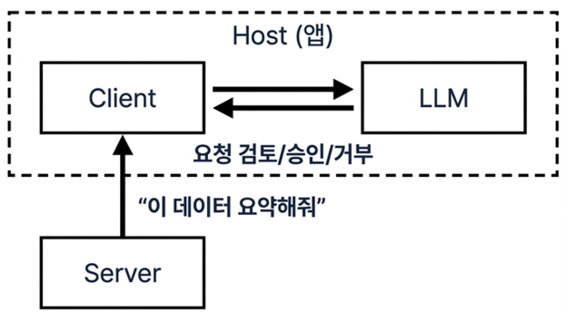
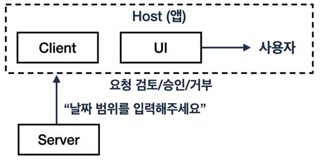
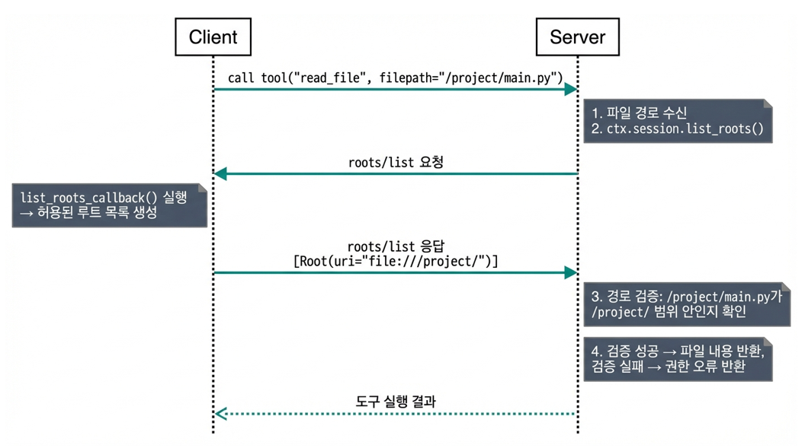

# 16. MCP (Model Context Protocol)

> MCP의 개념, 아키텍처, 구현 방법을 정리한 문서

- [16. MCP (Model Context Protocol)](#16-mcp-model-context-protocol)
  - [학습 목표](#학습-목표)
- [1. WHY - 왜 MCP인가?](#1-why---왜-mcp인가)
  - [1.1 MCP란 무엇인가](#11-mcp란-무엇인가)
  - [1.2 MCP가 필요한 3가지 이유](#12-mcp가-필요한-3가지-이유)
    - [1) 앱-도구 간 인터페이스 표준화](#1-앱-도구-간-인터페이스-표준화)
    - [2) 프레임워크 비종속](#2-프레임워크-비종속)
    - [3) 풍부한 생태계](#3-풍부한-생태계)
    - [Function Calling과의 관계](#function-calling과의-관계)
  - [1.3 주요 인기 MCP](#13-주요-인기-mcp)
- [2. HOW - 어떻게 동작하는가?](#2-how---어떻게-동작하는가)
  - [2.1 아키텍처 개요](#21-아키텍처-개요)
    - [Host (MCP 호스트)](#host-mcp-호스트)
    - [Client (MCP 클라이언트)](#client-mcp-클라이언트)
    - [Server (MCP 서버)](#server-mcp-서버)
  - [2.2 프로토콜 상세](#22-프로토콜-상세)
    - [통신 프로토콜: JSON-RPC 2.0](#통신-프로토콜-json-rpc-20)
    - [전송 방식 (Transport)](#전송-방식-transport)
    - [연결 수명주기](#연결-수명주기)
  - [2.3 핵심 기능 (Primitives)](#23-핵심-기능-primitives)
    - [클라이언트 API 비교](#클라이언트-api-비교)
    - [Tools (도구)](#tools-도구)
    - [Resources (리소스)](#resources-리소스)
    - [Prompts (프롬프트)](#prompts-프롬프트)
  - [2.4 고급 기능](#24-고급-기능)
    - [Sampling \& Elicitation (서버의 역방향 요청)](#sampling--elicitation-서버의-역방향-요청)
      - [Sampling - LLM에게 요청](#sampling---llm에게-요청)
      - [Elicitation - 사용자에게 요청](#elicitation---사용자에게-요청)
    - [Roots (루트)](#roots-루트)
      - [동작 원리](#동작-원리)
      - [한계점](#한계점)
      - [현재 지원 범위와 향후 확장](#현재-지원-범위와-향후-확장)
  - [2.5 보안](#25-보안)
    - [인증/인가](#인증인가)
      - [OAuth + JWT](#oauth--jwt)
        - [Public Client 방식: Authorization Code Grant + PKCE](#public-client-방식-authorization-code-grant--pkce)
        - [Confidential Client 방식: Client Credentials Grant](#confidential-client-방식-client-credentials-grant)
      - [JWT 인증](#jwt-인증)
        - [MCP Server 직접 발급](#mcp-server-직접-발급)
        - [별도 인증 서버 발급](#별도-인증-서버-발급)
    - [보안 모범 사례](#보안-모범-사례)
  - [2.6 생태계 현황](#26-생태계-현황)
    - [MCP 클라이언트 지원 현황](#mcp-클라이언트-지원-현황)
    - [MCP 서버 생태계](#mcp-서버-생태계)
    - [거버넌스](#거버넌스)
- [3. WHAT - 무엇을 구현하는가?](#3-what---무엇을-구현하는가)
  - [3.1 개발 환경 설정](#31-개발-환경-설정)
    - [Python MCP SDK 설치](#python-mcp-sdk-설치)
      - [방법 1: 프로젝트 로컬 설치 (권장)](#방법-1-프로젝트-로컬-설치-권장)
      - [방법 2: pip 전역 설치](#방법-2-pip-전역-설치)
      - [방법 3: pip 가상환경 설치](#방법-3-pip-가상환경-설치)
  - [3.2 간단한 MCP 구현](#32-간단한-mcp-구현)
    - [3.2.1 개발](#321-개발)
    - [3.2.2 Claude Code 연동](#322-claude-code-연동)
      - [MCP 서버 등록](#mcp-서버-등록)
      - [실제 사용 예시](#실제-사용-예시)
  - [3.3 Sampling 실습](#33-sampling-실습)
  - [3.4 Elicitation 실습](#34-elicitation-실습)
  - [3.5 Roots 실습](#35-roots-실습)
  - [3.6 AI 에이전트 개발 지원 서비스](#36-ai-에이전트-개발-지원-서비스)
- [Appendix](#appendix)
  - [MCP 스펙 버전 히스토리](#mcp-스펙-버전-히스토리)
  - [참고 자료](#참고-자료)

---

## 학습 목표

- MCP의 개념과 Function Calling 대비 장점 이해
- MCP 아키텍처(Host/Client/Server) 파악
- MCP 핵심 기능(Tools, Resources, Prompts) 이해
- Python SDK를 활용한 MCP 서버 구현 실습
- Claude Desktop / Claude Code에 MCP 서버 연동


# 1. WHY - 왜 MCP인가?

---

## 1.1 MCP란 무엇인가

MCP(Model Context Protocol)는 **AI 앱과 외부 도구/서비스를 연결하는 개방형 표준 프로토콜**임.

웹에서 **HTTP**가 브라우저와 웹 서비스를 연결하는 표준 프로토콜인 것처럼, MCP는 **AI 앱과 도구/서비스를 연결하는 표준 프로토콜**임.

```
[HTTP와 MCP의 대응]

  HTTP:  브라우저 ──── HTTP ────── 웹 서비스
  MCP:   AI 앱   ──── MCP ────── 도구/서비스
```

Anthropic은 AI 앱-도구 간 표준 인터페이스 부재 문제를 **프로토콜 수준에서 해결**하기 위해 2024년 11월 MCP를 오픈 소스로 공개함.

[Top](#16-mcp-model-context-protocol)

---

## 1.2 MCP가 필요한 3가지 이유

### 1) 앱-도구 간 인터페이스 표준화

MCP는 앱과 도구 사이에 표준 프로토콜을 제공하여 N×M 문제를 N+M으로 축소함.

```
[MCP 방식: N+M 통합으로 축소]

  ┌──────────┐     ┌──────────┐
  │  앱 A    │     │  앱 B    │
  │(AI 비서) │     │(코드IDE) │
  └────┬─────┘     └────┬─────┘
       │                │
       ▼                ▼
  ┌─────────────────────────────┐
  │    MCP (표준 프로토콜)       │
  │    "HTTP for AI Tools"      │
  └──┬──────┬──────┬──────┬────┘
     │      │      │      │
     ▼      ▼      ▼      ▼
  ┌─────┐ ┌─────┐ ┌─────┐ ┌─────┐
  │Slack│ │Jira │ │GitHub│ │ DB  │
  └─────┘ └─────┘ └─────┘ └─────┘
```

| 구분 | N×M 방식 (MCP 이전) | N+M 방식 (MCP 적용) |
|------|---------------------|---------------------|
| 앱 2개 + 서비스 4개 | 2×4 = 8개 통합 코드 | 2+4 = 6개 통합 코드 |
| 앱 1개 추가 시 | 4개 코드 추가 필요 | 1개 코드만 추가 |

도구를 MCP 서버로 한 번 구현하면 MCP를 지원하는 모든 앱에서 그대로 사용 가능함.

### 2) 프레임워크 비종속

MCP는 **프로토콜 수준의 표준**이므로 특정 프레임워크에 의존하지 않음.
LangChain, LlamaIndex 등 어떤 프레임워크를 사용하든, 혹은 프레임워크 없이도 표준 프로토콜만으로 도구 연동 가능함.

```
[LangChain vs MCP 비교]

  LangChain (프레임워크 추상화):
  ┌─────────────────────────────┐
  │        내 앱 (Python)        │
  │  ┌───────────────────────┐  │
  │  │  LangChain 프레임워크  │  │
  │  │  bind_tools()         │  │
  │  └──┬────────────┬───────┘  │
  │     │            │          │
  │  ┌──▼──┐     ┌───▼──┐      │
  │  │날씨 │     │ DB   │      │  ← 도구가 앱 내부에 종속
  │  │도구 │     │도구  │      │
  │  └─────┘     └──────┘      │
  └─────────────────────────────┘

  MCP (프로토콜 표준화):
  ┌──────────┐  ┌──────────┐  ┌──────────┐
  │  내 앱   │  │ Claude   │  │ Cursor   │
  │ (Python) │  │ Desktop  │  │  IDE     │
  └────┬─────┘  └────┬─────┘  └────┬─────┘
       │             │             │
       ▼             ▼             ▼
  ┌─────────────────────────────────────┐
  │         MCP (표준 프로토콜)           │
  └──┬──────────────────┬───────────────┘
     │                  │
  ┌──▼──┐           ┌───▼──┐
  │날씨 │           │ DB   │  ← 독립 서버, 앱 간 공유
  │서버 │           │서버  │
  └─────┘           └──────┘
```

### 3) 풍부한 생태계

MCP는 사실상 업계 표준(de facto standard)으로 채택되어 주요 외부 서비스에서 MCP 서버를 직접 제공함.

- **2,700+ MCP 서버** 생태계 (2025년 기준)
- **주요 서비스의 공식 지원**:
  GitHub, Slack, Notion, Figma 등이 MCP 서버 제공
- **주요 클라이언트 지원**:
  Claude Desktop, Cursor, VS Code 등 주요 AI 앱이 MCP 지원
- **벤더 중립 거버넌스**:
  Linux Foundation으로 이관되어 특정 기업에 종속되지 않음

도구를 직접 구현할 필요 없이 검증된 MCP 서버를 설치/연결만으로 사용 가능함.

### Function Calling과의 관계

MCP는 Function Calling을 **대체**하는 것이 아님. Function Calling **위에 표준화 레이어를 추가**한 것임.

```
┌─────────────────────────────────┐
│         MCP 프로토콜             │  ← 표준화 레이어
│  (JSON-RPC 2.0, 전송, 보안)     │
├─────────────────────────────────┤
│      Function Calling           │  ← 기본 메커니즘
│  (LLM이 도구를 호출하는 원리)    │
├─────────────────────────────────┤
│         LLM 추론                │  ← 기반 기술
│    (어떤 도구를 호출할지 판단)    │
└─────────────────────────────────┘
```

[Top](#16-mcp-model-context-protocol)

---

## 1.3 주요 인기 MCP

| 카테고리 | MCP 서버 | 설명 |
|--------|----------|----------|
| 코드 | Context7 | 최신 코드 검색 |
| 코드 | Playwright | 프론트엔드 테스트 서비스 |
| 코드 | Sequential | LLM의 논리적 추론 지원 |
| 코드 | GitHub | 소스관리 |
| 코드 | Filesystem | 로컬 파일 읽기/쓰기 |
| 코드 | Sentry | 에러 로그 분석 및 디버깅 자동화 |
| 검색 | Brave Search/Exa | 최신 웹 정보 검색 |
| 검색 | Tavili/DuckDuckGo | 최신 웹 정보 검색 |
| 검색 | Google Maps | 장소 검색 |
| 검색 | Firecrawl | 웹 스크래핑 |
| 검색 | Memory | 지식 Graph 기반 영구 메모리 서비스 |
| 커뮤니케이션 | Gmail | Gmail 연동 |
| 커뮤니케이션 | Slack | Slack 연동 |
| 생산성 | Miro | 온라인 협업 화이트보드 플랫폼 |
| 생산성 | Google Calendar | Google Calendar 연동 |
| 생산성 | Notion | Notion 연동 |
| 생산성 | Atlassian | Jira, Confluence 연동 |
| 데이터 | PostgreSQL | 자연어로 DB 쿼리 실행 및 스키마 분석 |
| 데이터 | MongoDB | 자연어로 DB 쿼리 실행 및 스키마 분석 |
| 디자인 | Canva | 디자인 서비스 |
| 디자인 | Figma | 디자인 서비스 |
| 금융 | Stripe | 국제 결제 서비스 |
| 금융 | 토스페이먼츠 | 국내 PG(Payment Gateway) 서비스 |

**MCP 서버 포탈:**  
- [Smithery](https://smithery.ai/servers)
- [Glama](https://glama.ai/mcp/servers)
- [mcp.so](https://mcp.so/)
   
[Top](#16-mcp-model-context-protocol)

---

# 2. HOW - 어떻게 동작하는가?

---

## 2.1 아키텍처 개요

MCP는 **Host / Client / Server** 3계층 구조로 동작함.

> **용어 주의**: 일반적인 웹 서비스에서 "Host"는 서버를 의미하지만, MCP에서는 **Host = 사용하는 쪽**, **Server = 제공하는 쪽**임.
  
```
┌───────────────────────────────────────────────┐
│              MCP Host (사용자 앱)               │
│      예: Claude Desktop, Cursor, 사용자 앱     │
│                                               │
│  ┌───────────┐ ┌───────────┐ ┌───────────┐   │
│  │MCP Client │ │MCP Client │ │MCP Client │   │
│  │    #1     │ │    #2     │ │    #3     │   │
│  └─────┬─────┘ └─────┬─────┘ └─────┬─────┘   │
└────────┼──────────────┼──────────────┼────────┘
         │              │              │
     ┌───┘          ┌───┘          ┌───┘
     │ 1:1          │ 1:1          │ 1:1
     ▼              ▼              ▼
┌──────────┐  ┌──────────┐  ┌──────────┐
│MCP Server│  │MCP Server│  │MCP Server│
│(파일시스템)│  │ (GitHub) │  │  (DB)    │
│          │  │          │  │          │
│ Tools    │  │ Tools    │  │ Tools    │
│ Resources│  │ Resources│  │ Resources│
│ Prompts  │  │ Prompts  │  │ Prompts  │
└──────────┘  └──────────┘  └──────────┘
```

### Host (MCP 호스트)

- **역할**: AI 애플리케이션. 여러 MCP Client를 관리
- **관계**: Host 1개 : Client N개 (1:N)
- **예시**: Claude Desktop, Claude Code, Cursor, VS Code, 사용자 작성 앱
- **책임**:
  - LLM과의 대화 관리
  - MCP Client 생성 및 수명주기 관리
  - 보안 정책 적용 (도구 승인 등)

### Client (MCP 클라이언트)

- **역할**: 하나의 MCP Server와 1:1 통신 담당
- **관계**: Client 1개 : Server 1개 (1:1)
- **책임**:
  - 프로토콜 협상 (capability negotiation)
  - 메시지 라우팅 (Host ↔ Server)
  - 전송 레이어 관리 (STDIO, Streamable HTTP)

### Server (MCP 서버)

- **역할**: 도구, 리소스, 프롬프트를 제공
- **관계**: 여러 Client가 연결 가능 (N:1)
- **예시**: GitHub 서버, 파일시스템 서버, DB 서버
- **제공 기능**:
  - Tools: 실행 가능한 함수
  - Resources: 읽기 전용 데이터
  - Prompts: 프롬프트 템플릿

[Top](#16-mcp-model-context-protocol)

---

## 2.2 프로토콜 상세

### 통신 프로토콜: JSON-RPC 2.0

MCP는 JSON-RPC 2.0 프로토콜 위에 구축됨. 3가지 메시지 유형을 사용함.

| 메시지 유형 | 설명 | 예시 |
|------------|------|------|
| **Request** | 응답을 요구하는 요청 | `tools/call` |
| **Response** | Request에 대한 응답 | 도구 실행 결과 |
| **Notification** | 응답 불필요한 단방향 알림 | 진행 상태 알림 |

**Request 예시**:

```json
{
  "jsonrpc": "2.0",
  "id": 1,
  "method": "tools/call",
  "params": {
    "name": "get_weather",
    "arguments": {
      "city": "Seoul"
    }
  }
}
```

**Response 예시**:

```json
{
  "jsonrpc": "2.0",
  "id": 1,
  "result": {
    "content": [
      {
        "type": "text",
        "text": "서울: 15°C, 맑음"
      }
    ]
  }
}
```

### 전송 방식 (Transport)

MCP는 2가지 전송 방식을 지원함.

| 전송 방식 | 도입 시기 | 용도 | 특징 |
|-----------|----------|------|------|
| **STDIO** | 2024.11 | 로컬 MCP 서버 연동 | Client와 Server가 stdin/stdout 두 채널로 양방향 통신<br>MCP 서버가 동일 Host에 존재 |
| **Streamable HTTP** | 2025.03 | 원격 MCP 서버 연동 | Client와 Server가 단일 엔드포인트(/mcp) 사용하여 양방향 통신 |

> **SSE(Server-Sent Events) 전송 방식 단종 안내**
> 초기 스펙(2024.11)에서 원격 전송으로 SSE 방식이 제공되었으나, SSE는 서버→클라이언트 단방향 스트리밍만 가능하여  
> 양방향 통신에 별도 HTTP 엔드포인트가 필요한 구조적 한계가 있었음. 2025.03 스펙에서 양방향 통신을 단일 HTTP로 처리하는  
> Streamable HTTP가 도입되면서 SSE는 **레거시로 분류**되었고 Deprecated(단종예정) 되었음.  
> 신규 개발 시 Streamable HTTP 사용을 권장함.  

```
[STDIO 전송 - 동일 머신]

  ┌─────────────────────────────────────┐
  │            MCP Host                 │
  │                                     │
  │  ┌──────────┐ stdin  ┌──────────┐  │
  │  │  Client  │──────► │  Server  │  │
  │  │          │ stdout │ (자식    │  │
  │  │          │◄────── │ 프로세스) │  │
  │  └──────────┘        └──────────┘  │
  │                                     │
  └─────────────────────────────────────┘
  → Host가 Server를 자식 프로세스로 실행
  → stdin/stdout으로 양방향 통신

[Streamable HTTP 전송 - 원격]

  ┌──────────────────┐        ┌──────────┐
  │    MCP Host      │        │  Server  │
  │                  │  HTTP  │ (원격    │
  │  ┌──────────┐   │ POST   │  서버)   │
  │  │  Client  │───┼──────► │          │
  │  │          │   │ /mcp   │          │
  │  │          │◄──┼─────── │          │
  │  └──────────┘   │        └──────────┘
  │                  │
  └──────────────────┘
  → 네트워크를 통한 원격 통신
  → 단일 엔드포인트(/mcp)로 양방향 통신
```

**전송 방식 선택 기준**:

| 조건 | 권장 전송 방식 |
|------|--------------|
| 로컬 도구 (같은 머신) | STDIO |
| 원격 서버 | Streamable HTTP |

### 연결 수명주기

MCP 연결은 4단계 수명주기를 따름.

```
┌────────────────────────────────────────────┐
│              연결 수명주기                   │
├────────────────────────────────────────────┤
│                                            │
│  Client                        Server      │
│    │                              │        │
│    │  1단계. 초기화 요청/응답      │        │
│    │  "요청" ──────────────►      │        │
│    │  ◄──────────────── "응답"    │        │
│    │                              │        │
│    │  2단계. 초기화 알림          │        │
│    │  "준비 완료" ──────────────► │        │
│    │                              │        │
│    │  ┌─────────────────────────┐ │        │
│    │  │ 3단계. 작업 수행 (반복)  │ │        │
│    │  │ (도구/리소스/프롬프트)   │ │        │
│    │  │                         │ │        │
│    │  │ "목록 조회" ─────►      │ │        │
│    │  │ ◄──────── 목록          │ │        │
│    │  │                         │ │        │
│    │  │ "요청" ──────────►      │ │        │
│    │  │ ◄──────── 실행 결과     │ │        │
│    │  │                         │ │        │
│    │  └─────────────────────────┘ │        │
│    │                              │        │
│    │  4단계. 종료                  │        │
│    │  "연결 종료" ──────────────► │        │
│    │                              │        │
└────────────────────────────────────────────┘
```

| 단계 | 역할 | 설명 | FastMCP 명령 | 
|------|------|------|-----------|
| **1단계<br>초기화 요청/응답** | 정보교환 | 프로토콜 버전,<br>지원 기능 종류,<br>Client/Server앱 이름/버전 교환 | session.initialize() |
| **2단계<br>초기화 완료 알림** | 시작통보 | 양방향 통신 준비 | session.initialize() |
| **3단계<br>작업 수행** | 통신 | 도구/리소스/프롬프트의<br>목록 조회 및 실행 요청 수행 | - 도구 목록: session.list_tools()<br>- 도구 실행: session.call_tool("이름", arguments={...})<br>- 리소스 목록: session.list_resources()<br>- 리소스 읽기: session.read_resource("URI")<br>- 프롬프트 목록: session.list_prompts()<br>- 프롬프트 읽기: session.get_prompt("이름", arguments={...}) |
| **4단계<br>종료** | 종료 | 연결 종료 | 자동 종료 | 
   
※ FastMCP: MCP 개발 라이브러리 
  
**기능 교환(Capability Negotiation) 예시**:
① 1단계: 초기화 요청/응답

**요청: Client → Server** - 프로토콜 버전, **Client가 받을 수 있는 기능**, Client앱 이름/버전

Client의 capabilities 의미:
- `listChanged: true` → "목록 변경 알림을 **받을 수 있음**"
- `subscribe: true` → "리소스 변경 알림을 **받을 수 있음**"

```
// Client → Server (초기화 요청)
{
  "jsonrpc": "2.0",
  "id": 1,
  "method": "initialize",
  "params": {
    "protocolVersion": "2025-03-26",
    "capabilities": {
      "tools": { "listChanged": true },              // 도구 목록 변경 알림 수신 가능
      "resources": {
        "listChanged": true,                         // 리소스 목록 변경 알림 수신 가능
        "subscribe": true                            // 리소스 변경 구독 기능 지원
      },
      "prompts": { "listChanged": true }             // 프롬프트 목록 변경 알림 수신 가능
    },
    "clientInfo": {
      "name": "MyApp",
      "version": "1.0.0"
    }
  }
}
```

**응답: Server → Client** - 프로토콜 버전, **Server가 제공할 수 있는 기능**, Server앱 이름/버전

Server의 capabilities 의미:
- `tools: {}` → "도구 목록을 **제공할 수 있음**"
- `resources: { subscribe: true }` → "리소스를 제공하고, 변경 알림도 **보낼 수 있음**"

```
// Server → Client (초기화 응답)
{
  "jsonrpc": "2.0",
  "id": 1,
  "result": {
    "protocolVersion": "2025-03-26",
    "capabilities": {
      "tools": { "listChanged": true },              // 도구 제공 및 목록 변경 시 알림 발송 가능
      "resources": {
        "subscribe": true,                           // 리소스 변경 구독 기능 제공
        "listChanged": true                          // 리소스 목록 변경 시 알림 발송 가능
      },
      "prompts": { "listChanged": true }             // 프롬프트 제공 및 목록 변경 시 알림 발송 가능
    },
    "serverInfo": {
      "name": "MyMCPServer",
      "version": "1.0.0"
    }
  }
}
```

**양방향 Capability Negotiation 요약**:
- **Client capabilities** = "내가 **받을** 수 있는 기능" (알림 수신 가능 여부)
- **Server capabilities** = "내가 **제공할** 수 있는 기능" (도구/리소스 제공, 알림 발송 가능 여부)
- 양쪽이 모두 지원하는 기능만 활성화됨 (예: Client와 Server 모두 `subscribe: true`일 때만 구독 동작)

② 2단계 초기화 완료 알림: Client → Server로 양방향 통신 준비 완료를 알림
```
// Client → Server (준비 완료 알림)
{
  "method": "notifications/initialized"
}
```
  
③ 3단계 '작업 수행': 목록조회 -> 실행 요청의 두가지 흐름   
③-1. 목록요청 예시     

요청: Clent -> Server
```
{
  "jsonrpc": "2.0",
  "id": 2,
  "method": "tools/list"
}
```
응답: Server -> Client
```
{
  "jsonrpc": "2.0",
  "id": 2,
  "result": {
    "tools": [
      {
        "name": "get_weather",
        "description": "도시 이름으로 현재 날씨를 조회",
        "inputSchema": {
          "type": "object",
          "properties": {
            "city": { "type": "string", "description": "도시 이름" }
          },
          "required": ["city"]
        }
      }
    ]
  }
}
```

③-2. 실행요청 예시    
  
요청: Client -> Server
```
{
  "jsonrpc": "2.0",
  "id": 3,
  "method": "tools/call",
  "params": {
    "name": "get_weather",
    "arguments": {
      "city": "서울"
    }
  }
}
```
응답: Server -> Client
```
{
  "jsonrpc": "2.0",
  "id": 3,
  "result": {
    "content": [
      {
        "type": "text",
        "text": "서울 현재 날씨: 맑음, 기온 12°C, 습도 45%"
      }
    ],
    "isError": false
  }
}
```

④ 종료: Clent -> Server
```
{
  "jsonrpc": "2.0",
  "method": "notifications/cancelled"
}
```
  
[Top](#16-mcp-model-context-protocol)

---

## 2.3 핵심 기능 (Primitives)

MCP는 3가지 핵심 기능(Primitive)을 정의함.   

> **참고**: MCP 프로토콜 자체는 누가 호출하는지 제한하지 않음.  
> 아래 호출 의사결정 주체는 AI 앱에서의 **권장 설계 패턴**이며    
> 호출 의사결정은 AI앱이나 LLM이 할 수도 있음.  

| 기능 | 용도 | 호출 의사결정 | 실제 호출 
|------|------|-----------------|------|
| **Tools** | 외부 서비스 실행이 필요할 때<br>(API 호출, DB 변경, 메일 발송 등) | LLM | AI 앱 |
| **Resources** | 서버가 가진 데이터를 참조할 때<br>(설정값, 스키마, 이력 조회 등) | AI 앱 | AI 앱 |
| **Prompts** | 반복되는 작업을 표준화된 템플릿으로 수행할 때<br>(코드 리뷰, 버그 분석 등) | 사용자 | AI 앱 |

### 클라이언트 API 비교

| 기능 | 목록 조회 | 실행/읽기 |
|------|----------|----------|
| Tools | `session.list_tools()` | `session.call_tool("이름", arguments={...})` |
| Resources | `session.list_resources()` | `session.read_resource("URI")` |
| Prompts | `session.list_prompts()` | `session.get_prompt("이름", arguments={...})` |

> **핵심 차이**: Function Calling은 Tools만 지원하지만,
> MCP는 Resources와 Prompts까지 표준화하여
> 데이터 접근과 워크플로 재사용까지 포괄함.

### Tools (도구)

- **정의**: 서버가 제공하는 실행 가능한 함수
- **특징**:
  - FastMCP 사용 시 **타입 힌트 + docstring으로 도구를 작성하면 MCP가 JSON Schema를 자동 생성**
    ```
    @mcp.tool()                     # ← ① 데코레이터: "이 함수를 MCP 도구로 등록"
    def get_weather(city: str) -> str:   # ← ② 타입 힌트: city는 str, 반환도 str
      """도시의 현재 날씨를 조회합니다."""  # ← ③ docstring: 도구 설명
    ```
  - 함수 정의 시 기본값이 없는 파라미터는 필수(`required`)로 자동 지정
  - `tools/list` 응답에 각 도구의 JSON Schema가 포함되며, 클라이언트(또는 LLM)는 이를 보고 각 도구에 어떤 파라미터를 넘겨야 하는지 파악
  - 도구 실행이 외부에 변화를 일으킬 수 있음 (부작용)
    - 예: 이메일 발송, 파일 생성, DB 변경 등 되돌릴 수 없는 작업
    - Resources는 읽기 전용이라 부작용 없음
  - 부작용이 있으므로 도구 실행 전 사용자 승인(Human-in-the-loop) 권장

**서버 코드 예제**:

```python
from mcp.server.fastmcp import FastMCP

mcp = FastMCP("MyServer")

# @mcp.tool() 데코레이터로 도구 등록
@mcp.tool()
def get_weather(city: str) -> str:
    """도시의 현재 날씨를 조회합니다."""
    # 실제로는 API 호출 등 수행
    return f"{city}: 15°C, 맑음"

@mcp.tool()
def send_email(to: str, subject: str, body: str) -> str:
    """이메일을 발송합니다."""
    # 실제로 이메일 발송 (부작용 발생!)
    return f"{to}에게 이메일 발송 완료"
```

FastMCP가 위 코드의 타입 힌트와 docstring으로부터 자동 생성한 JSON Schema (`tools/list` 응답):

```json
{
  "tools": [
    {
      "name": "get_weather",
      "description": "도시의 현재 날씨를 조회합니다.",
      "inputSchema": {
        "type": "object",
        "properties": {
          "city": { "type": "string" }
        },
        "required": ["city"]
      }
    },
    {
      "name": "send_email",
      "description": "이메일을 발송합니다.",
      "inputSchema": {
        "type": "object",
        "properties": {
          "to": { "type": "string" },
          "subject": { "type": "string" },
          "body": { "type": "string" }
        },
        "required": ["to", "subject", "body"]
      }
    }
  ]
}
```

**클라이언트 코드 예제**:

```python
import asyncio
from mcp import ClientSession, StdioServerParameters
from mcp.client.stdio import stdio_client

async def main():
    # MCP 서버에 연결
    params = StdioServerParameters(
        command="python",
        args=["server.py"]
    )

    async with stdio_client(params) as (read, write):
        async with ClientSession(read, write) as session:
            await session.initialize()

            # 1) 도구 목록 조회
            tools = await session.list_tools()
            for tool in tools.tools:
                print(f"도구: {tool.name} - {tool.description}")
            # 출력:
            #   도구: get_weather - 도시의 현재 날씨를 조회합니다.
            #   도구: send_email - 이메일을 발송합니다.

            # 2) 도구 호출
            result = await session.call_tool(
                "get_weather",
                arguments={"city": "Seoul"}
            )
            print(result.content)
            # 출력: Seoul: 15°C, 맑음

asyncio.run(main())
```

### Resources (리소스)

- **정의**: 서버가 제공하는 읽기 전용 데이터
- **특징**:
  - FastMCP 사용 시 **데코레이터 URI + docstring으로 리소스 메타 정보를 자동 생성**
  - `resources/list` 응답에 각 리소스의 URI, 설명, MIME 타입이 포함되며, 앱은 이를 참조하여 필요한 리소스를 요청
  - URI 기반 접근 (`file://`, `db://`, `config://`)
  - 텍스트 또는 바이너리(Base64) 데이터만 허용
  - **구독(subscribe)으로 변경 알림 수신 가능** (하단 변경 알림 예제 참조)
- **URI 규칙**:
  - URI 스킴(scheme): `://` 앞 부분으로 리소스 유형을 나타냄 (예: `file://`, `db://`, `config://`)
  - URI 템플릿: `{parameter}`로 동적 값을 받는 URI 패턴 (예: `db://users/{user_id}`)
  - 스킴은 자유롭게 정의 가능 (프로토콜 제한 없음)
  - URI 템플릿은 `{parameter}` 형식으로 정의
  - 스킴과 호스트는 소문자 권장
  - 템플릿의 파라미터명은 함수 파라미터명과 일치해야 함
- **URI 관례**:
  - 리소스 유형을 나타내는 의미 있는 스킴 사용
  - 계층 구조는 슬래시로 구분
  - 파라미터명은 명확하게 작성
- **URI 예시**:
  ```
  file://documents/{name}       # 파일 접근
  config://server/info           # 설정 정보
  db://users/{user_id}           # DB 데이터
  weather://forecast/{city}      # 커스텀 스킴
  ```

**서버 코드 예제**:

```python
from mcp.server.fastmcp import FastMCP

mcp = FastMCP("MyServer")

history: list[str] = []

# @mcp.resource("URI") 데코레이터로 리소스 등록
@mcp.resource("calc://history")
def get_history() -> str:
    """지금까지의 계산 이력을 반환합니다."""
    if not history:
        return "계산 기록이 없습니다."
    return "\n".join(history)

@mcp.resource("config://server/info")
def get_server_info() -> str:
    """서버 버전, 지원 기능 등 메타 정보를 반환합니다."""
    return "Calculator Server v1.0 - 사칙연산 지원"
```

**클라이언트 코드 예제**:

```python
async with stdio_client(params) as (read, write):
    async with ClientSession(read, write) as session:
        await session.initialize()

        # 1) 리소스 목록 조회
        resources = await session.list_resources()
        for res in resources.resources:
            print(f"리소스: {res.uri} - {res.description}")
        # 출력:
        #   리소스: calc://history - 지금까지의 계산 이력을 반환합니다.
        #   리소스: config://server/info - 서버 버전, 지원 기능 등 ...

        # 2) 리소스 읽기 (URI로 접근)
        resource = await session.read_resource("calc://history")
        print(resource.contents)
        # 출력: 1. 3 + 5 = 8
        #       2. 10 ÷ 3 = 3.333...
```

`resources/list` 응답에 각 리소스의 URI, 설명, MIME 타입이 JSON 형식으로 포함되며, 앱은 이를 참조하여 필요한 리소스를 요청함:

```json
{
  "resources": [
    {
      "uri": "calc://history",
      "name": "get_history",
      "description": "지금까지의 계산 이력을 반환합니다.",
      "mimeType": "text/plain"
    },
    {
      "uri": "config://server/info",
      "name": "get_server_info",
      "description": "서버 버전, 지원 기능 등 메타 정보를 반환합니다.",
      "mimeType": "text/plain"
    }
  ]
}
```

**변경 알림 예제**:

서버에서 리소스 변경 시 클라이언트에 알림을 보내는 방법:

```python
# 서버: 도구 실행 중 리소스 변경을 알림
from mcp.server.fastmcp import Context, FastMCP
from mcp.server.session import ServerSession
from pydantic import AnyUrl

mcp = FastMCP("MyServer")

@mcp.tool()
async def add(
    a: float, b: float,
    ctx: Context[ServerSession, None, None]
) -> str:
    """두 수를 더하고 계산 이력에 기록합니다."""
    result = a + b
    history.append(f"{a} + {b} = {result}")

    # 이력 리소스가 변경되었음을 클라이언트에 알림
    await ctx.session.send_resource_updated(
        AnyUrl("calc://history")
    )
    return str(result)
```

```python
# 클라이언트: 알림 수신 핸들러 등록
import mcp.types as types

async def on_notification(message):
    """서버가 보낸 알림을 수신하는 콜백"""
    if isinstance(message, types.ServerNotification):
        notification = message.root
        if isinstance(
            notification,
            types.ResourceUpdatedNotification
        ):
            uri = notification.params.uri
            print(f"리소스 변경됨: {uri}")
            # 변경된 리소스를 다시 읽기
            resource = await session.read_resource(uri)
```

```
[변경 알림 흐름]

  클라이언트                          서버
     │                                │
     │  call_tool("add", {a:3, b:5}) │
     │ ─────────────────────────────► │
     │                                │ history에 기록
     │                                │ send_resource_updated()
     │  알림: "calc://history 변경됨" │
     │ ◄───────────────────────────── │
     │                                │
     │  read_resource("calc://history")
     │ ─────────────────────────────► │
     │  "1. 3.0 + 5.0 = 8.0"        │
     │ ◄───────────────────────────── │
```

### Prompts (프롬프트)

- **정의**: 서버가 제공하는 재사용 가능한 프롬프트 템플릿
- **특징**:
  - FastMCP 사용 시 **타입힌트 + docstring으로 인자 목록을 자동 생성**
  - 함수 정의 시 기본값이 없는 파라미터는 필수(`required`)로 자동 지정
  - `prompts/list` 응답에 각 프롬프트의 이름, 설명, 인자 목록이 포함되며, 사용자는 이를 참조하여 프롬프트를 선택
  - 파라미터를 받아 동적으로 프롬프트 생성
  - 슬래시 명령어(`/`)로 사용자가 선택
  - 워크플로를 프롬프트로 표준화
    반복 작업을 템플릿으로 정의해두고 재사용하는 것을 의미
    예: 매번 "보안, 성능, 가독성 관점에서 분석하고 개선점을 제안해주세요"라고 입력하는 대신, `code_review` 프롬프트로 등록하면
    `/code_review` 한 번으로 동일한 품질의 프롬프트 생성

**서버 코드 예제**:

```python
from mcp.server.fastmcp import FastMCP

mcp = FastMCP("MyServer")

# @mcp.prompt() 데코레이터로 프롬프트 등록
@mcp.prompt()
def code_review(code: str, language: str = "Python") -> str:
    """코드 리뷰 프롬프트"""
    return (
        f"다음 {language} 코드를 리뷰해주세요.\n"
        f"보안, 성능, 가독성 관점에서 분석하고\n"
        f"개선점을 제안해주세요.\n\n"
        f"```{language.lower()}\n{code}\n```"
    )

@mcp.prompt()
def bug_report(error_message: str, steps: str) -> str:
    """버그 리포트 작성 프롬프트"""
    return (
        f"다음 버그를 분석해주세요.\n\n"
        f"에러 메시지: {error_message}\n"
        f"재현 절차: {steps}\n\n"
        f"원인 분석과 해결 방안을 제시해주세요."
    )
```

`prompts/list` 응답에 각 프롬프트의 이름, 설명, 인자 목록이 JSON 형식으로 포함되며, 사용자는 이를 참조하여 프롬프트를 선택함:

```json
{
  "prompts": [
    {
      "name": "code_review",
      "description": "코드 리뷰 프롬프트",
      "arguments": [
        { "name": "code", "required": true },
        { "name": "language", "required": false }
      ]
    },
    {
      "name": "bug_report",
      "description": "버그 리포트 작성 프롬프트",
      "arguments": [
        { "name": "error_message", "required": true },
        { "name": "steps", "required": true }
      ]
    }
  ]
}
```

**클라이언트 코드 예제**:

```python
async with stdio_client(params) as (read, write):
    async with ClientSession(read, write) as session:
        await session.initialize()

        # 1) 프롬프트 목록 조회
        prompts = await session.list_prompts()
        for prompt in prompts.prompts:
            print(f"프롬프트: {prompt.name} - {prompt.description}")
        # 출력:
        #   프롬프트: code_review - 코드 리뷰 프롬프트
        #   프롬프트: bug_report - 버그 리포트 작성 프롬프트

        # 2) 프롬프트 호출 (arguments로 파라미터 전달)
        # get_prompt()는 완성된 프롬프트 텍스트를 반환 (LLM 실행 결과 아님)
        result = await session.get_prompt(
            "code_review",
            arguments={
                "code": "def add(a, b):\n    return a + b",
                "language": "Python"
            }
        )

        # 서버가 생성한 프롬프트 텍스트 출력
        prompt_text = result.messages[0].content.text
        print(prompt_text)
        # 출력: 다음 Python 코드를 리뷰해주세요.
        #       보안, 성능, 가독성 관점에서 분석하고
        #       개선점을 제안해주세요.
        #
        #       ```python
        #       def add(a, b):
        #           return a + b
        #       ```

        # 3) (선택적) 생성된 프롬프트를 LLM에 전달하여 실제 코드 리뷰 수행
        # 이 단계는 클라이언트 앱(Claude Desktop 등)이 자동으로 처리
        # 직접 구현 시에는 Anthropic API 등을 사용하여 LLM 호출 필요
```

**사용 흐름**:

```
[Claude Desktop에서의 사용 예시]

사용자가 슬래시 명령어로 프롬프트 선택:
  /code_review

앱이 파라미터 입력 UI를 표시:
  code: [사용자가 코드 붙여넣기]
  language: [Python]

→ 서버가 완성된 프롬프트를 생성하여 반환
→ LLM이 해당 프롬프트로 작업 수행
```

[Top](#16-mcp-model-context-protocol)

---

## 2.4 고급 기능

MCP는 핵심 3가지 기능 외에 고급 기능을 추가로 제공함.

### Sampling & Elicitation (서버의 역방향 요청)

일반 흐름은 클라이언트가 서버에 요청하지만, Sampling과 Elicitation은 **서버가 클라이언트에 요청**하는 역방향 기능임. 핵심 차이는 **누가 응답하느냐**임.

| | Sampling (샘플링) | Elicitation (추가 정보 요청) |
|---|---|---|
| **요청자** | MCP 서버 | MCP 서버 |
| **중개자** | MCP 클라이언트 | MCP 클라이언트 |
| **응답자** | **AI 모델 (LLM)** | **사용자 (사람)** |
| **용도** | 서버가 AI 추론이 필요할 때 | 서버가 사용자 입력이 필요할 때 |
| **응답 형태** | 비정형 텍스트 | 정형 데이터 (타입/검증 포함) |
| **예시** | "이 데이터를 요약해줘" | "날짜 범위를 입력해주세요" |

#### Sampling - LLM에게 요청 

```
  1. Server가 Sampling 요청을 Client에 전달
  2. Host가 요청을 검토/승인/거부 (보안 정책)
  3. 승인 시 Host 내부의 LLM이 응답 생성
  4. 응답이 Client를 통해 Server로 전달
```
- **Sampling 특징**:
  - 서버가 자체 LLM API 없이도 클라이언트의 AI 모델을 빌려 추론 수행
  - 예: 에이전트가 다음 행동을 LLM에게 질의, 복잡한 분석 결과를 LLM이 요약
  - 보안: 호스트가 Sampling 요청을 검토/승인/거부 가능

#### Elicitation - 사용자에게 요청


```
  1. Server가 Elicitation 요청(스키마 포함)을 Client에 전달
  2. Host가 요청을 검토하고 스키마에 맞는 UI를 렌더링
  3. 사용자가 입력하면 Host가 입력값을 검증
  4. 검증된 데이터가 Client를 통해 Server로 전달
```

- **Elicitation 특징**:
  - 서버가 실행에 필요한 정보를 사용자에게 구조화된 형식(스키마)으로 요청
  - 클라이언트가 스키마에 맞는 UI(날짜 선택기, 폼 등)를 렌더링하고 입력값을 검증
  - 예: DB 마이그레이션 시 "대상 테이블을 선택하세요" 질의
  - 보안: 호스트가 요청을 필터링/거부 가능
  - 2025.3.26 MCP 스펙에 추가된 비교적 새로운 기능

### Roots (루트)

**클라이언트가 서버에게 접근 가능한 파일이나 디렉토리를 전달**하는 기능임   
  
단, 프로토콜 수준의 강제가 아닌 **권고(Advisory)** 수준임   
STDIO(로컬)와 Streamable HTTP(원격) 모두 사용 가능함   

#### 동작 원리
  
  
**클라이언트**: `list_roots_callback`을 등록하여 서버의 `roots/list` 요청에 응답

```python
async def list_roots_callback(context) -> ListRootsResult:
    return ListRootsResult(
        roots=[
            Root(uri="file:///home/user/project", name="프로젝트"),
        ]
    )

async with ClientSession(
    read,   # 서버로부터 메시지를 받는 스트림
    write,  # 서버로 메시지를 보내는 스트림
    list_roots_callback=list_roots_callback,  # 콜백 등록
) as session:
```

**서버**: `ctx.session.list_roots()`로 허용된 범위를 조회하고 경로 검증 후 작업 수행

```python
@mcp.tool()
async def read_file(filepath: str, ctx: Context) -> str:
    # 1. 클라이언트에게 허용된 루트 목록 요청
    result = await ctx.session.list_roots()

    # 2. 경로 검증
    if not is_path_allowed(filepath, result.roots):
        return "[권한 오류] 허용된 범위를 벗어남"

    # 3. 파일 읽기
    with open(filepath, "r") as f:
        return f.read()
```

#### 한계점

Roots는 **프로토콜 수준의 강제 메커니즘이 아닌 권고(Advisory)** 수준임.

| 시나리오 | Roots 효과 |
|----------|-----------|
| 직접 만든 서버에서 검증 로직 구현 | 사실상 강제됨 |
| MCP 서버가 `list_roots()` 호출 후 무시 | 무력화 |
| MCP 서버가 `list_roots()` 자체를 호출 안 함 | 콜백 자체가 실행되지 않음 |

즉, Roots는 **"잘 만들어진 서버"가 지키도록 약속한 규약**이며,
클라이언트가 콜백을 등록해도 **서버가 호출하지 않으면 의미 없음**.

**실제 보안은 별도 수단이 필요**:

| 보안 계층 | 역할 | 강제력 |
|-----------|------|--------|
| **Roots** | 서버에게 작업 범위 안내 | 없음 (권고) |
| **OS 권한** | 서버 프로세스의 파일 시스템 접근 제한 | 있음 (강제) |
| **네트워크 정책** | 서버의 외부 통신 제한 | 있음 (강제) |
| **컨테이너/샌드박스** | 서버 실행 환경 격리 | 있음 (강제) |

#### 현재 지원 범위와 향후 확장

현재 `Root`의 `uri` 필드는 **`file://` 스킴만 허용** (파일/디렉토리 경로만 가능).

MCP 스펙은 **향후 다른 URI 스킴으로 확장 가능성**을 명시함:
| URI 스킴 | 제한 대상 | 상태 |
|----------|-----------|------|
| `file://` | 파일/디렉토리 | 현재 지원 |
| `https://` | 웹 API 엔드포인트 | 향후 검토 |
| `postgres://` | 데이터베이스 | 향후 검토 |
| `s3://` | 클라우드 스토리지 | 향후 검토 |
| `git://` | Git 저장소 | 향후 검토 |

[Top](#16-mcp-model-context-protocol)

---

## 2.5 보안

### 인증/인가

**인증 방식 전체 비교**:

| 항목 | OAuth + JWT<br>(Public Client) | OAuth + JWT<br>(Confidential Client) | JWT 직접 발급 | JWT 별도 인증 서버 |
|------|-------------------------------|--------------------------------------|-------------|-------------------|
| **OAuth 공식 명칭** | Authorization Code Grant + PKCE | Client Credentials Grant | 해당 없음 | 해당 없음 |
| **Auth Server** | 필요 (OAuth 스펙 준수) | 필요 (OAuth 스펙 준수) | 불필요 | 필요 (자체 구현) |
| **토큰 발급** | 브라우저 인증 → 코드 교환 | client_id + client_secret | MCP Server 자체 | 인증 서버 자체 로직 |
| **사용자 개입** | 필요 (로그인/동의) | 불필요 | 없음 | 없음 |
| **PKCE** | 필수 | 불필요 | 해당 없음 | 해당 없음 |
| **구현 복잡도** | 높음 | 중간 | 낮음 | 중간 |
| **표준화** | OAuth 2.1 스펙 준수 | OAuth 2.1 스펙 준수 | 자체 규격 | 자체 규격 |
| **실행 환경** | 사용자 PC (로컬) | 서버 (VM, Docker) | 어디서든 | 어디서든 |
| **적합 환경** | Claude Desktop, IDE 플러그인 | 백엔드 서비스, 배치 작업 | 프로토타입, 단일 서비스 | 내부 시스템, 다수 서버 |

MCP는 원격 서버 접근 시 **OAuth 2.1** 기반 인증/인가를 표준으로 채택   
내부서버나 단일 서비스는 JWT 방식도 사용할 수 있음   

#### OAuth + JWT 
**OAuth 2.1 방식 상세 비교**:

| 구분 | **Public Client** | **Confidential Client** |
|------|-------------------|------------------------|
| **실행 환경** | 사용자 PC (로컬 프로세스) | 서버 (VM, Docker 등) |
| **사용자 개입** | 필요 (로그인/동의) | 불필요 (사전 발급 토큰 사용) |
| **Grant 방식** | Authorization Code Grant + PKCE | Client Credentials Grant |
| **client_secret<br>(앱별 암호)** | 저장 불가 (노출 위험) | 안전하게 저장 가능 (앱/서비스 단위 발급, 개인별 아님) |
| **PKCE 필요** | 필수 (authorization_code 탈취 방지) | 불필요 |
| **토큰 취득** | 브라우저 리다이렉트 → 코드 교환 | 환경변수에서 토큰 직접 로드 |
| **적용 예시** | Claude Desktop, IDE 플러그인 | 백엔드 서비스, 배치 작업 |

##### Public Client 방식: Authorization Code Grant + PKCE

  

**PKCE(Proof Key for Code Exchange) 핵심 파라미터**:

| 파라미터 | 설명 | 전송 시점 | 탈취 시 영향 |
|---|---|---|---|
| **code_challenge** | code_verifier의 SHA256 해시값 (공개값) | 3단계: 인증 요청 시 전송 | 없음 — 해시값으로 원본 역산 불가 |
| **authorization_code** | 인증 완료 후 발급되는 1회용 코드 | 4~5단계: 브라우저 리다이렉트 시 전달 | 없음 — code_verifier 없이는 토큰 교환 불가 |
| **code_verifier** | 클라이언트가 생성한 랜덤 문자열 (비밀값) | 6단계: 토큰 교환 시 HTTPS로 전송 | 없음 — 1회 사용 후 폐기 |

**PKCE 원리**: 인증 요청자와 토큰 교환자가 동일인임을 증명하는 방식임.  
3단계에서 해시값(code_challenge)만 보내고, 6단계에서 원본(code_verifier)을 보내면  
Auth Server가 원본을 해시하여 3단계의 해시값과 비교함.
중간에 authorization_code를 탈취해도 code_verifier를 모르면 토큰 교환 불가능.  

- **적용 범위**: Streamable HTTP 전송 방식에 적용
- **STDIO**: 로컬 프로세스이므로 별도 인증 불필요
- **Dynamic Client Registration**: 클라이언트가 Auth Server에 `OAuthClientMetadata`를 전송하면 `client_id`를 자동 발급받는 방식.  
  수동으로 관리 콘솔에서 앱을 등록할 필요 없음. 다양한 클라이언트가 다양한 MCP 서버에 접속하는 환경에 적합
- **PKCE 필수**: Authorization Code 탈취를 방지하기 위해 PKCE(Proof Key for Code Exchange) 사용

##### Confidential Client 방식: Client Credentials Grant


  

**Auth Server 구축 방법**:

| 방식 | 설명 | 특징 |
|------|------|------|
| **Spring Authorization Server** | Spring Authorization Server 라이브러리로 개발. 설정만으로 `/authorize`, `/token`, `/register` 엔드포인트 자동 생성 | Java/Spring Boot 환경, 커스터마이징 용이, PKCE/Client Credentials 기본 지원 |
| **Keycloak** | Red Hat의 오픈소스 인증 서버. Docker, Kubernetes, VM 직접 설치 등 다양한 환경에서 실행 가능 | 관리 UI 제공, 사용자/클라이언트 관리, SSO 지원, 언어 무관 |
| **Auth0** | 클라우드 기반 인증 서비스 (SaaS). 가입 후 바로 사용 | 무료 티어 제공, 관리 부담 최소, 빠른 도입 |
| **AWS Cognito** | AWS 관리형 인증 서비스. AWS 인프라와 통합 | AWS 환경에 최적, Lambda/API Gateway 연동, 과금 기반 |

**클라이언트 코드 예제** (OAuth 인증 후 도구 호출):

**(1) 로컬 PC에서 실행하는 클라이언트:**

```python
from mcp.client.auth import OAuthClientProvider, TokenStorage
from mcp.shared.auth import OAuthClientMetadata, OAuthToken
from mcp import ClientSession
from mcp.client.streamable_http import streamablehttp_client
from pydantic import AnyUrl
import webbrowser

# start_callback_server: 로컬 HTTP 서버를 띄워
# Auth Server의 콜백(authorization_code)을 수신하는 헬퍼 함수
# (앱에서 직접 구현 필요)
from my_auth_utils import start_callback_server


# TokenStorage를 구현하여 발급받은 토큰을 영속 저장
class FileTokenStorage(TokenStorage):
    """토큰을 파일에 저장/조회"""

    async def get_tokens(self) -> OAuthToken | None:
        # 저장된 토큰 조회 (파일, DB 등)
        # 토큰이 있으면 재인증 없이 바로 사용
        ...

    async def set_tokens(self, tokens: OAuthToken) -> None:
        # Authorization Server에서 발급받은 토큰 저장
        ...


async def main():
    # OAuth 클라이언트 설정 (PKCE 흐름 자동 처리)
    oauth = OAuthClientProvider(
        server_url="http://localhost:3001",       # MCP 서버 주소
        client_metadata=OAuthClientMetadata(
            client_name="Weather Client",
            # callback_handler의 포트/경로와 일치해야 함
            redirect_uris=[AnyUrl("http://localhost:8080/callback")],
            grant_types=["authorization_code", "refresh_token"],
            scope="user mcp:tools",               # 요청할 권한 범위
        ),
        storage=FileTokenStorage(),               # 토큰 저장소
        # 인증 URL을 사용자 브라우저에서 자동 열기
        # redirect_handler: async (url: str) -> None 타입 필요
        redirect_handler=redirect_to_browser,    # async def redirect_to_browser(url): ...
        # 임시 로컬 HTTP 서버를 띄워 Auth Server의 콜백을 자동 수신
        # callback_handler: async () -> tuple[str, str | None] 타입 필요
        callback_handler=wait_for_callback,      # async def wait_for_callback(): ...
    )

    # Streamable HTTP 연결 (auth 파라미터로 OAuth 인증 적용)
    async with streamablehttp_client(
        "http://localhost:3001/mcp",
        auth=oauth  # 연결 시 자동으로 PKCE 흐름 수행
    ) as (read, write, _):
        async with ClientSession(read, write) as session:
            await session.initialize()

            result = await session.call_tool(
                "get_weather", {"city": "Seoul"}
            )
            print(result.content)
```

**(2) 서버(VM/Docker)에서 실행하는 클라이언트:**

> 헤드리스 환경에서는 브라우저를 열 수 없고
> `localhost` 콜백 수신도 불가하므로
> **사전 발급 토큰을 주입**하는 방식을 사용함

```python
from mcp.client.auth import OAuthClientProvider, TokenStorage
from mcp.shared.auth import OAuthClientMetadata, OAuthToken
from mcp import ClientSession
from mcp.client.streamable_http import streamablehttp_client
from pydantic import AnyUrl
import os


class EnvTokenStorage(TokenStorage):
    """환경변수에서 사전 발급된 토큰을 읽어 사용"""

    async def get_tokens(self) -> OAuthToken | None:
        token = os.environ.get("MCP_ACCESS_TOKEN")
        if not token:
            return None
        return OAuthToken(
            access_token=token,
            token_type="Bearer",
            # 환경변수로 refresh_token도 주입 가능
            refresh_token=os.environ.get("MCP_REFRESH_TOKEN"),
        )

    async def set_tokens(self, tokens: OAuthToken) -> None:
        # 서버 환경에서는 토큰 갱신 시 로그 또는 시크릿 매니저에 저장
        pass


async def main():
    oauth = OAuthClientProvider(
        server_url="https://mcp-server.example.com",    # 실제 MCP 서버 도메인
        client_metadata=OAuthClientMetadata(
            client_name="Weather Client (Server)",
            # 필수 필드이므로 값은 지정하지만 사전 발급 토큰 사용 시 실제 호출되지 않음
            redirect_uris=[AnyUrl("https://mcp-server.example.com/callback")],
            grant_types=["refresh_token"],        # 토큰 갱신만 사용
            scope="user mcp:tools",
        ),
        storage=EnvTokenStorage(),               # 환경변수에서 토큰 로드
        # 서버 환경에서는 redirect/callback 불필요 (None 허용)
        redirect_handler=None,
        callback_handler=None,
    )

    async with streamablehttp_client(
        "https://mcp-server.example.com/mcp",
        auth=oauth
    ) as (read, write, _):
        async with ClientSession(read, write) as session:
            await session.initialize()

            result = await session.call_tool(
                "get_weather", {"city": "Seoul"}
            )
            print(result.content)
```

> **서버 환경 토큰 주입 방법**:
> 환경변수(`MCP_ACCESS_TOKEN`), 시크릿 매니저(AWS Secrets Manager,
> Vault 등), 또는 별도 인증 서비스에서 토큰을 발급받아 주입함

**서버 코드 예제** (토큰 검증):

```python
from pydantic import AnyHttpUrl
from mcp.server.auth.provider import AccessToken, TokenVerifier
from mcp.server.auth.settings import AuthSettings
from mcp.server.fastmcp import FastMCP


# TokenVerifier 프로토콜을 구현하여 토큰 검증 로직 정의
# 개발자는 검증 로직만 작성하면, MCP 프레임워크가 매 요청마다 자동 호출 (콜백 패턴)
class MyTokenVerifier(TokenVerifier):
    """Authorization Server가 발급한 토큰을 검증"""

    async def verify_token(self, token: str) -> AccessToken | None:
        # 프레임워크가 요청의 Bearer 토큰을 추출하여 이 메서드에 전달
        # 검증 실패 시 None 반환 → 요청 거부
        import jwt

        try:
            # JWT 디코딩: 서명 검증 + 만료/발급자 확인
            decoded = jwt.decode(
                token,
                key="your-secret-key",  # 실제로는 Authorization Server의 공개키 사용
                algorithms=["RS256"],
                audience="http://localhost:3001",  # 이 토큰이 본 서버용인지 확인 (resource_server_url과 동일, 토큰 재사용 공격 방지)
            )
        except jwt.InvalidTokenError:
            return None  # 서명 불일치, 만료 등 → 요청 거부

        # 디코딩 결과에서 권한, 만료 시간을 추출하여 반환
        return AccessToken(
            token=token,
            client_id=decoded.get("client_id", ""),    # 필수: 토큰을 발급받은 클라이언트 ID
            scopes=decoded.get("scope", "").split(),   # 토큰의 권한 범위 (서비스에 맞게 정의)
            expires_at=decoded.get("exp"),              # 토큰의 만료 시간 (Unix timestamp)
        )


# OAuth 2.1 인증이 적용된 MCP 서버 생성
mcp = FastMCP(
    "Protected Weather Service",
    token_verifier=MyTokenVerifier(),  # 토큰 검증기 등록
    auth=AuthSettings(
        issuer_url=AnyHttpUrl("https://auth.example.com"),      # Authorization Server 주소
        resource_server_url=AnyHttpUrl("http://localhost:3001"), # 이 MCP 서버의 주소
        required_scopes=["user"],  # 도구 호출에 필요한 최소 권한
    ),
)

@mcp.tool()
async def get_weather(city: str) -> str:
    """인증된 사용자만 호출 가능한 도구"""
    return f"{city}: 22°C, 맑음"

if __name__ == "__main__":
    # Streamable HTTP로 실행 시 OAuth 디스커버리 엔드포인트 자동 노출
    # /.well-known/oauth-protected-resource (RFC 9728)
    mcp.run(transport="streamable-http")
```

#### JWT 인증

OAuth 없이 JWT(JSON Web Token)만으로 인증을 구현하는 방식.
MCP 스펙은 OAuth 2.1을 표준으로 지정하지만,
내부 시스템이나 프로토타입 단계에서는 JWT 단독 인증도 사용 가능함.

##### MCP Server 직접 발급

```
Client                    MCP Server (자체 인증)
  │                            │
  │ 1. 인증 요청               │
  │  (사전 발급된 API Key)      │
  │ ──────────────────────────►│
  │                            │ 2. API Key 검증
  │                            │ 3. JWT 생성 (자체 서명)
  │ 4. JWT 반환                │
  │ ◄──────────────────────────│
  │                            │
  │ 5. 도구 호출               │
  │  (Authorization: Bearer JWT)│
  │ ──────────────────────────►│
  │                            │ 6. JWT 서명 검증 (로컬)
  │ 7. 결과 반환               │
  │ ◄──────────────────────────│
```

> 별도의 Auth Server 없이 MCP Server가 직접 토큰을 발급하고 검증함.
> 구현이 가장 단순하며, 프로토타입이나 단일 서비스에 적합함.

##### 별도 인증 서버 발급

```
Client                Auth Server           MCP Server
  │                       │                    │
  │ 1. 인증 요청           │                    │
  │  (사전 발급된 API Key) │                    │
  │ ─────────────────────►│                    │
  │                       │ 2. API Key 검증     │
  │                       │ 3. JWT 생성 (서명)  │
  │ 4. JWT 반환           │                    │
  │ ◄─────────────────────│                    │
  │                       │                    │
  │ 5. 도구 호출 (Authorization: Bearer JWT)    │
  │ ──────────────────────────────────────────►│
  │                       │ 6. JWT 검증  ◄─────│
  │                       │  (공개키로 서명 검증 │
  │                       │   또는 검증 API 호출)│
  │                       │    결과 ──────────►│
  │ 7. 결과 반환                                │
  │ ◄──────────────────────────────────────────│
```

> 인증과 비즈니스 로직을 분리하여 관리 가능함.
> 다수의 MCP Server가 동일한 Auth Server를 공유할 수 있어 확장에 유리함.
> 구조적으로 OAuth의 Client Credentials Grant와 유사하지만,
> OAuth 스펙의 Grant Type 절차를 따르지 않으면 OAuth가 아님.

**JWT, OAuth, Bearer의 관계**:

| 개념 | 역할 | 계층 |
|------|------|------|
| **OAuth 2.1** | 토큰을 **어떻게 발급**하는가 | 프로토콜 |
| **JWT** | 토큰을 **어떤 형식**으로 담는가 | 토큰 형식 |
| **Bearer** | 토큰을 **어떻게 전송**하는가 | 전송 방식 |

> JWT는 OAuth와 함께 쓰일 수도 있고, OAuth 없이 독립적으로 쓰일 수도 있음.
> OAuth가 발급한 access_token의 형식이 JWT인 경우가 많지만,
> JWT 사용 자체가 OAuth를 의미하지는 않음.

### 보안 모범 사례

| 원칙 | 설명 | 구현 방법 |
|------|------|----------|
| **최소 권한** | 필요한 권한만 부여 | Roots로 접근 범위 제한 |
| **입력 검증** | 모든 입력값 검증 | JSON Schema 유효성 검사 |
| **도구 승인** | 위험 도구 실행 전 승인 | Human-in-the-loop |
| **데이터 보호** | 민감 정보 노출 방지 | 응답 필터링, 마스킹 |
| **감사 로그** | 모든 도구 호출 기록 | 서버 측 로깅 |
| **전송 보안** | 통신 암호화 | HTTPS/TLS 사용 |

> **중요**: MCP 서버는 임의의 코드를 실행할 수 있으므로 신뢰할 수 있는 소스의 서버만 사용해야 함.
> 도구 실행 전 사용자 승인(Human-in-the-loop)을 기본으로 활성화하는 것을 권장함.

[Top](#16-mcp-model-context-protocol)

---

## 2.6 생태계 현황

### MCP 클라이언트 지원 현황

| 클라이언트 | 지원 상태 | 특징 |
|-----------|----------|------|
| **Claude Desktop** | 정식 지원 | Anthropic 공식 앱 |
| **Claude Code** | 정식 지원 | CLI 기반, 개발자용 |
| **Cursor** | 정식 지원 | AI 코드 에디터 |
| **VS Code (Copilot)** | 지원 | GitHub Copilot 연동 |
| **Windsurf** | 지원 | AI IDE |
| **Zed** | 지원 | 차세대 에디터 |
| **Gemini** | 실험적 지원 | 도구만 지원 |
| **OpenAI** | 지원 예정 | Responses API 연동 |

### MCP 서버 생태계

2025년 기준 **2,700개 이상**의 MCP 서버가 존재함.

**공식 서버 (Anthropic/MCP 프로젝트 제공)**:

| 서버 | 기능 |
|------|------|
| `filesystem` | 파일 읽기/쓰기/검색 |
| `git` | Git 저장소 관리 |
| `github` | GitHub API 연동 |
| `postgres` | PostgreSQL 쿼리 |
| `sqlite` | SQLite DB 연동 |
| `brave-search` | 웹 검색 |
| `puppeteer` | 브라우저 자동화 |

**주요 카테고리**:

| 카테고리 | 예시 서버 | 개수 |
|----------|----------|------|
| 파일/시스템 | filesystem, docker | 200+ |
| 개발 도구 | git, github, gitlab | 300+ |
| 데이터베이스 | postgres, mysql, redis | 150+ |
| API 연동 | slack, jira, notion | 500+ |
| 검색/웹 | brave, google, fetch | 100+ |
| AI/ML | huggingface, replicate | 100+ |

### 거버넌스

- **2024.11**: Anthropic이 MCP를 오픈 소스로 공개
- **2025**: Linux Foundation AI & Data로 이관
  - 벤더 중립적 거버넌스 확보
  - 개방형 표준으로 발전
  - 커뮤니티 주도 개발

**SDK 지원 현황**:

| SDK | 언어 | 상태 |
|-----|------|------|
| `mcp` (Python) | Python | 정식 |
| `@modelcontextprotocol/sdk` | TypeScript | 정식 |
| `mcp-java-sdk` | Java | 정식 |
| `mcp-kotlin-sdk` | Kotlin | 정식 |
| `mcp-csharp-sdk` | C# | 정식 |

[Top](#16-mcp-model-context-protocol)

---

# 3. WHAT - 무엇을 구현하는가?

---

## 3.1 개발 환경 설정

### Python MCP SDK 설치

Python MCP SDK는 공식 문서에서 `uv` 사용을 권장함.  
**각 예제는 가상환경을 구성하여 실행하므로 지금 설치할 필요 없음**  
  
**설치 방법 비교 요약**:

| 방법 | 명령어 | 설치 위치 | 용도 | 권장 |
|------|--------|----------|------|------|
| **방법 1**<br>(uv 프로젝트) | `uv add "mcp[cli]"` | 특정 프로젝트 디렉토리 | 프로젝트 개발/배포 | ✅ 권장 |
| **방법 2**<br>(pip 전역) | `pip install "mcp[cli]"` | 시스템 전역 | 어디서든 사용 | ⚠️ 비권장 |
| **방법 3**<br>(pip 가상환경) | venv + `pip install "mcp[cli]"` | 가상환경 내부 | 격리된 개발 환경 | ✅ 권장 |

> **권장사항**: 방법 1(프로젝트 로컬) 또는 방법 3(가상환경) 사용 권장.
> **전역 설치 비권장 이유**: ① 프로젝트별 MCP 버전 충돌 가능, ② 다른 프로젝트에 의도치 않은 영향, ③ 의존성 격리 불가능.

#### 방법 1: 프로젝트 로컬 설치 (권장)

**1) uv 설치**:

```bash
# Linux / macOS
curl -LsSf https://astral.sh/uv/install.sh | sh

# Windows PowerShell
powershell -ExecutionPolicy ByPass -c `
  "irm https://astral.sh/uv/install.ps1 | iex"

# Windows Git Bash
curl -LsSf https://astral.sh/uv/install.sh | sh

# 설치 확인
uv --version
```

**2) 프로젝트 로컬 설치 (개발/배포용)**:

```bash
# 새 프로젝트인 경우: 먼저 프로젝트 초기화 (pyproject.toml 자동 생성)
uv init my-mcp-project
cd my-mcp-project

# 기존 프로젝트인 경우: pyproject.toml이 있는 디렉토리로 이동
# cd existing-project

# MCP SDK 설치 (pyproject.toml에 의존성 추가)
uv add "mcp[cli]"

# 이후 mcp 명령어 사용 가능
mcp dev server.py
```

#### 방법 2: pip 전역 설치

```bash
# 시스템 전역에 설치 (어디서든 mcp 명령어 사용 가능)
pip install "mcp[cli]"
```

#### 방법 3: pip 가상환경 설치

```bash
# 가상환경 생성 및 활성화
python -m venv .venv
source .venv/bin/activate        # Linux / macOS
source .venv/Scripts/activate    # Windows (GitBash)
.venv\Scripts\activate           # Windows (CMD/PowerShell)

# MCP SDK 설치 (가상환경 내)
pip install "mcp[cli]"

# 또는 requirements.txt로 일괄 설치
pip install -r requirements.txt
```

[Top](#16-mcp-model-context-protocol)

---

## 3.2 간단한 MCP 구현

FastMCP를 사용하여 계산기 서버(Tools, Resources, Prompts)와 날씨 조회 서버(외부 API 연동)를 구현하고,
Claude Code / Claude Desktop에 연동하는 실습.

### 3.2.1 개발

FastMCP를 사용하여 계산기 서버(Tools, Resources, Prompts)와 날씨 조회 서버(외부 API 연동)를 구현함.

> **예제 코드 및 실행 방법**:
> [hands-on/15.mcp/simple/client/README.md](https://github.com/cna-bootcamp/aistudy/tree/main/hands-on/15.mcp/simple/client) 참조

**개발 요청 프롬프트**:
```
[목표]
계산기와 날씨 조회 MCP 서버를 개발하여 MCP 기본 기능(Tools, Resources, Prompts) 이해
[역할]
당신은 MCP에 능통한 AI앱 개발자임
[입력]
- MCP교재: agentic-ai/textbook/15.MCP.md
[처리]
- MCP교재 이해
- 예제 개발
  - 서버 1: 계산기 서버
    - FastMCP 사용, STDIO 전송
    - Tools: 사칙연산 (add, subtract, multiply, divide)
    - Resources: 계산 이력 조회
    - Prompts: 수학 문제 풀이 프롬프트 템플릿
    - 파일명: calc_server.py
  - 서버 2: 날씨 조회 서버
    - FastMCP 사용, STDIO 전송
    - Tools: 도시별 현재 날씨 조회 (외부 API 연동)
    - 외부 API: Open-Meteo (무료, API 키 불필요)
    - 파일명: weather_server.py
  - 클라이언트: 
    - 계산기 서버에 연결하여 도구 호출 테스트
    - MCP ClientSession 사용
    - 의존성 정의
- 테스트 및 버그 Fix
- README.md 작성
  - 디렉토리 구조
  - 소스 코드 설명 (주요 함수, 처리 흐름)
  - 가상환경 설정 및 실행 방법
[출력]
- MCP서버: hands-on/15.mcp/simple/server/* (소스)
- MCP 클라이언트: hands-on/15.mcp/simple/client/* (소스, README.md, requirements.txt)
```

### 3.2.2 Claude Code 연동

3.2.1에서 만든 날씨 조회 서버를 Claude Code에 연동하는 실습.

> **참고**: Sampling, Elicitation은 현재 Claude Code와 Claude Desktop 모두 미지원.
> 서버가 JSON-RPC 메서드를 전송하면
> 클라이언트가 이를 처리하지 못해 "Method not found" 에러가 발생함.

#### MCP 서버 등록

Claude Code는 CLI 명령어로 MCP 서버를 등록하면,
등록된 `command`로 서버 프로세스를 **자동 실행**함.
별도로 서버를 수동 실행할 필요 없음.

Windows에서도 **Git Bash**를 사용하여 동일한 명령어로 등록 가능.

> **Windows 사용자**: Git Bash 터미널에서 실행할 것.
> Git Bash는 Git for Windows 설치 시 함께 설치됨.

**등록 명령어** (Git Bash / Linux / macOS 공통):

```bash
# ① 서버 스크립트의 $HOME 이후 상대 경로 지정
SERVER_PATH="hands-on/15.mcp/simple/server"

# ② 사용자 홈 디렉토리 (OS별 자동 변환)
#    Git Bash의 $HOME은 /c/Users/hiond 형식이므로
#    Claude Code가 인식 가능한 C:/Users/hiond 형식으로 변환 필요
if command -v cygpath &> /dev/null; then
  USER_HOME=$(cygpath -m "$HOME")     # Windows: C:/Users/hiond
else
  USER_HOME="$HOME"                   # Linux/macOS: /home/hiond
fi

# ③ Python 경로 자동 구성 (OS별 venv 경로 분기)
if [[ "$OSTYPE" == "msys" || "$OSTYPE" == "mingw"* ]]; then
  PYTHON_PATH="$USER_HOME/$SERVER_PATH/venv/Scripts/python.exe"
else
  PYTHON_PATH="$USER_HOME/$SERVER_PATH/venv/bin/python"
fi
SCRIPT_PATH="$USER_HOME/$SERVER_PATH/weather_server.py"

# ④ 경로 확인
echo "Python: $PYTHON_PATH"
echo "Script: $SCRIPT_PATH"

# ⑤ Claude Code에 MCP 서버 등록
claude mcp add-json weather \
  "{\"type\":\"stdio\",\"command\":\"$PYTHON_PATH\",\"args\":[\"$SCRIPT_PATH\"]}" \
  -s user
```

> `SERVER_PATH`만 자신의 환경에 맞게 수정하면 됨.
> 사용자 홈, Python 경로, OS 분기는 모두 자동 처리됨.
> weather_server는 외부 API 키가 불필요하므로 `env` 필드 없음.

**실행 결과 확인**:

```bash
# 등록 성공 확인
claude mcp list -s user

# 예상 출력:
# weather: C:/Users/hiond/.../venv/Scripts/python.exe (ok)
```

> `fail`이 표시되면 ④번의 경로 출력을 확인하여
> Python 실행 파일과 서버 스크립트가 실제로 존재하는지 점검할 것.

**Claude Code 재시작**:

MCP 서버 등록/삭제 후 Claude Code를 재시작해야 변경 사항이 반영됨.

> 재시작 후 `/mcp` 명령어로 서버 연결 상태를 확인할 수 있음.

**범위(scope) 옵션**:

| 범위 | 옵션 | 적용 대상 |
|------|------|----------|
| 사용자 | `-s user` | 모든 프로젝트에서 사용 |
| 프로젝트 | `-s project` | 현재 프로젝트만 |

**서버 관리 명령어**:

```bash
# 등록된 서버 목록 확인
claude mcp list

# 특정 범위 서버만 확인
claude mcp list -s user

# 서버 삭제
claude mcp remove weather -s user
```

#### 실제 사용 예시


[Top](#16-mcp-model-context-protocol)

---

## 3.3 Sampling 실습

고객 문의를 Sampling으로 자동 분류하고 JSON 티켓 생성 + Slack 알림 발송까지 수행하는 예제.
서버가 클라이언트의 LLM을 빌려 추론하는 Sampling의 핵심 흐름을 실습함.

> **예제 코드 및 실행 방법**:
> [hands-on/15.mcp/sampling/client/README.md](https://github.com/cna-bootcamp/aistudy/tree/main/hands-on/15.mcp/sampling/client) 참조

**사전준비:**     
Slack에 알림 발송을 수신할 채널을 만들고 웹훅 설정을 해야함    
[Slack Webhook 설정 가이드](https://github.com/cna-bootcamp/aistudy/blob/main/agentic-ai/reference/guide-slack-webhook.md)   
  
**개발 요청 프롬프트**:

```
[목표]
MCP Sampling 기능 예제 개발
[역할]
당신은 MCP에 능통한 AI앱 개발자임
[입력]
- MCP교재: agentic-ai/textbook/15.MCP.md
[처리]
- MCP교재 이해
- 예제 개발
  - 비즈니스 시나리오
    - 업무명: 온라인 쇼핑몰 고객 문의 자동 분류 및 라우팅
    - 흐름:
        - 서버가 고객 문의 텍스트를 수신
        - 클라이언트에 Sampling 요청
        - LLM이 카테고리/긴급도/담당부서 분류
        - 서버가 결과로 JSON 티켓 파일 생성
        - 서버가 Slack으로 담당부서별 채널로 알림 발송: #cs-결제, #cs-배달, #cs-일반
  - 기술 요구사항
    - {프로젝트}: sampling
    - {base}: `hands-on/15.mcp`
    - LLM: Groq LPU의 OpenAI 호환 API로 연결
      - Groq API 키: `hands-on/.env` 파일의 GROQ_API_KEY 사용
      - Groq Base URL: https://api.groq.com/openai/v1
      - 모델: llama-3.3-70b-versatile
    - Slack 채널 URL: `hands-on/.env`의 환경변수 사용
      - 결제: SLACK_WEBHOOK_PAYMENT
      - 배달: SLACK_WEBHOOK_SHIPPING
      - 일반: SLACK_WEBHOOK_GENERAL
    - 고객문의 샘플 데이터 생성
      - 생성 프로그램: {base}/{프로젝트}/generate_ticket.py
      - 결제, 배달, 일반 고객문의를 온라인 쇼핑몰에 맞게 3건씩 생성
      - 결과를 {base}/{프로젝트}/csr 디렉토리에 생성
    - JSON 티켓 파일 생성: {base}/{프로젝트}/ticket 디렉토리에 생성
  - 의존성 정의
- 테스트 및 버그 Fix
- README.md 작성
  - 아키텍처 다이어그램
  - 디렉토리 구조
  - 소스 코드 설명 (주요 함수, 처리 흐름)
  - 가상환경 설정 및 실행 방법
[출력]
- `{base}/{프로젝트}/server/*` (소스)
- `{base}/{프로젝트}/client/*` (소스, README.md, requirements.txt)
```

[Top](#16-mcp-model-context-protocol)

---

## 3.4 Elicitation 실습

여행 플래너 서비스를 통해 Elicitation의 핵심 흐름을 실습함.
서버가 사용자에게 구조화된 입력(국가/도시, 기간/예산, 스타일/동행자)을 단계별로 요청하고,
입력값을 검증한 뒤 여행 일정을 생성하는 예제.

> **예제 코드 및 실행 방법**:
> [hands-on/15.mcp/elicitation/client/README.md](https://github.com/cna-bootcamp/aistudy/tree/main/hands-on/15.mcp/elicitation/client) 참조

**개발 요청 프롬프트**:

```
[목표]
MCP Elicitation 기능 예제 개발
[역할]
당신은 MCP에 능통한 AI앱 개발자임
[입력]
- MCP교재: agentic-ai/textbook/15.MCP.md
[처리]
- MCP교재 이해
- 예제 개발
  - 비즈니스 시나리오
    - 업무명: 여행 플래너 서비스
    - 흐름:
      - 서버가 여행 국가와 도시 요청 -> 사용자 응답 -> 서버가 사용자 응답 검증
      - 서버가 기간/예산 요청 -> 사용자 응답 -> 서버가 사용자 응답 검증
      - 서버가 스타일/동행자 요청 -> 사용자 응답 -> 서버가 사용자 응답 검증
      - 서버가 일정 생성 및 결과 반환
  - 기술 요구사항
    - {base}: `hands-on/15.mcp`
    - {프로젝트}: elicitation
    - LLM: Groq LPU의 OpenAI 호환 API로 연결
      - Groq API 키: hands-on/.env 파일의 GROQ_API_KEY 사용
      - Groq Base URL: https://api.groq.com/openai/v1
      - 모델: openai/gpt-oss-120b
  - 의존성 정의
- 테스트 및 버그 Fix
- README.md 작성
  - 아키텍처 다이어그램
  - 디렉토리 구조
  - 소스 코드 설명 (주요 함수, 처리 흐름)
  - 가상환경 설정 및 실행 방법
[출력]
- `{base}/{프로젝트}/server/*` (소스)
- `{base}/{프로젝트}/client/*` (소스, README.md, requirements.txt)
```

[Top](#16-mcp-model-context-protocol)

---

## 3.5 Roots 실습

Roots 기능을 활용하여 MCP 서버의 파일 시스템 접근 범위를 통제하는 예제.
클라이언트가 허용된 디렉토리를 서버에 전달하고,
서버가 파일 읽기 전에 경로 검증을 수행하는 흐름을 실습함.

> **예제 코드 및 실행 방법**:
> [hands-on/15.mcp/roots/client/README.md](https://github.com/cna-bootcamp/aistudy/tree/main/hands-on/15.mcp/roots/client) 참조

**개발 요청 프롬프트**:

```
[목표]
MCP Roots 기능 예제 개발
[역할]
당신은 MCP에 능통한 AI앱 개발자임
[입력]
- MCP교재: agentic-ai/textbook/15.MCP.md
[처리]
- MCP교재 이해
- 예제 개발
  - 비즈니스 시나리오
    - 업무명: MCP 서버의 디렉토리 접근 통제
    - 흐름:
      - 클라이언트가 서버의 툴 호출: 파일 경로 넘김
        - 서버가 클라이언트에게 허용된 루트 목록 요청
        - 서버가 요청된 파일 경로가 허용된 루트에 있는지 검사
          - 허용된 경로면 파일 내용 리턴
          - 금지된 경로면 에러 리턴
      - 클라이언트가 결과를 출력
  - 기술 요구사항
    - {base}: `hands-on/15.mcp` 
    - {프로젝트}: roots
  - 의존성 정의
- 테스트 및 버그 Fix
- README.md 작성
  - 아키텍처 다이어그램
  - 디렉토리 구조
  - 소스 코드 설명 (주요 함수, 처리 흐름)
  - 가상환경 설정 및 실행 방법
[출력]
- `{base}/{프로젝트}/server/*` (소스)
- `{base}/{프로젝트}/client/*` (소스, README.md, requirements.txt)
```

[Top](#16-mcp-model-context-protocol)

---

## 3.6 AI 에이전트 개발 지원 서비스

GraphRAG 기반 MCP 서버를 구축하여 AI 에이전트 개발 관련 교재를 지식 그래프로 검색하는 실습.

**비즈니스 의미**:
Claude Code와 같은 바이브 코딩 도구에 자사 고유 데이터(교재, 가이드, 코드 등)를
MCP 서버로 연결하면, LLM이 일반 지식이 아닌 **조직 내부 지식**을 참조하여
더 높은 품질의 코드와 답변을 생성할 수 있음.
즉, MCP를 통해 바이브 코딩 도구의 컨텍스트를 자사 도메인으로 확장하는 패턴임.

**개발 요청 프롬프트**:

```
[목표]
AI 에이전트 개발 지원을 위해 GraphRAG를 사용하는 MCP 서버 개발
[역할]
당신은 MCP와 GraphRAG에 능통한 AI앱 개발자임
[입력]
- Neo4j 예제: `hands-on/14.graphrag/neo4j/retrieve/*`
- MCP교재: agentic-ai/textbook/15.MCP.md
[처리]
- Neo4j 예제 예제 분석 및 이해
- MCP교재 이해
- 예제 개발
  - 비즈니스 시나리오
    - 업무명: AI 에이전트 개발 지원 서비스
    - 흐름:
      - 서버에서 사용자의 요청을 접수
        - 요청에 따라 적절한 검색 방법을 결정
        - 결정된 검색 방법에 따라 검색
      - 검색결과를 LLM에 보내 결과 리턴
  - 기술 요구사항
    - {base}: `hands-on/15.mcp` 
    - {프로젝트}: graphrag
    - Neo4j 예제를 참조하여 문서검색 프로그램 개발
    - 문서검색 프로그램을 MCP서버로 개발
    - LLM: Groq LPU의 OpenAI 호환 API로 연결
      - Groq API 키: `hands-on/.env` 파일의 GROQ_API_KEY 사용
      - Groq Base URL: https://api.groq.com/openai/v1
      - 모델: llama-3.3-70b-versatile
    - KG와 Vector DB는 기존 DB 사용: `hands-on/14.graphrag/neo4j/store`
  - 의존성 정의
- 테스트 및 버그 Fix
- README.md 작성
  - 아키텍처 다이어그램
  - 디렉토리 구조
  - 소스 코드 설명 (주요 함수, 처리 흐름)
  - 가상환경 설정 
  - 실행 방법
    - Neo4j Graph DB 컨테이너 실행: `hands-on\14.graphrag\neo4j\docker-compose.yml` 이용
    - MCP 서버 실행 방법 
[출력]
- `{base}/{프로젝트}/*` (소스, README.md, requiremetns.txt)
```
  
[Top](#16-mcp-model-context-protocol)

---

# Appendix
  
## MCP 스펙 버전 히스토리

| 시기 | 버전/이벤트 | 주요 내용 |
|------|-----------|----------|
| **2024.11** | 초기 공개 | Anthropic이 MCP 오픈 소스 발표 |
| | 스펙 2024-11-05 | STDIO, SSE 전송 방식 |
| | | Tools, Resources, Prompts 정의 |
| | | Python, TypeScript SDK 동시 공개 |
| **2025.03** | 스펙 2025-03-26 | Streamable HTTP 전송 추가 |
| | | OAuth 2.1 인증 도입 |
| | | Elicitation 기능 추가 |
| | | SSE를 레거시로 분류 |
| **2025.06** | LF 이관 | Linux Foundation AI & Data로 이관 |
| | | Java, Kotlin, C# SDK 추가 |
| **2025.11** | 스펙 2025-11-xx | Sampling 기능 확장 |
| | | Roots 기능 강화 |
| | | 2,700+ MCP 서버 생태계 달성 |

[Top](#16-mcp-model-context-protocol)

---

## 참고 자료

**공식 문서**:
- MCP 공식 사이트: https://modelcontextprotocol.io
- MCP 스펙: https://spec.modelcontextprotocol.io
- Python SDK:
  https://github.com/modelcontextprotocol/python-sdk
- TypeScript SDK:
  https://github.com/modelcontextprotocol/typescript-sdk
- MCP 서버 목록:
  https://github.com/modelcontextprotocol/servers

**관련 교재**:
- 08장. Function Calling
  → FC의 개념과 벤더별 구현 상세
- 14장. 멀티에이젼트 시스템(MAS)
  → 6절: MCP 개요 (본 장에서 확장)

**학습 리소스**:
- MCP Quickstart (Python):
  https://modelcontextprotocol.io/quickstart/server
- MCP Inspector:
  https://modelcontextprotocol.io/docs/tools/inspector
- Anthropic MCP 블로그:
  https://www.anthropic.com/news/model-context-protocol

[Top](#16-mcp-model-context-protocol)
