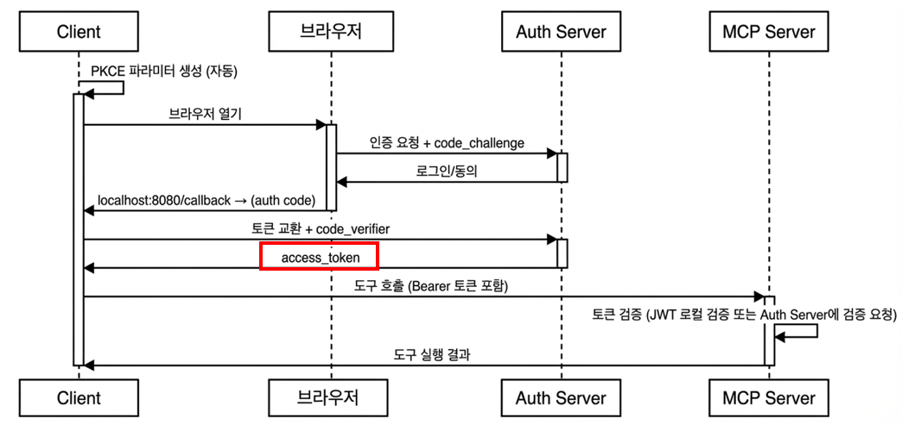
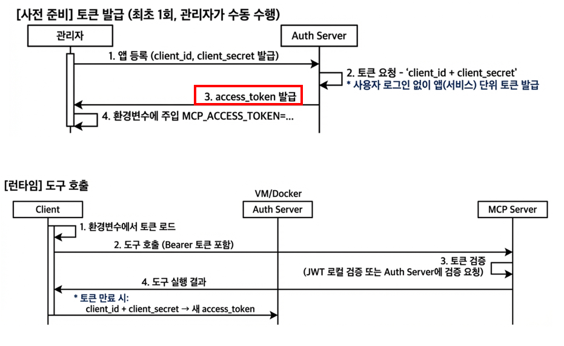
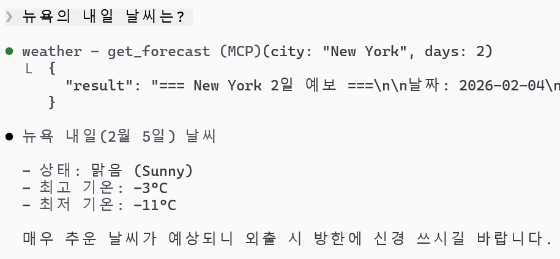

# 15. MCP (Model Context Protocol)

> MCP의 개념, 아키텍처, 구현 방법을 정리한 문서
> **기준 스펙: 2026-07-28** (직전 개정판 2025-11-25 대비 대규모 변경)

- [15. MCP (Model Context Protocol)](#15-mcp-model-context-protocol)
  - [학습 목표](#학습-목표)
- [1. WHY - 왜 MCP인가?](#1-why---왜-mcp인가)
  - [1.1 MCP란 무엇인가](#11-mcp란-무엇인가)
  - [1.2 MCP가 필요한 3가지 이유](#12-mcp가-필요한-3가지-이유)
  - [1.3 2026-07-28 스펙: 무엇이 바뀌었나](#13-2026-07-28-스펙-무엇이-바뀌었나)
  - [1.4 주요 인기 MCP](#14-주요-인기-mcp)
- [2. HOW - 어떻게 동작하는가?](#2-how---어떻게-동작하는가)
  - [2.1 아키텍처 개요](#21-아키텍처-개요)
  - [2.2 프로토콜 상세](#22-프로토콜-상세)
    - [2.2.1 JSON-RPC 2.0 메시지와 resultType](#221-json-rpc-20-메시지와-resulttype)
    - [2.2.2 Stateless: initialize 핸드셰이크의 제거](#222-stateless-initialize-핸드셰이크의-제거)
    - [2.2.3 server/discover](#223-serverdiscover)
    - [2.2.4 버전 협상과 하위 호환](#224-버전-협상과-하위-호환)
    - [2.2.5 전송 방식 (Transport)](#225-전송-방식-transport)
    - [2.2.6 에러 코드 체계](#226-에러-코드-체계)
    - [2.2.7 캐싱 (ttlMs / cacheScope)](#227-캐싱-ttlms--cachescope)
  - [2.3 핵심 기능 (Primitives)](#23-핵심-기능-primitives)
    - [Tools (도구)](#tools-도구)
    - [Resources (리소스)](#resources-리소스)
    - [Prompts (프롬프트)](#prompts-프롬프트)
  - [2.4 메시지 패턴](#24-메시지-패턴)
    - [2.4.1 Request and Response](#241-request-and-response)
    - [2.4.2 MRTR (Multi Round-Trip Requests)](#242-mrtr-multi-round-trip-requests)
    - [2.4.3 Subscribe and Notify (subscriptions/listen)](#243-subscribe-and-notify-subscriptionslisten)
  - [2.5 클라이언트 기능](#25-클라이언트-기능)
    - [Elicitation - 사용자에게 요청](#elicitation---사용자에게-요청)
    - [Sampling - LLM에게 요청 (Deprecated)](#sampling---llm에게-요청-deprecated)
    - [Roots (루트, Deprecated)](#roots-루트-deprecated)
  - [2.6 확장 (Extensions)](#26-확장-extensions)
  - [2.7 보안](#27-보안)
    - [인증/인가](#인증인가)
    - [보안 모범 사례](#보안-모범-사례)
  - [2.8 마이그레이션 가이드 (2025-11-25 → 2026-07-28)](#28-마이그레이션-가이드-2025-11-25--2026-07-28)
  - [2.9 생태계 현황](#29-생태계-현황)
- [3. WHAT - 무엇을 구현하는가?](#3-what---무엇을-구현하는가)
  - [3.1 개발 환경 설정](#31-개발-환경-설정)
  - [3.2 간단한 MCP 구현](#32-간단한-mcp-구현)
  - [3.3 MRTR 실습](#33-mrtr-실습)
  - [3.4 변경 알림 구독 실습](#34-변경-알림-구독-실습)
  - [3.5 Tasks 실습](#35-tasks-실습)
  - [3.6 AI 에이전트 개발 지원 서비스](#36-ai-에이전트-개발-지원-서비스)
- [Appendix](#appendix)
  - [MCP 스펙 버전 히스토리](#mcp-스펙-버전-히스토리)
  - [폐기 예정(Deprecated) 기능 레지스트리](#폐기-예정deprecated-기능-레지스트리)
  - [참고 자료](#참고-자료)

---

## 학습 목표

- MCP의 개념과 Function Calling 대비 장점 이해
- MCP 아키텍처(Host/Client/Server)와 **Stateless 프로토콜 모델** 파악
- MCP 핵심 기능(Tools, Resources, Prompts) 이해
- **2026-07-28 스펙의 3대 변화(Stateless, MRTR, subscriptions/listen)** 이해
- Python SDK v2(`MCPServer`/`Client`)로 MCP 서버·클라이언트 구현 실습
- MRTR 다단계 입력, 변경 알림 구독, Tasks 확장 직접 구현
- Claude Desktop / Claude Code에 MCP 서버 연동

[Top](#15-mcp-model-context-protocol)

---

# 1. WHY - 왜 MCP인가?

---

## 1.1 MCP란 무엇인가

MCP(Model Context Protocol)는 **AI 앱과 외부 도구/서비스를 연결하는 개방형 표준 프로토콜**임.

웹에서 **HTTP**가 브라우저와 웹 서비스를 연결하는 표준 프로토콜인 것처럼, MCP는 **AI 앱과 도구/서비스를 연결하는 표준 프로토콜**임.

```
[HTTP와 MCP의 대응]

  HTTP:  브라우저 ──── HTTP ────── 웹 서비스
  MCP:   AI 앱   ──── MCP ────── 도구/서비스
```

Anthropic은 AI 앱-도구 간 표준 인터페이스 부재 문제를 **프로토콜 수준에서 해결**하기 위해 2024년 11월 MCP를 오픈 소스로 공개함.

2026-07-28 개정판에서는 이 비유가 한층 더 정확해졌음. 초기 MCP는 연결을 맺고 세션을 유지하는 **연결 지향(stateful)** 프로토콜이었으나,
현재 MCP는 HTTP처럼 **모든 요청이 자기 완결적(self-contained)인 Stateless 프로토콜**로 재설계되었음.

[Top](#15-mcp-model-context-protocol)

---

## 1.2 MCP가 필요한 3가지 이유

### 1) 앱-도구 간 인터페이스 표준화

MCP는 앱과 도구 사이에 표준 프로토콜을 제공하여 N×M 문제를 N+M으로 축소함.

```
[MCP 방식: N+M 통합으로 축소]

  ┌──────────┐     ┌──────────┐
  │  앱 A    │     │  앱 B    │
  │(AI 비서) │     │(코드IDE) │
  └────┬─────┘     └────┬─────┘
       │                │
       ▼                ▼
  ┌─────────────────────────────┐
  │    MCP (표준 프로토콜)       │
  │    "HTTP for AI Tools"      │
  └──┬──────┬──────┬──────┬────┘
     │      │      │      │
     ▼      ▼      ▼      ▼
  ┌─────┐ ┌─────┐ ┌─────┐ ┌─────┐
  │Slack│ │Jira │ │GitHub│ │ DB  │
  └─────┘ └─────┘ └─────┘ └─────┘
```

| 구분 | N×M 방식 (MCP 이전) | N+M 방식 (MCP 적용) |
|------|---------------------|---------------------|
| 앱 2개 + 서비스 4개 | 2×4 = 8개 통합 코드 | 2+4 = 6개 통합 코드 |
| 앱 1개 추가 시 | 4개 코드 추가 필요 | 1개 코드만 추가 |

도구를 MCP 서버로 한 번 구현하면 MCP를 지원하는 모든 앱에서 그대로 사용 가능함.

### 2) 프레임워크 비종속

MCP는 **프로토콜 수준의 표준**이므로 특정 프레임워크에 의존하지 않음.
LangChain, LlamaIndex 등 어떤 프레임워크를 사용하든, 혹은 프레임워크 없이도 표준 프로토콜만으로 도구 연동 가능함.

```
[LangChain vs MCP 비교]

  LangChain (프레임워크 추상화):
  ┌─────────────────────────────┐
  │        내 앱 (Python)        │
  │  ┌───────────────────────┐  │
  │  │  LangChain 프레임워크  │  │
  │  │  bind_tools()         │  │
  │  └──┬────────────┬───────┘  │
  │     │            │          │
  │  ┌──▼──┐     ┌───▼──┐      │
  │  │날씨 │     │ DB   │      │  ← 도구가 앱 내부에 종속
  │  │도구 │     │도구  │      │
  │  └─────┘     └──────┘      │
  └─────────────────────────────┘

  MCP (프로토콜 표준화):
  ┌──────────┐  ┌──────────┐  ┌──────────┐
  │  내 앱   │  │ Claude   │  │ Cursor   │
  │ (Python) │  │ Desktop  │  │  IDE     │
  └────┬─────┘  └────┬─────┘  └────┬─────┘
       │             │             │
       ▼             ▼             ▼
  ┌─────────────────────────────────────┐
  │         MCP (표준 프로토콜)           │
  └──┬──────────────────┬───────────────┘
     │                  │
  ┌──▼──┐           ┌───▼──┐
  │날씨 │           │ DB   │  ← 독립 서버, 앱 간 공유
  │서버 │           │서버  │
  └─────┘           └──────┘
```

### 3) 풍부한 생태계

MCP는 사실상 업계 표준(de facto standard)으로 채택되어 주요 외부 서비스에서 MCP 서버를 직접 제공함.

- **수천 개 규모의 MCP 서버** 생태계
- **주요 서비스의 공식 지원**: GitHub, Slack, Notion, Figma 등이 MCP 서버 제공
- **주요 클라이언트 지원**: Claude Desktop, Cursor, VS Code 등 주요 AI 앱이 MCP 지원
- **벤더 중립 거버넌스**: Linux Foundation으로 이관되어 특정 기업에 종속되지 않음

도구를 직접 구현할 필요 없이 검증된 MCP 서버를 설치/연결만으로 사용 가능함.

### Function Calling과의 관계

MCP는 Function Calling을 **대체**하는 것이 아님. Function Calling **위에 표준화 레이어를 추가**한 것임.

```
┌─────────────────────────────────┐
│         MCP 프로토콜             │  ← 표준화 레이어
│  (JSON-RPC 2.0, 전송, 보안)     │
├─────────────────────────────────┤
│      Function Calling           │  ← 기본 메커니즘
│  (LLM이 도구를 호출하는 원리)    │
├─────────────────────────────────┤
│         LLM 추론                │  ← 기반 기술
│    (어떤 도구를 호출할지 판단)    │
└─────────────────────────────────┘
```

[Top](#15-mcp-model-context-protocol)

---

## 1.3 2026-07-28 스펙: 무엇이 바뀌었나

2026-07-28 개정판은 MCP 역사상 **가장 큰 폭의 변경**임. 핵심은 한 문장으로 요약됨.

> **"MCP가 세션 지향 프로토콜에서 HTTP처럼 Stateless한 프로토콜이 되었다."**

### 변경 배경(WHY)

기존 MCP는 `initialize` 핸드셰이크로 세션을 만들고 `Mcp-Session-Id`로 세션을 유지했음. 이 구조는 다음 문제를 낳았음.

| 문제 | 설명 |
|------|------|
| **수평 확장 곤란** | 같은 세션의 요청이 항상 같은 서버 인스턴스로 가야 함 → 스티키 세션 또는 공유 스토리지 필수 |
| **서버리스 부적합** | 세션 상태를 유지해야 하므로 Lambda/Cloud Run 같은 무상태 런타임과 충돌 |
| **양방향 스트림 부담** | 서버→클라이언트 요청(Sampling/Elicitation/Roots)을 위해 연결을 계속 열어두어야 함 |
| **게이트웨이 비친화** | 라우팅·인가를 하려면 로드밸런서가 JSON 본문을 파싱해야 함 |

2026-07-28은 이 4가지를 프로토콜 차원에서 정리했음.

### 8대 핵심 변경 요약

| # | 변경 | 제거/이전 방식 | 새 방식 | SEP |
|---|------|---------------|---------|-----|
| 1 | **세션 제거** | `Mcp-Session-Id` 헤더, 커넥션별 목록 | 서버가 발급한 핸들을 **일반 도구 인자**로 전달 | SEP-2567 |
| 2 | **Stateless화** | `initialize` / `notifications/initialized` | 매 요청 `_meta`에 버전·능력 동봉 | SEP-2575 |
| 3 | **server/discover 신설** | 없음 (initialize 응답으로 대체) | 서버가 **반드시 구현**. 지원 버전·능력·신원 조회 | SEP-2575 |
| 4 | **구독 통합** | HTTP GET 스트림, `resources/subscribe` | `subscriptions/listen` 단일 롱리브 스트림 | SEP-2575 |
| 5 | **유틸리티 정리** | `ping`, `logging/setLevel`, `notifications/roots/list_changed` | 제거. 로그 레벨은 요청별 `_meta`로 지정 | SEP-2575 |
| 6 | **Tasks 분리** | 코어의 실험적 tasks | 공식 확장 `io.modelcontextprotocol/tasks`로 이전 | SEP-2663 |
| 7 | **MRTR 도입** | 서버가 클라이언트에 **역방향 JSON-RPC 요청** 발송 | 서버가 `InputRequiredResult` 반환 → 클라이언트가 **재요청** | SEP-2322 |
| 8 | **스트림 재개 제거** | `Last-Event-ID` 재전송 | 미지원. 끊기면 **새 요청 ID로 재요청** | SEP-2575 |

이와 함께 모든 result에 **`resultType` 필드가 필수**가 되었음(`"complete"` 또는 `"input_required"`).

### 주요 부가 변경

| 항목 | 내용 |
|------|------|
| **캐싱 힌트 필수** | 목록/읽기 계열 결과에 `ttlMs`·`cacheScope` 필수 (SEP-2549) |
| **HTTP 표준 헤더** | `Mcp-Method`, `Mcp-Name` 필수. 도구 파라미터→헤더 매핑 `x-mcp-header` 추가 (SEP-2243) |
| **에러 코드 정책** | `-32020`~`-32099`를 MCP 스펙 전용으로 예약. 리소스 없음 `-32002` → `-32602` |
| **인가 강화** | RFC 9207 `iss` 검증, DCR 시 `application_type` 필수, 자격증명을 발급 AS에 바인딩 |
| **JSON Schema 완화** | `inputSchema`/`outputSchema`에 JSON Schema 2020-12 전체 키워드 허용, `$ref` 네트워크 역참조 금지 |
| **OpenTelemetry** | `_meta`의 `traceparent`/`tracestate`/`baggage` 키로 트레이스 전파 규약 문서화 |
| **결정적 순서** | `tools/list`는 결정적 순서로 반환 권장 (클라이언트 캐시·프롬프트 캐시 적중률 향상) |

### 폐기 예정(Deprecated) 선언

2026-07-28에서 **기능 수명주기 정책(feature lifecycle)** 이 도입되었음. Deprecated 상태의 기능은 **최소 12개월** 유지 후 제거 대상이 됨.

| 폐기 대상 | 대체 방안 |
|-----------|----------|
| **Roots** | 디렉터리/파일을 도구 파라미터·리소스 URI·서버 설정으로 전달 |
| **Sampling** | 서버가 LLM 제공자 API와 직접 연동 |
| **Logging** | stdio는 `stderr`, 관측성은 OpenTelemetry |
| **Dynamic Client Registration** | Client ID Metadata Documents(CIMD) |
| **HTTP+SSE 전송** | Streamable HTTP |
| `includeContext: thisServer/allServers` | 필드 생략 또는 `"none"` |

> **교육 관점 유의**: 본 교재의 실습은 폐기 예정 기능(Sampling·Roots)을 주제로 삼지 않고,
> 이를 대체하는 **MRTR([3.3](#33-mrtr-실습))**, **구독([3.4](#34-변경-알림-구독-실습))**, **Tasks 확장([3.5](#35-tasks-실습))** 을 다룸.
> Sampling·Roots는 개념 이해를 위해 [2.5절](#25-클라이언트-기능)에서 설명만 하고 실습에서는 제외함.

[Top](#15-mcp-model-context-protocol)

---

## 1.4 주요 인기 MCP

| 카테고리 | MCP 서버 | 설명 |
|--------|----------|----------|
| 코드 | Context7 | 최신 코드 검색 |
| 코드 | Playwright | 프론트엔드 테스트 서비스 |
| 코드 | Sequential | LLM의 논리적 추론 지원 |
| 코드 | GitHub | 소스관리 |
| 코드 | Filesystem | 로컬 파일 읽기/쓰기 |
| 코드 | Sentry | 에러 로그 분석 및 디버깅 자동화 |
| 검색 | Brave Search/Exa | 최신 웹 정보 검색 |
| 검색 | Tavily/DuckDuckGo | 최신 웹 정보 검색 |
| 검색 | Google Maps | 장소 검색 |
| 검색 | Firecrawl | 웹 스크래핑 |
| 검색 | Memory | 지식 Graph 기반 영구 메모리 서비스 |
| 커뮤니케이션 | Gmail | Gmail 연동 |
| 커뮤니케이션 | Slack | Slack 연동 |
| 생산성 | Miro | 온라인 협업 화이트보드 플랫폼 |
| 생산성 | Google Calendar | Google Calendar 연동 |
| 생산성 | Notion | Notion 연동 |
| 생산성 | Atlassian | Jira, Confluence 연동 |
| 데이터 | PostgreSQL | 자연어로 DB 쿼리 실행 및 스키마 분석 |
| 데이터 | MongoDB | 자연어로 DB 쿼리 실행 및 스키마 분석 |
| 디자인 | Canva | 디자인 서비스 |
| 디자인 | Figma | 디자인 서비스 |
| 금융 | Stripe | 국제 결제 서비스 |
| 금융 | 토스페이먼츠 | 국내 PG(Payment Gateway) 서비스 |

**MCP 서버 포탈:**
- [Smithery](https://smithery.ai/servers)
- [Glama](https://glama.ai/mcp/servers)
- [mcp.so](https://mcp.so/)

[Top](#15-mcp-model-context-protocol)

---

# 2. HOW - 어떻게 동작하는가?

---

## 2.1 아키텍처 개요

MCP는 **Host / Client / Server** 3계층 구조로 동작함.

> **용어 주의**: 일반적인 웹 서비스에서 "Host"는 서버를 의미하지만, MCP에서는 **Host = 사용하는 쪽**, **Server = 제공하는 쪽**임.

```
┌───────────────────────────────────────────────┐
│              MCP Host (사용자 앱)               │
│      예: Claude Desktop, Cursor, 사용자 앱     │
│                                               │
│  ┌───────────┐ ┌───────────┐ ┌───────────┐   │
│  │MCP Client │ │MCP Client │ │MCP Client │   │
│  │    #1     │ │    #2     │ │    #3     │   │
│  └─────┬─────┘ └─────┬─────┘ └─────┬─────┘   │
└────────┼──────────────┼──────────────┼────────┘
         │              │              │
     ┌───┘          ┌───┘          ┌───┘
     │ 1:1          │ 1:1          │ 1:1
     ▼              ▼              ▼
┌──────────┐  ┌──────────┐  ┌──────────┐
│MCP Server│  │MCP Server│  │MCP Server│
│(파일시스템)│  │ (GitHub) │  │  (DB)    │
│          │  │          │  │          │
│ Tools    │  │ Tools    │  │ Tools    │
│ Resources│  │ Resources│  │ Resources│
│ Prompts  │  │ Prompts  │  │ Prompts  │
└──────────┘  └──────────┘  └──────────┘
```

### Host (MCP 호스트)

- **역할**: AI 애플리케이션. 여러 MCP Client를 관리
- **관계**: Host 1개 : Client N개 (1:N)
- **예시**: Claude Desktop, Claude Code, Cursor, VS Code, 사용자 작성 앱
- **책임**:
  - LLM과의 대화 관리
  - MCP Client 생성 및 수명주기 관리
  - 보안 정책 적용 (도구 승인 등)

### Client (MCP 클라이언트)

- **역할**: 하나의 MCP Server와 1:1 통신 담당
- **관계**: Client 1개 : Server 1개 (1:1)
- **책임**:
  - **매 요청에 프로토콜 버전과 능력(capabilities)을 첨부** (2026-07-28 변경)
  - 메시지 라우팅 (Host ↔ Server)
  - 구독(`subscriptions/listen`) 관리
  - 전송 레이어 관리 (STDIO, Streamable HTTP)

### Server (MCP 서버)

- **역할**: 도구, 리소스, 프롬프트를 제공
- **관계**: 여러 Client가 연결 가능 (N:1)
- **제공 기능**: Tools / Resources / Prompts
- **2026-07-28 변경점**:
  - 클라이언트에 역방향 JSON-RPC 요청을 보내지 않음. 필요한 입력은 **`InputRequiredResult`(MRTR)** 로 응답에 담아 요청
  - `server/discover`를 **반드시 구현**해야 함

### Stateless 원칙 (핵심)

2026-07-28의 아키텍처 원칙은 다음과 같이 규정됨.

| 규칙 | 내용 |
|------|------|
| **연결에 상태를 두지 않음** | 서버는 같은 커넥션의 이전 요청으로부터 컨텍스트(능력, 버전, 신원)를 추론하면 안 됨 |
| **커넥션 ≠ 대화** | STDIO 프로세스 하나가 하나의 대화/세션을 의미하지 않음. 무관한 요청이 섞여 들어올 수 있음 |
| **상태는 명시적 식별자로** | 여러 요청에 걸쳐야 하는 상태(장기 작업, 앱 레벨 핸들)는 **클라이언트가 매 요청에 넘기는 식별자**로 참조 |
| **롱리브 요청도 요청** | `subscriptions/listen`도 request/response임. 상태는 커넥션이 아니라 **그 요청에 스코프**됨 |

```
[Stateful (2025-11-25 이전)]              [Stateless (2026-07-28)]

  Client            Server                  Client            Server
    │  initialize      │                      │  tools/call      │
    │ ───────────────► │                      │  + _meta(버전,   │
    │ ◄─────────────── │                      │    능력, 신원)   │
    │  initialized     │                      │ ───────────────► │
    │ ───────────────► │  ← 세션 생성           │ ◄─────────────── │  ← 세션 없음
    │                  │    Mcp-Session-Id     │                  │
    │  tools/call      │                      │  tools/list      │
    │ ───────────────► │  ← 세션 상태 참조      │  + _meta(...)    │
    │ ◄─────────────── │                      │ ───────────────► │  ← 매 요청 자기완결
    │                  │                      │ ◄─────────────── │
```

[Top](#15-mcp-model-context-protocol)

---

## 2.2 프로토콜 상세

### 2.2.1 JSON-RPC 2.0 메시지와 resultType

MCP는 JSON-RPC 2.0 프로토콜 위에 구축됨. 메시지 유형은 3가지임.

| 메시지 유형 | 설명 | 예시 |
|------------|------|------|
| **Request** | 응답을 요구하는 요청 | `tools/call` |
| **Response** | Request에 대한 응답 (Result 또는 Error) | 도구 실행 결과 |
| **Notification** | 응답 불필요한 단방향 알림 | 진행 상태 알림 |

**Request 예시** (2026-07-28: `_meta` 필수):

```json
{
  "jsonrpc": "2.0",
  "id": 1,
  "method": "tools/call",
  "params": {
    "name": "get_weather",
    "arguments": { "city": "Seoul" },
    "_meta": {
      "io.modelcontextprotocol/protocolVersion": "2026-07-28",
      "io.modelcontextprotocol/clientInfo": { "name": "MyApp", "version": "1.0.0" },
      "io.modelcontextprotocol/clientCapabilities": { "elicitation": { "form": {} } }
    }
  }
}
```

**Response 예시** (2026-07-28: `resultType` 필수):

```json
{
  "jsonrpc": "2.0",
  "id": 1,
  "result": {
    "resultType": "complete",
    "content": [
      { "type": "text", "text": "서울: 15°C, 맑음" }
    ],
    "isError": false,
    "_meta": {
      "io.modelcontextprotocol/serverInfo": { "name": "WeatherServer", "version": "1.0.0" }
    }
  }
}
```

#### resultType

모든 result는 `resultType` 필드를 **반드시** 포함해야 함.

| 값 | 의미 |
|----|------|
| `"complete"` | 요청이 완료되었고 result에 최종 내용이 담김 |
| `"input_required"` | 요청 처리에 추가 정보가 필요함. result는 [`InputRequiredResult`](#242-mrtr-multi-round-trip-requests) |
| (확장 정의값) | 확장이 추가 가능. 예: Tasks 확장의 `"task"` |

- 클라이언트가 인식하지 못하는 `resultType`은 **유효하지 않은 것으로 처리**해야 함
- **하위 호환**: `resultType`이 없는 이전 버전 서버의 응답은 `"complete"`로 간주해야 함

### 2.2.2 Stateless: initialize 핸드셰이크의 제거

2025-11-25까지 존재하던 다음 흐름은 **완전히 제거**되었음.

```
[제거된 초기화 흐름 - 더 이상 사용하지 않음]

  Client                          Server
    │  1. initialize (버전, 능력)   │
    │ ────────────────────────────► │
    │ ◄──────────────────────────── │  (버전, 능력, serverInfo)
    │  2. notifications/initialized │
    │ ────────────────────────────► │
```

대신 **모든 요청**이 `params._meta`에 프로토콜 메타데이터를 실어 보냄.

#### 요청 `_meta` 필드 (Client → Server)

| 키 | 타입 | 필수 | 설명 |
|----|------|------|------|
| `io.modelcontextprotocol/protocolVersion` | `string` | **필수** | 이 요청의 프로토콜 버전 (예: `"2026-07-28"`) |
| `io.modelcontextprotocol/clientCapabilities` | `ClientCapabilities` | **필수** | 이 요청에 관련된 클라이언트 능력 |
| `io.modelcontextprotocol/clientInfo` | `Implementation` | 선택(SHOULD) | 클라이언트 이름/버전 |
| `io.modelcontextprotocol/logLevel` | `LoggingLevel` | 선택 | 이 요청에 대해 서버가 방출할 최소 로그 레벨 |
| `progressToken` | - | 선택 | 진행 알림 수신 옵트인 |
| `traceparent` / `tracestate` / `baggage` | `string` | 선택 | OpenTelemetry 트레이스 컨텍스트 (W3C 형식) |

- 필수 필드 누락 → 서버는 `-32602`(Invalid params)로 거부. HTTP에서는 `400 Bad Request`
- 클라이언트가 선언하지 않은 능력에 의존하면 안 됨. 필요 시 서버는 **`MissingRequiredClientCapabilityError`(`-32021`)** 반환하며 `data.requiredCapabilities`에 부족한 능력 명시

#### 응답 `_meta` 필드 (Server → Client)

| 키 | 타입 | 필수 | 설명 |
|----|------|------|------|
| `io.modelcontextprotocol/serverInfo` | `Implementation` | 선택(SHOULD) | 서버 이름/버전 |
| `io.modelcontextprotocol/subscriptionId` | - | 구독 스트림에서 **필수** | 알림이 속한 구독 식별 |

> **주의**: `clientInfo`/`serverInfo`는 **자가 신고 값이며 프로토콜이 검증하지 않음**.
> 표시·로깅·디버깅 용도이며, **동작 분기나 보안 판단에 사용하면 안 됨**.

#### `_meta` 키 이름 규칙

- 형식: `[prefix/]name` — prefix는 점(`.`)으로 구분된 라벨 뒤에 슬래시(`/`)
- 역DNS 표기 권장 (`com.example/`)
- **두 번째 라벨이 `modelcontextprotocol` 또는 `mcp`인 prefix는 MCP 예약**
  - 예약: `io.modelcontextprotocol/`, `dev.mcp/`, `com.mcp.tools/`
  - 비예약: `com.example.mcp/` (두 번째 라벨이 `example`)

#### 제거된 유틸리티

| 제거 대상 | 대체 |
|-----------|------|
| `ping` | 없음 (전송 계층 keep-alive 사용) |
| `logging/setLevel` | 요청별 `_meta.io.modelcontextprotocol/logLevel` |
| `notifications/roots/list_changed` | 없음 (Roots 자체가 Deprecated) |

> 서버는 `logLevel`을 포함하지 않은 요청에 대해 **`notifications/message`를 보내면 안 됨**.

### 2.2.3 server/discover

서버가 **반드시 구현해야 하는** RPC. 클라이언트는 다른 요청 전에 호출해 **지원 버전·능력·신원**을 한 번에 조회할 수 있음(선택).

**요청** (본문 파라미터는 `_meta`뿐):

```json
{
  "jsonrpc": "2.0",
  "id": "discover-1",
  "method": "server/discover",
  "params": {
    "_meta": {
      "io.modelcontextprotocol/protocolVersion": "2026-07-28",
      "io.modelcontextprotocol/clientInfo": { "name": "ExampleClient", "version": "1.0.0" },
      "io.modelcontextprotocol/clientCapabilities": {}
    }
  }
}
```

**응답**:

```json
{
  "jsonrpc": "2.0",
  "id": "discover-1",
  "result": {
    "resultType": "complete",
    "supportedVersions": ["2026-07-28"],
    "capabilities": {
      "tools": {},
      "resources": {}
    },
    "instructions": "This server provides weather and resource utilities.",
    "ttlMs": 3600000,
    "cacheScope": "public",
    "_meta": {
      "io.modelcontextprotocol/serverInfo": { "name": "ExampleServer", "version": "1.0.0" }
    }
  }
}
```

**DiscoverResult 필드**:

| 필드 | 설명 |
|------|------|
| `supportedVersions` | 서버가 지원하는 프로토콜 버전 목록. 클라이언트는 이 중 하나를 선택 |
| `capabilities` | 서버가 지원하는 능력 (tools, resources, prompts, extensions 등) |
| `instructions` | LLM이 이 서버를 잘 쓰도록 돕는 자연어 안내 (선택) |
| `_meta.io.modelcontextprotocol/serverInfo` | 서버 소프트웨어 이름/버전 |
| `ttlMs` / `cacheScope` | 캐싱 힌트 (2.2.7 참조) |

**언제 호출하나**

| 상황 | 설명 |
|------|------|
| 서버 정보 표시 | `tools/list`·`prompts/list`·`resources/list`를 각각 찔러보지 않고 한 번에 능력 파악 |
| STDIO 하위 호환 탐침 | STDIO는 HTTP 상태 코드가 없으므로, 구/신 서버 판별을 위해 먼저 호출 권장 |

> `server/discover` 호출은 **클라이언트에게 선택사항**임. 바로 원하는 RPC를 호출하고
> `UnsupportedProtocolVersionError`가 오면 그때 대응해도 됨.

### 2.2.4 버전 협상과 하위 호환

**협상 핸드셰이크가 없음.** 매 요청이 버전을 실어 보내고, 서버는 요청 단위로 수락/거부함.

```
  Client                                Server
    │  request (_meta: version)          │
    │ ─────────────────────────────────► │
    │                                    │ 지원?
    │ ◄───────────────────────── result  │ Yes
    │ ◄── UnsupportedProtocolVersionError │ No
    │     data.supported = [...]         │
    │  지원 버전 중 하나로 재요청           │
```

**UnsupportedProtocolVersionError** (`-32022`):

```json
{
  "jsonrpc": "2.0",
  "id": 1,
  "error": {
    "code": -32022,
    "message": "Unsupported protocol version",
    "data": {
      "supported": ["2026-07-28", "2025-11-25"],
      "requested": "1900-01-01"
    }
  }
}
```

#### 용어: Modern / Legacy / Dual-era

| 용어 | 정의 |
|------|------|
| **Modern** | 버전·신원·능력을 **요청별 메타데이터**로 전달 (`2026-07-28` 이상) |
| **Legacy** | `initialize` 핸드셰이크로 세션 수립 (`2025-11-25` 이하) |
| **Dual-era** | 두 방식 모두 지원하는 구현 |

#### 호환성 매트릭스

| Client | Server | 결과 |
|--------|--------|------|
| Modern | Modern | **동작**. 버전 불일치는 `UnsupportedProtocolVersionError`로 표면화 후 재시도 |
| Modern | Legacy | **실패**. STDIO에서는 `server/discover`를 먼저 보내 결정적으로 실패시키는 것을 권장 |
| Dual-era | Modern | **동작**. 탐침이 `DiscoverResult` 또는 modern 에러를 반환 → modern 유지 |
| Dual-era | Legacy | **동작**. 탐침 실패 → `initialize`로 폴백 |
| Legacy | Modern | **실패**. Legacy 클라이언트에는 fall-forward 수단이 없음 |
| Legacy | Dual-era | **동작**. 서버가 `initialize`에 응답하고 legacy 규격으로 서비스 |
| Legacy | Legacy | 해당 legacy 개정판 규격대로 동작 |

> 시대(era) 판정은 **개별 요청이 아니라 서버의 속성**임. 클라이언트는 서버 프로세스(STDIO) 또는 오리진(HTTP) 수명 동안 결과를 캐시해야 함.

#### 확장 협상 (Extension Negotiation)

능력 객체의 `extensions` 맵으로 선택적 확장을 협상함.

```json
{
  "capabilities": {
    "tools": {},
    "extensions": {
      "io.modelcontextprotocol/tasks": {},
      "io.modelcontextprotocol/ui": { "mimeTypes": ["text/html;profile=mcp-app"] }
    }
  }
}
```

- 확장 식별자는 `_meta` 키 명명 규칙을 따르며 **prefix 필수**
- 한쪽만 지원하면, 지원하는 쪽이 **코어 동작으로 폴백**하거나 적절한 에러로 거부해야 함

### 2.2.5 전송 방식 (Transport)

MCP는 2가지 전송 방식을 지원함.

| 전송 방식 | 도입 시기 | 용도 | 특징 |
|-----------|----------|------|------|
| **STDIO** | 2024.11 | 로컬 MCP 서버 연동 | stdin/stdout 단일 채널 양방향. 개행 구분 JSON-RPC |
| **Streamable HTTP** | 2025.03 | 원격 MCP 서버 연동 | 단일 엔드포인트(`/mcp`)에 **POST만** 사용 |

> **HTTP+SSE(2024-11-05) 전송 단종 안내**
> 초기 스펙의 SSE 전송은 2025-03-26부터 deprecated였고, 2026-07-28에서 **기능 수명주기 정책상 Deprecated로 정식 분류**되어 제거 대상이 되었음.
> 신규 개발은 반드시 Streamable HTTP를 사용할 것.

#### STDIO

```
[STDIO 전송 - 동일 머신]

  ┌─────────────────────────────────────┐
  │            MCP Host                 │
  │  ┌──────────┐ stdin  ┌──────────┐  │
  │  │  Client  │──────► │  Server  │  │
  │  │          │ stdout │ (자식    │  │
  │  │          │◄────── │ 프로세스) │  │
  │  └──────────┘        └──────────┘  │
  └─────────────────────────────────────┘
```

규칙:
- 메시지는 개행으로 구분되며 **내부에 개행을 포함하면 안 됨**
- 서버는 `stdout`에 **유효한 MCP 메시지만** 써야 함. 로그는 `stderr`
- 서버는 클라이언트에 **JSON-RPC 요청을 쓰면 안 됨** (역방향 요청 금지 → MRTR 사용)
- **취소**: 클라이언트가 `notifications/cancelled`를 해당 요청 ID로 발송
- **종료**: 클라이언트가 stdin을 닫고 서버 종료 대기 → 미종료 시 강제 종료
- **비정상 종료**: 프로토콜이 stateless이므로 진행 중 요청은 버리고 새 프로세스에 재시도.
  단, `subscriptions/listen` 스트림은 **재수립 필요**

**하위 호환 탐침**(dual-era 클라이언트):

| 탐침 결과 | 판정 |
|-----------|------|
| `DiscoverResult` 수신 | Modern 서버. `supportedVersions` 중 선택하여 진행 |
| `UnsupportedProtocolVersionError` 등 인식 가능한 modern 에러 | Modern 서버. 지원 버전으로 재시도 (**폴백 금지**) |
| 그 외 에러 또는 타임아웃 | Legacy 서버. `initialize` 핸드셰이크로 폴백 |

#### Streamable HTTP

```
[Streamable HTTP 전송 - 원격]

  ┌──────────────────┐        ┌──────────┐
  │    MCP Host      │  POST  │  Server  │
  │  ┌──────────┐   │  /mcp  │ (원격)   │
  │  │  Client  │───┼──────► │          │
  │  │          │◄──┼─────── │          │
  │  └──────────┘   │  JSON  │          │
  │                  │  또는  │          │
  └──────────────────┘  SSE   └──────────┘
```

**2026-07-28에서 제거된 것**:

| 제거 항목 | 이전 동작 | 현재 |
|-----------|----------|------|
| `Mcp-Session-Id` 헤더 | 서버가 세션 발급, DELETE로 종료 | **없음**. 오면 무시하고 발급/에코 금지 |
| GET 스트림 엔드포인트 | 서버 발신 메시지 수신용 독립 SSE | **없음**. `subscriptions/listen`으로 대체. GET/DELETE는 `405` |
| 서버 발신 JSON-RPC 요청 | SSE 스트림으로 sampling/elicitation 요청 | **금지**. `InputRequiredResult`(MRTR) 사용 |
| `Last-Event-ID` 재개 | 끊긴 스트림 재개·메시지 재전송 | **미지원**. 새 요청 ID로 재요청 |

**요청 규칙**:
1. 모든 JSON-RPC 메시지는 **각각 별도의 HTTP POST**
2. `Accept` 헤더에 `application/json`과 `text/event-stream` **모두** 포함
3. 본문은 단일 JSON-RPC **request 또는 notification** (response 전송 금지)
4. notification 수용 시 서버는 `202 Accepted` + 본문 없음
5. request에 대해 서버는 `application/json`(단일 객체) 또는 `text/event-stream`(SSE) 중 하나로 응답. 클라이언트는 **둘 다 지원해야 함**

**응답 스트림 규칙**:
- SSE 스트림에는 **해당 요청과 관련된** `notifications/progress`, `notifications/message`만 실림
- 최종 JSON-RPC response로 스트림 종료
- 서버는 `X-Accel-Buffering: no` 헤더 권장 (nginx 등 프록시 버퍼링 방지)
- 롱리브 스트림은 `:\r\n` 형태의 SSE 주석 라인을 keep-alive로 주기 발송 권장

**취소**: SSE 응답 스트림을 닫는 것 자체가 취소 신호임 (HTTP에서는 `notifications/cancelled` 불필요)

**필수 헤더**:

| 헤더 | 소스 필드 | 필수 대상 |
|------|-----------|----------|
| `MCP-Protocol-Version` | `_meta.io.modelcontextprotocol/protocolVersion` | 모든 POST |
| `Mcp-Method` | `method` | 모든 요청 |
| `Mcp-Name` | `params.name` 또는 `params.uri` | `tools/call`, `resources/read`, `prompts/get` |

헤더 값과 본문 값이 **불일치하면** 서버는 `400 Bad Request` + `-32020`(`HeaderMismatch`)로 거부해야 함.
이는 로드밸런서가 헤더로 라우팅하고 서버는 본문으로 실행하는 **불일치 공격**을 막기 위함임.

**요청 예시**:

```http
POST /mcp HTTP/1.1
Content-Type: application/json
Accept: application/json, text/event-stream
MCP-Protocol-Version: 2026-07-28
Mcp-Method: tools/call
Mcp-Name: get_weather

{
  "jsonrpc": "2.0",
  "id": 1,
  "method": "tools/call",
  "params": {
    "name": "get_weather",
    "arguments": { "location": "Seattle, WA" },
    "_meta": {
      "io.modelcontextprotocol/protocolVersion": "2026-07-28",
      "io.modelcontextprotocol/clientInfo": { "name": "ExampleClient", "version": "1.0.0" },
      "io.modelcontextprotocol/clientCapabilities": {}
    }
  }
}
```

**도구 파라미터 → 헤더 매핑 (`x-mcp-header`)**

서버는 도구의 `inputSchema` 안에서 특정 파라미터를 HTTP 헤더로 승격시킬 수 있음.
게이트웨이가 본문을 파싱하지 않고도 테넌트·리전 기준 라우팅/레이트리밋을 할 수 있게 하는 장치임.

```json
{
  "name": "execute_sql",
  "description": "Execute SQL on Google Cloud Spanner",
  "inputSchema": {
    "type": "object",
    "properties": {
      "region": {
        "type": "string",
        "description": "The region to execute the query in",
        "x-mcp-header": "Region"
      },
      "query": { "type": "string", "description": "The SQL query to execute" }
    },
    "required": ["region", "query"]
  }
}
```

→ 클라이언트가 `Mcp-Param-Region: us-west1` 헤더를 추가함.

제약:
- 원시 타입(integer, string, boolean)만 허용. `number`는 불가
- `properties` 체인으로만 도달 가능한 **정적 경로**여야 함 (`items`, `oneOf`, `$ref` 등 통과 불가)
- ASCII로 안전하게 표현 불가한 값은 `=?base64?{값}?=` 센티널 형식으로 인코딩 (`Mcp-Name`도 동일 규칙)
- 서버는 **선택** 사용이지만 클라이언트는 **반드시 지원**해야 함. 제약 위반 도구는 클라이언트가 `tools/list` 결과에서 제외

**하위 호환 탐침**(HTTP):

`400 Bad Request`를 받으면 **본문을 먼저 확인**해야 함. modern 서버도 `UnsupportedProtocolVersionError`, `MissingRequiredClientCapabilityError`, 헤더 검증 실패에 `400`을 사용하기 때문임.

| 응답 본문 | 판정 |
|-----------|------|
| 인식 가능한 modern JSON-RPC 에러 | Modern 서버 → 요청을 고쳐서 재시도 (폴백 금지) |
| 비어 있거나 인식 불가 | Legacy 서버 → `initialize`로 폴백 |

### 2.2.6 에러 코드 체계

MCP는 표준 JSON-RPC 에러 코드(`-32700`, `-32600`~`-32603`)를 사용하고, JSON-RPC가 구현 정의용으로 예약한 `-32000`~`-32099` 구간을 다음과 같이 분할했음.

| 구간 | 용도 |
|------|------|
| `-32000` ~ `-32019` | **레거시**. 정책 이전에 구현체들이 할당한 구간. 신규 할당 금지, 신규 구현은 사용 자제 |
| `-32020` ~ `-32099` | **MCP 스펙 전용 예약**. 스펙이 정의한 코드만 정의된 의미로 사용 |

**MCP 정의 에러 코드**:

| 코드 | 이름 | 발생 상황 |
|------|------|----------|
| `-32020` | `HeaderMismatch` | HTTP 헤더와 본문 값 불일치, 또는 필수 헤더 누락/오류 |
| `-32021` | `MissingRequiredClientCapability` | 처리에 필요한 능력을 클라이언트가 선언하지 않음 |
| `-32022` | `UnsupportedProtocolVersion` | 서버가 요청 버전을 지원하지 않음 |

> 세 코드 모두 **초안 단계에서 번호가 재배정**되었음: `-32001`→`-32020`, `-32003`→`-32021`, `-32004`→`-32022`.

**예약 후 사용 금지 코드**:

| 코드 | 이전 의미 | 현재 |
|------|----------|------|
| `-32002` | 리소스 없음 (2025-11-25 이하) | **`-32602`(Invalid Params)로 변경**. 다만 클라이언트는 구버전 서버의 `-32002`를 여전히 수용해야 함 |
| `-32042` | URL elicitation 필요 (2025-11-25 전용) | 사용 금지 |

스펙이 정의하지 않은 신규 에러 코드는 JSON-RPC 예약 범위(`-32768`~`-32000`) **밖에서** 할당해야 함.

### 2.2.7 캐싱 (ttlMs / cacheScope)

세션이 사라지면서 목록 조회를 매번 반복하는 부담이 커졌음. 이를 보완하기 위해 **캐싱 힌트가 필수화**되었음.

**필수 대상** (`resultType: "complete"` 결과):

- `server/discover`
- `tools/list`
- `prompts/list`
- `resources/list`
- `resources/templates/list`
- `resources/read`

> `resultType: "input_required"` 인터림 결과와, `inputResponses`/`requestState`를 실은 MRTR 재요청의 결과는 **캐시 대상이 아님**.

| 필드 | 타입 | 의미 |
|------|------|------|
| `ttlMs` | integer(ms) | 클라이언트가 결과를 신선하다고 볼 수 있는 시간. HTTP `Cache-Control: max-age`와 유사 |
| `cacheScope` | `"public"` \| `"private"` | 공유 캐시 가능 여부. HTTP `Cache-Control: public/private`와 유사 |

**ttlMs 규칙**:
- `0` → 즉시 stale. 필요할 때마다 재조회
- 양수 → 수신 시각 기준 그만큼 신선
- 없음 → `0`으로 간주 (구버전 서버에서만 발생해야 함)
- 음수 → 무시하고 `0` 취급
- **TTL은 폴링 주기가 아님**. 데이터가 필요할 때 신선도를 확인하고 stale이면 재조회하는 용도

**cacheScope 규칙**:

| 값 | 의미 |
|----|------|
| `"public"` | 사용자별 데이터 없음. 게이트웨이·프록시가 저장·공유 가능 |
| `"private"` | 호출자 간 공유 불가. **동일 인가 컨텍스트 내에서만** 재사용 가능 |

> **보안 주의**: 인증된 `tools/list` 응답이라도 `cacheScope: "public"`이면 다른 액세스 토큰 사용자와 캐시가 공유될 수 있음.
> 서버는 `cacheScope`만으로 접근 통제를 대신하면 안 되며, 프리미티브 단위 접근 제어를 별도로 적용해야 함.

**알림과의 관계**: `listChanged` 알림을 받으면 신선 상태여도 **즉시 무효화**해야 함. 둘은 상호 보완 관계임.

[Top](#15-mcp-model-context-protocol)

---

## 2.3 핵심 기능 (Primitives)

MCP는 3가지 핵심 기능(Primitive)을 정의함.

> **참고**: MCP 프로토콜 자체는 누가 호출하는지 제한하지 않음.
> 아래 호출 의사결정 주체는 AI 앱에서의 **권장 설계 패턴**임.

| 기능 | 용도 | 호출 의사결정 | 실제 호출 |
|------|------|-----------------|------|
| **Tools** | 외부 서비스 실행이 필요할 때<br>(API 호출, DB 변경, 메일 발송 등) | LLM | AI 앱 |
| **Resources** | 서버가 가진 데이터를 참조할 때<br>(설정값, 스키마, 이력 조회 등) | AI 앱 | AI 앱 |
| **Prompts** | 반복되는 작업을 표준화된 템플릿으로 수행할 때<br>(코드 리뷰, 버그 분석 등) | 사용자 | AI 앱 |

> **핵심 차이**: Function Calling은 Tools만 지원하지만,
> MCP는 Resources와 Prompts까지 표준화하여 데이터 접근과 워크플로 재사용까지 포괄함.

**세 프리미티브 모두 2026-07-28에서 MRTR 대상임**: `tools/call`, `resources/read`, `prompts/get`은 `InputRequiredResult`를 반환할 수 있음.

### Tools (도구)

- **정의**: 서버가 제공하는 실행 가능한 함수
- **특징**:
  - SDK 사용 시 **타입 힌트 + docstring으로 도구를 작성하면 JSON Schema를 자동 생성**
  - 함수 정의 시 기본값이 없는 파라미터는 필수(`required`)로 자동 지정
  - `tools/list` 응답에 각 도구의 JSON Schema가 포함되며, 클라이언트(또는 LLM)는 이를 보고 파라미터를 파악
  - 도구 실행이 외부에 변화를 일으킬 수 있음(부작용) → 실행 전 사용자 승인(Human-in-the-loop) 권장

**2026-07-28 변경점**:

| 항목 | 내용 |
|------|------|
| **결정적 순서** | 서버는 `tools/list`를 **결정적 순서**로 반환하는 것이 권장됨. 클라이언트 캐싱과 LLM 프롬프트 캐시 적중률이 올라감 |
| **캐싱 힌트** | `tools/list` 결과에 `ttlMs`·`cacheScope` 필수 |
| **스키마 완화** | `inputSchema`/`outputSchema`에 JSON Schema 2020-12의 **모든 키워드** 허용, `structuredContent`는 **임의 JSON 값** 허용 |
| **`$ref` 제한** | 네트워크 URI를 가리키는 `$ref`를 **자동 역참조하면 안 됨**. 옵트인 모드도 기본 비활성 + 허용 호스트 목록 필요 |
| **조합 키워드 한계** | `anyOf`/`oneOf`/`allOf`/`if-then-else`/`$defs`에 깊이·개수·시간 한계를 두어 DoS 방지 |
| **헤더 승격** | `x-mcp-header`로 파라미터를 HTTP 헤더에 매핑 가능 (2.2.5 참조) |

**서버 코드 예제**:

```python
from mcp.server.mcpserver import MCPServer

mcp = MCPServer("MyServer")

# @mcp.tool() 데코레이터로 도구 등록
@mcp.tool()
def get_weather(city: str) -> str:
    """도시의 현재 날씨를 조회합니다."""
    # 실제로는 API 호출 등 수행
    return f"{city}: 15°C, 맑음"

@mcp.tool()
def send_email(to: str, subject: str, body: str) -> str:
    """이메일을 발송합니다."""
    # 실제로 이메일 발송 (부작용 발생!)
    return f"{to}에게 이메일 발송 완료"

if __name__ == "__main__":
    mcp.run(transport="stdio")   # 전송 설정은 run()에서 지정
```

> **v1과의 차이**: v1은 `from mcp.server.fastmcp import FastMCP` / `FastMCP("MyServer")`였음.
> 데코레이터(`@mcp.tool()`)와 타입 힌트 기반 스키마 자동 생성 방식은 **동일**하고, 클래스명·임포트 경로와 전송 설정 위치만 바뀌었음.

**클라이언트 코드 예제**:

```python
import asyncio
import sys
from mcp import Client, StdioServerParameters, stdio_client

async def main():
    # STDIO 서버는 stdio_client(...) 전송 객체를 넘김
    params = StdioServerParameters(command=sys.executable, args=["server.py"])

    async with Client(stdio_client(params)) as client:
        # 1) 도구 목록 조회 — initialize() 호출 불필요 (stateless)
        tools = await client.list_tools()
        for tool in tools.tools:
            print(f"도구: {tool.name} - {tool.description}")

        # 2) 도구 호출
        result = await client.call_tool("get_weather", {"city": "Seoul"})
        print(result.content)             # 비정형 콘텐츠 블록
        print(result.structured_content)  # 구조화 출력 (outputSchema 정의 시)

asyncio.run(main())
```

> **`Client()`에 넘길 수 있는 것**: `MCPServer` 객체(인메모리), 전송 객체(`stdio_client(...)`), **문자열(= Streamable HTTP URL)**.
> **문자열은 URL로 해석되므로** 스크립트 경로를 그대로 넘기면 안 됨.

> **v1과의 차이**: v1은 `stdio_client(...)` → `ClientSession(read, write)` → `await session.initialize()`의 **3계층**이었음.
> v2는 `Client` 단일 진입점이고, 프로토콜이 stateless이므로 **`initialize()` 자체가 없음**.
> 결과 필드도 snake_case로 통일됨(`isError`→`is_error`, `nextCursor`→`next_cursor`, `inputSchema`→`input_schema`).

`tools/list` 응답 (2026-07-28 형식):

```json
{
  "resultType": "complete",
  "tools": [
    {
      "name": "get_weather",
      "description": "도시의 현재 날씨를 조회합니다.",
      "inputSchema": {
        "type": "object",
        "properties": { "city": { "type": "string" } },
        "required": ["city"]
      }
    }
  ],
  "ttlMs": 300000,
  "cacheScope": "public"
}
```

### Resources (리소스)

- **정의**: 서버가 제공하는 읽기 전용 데이터
- **특징**:
  - URI 기반 접근 (`file://`, `db://`, `config://`)
  - 텍스트 또는 바이너리(Base64) 데이터
  - `resources/list` 응답에 URI, 설명, MIME 타입 포함
  - **변경 알림은 `subscriptions/listen`으로 수신** (2026-07-28 변경. `resources/subscribe` RPC는 제거됨)
- **URI 규칙**:
  - URI 스킴: `://` 앞 부분으로 리소스 유형 표현
  - URI 템플릿: `{parameter}` 형식으로 동적 값 수용 (예: `db://users/{user_id}`)
  - 스킴은 자유롭게 정의 가능, 소문자 권장
  - 템플릿 파라미터명은 함수 파라미터명과 일치해야 함
- **URI 예시**:
  ```
  file://documents/{name}       # 파일 접근
  config://server/info           # 설정 정보
  db://users/{user_id}           # DB 데이터
  weather://forecast/{city}      # 커스텀 스킴
  ```

**서버 코드 예제**:

```python
from mcp.server.mcpserver import MCPServer

mcp = MCPServer("MyServer")
history: list[str] = []

# @mcp.resource("URI") 데코레이터로 리소스 등록
@mcp.resource("calc://history")
def get_history() -> str:
    """지금까지의 계산 이력을 반환합니다."""
    if not history:
        return "계산 기록이 없습니다."
    return "\n".join(history)

@mcp.resource("config://server/info")
def get_server_info() -> str:
    """서버 버전, 지원 기능 등 메타 정보를 반환합니다."""
    return "Calculator Server v1.0 - 사칙연산 지원"
```

**클라이언트 코드 예제**:

```python
async with Client(stdio_client(params)) as client:
    # 1) 리소스 목록 조회
    resources = await client.list_resources()
    for res in resources.resources:
        print(f"리소스: {res.uri} - {res.description}")

    # 2) 리소스 읽기 (URI로 접근)
    resource = await client.read_resource("calc://history")
    print(resource.contents)
```

> **v2 주의 — 리소스 템플릿 보안**: v2는 URI 템플릿을 RFC 6570 문법으로 매칭하며
> **경로 탐색(path traversal) 방어가 기본 활성화**됨.
> 슬래시를 포함한 값을 의도적으로 받아야 하면 `security=ResourceSecurity(exempt_params={...})`로 예외 지정이 필요함.
>
> ```python
> @mcp.resource("inspect://{+target}",
>               security=ResourceSecurity(exempt_params={"target"}))
> def inspect_path(target: str) -> str: ...
> ```
>
> 또한 리소스 `uri` 타입이 `AnyUrl`에서 **`str`로 완화**되어 상대 경로도 허용됨.

`resources/list` 응답:

```json
{
  "resultType": "complete",
  "resources": [
    {
      "uri": "calc://history",
      "name": "get_history",
      "description": "지금까지의 계산 이력을 반환합니다.",
      "mimeType": "text/plain"
    }
  ],
  "ttlMs": 60000,
  "cacheScope": "private"
}
```

**에러 처리 변경**: 리소스를 찾지 못하면 `-32002`가 아니라 **`-32602`(Invalid Params)** 를 반환해야 함.
다만 클라이언트는 구버전 서버가 보내는 `-32002`도 계속 수용해야 함.

### Prompts (프롬프트)

- **정의**: 서버가 제공하는 재사용 가능한 프롬프트 템플릿
- **특징**:
  - 타입힌트 + docstring으로 인자 목록 자동 생성
  - 기본값이 없는 파라미터는 필수(`required`)로 자동 지정
  - 슬래시 명령어(`/`)로 사용자가 선택
  - 반복 작업을 템플릿으로 표준화

**서버 코드 예제**:

```python
from mcp.server.mcpserver import MCPServer

mcp = MCPServer("MyServer")

# @mcp.prompt() 데코레이터로 프롬프트 등록
@mcp.prompt()
def code_review(code: str, language: str = "Python") -> str:
    """코드 리뷰 프롬프트"""
    return (
        f"다음 {language} 코드를 리뷰해주세요.\n"
        f"보안, 성능, 가독성 관점에서 분석하고\n"
        f"개선점을 제안해주세요.\n\n"
        f"```{language.lower()}\n{code}\n```"
    )
```

`prompts/list` 응답:

```json
{
  "resultType": "complete",
  "prompts": [
    {
      "name": "code_review",
      "description": "코드 리뷰 프롬프트",
      "arguments": [
        { "name": "code", "required": true },
        { "name": "language", "required": false }
      ]
    }
  ],
  "ttlMs": 300000,
  "cacheScope": "public"
}
```

**클라이언트 코드 예제**:

```python
async with Client(stdio_client(params)) as client:
    # 1) 프롬프트 목록 조회
    prompts = await client.list_prompts()
    for p in prompts.prompts:
        print(f"프롬프트: {p.name} - {p.description}")

    # 2) 프롬프트 호출 — 완성된 프롬프트 텍스트를 반환 (LLM 실행 결과가 아님)
    result = await client.get_prompt(
        "code_review",
        arguments={"code": "def add(a, b):\n    return a + b", "language": "Python"},
    )
    print(result.messages[0].content.text)

    # 3) (선택) 생성된 프롬프트를 LLM에 전달하여 실제 리뷰 수행
    #    이 단계는 클라이언트 앱(Claude Desktop 등)이 자동 처리
```

**사용 흐름**:

```
[Claude Desktop에서의 사용 예시]

사용자가 슬래시 명령어로 프롬프트 선택:  /code_review
앱이 파라미터 입력 UI를 표시:  code / language
→ 서버가 완성된 프롬프트를 생성하여 반환
→ LLM이 해당 프롬프트로 작업 수행
```

[Top](#15-mcp-model-context-protocol)

---

## 2.4 메시지 패턴

2026-07-28은 클라이언트-서버 상호작용을 **3가지 메시지 패턴**으로 명시적으로 정의했음.

| 패턴 | 설명 |
|------|------|
| **Request and Response** | 클라이언트가 요청하고 서버가 result 또는 error로 응답 |
| **MRTR (Multi Round-Trip Requests)** | 서버가 추가 입력이 필요하면 `input_required`로 응답, 클라이언트가 입력을 담아 재요청 |
| **Subscribe and Notify** | 클라이언트가 `subscriptions/listen`으로 구독하고 서버가 알림 스트림 발송 |

### 2.4.1 Request and Response

가장 기본적인 패턴. `tools/list` → 목록, `tools/call` → 실행 결과.

```json
// 요청
{
  "jsonrpc": "2.0",
  "id": 2,
  "method": "tools/list",
  "params": {
    "_meta": {
      "io.modelcontextprotocol/protocolVersion": "2026-07-28",
      "io.modelcontextprotocol/clientCapabilities": {}
    }
  }
}
```

```json
// 응답
{
  "jsonrpc": "2.0",
  "id": 2,
  "result": {
    "resultType": "complete",
    "tools": [ /* ... */ ],
    "ttlMs": 300000,
    "cacheScope": "public"
  }
}
```

### 2.4.2 MRTR (Multi Round-Trip Requests)

**2026-07-28에서 가장 중요한 개념 변화**임.

#### 무엇이 바뀌었나

이전에는 서버가 클라이언트에게 **역방향 JSON-RPC 요청**(`sampling/createMessage`, `elicitation/create`, `roots/list`)을 직접 보냈음.
이 방식은 서버→클라이언트 채널이 열려 있어야 하고, 서버가 응답을 기다리는 동안 상태를 유지해야 했음.

MRTR은 이를 **"응답에 담아 되돌려주고, 클라이언트가 다시 요청"** 하는 방식으로 뒤집었음.

```
[이전 방식 - 2025-11-25 이하]        [MRTR - 2026-07-28]

 Client            Server              Client            Server
   │  tools/call     │                   │  tools/call(id:1)│
   │ ───────────────►│                   │ ────────────────►│
   │                 │ 입력 필요           │                  │ 입력 필요
   │◄─ elicitation/  │                   │◄─ InputRequired  │
   │   create (요청)  │                   │   Result         │
   │   (id:2)        │                   │   (id:1 응답 종료) │
   │                 │  ← 서버 대기 상태    │                  │  ← 서버 상태 없음
   │─► 결과(id:2)     │    유지 필요        │  사용자 입력 수집   │
   │                 │                   │  tools/call(id:2)│
   │◄─ 최종결과(id:1) │                   │  + inputResponses│
                                         │  + requestState  │
                                         │ ────────────────►│
                                         │◄─ 최종 결과(id:2) │
```

#### 핵심 타입

**InputRequiredResult**

```json
{
  "jsonrpc": "2.0",
  "id": 1,
  "result": {
    "resultType": "input_required",
    "inputRequests": {
      "github_login": {
        "method": "elicitation/create",
        "params": {
          "mode": "form",
          "message": "Please provide your GitHub username",
          "requestedSchema": {
            "type": "object",
            "properties": { "name": { "type": "string" } },
            "required": ["name"]
          }
        }
      }
    },
    "requestState": "AEAD-protected blob"
  }
}
```

| 필드 | 설명 |
|------|------|
| `inputRequests` | 서버가 클라이언트에 요청하는 항목들의 **맵**. 키는 서버가 정한 식별자, 값은 `ElicitRequest` / `CreateMessageRequest` / `ListRootsRequest` 중 하나 |
| `requestState` | 서버만 의미를 아는 **불투명 문자열**. 클라이언트는 열어보거나 수정하면 안 되고 **그대로 되돌려줘야** 함 |

**InputResponses** (클라이언트가 재요청에 실어 보냄. 키는 `inputRequests`의 키와 대응)

```json
{
  "github_login": {
    "action": "accept",
    "content": { "name": "octocat" }
  }
}
```

#### 적용 대상

| 클라이언트 요청 | InputRequiredResult 지원 |
|-----------------|--------------------------|
| `tools/call` | O |
| `resources/read` | O |
| `prompts/get` | O |
| 그 외 모든 요청 | **X** (서버는 보내면 안 됨) |

#### 서버 요구사항

1. `inputRequests`의 키는 요청 범위 내에서 **유일**해야 함
2. `inputRequests`와 `requestState` 중 **최소 하나는 반드시 포함**해야 함
3. 클라이언트가 선언하지 않은 능력의 요청은 보내면 안 됨 (예: `elicitation` 미선언 클라이언트에 `elicitation/create` 금지)
4. 클라이언트가 재요청하리라고 **가정하면 안 됨**. 필요하면 여러 번 `InputRequiredResult`를 반복해도 됨
5. `requestState`는 **공격자 통제 입력**으로 취급해야 함
   - 인가·자원 접근·비즈니스 로직에 영향을 준다면 **HMAC 또는 AEAD로 무결성 보호** 필수
   - 검증 실패 시 거부
6. 재전송(replay) 방지를 위해 `requestState` 내부에 다음을 넣고 검증할 것을 권고
   - **인증 주체(principal)** — 다른 주체가 제시하면 거부
   - **짧은 만료(TTL)** — 만료 후 제시하면 거부
   - **원 요청 식별자** — 메서드명 + 주요 파라미터 다이제스트 등, 불일치 시 거부
   - > 위 조치는 재전송 창을 좁힐 뿐 **1회성을 보장하지는 않음**. 1회 소비가 필수인 경우 서버가 별도로 강제해야 함

#### 클라이언트 요구사항

1. `inputRequests`가 있으면 **입력을 모두 구성한 뒤** 재요청해야 함. 없으면 즉시 재요청 가능
2. `requestState`가 있으면 **정확히 그대로** 되돌려줘야 함. 없으면 재요청에 포함하면 안 됨
3. 최초 요청과 재요청의 **JSON-RPC `id`는 서로 달라야 함** (독립 요청이므로)
4. `inputRequests`/`requestState`는 **해당 요청의 재시도에만** 사용. 병렬 진행 중인 다른 요청에 쓰면 안 됨

#### 에러 처리

- 클라이언트가 요청한 정보를 **일부만** 보냈고 그것이 필수라면, 서버는 에러 대신 **새 `InputRequiredResult`로 다시 요청**하는 것이 권장됨
- 인식하지 못하는 여분 파라미터는 무시

### 2.4.3 Subscribe and Notify (subscriptions/listen)

이전의 HTTP GET 스트림과 `resources/subscribe`/`resources/unsubscribe` RPC를 **하나로 통합**한 신규 방식임.

#### 스트림 열기

클라이언트가 **받고 싶은 알림 종류를 명시**해서 요청함. 서버는 요청하지 않은 종류를 보내면 안 됨.

```json
{
  "jsonrpc": "2.0",
  "id": 1,
  "method": "subscriptions/listen",
  "params": {
    "_meta": {
      "io.modelcontextprotocol/protocolVersion": "2026-07-28",
      "io.modelcontextprotocol/clientCapabilities": {}
    },
    "notifications": {
      "toolsListChanged": true,
      "resourceSubscriptions": ["file:///project/config.json"]
    }
  }
}
```

**알림 필터**:

| 필드 | 타입 | 수신 알림 |
|------|------|----------|
| `toolsListChanged` | boolean | `notifications/tools/list_changed` |
| `promptsListChanged` | boolean | `notifications/prompts/list_changed` |
| `resourcesListChanged` | boolean | `notifications/resources/list_changed` |
| `resourceSubscriptions` | string[] | 지정 URI에 대한 `notifications/resources/updated` |

#### 확인(Acknowledgment)

서버는 **첫 메시지로 반드시** `notifications/subscriptions/acknowledged`를 보내야 함.

```json
{
  "jsonrpc": "2.0",
  "method": "notifications/subscriptions/acknowledged",
  "params": {
    "_meta": { "io.modelcontextprotocol/subscriptionId": 1 },
    "notifications": {
      "toolsListChanged": true,
      "resourceSubscriptions": ["file:///project/config.json"]
    }
  }
}
```

- 응답의 `notifications`는 **서버가 실제로 지원하기로 한 부분집합**임. 미지원 종류는 생략됨
- 클라이언트는 요청한 것과 대조하여 미지원 항목을 우아하게 처리해야 함

#### 알림 수신과 subscriptionId

- 스트림의 모든 알림은 `_meta.io.modelcontextprotocol/subscriptionId`를 포함함
- 값은 **`subscriptions/listen` 요청의 JSON-RPC id**
- STDIO는 모든 메시지가 한 채널을 공유하므로 클라이언트는 **이 필드로 반드시 상관관계를 맞춰야** 함

```json
{
  "jsonrpc": "2.0",
  "method": "notifications/resources/updated",
  "params": {
    "_meta": { "io.modelcontextprotocol/subscriptionId": 1 },
    "uri": "file:///project/config.json"
  }
}
```

#### 중요한 구분: 어떤 알림이 어디로 가나

| 알림 | 전달 경로 |
|------|----------|
| `notifications/progress`, `notifications/message` | **해당 요청의 응답 스트림** (요청 스코프) |
| `tools/list_changed`, `resources/updated` 등 변경 알림 | **`subscriptions/listen` 응답 스트림** |

#### 종료

| 종료 주체 | 방법 |
|-----------|------|
| **클라이언트** | HTTP: SSE 스트림 닫기 / STDIO: `notifications/cancelled`에 listen 요청 ID 참조 |
| **서버** | 빈 결과로 `subscriptions/listen`에 응답한 뒤 스트림 종료 (Graceful Closure) |
| **전송 계층** | HTTP 타임아웃, TCP 끊김, STDIO 프로세스 종료 |

**Graceful Closure**:

```json
{
  "jsonrpc": "2.0",
  "id": 1,
  "result": {
    "resultType": "complete",
    "_meta": { "io.modelcontextprotocol/subscriptionId": 1 }
  }
}
```

이 응답 없이 전송이 끊기면 **비정상 종료**이며, 클라이언트는 재연결을 시도할 수 있음.
STDIO에서 연결이 끊겼다 재수립되면 **클라이언트가 `subscriptions/listen`을 다시 보내야** 함 (서버는 구독 상태를 보관하지 않음).

[Top](#15-mcp-model-context-protocol)

---

## 2.5 클라이언트 기능

클라이언트가 서버에 제공하는 기능임. 2026-07-28에서 **모두 MRTR 방식으로 전달**되며, Sampling과 Roots는 **Deprecated** 상태임.

| 기능 | 응답자 | 상태 |
|------|--------|------|
| **Elicitation** | 사용자(사람) | **Active** — 코어 클라이언트 기능으로 유지 |
| **Sampling** | AI 모델(LLM) | **Deprecated** (SEP-2577) |
| **Roots** | 클라이언트(파일 범위) | **Deprecated** (SEP-2577) |

### Elicitation - 사용자에게 요청

서버가 실행에 필요한 정보를 **사용자에게** 구조화된 형식으로 요청하는 기능임.

#### 능력 선언

```json
{
  "_meta": {
    "io.modelcontextprotocol/clientCapabilities": {
      "elicitation": { "form": {}, "url": {} }
    }
  }
}
```

- 빈 객체 `"elicitation": {}` 는 하위 호환상 **`form` 모드만 지원**과 동일
- `elicitation`을 선언하면 최소 한 가지 모드는 지원해야 함
- 서버는 클라이언트가 지원하지 않는 모드로 요청하면 안 됨

#### 두 가지 모드

| 모드 | 용도 | 데이터 노출 |
|------|------|------------|
| **form** | 스키마 기반 구조화 입력 수집 | 클라이언트에 노출됨 |
| **url** | 외부 URL로 안내하여 대역 외(out-of-band) 처리 | URL 외에는 클라이언트에 노출 안 됨 |

> **보안 규칙(중요)**:
> 서버는 **비밀번호·API 키·액세스 토큰·결제 정보 같은 민감 정보를 form 모드로 요청하면 안 됨**.
> 이런 상호작용은 반드시 **url 모드**를 사용해야 함.
> (이름·이메일 같은 일반 프로필 정보는 금지 대상이 아님)

#### Form 모드

`requestedSchema`는 **평면 객체 + 원시 타입**으로 제한됨 (중첩 구조, 객체 배열 등은 의도적으로 미지원).

지원 타입: String(`minLength`/`maxLength`/`format`), Number/Integer(`minimum`/`maximum`), Boolean, Enum(단일/다중 선택).
String의 `format`은 `email`, `uri`, `date`, `date-time` 지원.

**입력 요청** (`InputRequiredResult.inputRequests` 내부):

```json
{
  "method": "elicitation/create",
  "params": {
    "mode": "form",
    "message": "Please provide your contact information",
    "requestedSchema": {
      "type": "object",
      "properties": {
        "name": { "type": "string", "description": "Your full name" },
        "email": { "type": "string", "format": "email" },
        "age": { "type": "number", "minimum": 18 }
      },
      "required": ["name", "email"]
    }
  }
}
```

**클라이언트 결과** (재요청의 `inputResponses` 내부):

```json
{
  "action": "accept",
  "content": { "name": "Monalisa Octocat", "email": "octocat@github.com", "age": 30 }
}
```

#### URL 모드

민감 정보 입력, 서드파티 OAuth, 결제 등 **MCP 클라이언트를 거치면 안 되는** 상호작용용.

```json
{
  "method": "elicitation/create",
  "params": {
    "mode": "url",
    "url": "https://mcp.example.com/ui/set_api_key",
    "message": "Please provide your API key to continue."
  }
}
```

- 클라이언트 결과는 `{ "action": "accept" }` (content 없음)
- `accept`는 **"사용자가 URL 열기에 동의했다"** 는 뜻이지 **"상호작용이 완료됐다"** 는 뜻이 아님
- 실제 완료 여부는 클라이언트가 재요청했을 때 **서버가 `requestState`(또는 자체 저장 상태)로 판단**함

> **2025-11-25 대비 변경**: `notifications/elicitation/complete` 알림과 URL 모드의 `elicitationId` 필드가 **제거**되었음.
> MRTR에서는 클라이언트가 원 요청을 재시도하며 결과를 알게 되므로, 서버 발신 완료 신호와 상관관계용 ID가 더 이상 필요 없음.
> 서버가 재시도 간 elicitation을 상관시켜야 하면 **`requestState`에 자체 식별자를 인코딩**함.

#### 응답 액션 3종

| action | 의미 | content |
|--------|------|---------|
| `accept` | 사용자가 명시적으로 승인·제출 | form 모드에서 제출 데이터 포함 / url 모드에서는 생략 |
| `decline` | 사용자가 명시적으로 거절 | 보통 생략 |
| `cancel` | 명시적 선택 없이 닫음(ESC, 바깥 클릭 등) | 보통 생략 |

#### 흐름

```
[Form 모드]
 사용자        클라이언트                서버
   │              │  tools/call(id:1)     │
   │              │ ────────────────────► │
   │              │◄─ InputRequiredResult │  (elicitation/create, mode:form)
   │◄─ 입력 UI 표시│                       │
   │─► 정보 입력   │                       │
   │              │  tools/call(id:2)     │
   │              │  + inputResponses     │
   │              │ ────────────────────► │
   │              │◄─ 최종 결과(id:2)      │

[URL 모드]
 브라우저   사용자   클라이언트              서버
                      │  tools/call(id:1)   │
                      │ ──────────────────► │
                      │◄─ InputRequired     │  (mode:url, requestState)
             ◄─ 동의  │                     │
             ─► 승인  │                     │
   ◄─ URL 열기        │  tools/call(id:2)   │
                      │  + accept + state   │
                      │ ──────────────────► │  (완료까지 대기 가능)
   ─────────────── 상호작용 완료 ──────────► │
                      │◄─ 최종 결과(id:2)    │
```

#### URL 모드 보안 (요약)

서버는:
- URL에 자격증명·개인식별정보를 **넣으면 안 됨**
- **사전 인증된(pre-authenticated) URL을 주면 안 됨** (악성 클라이언트의 사용자 사칭 위험)
- 운영 환경에서는 HTTPS 사용

클라이언트는:
- URL을 **자동으로 미리 가져오면 안 됨**
- **명시적 동의 없이 열면 안 됨**, 전체 URL을 사용자에게 보여줘야 함
- 클라이언트/LLM이 내용과 입력을 들여다볼 수 없는 안전한 방식으로 열어야 함
- 도메인 강조 표시, Punycode 등 의심 URI 경고 권장

**피싱 주의**: 공격자가 자신의 elicitation URL을 다른 사용자에게 열게 하면 **토큰이 공격자 계정에 묶이는 계정 탈취**가 가능함.
서버는 **elicitation을 시작한 사용자와 URL을 연 사용자가 동일한지 반드시 확인**해야 함(세션 쿠키의 `sub` 클레임 비교 등).

### Sampling - LLM에게 요청 (Deprecated)

> **Deprecated (2026-07-28, SEP-2577)**: 최소 12개월 유지 후 제거 대상.
> 신규 구현은 **서버가 LLM 제공자 API와 직접 연동**하는 방식을 권장함.

서버가 자체 LLM API 없이 **클라이언트의 AI 모델을 빌려** 추론하는 기능임.

```
 클라이언트                             서버
   │  tools/call(id:1)                   │
   │ ──────────────────────────────────► │
   │◄─ InputRequiredResult               │  sampling/createMessage
   │   (sampling/createMessage)          │
   │  Host가 요청 검토/승인/거부           │
   │  승인 시 Host 내부 LLM이 응답 생성    │
   │  tools/call(id:2) + inputResponses  │
   │ ──────────────────────────────────► │
   │◄─ 최종 결과(id:2)                    │
```

**입력 요청**:

```json
{
  "method": "sampling/createMessage",
  "params": {
    "messages": [
      { "role": "user", "content": { "type": "text", "text": "What is the capital of France?" } }
    ],
    "modelPreferences": {
      "hints": [{ "name": "claude-3-sonnet" }],
      "intelligencePriority": 0.8,
      "speedPriority": 0.5
    },
    "systemPrompt": "You are a helpful assistant.",
    "maxTokens": 100
  }
}
```

**클라이언트 결과**:

```json
{
  "role": "assistant",
  "content": { "type": "text", "text": "The capital of France is Paris." },
  "model": "claude-3-sonnet-20240307",
  "stopReason": "endTurn"
}
```

- 보안: 호스트가 Sampling 요청을 검토/승인/거부 가능
- `includeContext`의 `"thisServer"`/`"allServers"` 값은 **Deprecated**. 생략하거나 `"none"` 사용

### Roots (루트, Deprecated)

> **Deprecated (2026-07-28, SEP-2577)**: 최소 12개월 유지 후 제거 대상.
> 신규 구현은 디렉터리·파일 정보를 **도구 파라미터, 리소스 URI, 서버 설정**으로 전달할 것.

**클라이언트가 서버에게 접근 가능한 파일/디렉터리를 알려주는** 기능임. 프로토콜 수준의 강제가 아닌 **권고(Advisory)** 수준임.

#### 능력 선언

```json
{
  "_meta": {
    "io.modelcontextprotocol/clientCapabilities": { "roots": {} }
  }
}
```

#### 동작 (MRTR 방식)

```
 클라이언트                     서버
   │  tools/call(id:1)          │
   │ ─────────────────────────► │
   │◄─ InputRequiredResult      │  { "method": "roots/list" }
   │  tools/call(id:2)          │
   │  + inputResponses + state  │
   │ ─────────────────────────► │
   │◄─ 최종 결과(id:2)           │
```

**클라이언트 결과**:

```json
{
  "roots": [
    { "uri": "file:///home/user/projects/myproject", "name": "My Project" }
  ]
}
```

- `uri`는 현재 스펙에서 **`file://` 스킴만 허용**
- 서버가 `roots/list`를 요청하지 않고 진행하면 아무 효과 없음

#### 한계점

Roots는 **강제 메커니즘이 아님**. 실제 보안은 별도 수단이 필요함.

| 보안 계층 | 역할 | 강제력 |
|-----------|------|--------|
| **Roots** | 서버에게 작업 범위 안내 | 없음 (권고) |
| **OS 권한** | 서버 프로세스의 파일 시스템 접근 제한 | 있음 (강제) |
| **네트워크 정책** | 서버의 외부 통신 제한 | 있음 (강제) |
| **컨테이너/샌드박스** | 서버 실행 환경 격리 | 있음 (강제) |

> Roots가 Deprecated된 근본 이유가 이것임. **권고 수준의 안전장치는 보안이 아니며**,
> 같은 정보를 도구 파라미터로 넘기면 프로토콜 기능 없이도 동일한 효과를 얻을 수 있음.

[Top](#15-mcp-model-context-protocol)

---

## 2.6 확장 (Extensions)

코어 프로토콜 밖의 모듈형·전문·실험적 기능은 **확장(Extension)** 으로 분리되었음.
확장은 항상 **옵트인**이며 클라이언트/서버 양쪽의 명시적 지원이 필요함(`capabilities.extensions`로 협상).

| 확장 | 식별자 | 용도 |
|------|--------|------|
| **Tasks** | `io.modelcontextprotocol/tasks` | 장시간 작업의 비동기 실행. 폴링·중간 입력·내구성 핸들 |
| **MCP Apps** | `io.modelcontextprotocol/ui` | 대화 안에 렌더링되는 인터랙티브 UI(차트, 폼, 비디오 플레이어) |
| **Skills over MCP** | (워킹 그룹) | 에이전트 워크플로용 구조화된 지시를 MCP로 발견·소비 |

### Tasks 확장 (구 실험적 tasks)

2025-11-25까지 코어에 실험적으로 있던 tasks가 **공식 확장으로 이전 + 재설계**되었음 (SEP-2663).

**변경점**:

| 항목 | 이전 | 현재 |
|------|------|------|
| 결과 조회 | 블로킹 `tasks/result` | **폴링 `tasks/get`** |
| 중간 입력 | 없음 | **`tasks/update`** (클라이언트→서버 입력) |
| 목록 조회 | `tasks/list` | **제거** |
| 옵트인 | 요청별 옵트인 필요 | 서버가 **요청 없이도** task 핸들 반환 가능 (확장 능력만 선언하면 됨) |

**흐름**:

```
 클라이언트                             서버
   │  tools/call (tasks 능력 선언)        │
   │ ──────────────────────────────────► │
   │◄─ CreateTaskResult                  │  resultType: "task"
   │   (taskId, status: working,         │
   │    ttlMs, pollIntervalMs)           │
   │                                     │
   │  tasks/get(taskId)  ← 폴링 반복      │
   │ ──────────────────────────────────► │
   │◄─ Task(status: working)             │
   │                                     │
   │◄─ Task(status: input_required,      │  중간 입력 필요
   │        inputRequests)               │
   │  tasks/update(taskId,               │
   │               inputResponses)       │
   │ ──────────────────────────────────► │
   │                                     │
   │◄─ Task(status: completed, result)   │
```

**상태(Status)**:

| 상태 | 의미 |
|------|------|
| `working` | 진행 중 |
| `input_required` | 클라이언트 입력 필요 (`inputRequests` 참조) |
| `completed` | 완료. `result`에 최종 출력 (**종료 상태**) |
| `failed` | 실행 중 오류. `error`에 JSON-RPC 에러 (**종료 상태**) |
| `cancelled` | 취소됨 (**종료 상태**). 취소는 협조적이며 항상 반영되지는 않음 |

**적합한 사용처**: CI 파이프라인, 배치 처리, 모델 학습, 승인 게이트(HITL), 외부 잡 시스템 래핑, 불안정한 네트워크 환경.

**알림**: 서버는 `notifications/tasks`로 상태 변화를 푸시할 수 있고, 클라이언트는 `subscriptions/listen`으로 옵트인함.
기본은 폴링이며, 서버가 알림을 지원하면 폴링 대신 사용 가능함.

[Top](#15-mcp-model-context-protocol)

---

## 2.7 보안

### 인증/인가

MCP는 원격 서버 접근 시 **OAuth 2.1** 기반 인증/인가를 표준으로 채택함.
내부 서버나 단일 서비스는 JWT 방식도 사용할 수 있음.
STDIO 전송은 이 스펙을 따르지 않고 **환경에서 자격증명을 가져오는 방식**을 사용함.

**인증 방식 전체 비교**:

| 항목 | OAuth + JWT<br>(Public Client) | OAuth + JWT<br>(Confidential Client) | JWT 직접 발급 | JWT 별도 인증 서버 |
|------|-------------------------------|--------------------------------------|-------------|-------------------|
| **OAuth 공식 명칭** | Authorization Code Grant + PKCE | Client Credentials Grant | 해당 없음 | 해당 없음 |
| **Auth Server** | 필요 (OAuth 스펙 준수) | 필요 (OAuth 스펙 준수) | 불필요 | 필요 (자체 구현) |
| **토큰 발급** | 브라우저 인증 → 코드 교환 | client_id + client_secret | MCP Server 자체 | 인증 서버 자체 로직 |
| **사용자 개입** | 필요 (로그인/동의) | 불필요 | 없음 | 없음 |
| **PKCE** | 필수 | 불필요 | 해당 없음 | 해당 없음 |
| **구현 복잡도** | 높음 | 중간 | 낮음 | 중간 |
| **표준화** | OAuth 2.1 스펙 준수 | OAuth 2.1 스펙 준수 | 자체 규격 | 자체 규격 |
| **실행 환경** | 사용자 PC (로컬) | 서버 (VM, Docker) | 어디서든 | 어디서든 |
| **적합 환경** | Claude Desktop, IDE 플러그인 | 백엔드 서비스, 배치 작업 | 프로토타입, 단일 서비스 | 내부 시스템, 다수 서버 |

#### 2026-07-28 인가 변경사항

| 변경 | 내용 |
|------|------|
| **CIMD 우선** | Dynamic Client Registration(RFC 7591)이 **Deprecated**. **Client ID Metadata Documents**가 기본 등록 방식 |
| **`iss` 검증** | Authorization Server는 인가 응답에 RFC 9207의 `iss` 파라미터를 포함해야 하며, 클라이언트는 **코드 교환 전에 기록된 issuer와 대조 검증 필수** |
| **`application_type` 필수** | DCR 사용 시 클라이언트는 적절한 `application_type` 지정 필수. 생략 시 OIDC 기본값 `"web"`이 되어 네이티브 redirect URI와 충돌 |
| **AS 바인딩** | 클라이언트 자격증명은 **발급한 Authorization Server의 issuer 식별자로 키잉**해야 함. AS가 바뀌면 재사용 금지, 재등록 필수 |

#### 클라이언트 등록 방식 3종

| 방식 | 적용 상황 | 상태 |
|------|----------|------|
| **Client ID Metadata Documents (CIMD)** | 클라이언트와 서버가 **사전 관계가 없을 때** (가장 일반적) | 권장 |
| **Pre-registration** | 사전 관계가 있을 때 (하드코딩 client_id 또는 사용자 입력) | 지원 |
| **Dynamic Client Registration (DCR)** | 하위 호환용 | **Deprecated** |

**클라이언트 선택 우선순위**:
1. 이미 보유한 사전 등록 정보 사용
2. AS가 `client_id_metadata_document_supported: true`를 광고하면 **CIMD** 사용
3. AS가 `registration_endpoint`를 제공하면 DCR로 폴백
4. 그래도 안 되면 사용자에게 클라이언트 정보 입력 요청

**CIMD 원리**: 클라이언트가 자신의 메타데이터 JSON 문서를 **HTTPS URL에 호스팅**하고, 그 URL 자체를 `client_id`로 사용함.
AS는 URL 형식 client_id를 발견하면 해당 문서를 가져와 검증함.

```json
{
  "client_id": "https://app.example.com/oauth/client-metadata.json",
  "client_name": "Example MCP Client",
  "client_uri": "https://app.example.com",
  "logo_uri": "https://app.example.com/logo.png",
  "redirect_uris": [
    "http://127.0.0.1:3000/callback",
    "http://localhost:3000/callback"
  ],
  "grant_types": ["authorization_code"],
  "response_types": ["code"],
  "token_endpoint_auth_method": "none"
}
```

요구사항:
- `client_id` URL은 **https 스킴 + 경로 요소**를 가져야 함 (예: `https://example.com/client.json`)
- 문서의 `client_id` 값이 **URL과 정확히 일치**해야 함
- 필수 속성: `client_id`, `client_name`, `redirect_uris`
- AS는 문서의 `client_id`가 URL과 일치하는지, redirect URI가 목록에 있는지 **반드시 검증**
- AS는 HTTP 캐시 헤더를 존중하여 메타데이터를 캐시하는 것이 권장됨

> **CIMD의 장점**: client_id가 자체 호스팅 HTTPS URL이므로 **AS 간 이식 가능**함.
> AS가 바뀌어도 재등록이 필요 없음(반면 사전 등록/DCR 자격증명은 AS별로 묶임).

#### Public Client 방식: Authorization Code Grant + PKCE



**PKCE(Proof Key for Code Exchange) 핵심 파라미터**:

| 파라미터 | 설명 | 전송 시점 | 탈취 시 영향 |
|---|---|---|---|
| **code_challenge** | code_verifier의 SHA256 해시값 (공개값) | 3단계: 인증 요청 시 전송 | 없음 — 해시값으로 원본 역산 불가 |
| **authorization_code** | 인증 완료 후 발급되는 1회용 코드 | 4~5단계: 브라우저 리다이렉트 시 전달 | 없음 — code_verifier 없이는 토큰 교환 불가 |
| **code_verifier** | 클라이언트가 생성한 랜덤 문자열 (비밀값) | 6단계: 토큰 교환 시 HTTPS로 전송 | 없음 — 1회 사용 후 폐기 |

**PKCE 원리**: 인증 요청자와 토큰 교환자가 동일인임을 증명하는 방식임.
3단계에서 해시값(code_challenge)만 보내고, 6단계에서 원본(code_verifier)을 보내면
Auth Server가 원본을 해시하여 3단계의 해시값과 비교함.
중간에 authorization_code를 탈취해도 code_verifier를 모르면 토큰 교환 불가능.

- **적용 범위**: Streamable HTTP 전송 방식에 적용
- **STDIO**: 로컬 프로세스이므로 환경변수 등에서 자격증명 취득
- **PKCE 필수**: Authorization Code 탈취 방지

#### Confidential Client 방식: Client Credentials Grant



**Auth Server 구축 방법**:

| 방식 | 설명 | 특징 |
|------|------|------|
| **Spring Authorization Server** | Spring Authorization Server 라이브러리로 개발 | Java/Spring Boot 환경, 커스터마이징 용이 |
| **Keycloak** | Red Hat의 오픈소스 인증 서버 | 관리 UI 제공, SSO 지원, 언어 무관 |
| **Auth0** | 클라우드 기반 인증 서비스 (SaaS) | 무료 티어, 관리 부담 최소 |
| **AWS Cognito** | AWS 관리형 인증 서비스 | AWS 환경 최적, Lambda/API Gateway 연동 |

#### JWT 인증

OAuth 없이 JWT만으로 인증을 구현하는 방식. 내부 시스템이나 프로토타입 단계에 적합함.

**MCP Server 직접 발급**:

```
Client                    MCP Server (자체 인증)
  │ 1. 인증 요청 (API Key)     │
  │ ──────────────────────────►│
  │                            │ 2. API Key 검증
  │                            │ 3. JWT 생성 (자체 서명)
  │ 4. JWT 반환                │
  │ ◄──────────────────────────│
  │ 5. 도구 호출 (Bearer JWT)  │
  │ ──────────────────────────►│
  │                            │ 6. JWT 서명 검증 (로컬)
  │ 7. 결과 반환               │
  │ ◄──────────────────────────│
```

**별도 인증 서버 발급**:

```
Client                Auth Server           MCP Server
  │ 1. 인증 요청 (API Key) │                    │
  │ ─────────────────────►│                    │
  │                       │ 2. API Key 검증     │
  │ 4. JWT 반환           │ 3. JWT 생성 (서명)  │
  │ ◄─────────────────────│                    │
  │ 5. 도구 호출 (Bearer JWT)                   │
  │ ──────────────────────────────────────────►│
  │                       │ 6. JWT 검증  ◄─────│
  │ 7. 결과 반환                                │
  │ ◄──────────────────────────────────────────│
```

**JWT, OAuth, Bearer의 관계**:

| 개념 | 역할 | 계층 |
|------|------|------|
| **OAuth 2.1** | 토큰을 **어떻게 발급**하는가 | 프로토콜 |
| **JWT** | 토큰을 **어떤 형식**으로 담는가 | 토큰 형식 |
| **Bearer** | 토큰을 **어떻게 전송**하는가 | 전송 방식 |

### 보안 모범 사례

| 원칙 | 설명 | 구현 방법 |
|------|------|----------|
| **최소 권한** | 필요한 권한만 부여 | OS 권한·컨테이너 격리 (Roots는 권고 수준일 뿐) |
| **입력 검증** | 모든 입력값 검증 | JSON Schema 유효성 검사 + 스키마 깊이/개수 제한 |
| **requestState 무결성** | MRTR 상태를 공격자 통제 입력으로 취급 | HMAC/AEAD 서명, principal·TTL·요청 다이제스트 포함 |
| **헤더-본문 일치** | 게이트웨이/서버 간 판단 근거 불일치 방지 | `Mcp-Method`/`Mcp-Name` 검증, 불일치 시 `-32020` |
| **Origin 검증** | DNS 리바인딩 공격 방지 | `Origin` 헤더 검증, 불일치 시 `403`. 로컬은 127.0.0.1 바인딩 |
| **도구 승인** | 위험 도구 실행 전 승인 | Human-in-the-loop |
| **민감정보 분리** | 자격증명이 LLM 컨텍스트·클라이언트를 지나지 않게 | Elicitation **url 모드** 사용 |
| **캐시 스코프** | 인가 컨텍스트 간 캐시 유출 방지 | 사용자별 데이터는 `cacheScope: "private"` |
| **아이콘 처리** | 아이콘 메타데이터를 신뢰하지 않음 | https/data URI만 허용, 크기 제한, 매직바이트 검증, 자격증명 없이 fetch |
| **감사 로그** | 모든 도구 호출 기록 | 서버 측 로깅 + OpenTelemetry |
| **전송 보안** | 통신 암호화 | HTTPS/TLS 사용 |

> **중요**: MCP 서버는 임의의 코드를 실행할 수 있으므로 신뢰할 수 있는 소스의 서버만 사용해야 함.
> 도구 설명·어노테이션 역시 **신뢰할 수 없는 입력**으로 취급해야 함(신뢰된 서버에서 온 것이 아니라면).

[Top](#15-mcp-model-context-protocol)

---

## 2.8 마이그레이션 가이드 (2025-11-25 → 2026-07-28)

### 서버 개발자 체크리스트

| # | 할 일 | 상세 |
|---|-------|------|
| 1 | `initialize`/`initialized` 핸들러 제거 또는 dual-era 유지 | 두 시대 동시 지원 시 `initialize`가 오면 legacy 의미로 처리 |
| 2 | **`server/discover` 구현** | 필수. `supportedVersions`·`capabilities`·`serverInfo`·`instructions` 반환 |
| 3 | 모든 result에 `resultType` 추가 | 일반 결과는 `"complete"` |
| 4 | 요청별 `_meta` 파싱 | 버전·클라이언트 능력을 **커넥션이 아니라 요청에서** 읽기 |
| 5 | 능력 검증 로직 추가 | 미선언 능력 필요 시 `-32021` 반환 |
| 6 | 버전 검증 로직 추가 | 미지원 버전이면 `-32022` + `data.supported` 반환 |
| 7 | 역방향 요청 → MRTR 전환 | sampling/elicitation/roots 요청을 `InputRequiredResult`로 변경 |
| 8 | `requestState` 설계 | 무결성 보호(HMAC/AEAD) + principal/TTL/요청 다이제스트 |
| 9 | `resources/subscribe` → `subscriptions/listen` | 알림 필터 처리 + ack 발송 + `subscriptionId` 태깅 |
| 10 | 세션 상태 제거 | 필요한 상태는 **서버 발급 핸들을 도구 인자로** 전달 |
| 11 | 캐싱 힌트 추가 | 목록/읽기 결과에 `ttlMs`·`cacheScope` |
| 12 | HTTP: GET/DELETE → 405 | `Mcp-Session-Id`·`Last-Event-ID` 무시 |
| 13 | 에러 코드 조정 | 리소스 없음 `-32002` → `-32602` |
| 14 | `logging/setLevel`·`ping` 제거 | 로그는 요청별 `_meta.logLevel` 기준 |
| 15 | `tools/list` 결정적 정렬 | 캐시 적중률 향상 |

### 클라이언트 개발자 체크리스트

| # | 할 일 | 상세 |
|---|-------|------|
| 1 | 매 요청 `_meta` 부착 | `protocolVersion`(필수), `clientCapabilities`(필수), `clientInfo`(권장) |
| 2 | HTTP 헤더 부착 | `MCP-Protocol-Version`, `Mcp-Method`, `Mcp-Name`, `Mcp-Param-*` |
| 3 | `resultType` 분기 처리 | `input_required` 수신 시 MRTR 재요청 로직. 없으면 `complete`로 간주 |
| 4 | 재요청 시 **새 id** 사용 | `requestState`는 그대로 에코 |
| 5 | 역방향 요청 핸들러 제거 | 서버는 더 이상 요청을 보내지 않음 |
| 6 | `subscriptions/listen` 구현 | ack 확인, `subscriptionId`로 demux, 끊기면 재구독 |
| 7 | 스트림 재개 로직 제거 | `Last-Event-ID` 미지원. 끊기면 **새 id로 재요청** |
| 8 | 캐시 계층 도입 | `ttlMs`·`cacheScope` 존중, `listChanged` 수신 시 즉시 무효화 |
| 9 | dual-era 탐침 구현 | STDIO: `server/discover` 우선 / HTTP: `400` 본문 검사 후 폴백 |
| 10 | `x-mcp-header` 지원 | **클라이언트 필수**. 제약 위반 도구는 `tools/list`에서 제외 |
| 11 | OAuth 갱신 | `iss` 검증, CIMD 우선, 자격증명을 issuer로 키잉 |

### 자주 하는 실수

| 실수 | 결과 | 대응 |
|------|------|------|
| MRTR 재요청에 **같은 JSON-RPC id** 사용 | 스펙 위반. 구현에 따라 거부됨 | 새 id 발급 |
| `requestState`를 클라이언트가 파싱/변형 | 서버 검증 실패 | 불투명 값으로 그대로 에코 |
| `requestState`에 무결성 보호 미적용 | **인가 우회 취약점** | HMAC/AEAD 필수 |
| 커넥션 단위로 클라이언트 능력 캐시 | 무관한 요청에 잘못된 능력 적용 | 요청별로 읽기 |
| 헤더만 채우고 본문과 불일치 | `-32020` 거부 | 클라이언트가 본문에서 추출해 채우기 |
| `400`을 보고 무조건 legacy로 폴백 | modern 서버를 legacy로 오판 | 본문의 modern 에러 여부 먼저 확인 |
| 캐시를 인가 컨텍스트 무시하고 공유 | **데이터 유출** | `cacheScope: private` 존중 |

[Top](#15-mcp-model-context-protocol)

---

## 2.9 생태계 현황

### SDK 지원 현황

2026-07-28 스펙은 **Tier 1 SDK 전부(TypeScript, Python, Go, C#)가 릴리스 시점부터 지원**함. Rust SDK는 베타 지원.

| SDK | 패키지 | 비고 |
|-----|--------|------|
| Python | `mcp` | **2.0.0** (2026-07-28 릴리스)가 2026-07-28 스펙 지원. 1.x 라인(`1.29.0`)은 legacy 스펙 |
| TypeScript | `@modelcontextprotocol/sdk` | 정식 |
| Go | `mcp-go-sdk` | 정식 |
| C# | `mcp-csharp-sdk` | 정식 |
| Java / Kotlin | `mcp-java-sdk`, `mcp-kotlin-sdk` | 정식 |
| Rust | `rmcp` | 베타 |

### Python SDK v1 → v2 주요 변경

v2는 2026-07-28 스펙에 맞춰 SDK를 재작성한 버전임. **구 API는 deprecated가 아니라 제거**되었으므로 v1 코드는 그대로 동작하지 않음.

| 항목 | v1 (`mcp` 1.x) | v2 (`mcp` 2.x) |
|------|----------------|----------------|
| 서버 클래스 | `FastMCP` | **`MCPServer`** |
| 임포트 경로 | `mcp.server.fastmcp.*` | `mcp.server.mcpserver.*` |
| 생성자 | `FastMCP("Demo", "지시문")` | `MCPServer("Demo", instructions="지시문")` — 인자 순서 변경, **키워드 사용 권장** |
| 전송 설정 | 생성자 인자 (`port=`, `json_response=`) | **`run()`/`app()` 인자** |
| 클라이언트 | `stdio_client` + `ClientSession` 3계층 | **`Client`** 단일 진입점 |
| 초기화 | `await session.initialize()` | **불필요** (stateless) |
| Context 주입 | `mcp.get_context()` | **핸들러 파라미터로 주입** (`ctx: Context`) |
| 필드 네이밍 | camelCase (`isError`, `inputSchema`) | **snake_case 통일** (`is_error`, `input_schema`, `next_cursor`) |
| 타입명 | `Content`, `ResourceReference` | `ContentBlock`, `ResourceTemplateReference` |
| 예외 | `McpError` | **`MCPError`** |
| Union 타입 | `ClientRequest.model_validate()` + `.root` | `client_request_adapter.validate_python()` (**`.root` 없음**) |
| 리소스 `uri` | `AnyUrl` | **`str`** (상대 경로 허용) |
| 리소스 템플릿 | 단순 매칭 | **RFC 6570 + 경로 탐색 방어 기본 활성** |
| 동기 핸들러 | 이벤트 루프 블로킹 | **워커 스레드 실행** |
| 타임아웃 인자 | `timedelta(seconds=30)` | **`30.0` (float 초)**, 초과 시 `-32001` |
| Sampling/Elicitation (서버) | 세션 객체로 역방향 요청 | **의존성 주입 `Resolve()`** — 파라미터가 input schema에 노출되지 않음 |
| Sampling/Elicitation (클라이언트) | `ClientSession(..., sampling_callback=)` 등 | `Client(..., sampling_callback=, elicitation_callback=, list_roots_callback=)` — **콜백 등록 방식 유지**, MRTR 왕복은 SDK가 내부 처리 |
| HTTP 스택 | `httpx` + `httpx-sse` | **`httpx2`** (SSE 내장) |
| OpenTelemetry | 별도 설정 | **기본 활성** (`opentelemetry-api` 필수 의존성) |
| Roots/Sampling/Logging | 정상 기능 | **deprecation 경고 발생** (SEP-2577) |

> **검증 결과(`mcp` 2.0.0 실측)**: `mcp.server.fastmcp` 모듈은 **존재하지 않음**(`ModuleNotFoundError`).
> `MCPServer`/`Context`/`Resolve`/`Elicit`/`ResourceSecurity`는 `mcp.server.mcpserver`에 있고,
> `mcp.server`에서도 `MCPServer`를 임포트할 수 있음. `MCPError`는 있으나 `McpError`는 없음.
> `ContentBlock`은 있으나 `Content`는 없음.
> `run()` 시그니처는 `run(transport: "stdio"|"sse"|"streamable-http" = "stdio", **kwargs)`이며,
> `Client(server)`의 `server` 인자는 `MCPServer` 객체 / 전송 객체 / 문자열(스크립트 경로·URL)을 모두 수용함.
> 참고로 `ClientSession`은 v2에도 남아 있으나(저수준/레거시용), **신규 코드는 `Client`를 사용할 것**.

**직렬화 시 주의**: 내부는 snake_case지만 와이어 포맷은 camelCase이므로,
JSON으로 내보낼 때는 `model.model_dump(by_alias=True, mode="json")`을 사용해야 함.

**v2 서버 예제** (전송 설정을 `run()`에서 지정):

```python
from mcp.server.mcpserver import MCPServer, Context

mcp = MCPServer("Demo", instructions="계산과 인사를 제공하는 서버")

@mcp.tool()
def add(a: int, b: int) -> int:
    """Add two numbers."""
    return a + b

@mcp.tool()
async def long_job(n: int, ctx: Context) -> str:      # Context는 파라미터로 주입받음
    """진행률을 보고하는 작업."""
    for i in range(n):
        await ctx.report_progress(i + 1, n)
    return "done"

@mcp.resource("greeting://{name}")
def greeting(name: str) -> str:
    """Greet someone by name."""
    return f"Hello, {name}!"

if __name__ == "__main__":
    # v1: FastMCP("Demo", port=9000, json_response=True) + mcp.run("streamable-http")
    mcp.run(transport="streamable-http", port=9000, json_response=True)
```

**v2 클라이언트 예제**:

```python
from mcp import Client

# in-memory 서버 객체, stdio 스크립트 경로, HTTP URL 모두 수용
async with Client(mcp) as client:
    result = await client.call_tool("add", {"a": 1, "b": 2})
    print(result.structured_content)   # {'result': 3}
    print(result.is_error)             # snake_case
```

**v2 MRTR (Elicitation) 서버 예제**: 역방향 요청 코드를 직접 쓰지 않고 **의존성 주입**으로 표현함.
`Resolve()`로 선언한 파라미터는 **도구의 input schema에 나타나지 않으므로** LLM이 임의로 값을 지어낼 수 없음.
MRTR 왕복(`InputRequiredResult` 반환 → 재요청 수신 → 상태 복원)은 SDK가 대신 처리함.

```python
from typing import Annotated
from pydantic import BaseModel
from mcp.server.mcpserver import (
    MCPServer, Elicit, ElicitationResult, AcceptedElicitation, Resolve,
)

mcp = MCPServer("Library")

class Quantity(BaseModel):
    copies: int

# 사용자에게 물어볼 내용을 정의 (Elicit(메시지, 스키마))
async def ask_quantity() -> Elicit[Quantity]:
    return Elicit("몇 부를 예약할까요?", Quantity)

@mcp.tool()
async def reserve(
    title: str,                                                   # ← LLM이 채우는 파라미터
    quantity: Annotated[ElicitationResult[Quantity],
                        Resolve(ask_quantity)],                   # ← 사용자에게 물어서 채우는 파라미터
) -> str:
    """도서를 예약합니다."""
    if isinstance(quantity, AcceptedElicitation):
        return f"{title!r} {quantity.data.copies}부를 예약했습니다."
    return "예약이 취소되었습니다."     # DeclinedElicitation / CancelledElicitation
```

**v2 MRTR 클라이언트 예제**: 사용자에게 입력을 받는 콜백만 등록하면 됨.

```python
from mcp import Client, StdioServerParameters, stdio_client

async def on_elicit(context, params):
    # params.message / params.requested_schema 로 UI를 그리고 사용자 입력을 수집
    return {"action": "accept", "content": {"copies": 3}}

params = StdioServerParameters(command=sys.executable, args=["server.py"])

async with Client(stdio_client(params), elicitation_callback=on_elicit) as client:
    print(await client.call_tool("reserve", {"title": "MCP 완전정복"}))
```

### MCP 클라이언트 지원 현황

| 클라이언트 | 지원 상태 | 특징 |
|-----------|----------|------|
| **Claude Desktop** | 정식 지원 | Anthropic 공식 앱 |
| **Claude Code** | 정식 지원 | CLI 기반, 개발자용 |
| **Cursor** | 정식 지원 | AI 코드 에디터 |
| **VS Code (Copilot)** | 지원 | GitHub Copilot 연동 |
| **Windsurf** | 지원 | AI IDE |
| **Zed** | 지원 | 차세대 에디터 |

> 확장(Tasks, Apps 등)과 클라이언트 기능(Elicitation 등)의 지원 여부는 클라이언트마다 다름.
> 최신 현황은 공식 [클라이언트 매트릭스](https://modelcontextprotocol.io/extensions/client-matrix)를 확인할 것.

### 거버넌스

- **2024.11**: Anthropic이 MCP를 오픈 소스로 공개
- **2025**: Linux Foundation AI & Data로 이관 — 벤더 중립 거버넌스 확보
- **2026.07**: **기능 수명주기·폐기 정책 도입** (Active / Deprecated / Removed 3상태, 최소 12개월 폐기 유예)
- **SEP 프로세스 공식화**: `seps/` 디렉터리의 마크다운 파일 + PR 기반 번호 부여, 스폰서 책임, PR 라벨로 상태 관리

[Top](#15-mcp-model-context-protocol)

---

# 3. WHAT - 무엇을 구현하는가?

> **본 장의 모든 실습은 최신 SDK(`mcp` 2.x, 2026-07-28 스펙) 기준임.**
> 각 실습의 개발 요청 프롬프트에 v2 API 사용 조건이 명시되어 있으므로 그대로 사용하면 됨.

### 실습 구성

| # | 실습 | 예제 위치 | 핵심 학습 |
|---|------|-----------|----------|
| 1 | [개발 환경 설정](#31-개발-환경-설정) | — | SDK 설치, v1/v2 차이 |
| 2 | [간단한 MCP 구현](#32-간단한-mcp-구현) | `hands-on/15.mcp/simple` | Tools/Resources/Prompts, 외부 API 연동, Claude Code 연동 |
| 3 | [MRTR 실습](#33-mrtr-실습) | `hands-on/15.mcp/mrtr` | `InputRequiredResult` 3라운드, `Resolve()`, `requestState` 서명·검증 |
| 4 | [변경 알림 구독 실습](#34-변경-알림-구독-실습) | `hands-on/15.mcp/subscriptions` | `subscriptions/listen`, 다중 구독 demux |
| 5 | [Tasks 실습](#35-tasks-실습) | `hands-on/15.mcp/tasks` | 확장 직접 구현, `taskId` + `tasks/get` 폴링 |
| 6 | [AI 에이전트 개발 지원 서비스](#36-ai-에이전트-개발-지원-서비스) | `hands-on/15.mcp/graphrag` | GraphRAG MCP 서버 (조직 지식 연결) |

> **주의**: 실습 2~5의 예제 소스는 v2로 갱신되어 있으나,
> 실습 6(`graphrag`)을 비롯한 이전 예제(`sampling`, `elicitation`, `roots`)는 아직 v1(`FastMCP`) 기준임.
> 최신 SDK를 설치하면 그대로 실행되지 않으므로, 프롬프트로 **새로 생성**하거나
> [2.9 Python SDK v1 → v2 주요 변경](#29-생태계-현황)의 대응표로 변환할 것.

---

## 3.1 개발 환경 설정

### SDK 버전 (중요)

**본 교재의 모든 실습은 최신 SDK(`mcp` 2.x, 2026-07-28 스펙) 기준임.**
별도 버전 지정 없이 설치하면 최신 버전이 설치되므로 그대로 사용하면 됨.

```bash
uv add "mcp[cli]"        # 또는  pip install "mcp[cli]"
```

| 항목 | 내용 |
|------|------|
| 서버 | `from mcp.server.mcpserver import MCPServer, Context` |
| 클라이언트 | `from mcp import Client` |
| 최소 Python | 3.10 이상 |

> **v1 코드를 만났을 때**: `mcp` 2.0.0에서 `mcp.server.fastmcp` 모듈은 deprecated가 아니라 **제거**되었음
> (실측 확인: `ModuleNotFoundError: No module named 'mcp.server.fastmcp'`).
> 인터넷의 v1 예제(`from mcp.server.fastmcp import FastMCP`)를 그대로 쓰면 임포트 단계에서 실패하므로,
> [2.9 Python SDK v1 → v2 주요 변경](#29-생태계-현황)의 대응표를 참고해 변환할 것.
>
> 부득이하게 v1 코드를 그대로 실행해야 하는 경우에만 `mcp[cli]>=1.9.0,<2.0.0`으로 버전을 고정함.

### Python MCP SDK 설치

Python MCP SDK는 공식 문서에서 `uv` 사용을 권장함.
**각 예제는 가상환경을 구성하여 실행하므로 지금 설치할 필요 없음**

**설치 방법 비교 요약**:

| 방법 | 명령어 | 설치 위치 | 용도 | 권장 |
|------|--------|----------|------|------|
| **방법 1**<br>(uv 프로젝트) | `uv add "mcp[cli]"` | 특정 프로젝트 디렉토리 | 프로젝트 개발/배포 | ✅ 권장 |
| **방법 2**<br>(pip 전역) | `pip install "mcp[cli]"` | 시스템 전역 | 어디서든 사용 | ⚠️ 비권장 |
| **방법 3**<br>(pip 가상환경) | venv + `pip install "mcp[cli]"` | 가상환경 내부 | 격리된 개발 환경 | ✅ 권장 |

> **권장사항**: 방법 1(프로젝트 로컬) 또는 방법 3(가상환경) 사용 권장.
> **전역 설치 비권장 이유**: ① 프로젝트별 MCP 버전 충돌 가능, ② 다른 프로젝트에 의도치 않은 영향, ③ 의존성 격리 불가능.

#### 방법 1: 프로젝트 로컬 설치 (권장)

**1) uv 설치**:

```bash
# Linux / macOS
curl -LsSf https://astral.sh/uv/install.sh | sh

# Windows PowerShell
powershell -ExecutionPolicy ByPass -c `
  "irm https://astral.sh/uv/install.ps1 | iex"

# Windows Git Bash
curl -LsSf https://astral.sh/uv/install.sh | sh

# 설치 확인
uv --version
```

**2) 프로젝트 로컬 설치 (개발/배포용)**:

```bash
# 새 프로젝트인 경우: 먼저 프로젝트 초기화 (pyproject.toml 자동 생성)
uv init my-mcp-project
cd my-mcp-project

# MCP SDK 설치 (최신 = 2.x, 2026-07-28 스펙)
uv add "mcp[cli]"

# 이후 mcp 명령어 사용 가능 (MCP Inspector로 대화형 테스트)
uv run mcp dev server.py
```

#### 방법 2: pip 전역 설치

```bash
pip install "mcp[cli]"
```

#### 방법 3: pip 가상환경 설치

```bash
# 가상환경 생성 및 활성화
python -m venv .venv
source .venv/bin/activate        # Linux / macOS
source .venv/Scripts/activate    # Windows (GitBash)
.venv\Scripts\activate           # Windows (CMD/PowerShell)

# MCP SDK 설치 (가상환경 내, 최신 버전)
pip install "mcp[cli]"

# 또는 requirements.txt로 일괄 설치
pip install -r requirements.txt
```

[Top](#15-mcp-model-context-protocol)

---

## 3.2 간단한 MCP 구현

MCP Python SDK v2(`MCPServer`)로 계산기 서버(Tools, Resources, Prompts)와 날씨 조회 서버(외부 API 연동)를 구현하고,
Claude Code / Claude Desktop에 연동하는 실습.

### 3.2.1 개발

> **예제 코드 및 실행 방법**:
> [hands-on/15.mcp/simple/client/README.md](https://github.com/cna-bootcamp/aistudy/tree/main/hands-on/15.mcp/simple/client) 참조

**개발 요청 프롬프트**:
```
[목표]
계산기와 날씨 조회 MCP 서버를 개발하여 MCP 기본 기능(Tools, Resources, Prompts) 이해
[역할]
당신은 MCP에 능통한 AI앱 개발자임
[입력]
- MCP교재: agentic-ai/textbook/15.MCP.md
[처리]
- MCP교재 이해
- 예제 개발
  - 공통 기술 요구사항
    - MCP SDK: 최신 버전 사용 (`mcp[cli]`, 2.x / 2026-07-28 스펙)
    - 서버는 `from mcp.server.mcpserver import MCPServer` 사용 (구 FastMCP API 사용 금지)
    - 클라이언트는 `from mcp import Client` 사용 (ClientSession/initialize() 사용 금지)
    - 전송 설정은 `mcp.run(transport=...)`에서 지정
  - 서버 1: 계산기 서버
    - MCPServer 사용, STDIO 전송
    - Tools: 사칙연산 (add, subtract, multiply, divide)
    - Resources: 계산 이력 조회
    - Prompts: 수학 문제 풀이 프롬프트 템플릿
    - 파일명: calc_server.py
  - 서버 2: 날씨 조회 서버
    - MCPServer 사용, STDIO 전송
    - Tools: 도시별 현재 날씨 조회 (외부 API 연동)
    - 외부 API: wttr.in (무료, API 키 불필요). https://wttr.in/{도시}?format=j1
    - HTTP 클라이언트는 httpx2 사용 (v2 SDK 의존성)
    - HTTP 클라이언트가 필요하면 httpx2 사용 (v2 SDK 의존성)
    - 파일명: weather_server.py
  - 클라이언트:
    - 계산기 서버에 연결하여 도구 목록 조회 및 도구 호출 테스트
    - 결과 필드는 snake_case로 접근 (result.is_error, result.structured_content)
    - 의존성 정의: requirements.txt에 `mcp[cli]>=2.0.0`
- 테스트 및 버그 Fix
- README.md 작성
  - 디렉토리 구조
  - 소스 코드 설명 (주요 함수, 처리 흐름)
  - 가상환경 설정 및 실행 방법
[출력]
- MCP서버: hands-on/15.mcp/simple/server/* (소스)
- MCP 클라이언트: hands-on/15.mcp/simple/client/* (소스, README.md, requirements.txt)
```

> **심화 과제(선택)**: 서버에서 요청의 `_meta`(`io.modelcontextprotocol/protocolVersion`,
> `clientCapabilities`)와 `server/discover` 응답을 로그로 출력하여,
> 세션 없이 매 요청이 자기완결적으로 처리되는 Stateless 동작을 눈으로 확인해볼 것.

### 3.2.2 Claude Code 연동

3.2.1에서 만든 날씨 조회 서버를 Claude Code에 연동하는 실습.

> **참고**: Elicitation·Sampling 등 클라이언트 기능의 지원 여부는 클라이언트마다 다름.
> 미지원 클라이언트에서는 서버가 해당 요청을 보내도 처리되지 않음.
> 최신 지원 현황은 [클라이언트 매트릭스](https://modelcontextprotocol.io/extensions/client-matrix) 확인 필요.

#### MCP 서버 등록

Claude Code는 CLI 명령어로 MCP 서버를 등록하면, 등록된 `command`로 서버 프로세스를 **자동 실행**함.
별도로 서버를 수동 실행할 필요 없음.

> **Windows 사용자**: Git Bash 터미널에서 실행할 것.

**등록 명령어** (Git Bash / Linux / macOS 공통):

```bash
# ① 서버 스크립트의 $HOME 이후 상대 경로 지정
SERVER_PATH="hands-on/15.mcp/simple/server"

# ② 사용자 홈 디렉토리 (OS별 자동 변환)
if command -v cygpath &> /dev/null; then
  USER_HOME=$(cygpath -m "$HOME")     # Windows: C:/Users/hiond
else
  USER_HOME="$HOME"                   # Linux/macOS: /home/hiond
fi

# ③ Python 경로 자동 구성 (OS별 venv 경로 분기)
if [[ "$OSTYPE" == "msys" || "$OSTYPE" == "mingw"* ]]; then
  PYTHON_PATH="$USER_HOME/$SERVER_PATH/venv/Scripts/python.exe"
else
  PYTHON_PATH="$USER_HOME/$SERVER_PATH/venv/bin/python"
fi
SCRIPT_PATH="$USER_HOME/$SERVER_PATH/weather_server.py"

# ④ 경로 확인
echo "Python: $PYTHON_PATH"
echo "Script: $SCRIPT_PATH"

# ⑤ Claude Code에 MCP 서버 등록
claude mcp add-json weather \
  "{\"type\":\"stdio\",\"command\":\"$PYTHON_PATH\",\"args\":[\"$SCRIPT_PATH\"]}" \
  -s user
```

**실행 결과 확인**:

```bash
claude mcp list -s user
# 예상 출력:
# weather: C:/Users/hiond/.../venv/Scripts/python.exe (ok)
```

**Claude Code 재시작**: MCP 서버 등록/삭제 후 재시작해야 반영됨. 재시작 후 `/mcp`로 연결 상태 확인.

**범위(scope) 옵션**:

| 범위 | 옵션 | 적용 대상 |
|------|------|----------|
| 사용자 | `-s user` | 모든 프로젝트에서 사용 |
| 프로젝트 | `-s project` | 현재 프로젝트만 |

**서버 관리 명령어**:

```bash
claude mcp list                    # 등록된 서버 목록
claude mcp list -s user            # 특정 범위만
claude mcp remove weather -s user  # 삭제
```

#### 실제 사용 예시


[Top](#15-mcp-model-context-protocol)

---


## 3.3 MRTR 실습

2026-07-28의 핵심 변화인 **MRTR(Multi Round-Trip Requests)** 을 직접 확인하는 실습.
여행 플래너 서버가 사용자에게 정보를 **단계별로** 요청하고, 클라이언트가 그때마다
**원 요청을 다시 보내는** 흐름을 눈으로 확인함.

> **예제 코드 및 실행 방법**:
> [hands-on/15.mcp/mrtr/client/README.md](https://github.com/cna-bootcamp/aistudy/tree/main/hands-on/15.mcp/mrtr/client) 참조

### 학습 포인트

| 항목 | 내용 |
|------|------|
| **역방향 요청 제거** | 서버는 `elicitation/create`를 직접 보내지 않음. `InputRequiredResult`에 담아 **응답**함 |
| **라운드 분할** | 리졸버가 앞 리졸버 결과에 의존하면 라운드가 나뉨. 독립적이면 **한 라운드에 묶여** 발송됨 |
| **스키마 은닉** | `Resolve()`로 선언한 파라미터는 도구의 `inputSchema`에 **나타나지 않음** → LLM이 값을 지어낼 수 없음 |
| **requestState 보호** | 라운드 간 상태를 **AES-256-GCM으로 봉인**하고 만료·요청 바인딩·principal을 검증함 |

### 핵심 코드

**서버 — 리졸버 의존성으로 라운드를 나눔**

```python
from typing import Annotated
from mcp.server.mcpserver import MCPServer, Elicit, ElicitationResult, Resolve
from mcp.server.request_state import RequestStateSecurity

mcp = MCPServer(
    "TravelPlanner",
    # requestState를 AES-256-GCM으로 봉인. 만료·요청 바인딩·principal 검증까지 프레임워크가 수행
    request_state_security=RequestStateSecurity(keys=[SECRET], ttl=300.0),
)

async def ask_destination() -> Elicit[Destination]:
    return Elicit("어느 국가, 어느 도시로 여행하시나요?", Destination)

async def ask_budget(
    destination: Annotated[Destination, Resolve(ask_destination)],   # ← 앞 단계에 의존
) -> Elicit[Budget]:
    return Elicit(f"{destination.city} 여행의 기간과 예산은?", Budget)

@mcp.tool()
async def plan_trip(
    traveler: str,                                                   # ← LLM이 채움
    destination: Annotated[Destination, Resolve(ask_destination)],   # ← 사용자에게 물어서 채움
    budget: Annotated[Budget, Resolve(ask_budget)],
    style: Annotated[ElicitationResult[Style], Resolve(ask_style)],  # ← accept/decline 직접 분기
) -> str:
    ...
```

**클라이언트 — 콜백 하나만 등록**

```python
async def on_elicit(context, params):
    # params.message / params.requested_schema 를 보고 사용자 입력을 수집
    return {"action": "accept", "content": {...}}   # 또는 decline / cancel

async with Client(stdio_client(params), elicitation_callback=on_elicit) as client:
    result = await client.call_tool("plan_trip", {"traveler": "홍길동"})
```

MRTR 왕복(새 JSON-RPC id로 재요청, `requestState` 에코)은 **SDK가 대신 처리**함.

**개발 요청 프롬프트**:

```
[목표]
MCP MRTR(Multi Round-Trip Requests) 예제 개발
[역할]
당신은 MCP에 능통한 AI앱 개발자임
[입력]
- MCP교재: agentic-ai/textbook/15.MCP.md
[처리]
- MCP교재의 2.4.2 MRTR 절과 2.5 Elicitation 절 이해
- 예제 개발
  - 비즈니스 시나리오
    - 업무명: 여행 플래너 서비스
    - 흐름:
      - 서버가 여행 국가/도시 요청 -> 사용자 응답 -> 서버가 검증
      - 서버가 기간/예산 요청 -> 사용자 응답 -> 서버가 검증
      - 서버가 스타일/동행자 요청 -> 사용자 응답 -> 서버가 검증
      - 서버가 일정 생성 및 결과 반환
    - 각 단계는 앞 단계 결과에 의존하므로 InputRequiredResult가 3회 발생해야 함
  - 기술 요구사항
    - {base}: `hands-on/15.mcp`
    - {프로젝트}: mrtr
    - MCP SDK: 최신 버전 (`mcp[cli]>=2.0.0`, 2026-07-28 스펙)
      - 서버: `from mcp.server.mcpserver import MCPServer` (FastMCP 금지)
      - 클라이언트: `from mcp import Client, StdioServerParameters, stdio_client`
        (ClientSession/initialize() 금지, Client에 문자열을 넘기면 HTTP URL로 해석되므로 주의)
    - 서버 구현
      - 단계별 질문은 Resolve()/Elicit() 의존성 주입으로 구현
      - 리졸버가 앞 리졸버 결과에 의존하도록 작성하여 라운드를 3회로 분리
      - 마지막 단계는 Annotated[ElicitationResult[T], Resolve(...)]로 받아 accept/decline/cancel 분기
      - requestState는 RequestStateSecurity로 보호 (환경변수 MCP_REQUEST_STATE_KEY,
        미설정 시 RequestStateSecurity.ephemeral())
      - form 모드 elicitation 스키마는 평면 객체 + 원시 타입만 사용
      - 일정 생성은 LLM 없이 규칙 기반으로 구현 (실습 초점은 MRTR 프로토콜)
    - 클라이언트 구현
      - elicitation_callback 등록. 라운드 번호/질문/필요 필드를 화면에 출력
      - 실행 모드: --auto(준비된 답변), --interactive(직접 입력), --decline(3단계 거절)
      - 도구 목록을 조회하여 Resolve 파라미터가 input schema에 없음을 출력
    - STDIO 전송. 서버 로그는 stderr로만 출력
  - 의존성 정의
- 테스트 및 버그 Fix
  - --auto 실행 시 InputRequiredResult가 3회 발생하는지 확인
  - --decline 실행 시 거절 분기가 동작하는지 확인
- README.md 작성
  - MRTR 개념 (이전 방식과의 비교 다이어그램)
  - 디렉토리 구조
  - 소스 코드 설명 (Resolve/Elicit, RequestStateSecurity, elicitation_callback)
  - 가상환경 설정 및 실행 방법
  - 실제 실행 결과
[출력]
- `{base}/{프로젝트}/server/*` (소스)
- `{base}/{프로젝트}/client/*` (소스, README.md, requirements.txt)
```

> **심화 과제(선택)**: `ask_budget`의 의존성을 제거하면 라운드가 3회 → 2회로 줄어드는지 확인할 것.
> `requestState`를 임의로 변조해 서버가 거부하는지도 검증해 볼 것.

[Top](#15-mcp-model-context-protocol)

---

## 3.4 변경 알림 구독 실습

`subscriptions/listen`으로 서버의 변경 알림을 구독하고, **여러 구독을 동시에** 열어
구독 ID로 구분 처리하는 실습.

> **예제 코드 및 실행 방법**:
> [hands-on/15.mcp/subscriptions/client/README.md](https://github.com/cna-bootcamp/aistudy/tree/main/hands-on/15.mcp/subscriptions/client) 참조

### 학습 포인트

| 항목 | 내용 |
|------|------|
| **채널 통합** | HTTP GET 스트림과 `resources/subscribe` RPC가 제거되고 `subscriptions/listen` 하나로 통합됨 |
| **필터 옵트인** | 클라이언트가 받을 종류를 명시. 서버는 **요청하지 않은 종류를 보내면 안 됨** |
| **ack 우선** | 서버는 첫 메시지로 `notifications/subscriptions/acknowledged`를 보내야 함. `sub.honored`로 확인 |
| **demux** | 모든 알림에 `subscriptionId`가 붙음. STDIO는 한 채널을 공유하므로 이 값으로 구분 |
| **재전송 없음** | 스트림이 끊기면 `SubscriptionLost`. **재구독 + 재조회**가 유일한 복구 방법 |
| **알림 ≠ 데이터** | 알림은 "변경되었다"는 무효화 신호일 뿐. 내용은 **다시 읽어야** 함 |

### 핵심 코드

**서버 — 변경을 일으키고 알림 발송**

```python
@mcp.tool()
async def append_note(text: str, ctx: Context) -> str:
    """메모 파일에 한 줄을 덧붙이고 리소스 변경 알림을 발송함."""
    ...
    await ctx.notify_resource_updated("watch://notes")   # → resources/updated

@mcp.tool()
async def add_greeting_tool(name: str, ctx: Context) -> str:
    """런타임에 도구를 추가하고 도구 목록 변경 알림을 발송함."""
    mcp.add_tool(_greet, name=f"greet_{name}")
    await ctx.notify_tools_changed()                     # → tools/list_changed
```

| Context 메서드 | 발송 알림 |
|----------------|-----------|
| `ctx.notify_resource_updated(uri)` | `notifications/resources/updated` |
| `ctx.notify_resources_changed()` | `notifications/resources/list_changed` |
| `ctx.notify_tools_changed()` | `notifications/tools/list_changed` |
| `ctx.notify_prompts_changed()` | `notifications/prompts/list_changed` |

**클라이언트 — 구독별 루프**

```python
async with client.listen(resource_subscriptions=["watch://notes"]) as sub:
    print(sub.honored)          # 서버가 실제로 수락한 필터
    async for event in sub:     # ResourceUpdated / ToolsListChanged / ...
        content = await client.read_resource("watch://notes")   # 반드시 재조회
```

**개발 요청 프롬프트**:

```
[목표]
MCP subscriptions/listen 변경 알림 구독 예제 개발
[역할]
당신은 MCP에 능통한 AI앱 개발자임
[입력]
- MCP교재: agentic-ai/textbook/15.MCP.md
[처리]
- MCP교재의 2.4.3 Subscribe and Notify 절 이해
- 예제 개발
  - 비즈니스 시나리오
    - 업무명: 메모 파일과 도구 목록의 변경 감시
    - 흐름:
      - 클라이언트가 두 개의 구독을 동시에 열기
        - 구독 A: 메모 리소스 변경만 수신 (resource_subscriptions)
        - 구독 B: 도구 목록 변경만 수신 (tools_list_changed)
      - 서버가 4가지 변경을 순서대로 발생시킴
        - 메모 추가 -> 도구 추가 -> 메모 추가 -> 도구 제거
      - 구독 A는 1,3번만, 구독 B는 2,4번만 수신해야 정상
      - 알림 수신 시 반드시 재조회하여 최신 내용을 출력
  - 기술 요구사항
    - {base}: `hands-on/15.mcp`
    - {프로젝트}: subscriptions
    - MCP SDK: 최신 버전 (`mcp[cli]>=2.0.0`, 2026-07-28 스펙)
      - 서버: `from mcp.server.mcpserver import MCPServer, Context`
      - 클라이언트: `from mcp import Client, StdioServerParameters, stdio_client`
    - 서버 구현
      - 리소스: 메모 파일 내용(watch://notes), 상태 요약(watch://status)
      - 도구: 메모 추가(notify_resource_updated), 도구 런타임 등록/삭제(notify_tools_changed)
      - 서버 기동 시 메모 파일을 초기화하여 실행마다 동일한 결과가 나오게 함
    - 클라이언트 구현
      - client.listen()을 asyncio 태스크 2개로 동시에 열기
      - sub.honored를 출력하여 서버가 수락한 필터 확인
      - SubscriptionLost 예외 처리 (재구독 + 재조회 안내)
      - 기대 건수를 받으면 루프 종료, 전체 타임아웃 가드 포함
    - STDIO 전송. 서버 로그는 stderr로만 출력
  - 의존성 정의
- 테스트 및 버그 Fix
  - 구독 A와 B가 서로의 알림을 받지 않는지 확인
- README.md 작성
  - 2025-11-25 대비 변경점 표
  - 디렉토리 구조
  - 소스 코드 설명 (notify_* 메서드, listen(), honored, SubscriptionLost)
  - 가상환경 설정 및 실행 방법
  - 실제 실행 결과
[출력]
- `{base}/{프로젝트}/server/*` (소스)
- `{base}/{프로젝트}/client/*` (소스, README.md, requirements.txt)
```

> **심화 과제(선택)**: 서버 프로세스를 강제 종료했을 때 `SubscriptionLost`가 발생하는지,
> 알림을 받고도 재조회하지 않으면 왜 최신 내용을 알 수 없는지 확인할 것.

[Top](#15-mcp-model-context-protocol)

---

## 3.5 Tasks 실습

오래 걸리는 배치 작업을 동기로 붙잡지 않고 **작업 핸들(taskId)** 로 돌려준 뒤
`tasks/get` 폴링으로 결과를 받아가는 실습.

> **예제 코드 및 실행 방법**:
> [hands-on/15.mcp/tasks/client/README.md](https://github.com/cna-bootcamp/aistudy/tree/main/hands-on/15.mcp/tasks/client) 참조

### 중요 — 이 실습은 확장을 '직접 구현'함

Tasks는 코어 프로토콜이 아니라 **공식 확장**(`io.modelcontextprotocol/tasks`, SEP-2663)이며,
**Python SDK 2.0.0에는 이 확장의 구현이 포함되어 있지 않음**.
(`mcp_types`의 `Task`/`CreateTaskResult`는 docstring에 "2025-11-25 only"로 명시된 이전 실험 버전 타입임)

따라서 이 실습은 SDK가 제공하는 **확장 프레임워크** 위에 Tasks를 직접 구현함.
**확장을 만드는 방법 자체가 학습 목표**임.

| 측 | 사용하는 SDK API |
|----|------------------|
| 서버 | `mcp.server.extension.Extension`, `MethodBinding`, `intercept_tool_call` |
| 클라이언트 | `mcp.client.extension.ClientExtension`, `ResultClaim` |

### 학습 포인트

| 항목 | 내용 |
|------|------|
| **작업 핸들** | `tools/call` 응답으로 `resultType: "task"` + `taskId`를 돌려주고 즉시 종료 |
| **폴링** | `tasks/get`으로 상태 조회. 종료 상태는 `completed`/`failed`/`cancelled` |
| **협조적 취소** | `tasks/cancel`은 의사 접수일 뿐 중단을 보장하지 않음 |
| **능력 확인 필수** | 확장을 **선언하지 않은 클라이언트에게 task를 반환하면 안 됨**(스펙) → 동기 실행으로 폴백 |
| **확장 협상** | `capabilities.extensions`에 식별자를 광고. `require_client_extension()`으로 확인 |

### 핵심 코드

**서버 — `tools/call` 가로채기 + 메서드 추가**

```python
class TasksExtension(Extension):
    identifier = "io.modelcontextprotocol/tasks"

    async def intercept_tool_call(self, params, ctx, call_next):
        impl = self._long_running.get(params.name)
        if impl is None:
            return await call_next(ctx)          # 일반 도구는 통과
        if not self._client_declared(ctx):
            return await call_next(ctx)          # 확장 미선언 → 동기 실행 (스펙 요구사항)

        record.runner = asyncio.create_task(self._run(record, impl, arguments))
        return TaskCreatedResult(task_id=task_id, status="working", poll_interval_ms=300)

    def methods(self):
        return (
            MethodBinding(method="tasks/get",    params_type=TaskIdParams, handler=self._handle_get),
            MethodBinding(method="tasks/cancel", params_type=TaskIdParams, handler=self._handle_cancel),
        )

mcp = MCPServer("BatchServer", extensions=[TasksExtension({"run_batch": run_batch})])
```

**클라이언트 — `resultType`을 claim 하여 폴링을 감춤**

```python
class TasksClientExtension(ClientExtension):
    identifier = "io.modelcontextprotocol/tasks"

    def claims(self):
        return (ResultClaim(result_type="task", model=TaskCreatedResult, resolve=self._resolve),)

    async def _resolve(self, created, ctx) -> CallToolResult:
        while True:
            await asyncio.sleep(created.poll_interval_ms / 1000)
            state = await get_task(ctx.session, created.task_id)     # tasks/get
            if state.status in {"completed", "failed", "cancelled"}:
                return _to_call_tool_result(state)

async with Client(transport, extensions=[TasksClientExtension()]) as client:
    result = await client.call_tool("run_batch", {"items": 4})   # 호출부는 그대로
```

**개발 요청 프롬프트**:

```
[목표]
MCP Tasks 확장(io.modelcontextprotocol/tasks) 예제 개발
[역할]
당신은 MCP에 능통한 AI앱 개발자임
[입력]
- MCP교재: agentic-ai/textbook/15.MCP.md
[처리]
- MCP교재의 2.6 확장(Extensions) 절 이해
- 사전 확인
  - Python SDK 2.0.0에는 Tasks 확장 구현이 없음을 확인할 것
    (mcp_types의 Task/CreateTaskResult는 2025-11-25 실험 버전 타입)
  - 따라서 SDK의 확장 프레임워크 위에 직접 구현해야 함
- 예제 개발
  - 비즈니스 시나리오
    - 업무명: 오래 걸리는 배치 작업의 비동기 실행
    - 흐름:
      - 클라이언트가 배치 도구를 호출
      - 서버가 즉시 taskId를 발급하고 작업을 백그라운드로 실행
      - 클라이언트가 tasks/get으로 폴링하여 진행 상황을 확인
      - 완료/실패/취소 상태별로 분기 처리
  - 기술 요구사항
    - {base}: `hands-on/15.mcp`
    - {프로젝트}: tasks
    - MCP SDK: 최신 버전 (`mcp[cli]>=2.0.0`, 2026-07-28 스펙)
    - 디렉토리 구성
      - common/: 서버·클라이언트 공용 와이어 타입
        - TaskCreatedResult(resultType="task"), TaskStateResult, TaskIdParams
        - GetTaskRequest(tasks/get), CancelTaskRequest(tasks/cancel)
        - 모델은 mcp_types.Result / RequestParams를 상속하여 camelCase 자동 직렬화
      - server/: Extension 구현 + 배치 서버
      - client/: ClientExtension 구현 + 시나리오 클라이언트
    - 서버 구현
      - Extension.intercept_tool_call로 지정한 도구만 가로채 작업으로 실행
      - require_client_extension()으로 클라이언트가 확장을 선언했는지 확인하고,
        미선언이면 가로채지 말고 동기 실행 (스펙 요구사항)
      - MethodBinding으로 tasks/get, tasks/cancel 추가
      - 상태: working / completed / failed / cancelled
      - 진행 보고는 ContextVar 통로로 구현
        (도구 파라미터에 콜백을 두면 입력 스키마가 오염되고, SDK는 '_'로 시작하는 파라미터를 거부함)
      - 완료 결과에는 content와 structured_content를 모두 채울 것
        (반환 타입 힌트가 있으면 outputSchema가 생성되고, 클라이언트가 structuredContent 없는 결과를 거부함)
    - 클라이언트 구현
      - ClientExtension + ResultClaim(result_type="task")로 폴링을 캡슐화
      - 폴링 진행 상황을 화면에 출력
      - 시나리오 4종: 완료 / 실패 / 취소 / 확장 미선언(동기 실행 대조)
      - 취소 시나리오는 session.call_tool(..., allow_claimed=True)로 핸들만 받아서 처리
    - STDIO 전송. 서버 로그는 stderr로만 출력
  - 의존성 정의
- 테스트 및 버그 Fix
  - 4가지 시나리오가 모두 기대대로 동작하는지 확인
- README.md 작성
  - Tasks가 확장인 이유와 SDK 미지원 사실 명시
  - 흐름 다이어그램
  - 디렉토리 구조
  - 소스 코드 설명 (Extension, MethodBinding, ResultClaim, 상태 전이표)
  - 가상환경 설정 및 실행 방법
  - 실제 실행 결과
[출력]
- `{base}/{프로젝트}/common/*` (공용 타입)
- `{base}/{프로젝트}/server/*` (소스)
- `{base}/{프로젝트}/client/*` (소스, README.md, requirements.txt)
```

> **심화 과제(선택)**: `MethodBinding(method="tools/list", ...)`을 시도해 보고 왜 거부되는지 확인할 것.
> 작업 상태를 메모리 대신 파일/Redis에 저장하도록 바꿔 서버 재시작 후에도 폴링이 되게 만들어 볼 것.

[Top](#15-mcp-model-context-protocol)

---

## 3.6 AI 에이전트 개발 지원 서비스

GraphRAG 기반 MCP 서버를 구축하여 AI 에이전트 개발 관련 교재를 지식 그래프로 검색하는 실습.

**비즈니스 의미**:
Claude Code와 같은 바이브 코딩 도구에 자사 고유 데이터(교재, 가이드, 코드 등)를
MCP 서버로 연결하면, LLM이 일반 지식이 아닌 **조직 내부 지식**을 참조하여
더 높은 품질의 코드와 답변을 생성할 수 있음.
즉, MCP를 통해 바이브 코딩 도구의 컨텍스트를 자사 도메인으로 확장하는 패턴임.

**개발 요청 프롬프트**:

```
[목표]
AI 에이전트 개발 지원을 위해 GraphRAG를 사용하는 MCP 서버 개발
[역할]
당신은 MCP와 GraphRAG에 능통한 AI앱 개발자임
[입력]
- Neo4j 예제: `hands-on/14.graphrag/neo4j/retrieve/*`
- MCP교재: agentic-ai/textbook/15.MCP.md
[처리]
- Neo4j 예제 분석 및 이해
- MCP교재 이해
- 예제 개발
  - 비즈니스 시나리오
    - 업무명: AI 에이전트 개발 지원 서비스
    - 흐름:
      - 서버에서 사용자의 요청을 접수
        - 요청에 따라 적절한 검색 방법을 결정
        - 결정된 검색 방법에 따라 검색
      - 검색결과를 LLM에 보내 결과 리턴
  - 기술 요구사항
    - {base}: `hands-on/15.mcp`
    - {프로젝트}: graphrag
    - Neo4j 예제를 참조하여 문서검색 프로그램 개발
    - 문서검색 프로그램을 MCP서버로 개발 (Streamable HTTP 전송)
    - MCP SDK: 최신 버전 (`mcp[cli]>=2.0.0`, 2026-07-28 스펙)
      - 서버: `from mcp.server.mcpserver import MCPServer` (FastMCP 금지)
      - 전송 설정은 `mcp.run(transport="streamable-http", port=...)`로 지정
      - 2026-07-28 Streamable HTTP는 세션(Mcp-Session-Id)과 GET 스트림이 없음에 유의
    - LLM: Groq LPU의 OpenAI 호환 API로 연결
      - Groq API 키: `hands-on/.env` 파일의 GROQ_API_KEY 사용
      - Groq Base URL: https://api.groq.com/openai/v1
      - 모델: llama-3.3-70b-versatile
    - KG와 Vector DB는 기존 DB 사용: `hands-on/14.graphrag/neo4j/store`
  - 의존성 정의
- 테스트 및 버그 Fix
- README.md 작성
  - 아키텍처 다이어그램
  - 디렉토리 구조
  - 소스 코드 설명 (주요 함수, 처리 흐름)
  - 가상환경 설정
  - 실행 방법
    - Neo4j Graph DB 컨테이너 실행: `hands-on\14.graphrag\neo4j\docker-compose.yml` 이용
    - MCP 서버 실행 방법
[출력]
- `{base}/{프로젝트}/*` (소스, README.md, requirements.txt)
```

> **심화 과제(선택)**: 이 서버는 검색이 오래 걸릴 수 있으므로 **Tasks 확장**의 좋은 후보임.
> `io.modelcontextprotocol/tasks`를 선언하고 긴 검색을 `CreateTaskResult` + `tasks/get` 폴링으로 바꿔볼 것.

[Top](#15-mcp-model-context-protocol)

---

# Appendix

## MCP 스펙 버전 히스토리

| 시기 | 버전/이벤트 | 주요 내용 |
|------|-----------|----------|
| **2024.11** | 초기 공개 / 스펙 `2024-11-05` | Anthropic이 MCP 오픈 소스 발표<br>STDIO, HTTP+SSE 전송 방식<br>Tools, Resources, Prompts 정의<br>Python, TypeScript SDK 동시 공개 |
| **2025.03** | 스펙 `2025-03-26` | Streamable HTTP 전송 추가<br>OAuth 2.1 인증 도입<br>HTTP+SSE를 레거시로 분류 |
| **2025.06** | 스펙 `2025-06-18` / LF 이관 | `MCP-Protocol-Version` 헤더 도입<br>Elicitation 도입<br>Linux Foundation AI & Data로 이관<br>Java, Kotlin, C# SDK 추가 |
| **2025.11** | 스펙 `2025-11-25` | URL 모드 Elicitation 추가<br>실험적 Tasks 도입 |
| **2026.07** | 스펙 **`2026-07-28`** | **Stateless화** (`initialize`·세션 제거)<br>**`server/discover`** 신설<br>**MRTR** 도입 (역방향 요청 대체)<br>**`subscriptions/listen`** 통합<br>Tasks를 공식 확장으로 분리<br>캐싱 힌트(`ttlMs`/`cacheScope`) 필수화<br>기능 수명주기·폐기 정책 도입<br>Roots·Sampling·Logging·DCR 폐기 예정 선언<br>Python SDK `2.0.0` 등 Tier 1 SDK 동시 지원 |

## 폐기 예정(Deprecated) 기능 레지스트리

기능 수명주기 정책(SEP-2596)에 따라 **최소 12개월** 유예 후 제거 대상이 됨.

| 기능 | 폐기 SEP | 폐기 선언 버전 | 대체 방안 | 최단 제거 시점 |
|------|----------|---------------|----------|---------------|
| **Roots** | SEP-2577 | `2026-07-28` | 도구 파라미터·리소스 URI·서버 설정으로 전달 | 2027-07-28 이후 첫 개정판 |
| **Sampling** | SEP-2577 | `2026-07-28` | LLM 제공자 API와 직접 연동 | 2027-07-28 이후 첫 개정판 |
| **Logging** | SEP-2577 | `2026-07-28` | stdio는 `stderr`, 관측성은 OpenTelemetry | 2027-07-28 이후 첫 개정판 |
| **Dynamic Client Registration** | PR #2858 | `2026-07-28` | Client ID Metadata Documents | 2027-07-28 이후 첫 개정판 |
| `includeContext: "thisServer"/"allServers"` | SEP-2596 | `2025-11-25` | 생략 또는 `"none"` | Sampling과 동일 |
| **HTTP+SSE 전송** | SEP-2596 | `2025-03-26` | Streamable HTTP | SEP-2596 Final 후 3개월 |

> 아직 정책에 따라 **제거된 기능은 없음**.

## 참고 자료

**공식 문서 (2026-07-28)**:
- MCP 공식 사이트: https://modelcontextprotocol.io
- 2026-07-28 스펙: https://modelcontextprotocol.io/specification/2026-07-28
- 변경 이력(Changelog): https://modelcontextprotocol.io/specification/2026-07-28/changelog
- 아키텍처: https://modelcontextprotocol.io/specification/2026-07-28/architecture
- Base Protocol: https://modelcontextprotocol.io/specification/2026-07-28/basic
- Server Features: https://modelcontextprotocol.io/specification/2026-07-28/server
- Client Features: https://modelcontextprotocol.io/specification/2026-07-28/client
- MRTR 패턴: https://modelcontextprotocol.io/specification/2026-07-28/basic/patterns/mrtr
- Subscriptions: https://modelcontextprotocol.io/specification/2026-07-28/basic/patterns/subscriptions
- 폐기 기능 레지스트리: https://modelcontextprotocol.io/specification/2026-07-28/deprecated
- 기능 수명주기 정책: https://modelcontextprotocol.io/community/feature-lifecycle
- 확장 개요: https://modelcontextprotocol.io/extensions/overview
- Tasks 확장: https://modelcontextprotocol.io/extensions/tasks/overview
- 클라이언트 매트릭스: https://modelcontextprotocol.io/extensions/client-matrix

**SDK**:
- Python SDK: https://github.com/modelcontextprotocol/python-sdk
- TypeScript SDK: https://github.com/modelcontextprotocol/typescript-sdk
- MCP 서버 목록: https://github.com/modelcontextprotocol/servers

**관련 교재**:
- 08장. Function Calling → FC의 개념과 벤더별 구현 상세
- 16장. 멀티에이젼트 시스템(MAS) → MCP 활용 심화

**학습 리소스**:
- MCP Inspector: https://modelcontextprotocol.io/docs/tools/inspector
- MCP 공식 블로그(2026-07-28 발표): https://blog.modelcontextprotocol.io/posts/2026-07-28/
- Anthropic MCP 블로그: https://www.anthropic.com/news/model-context-protocol

[Top](#15-mcp-model-context-protocol)
