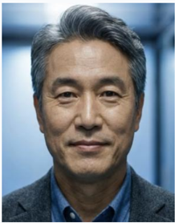
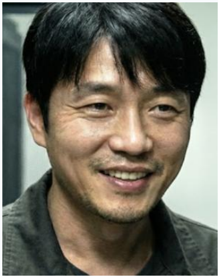
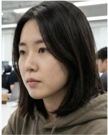
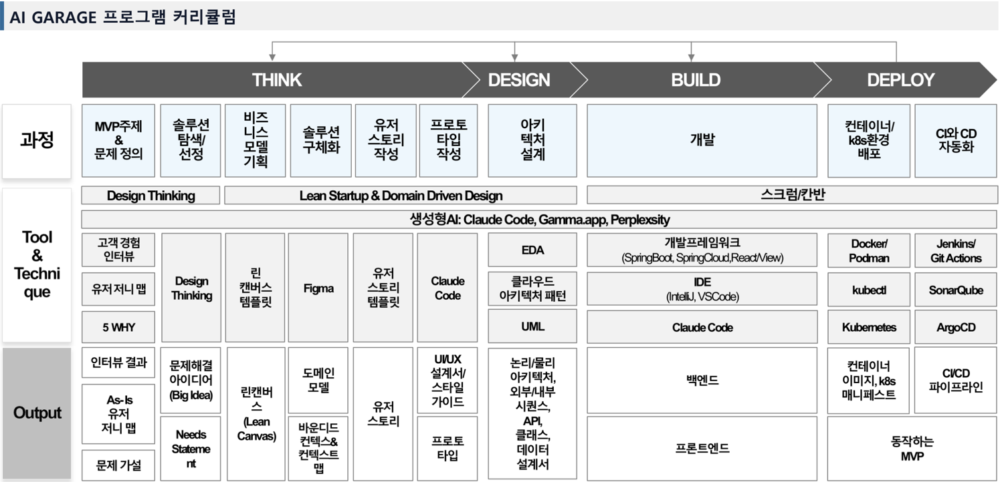

## 업체 일반현황

유니콘주식회사는 직원 역량 교육 및 IT 컨설팅 을 통해 기업의 디지털 전환을 선도합니다 .

| 회사정보   | 회사정보                                                       |
|------------|----------------------------------------------------------------|
| 회사명     | 유니콘주식회사 (Unicorn Co., Ltd.)                             |
| 설립일     | 2022 년 2 월 28 일                                             |
| 업종       | 시스템소프트웨어개발및공급업 , 직원훈련기관                    |
| 주요사업   | 직원역량교육 (AI, Agile, MSA, Cloud), IT 컨설팅 (CI/CD, Cloud) |
| 핵심가치   | Value-Oriented, Interactive, Iterative ('M' 사상기반 )         |

## 행동원칙

*Image 1*

## Value Oriented

WHY First, Align WHY 가치를 주지 못하는 것은 과감히 바꾸거나 버린다 .

*Image 2*

## Interactive

Believe Crew, Yes And 동료를 믿고 긍정적인 소통을 통해 집단지성을 극대화한다 .

*Image 3*

## Iterative

Fast Fail, Learn & Pivot 빠른 실패를 통해 배우고 유연하게 방향을 전환한다 .

## 최근 3 년 주요 수행실적

국내 유수의 기업을 대상으로 Cloud Native 기술 전환 교육을 성공적으로 완료하였습니다 .

## 주요 수행 실적

| 기간               | 프로젝트명                                  | 대상            | 주요내용                                  |
|--------------------|---------------------------------------------|-----------------|-------------------------------------------|
| 2024 .12 ~2025 .10 | KTDS Digital Garage (1~5 기 )               | KTDS 직원       | 애자일 기반 AI 를활용한현대화역량강화     |
| 2024.11~2025.10    | 연세대 AI 최고경영자 과정 (1 기 ~3 기 )     | 최고경영자      | AI 활용방안 및 생성형 AI 를 활용한 기획   |
| 2025.07~2025.11    | AI 활용 DT 서비스 기획자 멘토링 ( 총 3 회 ) | 취준생 / 이직자 | 일하는방식혁신과 AI 를 활용한 기획        |
| 2024.08~ 2024. 10  | 비상교육 CNA 부트캠프                       | 비상교육 직원   | 애자일 기반 AI 를 활용한 현대화 역량 강화 |
| 2024.07~2024.08    | CNA 부트캠프                                | 직장인          | 애자일 기반 AI 를 활용한 현대화 역량 강화 |
| 2023.11~ 2023. 12  | KB DigiTech Bootcamp                        | KB 신입행원     | 애자일 기반 클라우드 기술 역량 강화       |
| 2023.09~ 2023. 10  | 현대해상 U2C & AIOps PoC                    | 현대해상        | Unix to Container 이관및 AI 모니터링      |
| 2023.06~ 2023. 07  | KB PO 연수 Coaching                         | KB 국민은행     | 신입 PO 대상애자일사상및기법교육          |

## 연수 운영인원

기업교육 전문강사인 이해경 과 각 분야 전문 AI 에이젼트 10 인 이 기획부터 배포까지 전 과정을 코칭합니다 .

## 대표강사 및 애자일코칭팀

*이해경 '갑빠 "*

대표강사

## Certification

  - IBM Certified Agile Coach ·

  - Professional Scrum Master ·

  - IBM Certified Architect ·

  - ODI JTBD Associate ·

## 주요 경력

  - KTDS Digital Garage (1~5 기 ) ·

  - 연세대 AI 최고경영자 과정 (1 기 ~3 기 ) ·

  - AI 활용 DT 서비스 기획자 멘토링 ( 총 3 회 ) ·

  - 블로그 '온달의 해피클라우드' 운영 (2026/1 약 80 만 방문 ) ·

*김성한 " 피오 "*

*Image 6*

Product Owner

  - 주요 경력

  - 쿠팡플레이 대표

  - 쿠팡 로켓배송 PO ·

  - 《프로덕트 오너》 저자

## 박성준 '스크럼 "

Scrum Master

  - 주요 경력

  - 토스 애자일 코치 (4 년 ) ·

  - 우아한형제들 스크럼 마스터

  - SAFe 5.0 SPC ·

*Image 7*

*Image 8*

## 연수 운영인원

기업교육 전문강사인 이해경 과 각 분야 전문 AI 에이젼트 10 인 이 기획부터 배포까지 전 과정을 코칭합니다 .

## 개발코칭팀

*이미준 '도그냥 "*

*Image 10*

## 서비스기획자

  - 주요 경력

  - 카카오스타일 서비스기획 파트장

  - 생성형 AI 활용 워크숍 진행 ·

*강도윤 '데브 "*

## 풀스택개발자

  - 주요 경력

  - 클래스 101 백엔드 테크리드 ·

  - 패스트캠퍼스 풀스택 개발자

  - 우아한테크코스 3 기 수료 ·

*Image 11*

*홍길동 '아키 "*

*Image 13*

*Image 14*

## 테크니컬아키텍트

  - 주요 경력

  - 삼성 SDS 클라우드 아키텍처팀장 ·

  - 네이버 플랫폼 아키텍트

  - AWS SA Professional ·

*송주영 '파이프*

"

## CI/CD 엔지니어

  - 주요 경력

  - 카카오 DevOps 엔지니어 ·

  - CKA/CKS ·

  - AWS DevOps Professional ·

*Image 15*

*Image 16*

## 연수 운영인원

기업교육 전문강사인 이해경 과 각 분야 전문 AI 에이젼트 10 인 이 기획부터 배포까지 전 과정을 코칭합니다 .

## 개발코칭팀

*Image 17*

## 콘텐츠개발팀

*한승우 '마법사 "*

## AI 엔지니어

  - 주요 경력

  - 네이버 클로바 AI Lab 연구원 ·

  - KAIST AI 박 ·

  - Kaggle Master ·

*최윤정 '에듀핵 "*

## 교육콘텐츠전문가

  - 주요 경력

  - 메가스터디 콘텐츠개발본부장

  - 이화여대 겸임교수

  - 《교수설계의 이론과 실제》 저자

*조현아 '가디언 "*

*Image 20*

*Image 21*

*Image 22*

## QA(Quality Assurance)

  - 주요 경력

  - 당근마켓 QA 엔지니어 ·

  - ISTQB Advanced Level ·

  - Google UX Design Certificate ·

*윤재호 '클리닉 "*

## 교육심리학자

  - 주요 경력

  - 서울대교육학과교수

  - 미시간대 교육심리학 박사

  - 《학습동기의 심리학》 저자

*Image 23*

*Image 24*

## 2.1.1 교육 기대효과

KTDS, 연세대 등 다년간의 교육 경험과 애셋을 활용하여 단기간에 최대의 교육 효과를 달성하겠습니다 .

## 정량적기대효과

## 애자일 기반 협업 만족도 85 점 이상

  - 스프린트기반팀프로젝트경험

## 클라우드 기술 역량 85% 이상 향상

  - KTDS 평균 87.2% 향상

## 실무 즉시 적용 기대도 85 점 이상

  - KTDS 평균약 86 점

## 교육 만족도 90 점 이상

  - KTDS 평균약 93 점

## 정성적기대효과

## 애자일 기반 AI 를 활용한 업무 방식 내재화

  - 문제 / 솔루션 / 제품검증을통한피드백루프

  - AI 를활용한생산성향상체험

## 사용자 중심의 서비스 기획 및 상위 설계 역량 향상

  - 사용자와의공감과이해를통한문제 / 솔루션정의

  - DDD( 업무중심설계 ) 기반의상위설계역량향상

## 애플리케이션 현대화 역량 향상

  - 클라우드디자인패턴적용한마이크로서비스설계

  - ·레이어드 / 클린 아키텍처 패턴 적용한 개발

## CI/CD 파이프라인 구축 및 자동화 역량 강화

  - 컨테이너와쿠버네티스이해

  - Jenkins, GitHub Actions, ArgoCD 기반 CI/CD

## 2.1.2 단계별 커리큘럼 › 개요

기획 -설계 -개발 -배포 전 과정에 AI 를 활용하여 일하는 방식 혁신과 애플리케이션 현대화 역량을 단기간에 성장시킬 수 있는 검증된 Hands-On 프로그램입니다 .

*Image 25*

## 2.1.2 단계별 커리큘럼 › Phase1: 기획

기획 단계는 Human 이 주도하고 AI 가 지원하여 상위수준 기획 결과를 바탕으로 구체적인 요구사항을 정의한 후 프로토타입을 작성하여 사용자 피드백을 받습니다 .

| 영역          | 모듈명                                             | 주요내용                                                                                                                                                                                                                                            |
|---------------|----------------------------------------------------|-----------------------------------------------------------------------------------------------------------------------------------------------------------------------------------------------------------------------------------------------------|
| 개요          | 일하는방식혁신프레임워크이해                       | 골든써클프레임워크 (WHY-HOW-WHAT) 기반으로애자일 /MSA/DevOps/Cloud 으로 구성된일하는방식혁신프레임워크이해                                                                                                                                          |
| 상위수준 기획 | Design Thinking 기반의문제정의및 솔루션탐색 / 선정 | - MVP 주제및고객유형정의 - 고객경험수집 : 관찰 , 체험 , 고객경험인터뷰 , 페르소나정의및 User Journey Map 작성 - Great 2 WHY( 문제근본원인과고객 / 회사의비즈니스가치 ) 정의 , 문제검증인터뷰 - 문제해결방향성정의 , 솔루션탐색 , 우선순위평가및선정 |
| 상위수준 기획 | 비즈니스모델작성                                   | - 린캔버스작성 : 고객 , 문제 , 고유가치 , 핵심솔루션등 9 대영역으로작성 - 발표자료작성 : gamma.app 을이용한빠르고효과적인발표자료작성                                                                                                               |
| 기획 구체화   | Event Storming 을통한기획구체화                    | - DDD 기반으로 Figma 와 Claude Code 를이용한도메인모델초안작성 - Event Storming 워크샵으로도메인모델보완                                                                                                                                            |
| 기획 구체화   | 유저스토리작성                                     | - Figma MCP 를이용하여이벤트스토밍결과를읽어유저스토리초안작성및보완 - INVEST 기준작성 , 인수조건정의 , MoSCoW 우선순위결정 - MVP 범위결정및스프린트계획                                                                                            |
| 기획 구체화   | 프로토타입개발및솔루션검증 인터뷰통한피드백수렴    | - Claude Code 또는 Cursor 를이용한프로토타입개발및보완 - 솔루션검증인터뷰수행및피드백수렴                                                                                                                                                           |

## 2.1.2 단계별 커리큘럼 › Phase2: 설계

설계 단계는 AI 가 주도하고 Human 이 검토하여 마이크로서비스 간 외부 아키텍처와 마이크로서비스 내부 아키텍처를 설계합니다 .

| 영역                 | 모듈명                          | 주요내용                                                                                                                                                                                             |
|----------------------|---------------------------------|------------------------------------------------------------------------------------------------------------------------------------------------------------------------------------------------------|
| 백엔드 아키텍처 설계 | MSA 설계 이해                   | - MSA 플랫폼 구성요소 이해 - mSVC 외부 아키텍처 설계 이해 : Spring Cloud, Istio, EDA(Event Driven Architecture) - mSVC 내부 아키텍처 설계 이해 : 아키텍처 원칙 , 레이어드 / 헥사고널 / 클린 아키텍처 |
| 백엔드 아키텍처 설계 | Cloud Design Pattern 적용       | - Cloud Design Pattern 이해 - AI 를 이용한 Cloud Design Pattern 적용 방안 작성 및 검토                                                                                                               |
| 백엔드 아키텍처 설계 | 논리아키텍처 설계               | - AI 를 이용한 논리아키텍처 설계 및 검토                                                                                                                                                             |
| 백엔드 아키텍처 설계 | 외부시퀀스 설계                 | - AI 를 이용한 외부시퀀스 설계 및 검토                                                                                                                                                               |
| 백엔드 아키텍처 설계 | 내부시퀀스 설계                 | - AI 를 이용한 서비스 별 내부시퀀스 설계 및 검토                                                                                                                                                     |
| 백엔드 아키텍처 설계 | API 설계                        | - API 설계 방법 이해 - AI 를 이용한 서비스 별 API 설계 및 검토                                                                                                                                       |
| 백엔드 아키텍처 설계 | Classs 설계                     | - Class Diagram 작성 방법 이해 - AI 를 이용한 서비스 별 Class 설계 및 검토                                                                                                                           |
| 백엔드 아키텍처 설계 | Data 설계                       | - Database 선택 가이드 ' CAP ' 이론 이해 - AI 를 이용한 서비스 별 Data 설계 및 검토                                                                                                                  |
| 백엔드 아키텍처 설계 | High-Level 아키텍처 정의서 작성 | - AI 를 이용한 High-Level 아키텍처 정의서 작성 및 검토                                                                                                                                               |
| 백엔드 아키텍처 설계 | 물리아키텍처 설계               | - AI 를 이용한 물리아키텍처 설계 및 검토                                                                                                                                                             |

## 2.1.2 단계별 커리큘럼 › Phase3: 개발

개발 단계는 AI 가 주도하고 Human 이 검토하는 방식으로 백엔드 , 프론트엔드 , AI 연계 개발을 진행합니다 .

| 영역                   | 모듈명             | 주요내용                                                                                                                                             |
|------------------------|--------------------|------------------------------------------------------------------------------------------------------------------------------------------------------|
| 백엔드개발             | 백킹서비스배포     | helm chart 를이용한데이터베이스와메시지큐배포                                                                                                        |
| 백엔드개발             | 마이크로서비스개발 | - Spring Boot + Spring Cloud 기반개발 - AI 를이용한 Layered/Clean 개발아키텍처패턴을적용한개발및리뷰 - 브랜치전략이해및적용 : Gitflow 와 Trunk-Based |
| 백엔드개발             | 테스트코드개발     | - TDD 이해 - AI 를이용한단위 / 통합 /E2E 테스트코드개발                                                                                              |
| 프론트엔드 설계 / 개발 | 프론트엔드설계     | - UI/UX 설계서작성 - 스타일가이드작성 - 정보아키텍처작성 - API 매핑설계서작성                                                                        |
| 프론트엔드 설계 / 개발 | 프론트엔드개발     | React/Vue.js + TypeScript 기반프론트엔드개발                                                                                                         |
| AI 연계                | AI 프로그램개발    | - AI API 연동 , MCP 연동 - 벡터라이징 , RAG 패턴적용                                                                                                 |

## 2.1.2 단계별 커리큘럼 › Phase4: 배포

배포 단계는 AI 가 주도하고 Human 이 검토하는 방식으로 진행되며 , 수동배포 과정을 통해 컨테이너와 쿠버네티스를 이해하고 Jenkins, GitHub Actions, ArgoCD 를 이용하여 CI/CD 자동화를 학습합니다 .

| 영역         | 모듈명                | 주요내용                                                                                                                                                                                                                                                           |
|--------------|-----------------------|--------------------------------------------------------------------------------------------------------------------------------------------------------------------------------------------------------------------------------------------------------------------|
| 수동배포     | 컨테이너화            | - Dockerfile 작성 , 멀티스테이지 빌드와 컨테이너 이미지 업로드 - Docker 이용한 컨테이너 실행                                                                                                                                                                       |
| 수동배포     | Kubernetes 수동 배포  | - Kubernetes 매니페스트 파일 작성 - Kubectl 을 이용한 수동 배포                                                                                                                                                                                                    |
| CI/CD 자동화 | CI/CD 파이프라인 구축 | Jenkins/ GitHub Actions Workflow 기반 CI/CD: - SonarQube 품질 검사 및 자동화 테스트 연동 - Jenkins 기반 CI/CD: AI 를 이용한 Scripted 방식의 파이프라인 스크립트 작성 - GitHub 기반 CI/CD: AI 를 이용한 GitHub Workflow 작성 - Kustomize 를 활용한 환경별 배포 구성 |
| CI/CD 자동화 | CI/CD 파이프라인 구축 | ArgoCD Gitops 기반 CD: - ArgoCD 서버 설정 : Project, Application 작성 - Jenkins 파이프라인 스크립트 수정 : CD 과정 분리 - GitHub Workflow 수정 : CD 과정 분리                                                                                                      |

## 2.1.3 교육 운영 방식

자기결정이론과 인지부하 이론을 적용한 교육 콘텐츠를 사용하여 스프린트 기반으로 Human 과 AI 가 협업하면서 진행되며 상황에 맞는 평가 및 피드백을 통해 학습효과를 극대화합니다 .

| 구분             | 주요내용                                                                                                                                                                                                                                                                                                                                      |
|------------------|-----------------------------------------------------------------------------------------------------------------------------------------------------------------------------------------------------------------------------------------------------------------------------------------------------------------------------------------------|
| 스프린트기반학습 | - Sprint Planning: 1 주일단위스프린트로목표및백로그설정 - DSU(Daily Standup): 진행상황공유및장애물제거 - Sprint Review: 스프린트결과물팀상호피드백 - Sprint Retrospective: 회고및다음스프린트 Action plan 수립 - 스프린트산출물 : Working Software + 문서화                                                                                   |
| Human+AI 협업    | - Think( 기획 ): Human 주도 , AI 지원 ( 문제정의 , 아이디어 , 유저스토리등 ) - Design( 설계 ): AI 주도 , Human 검토 ( 아키텍처 , API 스펙승인등 ) - Develop( 개발 ): AI 주도 , Human 검토 ( 코드리뷰 , PR 머지등 ) - Deploy( 배포 ): AI 주도 , Human 검토 ( 매니페스트리뷰 , 배포수행등 )                                                     |
| 학습설계원칙     | - 이론 30% : 실습 70% 비율 - 자기결정이론 (SDT) 기반동기설계 - 자율성 : MVP 주제선택 , AI 도구활용방식자율 - 효능감 : Daily Quiz 즉각피드백 , 단계적성취감 - 관계성 : 팀프로젝트 , 코드리뷰파트너지정 , Daily Standup - 인지부하이론적용 : Phase 별난이도상승 개념이해 (Think )→ 설계적용 (Design )→ 코드구현 (Develop )→ 운영자동화 (Deploy) |
| 평가및피드백     | - 형성평가 : Daily Quiz, 실습결과물피드백 - 총괄평가 : 최종프로젝트발표및동료평가 - 학습전이지원 : Action Plan 수립 , Follow-up 세션                                                                                                                                                                                                          |

## 2.1.3 교육 운영 방식

AI GARAGE 는 Human 과 AI 가 쉽고 효율적으로 협업할 수 있도록 로컬 개발 환경 , 가이드 저장소 , Claude 영역으로 나누어 동작하도록 설계되어 있습니다 .

## Human + AI 협업 개념도

## 가이드 저장소 (GitHub)

  - guides/ 가이드문서

  - /references/ 참조자료

  - /samples/ 샘플코드

  - /standards/ 표준정의

문서 요청

## Claude(AI Agent)

Command 정의 파일 검색 → 프롬프트 약어 및 가이드 URL 추출 → 가이드 문서 다운로드 → 가이드 기반 작업 수행

작업 요청

## PC( 로컬 개발 환경 )

  - CLAUDE.md -프로젝트 지침 , 가이드 URL 목록

  - .claude/commands/ - Phase 별 명령어 파일

  - claude/ -가이드 다운로드 디렉토리

  - 산출물 : think/, design/, develop/, deployment/, 소스디렉토리

결과 생성

| 구분   | 주체        | 영역                                                                                    | 주요내용   |
|--------|-------------|-----------------------------------------------------------------------------------------|------------|
| Human  | PC          | 명령어를 입력하여 작업 트리거                                                           | 요청       |
| AI     | PC          | .claude/commands 디렉토리에서커맨드 스펙 탐색                                           | 탐색       |
| AI     | PC          | CLAUDE.md 파일을 읽어 프롬프트에 포함된 약어를 풀이하고 , 필요한 가이드 문서의 URL 파악 | 해석       |
| AI     | Repo PC     | 가이드저장소에서최신 가이드를 curl 로 다운로드하여 로컬 claude/ 디렉토리에 저장         | 동기화     |
| AI     | Claude      | 프롬프트 ( 약어풀이 + 요청 사항 ) 와 가이드 문서의 지침을 결합하여 컨텍스트 구성        | 추론       |
| AI     | Claude → PC | 기획 - 설계 - 개발 - 배포단계에 맞는 최종 결과물을 PC 의 산출물 디렉토리에 생성         | 완료       |

## 2.1.4 사용 도구 및 기술 스택

AI GARAGE 프로그램은 애플리케이션 현대화와 클라우드 네이티브 애플리케이션 개발에 필요한 다양한 도구와 기술 스택을 체험할 수 있도록 설계되어 있습니다 .

| 영역 도구 및 기술                                                                    |
|--------------------------------------------------------------------------------------|
| AI 도구 Claude 온라인 , Claude Code, Cursor, MCP(Figma, Context7 등                  |
| 기획 / 설계 Figma(FigJam), Mermaid, PlantUML, OpenAPI 3.0                            |
| 백엔드개발 Spring Boot, Spring Cloud, JPA, Gradle, PostgreSQL, Redis, Kafka          |
| AI 연계개발 AI API(OpenAI, Anthropic 등 ), RAG 패턴 (LangChain, n8n 등 ), 벡터라이징 |
| 프론트엔드개발 React/Vue.js, TypeScript, Tailwind CSS, Zustand/Redux, Vite,          |
| DevOps Docker, Kubernetes, Helm, Jenkins, GitHub Actions, ArgoCD, SonarQube,         |
| 클라우드 Azure(AKS, ACR) / AWS(EKS, ECR) / minikube                                  |
| 진행관리 / 산출물 Trello, Google Drive                                               |

## 2.1.5 교육 일정 ( 안 )

단기간에 AI 도구 (Claude Code) 를 활용하여 생산성을 극대화하고 , 실무 적용 가능한 Cloud Native Application 개발 역량을 내재화할 수 있도록 합니다 .

| 기간   | 단계 주요 활동 내용                                                     |
|--------|-------------------------------------------------------------------------|
| 3 일   | Think( 기획 ) • 비즈니스모델작성 • Event Storming 을통한기획구체화      |
| 2 일   | Design( 설계 ) • Cloud Design Pattern 적용                              |
| 3 일   | Develop( 개발 ) • 백엔드 / 프론트엔드 /AI 프로그램개발 • 테스트코드작성 |
| 2 일   | Deploy( 배포 ) • CI/CD 파이프라인구축                                   |

※ 위 일정은 예시이며 , 고객사요구사항에따라 2 주 ~5 주과정으로조정가능 합니다 . ※ 기획 -설계 -개발 -배포를 독립적인교육과정으로분리하여필요한단계만수강 할수있음
