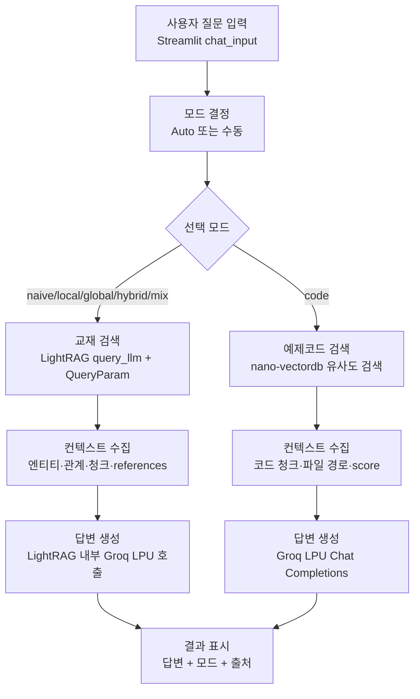

# LightRAG GraphRAG 검색 예제

교재 Knowledge Graph + 벡터 인덱스와 예제코드 전용 벡터 인덱스를 함께 조회하는 Streamlit 검색 앱임.  
교재 검색은 LightRAG `QueryParam(mode=...)` 기반으로 `naive/local/global/hybrid/mix`를 지원하고,  
예제코드 검색은 별도 `store/vector/code/vdb_code.json` nano-vectordb를 직접 조회함.  

---

## 1. 개요

| 항목 | 내용 |
|---|---|
| UI | Streamlit 채팅 인터페이스 |
| 교재 검색 | `store/kg/` LightRAG working_dir 조회 |
| 코드 검색 | `store/vector/code/vdb_code.json` nano-vectordb 조회 |
| LLM | `openai/gpt-oss-20b` (Groq LPU, OpenAI 호환 API) |
| 임베딩 | `qwen3-embedding` (4096차원, Ollama) |
| API 키 | `hands-on/.env`의 `GROQ_API_KEY` |

---

## 2. 검색 처리 흐름



Auto 라우팅은 규칙 기반 패턴 매칭을 먼저 수행함.  
확신도가 낮으면 Groq LPU Few-shot 라우터를 호출해 검색 모드를 보정함.  

---

## 3. 검색 모드

| 모드 | 검색 대상 | 설명 |
|---|---|---|
| `naive` | 교재 청크 벡터 | KG 없이 청크 임베딩 유사도 검색 수행 |
| `local` | 교재 엔티티·관계·청크 | Low-level 키워드 기반 구체 엔티티 중심 검색 수행 |
| `global` | 교재 관계·엔티티·청크 | High-level 키워드 기반 넓은 주제 검색 수행 |
| `hybrid` | 교재 엔티티 + 관계 | Local + Global 결과 통합, 비교·관계 질문에 권장 |
| `mix` | 교재 KG + 청크 벡터 | naive + local + global 통합 검색 수행 |
| `code` | 예제코드 벡터 인덱스 | LightRAG KG 미사용, 코드 청크만 직접 유사도 검색 |

---

## 4. 설정 옵션

`config/settings.py`의 `Settings`에서 관리함.  
`hands-on/.env`를 먼저 로드하고, `retrieve/.env`가 있으면 로컬 오버라이드로 추가 로드함.  

| 설정 | 기본값 | 환경변수 | 설명 |
|---|---:|---|---|
| `groq_model` | `openai/gpt-oss-20b` | `GROQ_MODEL` | 답변 생성·라우터 fallback LLM |
| `groq_base_url` | `https://api.groq.com/openai/v1` | `GROQ_BASE_URL` | Groq OpenAI 호환 엔드포인트 |
| `groq_api_key` | 없음 | `GROQ_API_KEY` | Groq API 키 |
| `groq_max_tokens` | `2048` | `GROQ_MAX_TOKENS` | 답변 생성 최대 토큰 |
| `ollama_base_url` | `http://localhost:11434` | `OLLAMA_BASE_URL` | Ollama 서버 주소 |
| `embedding_model` | `qwen3-embedding` | `EMBEDDING_MODEL` | Ollama 임베딩 모델 |
| `embedding_dim` | `4096` | - | nano-vectordb 임베딩 차원 |
| `top_k` | `8` | `LIGHTRAG_TOP_K` | 엔티티·관계 검색 상위 개수 |
| `chunk_top_k` | `6` | `LIGHTRAG_CHUNK_TOP_K` | 청크 검색 상위 개수 |
| `code_top_k` | `5` | `CODE_TOP_K` | 코드 검색 상위 개수 |
| `code_score_threshold` | `0.15` | `CODE_SCORE_THRESHOLD` | 코드 검색 최소 cosine score |
| `router_confidence_threshold` | `0.72` | `ROUTER_CONFIDENCE_THRESHOLD` | LLM fallback 실행 기준 |

---

## 5. 주요 소스

| 파일 | 역할 |
|---|---|
| `app.py` | Streamlit 채팅 UI, 모드·Top-K 설정, 답변·출처 표시 |
| `search_service.py` | 라우팅 → 검색기 분기 → 실행 시간 기록 |
| `query_router.py` | Auto 모드 패턴 매칭 + Groq Few-shot fallback |
| `lightrag_retriever.py` | `store/kg/` 기반 LightRAG 교재 검색 |
| `code_vector_search.py` | `store/vector/code/vdb_code.json` 직접 유사도 검색 |
| `llm_client.py` | Groq OpenAI 호환 LLM 함수와 Chat Completions 클라이언트 |
| `embeddings.py` | Ollama `qwen3-embedding` 전용 임베딩 함수 |
| `check_retrieve.py` | 외부 API 없이 인덱스 파일·라우터·설정 오프라인 검증 |
| `config/settings.py` | 경로·모델·검색 파라미터 설정 |

---

## 6. 가상환경 설정

> LightRAG 검색 예제는 PyTorch를 직접 사용하지 않으므로 `--system-site-packages` 옵션이 필요 없음.  

### Windows / PowerShell

```powershell
cd hands-on/14.graphrag/lightrag/retrieve
python -m venv venv
venv\Scripts\Activate.ps1
pip install --upgrade pip setuptools
pip install -r requirements.txt
```

### Windows / GitBash

```bash
cd hands-on/14.graphrag/lightrag/retrieve
python -m venv venv
source venv/Scripts/activate
pip install --upgrade pip setuptools
pip install -r requirements.txt
```

### macOS / Linux

```bash
cd hands-on/14.graphrag/lightrag/retrieve
python -m venv venv
source venv/bin/activate
pip install --upgrade pip setuptools
pip install -r requirements.txt
```

---

## 7. 사전 준비

1. `hands-on/.env`에 Groq API 키 설정  

```text
GROQ_API_KEY=gsk_...
```

2. Ollama 서버 실행 및 임베딩 모델 준비  

```bash
ollama serve
ollama pull qwen3-embedding
```

3. 인덱싱 산출물 확인  

```text
hands-on/14.graphrag/lightrag/store/kg/
hands-on/14.graphrag/lightrag/store/vector/code/vdb_code.json
```

---

## 8. 실행 방법

오프라인 검증 실행:  

```bash
python check_retrieve.py
```

Streamlit 앱 실행:  

```bash
streamlit run app.py
```

브라우저에서 표시된 로컬 URL 접속 후 질문 입력.  

---

## 9. 실행 예시

> 아래 예시는 검색 모드별 동작을 설명하기 위한 것임.  
> 실제 답변과 출처는 인덱싱한 내용에 따라 달라짐 (해당 주제·코드가 인덱싱되어 있어야 의미 있는 답변 생성).  
> 예: STT 교재만 인덱싱된 상태에서는 STT 질문에, 멀티턴 챗봇 코드만 인덱싱된 상태에서는 해당 코드 질문에 답변함.  

### 교재 검색

```text
질문: GraphRAG와 Vector RAG의 차이와 적용 기준은?
Auto 라우팅: hybrid
결과: 교재 KG의 엔티티·관계와 관련 청크를 결합해 비교 답변 생성
출처: agentic-ai/textbook/14.GraphRAG.md 등
```

### 전역 주제 검색

```text
질문: LightRAG의 전체 검색 처리 흐름을 요약해줘
Auto 라우팅: global
결과: High-level 키워드 기반 관계 검색으로 넓은 맥락 답변 생성
```

### 예제코드 검색

```text
질문: Streamlit 채팅 UI 예제코드는 어떻게 구현돼?
Auto 라우팅: code
결과: store/vector/code/vdb_code.json의 코드 청크 유사도 검색 후 Groq LPU로 답변 생성
출처: hands-on/**/*.py
```

---

## 10. 에러 처리

| 상황 | 처리 |
|---|---|
| `GROQ_API_KEY` 없음 | 실행 초기에 명확한 오류 반환 |
| LightRAG `query` 실패 | 사용자에게 오류 메시지 반환, ERROR 로그 기록 |
| 코드 벡터 검색 실패 | 사용자에게 오류 메시지 반환, ERROR 로그 기록 |
| 검색 결과 없음 | 안내 메시지 반환, WARNING 로그 기록 |
| 인덱스 파일 누락 | `check_retrieve.py` 또는 검색 실행 시 누락 파일 표시 |

로그 파일 위치: `hands-on/14.graphrag/lightrag/retrieve/logs/retrieve.log`  
