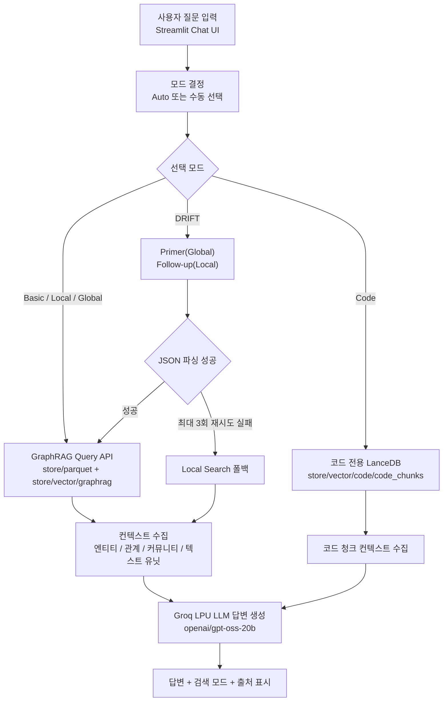

# Microsoft GraphRAG 검색 예제

Microsoft GraphRAG 인덱싱 결과를 이용한 Streamlit 검색 앱임.  
교재 검색은 GraphRAG Parquet + LanceDB 산출물을 사용하고, 예제코드 검색은 별도 LanceDB 코드 인덱스만 사용함.  

## 문서검색 처리 흐름



## 설정 옵션

| 옵션 | 기본값 | 설명 |
|---|---:|---|
| `GRAPHRAG_QUERY_MODEL` | `openai/gpt-oss-20b` | 검색 답변 생성용 Groq LPU 모델 |
| `GRAPHRAG_EMBEDDING_MODEL` | `qwen3-embedding` | 코드 검색 질의 임베딩용 Ollama 모델 |
| `OLLAMA_BASE_URL` | `http://localhost:11434` | Ollama API 주소 |
| `GRAPHRAG_RESPONSE_TYPE` | 한국어 근거 답변 | GraphRAG API에 전달할 응답 형식 |
| `GRAPHRAG_COMMUNITY_LEVEL` | `2` | Local / Global / DRIFT 커뮤니티 레벨 |
| `GRAPHRAG_CODE_TOP_K` | `5` | 코드 LanceDB 검색 상위 결과 수 |
| `GRAPHRAG_GRAPH_TOP_SOURCES` | `8` | UI에 표시할 GraphRAG 출처 수 |
| `GRAPHRAG_ROUTER_MIN_CONFIDENCE` | `0.65` | Auto 패턴 라우팅 확신도 기준 |
| `GRAPHRAG_DRIFT_JSON_RETRIES` | `3` | DRIFT JSON 파싱 오류 재시도 횟수 |
| `GRAPHRAG_DYNAMIC_GLOBAL_SELECTION` | `false` | Global Search 동적 커뮤니티 선택 여부 |

`hands-on/.env`의 `GROQ_API_KEY`를 사용함.  
검색 시 `settings.yaml`은 그대로 로드하되, completion 모델만 `openai/gpt-oss-20b`로 교체함.  

## 검색 모드별 인덱스 의존성

각 모드가 실제로 조회하는 산출물임. 인덱싱 결과가 불완전하면 해당 모드가 빈 결과를 반환함.  

| 모드 | 조회 대상 | 필요한 LanceDB 테이블 | 비고 |
|---|---|---|---|
| Basic | 텍스트 유닛 임베딩 | `store/vector/graphrag/text_unit_text` | 텍스트 유닛 벡터 유사도 |
| Local | 엔티티 설명 임베딩 + KG | `store/vector/graphrag/entity_description` (+ parquet) | 엔티티 중심 주변 탐색 |
| Global | 커뮤니티 리포트 | `store/parquet/community_reports` | 벡터 검색 미사용(리포트 맵리듀스) |
| DRIFT | 커뮤니티 + 엔티티 임베딩 | `community_full_content` + `entity_description` | Primer(Global) → Follow-up(Local) |
| Code | 코드 청크 임베딩 | `store/vector/code/code_chunks` | GraphRAG KG 미사용, 별도 인덱스 |

> **MUST — index_name 분리**: `indexing/settings.yaml`의 `vector_store.index_schema`에서  
> `entity_description`·`text_unit_text`·`community_full_content`에 서로 다른 `index_name`을 지정해야 함.  
> 미지정 시 모두 기본값 `vector_index` 테이블로 매핑되어 인덱싱 중 서로 덮어쓰며,  
> 엔티티 임베딩이 누락되어 **Local·Basic·DRIFT가 빈 결과**를 반환함.  

> **인덱스 적재 확인**: 인덱싱 완료 후 `python ../indexing/validate_index.py` 실행으로  
> `C4`(entity_description)·`W8`(text_unit_text)·`W9`(community_full_content) 항목이 PASS인지 확인함.  

> **임베딩 모델 실행 필요**: Basic/Local/DRIFT의 쿼리 임베딩과 Code 검색은 Ollama `qwen3-embedding`(4096차원)을 사용하므로  
> 검색 전 Ollama 서버와 모델이 실행 중이어야 함.  

## 주요 소스

| 파일 | 설명 |
|---|---|
| `app.py` | Streamlit 채팅 UI, 사이드바 설정, 결과와 출처 표시 |
| `router.py` | Auto 모드 라우터. 패턴 매칭 후 확신도 낮으면 LLM few-shot 라우팅 수행 |
| `retriever.py` | GraphRAG Query API 호출, DRIFT 재시도/Local 폴백, 코드 LanceDB 검색 |
| `llm.py` | GraphRAG 내장 LLM factory(`graphrag_llm.create_completion`) 래퍼 |
| `config.py` | 경로, 환경변수, GraphRAG 설정 로딩 |
| `requirements.txt` | 검색 앱 실행 의존성 |

## 가상환경 설정

### Windows / PowerShell

```powershell
cd C:\Users\hiond\workspace\aistudy\hands-on\14.graphrag\ms-graphrag\retrieve
python -m venv venv
venv\Scripts\Activate.ps1
pip install --upgrade pip setuptools
pip install -r requirements.txt
```

### Windows / GitBash

```bash
cd /c/Users/hiond/workspace/aistudy/hands-on/14.graphrag/ms-graphrag/retrieve
python -m venv venv
source venv/Scripts/activate
pip install --upgrade pip setuptools
pip install -r requirements.txt
```

### macOS / Linux

```bash
cd hands-on/14.graphrag/ms-graphrag/retrieve
python -m venv venv
source venv/bin/activate
pip install --upgrade pip setuptools
pip install -r requirements.txt
```

## 실행 방법

사전 준비로 Ollama와 임베딩 모델이 필요함.  

```bash
ollama serve
ollama pull qwen3-embedding
```

검색 앱 실행 예시임.  

```bash
cd hands-on/14.graphrag/ms-graphrag/retrieve
streamlit run app.py
```

## 실행 예시

| 질문 | 권장 모드 | 설명 |
|---|---|---|
| `GraphRAG의 전체 처리 흐름을 요약해줘` | Global | 커뮤니티 리포트 기반 전체 요약 |
| `Local Search는 어떤 엔티티를 중심으로 동작해?` | Local | 특정 개념 중심 주변 엔티티·관계 검색 |
| `GraphRAG와 Vector RAG는 어떻게 연결돼?` | DRIFT | 전역 관점 후 상세 근거 보강 |
| `Basic Search의 목적은?` | Basic | 텍스트 유닛 벡터 기반 단순 질의 |
| `예제코드에서 Streamlit 채팅 UI는 어디서 구현돼?` | Code | 별도 코드 LanceDB 인덱스 검색 |

## 구현 제약 반영

- Basic / Local / Global / DRIFT는 `graphrag.api` Query API 사용.  
- Code는 GraphRAG KG를 사용하지 않고 `store/vector/code/code_chunks` LanceDB만 조회.  
- DRIFT Search는 JSON 파싱 오류 감지 시 최대 3회 재시도 후 Local Search로 폴백.  
- 답변 생성은 Groq LPU의 `openai/gpt-oss-20b` 사용.  
- LLM 호출은 GraphRAG 패키지의 내장 completion factory를 통해 수행.  
