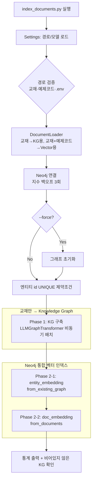

# LangChain + Neo4j GraphRAG — 인덱싱 파이프라인

교재(마크다운)와 예제코드(Python)를 Neo4j에 인덱싱하여 GraphRAG 검색의 토대를 만드는 파이프라인임.  
LangChain의 `LLMGraphTransformer`로 교재에서 Knowledge Graph를 구축하고, Neo4j 벡터 인덱스 2개  
(`entity_embedding`·`doc_embedding`)를 함께 생성함. Neo4j가 KG와 벡터 인덱스를 한 DB에 통합 저장하므로  
별도 벡터 저장소가 필요 없음.

---

## 1. 인덱싱 전략 (데이터소스 분리)

| 데이터소스 | 경로 | 인덱싱 방식 | 근거 |
|---|---|---|---|
| 교재 | `agentic-ai/textbook/*.md` | **KG + Vector** | 개념·기술 간 관계가 풍부 → 멀티홉 추론용 KG 구축이 효과적 |
| 예제코드 | `hands-on/**/*.py` | **Vector만** | 절차적 특성상 엔티티 추출 효용 낮음 → 벡터 유사도 검색이 적합 |

- 교재는 `load_for_kg()`(KG 구축)와 `load_for_vector()`(벡터)에 **양쪽 모두** 들어감
- 예제코드는 `load_for_vector()`에만 들어감 (KG 미구축)
- 생성되는 벡터 인덱스 2개
  - `entity_embedding`: 교재 엔티티의 `id`(+`description`) 임베딩 — `Neo4jVector.from_existing_graph`
  - `doc_embedding`: 교재 청크 + 예제코드 텍스트 임베딩 — `Neo4jVector.from_documents` (`Chunk` 노드)

---

## 2. 인덱싱 처리 흐름



**처리 단계 요약**

| 단계 | 작업 | 모듈 |
|---|---|---|
| 1 | 경로/설정 로드 후 도출 경로를 먼저 로깅 (off-by-one 조기 발견) | `config/settings.py` |
| 2 | 교재(KG용)·교재+예제코드(Vector용) 분리 로드·청킹 | `document_loader.py` |
| 3 | Neo4j 연결 (지수 백오프 1·2·4초) + `--force` 시 초기화 | `graph/neo4j_connection.py` |
| 4 | 교재 청크에서 엔티티/관계 추출 → KG 저장 (비동기 배치) | `kg_builder.py` |
| 5 | `entity_embedding`·`doc_embedding` 벡터 인덱스 생성 | `vector_index.py` |
| 6 | KG 통계 출력 + "추출 엔티티 0개" 경고 (성공 판정) | `index_documents.py` |

---

## 3. 기술 스택

| 항목 | 값 |
|---|---|
| GraphRAG 프레임워크 | LangChain + Neo4j |
| Graph DB | Neo4j Community Edition 5.26 (Docker, GDS 미지원 → 커뮤니티 탐지 불가) |
| LLM (엔티티 추출) | `openai/gpt-oss-120b` (Groq LPU, OpenAI 호환 API) |
| 임베딩 | `qwen3-embedding` (4096차원, Ollama 로컬) |
| 플러그인 | APOC Core (`NEO4J_PLUGINS=["apoc"]` 자동 설치) |
| 포트 | Bolt `7687`, HTTP `7474` |

> **GROQ_API_KEY** 는 `hands-on/.env` 에서 자동 로드됨 (`indexing/.env` 로 오버라이드 가능).

---

## 4. 설정 옵션 (`config/settings.py`)

| 옵션 | 기본값 | 설명 |
|---|---|---|
| `neo4j_uri` | `bolt://localhost:7687` | Neo4j 접속 URI |
| `neo4j_user` / `neo4j_password` | `neo4j` / `password` | 계정 (docker-compose 기본값과 일치) |
| `ollama_base_url` | `http://localhost:11434` | Ollama 서버 주소 |
| `embedding_model` | `qwen3-embedding` | 임베딩 모델 |
| `embedding_dim` | `4096` | 임베딩 차원 (벡터 인덱스와 일치 필수) |
| `groq_model` | `openai/gpt-oss-120b` | 엔티티 추출 LLM |
| `chunk_size` / `chunk_overlap` | `800` / `100` | 청크 크기·중복 (작은 청크가 추출 정확도 ↑) |
| `batch_size` | `10` | KG 구축 배치 크기 |
| `allowed_nodes` | `Concept, Technology, Framework, Library, Model, Tool, Task` | 허용 엔티티 타입 (**영어 필수**) |
| `allowed_relationships` | `USES, DEPENDS_ON, IMPLEMENTS, CONTAINS, COMPARES, EXTENDS, PROVIDES` | 허용 관계 타입 (**영어 필수**) |
| `strict_mode` | `False` | 허용 목록 외 엔티티/관계도 저장 (재현율 우선) |
| `ignore_tool_usage` | `False` | 함수호출 경로 추출 (아래 ⚠️ 참고) |

### ⚠️ LLM 모델별 추출 모드 (중요)

엔티티/관계 추출 경로는 **LLM 모델에 따라 달라야 함**. `LLMGraphTransformer`의 함수호출 경로는
`node_properties`(엔티티 `description` 추출)를 지원하지만, 모델이 함수호출 구조화 출력을 못 내면 실패함.

| 모델 | 권장 설정 | 결과 (실측) |
|---|---|---|
| **`openai/gpt-oss-120b`** (기본) | `ignore_tool_usage=False` (함수호출) | ✅ 동작. 20청크 전부 성공, **엔티티 162개**(7개 타입 전부)·관계 7종 추출, **description 99/127** |
| `openai/gpt-oss-20b` | `ignore_tool_usage=True` (프롬프트) | 함수호출 시 `400 json_validate_failed`로 **엔티티 0개** → 프롬프트 추출 필요(단 description 미지원) |

- **120b는 함수호출 구조화 출력이 안정적**이라 `node_properties` 기반 `description` 추출까지 정상 동작함
  (Self-RAG/app.py가 120b로 `json_schema` 구조화 출력을 쓴 것과 일관됨)
- **20b로 되돌릴 경우** 함수호출이 `400 json_validate_failed`로 실패하므로 반드시 `ignore_tool_usage=True`로
  변경해야 함 — 이때 `kg_builder`가 `node_properties`를 자동 생략하여 `description` 없이 동작함
- `kg_builder`는 두 모드를 모두 처리 (`ignore_tool_usage` 값으로 `node_properties` 포함/생략 자동 분기)

---

## 5. 주요 소스

| 파일 | 역할 |
|---|---|
| `index_documents.py` | 엔트리포인트. 경로 검증 → 로드 → KG 구축 → 벡터 인덱스 → 통계 |
| `validate_index.py` | 인덱싱 결과 검증/보정 (CRITICAL/WARNING + `--fix`) |
| `config/settings.py` | 경로·Neo4j·Groq·Ollama·KG 설정 (`hands-on/.env` 로드) |
| `graph/neo4j_connection.py` | 연결(지수 백오프)·제약조건·초기화·통계 |
| `document_loader.py` | 교재(KG)·교재+예제코드(Vector) 분리 로드·청킹 |
| `kg_builder.py` | `LLMGraphTransformer` 비동기 배치 KG 구축 |
| `vector_index.py` | `entity_embedding`·`doc_embedding` 생성 |
| `../docker-compose.yml` | Neo4j 5.26-community (bind mount + healthcheck + APOC) |

---

## 6. 가상환경 설정 및 실행

> PyTorch를 쓰지 않으므로 `--system-site-packages` 옵션은 불필요함.

### 6-1. Neo4j 기동 (먼저 1회)

```bash
cd hands-on/14.graphrag/neo4j
docker compose up -d --wait   # healthy 상태까지 대기 (콜드스타트·APOC 다운로드 흡수)
```

- Neo4j Browser: http://localhost:7474 (neo4j / password)
- 데이터는 `store/neo4j/{data,logs,plugins}` 에 영속 저장됨 (컨테이너 삭제해도 보존)

### 6-2. 가상환경 설정 (Windows / PowerShell)

```powershell
cd hands-on/14.graphrag/neo4j/indexing
python -m venv venv
venv\Scripts\Activate.ps1
pip install -r requirements.txt
```

### 가상환경 설정 (Windows / GitBash)

```bash
cd hands-on/14.graphrag/neo4j/indexing
python -m venv venv
source venv/Scripts/activate
pip install -r requirements.txt
```

### 가상환경 설정 (macOS / Linux)

```bash
cd hands-on/14.graphrag/neo4j/indexing
python -m venv venv
source venv/bin/activate
pip install -r requirements.txt
```

### 6-3. 사전 요구사항

- Docker (Neo4j 실행)
- Ollama 서버 실행 + 임베딩 모델: `ollama pull qwen3-embedding`
- `hands-on/.env` 에 `GROQ_API_KEY` 설정

### 6-4. 인덱싱 실행

```bash
python index_documents.py              # 전체 인덱싱 (교재 17개 + 예제코드)
python index_documents.py --force      # 그래프 초기화 후 재인덱싱
python index_documents.py --mode test  # 테스트용 소량 인덱싱 (교재 1 + 예제코드 2)
```

### 6-5. 검증

```bash
python validate_index.py               # 검증만 (CRITICAL/WARNING/INFO)
python validate_index.py --fix         # 검증 + 자동 보정 (W1 text 속성)
```

- 검증 리포트는 `check/validation_<타임스탬프>.txt` 로 저장됨
- 종료 코드: `0`=정상, `1`=WARNING, `2`=CRITICAL (재인덱싱 권고)

---

## 7. 실행 예시 (테스트 모드 실측, `openai/gpt-oss-120b`)

`python index_documents.py --mode test --force` 결과 (교재 `02.멀티턴.md` 1개 + 예제코드 2개):

```
[경로 확인] 교재 디렉터리 : .../agentic-ai/textbook (존재=True, .md 17개)
테스트 모드 로드: KG 20청크 / Vector 39청크(교재 20 + 코드 19)
[Phase 1] KG 구축 시작 (교재 20청크)
추출 샘플 — 노드 타입: ['Concept', 'Library', 'Model', 'Task', 'Technology', 'Tool']
추출 샘플 — 관계 타입: ['COMPARES', 'CONTAINS', 'DEPENDS_ON', 'IMPLEMENTS', 'PROVIDES', 'USES']
KG 구축 완료: 성공 20, 실패 0 (총 20), 추출 엔티티 162개
[Phase 2] entity_embedding / doc_embedding 벡터 인덱스 생성 완료
[통계] 노드 186개 / 관계 284개
  라벨 __Entity__+Concept=51 / Chunk=39 / __Entity__+Task=27 / __Entity__+Tool=22 / Document=20 ...
  관계 MENTIONS=162 / CONTAINS=47 / DEPENDS_ON=27 / USES=23 / IMPLEMENTS=12 / PROVIDES=11 / COMPARES=2
인덱싱 완료!
```

`python validate_index.py` 결과:

```
[인덱스 상태]
  doc_embedding: ONLINE (VECTOR, Chunk)
  entity_embedding: ONLINE (VECTOR, __Entity__)
[검증 결과]
  [PASS] C1. 엔티티 노드 존재: 127개   (추출 162개 → id MERGE 후 127개 고유)
  [PASS] C2. entity_embedding 인덱스 존재
  [PASS] C3. 임베딩 보유: 127/127 (100.0%)
  [PASS] W1. text 속성 완비
  [PASS] W2. 고아 노드: 0개 (0.0%)
  [PASS] W3. 임베딩 100% 완료 (127개)
  [PASS] W4. 임베딩 차원 일치: 4096
  [PASS] W5. 중복 ID 없음
  [PASS] W6. doc_embedding 인덱스 존재 (Chunk 39개)
[심각도 요약] CRITICAL: 0건 | WARNING: 0건
```

> 120b + 함수호출로 7개 타입·7종 관계가 모두 추출되고, `description`도 99/127개(78%) 채워짐  
> (예: `Streamlit` → "A Python library for building web apps"). `entity_embedding`은 `id+description`을 임베딩함.

### 전체 모드 규모 (로더 실측, end-to-end 미실행)

로더 단계만 실측한 결과(LLM/임베딩 제외):

| 항목 | 청크 수 | 비고 |
|---|---|---|
| `load_for_kg()` | 1,210 | 교재 17개 |
| `load_for_vector()` | 2,699 | 교재 1,210 + 예제코드 1,489 (`.py` 31개) |

- 위 수치는 **문서 로드·청킹까지만 검증**한 값임 (열거 0.1초 — `os.walk` 가지치기로 venv 제외)
- 전체 모드의 KG 추출(LLM)·`doc_embedding`(4096차원 로컬 임베딩 2,699청크)은 **본 세션에서 미실행**임  
  → 시간이 오래 걸리므로(수십 분) 실제 전체 인덱싱 시 충분한 시간 확보 권장
- **재실행 안전성**: `doc_embedding`은 매 실행 시 기존 `Chunk` 노드를 먼저 삭제 후 재생성하므로  
  `--force` 없이 재실행해도 Chunk가 중복 누적되지 않음 (KG 엔티티는 MERGE로 중복 방지)

---

## 8. 에러 처리

| 상황 | 처리 |
|---|---|
| `LLMGraphTransformer` 변환 실패 | 해당 배치 스킵, 다음 배치 계속 (WARNING 로그) |
| Neo4j 연결 실패 | 최대 3회 재시도, 지수 백오프(1·2·4초) 후 종료 |
| Groq API 타임아웃 | 타임아웃 60초 + 재시도 1회 |
| 추출 엔티티 0개 | 통계 후 ERROR 로그로 명시 (추출 경로·`GROQ_API_KEY` 점검 안내) |

---

## 9. 제약사항

- Neo4j Community Edition은 GDS 미지원 → 커뮤니티 탐지(Leiden) 사용 불가
- Neo4j 5.11+ 필수 (벡터 인덱스 지원), 5.26-community 권장
- 벡터 인덱스 차원은 임베딩 모델과 일치 필수 (4096)
- `allowed_nodes`/`allowed_relationships`는 **영어**로 작성 (한국어 시 Silent Failure)
- 예제코드는 KG 추출 대상에서 제외 (벡터 인덱스만 구축)
