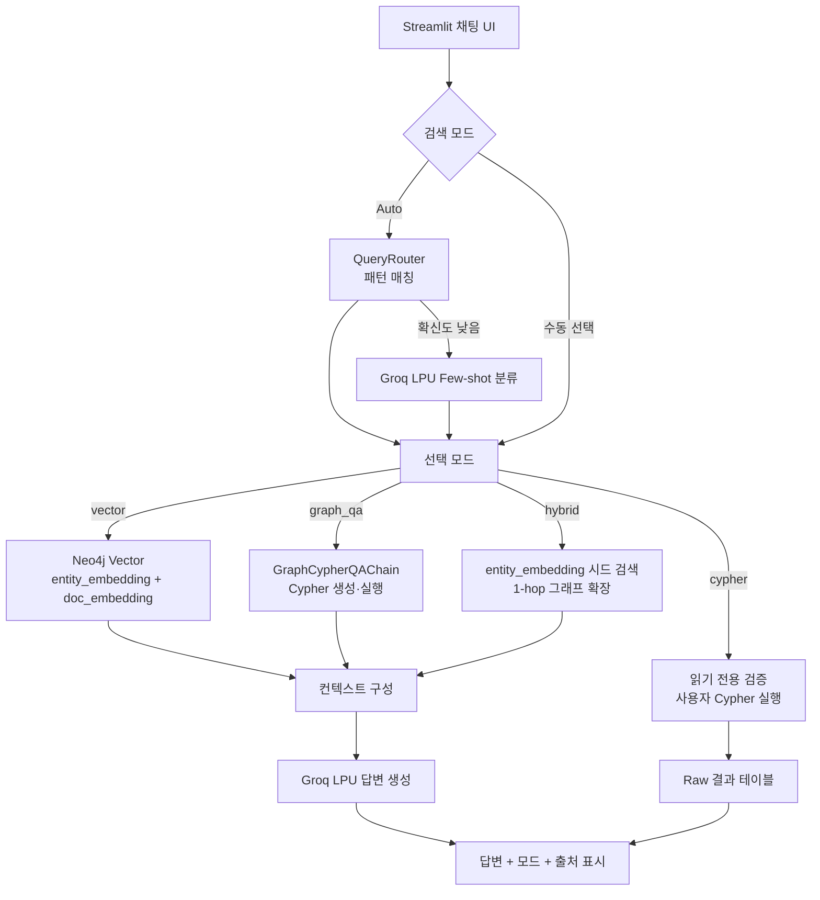

# LangChain + Neo4j GraphRAG — 검색 파이프라인

Neo4j에 저장된 Knowledge Graph와 벡터 인덱스를 조회하는 Streamlit 검색 앱임.  
`entity_embedding`·`doc_embedding` 벡터 검색, `GraphCypherQAChain` 기반 Graph QA,  
Vector + 1-hop Graph 하이브리드 검색, Cypher Direct 실행을 지원함.

---

## 1. 문서검색 처리 흐름



---

## 2. 검색 모드

| 모드 | 처리 방식 | 조회 대상 |
|---|---|---|
| `Auto` | 패턴 매칭 후 확신도 낮으면 LLM Few-shot 분류 | 질문 의도에 따라 자동 선택 |
| `vector` | `entity_embedding` + `doc_embedding` 벡터 유사도 검색 | 엔티티, 교재 청크, 예제코드 청크 |
| `graph_qa` | `GraphCypherQAChain`이 Cypher 생성·실행 후 답변 생성 | KG 노드·관계 |
| `hybrid` | 엔티티 벡터 검색 → 시드 엔티티 1-hop 관계 확장 | 엔티티 + 관계 경로 |
| `cypher` | 사용자 Cypher 직접 실행 | 읽기 전용 Cypher 결과 |

---

## 3. 설정 옵션

| 옵션 | 기본값 | 설명 |
|---|---|---|
| `NEO4J_URI` | `bolt://localhost:7687` | Neo4j Bolt URI |
| `NEO4J_USER` / `NEO4J_PASSWORD` | `neo4j` / `password` | Neo4j 계정 |
| `OLLAMA_BASE_URL` | `http://localhost:11434` | Ollama 서버 |
| `EMBEDDING_MODEL` | `qwen3-embedding` | 4096차원 임베딩 모델 |
| `GROQ_MODEL` | `openai/gpt-oss-20b` | Groq LPU 답변·라우팅·Cypher 생성 모델 |
| `GROQ_TIMEOUT` | `60` | Groq API 타임아웃(초) |
| `GROQ_MAX_RETRIES` | `1` | Groq API 재시도 횟수 |
| `GROQ_MAX_TOKENS` | `2048` | 답변 생성 최대 토큰 |
| `GROQ_REASONING_EFFORT` | `low` | gpt-oss 추론 토큰 소진 방지 |
| `ENTITY_TOP_K` | `4` | 엔티티 벡터 검색 Top K |
| `DOC_TOP_K` | `4` | 문서/코드 청크 벡터 검색 Top K |
| `HYBRID_SEED_TOP_K` | `5` | Hybrid 시드 엔티티 수 |
| `HYBRID_GRAPH_LIMIT` | `25` | Hybrid 1-hop 관계 최대 행 수 |
| `CYPHER_TOP_K` | `20` | Graph QA / Cypher Direct 기본 제한 |

`GROQ_API_KEY`는 `hands-on/.env`에서 자동 로드됨.  
검색 전용 오버라이드는 `retrieve/.env`에 작성 가능함.

---

## 4. 주요 소스

| 파일 | 역할 |
|---|---|
| `app.py` | Streamlit 채팅 UI와 모드 선택 |
| `config/settings.py` | 경로, Neo4j, Groq, Ollama, 검색 Top K 설정 |
| `graph/neo4j_connection.py` | Neo4j 연결, 스키마, 통계, 벡터 차원 검증 |
| `query/router.py` | Auto 모드 라우팅 (패턴 매칭 + LLM fallback) |
| `query/query_engine.py` | vector, graph_qa, hybrid, cypher 검색 실행 |
| `ui/components.py` | 답변, Cypher, 출처, 벡터 히트, 그래프 관계 표시 |
| `verify_retrieval.py` | 4개 모드 + Auto 라우팅 end-to-end 동작 검증 스크립트 |
| `requirements.txt` | 검색 앱 실행 의존성 |

---

## 5. 가상환경 설정 및 실행

### Neo4j 기동

```bash
cd hands-on/14.graphrag/neo4j
docker compose up -d --wait
```

### 가상환경 설정 (Windows / PowerShell)

```powershell
cd hands-on/14.graphrag/neo4j/retrieve
python -m venv venv
venv\Scripts\Activate.ps1
pip install --upgrade pip setuptools
pip install -r requirements.txt
streamlit run app.py
```

### 가상환경 설정 (Windows / GitBash)

```bash
cd hands-on/14.graphrag/neo4j/retrieve
python -m venv venv
source venv/Scripts/activate
pip install --upgrade pip setuptools
pip install -r requirements.txt
streamlit run app.py
```

### 가상환경 설정 (macOS / Linux)

```bash
cd hands-on/14.graphrag/neo4j/retrieve
python -m venv venv
source venv/bin/activate
pip install --upgrade pip setuptools
pip install -r requirements.txt
streamlit run app.py
```

### 사전 요구사항

- Neo4j 컨테이너 실행 상태
- Ollama 실행 상태 및 `ollama pull qwen3-embedding` 완료
- `hands-on/.env`에 `GROQ_API_KEY` 설정
- 인덱싱 완료 상태 (`entity_embedding`, `doc_embedding` ONLINE)

### 동작 검증 (선택)

Streamlit 실행 전, 검색 로직만 빠르게 점검하려면 검증 스크립트를 실행함.  
4개 모드 + Auto 라우팅이 실제 검색 콘텐츠와 한국어 답변을 반환하면 `ALL PASS`를 출력함.

```bash
python verify_retrieval.py
```

---

## 6. 실행 예시

### 6.1 모드별 예시 입력

| 모드 | 예시 입력 |
|---|---|
| Auto / Vector | `멀티턴 대화란 무엇인가?` |
| Graph QA (관계) | `Openai와 연결된 엔티티를 보여줘` |
| Graph QA (집계) | `Concept 노드는 몇 개인가?` |
| Hybrid | `GraphRAG의 전체 처리 흐름을 요약해줘` |
| Cypher Direct | `MATCH (n:Concept) RETURN n.id, n.text LIMIT 10` |

### 6.2 실제 실행 결과 (검증됨)

아래는 live 스택(Neo4j 노드 186 · 엔티티 127 · Chunk 39 · 관계 284, `gpt-oss-20b`,  
`qwen3-embedding` 4096차원)에 대해 실제 검색을 수행한 결과임. 4개 모드 + Auto 라우팅 전부  
실제 검색 콘텐츠와 비어있지 않은 한국어 답변을 반환함을 확인함.

**Vector** — `RAG란 무엇인가?`  
→ 엔티티 벡터 히트 8건 + 인접 청크 9건 수집 후 답변 생성

```text
RAG(Retrieval-Augmented Generation)은 LLM이 외부 문서나 데이터베이스에서 관련 정보를
검색한 뒤, 그 정보를 기반으로 답변을 생성하는 접근 방식입니다. ...
```

**Graph QA (관계)** — `Openai와 연결된 엔티티를 보여줘`  
→ Cypher 자동 생성 후 그래프 행 16건 (양 끝점 엔티티 라벨, `MENTIONS` 제외)

```text
| 소스   | 관계        | 타깃                                   |
|--------|-------------|----------------------------------------|
| Openai | USES        | Travel Planner Example                 |
| Openai | DEPENDS_ON  | Api Key                                |
| Openai | IMPLEMENTS  | Multi-Turn Dialogue Example Development |
| Openai | DEPENDS_ON  | Openai Responses Api                   |
| Openai | PROVIDES    | Chat Completions Api                   |
```

**Graph QA (집계)** — `Concept 노드는 몇 개인가?`  
→ Community Edition은 GDS 미지원이라 Cypher `count()` 집계로 처리

```text
Concept 노드는 55개입니다.
```

**Hybrid** — `GraphRAG의 전체 처리 흐름을 요약해줘`  
→ 벡터 시드 엔티티 5건 + 1-hop 그래프 관계 14건 통합 후 답변 생성

```text
**결론**
GraphRAG는 사용자의 질문을 벡터 시드 엔티티와 연결된 1-hop 그래프 관계를 탐색해,
관련 문서와 코드 예제를 찾아 답변에 반영하는 흐름임. ...
```

**Cypher Direct** — `MATCH (n:Concept) RETURN n.id AS id LIMIT 5`  
→ 읽기 전용 검증 통과 후 5행 테이블 반환 (예: `멀티턴 대화`)

**Auto 라우팅** — 패턴 매칭 + LLM Few-shot 폴백 동작 확인

```text
'멀티턴 대화란 무엇인가?'            → vector   (패턴 확신도 낮음 → LLM Few-shot 분류)
'GraphRAG의 전체 구조를 정리해줘'    → hybrid   (패턴 매칭 확신도 높음)
'MATCH (n:Technology) RETURN ...'   → cypher   (Cypher 직접 입력 패턴 감지)
```

> KG에 없는 엔티티(예: `LangChain`) 관계 질문은 "일치하는 그래프 데이터가 없습니다"  
> 안내를 반환함 (graceful no-data).

---

## 7. 에러 처리

| 상황 | 처리 |
|---|---|
| Graph QA Cypher 생성 비결정성 | gpt-oss-20b가 Cypher 대신 안내 문장 생성 시 체인 1회 재시도로 흡수 |
| Graph QA 집계 질문 실패 | 재시도 후에도 실패 시 Cypher `count()` 집계 폴백으로 결정적 복구 |
| Graph QA 최종 실패 | 복구 불가 시 오류 메시지를 답변 영역에 표시 |
| 벡터 검색 결과 없음 | 결과 없음 안내 메시지 표시 |
| Groq API 타임아웃 | `timeout=60`, `max_retries=1` 설정 후 실패 메시지 표시 |
| Cypher Direct 위험 키워드 | `CREATE`, `MERGE`, `DELETE`, `SET`, `DROP` 등 차단 |
| 벡터 차원 불일치 | Neo4j 상태에서 인덱스 차원 경고 표시 |

---

## 8. 제약사항

- Neo4j Community Edition은 GDS 미지원 → 글로벌 질문은 Cypher 집계 쿼리로 처리
- Graph QA와 Cypher Direct는 인덱싱 시 저장된 영어 라벨 사용 필요  
  예: `Concept`, `Technology`, `Framework`, `Library`, `Model`, `Tool`, `Task`
- Cypher Direct는 학습용 읽기 전용 검증만 포함함  
  운영 환경에서는 DB 권한 분리, 쿼리 AST 검증, 허용 쿼리 템플릿 적용 필요
- Neo4j 벡터 인덱스 차원은 `qwen3-embedding` 차원인 4096과 일치 필수
