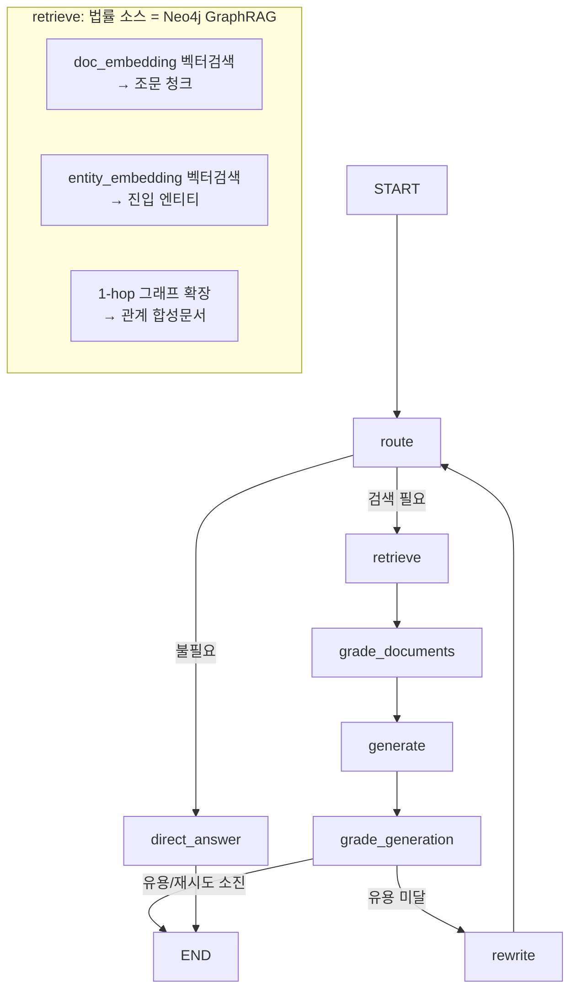

# 간단 GraphRAG — Agentic RAG 챗봇 (법률 검색을 Neo4j GraphRAG로 교체)

특허/지식재산권 질문에 대해 **법률(Neo4j GraphRAG)·웹·YouTube**를 스스로 골라 검색하고,  
답변 품질을 자체 검증(근거성·유용성)하는 Self-RAG 챗봇임.  
`12.web-youtube-search/agentic-rag`의 구조를 그대로 두고 **법률 검색 백엔드만** ChromaDB 벡터 DB에서  
LangChain + Neo4j GraphRAG로 교체함.

---

## 1. 무엇이 바뀌었나 ("Vector DB만 교체")

| 항목 | `12.web-youtube-search/agentic-rag` (원본) | 본 예제 (`simple/agentic-rag`) |
|---|---|---|
| 법률 검색 백엔드 | ChromaDB 벡터 DB (`patent_law` 컬렉션) | **Neo4j GraphRAG** (조문 벡터 + 엔티티 벡터·그래프) |
| 검색 방식 | 조문 청크 단순 유사도 검색 | **하이브리드**: 조문 벡터 + 진입 엔티티 → **1-hop 그래프 확장** |
| 검색 결과 타입 | `List[Document]` | `List[Document]` (**동일** — 다운스트림 무변경) |
| Self-RAG 루프·웹·YouTube·출처 구성 | — | **그대로 유지** |

> **핵심**: `GraphRetriever.retrieve()`가 ChromaDB 검색기와 **같은 `List[Document]`를 반환**하므로,  
> 관련성 평가(IsRel)·컨텍스트 구성·출처 섹션·Self-RAG 성찰 루프가 **수정 없이** 동작함.

### GraphRAG가 더하는 것 (Vector RAG 대비)

- **조문 원문(Vector)**: `doc_embedding` 벡터 검색으로 질문과 유사한 조문 청크 확보 → 법률 근거
- **엔티티 관계(Graph)**: `entity_embedding`으로 진입 엔티티를 찾고, **1-hop 그래프 확장**으로  
  요건·절차·권리 간 관계를 합성 문서로 추가 → "요건과 절차의 관계는?" 같은 **멀티홉 질문**에 강함

---

## 2. 처리 흐름 (LangGraph StateGraph)



| 노드 | 역할 | Reflection 토큰 |
|---|---|---|
| `route` | 검색 필요 여부 + 소스(graphrag/web/youtube) + 소스별 쿼리 결정 | Route |
| `retrieve` | 선택 소스 검색 (법률=GraphRAG 하이브리드) | — |
| `grade_documents` | GraphRAG 문서(조문+관계) 관련성 일괄 평가 | IsRel |
| `generate` | 컨텍스트 기반 답변 생성 + 근거성 검증·엄격 재생성 + 출처 부착 | IsSup |
| `grade_generation` | 답변 유용성 평가 (재검색 분기 기준) | IsUse |
| `rewrite` | 유용성 미달 시 질문 재작성 후 재검색 (최대 3회) | — |
| `direct_answer` | 특허 외 질문·인사는 LLM 지식으로 직접 답변 | — |

---

## 3. 기술 스택

| 항목 | 값 |
|---|---|
| 워크플로우 | LangGraph StateGraph (Self-RAG 성찰 루프 + 멀티소스 라우팅) |
| LLM | `openai/gpt-oss-120b` (Groq LPU, `ChatGroq`) |
| 법률 검색 | Neo4j GraphRAG (`db.index.vector.queryNodes` + 1-hop Cypher) |
| 임베딩 (질의) | `text-embedding-3-small` (1536차원, OpenAI) — 인덱싱과 동일 |
| 웹 검색 | DuckDuckGo (`time="y"` 최근 1년) |
| 영상 검색 | YouTube Data API v3 (`publishedAfter` 최근 1년) |
| 포트 | Neo4j Bolt `7688` |

> `GROQ_API_KEY`·`OPENAI_API_KEY`·`YOUTUBE_API_KEY` 는 `hands-on/.env` 에서 자동 로드됨.

---

## 4. 주요 설정 상수 (`app.py`)

| 상수 | 기본값 | 설명 |
|---|---|---|
| `NEO4J_URI` | `bolt://localhost:7688` | Neo4j 접속 (인덱싱과 동일) |
| `EMBEDDING_MODEL` / `EMBEDDING_DIM` | `text-embedding-3-small` / `1536` | 질의 임베딩 (인덱싱과 일치 필수) |
| `ENTITY_INDEX_NAME` / `DOC_INDEX_NAME` | `entity_embedding` / `doc_embedding` | 검색 대상 벡터 인덱스 |
| `ENTITY_TOP_K` / `DOC_TOP_K` | `8` / `5` | 진입 엔티티 / 조문 청크 검색 수 (멀티홉 커버리지 위해 5→8) |
| `GRAPH_EXPAND_LIMIT` | `40` | 진입 엔티티 1-hop 관계 확장 최대 건수 (멀티홉 위해 20→40) |
| `MAX_RETRIES` | `3` | 유용성 미달 시 Query Rewriting 재시도 한도 |

---

## 5. 가상환경 설정 및 실행

### 5-1. 사전 요구사항 (먼저 수행)

```bash
# 1) Neo4j 기동
cd hands-on/14.graphrag/simple
docker compose up -d --wait

# 2) 특허법 KG·벡터 인덱스 구축 (indexing 예제)
cd indexing && python index_documents.py    # 가상환경 설정 후 실행
```

> 챗봇 기동 시 `entity_embedding`·`doc_embedding` 인덱스가 없으면 인덱싱 선행을 안내하며 종료함.

### 5-2. 가상환경 설정 (Windows / PowerShell)

```powershell
cd hands-on/14.graphrag/simple/agentic-rag
python -m venv venv
venv\Scripts\Activate.ps1
pip install -r requirements.txt
```

### 가상환경 설정 (Windows / GitBash)

```bash
cd hands-on/14.graphrag/simple/agentic-rag
python -m venv venv
source venv/Scripts/activate
pip install -r requirements.txt
```

### 가상환경 설정 (macOS / Linux)

```bash
cd hands-on/14.graphrag/simple/agentic-rag
python -m venv venv
source venv/bin/activate
pip install -r requirements.txt
```

### 5-3. 실행

```bash
python app.py            # 대화형 챗봇 (멀티턴, 'clear' 초기화, 'quit' 종료)
python app.py --demo     # 교재 검증 질의를 비대화형으로 순차 실행
```

---

## 6. 실행 예시 (`--demo`, 실측)

전체 인덱싱(특허법.pdf 235청크 → 엔티티 842개·관계 2,300건) 후 `python app.py --demo` 결과:

```
Neo4j GraphRAG 로드 완료: bolt://localhost:7688 (엔티티 842개, 조문 청크 235개)

# 데모 질의 1/3: 특허 요건에 대해 법률, 웹, 영상을 검색해서 알려줘
[Route] → 검색 필요: True / 소스: ['graphrag', 'web', 'youtube']
[Retrieve:GraphRAG] → 6개 문서 검색됨 (조문 청크 + 지식그래프)
[Retrieve:웹] → 4개 결과 / [Retrieve:YouTube] → 5개 영상
[IsRel] → 관련 문서 1/6개 선별  (조문청크는 거르고 KG 관계문서를 선별)
[IsSup] → 근거 있음: True
   ("KG의 '특허 <-[APPLIES_TO] 제29조(특허요건)' 관계와 웹 검색 결과에서 모두 확인")
[IsUse] → 유용함: True
답변: ### 특허를 받기 위한 "특허 요건" (산업상 이용가능성·신규성·진보성·충분한 기재 + 주체적 요건)
      ... > 법적 근거 – 특허법 제29조(특허요건) ... (KG 관계: `특허` ←[APPLIES_TO] `제29조(특허요건)`)
## 출처
**법률**
- 특허법 지식그래프(KG) 제44조, 제32조, 제29조, 제18조, 제133조 ...
**웹**
- [KDDF](...) / [특허의 요건(기본) | 레포트월드](...) / [특허등록의 요건 | easylaw](...)
**YouTube**
- [[특허법 조문강의]제29조(특허요건)](https://www.youtube.com/watch?v=kWCxt6x2lm8) ...

# 데모 질의 2/3: 특허 출원 비용은 ?
[Route] → 소스: ['graphrag', 'web']   (비용은 웹 중심으로 라우팅)
[IsRel] → 관련 문서 0/6개 (비용은 조문에 없어 GraphRAG 결과 전부 제외 — 정상)

# 데모 질의 3/3: Claude Code란?
[Route] → 검색 필요: False  (특허 외 주제 → 검색 없이 직접 답변)
[Direct] → LLM 지식으로 직접 답변
```

> **핵심 검증 포인트**: Q1에서 IsRel이 조문 청크는 거르고 **KG 관계 문서(제29조 특허요건 APPLIES_TO)**를  
> 선별했고, 답변·IsSup 근거에 그 그래프 관계가 그대로 인용됨 — GraphRAG가 단순 벡터 검색을 넘어  
> **엔티티 관계를 답변 근거로 활용**함을 보여줌. (실측: 2026-06-03)

---

## 7. GraphRAG 멀티홉 추론 테스트 질문

여러 청크에 흩어진 엔티티를 관계(edge)로 이어야 답이 나오는 질문임. 순수 Vector RAG는 "질문과 비슷한 청크"만  
가져와 다리(bridge) 엔티티를 놓치지만, GraphRAG는 진입 엔티티의 1-hop 관계를 컨텍스트에 주입해 LLM이 연결  
추론을 하게 함. 멀티홉 커버리지를 위해 `ENTITY_TOP_K=8`·`GRAPH_EXPAND_LIMIT=40`으로 설정함(아래 실측 기준).

### 멀티홉이면서 IsSup `근거 있음`이 나오는 질문 (실측 2026-06-03)

답이 **그래프 관계로 완전히 커버되는**(연결·관계를 묻는) 질문은 IsSup 근거성까지 통과함:

| 질문 | 자극하는 KG 경로 (멀티홉) | IsSup |
|---|---|---|
| **전용실시권과 통상실시권은 특허발명에 대해 각각 어떤 관계이고, 특허발명에는 어떤 심판들이 적용되나요?** | 전용/통상실시권 ─[APPLIES_TO]→ **특허발명** ←[APPLIES_TO]─ 권리범위확인심판(제135조)·통상실시권허락심판(제138조)·포기양도심판(제119·120조) | ✅ 근거 있음 |
| **특허출원은 발명, 우선권 주장과 각각 어떤 관계로 연결되나요?** | **특허출원**(허브) ─[REFERS_TO]→ 발명 / ─[REQUIRES]→ 우선권 / ─[DEFINES]→ 제35조 | ✅ 근거 있음 |
| **미성년자와 피성년후견인이 특허 절차를 밟으려면 공통으로 무엇이 필요한가요?** | 미성년자 ─[REQUIRES]→ **법정대리인** ←[REQUIRES]─ 피성년후견인 (수렴 2-hop) | ✅ 근거 있음 |

> 세 질문 모두 **다리 엔티티(특허발명·특허출원·법정대리인)가 질문 표면에 안 드러나** Vector RAG가 놓치기 쉬운  
> 멀티홉이면서, 답이 그래프 관계 안에 있어 IsSup 근거성까지 충족함. 첫 질문(전용/통상실시권)이 가장 깨끗한 예임.

### IsSup `근거없음`이 나오는 질문 (KG 밖 정보를 요구)

질문이 **그래프에 없는 세부 정보**(예: 요건의 *내용*)를 요구하면 답변이 컨텍스트를 넘어서므로, IsSup가  
정상적으로 `근거없음`을 냄(환각 방지 작동 — 실패가 아님):

| 질문 | IsSup | 이유 |
|---|---|---|
| 미성년자·피성년후견인의 대리와 관련해 어떤 **제한·자격**이 적용되나요? | ❌ 근거없음 | KG엔 `─[REQUIRES]→ 법정대리인` 관계만 있고 *자격·제한의 구체 내용*은 없음 → 답변의 그 부분이 근거 부족 |

**효과 확인 방법** — 챗봇 실행 후 아래 신호를 관찰:
- `[Retrieve:GraphRAG] → N개 문서 (조문 청크 + 지식그래프)`에 **지식그래프** 문서가 포함되는지
- `[IsRel]`이 **KG 관계 문서**를 관련 문서로 선별하는지 (예: 관련 문서 1/6개)
- 답변 끝 `## 출처` → **법률** 블록에 `특허법 지식그래프(KG)` 관계 근거가 잡히는지
- 답변 본문이 엔티티 간 관계(예: `전용실시권 →[APPLIES_TO] 특허발명`)를 근거로 연결 추론하는지

> IsSup는 `근거 부족 → 엄격 재생성 → **재평가**`로 *최종 반환 답변* 기준 근거성을 보고함(재평가 누락 시 첫 답변  
> 기준 stale 값이 보고되던 버그를 수정함). 더 깊은 멀티홉은 `GRAPH_EXPAND_LIMIT`를 더 늘리거나 `_expand_graph`를 2-hop로 확장.

**대조 실험**: 단일 사실 질문(예: 특허 출원 수수료는 얼마인가요?)과 위 멀티홉 질문을 나란히 던지면, 전자는  
지식그래프 블록이 비고 후자는 관계가 잡히는 차이로 GraphRAG 효과가 또렷이 드러남.

---

## 8. 에러 처리

| 상황 | 처리 |
|---|---|
| Neo4j 미기동 | `load_graph()`에서 `docker compose up` 안내 후 종료 |
| 벡터 인덱스 누락 | 인덱싱 선행(`index_documents.py`) 안내 후 종료 |
| GraphRAG 검색 실패 | 무시하고 웹·YouTube 결과로 답변 (graceful degradation) |
| 웹·YouTube 검색 실패 | 해당 소스만 건너뛰고 나머지로 답변 |
| 임베딩 차원 불일치 | `ValueError`로 즉시 안내 (인덱싱·질의 임베딩 모델 점검) |

---

## 9. 제약사항

- 인덱싱과 질의 임베딩 모델·차원이 **반드시 일치**해야 검색됨 (`text-embedding-3-small`, 1536)
- Neo4j Community Edition은 GDS 미지원 → 커뮤니티 탐지(Leiden) 불가 (1-hop 그래프 확장으로 대체)
- 1-hop 그래프 확장은 `__Entity__`–`__Entity__` 관계만 사용하고 `MENTIONS`(출처 연결)는 제외함
