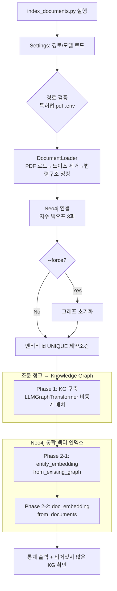

# 간단 GraphRAG — 인덱싱 파이프라인 (특허법.pdf → Neo4j)

특허법 PDF 1개를 Neo4j에 인덱싱하여 GraphRAG 검색의 토대를 만드는 파이프라인임.  
LangChain의 `LLMGraphTransformer`로 특허법 조문에서 Knowledge Graph를 구축하고, Neo4j 벡터 인덱스 2개  
(`entity_embedding`·`doc_embedding`)를 함께 생성함. Neo4j가 KG와 벡터 인덱스를 한 DB에 통합 저장하므로  
별도 벡터 저장소가 필요 없음.

> **이 예제의 위치**: `12.web-youtube-search/agentic-rag` 챗봇의 법률 검색 백엔드를 ChromaDB에서  
> LangChain+Neo4j GraphRAG로 교체하기 위한 **인덱싱 단계**임. 검색 단계는 `../agentic-rag/` 참조.

---

## 1. 인덱싱 전략 (단일 데이터소스)

| 데이터소스 | 경로 | 인덱싱 방식 | 근거 |
|---|---|---|---|
| 특허법 PDF | `hands-on/10.rag/data/특허법.pdf` | **KG + Vector** | 조문·요건·절차·권리 간 관계가 풍부 → 멀티홉 추론용 KG가 효과적 |

- 같은 조문 청크가 KG 구축과 `doc_embedding` 양쪽에 **동일하게** 들어감 (단일 소스)
- 생성되는 벡터 인덱스 2개
  - `entity_embedding`: 특허법 엔티티의 `id`(+`description`) 임베딩 — `Neo4jVector.from_existing_graph`
  - `doc_embedding`: 조문 청크 텍스트 임베딩 — `Neo4jVector.from_documents` (`Chunk` 노드)

> **`14.graphrag/neo4j` 예제 대비 변경점**  
> | 항목 | `neo4j` 예제 | 본 `simple` 예제 |
> |---|---|---|
> | 데이터소스 | 교재(*.md) + 예제코드(*.py) | **특허법.pdf 1개** |
> | 임베딩 | Ollama `qwen3-embedding` (4096차원) | **OpenAI `text-embedding-3-small` (1536차원)** |
> | 포트 | Bolt 7687 / HTTP 7474 | **Bolt 7688 / HTTP 7475** (동시 실행 가능) |
>
> 임베딩을 OpenAI로 통일한 이유: `agentic-rag` 챗봇이 동일 임베딩을 쓰므로 **인덱싱·질의 임베딩을 일치**시키고,  
> Ollama 의존성을 제거해 "간단" 예제 취지에 맞춤 (인덱싱·질의 임베딩 모델·차원은 반드시 일치해야 검색됨).

---

## 2. 인덱싱 처리 흐름



**처리 단계 요약**

| 단계 | 작업 | 모듈 |
|---|---|---|
| 1 | 경로/설정 로드 후 도출 경로를 먼저 로깅 (경로 오류 조기 발견) | `config/settings.py` |
| 2 | PDF 로드 → 머리글/바닥글 제거 → 법령 구조(조·항) 우선 청킹 | `document_loader.py` |
| 3 | Neo4j 연결 (지수 백오프 1·2·4초) + `--force` 시 초기화 | `graph/neo4j_connection.py` |
| 4 | 조문 청크에서 엔티티/관계 추출 → KG 저장 (비동기 배치) | `kg_builder.py` |
| 5 | `entity_embedding`·`doc_embedding` 벡터 인덱스 생성 | `vector_index.py` |
| 6 | KG 통계 출력 + "추출 엔티티 0개" 경고 (성공 판정) | `index_documents.py` |

---

## 3. 기술 스택

| 항목 | 값 |
|---|---|
| GraphRAG 프레임워크 | LangChain + Neo4j |
| Graph DB | Neo4j Community Edition 5.26 (Docker, GDS 미지원 → 커뮤니티 탐지 불가) |
| LLM (엔티티 추출) | `openai/gpt-oss-120b` (Groq LPU, OpenAI 호환 API) |
| 임베딩 | `text-embedding-3-small` (1536차원, OpenAI) |
| 플러그인 | APOC Core (`NEO4J_PLUGINS=["apoc"]` 자동 설치) |
| 포트 | Bolt `7688`, HTTP `7475` |

> **GROQ_API_KEY**·**OPENAI_API_KEY** 는 `hands-on/.env` 에서 자동 로드됨 (`indexing/.env` 로 오버라이드 가능).

---

## 4. 설정 옵션 (`config/settings.py`)

| 옵션 | 기본값 | 설명 |
|---|---|---|
| `neo4j_uri` | `bolt://localhost:7688` | Neo4j 접속 URI (neo4j 예제와 포트 분리) |
| `neo4j_user` / `neo4j_password` | `neo4j` / `password` | 계정 (docker-compose 기본값과 일치) |
| `embedding_model` | `text-embedding-3-small` | OpenAI 임베딩 모델 |
| `embedding_dim` | `1536` | 임베딩 차원 (벡터 인덱스와 일치 필수) |
| `groq_model` | `openai/gpt-oss-120b` | 엔티티 추출 LLM |
| `chunk_size` / `chunk_overlap` | `800` / `120` | 청크 크기·중복 (작은 청크가 추출 정확도 ↑) |
| `batch_size` | `10` | KG 구축 배치 크기 |
| `allowed_nodes` | `Concept, Requirement, Procedure, Right, Organization, Person, Document` | 허용 엔티티 타입 (**영어 필수**) |
| `allowed_relationships` | `REQUIRES, DEFINES, APPLIES_TO, GRANTS, REFERS_TO, PART_OF, PRECEDES` | 허용 관계 타입 (**영어 필수**) |
| `strict_mode` | `False` | 허용 목록 외 엔티티/관계도 저장 (재현율 우선) |
| `ignore_tool_usage` | `False` | 함수호출 경로 추출 (아래 ⚠️ 참고) |

### ⚠️ LLM 모델별 추출 모드 (중요)

엔티티/관계 추출 경로는 **LLM 모델에 따라 달라야 함**. `LLMGraphTransformer`의 함수호출 경로는
`node_properties`(엔티티 `description` 추출)를 지원하지만, 모델이 함수호출 구조화 출력을 못 내면 실패함.

| 모델 | 권장 설정 | 비고 |
|---|---|---|
| **`openai/gpt-oss-120b`** (기본) | `ignore_tool_usage=False` (함수호출) | 구조화 출력이 안정적 → `description`까지 추출 |
| `openai/gpt-oss-20b` | `ignore_tool_usage=True` (프롬프트) | 함수호출 시 `400 json_validate_failed` → 프롬프트 추출 필요(description 미지원) |

- `kg_builder`는 두 모드를 모두 처리 (`ignore_tool_usage` 값으로 `node_properties` 포함/생략 자동 분기)

---

## 5. 주요 소스

| 파일 | 역할 |
|---|---|
| `index_documents.py` | 엔트리포인트. 경로 검증 → 로드 → KG 구축 → 벡터 인덱스 → 통계 |
| `config/settings.py` | 경로·Neo4j·Groq·OpenAI·KG 설정 (`hands-on/.env` 로드) |
| `graph/neo4j_connection.py` | 연결(지수 백오프)·제약조건·초기화·통계 |
| `document_loader.py` | PDF 로드·노이즈 제거·법령 구조 청킹 (10.rag 전처리 재사용) |
| `kg_builder.py` | `LLMGraphTransformer` 비동기 배치 KG 구축 |
| `vector_index.py` | `entity_embedding`·`doc_embedding` 생성 (OpenAI 임베딩) |
| `../docker-compose.yml` | Neo4j 5.26-community (bind mount + healthcheck + APOC) |

---

## 6. 가상환경 설정 및 실행

> PyTorch를 쓰지 않으므로 `--system-site-packages` 옵션은 불필요함.

### 6-1. Neo4j 기동 (먼저 1회)

```bash
cd hands-on/14.graphrag/simple
docker compose up -d --wait   # healthy 상태까지 대기 (콜드스타트·APOC 다운로드 흡수)
```

- Neo4j Browser: http://localhost:7475 (neo4j / password)
- 데이터는 `store/neo4j/{data,logs,plugins}` 에 영속 저장됨 (컨테이너 삭제해도 보존)
- `14.graphrag/neo4j` 예제(7474/7687)와 **동시 실행 가능** (컨테이너명·포트 분리)

### 6-2. 가상환경 설정 (Windows / PowerShell)

```powershell
cd hands-on/14.graphrag/simple/indexing
python -m venv venv
venv\Scripts\Activate.ps1
pip install -r requirements.txt
```

### 가상환경 설정 (Windows / GitBash)

```bash
cd hands-on/14.graphrag/simple/indexing
python -m venv venv
source venv/Scripts/activate
pip install -r requirements.txt
```

### 가상환경 설정 (macOS / Linux)

```bash
cd hands-on/14.graphrag/simple/indexing
python -m venv venv
source venv/bin/activate
pip install -r requirements.txt
```

### 6-3. 사전 요구사항

- Docker (Neo4j 실행)
- `hands-on/.env` 에 `GROQ_API_KEY`(엔티티 추출)·`OPENAI_API_KEY`(임베딩) 설정

### 6-4. 인덱싱 실행

```bash
python index_documents.py              # 전체 인덱싱 (특허법.pdf 전체 조문)
python index_documents.py --force      # 그래프 초기화 후 재인덱싱
python index_documents.py --mode test  # 테스트용 소량 인덱싱 (앞 20개 청크)
```

---

## 7. 실행 예시 (테스트 모드 실측, `openai/gpt-oss-120b`)

`python index_documents.py --mode test --force` 결과 (특허법.pdf 앞 20개 청크, 실측):

```
청킹 완료: 235개 청크 (chunk_size=800, overlap=120)
테스트 모드: 앞 20개 청크만 사용 (전체 235개 중)
[Phase 1] KG 구축 시작 (조문 20청크)
추출 샘플 — 노드 타입: ['Concept', 'Document', 'Organization', 'Person', 'Procedure', 'Requirement']
추출 샘플 — 관계 타입: ['APPLIES_TO', 'DEFINES', 'GRANTS', 'PART_OF', 'REFERS_TO', 'REQUIRES']
KG 구축 완료: 성공 20, 실패 0 (총 20), 추출 엔티티 143개
[Phase 2] entity_embedding / doc_embedding 벡터 인덱스 생성 완료
[통계] 노드 144개 / 관계 228개
  라벨 __Entity__=104 / Concept=78 / Document=26 / Chunk=20 / Person=16 / Organization=7 / Procedure=2
  관계 MENTIONS=143 / REQUIRES=22 / DEFINES=21 / APPLIES_TO=21 / REFERS_TO=12 / PART_OF=7 / GRANTS=2
인덱싱 완료!
```

> 특허법 도메인 온톨로지(Requirement/Procedure/Right…)가 정상 작동해 REQUIRES·DEFINES·APPLIES_TO·GRANTS  
> 등 의미 있는 조문 관계가 추출됨. `gpt-oss-120b`는 추론 토큰이 많아 함수호출 출력이 잘릴 수 있어  
> `reasoning_effort="low"` + `max_completion_tokens=8000` 설정으로 추출 성공률을 확보함(미설정 시 0개 추출).

### 전체 모드 실측 (`python index_documents.py --force`)

```
청킹 완료: 235개 청크 (특허법.pdf 68페이지)
KG 구축 완료: 성공 215, 실패 20 (총 235), 추출 엔티티 1439개
[통계] 노드 1292개 / 관계 2300개
  라벨 __Entity__=842 / Concept=660 / Document=339 / Chunk=235 / Person=44
       / Requirement=31 / Procedure=23 / Organization=22 / Right=3
  관계 MENTIONS=1439 / REFERS_TO=252 / DEFINES=177 / APPLIES_TO=173
       / REQUIRES=158 / PART_OF=81 / GRANTS=19 / PRECEDES=1
인덱싱 완료!
```

> **배치 일부 실패(20/235)는 비치명적**: gpt-oss가 간헐적으로 스키마 외 속성 키(예: `date`)나  
> 허용 목록 외 관계 타입(예: `EXCLUDES`)을 생성하면 Groq가 `json_validate_failed`(400)로 거부함.  
> 해당 배치만 스킵하고 나머지는 정상 저장되어 842개 엔티티·2,300건 관계가 구축됨 (학습 예제로 충분).

**재실행 안전성**: `doc_embedding`은 매 실행 시 기존 `Chunk` 노드를 먼저 삭제 후 재생성하므로  
`--force` 없이 재실행해도 Chunk가 중복 누적되지 않음 (KG 엔티티는 `id` UNIQUE 제약 + MERGE로 중복 방지).

---

## 8. 에러 처리

| 상황 | 처리 |
|---|---|
| `LLMGraphTransformer` 변환 실패 | 해당 배치 스킵, 다음 배치 계속 (WARNING 로그) |
| Neo4j 연결 실패 | 최대 3회 재시도, 지수 백오프(1·2·4초) 후 종료 |
| Groq API 타임아웃 | 타임아웃 60초 + 재시도 1회 |
| 추출 엔티티 0개 | 통계 후 ERROR 로그로 명시 (추출 경로·`GROQ_API_KEY` 점검 안내) |
| PDF 텍스트 추출 실패 | `ValueError` (스캔 이미지 PDF 가능성 안내) |

---

## 9. 제약사항

- Neo4j Community Edition은 GDS 미지원 → 커뮤니티 탐지(Leiden) 사용 불가
- Neo4j 5.11+ 필수 (벡터 인덱스 지원), 5.26-community 권장
- 벡터 인덱스 차원은 임베딩 모델과 일치 필수 (1536) — `agentic-rag` 챗봇과 동일 모델 사용
- `allowed_nodes`/`allowed_relationships`는 **영어**로 작성 (한국어 시 Silent Failure)
