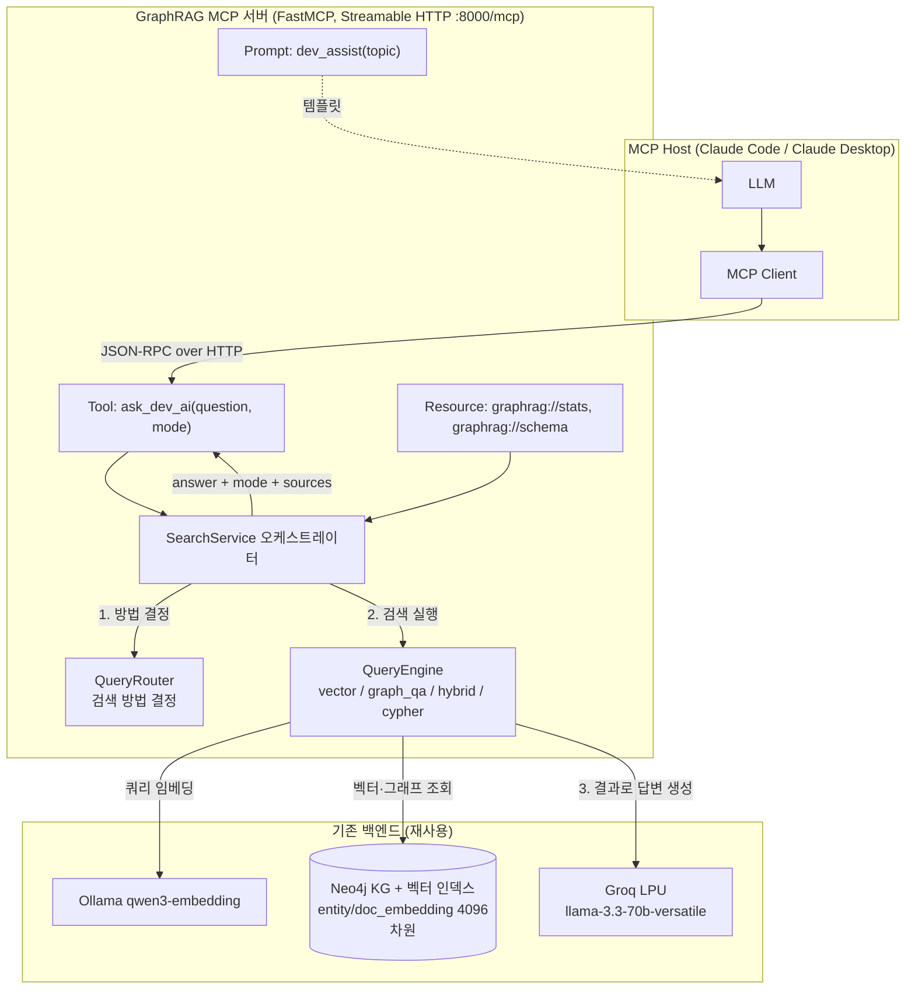

# AI 에이전트 개발 지원 서비스 — GraphRAG MCP 서버

사내 AI 부트캠프 교재를 인덱싱한 Neo4j Knowledge Graph를 **MCP 서버**로 노출하는 예제임.  
Claude Code 같은 바이브 코딩 도구에 연결하면 LLM이 일반 지식 대신 **조직 내부 지식(교재·예제·관계)**을  
참조해 더 정확한 답변·코드를 생성할 수 있음.

검색 파이프라인은 검증된 `hands-on/14.graphrag/neo4j/retrieve` 예제를 재사용하고,  
이를 FastMCP + Streamable HTTP 전송으로 감싸 MCP 서버로 제공함. KG/벡터 DB는 신규 생성 없이  
기존 스토어(`hands-on/14.graphrag/neo4j/store`)를 그대로 조회함.

---

## 1. 아키텍처



### 처리 흐름 (비즈니스 시나리오)

| 단계 | 동작 | 담당 |
|---|---|---|
| 1) 요청 접수 | `ask_dev_ai(question, mode)` 호출 수신 | `server.py` → `SearchService.answer` |
| 2) 검색 방법 결정 | `auto`면 패턴 매칭 + LLM Few-shot 라우팅, 그 외 호출자 지정 | `query/router.py` |
| 3) 검색 실행 | 결정된 모드로 벡터/그래프/하이브리드/Cypher 검색 | `query/query_engine.py` |
| 4) 답변 생성 | 검색 결과를 Groq LPU LLM에 보내 한국어 답변 생성 | `query/query_engine.py` |

### 검색 모드

| 모드 | 처리 방식 | 조회 대상 |
|---|---|---|
| `auto` | 패턴 매칭 후 확신도 낮으면 LLM Few-shot 분류로 모드 자동 선택 | 질문 의도에 따라 자동 |
| `vector` | `entity_embedding` + `doc_embedding` 벡터 유사도 검색 | 엔티티, 교재 청크, 예제코드 청크 |
| `graph_qa` | `GraphCypherQAChain`이 Cypher 생성·실행 후 답변 생성 | KG 노드·관계, 집계(count) |
| `hybrid` | 엔티티 벡터 시드 검색 → 1-hop 그래프 관계 확장 | 엔티티 + 관계 경로 |
| `cypher` | 읽기 전용 검증 후 사용자 Cypher 직접 실행 | Cypher 결과 행 |

---

## 2. 디렉토리 구조

```
hands-on/15.mcp/graphrag/
├── server.py                 # FastMCP 서버 (Streamable HTTP). Tool/Resource/Prompt 등록
├── search_service.py         # 검색 오케스트레이터 (접수→결정→검색→답변)
├── config/
│   ├── settings.py           # Neo4j/Groq/Ollama/검색 TopK/MCP 바인딩 설정 + GROQ 키 검증
│   └── llm.py                # Groq ChatOpenAI 생성 공용 팩토리 (reasoning_effort 조건부)
├── graph/
│   └── neo4j_connection.py   # Neo4j 연결, 스키마/통계/벡터 차원 검증
├── query/
│   ├── router.py             # 검색 방법 결정 (패턴 매칭 + LLM 폴백)
│   └── query_engine.py       # 4개 모드 검색 실행 + LLM 답변 생성
├── test_e2e.py               # 인-프로세스 검증 (SearchService 직접 호출)
├── test_mcp_client.py        # MCP 전송 계층 검증 (서버 기동→실제 클라이언트 연결)
├── requirements.txt
├── .env.example
└── README.md
```

---

## 3. 소스 코드 설명

### `server.py` — MCP 서버 진입점
- `mcp = FastMCP("graphrag-dev-ai", host, port)` : Streamable HTTP 서버 인스턴스 생성  
- `get_service()` : `SearchService` 싱글턴을 **지연 생성** (서버 기동은 빠르게, Neo4j 연결은 첫 호출 시)  
- `ask_dev_ai(question, mode)` : **핵심 Tool**. 검색 후 `answer`·`resolved_mode`·`route_reason`·`sources` 반환  
- `_shape_tool_result()` : 임베딩·대용량 텍스트는 개수 요약만 남겨 MCP 응답을 간결하게 정리  
- `kg_stats_resource()` / `kg_schema_resource()` : KG 통계·스키마 읽기 전용 **Resource**  
- `dev_assist(topic)` : 사내 교재 기반 구현 가이드 작성 **Prompt** 템플릿  
- `mcp.run(transport="streamable-http")` : `/mcp` 엔드포인트로 서버 기동  

### `search_service.py` — 오케스트레이터
- `SearchService.answer(question, mode)` : 비즈니스 시나리오 4단계를 조립한 단일 진입점  
  - `ensure_groq_api_key()`로 키를 먼저 검증해 답변 단계 401을 초기화 시점으로 앞당김  
  - `auto`면 `QueryRouter.route()`로 모드 결정, 그 외는 호출자 지정 모드 사용  
  - `QueryEngine.search()`로 검색·답변 수행 후 라우팅 메타(`requested/resolved/reason`)를 덧붙임  
- `health()` : Neo4j 연결·벡터 차원·KG 규모를 점검해 요약 반환  

### `query/router.py` — 검색 방법 결정
- `route()` : `auto`일 때만 자동 결정. Cypher 직접 입력 패턴 우선 감지 → 키워드 점수 → LLM 폴백  
- `_score_patterns()` : 모드별 키워드/정규식 매칭 점수 계산 (최고 점수 ≥2 & 단독 1위면 LLM 생략)  
- `_llm_fallback()` : 애매하면 Groq LLM Few-shot 분류 (실패 시 `vector` 폴백)  

### `query/query_engine.py` — 검색 실행 + 답변 생성
- `vector_search()` : 쿼리 임베딩 → 엔티티/문서 벡터 검색 → 인접 청크 확장 → LLM 답변  
- `graph_qa()` : `GraphCypherQAChain` Cypher 자동 생성·실행. 비결정성 1회 재시도 + 집계 폴백  
- `hybrid_search()` : 벡터 시드 엔티티 → 1-hop 그래프 관계 확장 → 통합 컨텍스트 → LLM 답변  
- `cypher_direct()` : 쓰기/위험 키워드 차단 후 읽기 전용 Cypher 직접 실행  
- `_generate_answer()` : 검색 컨텍스트만으로 한국어 답변을 생성하도록 강제 (LCEL 체인)  

### `config/llm.py` — LLM 팩토리
- `build_chat_llm()` : Groq OpenAI 호환 API ChatOpenAI 생성. `reasoning_effort`는 모델명에  
  `gpt-oss`가 포함될 때만 전달 (llama-3.3-70b는 일반 모델이라 미전달)  

---

## 4. 사전 요구사항

- **Neo4j 컨테이너** 실행 상태 (KG + `entity_embedding`/`doc_embedding` 인덱스 ONLINE, 4096차원)  
- **Ollama** 실행 + `qwen3-embedding` 모델 보유 (`ollama pull qwen3-embedding`)  
  - 저장된 벡터가 qwen3-embedding 4096차원이므로 쿼리도 동일 모델로 임베딩해야 함  
- `hands-on/.env`에 `GROQ_API_KEY` 설정 (자동 로드됨)  

---

## 5. 가상환경 설정

PyTorch를 사용하지 않으므로 일반 venv로 설정함.

### Windows / PowerShell

```powershell
cd hands-on/15.mcp/graphrag
python -m venv venv
venv\Scripts\Activate.ps1
pip install --upgrade pip setuptools
pip install -r requirements.txt
```

### Windows / GitBash

```bash
cd hands-on/15.mcp/graphrag
python -m venv venv
source venv/Scripts/activate
pip install --upgrade pip setuptools
pip install -r requirements.txt
```

### macOS / Linux

```bash
cd hands-on/15.mcp/graphrag
python -m venv venv
source venv/bin/activate
pip install --upgrade pip setuptools
pip install -r requirements.txt
```

---

## 6. 실행 방법

### 6.1 Neo4j Graph DB 컨테이너 실행

```bash
cd hands-on/14.graphrag/neo4j
docker compose up -d --wait        # healthy 상태까지 대기 (콜드스타트 ~40초)
```

> KG/벡터 DB는 이 컨테이너의 `store/` 볼륨에 영속 저장되어 있음. 신규 인덱싱 불필요함.

### 6.2 동작 검증 (선택)

MCP 서버 기동 전, 검색 로직과 전송 계층을 빠르게 점검함.

```bash
# (1) 인-프로세스 검증 — 검색 파이프라인만 점검
python test_e2e.py

# (2) MCP 전송 계층 검증 — 서버 자동 기동 → 실제 클라이언트 연결 → 도구/리소스/프롬프트 호출
python test_mcp_client.py
```

각각 `ALL PASS`를 출력하면 검색·MCP 계층이 정상 동작함.

### 6.3 MCP 서버 실행

```bash
cd hands-on/15.mcp/graphrag
python server.py
# → http://127.0.0.1:8000/mcp 에서 Streamable HTTP 대기
```

### 6.4 Claude Code 연동

```bash
# 서버를 먼저 실행한 상태에서 등록 (Streamable HTTP 원격 URL 방식)
claude mcp add graphrag-dev-ai http://localhost:8000/mcp

# 등록 확인
claude mcp list
```

> 등록 후 Claude Code를 재시작하면 `/mcp` 명령어로 연결 상태를 확인할 수 있음.  
> 이후 채팅에서 "RAG 파이프라인 구현 방법 알려줘"처럼 질문하면 LLM이 `ask_dev_ai` 도구로  
> 사내 교재를 검색해 답변함.

---

## 7. 사용 예시

| 모드 | 예시 질문 |
|---|---|
| auto / vector | `RAG란 무엇인가?` |
| graph_qa (관계) | `Openai와 연결된 엔티티를 보여줘` |
| graph_qa (집계) | `Concept 노드는 몇 개인가?` |
| hybrid | `GraphRAG의 전체 처리 흐름을 요약해줘` |
| cypher | `MATCH (n:Concept) RETURN n.id AS id LIMIT 5` |

`ask_dev_ai` 응답 예시(요약):

```json
{
  "answer": "RAG(Retrieval-Augmented Generation)는 ...",
  "requested_mode": "auto",
  "resolved_mode": "vector",
  "route_reason": "패턴 확신도 낮음 → LLM Few-shot 분류 (vector)",
  "sources": ["10.RAG.md#3 (textbook)", "entity:Rag"],
  "evidence": {"vector_hits": 8, "graph_rows": 0, "context_chunks": 9},
  "error": false
}
```

---

## 8. 에러 처리

| 상황 | 처리 |
|---|---|
| `GROQ_API_KEY` 미설정 | `SearchService` 초기화 시 `RuntimeError`로 즉시 차단 (답변 단계 401 방지) |
| Neo4j 연결 실패 | 지수 백오프로 최대 3회 재시도 후 오류 |
| Graph QA Cypher 비결정성 | 체인 1회 재시도 + 집계 질문은 Cypher `count()` 폴백으로 결정적 복구 |
| 벡터 검색 결과 없음 | 결과 없음 안내 메시지 반환 |
| Cypher Direct 위험 키워드 | `CREATE`/`MERGE`/`DELETE`/`SET`/`DROP` 등 차단, 읽기 전용만 허용 |
| 벡터 차원 불일치 | `health()`·검증 스크립트에서 경고 표시 |

---

## 9. 제약사항

- Neo4j Community Edition은 GDS 미지원 → 글로벌/집계 질문은 Cypher 집계 쿼리로 처리  
- Graph QA·Cypher Direct는 인덱싱 시 저장된 영어 라벨 사용 필요  
  (`Concept`, `Technology`, `Framework`, `Library`, `Model`, `Tool`, `Task`)  
- Cypher Direct는 학습용 읽기 전용 검증만 포함 → 운영 시 DB 권한 분리·쿼리 AST 검증 필요  
- Sampling·Elicitation은 현재 Claude Code/Desktop 미지원 (본 예제는 Tool/Resource/Prompt만 사용)  
- 벡터 인덱스 차원은 `qwen3-embedding`의 4096과 일치 필수  
```
