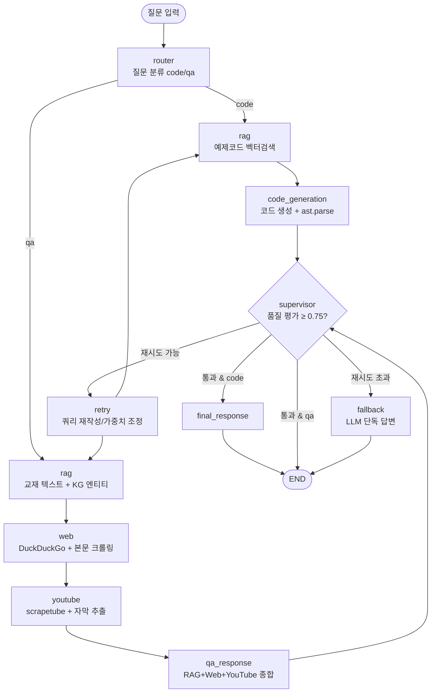

# aistudy-chat — Agentic AI 학습지원 MAS 챗봇

LangGraph `StateGraph` 기반 멀티에이전트 시스템(MAS) 챗봇임.
질문을 **코드 생성(code)** / **질의응답(qa)** 으로 분류한 뒤, 기존 Microsoft GraphRAG 산출물(KG + Vector DB)과
Web·YouTube 검색을 종합하여 답변하고, **Supervisor**가 품질을 평가(0.75 기준)하여 재시도·폴백을 결정함.

- **패턴**: SAS (Scheduler–Agent–Supervisor)
- **LLM/임베딩 런타임**: Ollama (`qwen3:8b`, `qwen3-embedding` 4096차원)
- **KG + Vector DB**: 기존 재사용 — `hands-on/14.graphrag/ms-graphrag/store`
- **멀티소스**: 교재(GraphRAG RAG) + Web(DuckDuckGo) + YouTube(자막)

---

## 1. 아키텍처

### 1.1 SAS 패턴 매핑

| SAS 구성요소 | 본 시스템 구현 |
|---|---|
| **Scheduler** | `router` 노드 + 조건부 엣지(`route_by_type`, `after_supervisor`) — 작업 분배·실행 순서 결정 |
| **Agent** | `rag` / `web` / `youtube` / `code_generation` / `qa_response` 노드 — 전문 작업 수행 |
| **Supervisor** | `supervisor` 노드 + `should_continue` — 품질 평가(0.75) + 재시도/폴백 판단(Loop Guard: `max_retries=2`) |
| **Shared State** | `AgentState` (TypedDict) — 노드 간 협업은 공유 State로만 수행 (Agent 직접 호출 없음) |

### 1.2 워크플로 다이어그램



### 1.3 RAG 검색 전략 (기존 GraphRAG 스토어 재사용)

무거운 GraphRAG API(local/global/drift, 멀티 LLM 호출) 대신 **LanceDB 직접 벡터검색 + Parquet id 조인**을
사용하여 로컬 `qwen3:8b` 환경에서도 빠르고 안정적으로 동작하도록 설계함.

| 경로 | 사용 테이블 | 본문 출처 |
|---|---|---|
| **QA(교재)** | `graphrag/text_unit_text` (Vector) | `parquet/text_units.parquet` id 조인 |
| **QA(KG)** | `graphrag/entity_description` (Vector) | `parquet/entities.parquet` id 조인 |
| **Code** | `code/code_chunks` | 테이블이 text 직접 보유 |

> `text_unit_text`·`entity_description` 테이블은 `id + vector(4096)`만 보유하므로, 검색 결과 id로 Parquet 본문과
> 조인해야 실제 텍스트를 얻음. KG 엔티티 검색을 함께 사용하여 "KG와 Vector DB 모두 사용" 요건을 충족함.

---

## 2. 소스 코드 설명

### 2.1 디렉토리 구조

```
aistudy-chat/
├── app.py                  # Streamlit 채팅 UI (실행 진입점)
├── main.py                 # CLI 실행 진입점 (빠른 테스트)
├── requirements.txt        # 의존성 (주석 영문)
├── README.md
├── config/
│   └── settings.py         # 전역 설정 (경로·LLM·검색·Supervisor, 한글 주석)
├── llm/
│   ├── ollama_llm.py       # qwen3:8b 호출 (thinking 비활성화 + <think> 제거)
│   └── ollama_embeddings.py# qwen3-embedding 쿼리 임베딩(4096)
├── agents/
│   ├── router.py           # Scheduler: 키워드+LLM 2단계 분류
│   ├── rag_agent.py        # LanceDB 벡터검색 + Parquet 조인 (KG+Vector)
│   ├── web_agent.py        # DuckDuckGo + BeautifulSoup 본문 크롤링
│   ├── youtube_agent.py    # scrapetube + youtube-transcript-api 자막 추출
│   └── code_agent.py       # 코드 생성 + ast.parse 구문 검증
├── graph/
│   ├── state.py            # AgentState (Shared State) 정의
│   ├── nodes.py            # 노드 함수 + Supervisor 채점 + 분기 함수
│   └── workflow.py         # StateGraph 구성/컴파일
└── utils/
    ├── logger.py           # 파일+콘솔 로거
    ├── helpers.py          # 쿼리 재작성·출처 포맷·관련성 점수
    └── file_saver.py       # 생성 코드 파일 저장(output/)
```

### 2.2 주요 함수와 처리 흐름

**진입 → 분류 (Scheduler)**
- `app.py:main()` / `main.py:run()` → `create_initial_state(question)`로 공유 State 생성 후 `app.invoke()` 실행
- `graph/nodes.py:router_node()` → `agents/router.py:Router.classify_question()`
  - 1단계 키워드 분류(`_classify_by_keywords`) → 애매하면 2단계 LLM 분류(`_classify_by_llm`)

**RAG 검색 (Agent)**
- `graph/nodes.py:rag_node()` → 유형 분기
  - code: `RAGAgent.search_code()` (code_chunks)
  - qa: `RAGAgent.search_textbook()` + `RAGAgent.search_entities()` (text_unit + KG entity)
- `RAGAgent`는 쿼리를 `OllamaEmbeddings.embed_query()`(4096차원)로 임베딩 → `table.search()` → `_distance_to_score()`로 점수 변환

**Code 경로**
- `code_generation_node()` → `CodeAgent.generate_with_retry()`
  - `generate_code()` → `_extract_code()`(코드블록 추출) → `validate_code()`(`ast.parse`)
  - 구문 오류 시 오류를 컨텍스트에 추가하여 재생성 → 유효하면 `save_code_to_file()`로 `output/`에 저장

**QA 경로**
- `web_node()` → `WebAgent.search()` (DuckDuckGo 검색 + `load_web_page()` 본문 크롤링)
- `youtube_node()` → `YouTubeAgent.search()` (scrapetube 검색 + `youtube-transcript-api`로 자막 청킹)
- `qa_response_node()` → 세 소스 컨텍스트를 가중치와 함께 프롬프트로 결합 → `OllamaLLM.generate()` → 출처(`format_sources`) 첨부
  > Web/YouTube는 네트워크 실패·차단·무자막을 모두 흡수하여 빈 결과를 반환하므로 RAG만으로도 답변이 생성됨.

**Supervisor (품질 평가 + 재시도)**
- `supervisor_node()` → `_evaluate_code()` 또는 `_evaluate_qa()` (각 4개 항목 × 0.25 = 0.0~1.0)
- `should_continue()` 분기:
  - `score ≥ 0.75` → 통과(code는 `final_response_node`, qa는 END)
  - 미통과 & `retry_count < 2` → `retry_node()`(쿼리 재작성/소스 가중치 조정) → 다시 `rag`
  - `retry_count ≥ 2` → `fallback_node()`(LLM 단독 답변, Graceful Degradation) → END

**Harness(안정성 통제)**
- Loop Guard: `SUPERVISOR_CONFIG.max_retries=2` + `invoke(recursion_limit=30)`
- 출력 검증: `ast.parse` 구문 검증, Supervisor 품질 게이팅
- 장애 격리: 각 검색 Agent는 예외를 흡수하여 빈 결과 반환(전체 흐름 비중단)

---

## 3. 사전 준비

### 3.1 Ollama 모델
```bash
ollama pull qwen3:8b
ollama pull qwen3-embedding
ollama serve   # 백그라운드 실행 (http://localhost:11434)
```

### 3.2 기존 GraphRAG 스토어
`hands-on/14.graphrag/ms-graphrag/store` 의 Parquet + LanceDB 산출물이 존재해야 함 (별도 인덱싱 불필요, 재사용).

### 3.3 (선택) YouTube 프록시
YouTube IP 차단 우회를 위해 `hands-on/.env` 에 `YT_WEBSHARE_USER` / `YT_WEBSHARE_PASS` 가 있으면 자동 적용됨.
없으면 직결로 동작하며, 차단 시 해당 영상만 건너뜀.
Webshare 프록시 연결 자체가 실패(ProxyError)하면 자동으로 직결로 전환해 재시도하므로, 프록시가 동작하지 않는 환경에서도
직결 접근이 가능하면 자막을 추출함.

---

## 4. 가상환경 설정 및 실행

### 가상환경 설정 (Windows / PowerShell)
```powershell
cd hands-on/16.mas/aistudy-chat
python -m venv venv
venv\Scripts\Activate.ps1
pip install -r requirements.txt
```

### 가상환경 설정 (Windows / GitBash)
```bash
cd hands-on/16.mas/aistudy-chat
python -m venv venv
source venv/Scripts/activate
pip install -r requirements.txt
```

### 가상환경 설정 (macOS / Linux)
```bash
cd hands-on/16.mas/aistudy-chat
python -m venv venv
source venv/bin/activate
pip install -r requirements.txt
```

### 실행 (Streamlit 웹 채팅)
```bash
streamlit run app.py
```

### 실행 (CLI 빠른 테스트)
```bash
python main.py "LangGraph의 StateGraph 사용법 알려줘"
```

### 테스트 질의어
| 유형 | 질의어 |
|---|---|
| Q&A (교재+웹+YouTube) | `LangGraph의 StateGraph 사용법 알려줘` |
| 코드 생성 | `LangGraph로 간단한 ReAct 에이전트 코드 작성해줘` |
| 웹 검색 필요 | `Claude MCP란 무엇인가요?` |
| YouTube 포함 | `RAG 구현 튜토리얼 영상 추천해줘` |

> 로컬 `qwen3:8b`는 응답에 수십 초가 걸릴 수 있음. Q&A 경로는 웹 크롤링·자막 추출로 더 길어질 수 있음.
