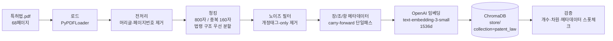
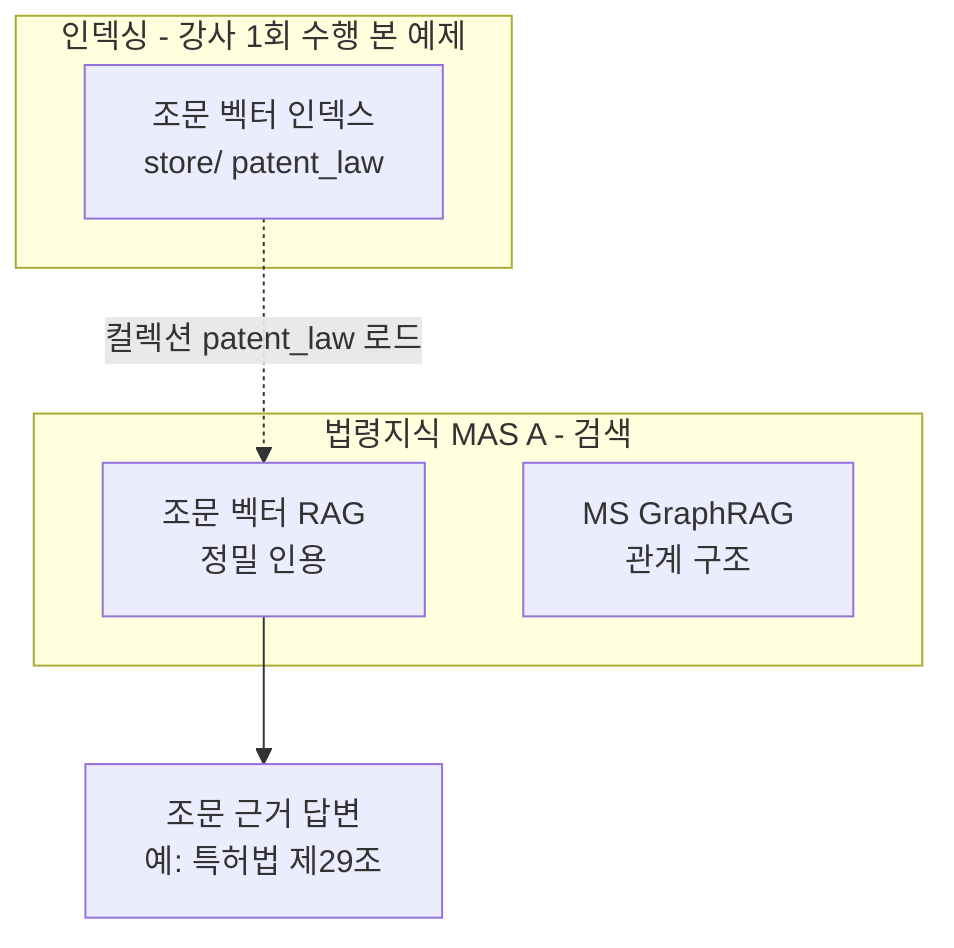

# 특허법 조문 벡터 RAG 인덱싱 (patent-mas)

특허법 PDF를 임베딩하여 `store/`에 ChromaDB 기반 **조문 벡터 인덱스**를 구축하는 예제임.
분산 MAS(`patent-mas`)의 **법령지식 MAS(MAS A)** 가 이 인덱스를 컬렉션명 `patent_law`로
검색하여 **특정 조문 원문을 정밀 인용**(citation tracing)하는 데 사용함.

RAG 파이프라인의 **Indexing 단계**(Load → 전처리 → Split → 메타데이터 → Embed → Store)만 담당함.

> `10.rag/indexing` 예제와의 핵심 차이: 기본 4종 메타데이터에 더해 **장/조/항(chapter/article/clause)
> 인용 메타데이터**를 부여하여, 검색 결과가 "특허법 **제29조(특허요건)**"처럼 출처를 추적 가능하게 함.

---

## 1. 개요

| 항목 | 내용 |
|------|------|
| 입력 | `hands-on/10.rag/data/특허법.pdf` (분산 MAS 공용 코퍼스, `PATENT_PDF_PATH`로 재정의 가능) |
| 임베딩 모델 | OpenAI `text-embedding-3-small` (1536차원) |
| 벡터 DB | ChromaDB (로컬 영속화) |
| 영속 경로 | `patent-mas/indexing/vector/store/` (10.rag 공용 DB와 **물리적으로 분리**) |
| 컬렉션명 | `patent_law` |
| 청킹 | `RecursiveCharacterTextSplitter` (chunk_size=800, chunk_overlap=160 = 20%) |
| 메타데이터 | 기본 4종 + 장/조/항 인용 메타데이터 6종 |

> **제약 준수**: 임베딩은 **OpenAI 모델만** 사용(로컬 모델 금지). 청킹 파라미터는 `config/settings.py`에
> 고정값으로 두어 **재실행 시 동일 청크**가 생성되도록 재현성을 보장함.

---

## 2. 아키텍처

### 2.1 인덱싱 파이프라인



### 2.2 patent-mas 내 위치



> 벡터 RAG(특정 조문 원문 정밀 인용)와 GraphRAG(요건·권리·절차의 관계 구조)는 MAS A 안에서
> **다른 역할로 공존**함. 본 예제는 그중 **조문 벡터 인덱스**를 구축함.

---

## 3. 처리 흐름

```
PDF 로드 → 전처리 → 청킹 → 노이즈 필터링 → 장/조/항 메타데이터 부여 → 임베딩 → ChromaDB 저장 → 검증
```

콘솔은 5단계(`[1/5]`~`[5/5]`)로 진행 상황을 출력함.

| 콘솔 단계 | 함수 | 설명 |
|------|------|------|
| `[1/5]` 로드 | `load_pdf()` | `PyPDFLoader`로 PDF를 페이지 단위 로드. 텍스트 추출 실패 시 오류 발생 |
| `[2/5]` 전처리 | `preprocess_documents()` / `clean_text()` | 페이지 번호("- 1 -"), 법제처 머리글, 반복 법령명 머리글("특허법") 제거 후 공백 정규화 |
| `[3/5]` 청킹 | `split_documents()` | 법령 구조(장→조→항)를 우선 경계로 삼는 `separators`로 800자 청크 분할 |
| `[3/5]` 청킹 | `filter_chunks()` | 개정 태그("[전문개정 ...]")만 담긴 빈약한 청크 제거 |
| `[3/5]` 청킹 | `attach_law_metadata()` | 기본 4종 + 장/조/항 메타데이터 부여 (아래 표) |
| `[4/5]` 임베딩·저장 | `build_vectordb()` | 기존 DB 삭제 후 OpenAI 임베딩으로 벡터화하여 ChromaDB에 영속 저장 |
| `[5/5]` 검증 | `verify_vectordb()` | 벡터 수·임베딩 차원 + **장/조/항 메타데이터 정확성 스폿체크** |

### 저장 메타데이터

| 키 | 타입 | 설명 | 예시 |
|------|------|------|------|
| `source` | str | 원본 PDF 파일명 | `특허법.pdf` |
| `chunk_index` | int | 전체 청크 중 순번 (0부터) | `20` |
| `total_chunks` | int | 생성된 전체 청크 수 | `245` |
| `char_count` | int | 해당 청크의 문자 수 | `780` |
| `chapter` | str | **장 라벨** | `제2장` |
| `chapter_title` | str | **장 제목** | `특허요건 및 특허출원` |
| `article` | str | **대표 조 라벨** (청크 첫 조문) | `제29조` |
| `article_title` | str | **대표 조 제목** | `특허요건` |
| `articles` | str | 청크에 포함된 **전체 조** (콤마 직렬화) | `제29조,제30조` |
| `clauses` | str | 청크에 포함된 **항 마커** (콤마 직렬화) | `①,②` |

> **장/조/항 추출 방식 — carry-forward 단일 패스**: 청크를 문서 순서대로 1회 순회하며 직전까지 본
> 장/조를 기억함. 긴 조문이 여러 청크로 쪼개지면 머리글이 없는 **연속 청크**는 직전 청크의 장/조를
> 물려받아 "어느 조문에 속한 본문인지"를 정확히 표기함. 순회가 결정적이라 재현성이 보장됨.
> ChromaDB 메타데이터는 원시형(str/int)만 허용하므로 리스트형(`articles`/`clauses`)은 콤마 문자열로 직렬화함.

---

## 4. 디렉토리 구조

```
patent-mas/indexing/vector/
├── config/
│   ├── __init__.py
│   └── settings.py          # 전역 설정 (경로·모델·청킹·노이즈·스폿체크) — 한글 주석
├── indexing.py              # 인덱싱 파이프라인 (로드→전처리→청킹→메타데이터→임베딩→저장→검증)
├── requirements.txt         # 의존성 (영문 주석)
├── README.md                # 본 문서
└── store/                   # 실행 후 생성 — ChromaDB 영속 디렉터리
    ├── chroma.sqlite3        # 원문·메타데이터·임베딩 레코드 (관계형 저장소)
    └── {세그먼트-UUID}/       # HNSW 벡터 인덱스 세그먼트 (재빌드마다 UUID 변경)
```

> 다운스트림 MAS는 **UUID를 하드코딩하지 말고** `persist_directory`(`store/`) + `collection_name`(`patent_law`)으로만
> 접근해야 함 (재빌드 시 세그먼트 UUID가 매번 달라짐).

---

## 5. 가상환경 설정 및 실행

### 가상환경 설정 (Windows / PowerShell)
```powershell
cd hands-on/16.mas/patent-mas/indexing/vector
python -m venv venv
venv\Scripts\Activate.ps1
pip install -r requirements.txt
```

### 가상환경 설정 (Windows / GitBash)
```bash
cd hands-on/16.mas/patent-mas/indexing/vector
python -m venv venv
source venv/Scripts/activate
pip install -r requirements.txt
```

### 가상환경 설정 (macOS / Linux)
```bash
cd hands-on/16.mas/patent-mas/indexing/vector
python -m venv venv
source venv/bin/activate
pip install -r requirements.txt
```

### 환경변수

`hands-on/.env` 파일에 OpenAI API 키가 필요함 (임베딩 호출에 사용).
```
OPENAI_API_KEY=sk-...
```

### 실행
```bash
python indexing.py
```

실행 시 `store/` 디렉터리에 ChromaDB가 생성되며, 재실행 시 기존 DB를 삭제 후 새로 구축함(중복 적재 방지).

---

## 6. 실행 결과

아래는 `python indexing.py`의 **실제 실행 출력**임 (OpenAI `text-embedding-3-small` 임베딩, 입력 `특허법.pdf` 기준).

```
[1/5] PDF 로드
  - 특허법.pdf: 68페이지 로드
[2/5] 전처리 (노이즈 제거)
  - 전처리 후 페이지 수: 68
[3/5] 청킹 + 장/조/항 메타데이터
  - 노이즈 청크 제거: 2개 → ['[전문개정 2014. 6. 11.]', '[전문개정 2014. 6. 11.]']
  - 생성된 청크 수: 245
[4/5] OpenAI 임베딩 + ChromaDB 저장
  - 기존 벡터 DB 삭제: ...\patent-mas\indexing\vector\store
  - 저장 위치: ...\patent-mas\indexing\vector\store
[5/5] 검증
  - 저장된 벡터 수: 245
  - 임베딩 차원: 1536 [OK]
  - 메타데이터 스폿체크 (질의 → 기대 조 / 실제 상위 청크 메타데이터):
    · '산업상 이용할 수 있는 발명의 특허요건은?' (기대 제29조) [✓일치]
        chapter=제2장(특허요건 및 특허출원) article=제29조(특허요건) articles=[제29조] clauses=[①]
        본문: 제29조(특허요건) ① 산업상 이용할 수 있는 발명으로서 다음 각 호의 어느 하나...
    · '발명의 정의는 무엇인가?' (기대 제2조) [✓일치]
        chapter=제1장(총칙) article=제1조(목적) articles=[제1조,제2조] clauses=[]
        본문: [시행 2025. 11. 11.] [법률 제21134호, 2025. 11. 11....
    · '특허거절결정의 사유는?' (기대 제62조) [✓일치]
        chapter=제3장(심사) article=제62조(특허거절결정) articles=[제62조] clauses=[]
        본문: 제62조(특허거절결정) 심사관은 특허출원이 다음 각 호의 어느 하나의 거절이유(이...

인덱싱 완료. 특허법 조문 벡터 인덱스가 준비됨.
```

### 실측 요약

| 지표 | 값 |
|------|------|
| 입력 페이지 수 | 68 |
| 제거된 노이즈 청크 | 2 (개정태그-only) |
| 생성된 청크 수 | **245** |
| 저장된 벡터 수 | **245** |
| 임베딩 차원 | **1536** (기대값 일치) |
| 컬렉션명 | `patent_law` |
| `chroma.sqlite3` 크기 | 약 4.5 MB |
| 메타데이터 스폿체크 | 3/3 ✓일치 (제29조·제2조·제62조) |

> **메타데이터 정확성 검증**: 개수·차원만으로는 이 예제의 핵심인 **인용 메타데이터 정확성**을 확인할 수 없으므로,
> 알려진 조문으로 검색해 반환 청크의 `chapter`/`article`이 기대값과 맞는지 스폿체크함.
> - `제29조` → `chapter=제2장`, `article=제29조(특허요건)`, `clauses=[①]` ✓
> - `제62조` → `chapter=제3장`, `article=제62조(특허거절결정)` ✓
> - `제2조`(정의)는 짧은 조문이라 `제1조`와 한 청크에 병합되어 대표 `article`은 `제1조`이지만,
>   `articles=[제1조,제2조]`에 포함되어 인용 추적이 가능함 ✓
>
> **스폿체크의 범위**: 이 검증은 반환 청크의 **장/조/항 라벨 정확성**을 확인하는 것이지 **검색 랭킹 품질**을
> 평가하는 것이 아님. 한국어 의미 검색의 정밀 순위 향상(Hybrid Search·Re-ranking 등)은 본 인덱스를 소비하는
> 다운스트림 **법령지식 MAS(MAS A)** 의 몫임.
>
> 위 수치(페이지·청크 수)는 입력 PDF에 따라 달라짐. 세그먼트 UUID는 재빌드마다 변경됨.

---

## 7. 벡터 DB 디렉터리 구조 상세

인덱싱 완료 후 `store/`에는 ChromaDB가 데이터를 **두 곳**에 나누어 영속화함.

| 저장소 | 담는 내용 |
|--------|-----------|
| **`chroma.sqlite3`** | 컬렉션 정의(`name=patent_law`), 청크 **원문 텍스트**, 메타데이터 10종, 임베딩 레코드 |
| **`{세그먼트-UUID}/`** | 컬렉션의 **HNSW 벡터 인덱스** — 1536차원 벡터의 근사 최근접 검색(ANN)용 그래프 자료구조 |

> 검색 시 둘이 함께 동작함: **UUID 폴더의 인덱스**로 유사 벡터 후보를 찾고,
> **`chroma.sqlite3`**에서 해당 청크의 원문·메타데이터를 꺼내 반환함.

> **참고**: UUID 폴더의 HNSW는 검색 가속용 **색인 그래프**이며, GraphRAG의 지식 그래프(엔티티 관계망)와는
> 무관함. 본 예제는 순수 Dense Retrieval임 (관계 구조 질의는 MAS A의 MS GraphRAG가 담당).
