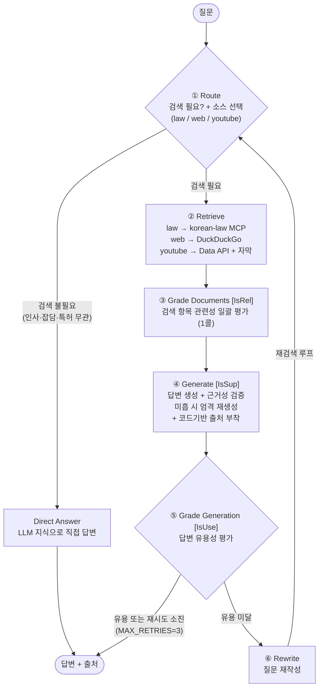
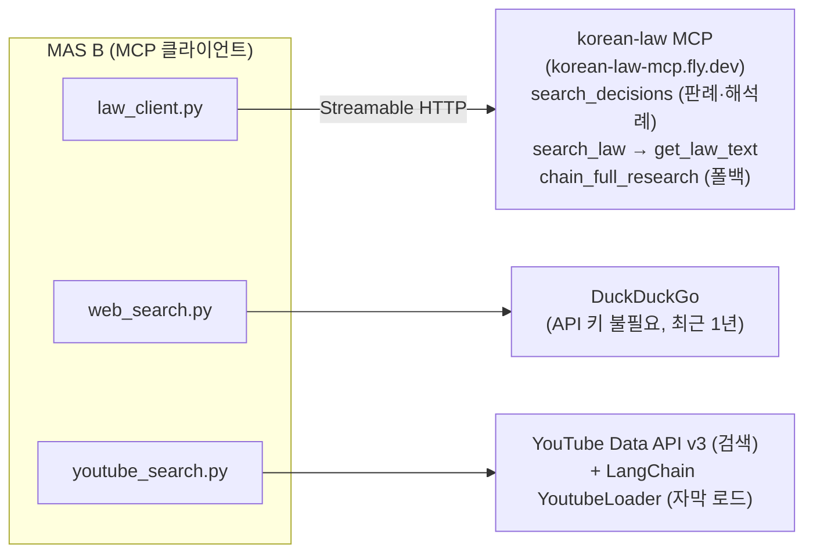

# MAS B — 특허 선행기술·동향 리서치 단위 MAS

외부 동적 소스(판례·해석례 + 웹 + YouTube)를 검색하는 **Self-RAG 단위 MAS**임.  
LangGraph StateGraph로 Agent가 스스로 검색 소스를 고르고, 답변 품질을 자체 평가하여 미흡하면
질문을 재작성해 재검색함. 법령 소스는 **korean-law MCP 서버의 MCP 클라이언트**(Streamable HTTP)로 동작함.

> **스코프**: 특허법 *조문 벡터 RAG* 는 MAS A 전담이므로 본 MAS는 **외부 동적 소스만** 검색함(중복 금지).

---

## 1. 아키텍처

### 1.1 워크플로우 (Self-RAG StateGraph)



**Self-RAG가 무엇인가** — "스스로(Self) 자기 답을 점검하는 RAG"임. 일반 RAG는 "검색 → 답변"으로 끝나지만,
Self-RAG는 중간중간 LLM이 **자기 작업을 검사하는 신호(Reflection 토큰)** 를 뽑아 "검색이 필요한가? 검색
결과가 관련 있나? 답이 근거에 충실한가? 답이 쓸모 있나?"를 스스로 묻고, 미흡하면 다시 시도함.

**그림 읽는 법 (한 단계씩)**

1. **Route(라우팅)** — 질문을 보고 ① 검색이 필요한지, ② 필요하면 어떤 소스(`law`/`web`/`youtube`)를 쓸지,
   ③ 소스별 검색어를 어떻게 다듬을지 한 번에 결정함. 인사·잡담·특허 무관 질문이면 검색 없이 곧장
   **Direct Answer**로 빠짐.  
2. **Retrieve(검색)** — 고른 소스에서만 실제 검색을 수행함. 한 소스가 실패해도 나머지로 답을 만들 수 있게
   각 호출을 따로 감쌈. 결과는 `{출처, 제목, 본문, 인용}` 형태의 **통합 항목**으로 합쳐짐.  
3. **Grade Documents [IsRel]** — 검색 항목들이 질문과 정말 관련 있는지 **한 번의 LLM 호출로 일괄 평가**해
   관련 있는 것만 추림(비용 절약).  
4. **Generate [IsSup]** — 추려진 자료로 답변을 생성한 뒤, **그 답이 자료에 실제로 근거하는지(환각이 없는지)**
   를 검사함([IsSup]). 근거가 약하면 "자료에 있는 것만 쓰라"는 엄격 모드로 다시 생성함. 출처 링크는 LLM이
   지어내지 못하도록 **코드가 직접** 붙임.  
5. **Grade Generation [IsUse]** — 최종 답이 질문에 실제로 **쓸모 있는지** 평가함. 쓸모 있으면 종료.  
6. **Rewrite(질문 재작성)** — 쓸모가 부족하면 질문을 더 나은 검색어로 고쳐 **다시 Route로 돌아가 재검색**함.
   단, 무한 반복을 막기 위해 최대 3회(`MAX_RETRIES=3`)까지만 돌고, 소진되면 마지막 답을 그대로 반환함.  

> 핵심 아이디어: "**검색하고 끝**"이 아니라 "**관련성·근거성·유용성을 스스로 채점하고, 부족하면 질문을
> 고쳐 다시 검색**"하는 자기교정 루프임. 멀티턴 대화에서는 직전 맥락(history)을 참고해 "그럼 판례는?" 같은
> 후속 질문의 의도까지 파악함.

### 1.2 Self-RAG Reflection 토큰

| 신호 | 노드 | 역할 |
|------|------|------|
| **Route** | `route` | 검색 필요 여부 + 소스(law/web/youtube) 선택 + 소스별 쿼리 최적화 |
| **IsRel** | `grade_documents` | 검색 항목 관련성 일괄 평가(1콜) → 관련 항목만 선별 |
| **IsSup** | `generate` | 답변이 컨텍스트에 근거하는지 검증(환각 방지) → 미흡 시 엄격 재생성 |
| **IsUse** | `grade_generation` | 답변 유용성 평가 → 미흡 시 Query Rewriting 후 재검색(최대 3회) |

### 1.3 소스별 통신



**그림 읽는 법**

- **법령 소스(law)** 만 외부 MCP 서버를 호출함. `law_client.py`가 원격 `korean-law MCP`에 Streamable HTTP로
  접속해 판례·해석례(`search_decisions`), 법령 조문(`search_law`→`get_law_text`)을 가져오고, 키워드가
  애매하면 종합검색(`chain_full_research`)으로 폴백함.  
- **웹(web)** 은 `DuckDuckGo`(API 키 불필요)로 최근 1년 동향을, **YouTube** 는 Data API v3로 영상을 찾고
  `YoutubeLoader`로 자막을 로드함.  
- 동기 그래프(`.invoke`)와 비동기 MCP 호출 사이는 `run_law_search()`가 `asyncio.run()`으로 다리를 놓음
  (한 번의 `retrieve` = 한 MCP 세션).

---

## 2. 소스 코드 설명

| 파일 | 설명 |
|------|------|
| `app.py` | 진입점. LLM·Self-RAG 그래프 준비 후 대화형(`chat`)·데모(`--demo`) 실행. 멀티턴 맥락 유지 |
| `config/settings.py` | 전역 설정(모델·MCP URL·검색 파라미터·Self-RAG 제어). 한글 주석으로 의미 설명 |
| `graph/state.py` | `AgentState`(상태 스키마) + Self-RAG 구조화 출력 스키마(Pydantic, `json_schema` 강제) |
| `graph/workflow.py` | Self-RAG 노드 7종 + 그래프. 통합 항목 구성·컨텍스트·**코드기반 출처** 생성 로직 |
| `sources/law_client.py` | **korean-law MCP Streamable HTTP 클라이언트** + 텍스트 응답 파서(판례·법령 메타 추출) |
| `sources/web_search.py` | DuckDuckGo 웹 검색(최근 1년, 출처 링크 포함) |
| `sources/youtube_search.py` | YouTube 검색 + YoutubeLoader 자막 120초 청킹 + **임베딩 코사인 청크 선별** |

### 2.1 핵심 설계 포인트

- **MCP 클라이언트(동기↔비동기 브리지)**: LangGraph 그래프는 동기(`.invoke`)로 동작하고 MCP 호출은
  비동기임. `run_law_search()`가 `asyncio.run()`으로 브리지하며, 한 번의 `retrieve`에서 한 MCP 세션을
  열어 필요한 도구를 순차 호출함. 비동기 진입점(`search_law_sources`)을 한 함수로 격리해 두어, 추후
  오케스트레이터가 async에서 호출할 때 쉽게 교체 가능함.
- **출처 환각 방지(MUST)**: MCP가 돌려준 상대 링크(`/DRF/...`)에 `https://www.law.go.kr` 를 붙여 절대
  URL을 만들고, 판례번호·선고일을 정규식으로 파싱해 **코드에서 직접** 출처를 구성함(LLM이 인용을 지어내지 못함).
- **구조화 출력(MUST)**: 라우팅·관련성·근거성·유용성·재작성 모든 판단을
  `with_structured_output(method='json_schema')`로 강제함. `reasoning_format='hidden'`과 공존 검증 완료.
- **YouTube 임베딩 선별**: 자막을 120초 청크로 나눈 뒤 질의-청크 코사인 유사도 상위 K개만 컨텍스트에
  넣어 "몇 분부터 보면 되는지" 타임스탬프 URL(`&t=초`)로 인용함('질의 벡터화' 시 OpenAI 임베딩 사용).

---

## 3. 디렉터리 구조

```
mas-b/
├── app.py                  # 진입점 (대화형 / --demo)
├── config/
│   ├── __init__.py
│   └── settings.py         # 전역 설정 (한글 주석)
├── graph/
│   ├── __init__.py
│   ├── state.py            # AgentState + 구조화 출력 스키마
│   └── workflow.py         # Self-RAG 노드 + StateGraph
├── sources/
│   ├── __init__.py
│   ├── law_client.py       # korean-law MCP 클라이언트 (Streamable HTTP)
│   ├── web_search.py       # DuckDuckGo
│   └── youtube_search.py   # YouTube Data API v3 + YoutubeLoader + 임베딩 선별
├── requirements.txt
└── README.md
```

---

## 4. 사전 준비 (API 키)

`hands-on/.env` 파일에 아래 키가 설정되어 있어야 함 (이 프로젝트는 공용 `.env`를 참조함).

| 키 | 용도 |
|----|------|
| `GROQ_API_KEY` | LLM (Groq LPU `openai/gpt-oss-120b`) |
| `OPENAI_API_KEY` | 임베딩 (YouTube 자막 청크 선별, `text-embedding-3-small`) |
| `YOUTUBE_API_KEY` | YouTube Data API v3 영상 검색 |
| `LAW_OC` | korean-law MCP 인증키 (서버 URL의 `oc` 쿼리 파라미터로 전달) |

---

## 5. 가상환경 설정 및 실행

### 가상환경 설정 (Windows / PowerShell)
```powershell
cd hands-on/16.mas/patent-mas/mas-b
python -m venv venv
venv\Scripts\Activate.ps1
pip install -r requirements.txt
```

### 가상환경 설정 (Windows / GitBash)
```bash
cd hands-on/16.mas/patent-mas/mas-b
python -m venv venv
source venv/Scripts/activate
pip install -r requirements.txt
```

### 가상환경 설정 (macOS / Linux)
```bash
cd hands-on/16.mas/patent-mas/mas-b
python -m venv venv
source venv/bin/activate
pip install -r requirements.txt
```

### 실행
```bash
python app.py            # 대화형 챗봇 (멀티턴, 'clear' 초기화, 'quit' 종료)
python app.py --demo     # 검증 질의 비대화형 순차 실행
```

### 소스별 단독 스모크 테스트
```bash
python -m sources.law_client       # korean-law MCP 접속·판례/법령 검색 검증
python -m sources.youtube_search   # YouTube 검색·자막 로드·임베딩 선별 검증
```

---

## 6. 사용 예시

```
질문: 직무발명 보상 관련 최근 판례와 업계 동향을 조사해줘

[Route] 검색 필요 여부 및 소스 판단 중...
  → 검색 필요: True / 소스: ['law', 'web', 'youtube']
[Retrieve:law] korean-law MCP 검색 중...
  → 판례 5 / 해석례 1 / 법령 5 / 조문 1 / 종합검색 없음
[Retrieve:web] DuckDuckGo 검색 중...
[Retrieve:youtube] 영상 검색·자막 로드 중...
[IsRel] 검색 항목 관련성 일괄 평가 중...
[Generate] 검색 결과 기반 답변 생성 중...
[IsSup] 답변 근거성 평가 중...  → 근거 있음: True
[IsUse] 답변 유용성 평가 중...  → 유용함: True

답변:
직무발명 보상금에 관한 최근 판례로는 ... (사건번호 2023다237514, 선고일 2024-11-20) ...

## 출처
**판례**
- [직무발명보상금청구의소](https://www.law.go.kr/DRF/lawService.do?...&ID=604589...) (사건번호 2023다237514, 선고일 20241120)
**웹**
- [ ... ]( ... )
**YouTube**
- [ ... ]( ...&t=120 ) @ 2:00
```

---

## 7. 참고

- 기반 예제: `hands-on/12.web-youtube-search/agentic-rag`(Self-RAG StateGraph),
  `hands-on/12.web-youtube-search/youtube-rag`(YouTube 검색·자막 로드)
- MCP 클라이언트 패턴: `hands-on/15.mcp/graphrag/test_mcp_client.py`
- korean-law MCP: https://github.com/chrisryugj/korean-law-mcp
- MAS 교재: `agentic-ai/textbook/16.MAS.md` (§8.2 복합 MAS 2계층 SAS, ④ MAS B)
