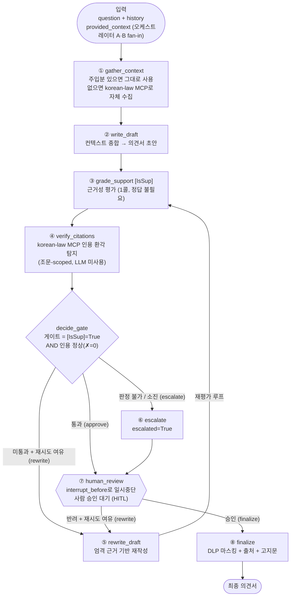

# MAS C — 특허 의견서 작성·검증 단위 MAS

특허 의견서 초안을 작성하고, **런타임 인라인 게이트**로 근거성·인용 환각을 검증한 뒤,  
사람 승인(HITL)과 개인정보 마스킹(DLP)을 거쳐 최종 출력하는 LangGraph 단위 MAS임.  

`patent-mas` 분산 시스템의 세 번째 단위 MAS로, 상위 오케스트레이터가 MAS A(법령)·MAS B(동향)의  
검색 결과를 주입하면 그것을 종합해 의견서를 작성함. 단독 실행 시에는 korean-law MCP를 A·B 프록시로  
호출해 컨텍스트를 자체 수집함.  

---

## 1. 핵심 설계

### 1.1 런타임 인라인 게이트 (매 요청, reference-free, 저지연)

| 단계 | 역할 | 방식 |
|------|------|------|
| 작성 | MAS A·B 검색 컨텍스트 종합 → 의견서 초안 생성 | Groq gpt-oss-120b |
| 근거성 검증 | Self-RAG **[IsSup]** — 초안이 검색 컨텍스트에 근거하는지 (정답 불필요, 1콜) | 구조화 출력 LLM 1콜 |
| 인용 검증 | korean-law MCP **verify_citations** — 법령 **조문** 인용 환각 탐지 | MCP 호출 (LLM 미사용) |
| HITL | 법적 책임 고지·확정 전 사람 승인 | `interrupt_before=['human_review']` |
| DLP | 개인정보(주민번호·전화·카드·이메일) 마스킹 후 최종 출력 | 정규식 (LLM 미사용) |

**전파 차단(가장 중요)**: 근거 미달(`[IsSup]=False`) 또는 인용 환각(`verify_citations ✗>0`)이면  
초안을 그대로 내보내지 않음. 재시도 여유가 있으면 **재작성**, 소진되거나 검증 서비스가 판정 불가하면  
**HITL 승급(escalate)** 하여 사람이 최종 판단함.  

### 1.2 verify_citations fail-safe (인용 게이트의 신뢰성)

korean-law MCP의 `verify_citations`는 사람이 읽는 텍스트를 반환함  
(`총 N건 | ✓ X 실존 | ✗ Y 오류 | ⚠ Z 확인필요`).  
- `✗`(NOT_FOUND) = 환각 인용 → **차단 대상**  
- `⚠`(부분매칭/법령명 불명확) = 실존 조문에서도 발생 → **차단하지 않음**  
- 인용이 없으면 `[NO_CITATIONS_FOUND]` → 검증할 것 없음(통과)  

검증 경로는 컨텍스트 수집과 **에러 처리가 분리**됨. 연결 실패·타임아웃·응답 파싱 불가는  
'인용 정상'으로 절대 흡수하지 않고 `ok=None`(판정 보류)로 보고함. 게이트는 `ok is True`일 때만  
통과시키므로, 판정 보류는 통과하지 못하고 HITL로 승급됨(다운된 서비스는 재작성으로 못 고치므로  
재작성이 아닌 승급으로 라우팅).  

**검증 범위(정확히)**: `verify_citations`는 `특허법 제29조` 같은 **법령 조문(article)** 인용만 추출·검증함  
(실측 확인). `대법원 2099다12345` 같은 **판례 사건번호는 이 도구가 검증하지 않음**. 따라서 본문에  
지어낸 가짜 사건번호는 (a) **IsSup 근거성**(초안이 실제 검색 컨텍스트에 근거해야 함)과 (b) **출처 섹션을  
코드가 실제 검색 결과로만 구성**(`build_sources_section`)하는 두 장치로 보완함 — 본문 환각이 출처로 새지 않음.  
또한 `verify_citations`가 일시 오류·법령명 불명확으로 조문을 `⚠`(확인필요)로 분류하면 차단하지 않으므로,  
드물게 조문 환각이 `⚠`로 새어 통과할 수 있음 — 이 경우 IsSup 근거성과 HITL 사람 검토가 최종 백스톱임.  

### 1.3 오프라인 품질 검증 (RAGAS 배치 — 런타임 경로 밖)

런타임에는 RAGAS를 쓰지 않음(배치 도구·정답 필요·고지연). 강사/회귀 검증용으로만 분리함.  
- **Faithfulness** (reference-free) = MAS C 답변(초안) 환각률  
- **Context Precision** (WithReference)·**Recall** = MAS A 검색(특허법 벡터 인덱스) 품질  
- 평가자 LLM은 OpenAI `gpt-4o-mini` (배치 전용). 배포 런타임은 순수 `gpt-oss-120b` 유지.  

---

## 2. 아키텍처

### 2.1 런타임 워크플로 (LangGraph StateGraph)



> `checkpointer = MemorySaver()` · `interrupt_before = ['human_review']` · 구조화 출력 = `json_schema`
> · 재작성 한도 `MAX_REWRITES=2` · `RECURSION_LIMIT=50`

**그림 읽는 법 (한 단계씩)**

1. **gather_context(컨텍스트 확보)** — 상위 오케스트레이터가 MAS A·B 검색 결과(`provided_context`)를
   넣어줬으면 그대로 씀. 단독 실행이면 korean-law MCP를 A·B 대신(프록시) 호출해 컨텍스트를 자체 수집함.  
2. **write_draft(초안 작성)** — 모인 컨텍스트를 종합해 의견서 초안을 1회 생성함.  
3. **grade_support [IsSup]** — 초안이 **검색 컨텍스트에 실제로 근거하는지**(지어낸 내용이 없는지)를
   1콜로 평가함. 정답지가 없어도 되는 reference-free 검사라 매 요청에 부담 없이 돌림.  
4. **verify_citations(인용 검증)** — korean-law MCP로 본문의 **법령 조문 인용이 실존하는지** 확인함
   (LLM이 아니라 실제 법령 DB 조회라 환각이 없음).  
5. **decide_gate(게이트 판정)** — 이 분기가 **품질 방어선**임. `[IsSup]=True` **그리고** 인용 오류(`✗`)가
   0건일 때만 **통과(approve)** 시켜 사람 승인으로 보냄. 그 외에는:  
   - 검증 서비스가 **판정 불가**(연결 실패 등)거나 재시도를 **소진**했으면 → **escalate**(사람에게 승급).  
   - 아직 재시도 여유가 있으면 → **rewrite_draft**로 보내 다시 쓰게 함.  
6. **rewrite_draft(재작성)** — 근거 부족·인용 문제·사람 반려 사유를 모아 "엄격 근거 기반"으로 초안을
   고쳐 쓰고, 다시 ③ grade_support부터 **재평가 루프**를 탐. 최대 2회(`MAX_REWRITES=2`)까지만 반복함.  
7. **human_review(사람 승인, HITL)** — `interrupt_before` 설정 때문에 **이 노드 실행 직전에 그래프가
   멈춤**. 앱이 사람의 승인/반려(+피드백)를 받아 상태를 갱신하고 재개하면 통과함. 승인이면 확정,
   반려이고 재시도 여유가 있으면 다시 재작성으로 돌아감.  
8. **finalize(확정·DLP)** — 개인정보(주민번호·전화·카드·이메일)를 정규식으로 마스킹하고, 코드가 만든
   출처 섹션과 법적 책임 고지문을 붙여 **최종 의견서**를 출력함.  

> 핵심 아이디어: "**검증을 따로 나중에**"가 아니라 **흐름 한가운데에 게이트를 박아**(인라인) 근거 부족·
> 인용 환각이 **사람·다음 단계로 새어 나가는 것을 차단**함. 자동으로 못 고치는 문제는 버리지 않고
> **사람에게 승급(escalate)** 해 최종 판단을 맡김.

흐름 요약: `START → gather_context → write_draft → grade_support → verify_citations →`  
`(approve→human_review / rewrite→rewrite_draft→grade_support / escalate→human_review) →`  
`human_review →(finalize / rewrite) → finalize → END`  

---

## 3. 소스 코드 설명

| 파일 | 설명 |
|------|------|
| `app.py` | CLI 진입점. 대화형/`--demo` 모드. `interrupt_before`로 멈춘 그래프를 `update_state`→재개하며 HITL 구동 |
| `config/settings.py` | 런타임 전용 설정(모델·MCP 접속·게이트 파라미터·법적 고지문). **한글 주석**으로 설명 |
| `graph/state.py` | `AgentState`(노드 간 공유 상태) + 구조화 스키마 `SupportGrade`([IsSup])·`ContextPlan`(컨텍스트 계획) |
| `graph/prompts.py` | 프롬프트 문자열 모음. **무거운 import 없음** — 런타임/오프라인 평가가 같은 초안 작성 지시문 공유 |
| `graph/workflow.py` | `PatentOpinionMAS` — StateGraph 노드·엣지·게이트 라우팅. checkpointer + interrupt로 컴파일 |
| `sources/law_mcp.py` | korean-law MCP 클라이언트(클라이언트 1, 용도 2): 컨텍스트 수집 + `verify_citations`(fail-safe 분리) |
| `harness/dlp.py` | DLP 출력 필터. 정규식으로 PII 탐지(`scan`)·마스킹(`mask`) (교재 §7.10) |
| `test_citation.py` | 인용 환각 시나리오 테스트(결정적). 파서·게이트 차단·노드 fail-safe + `--live` 실제 호출 |
| `evaluate/evaluate_ragas.py` | 오프라인 RAGAS 배치. patent_law 검색 → MAS C 초안 생성 → Faithfulness·Context Precision/Recall |
| `evaluate/test_dataset.py` | 11.rag-tuning/ragas 검증 테스트셋(질문+정답) 재사용 로더 |

### 구조화 출력
LLM 판단 단계(`[IsSup]`, 컨텍스트 계획)는 `with_structured_output(method='json_schema')`로 출력을  
강제함. gpt-oss-120b는 function_calling 모드에서 도구명을 잘못 생성할 수 있어 json_schema로 안정화함.  
초안 본문·재작성은 자연어이므로 `StrOutputParser`로 처리함.  

---

## 4. 디렉터리 구조

```
mas-c/
├── app.py                      # CLI 진입점 (대화형 + --demo, HITL 구동)
├── requirements.txt            # 런타임 의존성 (순수 gpt-oss-120b + MCP, 영문 주석)
├── test_citation.py            # 인용 환각 시나리오 테스트 (결정적 + --live)
├── README.md
├── config/
│   ├── __init__.py
│   └── settings.py             # 런타임 전용 설정 (한글 주석)
├── graph/
│   ├── __init__.py
│   ├── state.py                # AgentState + 구조화 스키마
│   ├── prompts.py              # 프롬프트 문자열 (런타임/오프라인 공유, 경량)
│   └── workflow.py             # PatentOpinionMAS StateGraph (인라인 게이트 + HITL + DLP)
├── sources/
│   ├── __init__.py
│   └── law_mcp.py              # korean-law MCP 클라이언트 (컨텍스트 수집 + verify_citations)
├── harness/
│   ├── __init__.py
│   └── dlp.py                  # DLP 개인정보 마스킹 필터
└── evaluate/                   # 오프라인 RAGAS 배치 (런타임 경로 밖, 별도 venv)
    ├── __init__.py
    ├── test_dataset.py         # 11.rag-tuning 테스트셋 재사용 로더
    ├── evaluate_ragas.py       # RAGAS 배치 평가
    └── requirements.txt        # RAGAS 정확 핀 (별도 설치, 영문 주석)
```

---

## 5. 사전 준비 (.env)

`hands-on/.env`에 다음 키가 있어야 함 (상위 디렉터리에서 자동 로드).  

```
GROQ_API_KEY=<Groq API 키>      # 런타임 LLM (gpt-oss-120b)
LAW_OC=<법제처 Open API 인증키>  # korean-law MCP (컨텍스트 수집 + verify_citations)
OPENAI_API_KEY=<OpenAI 키>       # 오프라인 RAGAS 평가에만 필요 (런타임 미사용)
```

오프라인 RAGAS 평가는 공용 특허법 벡터 DB(`hands-on/10.rag/vectordb`, 컬렉션 `patent_law`)가  
있어야 함. 없으면 `hands-on/10.rag/indexing`으로 먼저 구축.  

---

## 6. 가상환경 설정 및 실행

### 6.1 런타임 (배포 경로 — 순수 gpt-oss-120b + MCP)

가상환경 설정 (Windows / PowerShell)
```powershell
cd hands-on/16.mas/patent-mas/mas-c
python -m venv venv
venv\Scripts\Activate.ps1
pip install -r requirements.txt
```

가상환경 설정 (Windows / GitBash)
```bash
cd hands-on/16.mas/patent-mas/mas-c
python -m venv venv
source venv/Scripts/activate
pip install -r requirements.txt
```

가상환경 설정 (macOS / Linux)
```bash
cd hands-on/16.mas/patent-mas/mas-c
python -m venv venv
source venv/bin/activate
pip install -r requirements.txt
```

실행
```bash
python app.py            # 대화형: 질문 → 작성·검증 → HITL 승인 → 최종 의견서
python app.py --demo     # 검증 시나리오 2건 비대화형 (HITL 자동 승인/반려 시연)

# 모듈 스모크 테스트
python -m sources.law_mcp      # 컨텍스트 수집 + verify_citations 직접 확인
python -m harness.dlp          # DLP 마스킹 확인
python test_citation.py --live # 인용 환각 시나리오 (결정적 + 실제 MCP 호출)
```

### 6.2 오프라인 RAGAS 평가 (런타임과 **별도 venv**)

RAGAS는 langchain 패키지를 정확 버전으로 고정해야 하므로, 런타임 venv를 오염시키지 않도록  
`evaluate/` 아래에 별도 venv를 만듦.  

```bash
cd hands-on/16.mas/patent-mas/mas-c/evaluate
python -m venv venv
# (Windows PowerShell) venv\Scripts\Activate.ps1
# (Windows GitBash)    source venv/Scripts/activate
# (macOS/Linux)        source venv/bin/activate
pip install -r requirements.txt
cd ..                                          # mas-c 디렉터리로 이동 후 모듈로 실행
python -m evaluate.evaluate_ragas --smoke      # 2케이스 스모크(저비용)
python -m evaluate.evaluate_ragas --limit 5    # 앞 5케이스
python -m evaluate.evaluate_ragas              # 전체 22케이스 (비용·시간 큼)
```

결과는 `evaluate/results/<타임스탬프>/`에 `summary.json`·`detail.csv`로 저장됨.  

---

## 7. 기술 스택

| 구분 | 사용 |
|------|------|
| LLM (런타임) | Groq LPU `openai/gpt-oss-120b` (`reasoning_format='hidden'`) |
| 인용 검증 | korean-law MCP `verify_citations` (원격 Streamable HTTP) |
| 프레임워크 | LangGraph StateGraph (`MemorySaver` checkpointer + `interrupt_before`) |
| 구조화 출력 | `with_structured_output(method='json_schema')` |
| 오프라인 평가 | RAGAS (평가자 LLM = OpenAI `gpt-4o-mini`, 배치 전용 — 런타임 미사용) |

> ⚠️ 본 MAS의 의견서 출력은 AI가 생성한 참고용 초안이며, 변리사·변호사의 법률 자문을 대체하지 않음.  
> 인용 자동 검증을 거치더라도 확정·제출 전 반드시 전문가의 최종 검토가 필요함.  
