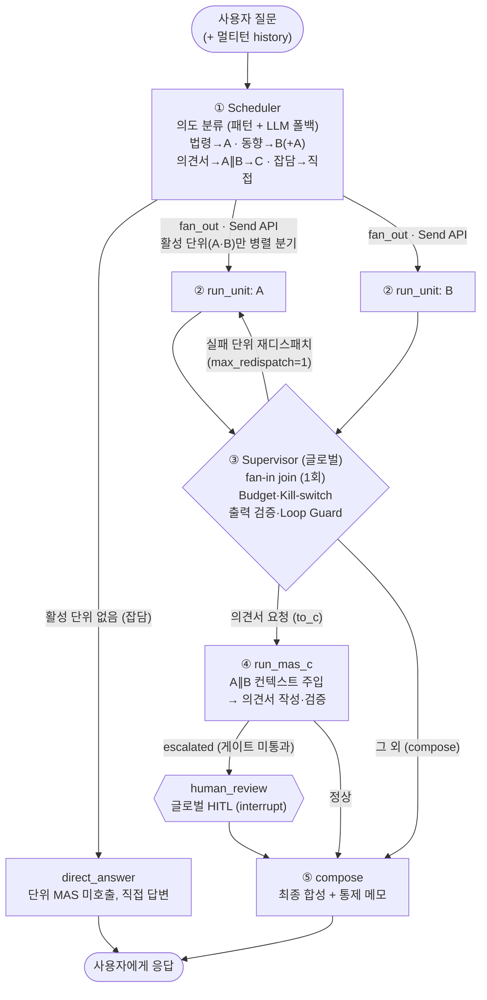
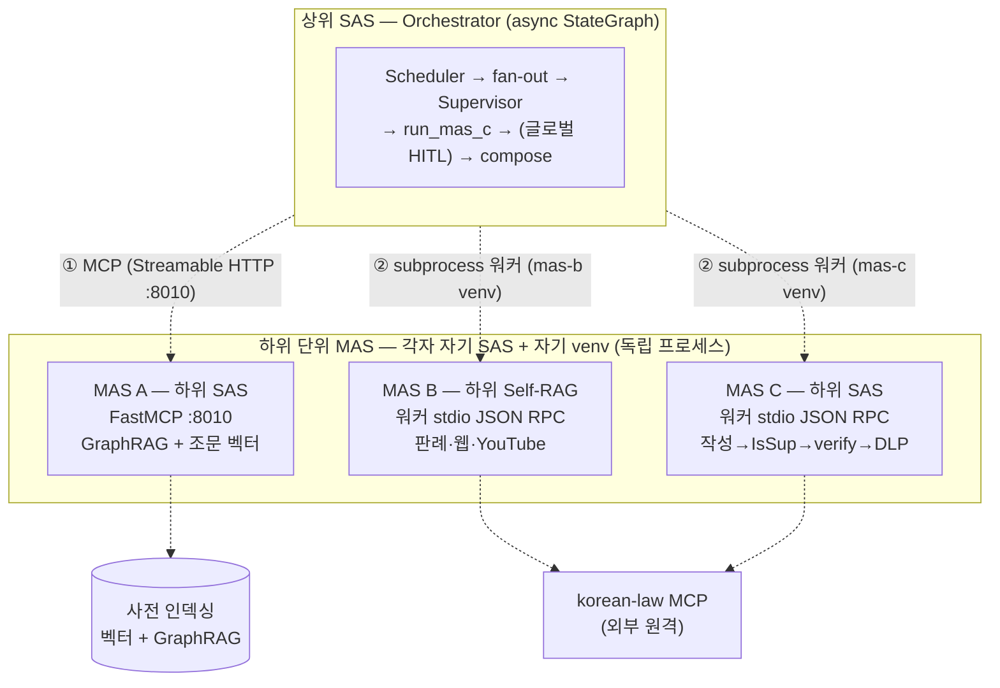

# patent-mas / orchestrator — 특허법 분산 MAS 오케스트레이터 (상위 SAS)

단위 MAS **A(법령지식)·B(선행기술·동향)·C(의견서 작성·검증)** 를 라우팅·조율하는 **상위 SAS**임.
교재 §9.2의 **복합 MAS = 2계층 SAS**(상위 Orchestrator + 단위 MAS A/B/C)를 LangGraph `StateGraph`로
구현하며, 글로벌 Supervisor가 **Budget·Loop Guard·출력 검증·HITL·graceful degradation**으로 통제함.

- **상위 SAS** : 의도 분류(Scheduler) → 활성 단위 **병렬 fan-out** → **fan-in 취합**(C) → 합성
- **하위 SAS** : 각 단위 MAS 내부의 자체 SAS/Self-RAG (이 프로젝트는 그 결과만 호출·조율)
- **통신** : MAS A = **MCP 클라이언트**(Streamable HTTP) · MAS B/C = **서브프로세스 워커**(API/Function Calling)
- **LLM** : Groq LPU `openai/gpt-oss-120b` (`reasoning_format='hidden'`) — 로컬 모델 미사용

> 단위 MAS는 **각자 자기 venv·자기 의존성**으로 동작함. 오케스트레이터는 단위 코드를 직접 import 하지
> 않고(패키지명 `config`/`graph`/`sources` 충돌 회피), **외부 프로세스**로 호출함(진정한 분산).

---

## 1. 분산 아키텍처 (2계층 SAS)

**2계층 SAS란** — SAS(Scheduler–Agent–Supervisor) 패턴 안에 또 다른 SAS가 들어 있는 **중첩 구조**임.
바깥(상위)의 Agent 자리에 "단위 MAS"가 통째로 들어가고, 그 단위 MAS도 내부에 자기만의 SAS/Self-RAG를
가짐. 즉 **오케스트레이터가 큰 SAS, 그 부하 직원인 A·B·C가 각자 작은 SAS**인 회사 조직도 같은 모양임.

### 1.1 상위 SAS 워크플로 (LangGraph StateGraph)



**그림 읽는 법 (한 단계씩)**

1. **Scheduler(의도 분류)** — 질문이 무엇을 원하는지 분류함(키워드 패턴 우선, 애매하면 LLM 폴백).
   법령지식이면 **A**, 판례·동향이면 **B**(필요 시 A 동반), 의견서면 **A∥B→C**, 잡담이면 단위 호출 없이
   **direct_answer**로 직접 답함.  
2. **fan_out → run_unit(병렬 분기)** — 활성 단위(A·B)만 골라 **Send API로 동시에** 디스패치함. A와 B는
   입력이 질문 하나로 서로 독립이라 병렬이 안전함. 각 분기 결과는 Shared State에 **reducer(`operator.add`)**
   로 안전하게 합쳐짐(경합 방지).  
3. **Supervisor(글로벌 감독, fan-in join)** — 모든 분기가 끝난 뒤 **딱 한 번** 실행됨. 예산을 점검하고
   (**Budget·Kill-switch**), 각 단위 결과가 쓸 만한지 **출력 검증**하고, 실패한 단위가 있으면 **Loop Guard**
   규칙으로 **그 단위만 1회**(`max_redispatch=1`) 다시 보냄. 재시도해도 안 되면 부분 결과로 진행함
   (graceful degradation).  
4. **run_mas_c(의견서 취합)** — 의견서 요청일 때만 실행됨. A∥B가 모은 컨텍스트를 **C에 주입**해 의견서를
   작성·검증함. C가 자체 게이트를 통과하지 못하면 `escalated=True`로 돌려보냄.  
5. **human_review(글로벌 HITL)** — C가 승급(escalated)했을 때만 거치는 **사람 승인 게이트**임.
   `interrupt_before`로 그래프가 멈추고, 사람이 승인/반려한 뒤 재개됨. (사람 승인은 시스템 전체에서 **여기
   한 곳**에만 둠 — C 내부 승인은 워커가 자동 통과시킴.)  
6. **compose(합성)** — 단위 결과를 하나의 답변으로 합치고, Supervisor의 통제 메모(예산·열화·HITL 여부)를
   덧붙여 사용자에게 반환함.  

> **순서 요약**: ① A∥B 병렬(fan-out) → ② C 취합(fan-in, 의견서 요청일 때만) → ③ 합성·응답.
> ※ 단순 질의는 A 또는 B 단독 실행, 잡담은 단위 MAS 미호출(직접 답변).

### 1.2 2계층 SAS 분산·통신 구조



**그림 읽는 법**

- **상위(UPPER)** 가 §1.1 워크플로를 돌리는 오케스트레이터임. 단위 MAS를 **직접 import 하지 않고** 두 가지
  방식으로 **바깥에서** 호출함:  
  - **① MAS A → MCP 클라이언트**: 미리 떠 있는 FastMCP 서버(`:8010`)에 Streamable HTTP로 `ask_patent_law`
    를 호출함.  
  - **② MAS B·C → 서브프로세스 워커**: 질의마다 **각 단위의 venv 파이썬**으로 워커 프로세스를 1회 띄워
    stdin/stdout JSON으로 통신함. (B·C가 패키지명 `config`/`graph`/`sources`가 같아 한 프로세스에 함께
    import 하면 충돌하므로, **프로세스를 분리**해 차단하고 오케스트레이터 venv도 가볍게 유지함.)  
- **하위(LOWER)** 의 단위 MAS는 각자 **독립 프로세스·독립 venv**로 동작하는 "작은 SAS"임. A는 사전
  인덱싱 산출물을, B·C는 외부 `korean-law MCP`를 사용함.  

### 1.3 통신 구조 (교재 §2.3)

| 대상 | 방식 | 구현 |
|------|------|------|
| 상위↔MAS A | **MCP** (Streamable HTTP) | `clients/mas_a_client.py` — `ask_patent_law` 원격 도구 호출 |
| 상위↔MAS B/C | **API / Function Calling** (외부 프로세스) | `clients/worker_client.py` → `workers/*` (각 단위 venv 파이썬) |
| Agent↔Agent | **금지** — Shared State + 라우팅 엣지로만 조율 | `graph/state.py` (reducer=operator.add) |
| 단위 MAS 내부 | In-Process | 각 단위 MAS의 자체 그래프 |

---

## 2. 글로벌 Supervisor 통제 (Harness, 교재 §7)

| 통제 | 구현 | 위치 |
|------|------|------|
| **Budget 분배** | `WorkflowBudget` — 호출수(1차)·추정 토큰(보조) 한도, 분기별 비율 분배 | `graph/supervisor.py` |
| **Kill-switch** | C 취합/재디스패치 전 `can_afford()` 점검, 예산 부족 시 단계 생략 | `supervisor_node` |
| **Loop Guard** | 부분 실패 단위만 `max_redispatch`(기본 1)회 재시도 | `supervisor_node` |
| **출력 검증** | `validate_branch` — 분기 결과의 사용 가능성 구조 판정 → 실패 단위 식별 | `graph/supervisor.py` |
| **Graceful degradation** | 일부 단위 실패 시 부분 결과로 진행 + 사용자 안내 | `supervisor_node`/`compose_node` |
| **계층적 타임아웃** | 분기별 `asyncio.wait_for` + 워커 내부 `subprocess timeout`(이중 가드) | `graph/nodes.py` |
| **글로벌 HITL** | C가 게이트 미통과(escalated) 시 `interrupt_before=['human_review']` 로 사람 승인 | `graph/workflow.py` |

> **HITL 위치**: C 내부 사람 승인은 워커에서 자동 통과시키고, **실제 사람 승인 게이트는 상위
> 오케스트레이터에 단 한 곳** 둠. C가 `escalated=True`를 돌려주면 상위 Supervisor가 사람 검토로 승급함.

---

## 3. 디렉터리 구조

```
orchestrator/
├── app.py                    # Streamlit 챗봇 UI (멀티턴 + 글로벌 HITL 승인 패널)
├── run_cli.py                # 비대화형 검증 CLI (§9.2 4종 테스트 질의, HITL 자동 승인)
├── requirements.txt          # 의존성 (주석 영문) — B/C 무거운 의존성은 미포함(워커 venv가 보유)
├── .env.example              # 환경변수 안내 (키는 공용 hands-on/.env 에서 로드)
├── config/
│   ├── settings.py           # 경로·모델·MCP URL·Budget·타임아웃·워커 venv (주석 한글)
│   └── llm.py                # ChatGroq 팩토리 + 구조화 출력(json_schema) 헬퍼
├── clients/
│   ├── mas_a_client.py       # MAS A 통신 — MCP 클라이언트(Streamable HTTP) + 컨텍스트 변환
│   └── worker_client.py      # MAS B/C 통신 — 서브프로세스 JSON RPC (asyncio.to_thread)
├── workers/
│   ├── mas_b_worker.py       # mas-b venv 로 실행 — stdin JSON → PatentTrendRAG → stdout JSON
│   └── mas_c_worker.py       # mas-c venv 로 실행 — stdin JSON → PatentOpinionMAS(자동승인) → JSON
└── graph/
    ├── state.py              # 상위 SAS Shared State(reducer) + 구조화 스키마
    ├── scheduler.py          # Scheduler 라우터 (패턴 매칭 + LLM 폴백)
    ├── supervisor.py         # WorkflowBudget·출력 검증 (LangGraph 비의존 순수 로직)
    ├── nodes.py              # 그래프 노드 (scheduler/run_unit/supervisor/run_mas_c/compose/...)
    └── workflow.py           # StateGraph 조립 (Send fan-out·reducer·HITL interrupt·checkpointer)
```

### 소스 코드 설명

- **config/settings.py** : 단위 MAS venv 파이썬 경로, MAS A MCP URL, 글로벌 Budget·타임아웃을 한곳에서 관리함.
- **clients/mas_a_client.py** : `mas-a/test_mcp_client.py`와 동일한 Streamable HTTP 세션으로 `ask_patent_law`를 호출하고, 결과를 MAS C용 컨텍스트(`{source,title,content,citation}`)로 변환함.
- **clients/worker_client.py** : B/C를 **각 단위 venv 파이썬**으로 서브프로세스 기동해 stdin/stdout JSON으로 통신함. 블로킹 `subprocess.run`을 `asyncio.to_thread`로 보내 A∥B 병렬 대기를 겹침.
- **workers/mas_b_worker.py · mas_c_worker.py** : 단위 MAS를 `sys.path`로 import 해 실행하는 격리 진입점. 단위의 진행 로그(stdout)는 stderr로 돌리고 **최종 JSON만 stdout**으로 보내 채널 오염을 막음(stdin/stdout/stderr 모두 UTF-8 재설정).
- **graph/scheduler.py** : 도메인 키워드 점수화로 의도를 정하고, 확신도가 낮으면 LLM 구조화 분류로 폴백함.
- **graph/nodes.py** : 모든 노드. `run_unit`은 자기 분기 단위 1개만 호출(다른 Agent 직접 호출 금지)하고 결과를 reducer로 누적함. `supervisor_node`가 Budget·검증·Loop Guard를 한곳에서 처리함.
- **graph/workflow.py** : `Send` API로 활성 단위만 병렬 fan-out하고, 실패 재디스패치 루프와 `interrupt_before`(글로벌 HITL)를 연결해 컴파일함.

---

## 4. 단위 MAS 기동 순서 (사전 조건)

분산 MAS는 단위가 **독립 프로세스**로 동작함. 오케스트레이터 실행 전 아래가 준비되어야 함.

| 순서 | 대상 | 준비/기동 | 비고 |
|------|------|-----------|------|
| 0 | **인덱스** | `patent-mas/indexing/vector`, `indexing/graphrag` 산출물 | MAS A 전제 (선행 구축) |
| 1 | **korean-law MCP** | 외부 원격(`korean-law-mcp.fly.dev`) — `hands-on/.env`의 `LAW_OC`만 설정 | MAS B/C 가 사용 |
| 2 | **MAS A 서버** | `mas-a`에서 `python server.py` → `http://127.0.0.1:8010/mcp` | **반드시 먼저 기동** |
| 3 | **MAS B/C venv** | `mas-b`, `mas-c` 각 폴더에 `venv` + 의존성 설치 완료 | 워커가 이 venv로 실행됨 |
| 4 | **Orchestrator** | `streamlit run app.py` (B/C 워커는 질의 시 자동 기동) | 사용자 진입점 |

> B/C는 **별도 서버 기동이 불필요**함 — 오케스트레이터가 질의마다 각 단위 venv 파이썬으로 워커를 1회 띄움.

---

## 5. 가상환경 설정 및 실행

### 가상환경 설정 (Windows / PowerShell)
```powershell
cd hands-on/16.mas/patent-mas/orchestrator
python -m venv venv
venv\Scripts\Activate.ps1
pip install -r requirements.txt
```

### 가상환경 설정 (Windows / GitBash)
```bash
cd hands-on/16.mas/patent-mas/orchestrator
python -m venv venv
source venv/Scripts/activate
pip install -r requirements.txt
```

### 가상환경 설정 (macOS / Linux)
```bash
cd hands-on/16.mas/patent-mas/orchestrator
python -m venv venv
source venv/bin/activate
pip install -r requirements.txt
```

### 5.1 MAS A 서버 기동 (별도 터미널, 먼저 실행)
```bash
cd hands-on/16.mas/patent-mas/mas-a
venv\Scripts\Activate.ps1      # (Windows) / source venv/bin/activate (mac·Linux)
python server.py               # → http://127.0.0.1:8010/mcp
```

### 5.2 오케스트레이터 챗봇 실행 (Streamlit)
```bash
cd hands-on/16.mas/patent-mas/orchestrator
streamlit run app.py
```
브라우저에서 질문을 입력하면 Scheduler가 단위 MAS로 라우팅함. 의견서 요청이 게이트 미통과로
승급되면 화면에서 **승인/반려(HITL)** 후 재개함.

> **HITL 패널 시연**: 실제 의견서는 보통 게이트를 통과해 HITL이 잘 안 걸림. 승인/반려 패널을
> 직접 보려면 `ORCH_FORCE_ESCALATE=1 streamlit run app.py` 로 강제 승급시킬 수 있음(데모용 토글, 기본 off).

### 5.3 비대화형 검증 (4종 테스트 질의 + 멀티턴)
```bash
cd hands-on/16.mas/patent-mas/orchestrator
python run_cli.py        # 4종 전체 (마지막 줄 ALL PASS면 통과)
python run_cli.py 4      # 4번(의견서)만
python run_cli.py mt     # 멀티턴 3턴 대화 (history 누적 + 후속 질의 맥락 라우팅)
```

---

## 6. 테스트 질의어 (교재 §9.2)

| # | 질의 | 라우팅 |
|---|------|--------|
| 1 | 특허를 받기 위한 요건(신규성·진보성)을 설명해줘 | **A** (법령지식) |
| 2 | 특허권의 존속기간을 정한 조문을 인용해서 알려줘 | **A** (조문 인용) |
| 3 | 직무발명 보상 관련 최근 판례와 업계 동향을 조사해줘 | **B** (판례·동향) |
| 4 | 거절이유 통지에 대응하는 특허 의견서 초안을 작성하고 인용을 검증해줘 | **A∥B → C** (취합) |

---

## 7. 검증 결과 (run_cli.py)

`mas-a` 서버 기동 + `mas-b`/`mas-c` venv 준비 상태에서 `python run_cli.py` 실행 — **4종 전체 ALL PASS**.

| # | 라우팅 | 결과 |
|---|--------|------|
| 1 | `intent=law_knowledge` units=`['A']` | A(MCP) 답변 생성, budget 호출 1 |
| 2 | `intent=law_knowledge` units=`['A']` | A 조문 인용 답변 |
| 3 | `intent=prior_art_trend` units=`['B']` | B(워커) 판례·웹 검색 답변 |
| 4 | `intent=opinion_drafting` units=`['A','B']`→C | A∥B 병렬 → C 취합, `gate_passed=True`, budget 호출 3 |

**멀티턴 검증**(`python run_cli.py mt`, 3턴 대화) — **ALL PASS**:
- 턴1 `특허 요건 설명` → **A**(pattern) · 턴2 `직무발명 판례 동향?` → **B**(pattern, history 2개 전달)
- 턴3 `방금 그 내용 더 자세히 알려줘` → **B/trend**(LLM 폴백이 history로 직전 주제 상속) — history 6개 누적

추가 검증(통제 경로·통신 seam):
- **Loop Guard**: B 실패 + 재시도 여유 → 1회 재디스패치(`max_redispatch=1`) — 비네트워크 단위 테스트
- **Graceful degradation**: 재시도 소진 후에도 실패 단위가 남으면 부분 결과로 C 진행 — 단위 테스트
- **Kill-switch**: 예산(`max_calls`) 부족 시 C 취합 생략(`killed=True`) — 단위 테스트
- **글로벌 HITL (백엔드)**: C `escalated=True` 강제 → `interrupt_before` 발화 → `update_state(approved)` → 재개 종료 검증
- **글로벌 HITL (라이브 UI)**: `ORCH_FORCE_ESCALATE=1` 로 Streamlit 실행 → 의견서 질의 → **HITL 승인 패널**(초안·사유·승인/반려 버튼) 렌더링 → ✅승인 클릭 → 재개·확정·"검토 승인됨" 노트 표시까지 브라우저로 검증
- **통신 seam**: ① 비메인 스레드 `asyncio.run` MCP-A(Windows teardown 무오류) ② B/C 워커 stdio JSON 왕복(stdout 단일 JSON·stderr 로그 분리) ③ **Streamlit 실 UI**에서 A 질의 → 답변 렌더링(asyncio.run in ScriptRunner 정상)

> 라이브 UI 검증 중 발견·수정한 버그: Streamlit ScriptRunner 의 stdout 이 cp949 라, 노드 진행 로그 `print`
> 의 `—`(em-dash) 등이 `UnicodeEncodeError` 를 냄 → `app.py` 진입부에서 stdout/stderr 를 UTF-8 재설정해 해결.

---

## 8. 동작 원리 요약

1. **Scheduler**가 질문 의도를 분류함(패턴 우선, 애매하면 LLM 구조화 분류).
2. **fan_out**(Send API)이 활성 단위(A·B)만 골라 **병렬 디스패치**함(독립이므로 동시 실행 안전).
3. **run_unit**(async)이 분기별로 단위 MAS를 호출하고(A=MCP, B=워커), 결과를 **Shared State(reducer)** 에 누적함.
4. **Supervisor**가 fan-in join 후 1회 실행 — 예산 점검(Kill-switch)·출력 검증·Loop Guard(실패 재시도)·열화 처리.
5. 의견서 요청이면 **run_mas_c**가 A∥B 컨텍스트를 주입해 C를 호출하고, 미통과 시 **글로벌 HITL**로 승급함.
6. **compose**가 결과를 합성하고 Supervisor 통제 메모(예산·열화·HITL)를 덧붙여 사용자에게 반환함.
