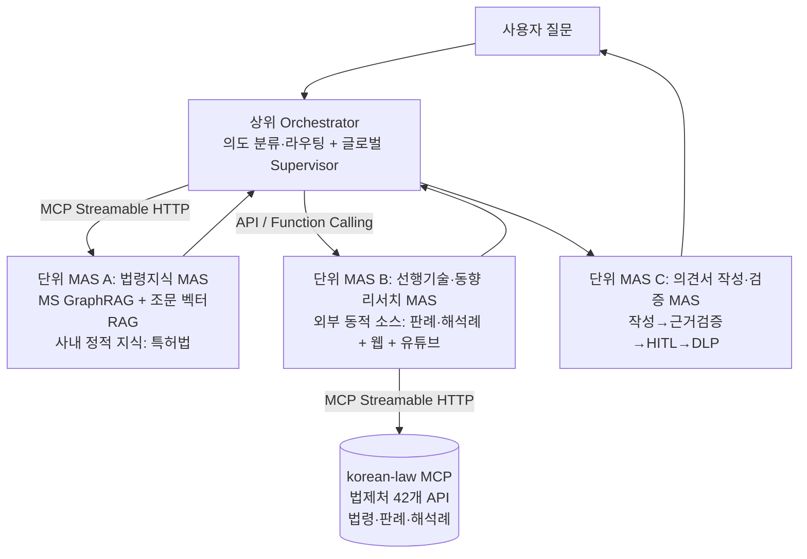
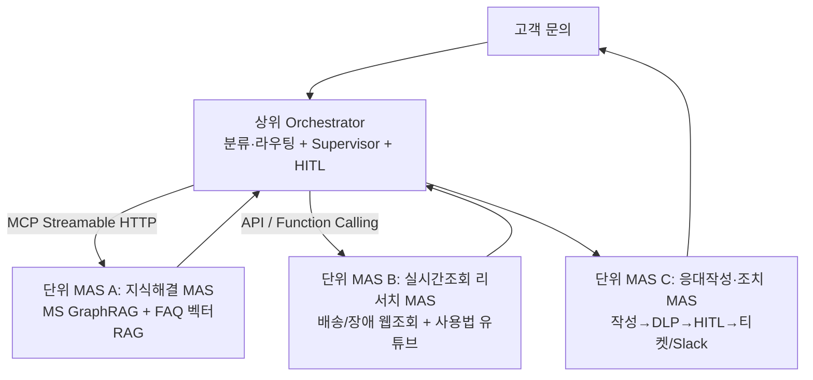
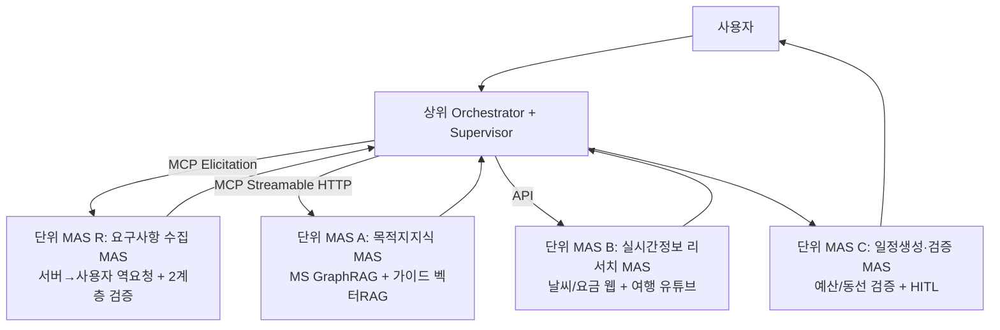

# 분산 MAS 실습 예제 추천

> MAS 교육 실습용 **분산(복합) MAS** 예제 후보 3종을 탐색·평가하여 최종 1종을 추천하는 문서임.  
> 대상: GPU가 없는 교육생(로컬 LLM 사용 불가, 클라우드 API 전용).  
> 작성일: 2026-06-01

---

## 목차

- [1. 분석 요약 (TL;DR)](#1-분석-요약-tldr)
- [2. MAS 교재 이해 — 분산 MAS란](#2-mas-교재-이해--분산-mas란)
- [3. 기존 실습 자산(빌딩블록) 분석](#3-기존-실습-자산빌딩블록-분석)
- [4. 제약사항 적용 분석](#4-제약사항-적용-분석)
- [5. 분산 MAS 후보 3종](#5-분산-mas-후보-3종)
  - [후보 A. 특허·지식재산(IP) 상담 분산 MAS](#후보-a-특허지식재산ip-상담-분산-mas)
  - [후보 B. 고객지원(CS) 자동화 분산 MAS](#후보-b-고객지원cs-자동화-분산-mas)
  - [후보 C. 여행 컨시어지 분산 MAS](#후보-c-여행-컨시어지-분산-mas)
- [6. 평가 — Factor 선정 및 채점](#6-평가--factor-선정-및-채점)
- [7. 최종 추천](#7-최종-추천)
- [8. 구현 시 주의사항 (공통)](#8-구현-시-주의사항-공통)
- [부록. 과제 프롬프트 원문](#부록-과제-프롬프트-원문)

---

## 1. 분석 요약 (TL;DR)

- **분산 MAS = 복합 MAS** = SAS(Scheduler-Agent-Supervisor) 패턴이 **2계층으로 중첩**된 구조임.  
  상위 Orchestrator가 여러 **단위 MAS**(각자 내부 StateGraph + Supervisor 보유)를 라우팅하고,  
  단위 MAS 간 연결은 **MCP / API / Function Calling**으로 함(외부 통신). (교재 §2.3, §8.2 근거)
- 5대 핵심요소(**Workflow · LLM · RAG와 GraphRAG · Tools(MCP) · Harness**)를 모두 포함해야 함.
- **가장 큰 제약 함정**: 기존 `14.graphrag/ms-graphrag` 스토어는 로컬 Ollama `qwen3-embedding`(4096차원)로  
  인덱싱되어 있어 **재사용 불가**(제약: OpenAI 임베딩 필수 + 로컬 모델 금지). 모든 후보가 **OpenAI 임베딩으로  
  MS GraphRAG를 재인덱싱**해야 함. 따라서 "데이터 소스 ≤5000줄"은 단순 스코핑이 아니라  
  **인덱싱 비용·실현성을 가르는 1순위 제약**임.
- **최종 추천: 후보 A — 특허·지식재산(IP) 상담 분산 MAS.**  
  핵심 근거는 **코퍼스 준비도**임. `10.rag/data/특허법.pdf`가 이미 레포에 존재하고(**실측 3,152줄 →  
  ≤5000 충족**), 동일 코퍼스의 **OpenAI 임베딩 벡터 스토어(`10.rag/indexing`, ChromaDB)도 이미 구축**되어  
  있어, 신규로 추가할 작업은 **동일 특허법 코퍼스에 대한 MS GraphRAG 인덱스 1개**뿐임 → 재인덱싱  
  실현성·재사용도가 3종 중 최고. 차순위는 **후보 B(고객지원)** 로, 엔티티 밀도와 보안 Harness  
  학습 효과가 가장 높으나 GraphRAG 코퍼스를 신규 작성해야 함.

---

## 2. MAS 교재 이해 — 분산 MAS란

교재 `agentic-ai/textbook/16.MAS.md`의 핵심 개념을 정리함.

### 2.1 SAS 패턴과 분산(복합) MAS

- **SAS 패턴**: 모든 실용 MAS는 `Scheduler(작업 분배) + Agent(작업 수행) + Supervisor(관측·통제)` 로 환원됨.
- **단일 MAS**: 하나의 LangGraph `StateGraph` 안에 SAS가 구현됨. Agent 간 협업은 직접 호출이 아니라  
  **Shared State**(공유 상태 + reducer)로 함.
- **분산(복합) MAS**: 단일 MAS로 풀기 어려운 복잡한 작업을 위해 **여러 단위 MAS를 연결**한 구조.  
  교재 §8.2의 표현 그대로 **"SAS 안에 SAS가 중첩되는 2계층 구조"** 임.

| SAS 구성요소 | 단일 MAS | 분산(복합) MAS |
|---|---|---|
| **Scheduler** | StateGraph 1개 | **상위**: Orchestrator StateGraph(단위 MAS 간 라우팅) / **하위**: 각 단위 MAS 내부 StateGraph |
| **Agent** | Node 함수 | **상위**: 각 단위 MAS 자체가 하나의 Agent / **하위**: 단위 MAS 내부 Node |
| **Supervisor** | Node 함수 | **상위**: 글로벌 Budget·전체 진행 추적 / **하위**: 각 단위 MAS 내부 Supervisor |

- **통신**: 상위↔하위(단위 MAS 간)는 **API · MCP · Function Calling**(외부 통신),  
  단위 MAS 내부 Node 간은 **In-Process**(직접 호출). (교재 §2.3 통신 레이어)
- **Budget 관리**: 상위 Supervisor가 글로벌 Budget을 단위 MAS별로 분배, 하위는 할당량 내 자체 관리.

> ⚠️ **"진짜 분산 MAS" 판별 기준** (본 문서의 설계 게이트):  
> ① 단위 MAS가 **2개 이상**이고, 각 단위 MAS는 **다단계(multi-node) + 자체 Supervisor**를 가진 SAS여야 함.  
> ② 단위 MAS 간 연결은 MCP/API/FC이며, **최소 1개는 별도 프로세스(MCP 서버 등) 경계**를 가져야 함.  
> ③ "분류 1회 호출", "Slack 1회 발송" 같은 단발 작업은 MAS가 아니라 **Tool/Node**임 →  
> thin 작업을 단위 MAS로 포장 금지.

### 2.2 AI 앱 5대 핵심요소 (교재 §1.3)

LLM 단독 사용의 한계를 보완하는 요소이며, 본 추천의 **MUST 포함 항목**임.

| 핵심요소 | 역할 | 교재 한계→해결 매핑 |
|---|---|---|
| **Workflow** | 다단계 작업 수행 | "단일 턴 한계" 해결 → LangGraph StateGraph |
| **LLM** | 추론·생성 | 본 과제: Groq LPU `gpt-oss-120b` |
| **RAG와 GraphRAG** | 정보 최신성·정확성 보완 | "정보 단절" 해결 → 벡터 RAG **+** MS GraphRAG (둘은 **다른 역할**로 공존) |
| **Tools(MCP 포함)** | 외부 시스템 호출 | "실행 불가" 해결 → MCP 서버/도구, Function Calling |
| **Harness** | 관찰·통제 | "관찰/통제 한계" 해결 → Supervisor + 9대 리스크 완화 |

### 2.3 Harness 엔지니어링 — 9대 실행 리스크 (교재 §7)

`Agent = Model + Harness`. 자율 에이전트를 통제 레이어로 감싸 폭주를 막음.  
암기법 **"돌·토·폭 / 멈·느·할 / 침·유·권"**.

- 💰 비용: 무한 루프(Loop Guard) · 토큰 누수(컨텍스트 관리) · Agent 폭주(Budget·Kill-switch)
- ⚡ 성능: 시스템 마비(Circuit Breaker) · 응답 지연(병렬·타임아웃·캐싱) · 할루시네이션 전파(출력 검증·게이팅)
- 🔒 보안: Prompt Injection(입력 필터) · 데이터 유출(DLP·감사 로그) · 권한 오남용(최소 권한·HITL)

> 분산 MAS에서는 **상위 Supervisor가 글로벌 안전망**, 각 단위 MAS의 하위 Supervisor가 **1차 방어**를 담당함.

---

## 3. 기존 실습 자산(빌딩블록) 분석

`hands-on/` 하위 README를 전수 조사하여 **클라우드 전용(GPU 불필요)** 으로 재사용 가능한 자산을 분류함.  
(분산 MAS는 기존 단위 기술들을 단위 MAS로 조립하는 방식이 가장 현실적임)

### 3.1 클라우드 전용 — 즉시 재사용 가능

| 자산 | 위치 | 제공 핵심요소 | LLM / 임베딩 | 비고 |
|---|---|---|---|---|
| **벡터 RAG (기본/하이브리드/Self-RAG/쿼리변환)** | `10.rag/*` | Workflow, LLM, **RAG** | Groq `gpt-oss-120b` / **OpenAI 임베딩** | 특허법 코퍼스, ChromaDB, 이미 OpenAI 임베딩 |
| **인덱싱(공용 벡터DB)** | `10.rag/indexing` | RAG 기반 | OpenAI `text-embedding-3-small`(1536d) | 특허법 246청크, **재인덱싱 불필요** |
| **멀티소스 Agentic RAG** | `12.web-youtube-search/agentic-rag` | **Workflow, LLM, RAG, Tools** | Groq `gpt-oss-120b` / OpenAI 임베딩 | LangGraph + 웹(DuckDuckGo) + YouTube + Self-RAG. **단위 MAS로 그대로 사용 가능** |
| **웹/유튜브 RAG, 멀티소스 라우팅** | `12.web-youtube-search/{web-rag,youtube-rag,multi-source}` | Workflow, LLM, RAG, Tools | Groq `gpt-oss-120b` | 소스별 쿼리 최적화·라우팅 패턴 |
| **RAGAS 평가** | `11.rag-tuning/ragas` | **Harness**(품질 게이트) | 생성 Groq / 평가 OpenAI `gpt-4o-mini` | 근거성·정확성 정량 평가 → 검증 단위 MAS에 활용 |
| **MCP Elicitation (여행 플래너)** | `15.mcp/elicitation` | **Tools(MCP), LLM, Harness**(서버 검증) | Groq **`openai/gpt-oss-120b`** | 서버→사용자 역요청 + 2계층 검증. **이미 120b 사용** |
| **MCP Sampling (고객문의 분류)** | `15.mcp/sampling` | **Tools(MCP), LLM** | Groq `llama-3.3-70b`(→120b 교체) | 서버가 클라이언트 LLM 차용 + 티켓 + Slack |
| **MCP 서버 패턴(Streamable HTTP)** | `15.mcp/graphrag` | **Tools(MCP)** | — | FastMCP로 검색 파이프라인을 MCP 서버로 노출하는 **참조 골격** |
| **korean-law MCP (외부 원격)** | [chrisryugj/korean-law-mcp](https://github.com/chrisryugj/korean-law-mcp) | **Tools(MCP)** | 법제처 42개 API(검색 전용, 로컬 모델 없음) | 법령·판례·해석례 검색 17개 도구. Streamable HTTP 원격(`fly.dev`)/stdio. **OC 무료 키 필요**. 본 세션에 이미 `law-mcp`로 연결됨 |

### 3.2 제약 위반 — 그대로는 사용 불가 (수정 필요)

| 자산 | 위치 | 위반 사항 | 수정 방향 |
|---|---|---|---|
| **MS GraphRAG** | `14.graphrag/ms-graphrag` | 기존 스토어가 **로컬 Ollama `qwen3-embedding`(4096d)** 사용 + 답변 LLM이 `gpt-oss-20b` | **OpenAI 임베딩으로 재인덱싱**, 답변 LLM을 **`gpt-oss-120b`** 로 교체. 데이터 소스 ≤5000줄로 스코핑 |
| **GraphRAG MCP 서버** | `15.mcp/graphrag` | **Neo4j + 로컬 Ollama 임베딩** 기반 | 통신 골격(FastMCP/Streamable HTTP)만 차용, 백엔드를 **MS GraphRAG로 교체** |
| **로컬 LLM Agentic RAG** | `13.local-llm/*` | Ollama `gemma3:12b`(로컬 LLM) | 본 과제에서는 제외 (LLM을 Groq로 쓰는 `12.*` 버전 사용) |
| **Re-ranking** | `10.rag/re-ranking` | PyTorch Cross-Encoder(**GPU 필요**) | 리랭킹이 필요하면 **OpenAI 기반**으로 대체(제약: 리랭킹도 OpenAI 모델) |

> **핵심 함의**: 분산 MAS의 5요소 중 **GraphRAG만이 신규 작업(OpenAI 재인덱싱)을 강제**함.  
> 나머지 요소(Workflow·LLM·벡터 RAG·MCP·Harness)는 클라우드 전용 자산으로 거의 그대로 조립 가능.  
> 그러므로 후보 선택의 승부처는 **"어떤 도메인 코퍼스가 OpenAI 재인덱싱하기 가장 쉽고 그래프가 풍부한가"** 임.

---

## 4. 제약사항 적용 분석

과제 제약을 설계 규칙으로 변환함.

| 제약 | 구분 | 설계 반영 |
|---|---|---|
| 분산 MAS 예제일 것 | MUST | 상위 Orchestrator + 단위 MAS ≥2 + MCP 서버 경계 ≥1 (§2.1 게이트) |
| AI 앱 5대 요소 모두 포함 | MUST | Workflow(LangGraph) · LLM(gpt-oss-120b) · **RAG와 GraphRAG 둘 다** · Tools(MCP) · Harness |
| GraphRAG는 **MS GraphRAG** | MUST | `graphrag` 패키지 Query API(Local/Global/DRIFT/Basic) 사용 |
| LLM = Groq LPU **`gpt-oss-120b`** | MUST | 전 단위 MAS 공통. `reasoning_format='hidden'` + `method='json_schema'` 우회(§8) |
| 임베딩/리랭킹 = **OpenAI 모델** | MUST | `text-embedding-3-small`(인덱싱·검색), 리랭킹 필요 시 OpenAI |
| GraphRAG 데이터 소스 ≤ **5000줄** | MUST NOT 초과 | 인덱싱 코퍼스를 5000줄 이하로 스코핑(엔티티 밀도 유지가 관건) |
| **로컬 AI 모델 금지** | MUST NOT | Ollama/torch/CUDA 의존 자산 전면 배제 (학생은 검색만 수행) |

> **운영 전제(중요)**: MS GraphRAG **인덱싱은 강사가 1회 수행해 산출물(parquet+LanceDB)을 배포**하고,  
> 학생은 **retrieve(검색)만 실행**함. 인덱싱에는 OpenAI API 비용·시간이 들지만 학생 PC에서는 검색만  
> 일어나므로 GPU 없이 가능. "≤5000줄"은 이 1회 인덱싱의 비용·시간을 학습용으로 합리화하는 상한임.

---

## 5. 분산 MAS 후보 3종

세 후보 모두 **동일한 분산 골격**을 공유함(도메인·코퍼스·통신 패턴만 상이).

```
[상위 SAS] Orchestrator (LangGraph StateGraph)
  ├─ Scheduler  : 질문 의도 분류 → 단위 MAS 라우팅 (패턴매칭 + LLM 폴백)
  ├─ Supervisor : 글로벌 Budget 분배 · Loop Guard · 출력 검증 · HITL 승급
  └─ 단위 MAS A / B / C  (각자 내부 StateGraph + 내부 Supervisor)
        ⇅  MCP(Streamable HTTP) · API · Function Calling
```

각 후보의 정합성 게이트(§2.1) 통과 여부를 표로 명시함.

---

### 후보 A. 특허·지식재산(IP) 상담 분산 MAS

**시나리오**: 사용자의 특허/IP 질문(요건·출원·권리·침해 등)에 대해, ① 법령 지식 ② 선행기술·동향  
③ 의견서 작성·검증을 분담하는 분산 MAS. 변리사 보조 컨시어지를 모사함.

**도메인 코퍼스**: `10.rag/data/특허법.pdf` (이미 레포 보유). **실측: 추출 텍스트 3,152줄(공백 제외 2,844줄,  
약 129K자)로 5000줄 제약 충족** → 별도 스코핑 없이 전문(全文) 인덱싱 가능.



**단위 MAS 구성**

| 단위 MAS | 내부 SAS(다단계) | 제공 핵심요소 | 통신 |
|---|---|---|---|
| **A. 법령지식 MAS** (MCP 서버) | 모드 라우팅(Local/Global/DRIFT) → MS GraphRAG 검색 → **조문 벡터 RAG** 정밀 인용 → 근거 융합·평가(내부 Supervisor) | **GraphRAG + RAG + Tools(MCP) + LLM** | FastMCP **Streamable HTTP** |
| **B. 선행기술·동향 리서치 MAS** | 멀티쿼리 → **korean-law MCP**(판례·해석례·최신 법령) + 웹(뉴스·시장 동향) + 유튜브(강의) 검색 → 배치 관련성 평가 → 생성 → 유용성 평가·재시도(Self-RAG Supervisor) | **RAG + Tools(MCP + 웹/유튜브) + Workflow + LLM** | **MCP 클라이언트**(korean-law, Streamable HTTP) + API |
| **C. 의견서 작성·검증 MAS** | 초안 작성 → 근거성 검증(RAGAS/Self-RAG) → **korean-law MCP `verify_citations`로 법령 인용 환각 탐지** → **법적 책임 고지 HITL** → DLP(개인정보 마스킹) | **Harness + Tools(MCP) + LLM + Workflow** | MCP 클라이언트 / In-Process |

> **벡터 검색 역할 정리(중복 제거)**: 특허법(법령) 벡터 RAG는 **MAS A가 전담**함. MAS B는 같은 특허법 벡터DB를  
> 재조회하지 않고, **외부 동적 소스(korean-law MCP 판례·해석례 + 웹 + 유튜브)** 만 담당함 →  
> "사내 정적 지식(A) vs 외부 최신 동향(B)"으로 소스가 깔끔히 분담됨.

**korean-law MCP 통합 (MAS B 외부검색 보강)**

- **출처**: [github.com/chrisryugj/korean-law-mcp](https://github.com/chrisryugj/korean-law-mcp). 법제처 42개 Open API(국가법령정보센터)  
  기반으로 **법령·판례·헌재·조세심판·행정심판·조례·해석례**를 검색하는 MCP 서버임.
- **MAS B에서 사용**: `search_decisions`(17개 영역 판례 통합 검색) · `search_law`/`get_law_text`(최신 법령 원문) ·  
  `chain_full_research`(AI검색→법령→판례→해석 종합). DuckDuckGo 일반 웹 검색을 **권위 있는 1차 법률 출처**로 보강함.
- **MAS C에서 보너스 활용**: `verify_citations`로 LLM이 생성한 법령 인용의 **환각(존재하지 않는 조문·판례)을 탐지** →  
  교재 §7.8 "할루시네이션 전파" Harness를 도메인 특화 도구로 강화함.
- **전송/연결**: **Streamable HTTP**(원격 `https://korean-law-mcp.fly.dev/mcp`) 또는 stdio 로컬(`npx korean-law-mcp`).  
  → MAS B가 이 원격 MCP의 **클라이언트**가 되어, 후보 A에 **두 번째 MCP 경계**가 생김(분산성 강화).

**5요소 매핑**: Workflow(3개 StateGraph) · LLM(gpt-oss-120b) · **RAG**(조문 벡터 정밀 인용)+**GraphRAG**(제도 전체 구조·요건 관계) · Tools(자체 MCP 서버 A + **korean-law 원격 MCP** + 웹/유튜브 도구) · Harness(글로벌+단위 Supervisor, HITL, DLP, RAGAS, `verify_citations` 인용 검증).

**정합성 게이트**

| 게이트 | 통과 | 근거 |
|---|---|---|
| 벡터 RAG와 GraphRAG가 **다른 역할로 공존** | ✅ | 벡터(A)=특정 조문 원문 정밀 인용 / 그래프(A)=요건·권리·절차 관계 구조 질의. 벡터는 A 전담(B와 중복 없음) |
| 단위 MAS ≥2, 각자 다단계+Supervisor | ✅ | A·B·C 모두 내부 StateGraph + 내부 Supervisor |
| MCP 서버 프로세스 경계 ≥1 | ✅✅ | **2개**: 자체 법령지식 MCP 서버(A) + 외부 korean-law 원격 MCP(B가 클라이언트) |
| thin-unit 없음 | ✅ | 세 단위 모두 다단계 추론 |

**재사용 자산**: `10.rag`(벡터 RAG·특허법 코퍼스·**기 구축 OpenAI 벡터DB**) + `12.web-youtube-search/agentic-rag`  
(단위 MAS B 골격) + `15.mcp/graphrag`(자체 MCP 서버 골격) + **korean-law MCP**(외부 법률 검색, 즉시 연결 가능한  
원격 서버) + `11.rag-tuning/ragas`(검증). **신규 작업 = MS GraphRAG 인덱스 1개** (korean-law MCP는 설치·키 등록만).

---

### 후보 B. 고객지원(CS) 자동화 분산 MAS

**시나리오**: 교재 §1.3의 대표 사례 **"문의 분석 → 정보 검색 → 답변 생성 → 티켓 생성"** 을 분산 MAS로 구현.  
온라인 쇼핑몰/SaaS 고객지원을 모사함.

**도메인 코퍼스**: 제품 매뉴얼 + 이용약관 + FAQ (**신규 작성** ≤5000줄). 엔티티 밀도 높음  
(제품·기능·오류코드·해결절차·정책).



**단위 MAS 구성**

| 단위 MAS | 내부 SAS(다단계) | 제공 핵심요소 | 통신 |
|---|---|---|---|
| **A. 지식해결 MAS** (MCP 서버) | 문의 정규화 → 모드 라우팅 → MS GraphRAG(제품-오류-해결 관계) → **FAQ 벡터 RAG**(단답) → 근거 평가 | **GraphRAG + RAG + Tools(MCP) + LLM** | FastMCP **Streamable HTTP** |
| **B. 실시간조회 리서치 MAS** | 멀티쿼리 → 웹(배송/장애 공지)+유튜브(사용법 영상)+벡터 → 관련성·유용성 평가 | **RAG + Tools + Workflow + LLM** | API / Function Calling |
| **C. 응대작성·조치 MAS** | 답변 작성 → 근거성 검증 → **DLP(개인정보 마스킹)** → **HITL(환불/교환 승인)** → 티켓 생성·Slack 알림(MCP 도구) | **Harness + Tools(MCP) + LLM** | Function Calling / Webhook |

> 문의 **분류**와 **Slack 발송**은 각각 단위 MAS의 **진입 노드/도구**로 흡수함(단발 작업이므로 별도 MAS로 만들지 않음).  
> 단, `15.mcp/sampling`의 분류·티켓·Slack 패턴을 도구 구현에 재사용함.

**5요소 매핑**: Workflow · LLM · **RAG**(FAQ 단답)+**GraphRAG**(제품·오류·해결 다단계 관계) · Tools(MCP 서버+티켓/Slack) · **Harness**(DLP·HITL·Prompt Injection·감사 로그 — 보안 리스크 학습 최적).

**정합성 게이트**: 벡터/그래프 역할 분리 ✅ · 단위 MAS 3개 다단계 ✅ · MCP 서버 경계(A) ✅ · 분류/Slack을 도구로 흡수해 thin-unit 회피 ✅.

**재사용 자산**: `15.mcp/sampling`(분류·티켓·Slack 도구) + `15.mcp/graphrag`(MCP 골격) + `10.rag`·`12.*`(RAG·리서치).  
**신규 작업 = GraphRAG 코퍼스 작성 + 인덱스**.

---

### 후보 C. 여행 컨시어지 분산 MAS

**시나리오**: 사용자 여행 요구를 수집하고, 목적지 지식·실시간 정보를 종합해 맞춤 일정을 생성·검증하는 분산 MAS.

**도메인 코퍼스**: 여행지 가이드(도시·명소·교통·테마) (**신규 작성** ≤5000줄).



**단위 MAS 구성**

| 단위 MAS | 내부 SAS(다단계) | 제공 핵심요소 | 통신 |
|---|---|---|---|
| **R. 요구사항 수집 MAS** | 3단계 Elicitation(목적지→기간/예산→스타일) + 단계별 서버 검증·재요청 | **Tools(MCP) + LLM + Harness(입력 검증)** | **MCP Elicitation** |
| **A. 목적지지식 MAS** (MCP 서버) | 모드 라우팅 → MS GraphRAG(도시-명소-테마 관계) → **가이드 벡터 RAG** → 근거 평가 | **GraphRAG + RAG + Tools(MCP) + LLM** | FastMCP Streamable HTTP |
| **B. 실시간정보 리서치 MAS** | 웹(날씨/항공·숙박 요금)+유튜브(여행 브이로그)+벡터 → 평가 | **RAG + Tools + Workflow + LLM** | API |
| **C. 일정생성·검증 MAS** | 일정 생성 → 예산/동선 타당성 검증(Elicitation 서버 검증 패턴) → HITL | **Harness + LLM + Workflow** | In-Process |

**5요소 매핑**: Workflow · LLM · **RAG**(가이드 벡터)+**GraphRAG**(도시·명소 관계) · Tools(Elicitation+MCP 서버) · Harness(검증·HITL).  
**통신 다양성 최고**(Elicitation 포함 4종).

**정합성 게이트**: 벡터/그래프 분리 ✅ · 단위 MAS 4개 ✅(단, R은 RAG 미포함 수집 전담) · MCP 경계 ✅ · thin-unit 없음 ✅.  
**유의**: 단위 MAS가 4개로 가장 복잡 → 교육 난이도↑. GraphRAG 코퍼스 신규 작성 필요.

**재사용 자산**: `15.mcp/elicitation`(요구 수집, **이미 gpt-oss-120b**) + `15.mcp/graphrag`(MCP 골격) + `12.*`·`10.rag`.

---

## 6. 평가 — Factor 선정 및 채점

### 6.1 평가 Factor 선정 근거

분산 MAS 교육 예제의 **성패를 가르는 7개 Factor**를 선정함. 가중치는 과제 제약·교육 목표를 반영함.

| # | Factor | 정의 | 가중치 | 선정 근거 |
|---|---|---|---:|---|
| F1 | **코퍼스 준비도** | GraphRAG 코퍼스의 보유 여부·엔티티 밀도·≤5000줄·OpenAI 재인덱싱 실현성 | **25%** | 5요소 중 GraphRAG만 신규 인덱싱 강제 → **실현성의 1순위 관문**(advisor 지적) |
| F2 | **5요소 자연 충족도** | RAG와 GraphRAG가 **각기 다른 역할로** 공존하는 등 5요소가 억지 없이 결합되는 정도 | 20% | MUST 제약 + 억지 결합은 학습 저해 |
| F3 | **분산 정합성** | 단위 MAS 다단계·자체 Supervisor·MCP 경계·통신 다양성·thin-unit 회피 | 20% | "단일이 아닌 분산"이 과제 핵심 |
| F4 | **기존 자산 재사용도** | 신규 코드·데이터 작성 부담의 적음 | 15% | 제작 공수·안정성 직결 |
| F5 | **GPU-free 실행 용이성** | 학생 PC에서 클라우드 API만으로 안정 실행(인덱싱은 강사 사전 배포) | 10% | 핵심 맥락(GPU 없음) |
| F6 | **Harness/교육 효과** | 9대 리스크 학습 폭, 통신 패턴 다양성 | 5% | MAS 교육 깊이 |
| F7 | **비즈니스 현실성·공감대** | 실무 시나리오로서의 설득력 | 5% | 학습 동기 |

### 6.2 채점 (1~5점, 가중 합산)

| Factor (가중치) | 후보 A 특허/IP | 후보 B 고객지원 | 후보 C 여행 |
|---|:--:|:--:|:--:|
| F1 코퍼스 준비도 (25%) | **5** (코퍼스+벡터DB 기 보유, 그래프 1개만 신규) | 3 (엔티티 풍부하나 신규 작성) | 3 (신규 작성) |
| F2 5요소 자연 충족 (20%) | 5 | 5 | 4 (R 유닛은 RAG 미포함) |
| F3 분산 정합성 (20%) | 4 | 4 | **5** (통신 4종) |
| F4 재사용도 (15%) | **5** | 4 | 4 |
| F5 GPU-free (10%) | 5 | 5 | 5 |
| F6 Harness/교육 (5%) | 4 | **5** (DLP·HITL·Injection) | 4 |
| F7 비즈니스 공감대 (5%) | 4 | **5** (교재 대표 사례) | 4 |
| **가중 합계 (100점 환산)** | **94.0** | 83.0 | 81.0 |

> 계산식 예(후보 A): `(5·25 + 5·20 + 4·20 + 5·15 + 5·10 + 4·5 + 4·5)/5 = 470/5 = 94.0`  
> 후보 B: `(3·25+5·20+4·20+4·15+5·10+5·5+5·5)/5 = 415/5 = 83.0` · 후보 C: `(3·25+4·20+5·20+4·15+5·10+4·5+4·5)/5 = 81.0`

**해석**: 세 후보 모두 5요소·분산 정합성·GPU-free 게이트를 통과함. 변별의 핵심은 **F1 코퍼스 준비도**였음.  
후보 A는 코퍼스(`특허법.pdf`)와 **OpenAI 임베딩 벡터DB가 이미 존재**해, 신규 작업이 GraphRAG 인덱스 1개로  
최소화됨 → 재인덱싱 실현성·재사용도에서 압도적. 후보 B·C는 GraphRAG 코퍼스를 새로 작성해야 함.

> **점수 기준 시점 주의**: 위 채점은 **korean-law MCP 통합 이전, 선정 시점** 기준임. korean-law MCP는 선정 결과를  
> 뒤집는 요소가 아니라 **선정된 후보 A를 보강**하는 추가 옵션이므로 점수에 반영하지 않음(우승자 사후 가점 방지).  
> 그 보강 효과는 §7 "선정 후 보강"에 별도 서술함. 또한 korean-law는 **법률 도메인 전용**이라 후보 B·C에는 적용 불가함.

---

## 7. 최종 추천

### 🏆 후보 A — 특허·지식재산(IP) 상담 분산 MAS

**선정 사유**

1. **재인덱싱 실현성 최고 (F1)**: MS GraphRAG는 모든 후보가 OpenAI 임베딩으로 **새로 인덱싱**해야 하는데,  
   후보 A만 **코퍼스(`10.rag/data/특허법.pdf`)와 OpenAI 벡터 스토어(`10.rag/indexing`)를 이미 보유**함.  
   강사의 신규 작업은 **동일 특허법 코퍼스에 대한 MS GraphRAG 인덱스 1개**뿐임.
2. **"RAG와 GraphRAG" 게이트 모범 충족 (F2)**: 동일 코퍼스를 **두 검색 패러다임**으로 다룸 →  
   벡터 RAG(특정 조문 원문 정밀 인용) vs GraphRAG(특허요건·권리·절차의 관계 구조 질의). 역할 분리가 가장 선명함.
3. **분산 골격이 표준적 (F3)**: 법령지식 MAS(MCP 서버) + 리서치 MAS(API) + 작성·검증 MAS(Harness)의  
   3단위 구성이 교재 §8.2의 복합 MAS 2계층 SAS를 교과서적으로 시연함.
4. **GPU-free 보장 (F5)**: 전 구간 Groq `gpt-oss-120b` + OpenAI 임베딩. 인덱싱은 강사 사전 배포 → 학생은 검색만.

> 위 1~4는 **korean-law MCP 통합 이전**의 선정 근거임(점수 94.0의 출처). 아래는 선정 후 보강 사항임.

**선정 후 보강 — korean-law MCP 통합 (후보 A 전용, 점수 미반영)**

후보 A 선정 후, 사용자 요청에 따라 MAS B 외부 검색에 **korean-law MCP**([chrisryugj/korean-law-mcp](https://github.com/chrisryugj/korean-law-mcp))를  
통합함. 법률 도메인 전용이라 후보 B·C에는 적용 불가하며, 선정 결과를 바꾸지 않으므로 §6 점수에는 넣지 않음.  
효과: ⓐ MAS B 외부 검색을 법제처 42개 API 기반 **판례·해석례·최신 법령**으로 보강(일반 웹보다 권위 있는 1차 출처),  
ⓑ **두 번째 MCP 경계**(원격 Streamable HTTP 클라이언트) 추가로 분산 통신 다양성 확대,  
ⓒ `verify_citations`로 **법령 인용 환각 탐지**(교재 §7.8) Harness를 도메인 특화로 강화.

> **3출처 역할 구분(중복 아님)** — korean-law가 조문 원문도 주므로 역할을 못 박아 둠:  
> - **MAS A · MS GraphRAG**: 조문 간 **관계·커뮤니티 구조**(요건·권리·절차의 Global 요약). flat 법령 API가 못 주는 것.  
> - **MAS A · 벡터 RAG**: **고정·재현 가능한 교육 코퍼스**(특허법.pdf)에서의 정밀 인용 → 강의 재현성 보장.  
> - **MAS B · korean-law MCP**: 정적 코퍼스에 **없는** 것 — **판례·해석례·최신 개정**의 폭(외부 동적 출처).

**차순위(조건부) — 후보 B 고객지원 자동화**

- 강사가 **GraphRAG 코퍼스(제품 매뉴얼/약관/FAQ)를 신규 작성할 의지**가 있다면 후보 B를 권장함.  
  엔티티 밀도가 가장 높아 GraphRAG의 강점(관계 추론)이 가장 잘 드러나고, **DLP·HITL·Prompt Injection 등  
  보안 Harness 학습 효과가 최고**이며, 교재의 대표 사례와 정확히 일치함.

**적용 제안**

- **기본 트랙**: 후보 A로 분산 MAS 골격을 익힘(코퍼스 준비 부담 0).
- **심화/선택 트랙**: 동일 골격에 후보 B 코퍼스를 갈아끼워 **도메인 이식성**과 **보안 Harness**를 학습  
  (분산 골격은 도메인 독립적이므로 코퍼스·도구만 교체).

---

## 8. 구현 시 주의사항 (공통)

실제 개발 단계에서 반영할 사항임(본 문서는 추천까지이며, 구현은 후속 단계).

1. **MS GraphRAG 재인덱싱 (필수)**  
   - `14.graphrag/ms-graphrag/indexing/settings.yaml`의 임베딩을 **OpenAI `text-embedding-3-small`** 로 교체,  
     답변 LLM을 **Groq `gpt-oss-120b`** 로 교체. 기존 Ollama `qwen3-embedding` 스토어는 폐기·재생성.  
   - `vector_store.index_schema`의 `entity_description`·`text_unit_text`·`community_full_content`에  
     **서로 다른 `index_name` 지정**(미지정 시 Local/Basic/DRIFT 빈 결과 — `ms-graphrag` README 기지 함정).  
   - 인덱싱은 **강사 1회 수행 후 산출물(parquet+LanceDB) 배포**, 학생은 retrieve만.
2. **GraphRAG 데이터 소스 ≤5000줄**  
   - 후보 A는 **실측 3,152줄(공백 제외 2,844줄)로 제약 충족** → 특허법 전문 인덱싱 가능(추가 스코핑 불필요).  
   - 후보 B·C는 신규 코퍼스를 **≤5000줄로 작성**하되, 줄 수보다 **엔티티/관계 밀도**가 GraphRAG 품질을  
     좌우하므로 관계가 풍부하도록 구성(제품-기능-오류-해결, 도시-명소-테마 등).
3. **Groq `gpt-oss-120b` tool-calling 우회**  
   - function-calling 버그 회피: 구조화 출력은 `with_structured_output(..., method='json_schema')`,  
     `reasoning_format='hidden'` 적용(`10.rag/self-rag`·`12.*` 검증된 패턴).  
   - 상위 Orchestrator 라우팅은 **패턴매칭 + LLM 폴백**(`15.mcp/graphrag/router.py` 방식) 권장.
4. **단위 MAS 간 통신**: 최소 1개(지식 MAS)는 **FastMCP Streamable HTTP** 서버로 분리해 분산성을 실증.  
   나머지는 API/Function Calling. `hands-on/.env`의 `GROQ_API_KEY`·`OPENAI_API_KEY` 공유.
5. **korean-law MCP 연동 (후보 A 전용)**  
   - 설치: `npx korean-law-mcp@latest`(stdio 로컬) 또는 원격 엔드포인트 `https://korean-law-mcp.fly.dev/mcp`(Streamable HTTP).  
   - 인증키: **법제처 Open API 인증키(OC, 무료)** 를 [open.law.go.kr](https://open.law.go.kr)에서 발급 → `LAW_OC` 환경변수로 등록.  
   - MAS B는 이 서버의 **MCP 클라이언트**로서 `search_decisions`·`search_law`·`chain_full_research` 호출,  
     MAS C는 `verify_citations`로 인용 검증. (본 세션에는 이미 `law-mcp`로 연결되어 도구 동작 확인 가능)  
   - 학생 PC 부담 없음: 검색 API 호출만 발생(로컬 모델·GPU 불필요).
6. **Harness 명시적 구현**: 글로벌 Supervisor(Budget 분배·Loop Guard·출력 검증), 단위 Supervisor(Self-RAG/RAGAS),  
   고위험 작업 HITL(`interrupt_before`), DLP 출력 필터, `verify_citations` 인용 검증을 그래프 노드/조건부 엣지로 구현.

---

## 부록. 과제 프롬프트 원문

```
[목표]
분산 MAS 예제 프로그램 추천

[역할]
당신은 MAS 전문 AI 컨설턴트임

[맥락]
- MAS 교육 시 실습에 적당한 예제를 구상중임
- 학생들은 GPU가 없기 때문에 로컬LLM을 사용할 수는 없음

[입력]
- MAS 교재: agentic-ai/textboot/16.MAS.md
- 실습 예제: hands-on/ 디렉토리 하위

[처리]
- MAS 교재 이해
- 실습 예제 탐색: hands-on/ 하위의 README.md를 탐색하여 파악
- MAS 예제 프로그램 후보 탐색: 3개 탐색
  - 단일 MAS가 아니라 분산 MAS에 적합한 후보 탐색
  - AI 앱의 5대 핵심요소인 Workflow, LLM, RAG와 GraphRAG, Tools(MCP 포함), Harness 를 포함
- 최종 후보 추천
  - 적절한 평가 Factor를 선정하여 평가
  - 최종 후보 선정
[출력]
- 분산 MAS 후보: hands-on/16.mas/분산MAS추천.md
- 현재 프롬프트도 문서에 포함
[제약사항]
- MUST:
  - 분산 MAS 예제여야 함
  - AI 앱 5대 핵심요소를 모두 포함하여야 함
  - GraphRAG는 MS GraphRAG를 사용함
  - LLM은 Groq LPU의 gpt-oss-120b 사용
  - 임베딩 또는 리랭킹 모델은 OpenAI 모델 사용
- MUST NOT:
  - GraphRAG의 데이터 소스는 최대 5000라인을 넘지 않아야 함
  - 로컬 AI 모델을 사용하면 안됨

[추가 지시]
- 기존에 있는 AI학습지원 챗봇은 후보에서 처음부터 제거 (교재 §9.2 MAS 챗봇 / 15.mcp/graphrag 계열 제외)
```

---

*최종 업데이트: 2026-06-01*
