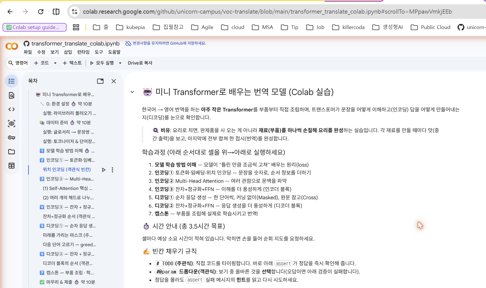
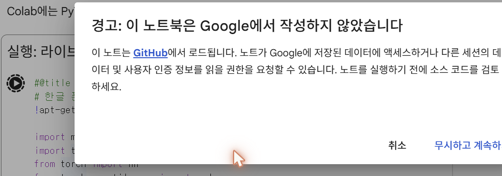
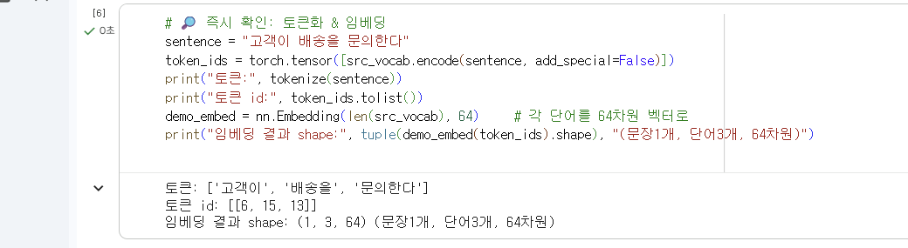
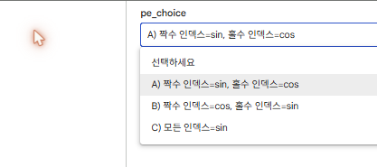
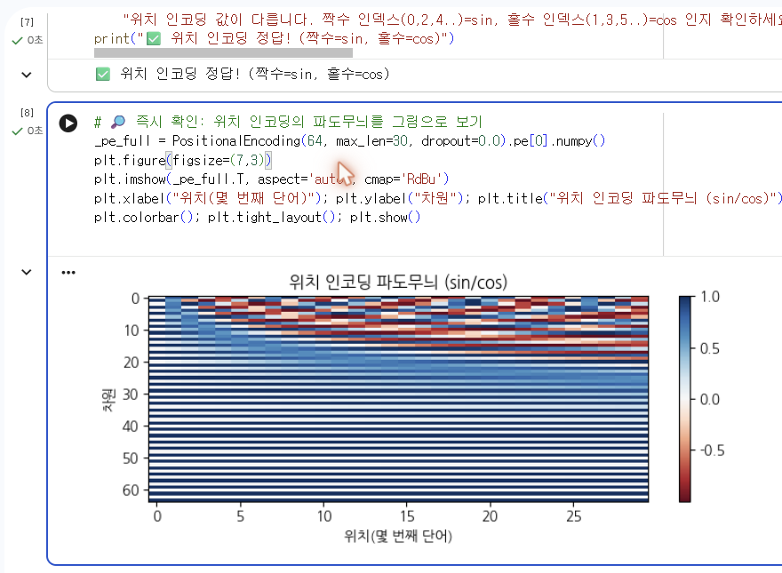

# 🚀 미니 Transformer 번역 실습 — 시작 가이드

이 문서는 **Google Colab에서 `transformer_translate_colab.ipynb` 실습을 처음 시작하는 방법**을
단계별 스크린샷과 함께 안내합니다. 예시로 **2️⃣ 인코딩① — 토큰화·임베딩·위치 인코딩** 구간을
직접 수행하는 모습까지 따라가 봅니다.

> 💡 준비물: **구글 계정** 하나면 됩니다. 별도 설치·GPU 필요 없습니다(기본 CPU 런타임으로 충분).

> 🧑‍🏫 **강사님께**: 이 문서는 정답이 보이는 *full 버전*입니다. 학생에게 배포하기 전에
> 아래 🔑 로 표시된 **정답 블록**과, 정답이 드러난 **스크린샷 `04`·`05`** 를 가려 주세요.
> (그 외 `01`·`02`·`03` 스크린샷과 본문은 정답과 무관하므로 그대로 사용해도 됩니다.)

---

## 1. Colab에서 노트북 열기

브라우저에서 아래 주소로 접속하면 GitHub의 노트북이 곧바로 Colab에서 열립니다.

```
https://colab.research.google.com/github/unicorn-campus/voc-translate/blob/main/transformer_translate_colab.ipynb
```

(또는 저장소 README의 **“Open in Colab”** 배지를 클릭해도 됩니다.)



화면 구성만 먼저 익혀 두세요.

- **왼쪽 목차(TOC)**: 학습과정 1~7 + 마무리로 이동하는 이정표입니다.
- **가운데 셀(cell)**: 설명(텍스트 셀)과 코드(코드 셀)가 번갈아 나옵니다.
- **위→아래 순서로 실행**하는 것이 원칙입니다. 각 셀 왼쪽의 **▷(실행)** 버튼 또는 `Shift`+`Enter`로 실행합니다.

이 노트북에는 **빈칸(❓)** 이 섞여 있습니다.

| 빈칸 종류 | 하는 일 | 확인 방법 |
|---|---|---|
| `# TODO` **(주관식)** | 코드 한 줄을 직접 타이핑 | 바로 아래 `assert`가 정답을 즉시 검사 |
| `#@param` **드롭다운(객관식)** | 보기 중 올바른 것을 **선택** | 선택 후 실행하면 `assert`가 검사 |

> 정답을 몰라도 괜찮습니다. 틀리면 `assert`가 **친절한 힌트**를 띄워 주니, 읽고 다시 시도하세요.

---

## 2. 런타임 연결하기

오른쪽 위 **[연결]** 버튼을 클릭합니다. 몇 초 뒤 **RAM·디스크 사용량 막대**가 나타나고
초록색 체크(✓)가 뜨면 연결 완료입니다. (화면 아래에는 `Python 3` 표시가 나타납니다.)

> ⚠️ 실습 중 런타임이 끊겨도 걱정 마세요. 상단 메뉴 **[런타임] → [모두 실행]** 으로
> 처음부터 다시 돌리면 됩니다. 이 노트북은 학습이 수 초면 끝나므로 부담이 없습니다.

---

## 3. 첫 셀 실행 — “Google에서 작성하지 않았습니다” 경고

처음으로 아무 코드 셀이나 실행하면(예: `0. 환경 설정`의 *라이브러리 불러오기* 셀),
GitHub에서 불러온 노트북이라 아래 경고창이 한 번 뜹니다.



내용을 확인한 뒤 **[무시하고 계속하기]** 를 누르면 됩니다. (이후 세션에서는 다시 묻지 않습니다.)

이어서 순서대로 아래 “준비 셀”을 실행해 두세요. 각각 초록 체크(✓)와 실행 시간이 표시되면 성공입니다.

1. `0. 환경 설정` → **라이브러리 불러오기 & 한글 폰트 설정** 셀
2. `데이터 준비` → **글로서리 → 문장쌍 자동 생성** 셀
3. `데이터 준비` → **토크나이저 & 단어장(Vocab)** 셀

> 🧭 팁: 특정 셀을 클릭한 뒤 **[런타임] → [이전 셀 실행]** 을 누르면, 그 위의 준비 셀들을 한 번에 실행할 수 있습니다.

---

## 4. 예시로 따라 하기 — 토큰화·임베딩·위치 인코딩

이제 **2️⃣ 인코딩① — 토큰화·임베딩·위치 인코딩** 구간을 직접 수행해 봅니다.
컴퓨터가 문장을 다루려면 먼저 **숫자로 바꿔야** 하는데, 그 첫 세 단계입니다.

- **토큰화**: 문장을 단어 조각으로 자르기 — `"고객이 배송을 문의한다"` → `["고객이","배송을","문의한다"]`
- **임베딩**: 각 단어를 의미 좌표(숫자 벡터)로 바꾸기 — 비슷한 단어는 가까운 좌표
- **위치 인코딩**: 순서 정보를 **sin/cos 파도무늬**로 더해 주기 (어텐션은 단어 순서를 모르기 때문)

### 4-1. 토큰화 & 임베딩 — “즉시 확인” 셀 실행

`🔎 즉시 확인: 토큰화 & 임베딩` 셀을 실행하면(클릭 후 `Shift`+`Enter`), 아래처럼 결과가 바로 나옵니다.



출력을 이렇게 읽으면 됩니다.

- `토큰: ['고객이', '배송을', '문의한다']` → 문장이 **단어 3조각**으로 잘렸습니다.
- `토큰 id: [[6, 15, 13]]` → 각 단어가 단어장(Vocab)의 **번호**로 바뀌었습니다.
- `임베딩 결과 shape: (1, 3, 64)` → **(문장 1개, 단어 3개, 64차원 벡터)**. 단어 하나가 64개 숫자로 표현됩니다.

이렇게 “즉시 확인” 셀들은 **빈칸이 없으니** 바로 실행해 결과만 눈으로 확인하면 됩니다.
성공한 셀은 왼쪽에 `[번호]`와 초록 체크(✓)가 붙습니다.

### 4-2. 위치 인코딩 — 객관식 빈칸 채우기

다음은 **객관식 빈칸**입니다. `위치 인코딩 (객관식 빈칸)` 셀의 오른쪽 **드롭다운(pe_choice)** 을 눌러
보기(A/B/C) 중 하나를 고르는 방식입니다.



수행 방법:

1. 드롭다운을 클릭해 목록을 펼칩니다.
2. **A/B/C 중 하나를 선택**합니다. (선택하면 위 코드의 `pe_choice = "..."` 값이 자동으로 바뀝니다.)
3. 셀을 실행합니다. 아래 `assert`가 선택한 공식으로 만든 파도무늬가 올바른지 **즉시 검사**합니다.
4. 틀리면 실패 메시지의 **힌트**를 읽고, 드롭다운을 다시 골라 재실행하세요.

> 🔑 **정답 (강사용 — 배포 전 삭제)**: `A) 짝수 인덱스=sin, 홀수 인덱스=cos`
> — 원조 Transformer는 짝수 차원엔 **sin**, 홀수 차원엔 **cos** 파도를 넣습니다.

### 4-3. 결과 확인 — 성공 메시지와 파도무늬

올바른 보기를 선택하고 실행하면 **성공 메시지**가 뜨고, 바로 아래 “즉시 확인” 셀을 실행하면
위치 인코딩의 **파도무늬(sin/cos)** 그림이 그려집니다.



- 위: `✅ 위치 인코딩 정답!` 메시지가 뜨면 이 빈칸을 통과한 것입니다.
- 아래: 가로축은 **위치(몇 번째 단어)**, 세로축은 **차원**입니다. 위쪽 차원은 빠르게, 아래쪽 차원은
  천천히 물결치는 무늬가 보이죠? 이 서로 다른 파장의 조합이 **“이 단어가 몇 번째인지”** 를 심어 줍니다.

> 🔑 위 스크린샷(`05`)에는 정답 메시지(`짝수=sin, 홀수=cos`)가 보입니다. 학생 배포 전 이 이미지를 가려 주세요.

여기까지 마쳤다면 **토큰화·임베딩·위치 인코딩**을 직접 수행한 것입니다. 같은 방식으로
3️⃣ Multi-Head Attention → … → 7️⃣ 캡스톤까지 위에서 아래로 이어서 진행하면 됩니다. 🎉

---

## 5. 막히면 이렇게

- **주관식(`# TODO`)에서 에러가 나면**: 바로 아래 `assert` 실패 메시지의 힌트를 먼저 읽어 보세요.
- **객관식에서 계속 실패하면**: 드롭다운을 다른 보기로 바꾸고 셀을 다시 실행하세요.
- **런타임이 끊기거나 변수 오류(`NameError`)가 나면**: **[런타임] → [모두 실행]** 으로 처음부터 다시 실행하면 대부분 해결됩니다(위→아래 순서 지키기).
- **한글이 네모(□)로 깨져 보이면**: `0. 환경 설정`의 폰트 설치 셀을 실행했는지 확인하세요.
