# 머신러닝: 지도훈련

유투브 강의 영상 
https://www.youtube.com/playlist?list=PLVsNizTWUw7E2RxZ4aspcR9vNamXccmFE

코드예제.   
https://github.com/rickiepark/hg-mldl

# 목차 
- [머신러닝: 지도훈련](#머신러닝-지도훈련)
- [목차](#목차)
  - [KNN(K-Nearlest Neightbors) Classifier](#knnk-nearlest-neightbors-classifier)
  - [훈련 셋트와 테스트 셋트](#훈련-셋트와-테스트-셋트)
  - [데이터 전처리](#데이터-전처리)
  - [KNN(K-Nearlest Neightbors) Regressor: K 최근접 이웃 회귀 알고리즘](#knnk-nearlest-neightbors-regressor-k-최근접-이웃-회귀-알고리즘)
  - [선형회귀(Linear Regression): LenearRegression](#선형회귀linear-regression-lenearregression)
  - [특성공학(Feature Engineering)과 규제(Ridge and Lasso)](#특성공학feature-engineering과-규제ridge-and-lasso)
  - [로지스틱 회귀(Logistic Regression): LogisticRegression](#로지스틱-회귀logistic-regression-logisticregression)
    - [선형회귀와 로지스틱 회귀의 계산방식 차이](#선형회귀와-로지스틱-회귀의-계산방식-차이)
    - [로지스틱 회귀의 개념](#로지스틱-회귀의-개념)
    - [로지스틱 회귀 필요성](#로지스틱-회귀-필요성)
    - [이항분류/다항분류](#이항분류다항분류)
  - [확률적 경사 하강법(SGD: Stochastic Gradient Descent)](#확률적-경사-하강법sgd-stochastic-gradient-descent)
    - [개념](#개념)
    - [장단점](#장단점)
    - [손실함수/비용함수](#손실함수비용함수)
    - [크로스 엔트로피(Cross Entropy)](#크로스-엔트로피cross-entropy)
    - [SGD Classifier 예제](#sgd-classifier-예제)
  - [결정 트리(Decision Tree)](#결정-트리decision-tree)
    - [개념](#개념-1)
    - [불순도(Gini Impurity)](#불순도gini-impurity)
    - [예시: 특성인 Sugar값에 따라 Decision Tree 작성](#예시-특성인-sugar값에-따라-decision-tree-작성)
    - [정보획득(Informaion Gain)](#정보획득informaion-gain)
    - [Decesion Tree는 데이터 전처리 불필요](#decesion-tree는-데이터-전처리-불필요)
  - [교차검증과 그리드 서치](#교차검증과-그리드-서치)
    - [검증셋트 필요성](#검증셋트-필요성)
    - [교차검증(Cross validation): cross\_validate()](#교차검증cross-validation-cross_validate)
    - [폴드 분할기](#폴드-분할기)
    - [그리드 서치(Grid Search): GridSearchCV](#그리드-서치grid-search-gridsearchcv)
    - [랜덤서치: RandomizedSearchCV](#랜덤서치-randomizedsearchcv)
  - [트리의 앙상블](#트리의-앙상블)
    - [앙상블 개념](#앙상블-개념)
    - [랜덤포레스트: RandomForestClassifier](#랜덤포레스트-randomforestclassifier)
    - [엑스트라 트리: ExtraTreesClassifier](#엑스트라-트리-extratreesclassifier)
    - [그레이디언트 부스팅: GradientBoostingClassifier](#그레이디언트-부스팅-gradientboostingclassifier)
    - [히스토그램 기반 그레이디언트 부스팅: HistGradientBootingClassifier](#히스토그램-기반-그레이디언트-부스팅-histgradientbootingclassifier)
    - [XGB(XGBoost) and LGBM(LightGBM): XGBClassifier and LGBMClassifier](#xgbxgboost-and-lgbmlightgbm-xgbclassifier-and-lgbmclassifier)

---


## KNN(K-Nearlest Neightbors) Classifier

- 머신러닝은 규칙을 데이터를 기반으로 기계가 찾게하는 것
- 용어
  - class: 다른 특성을 가지는 객체들을 추상화한 것
  - classification: class를 분류하는 작업
  - Scatter Plot(산점도) 
    - class의 특성을 그래프 상에 점으로 표시한 그림 
    - matplotlib.pyplot 사용 
    - 예시 
      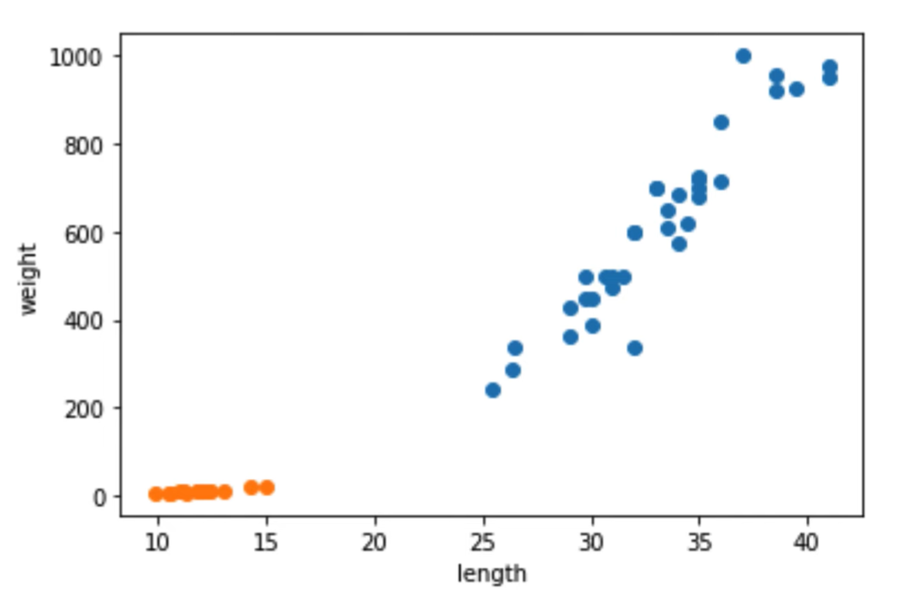
  
- 사이킷런(Scikit-learn) 
  - 파이썬 기반의 대표적인 오픈소스 머신러닝 라이브러리 
  - 데이터 전처리, 모델 훈련, 평가, 하이퍼파라미터 튜닝 등 머신러닝의 거의 모든 단계에서 활용
     
- KNN(K-Nearlest Neightbors) Classifier: k-최근접 이웃 분류 알고리즘 
  - 특정 데이터와 인접한 k개(보통 5개)의 데이터를 바탕으로 그 객체의 클래스를 분류하는 알고리즘 
  - 모델 선택 -> 훈련(fit) -> 평가(score)
    
  - 훈련한 결과를 바탕으로 예측(predict)
    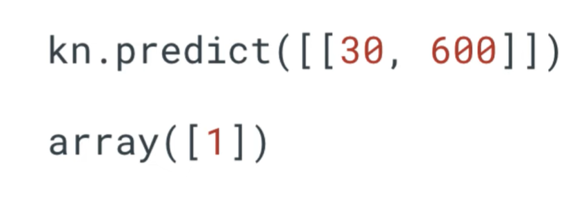 

  - 주변 샘플 갯수를 늘리면 알고리즘의 정확도가 달라짐. 총 갯수인 49개로 늘리면 도미 분류 정확도는 0.71이 됨  
    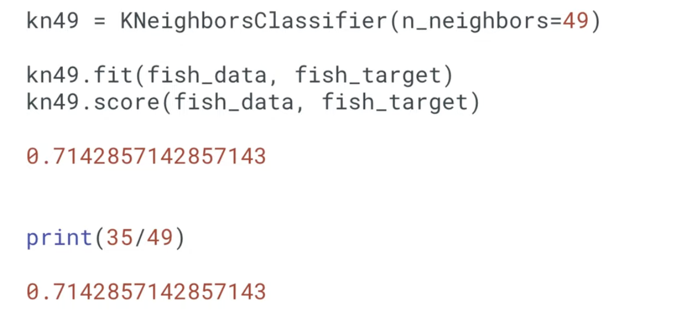
  
| [Top](#목차) |

---

## 훈련 셋트와 테스트 셋트
- 지도훈련, 비지도훈련, 강화훈련 
  - 정답을 제공하면 지도훈련, 제공하지 않으면 비지도훈련
  - 환경에 적응하며 보상을 최대화하는 방식이 강화훈련  

- 훈련셋트는 훈련을 위한 데이터 셋트이고 테스트 셋트는 훈련 결과를 검증하기 위한 데이터 셋트
- 훈련셋트와 테스트 셋트에 객체 데이터를 섞어야 함 
  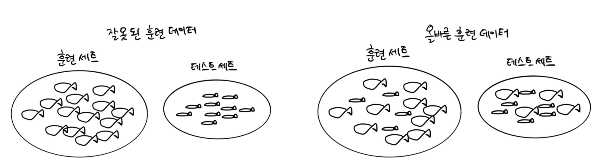
- numpy(넘파이) 라이브러리를 사용하여 섞음 
  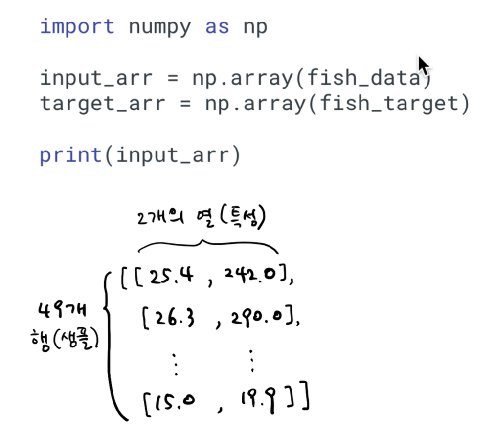

- 섞는 방법은 훈련+테스트 셋트의 인덱스를 랜덤하게 섞음
  

- train test split라이브러리로 데이터 나누기   
  random_state값은 항상 동일하게 섞이도록 하는 조정함수로 실제 현실에서는 사용하지 않음. 값은 아무값이나 넣으면 되나 보통 42를 사용('은하수를 건너는 히치하이커를 위한 안내서' 영화에서 만물의 비밀을 푸는 숫자에서 유래)  
  stratify는 target(정답)값을 기준으로 데이터를 섞도록 함 
  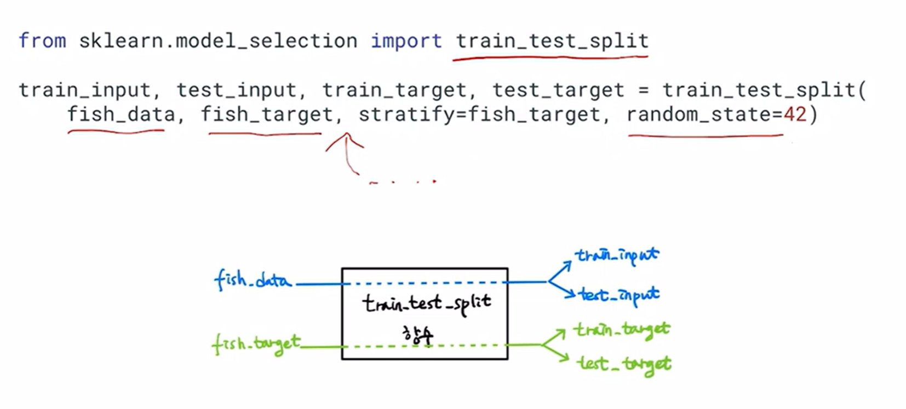 

| [Top](#목차) |

---

## 데이터 전처리

- 문제: 길이 25, 무게 150인 고기는 도미(우 상단 파란 동그라미/마름모 클래스)인데 빙어(좌하단 동그라미/마름모 클래스)로 판단      
  KNN Classification 알고리즘이 판단한 가장 가까운 객체(마름모)중 1개만 도미이고 4개가 빙어이기 때문.  
  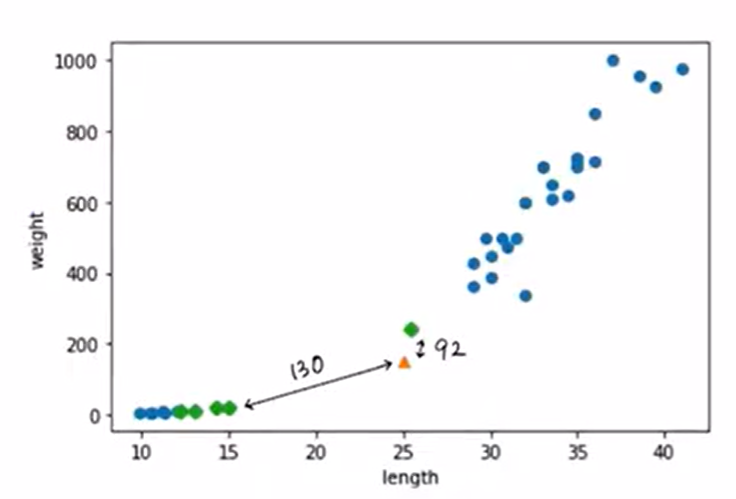 

  실제 거리가 빙어쪽 객체들이 더 가깝기 때문임. x축과 y축 스케일을 1000으로 같게 해보면 알 수 있음. 
  

- 표준점수 환산
  - 거리에 민감한 알고리즘은 반드시 표준점수화 해야 함 
  - (훈련 데이터 - 훈련 데이터 평균) / 훈련 데이터 표준편차 
    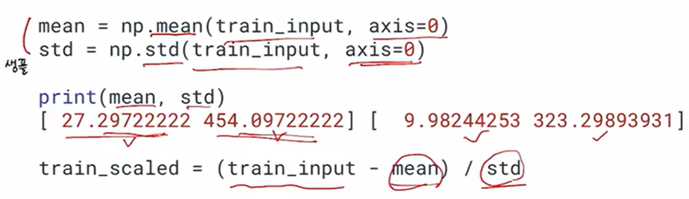

    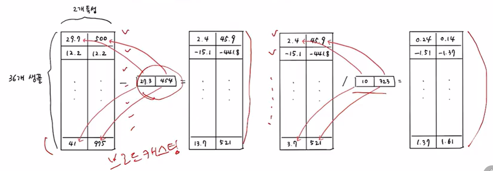  
  - 새 훈련 또는 테스트 데이터도 반드시 훈련 데이터 평균과 표준편차로 표준점수화 해야 함 
    그렇게 하면 가장 가까운 데이터가 도미가 되기 때문에 정확한 결과가 나옴 
    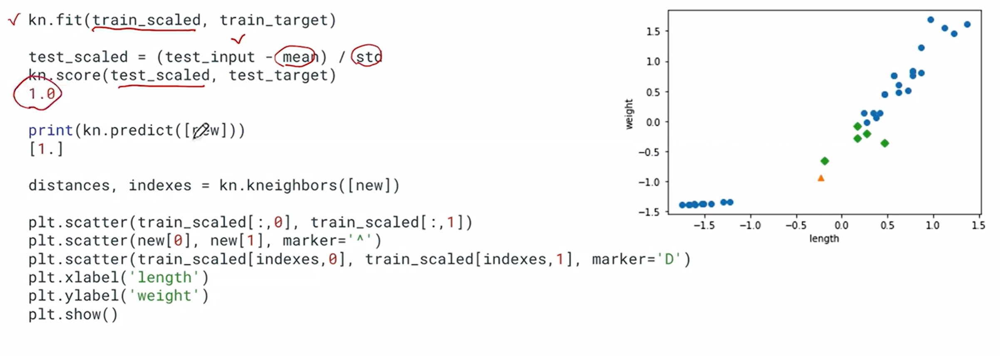 

| [Top](#목차) |

---

## KNN(K-Nearlest Neightbors) Regressor: K 최근접 이웃 회귀 알고리즘 
- 회귀의 본래 뜻은 '원래 값이나 평균으로 돌아간다'라는 의미이나, 머신러닝에서는 '데이터 간 관계를 모델링해 **연속적인 값을 예측**하는 과정'으로 이해해야 함 
- K-최근접 이웃 회귀 개념  
  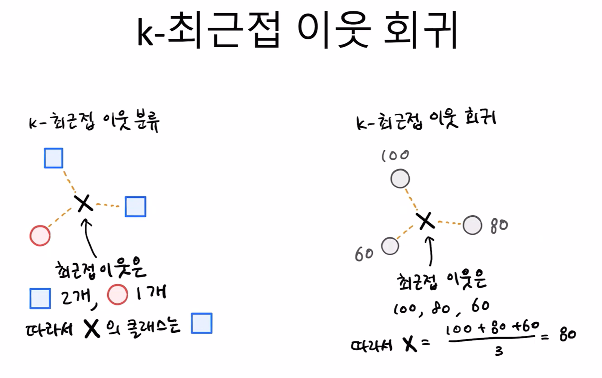
- 예제: 도미의 길이와 무게를 훈련하여 무게 예측 
  - 훈련, 테스트 데이터 만들기 
    scikit-learn의 모델들은 2차원 배열을 입력으로 요구하므로 일차원 배열을 이차원 배열로 만듬.   
    ```
    reshape(-1, 1)의 의미:
    - `-1`: 자동으로 행의 개수를 계산
    - `1`: 열의 개수를 1개로 고정
    - 1차원 배열 `[1, 2, 3]`을 2차원 배열 `[[1], [2], [3]]`으로 변환
    ```
    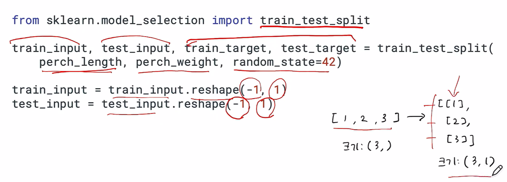

   - 훈련, 평가: R2로 예측값이 실제값과 얼마나 유사한지 스코어링 
     
   
     테스트 데이터로 평가한 오차 구하기: 약 19g 오차를 의미  
     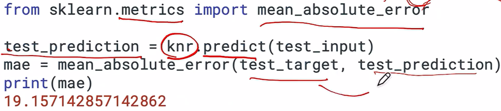 

- 과대적합(Overfitting)과 과소적합(Underfitting)
  - 훈련데이터 셋트의 스코어가 테스트 셋트의 스코어보다 작으면 과소적합. 그 반대면 과대적합
  - 비유: 
    - 과대적합: 과거 시험의 정답만 달달 외웠을때 과거 시험지로 보면 점수가 높지만 실제 테스트에서는 점수가 낮게 나오는 것임 
    - 과소적합: 과거 시험조차 대충 공부해서 오히려 테스트 점수가 더 높게 나오는 것임   
  - 과대/과소 적합의 해결책
    - 훈련데이터의 양과 질을 조정하는게 제일 좋으나 노력이 많이 들어감
    - 훈련데이터 조정 대신에 이웃 갯수를 줄이면 더 빨리 양질의 결과를 얻을 수 있음 
    - 이웃 갯수를 줄이면 과대적합이 되고 줄이면 과소적합이 됨. 적절한 숫자(보통 5~10)로 조정하여 훈련과 테스트 셋트의 스코어를 비슷하게 맞춰야 함
    - 비유: 1명에게만 식당 추천을 받으면 그 사람의 과거 훈련에만 의존하는 과대적합이 됨. 
      반면 취향이 다른 사람을 포함하여 30명의 의견을 들으면 관련 없는 식당을 선택하게 되는 과소적합이 됨.      
    
    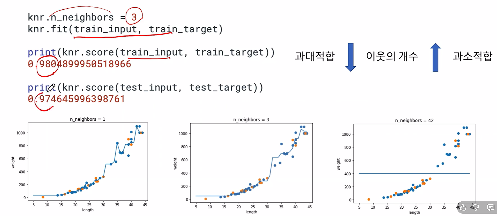

| [Top](#목차) |

---

## 선형회귀(Linear Regression): LenearRegression 
**1.배경**: 훈련데이터를 기반으로 훈련데이터를 조정하지 않고 모델을 훈련해야 함    
**2.목적**: 훈련데이터 범위 밖의 값을 예측       
**3.방법**:   
- 선형회귀 사용: 각 입력 데이터에 가중치를 곱한 결과를 더하고 조정값인 바이어스를 더하여 결과 산출              
- 계산식: y = w₁x₁ + w₂x₂ + ... + b
  
**4.예제:**   
아래 예제에서는 y = ax + b로 feature가 1개일때의 예제임.   
여기서 절편(b)는 Bias라는 말로 더 많이 사용됨.    
Bias는 편향이 아니라 결과를 조정하는 기준값이라는 의미임     
(트랜지스터의 기준 동작점을 설정하는 전압인 Bias Voltage에서 유래)
   
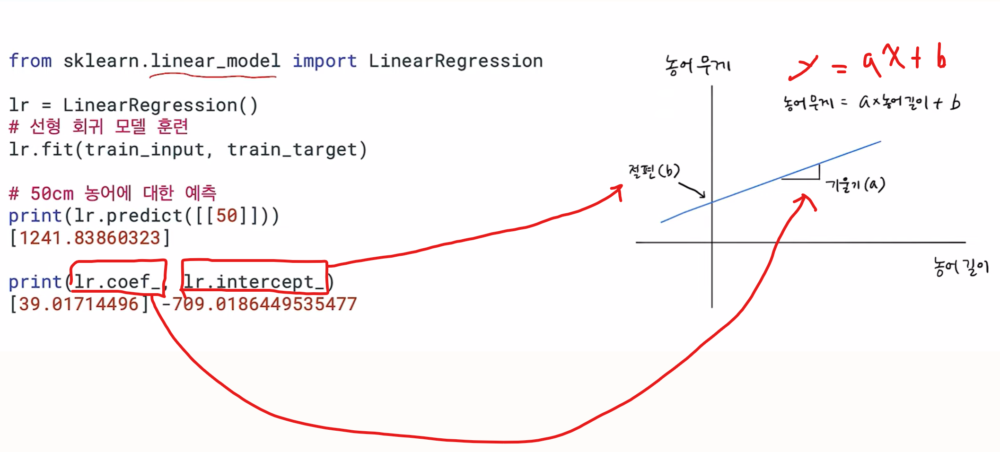

다항 회귀를 사용하여 예측 정확도를 높일 수 있음.    


| [Top](#목차) |

---

## 특성공학(Feature Engineering)과 규제(Ridge and Lasso)
- **특성공학**: **복수개의 특성(Features)**을 이용한 회귀 기법
- 판다스(Pandas) 라이브러리: 고수준의 배열 라이브러리
  - 판다스 데이터프레임: 엑셀 시트와 같은 컬럼과 행으로 구성된 인-메모리(in-memory) 2D 테이블
- 예제 
  - transform: 특성을 추가 
  - shape: 행 갯수와 특성 갯수 출력
  - get_feature_names_out: 특정 리스트 출력
  
  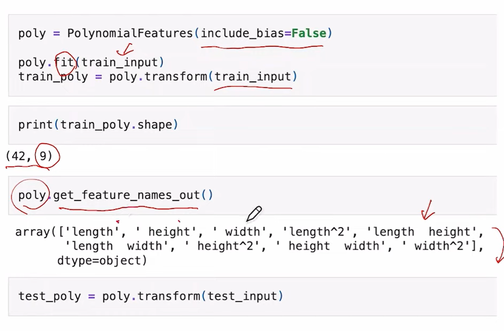

  - 훈련 및 스코어 확인  
  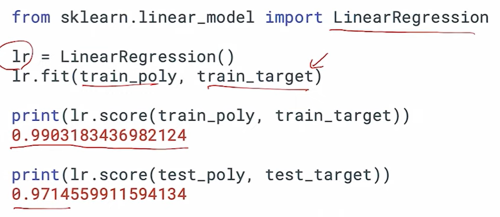

- 특성 수 증가 시키기: degree 
  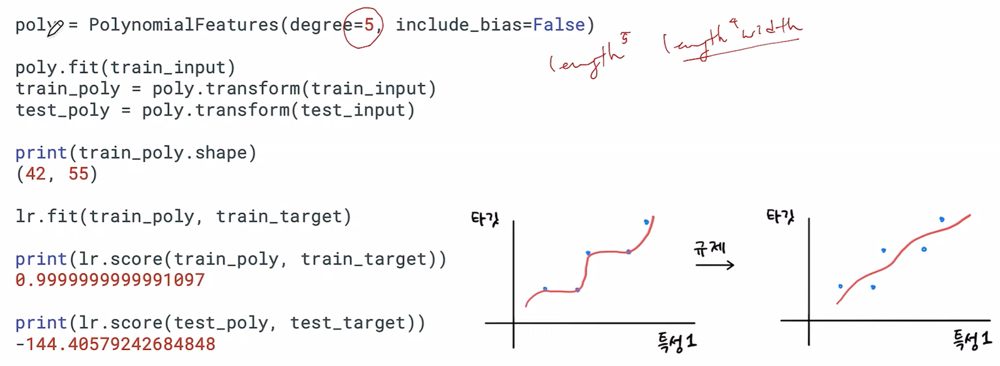
  
  테스트 셋트 스코어가 매우 나쁜 이유: 과대적합되어 훈련데이터에 지나치게 의존하므로(족보만 달달 외운 수험생이 수능에서 실패하는것과 유사)

- 규제(Regulations): 과대적합 문제를 해결하는 또 다른 해결 방법 
  - 훈련셋트를 지나치게 훈련하지 못하도록 제한하는 것
  - 선형회귀 모델의 기울기(계수)를 줄이면 됨
  - 이를 위해 StandardScaler를 사용하여 데이터를 정제함 
  - 릿지(Ridge)와 라쏘(Lasso)
    - 릿지는 계수를 제곱한 값으로 제한, 라쏘는 절대 계수값으로 제한
    - StandardScaler로 정제한 데이터에 Ridge 또는 Lasso로 계수값을 제한
    
    ```
    from sklearn.preprocessing import StandardScaler

    ss = StandardScaler()
    ss.fit(train_poly)

    train_scaled = ss.transform(train_poly)
    test_scaled = ss.transform(test_poly)
    
    
    from sklearn.linear_model import Ridge

    ridge = Ridge()
    ridge.fit(train_scaled, train_target)
    print(ridge.score(train_scaled, train_target))
    ```
    - 비유:
      ```
      ### **Ridge = 음량 조절기**
      모든 악기 볼륨을 조금씩 낮춤
      - 바이올린: 100 → 80
      - 피아노: 100 → 85
      - 드럼: 100 → 75
      (모든 악기 연주는 계속됨)
    
      ### **Lasso = 악기 선택**
      중요한 악기만 연주
      - 바이올린: 100 ✓
      - 피아노: 0 ✗ (완전히 제거)
      - 드럼: 100 ✓
      (일부 악기는 아예 안 씀)
      ``` 

| [Top](#목차) |

---

## 로지스틱 회귀(Logistic Regression): LogisticRegression
선형회귀는 연속적인 특정 값을 정확하게 예측하는 기법이라면    
로지스틱 회귀는 클래스(범주)에 속할 확률을 예측하는 기법임.    
예) '공부 시간에 따른 시험 점수 예측'은 선형회귀 사용, '공부 시간에 따른 합격/불합격 예측'은 로지스틱 회귀 사용

로지스틱 회귀는 "이름은 회귀지만 실제로는 분류"

### 선형회귀와 로지스틱 회귀의 계산방식 차이
  - 선형 회귀 
    ```
    # 수식
    y = w₁x₁ + w₂x₂ + ... + b

    # 예시
    집값 = (3만원 × 평수) + (500만원 × 방개수) + 1억원
        = 3 × 30 + 500 × 3 + 10000
        = 11,590만원
    ``` 

  - 로지스틱 회귀: Sigmoid 함수 사용(e는 자연상수로 약 2.71828) 
    ```
    # 수식
    z = w₁x₁ + w₂x₂ + ... + b
    y = 1 / (1 + e^(-z))  ← Sigmoid 함수

    # 예시
    z = (0.5 × 공부시간) - 2
      = 0.5 × 6 - 2 = 1

    y = 1 / (1 + e^(-1))
      = 1 / (1 + 0.368)
      = 0.73 (73% 합격 확률)
    ```

  - 참고
    - Sigmoid는 'S처럼 생긴'이라는 뜻으로 z의 값에 따른 결과값 y의 그래프가 S모양으로 그려지기 때문에 붙여짐. 로지스틱 함수라고도 함. 
    - Logistic은 S자 곡선 모양의 성장 패턴을 의미하며 '합리적, 계산적'이라는 그리스어에서 유래 
    - Logistic 함수는 인구 성장 패턴, 경제 성장 패턴, 한계 효용의 법칙 등 성장 패턴을 합리적으로 설명하는데 사용할 수 있음. 
    - 자연상수 'e'
      - 베르누이(통계학과 미적분학의 선구자)의 복리이자 계산에서 산출됨: 무한대로 복리 이자를 주면 원금 1원은 얼마가 될까 ? -> 약 2.71828원이 됨 
      - 오일러(천재 수학자)가 산출 공식을 수학적으로 단순화 하고 상수 'e'라고 명명
        -> 'e = 1/0! + 1/1! + 1/2! + 1/3! + 1/4! + ...'
         
      - 생물 성장, 방사능 붕괴, 소리 감쇠 등 자연현상을 계산할 때 'e'값이 완벽하게 적용되므로 자연상수라고 함. 

### 로지스틱 회귀의 개념
  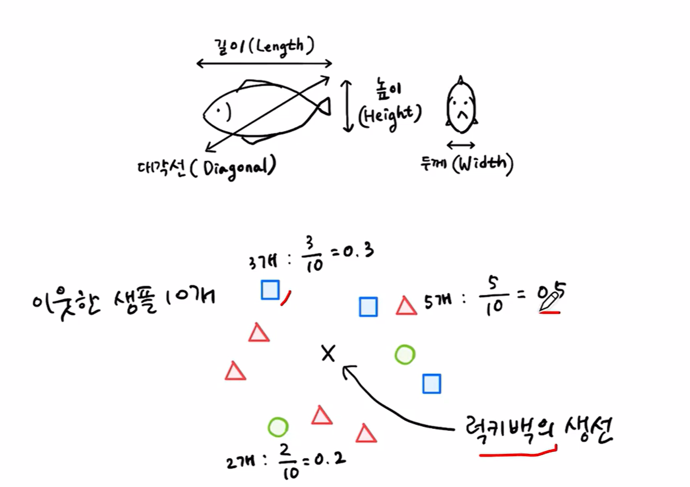 

### 로지스틱 회귀 필요성
  - KNN Classifier를 이용한 확률 계산의 한계 
    - KNN Classifier는 근접한 데이터를 바탕으로 확률을 추정
    - KNN Classifier의 predict_proba 함수 사용
      ```
      from sklearn.neighbors import KNeighborsClassifier

      kn = KNeighborsClassifier(n_neighbors=3)
      kn.fit(train_scaled, train_target)

      ... 

      import numpy as np

      proba = kn.predict_proba(test_scaled[:5])
      print(np.round(proba, decimals=4))
      ```   
    - 이웃의 수에 따라 확률이 나올 경우의 수가 결정: 3개인 경우 4개(0/3, 1/3, 2/3, 3/3)
    - 결론적으로 KNN Classifier로는 정확한 확률 예측 한계 
     
  - 로지스틱 회귀로 개선
    - 계산식
      ```
      1단계: 선형 결합 (Linear Combination)
      z = β₀ + β₁x₁ + β₂x₂ + ... + βₙxₙ

      2단계: Sigmoid 변환
      σ(z) = 1 / (1 + e^(-z))
      ``` 
      'σ'는 small 시그마라고 부름. 표준편차나 시그모이드 함수를 나타냄.   
      참고로 'Σ'는 capital 시그마로 부르고 합을 나타냄.    

    - 예시
      - 'C': 
        - 규제(Contraints)의 수준을 정의한 하이퍼 파라미터
        - 규제란 훈련데이터를 얼마나 충실하게 훈련할지를 의미함. 값이 높으면 훈련데이터를 많이 훈련하게됨
        - 기본값은 '1.0'이고 복잡한 모델일 수록 값을 높임. 높아 질수록 과적합 위험은 커짐.  
      
      ```
      from sklearn.linear_model import LogisticRegression

      lr = LogisticRegression(C=20, max_iter=1000)
      lr.fit(train_scaled, train_target)

      proba = lr.predict_proba(test_scaled[:5])
      print(np.round(proba, decimals=3))
      ``` 

      ```
      [[0.    0.014 0.842 0.    0.135 0.007 0.003]
      [0.    0.003 0.044 0.    0.007 0.946 0.   ]
      [0.    0.    0.034 0.934 0.015 0.016 0.   ]
      [0.011 0.034 0.305 0.006 0.567 0.    0.076]
      [0.    0.    0.904 0.002 0.089 0.002 0.001]]
      ```

      ```
      print(lr.classes_)
      ['Bream' 'Parkki' 'Perch' 'Pike' 'Roach' 'Smelt' 'Whitefish']
      ```

    - 위 로지스틱 회귀 함수의 내부적 처리
      결정함수값 z 구하기  
      ```
      decision = lr.decision_function(test_scaled[:5])
      print(np.round(decision, decimals=2))
      ```     

      Sigmoid함수로 결과값 구하기   
      softmax는 총합이 1이 되도록 만드는 역할.  
      ```
      from scipy.special import softmax

      proba = softmax(decision, axis=1)
      print(np.round(proba, decimals=3))
      ```

### 이항분류/다항분류
찾아야 할 클래스의 숫자에 따라 2개인 경우와 2개 이상인 경우를 의미.   
로지스틱 회귀는 이항분류와 다항분류를 모두 계산할 수 있음.    
다항분류 예제는 위에 있고 아래는 이진분류 예제임.   
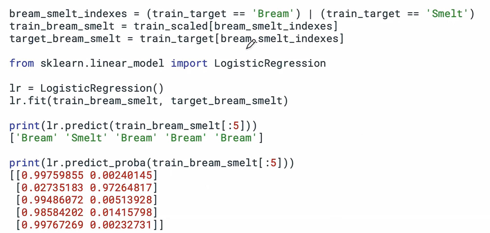

확률이 0/5 초과면 양성 클래스, 미만이면 음성 클래스라고 함 

| [Top](#목차) |

---

## 확률적 경사 하강법(SGD: Stochastic Gradient Descent)

### 개념
**랜덤 샘플로 빠르게 배우는 AI 훈련법**

```
'안개 낀 산에서 내려오기'

- 산 정상에서 아래로 내려가고 싶은데 시야가 흐림
- 전체 길을 다 볼 수 없으니 발 주변만 보고 가장 낮은 방향으로 한 걸음씩
- 때로는 조금 돌아가기도 하지만 계속 내려가다 보면 골짜기에 도착"
```

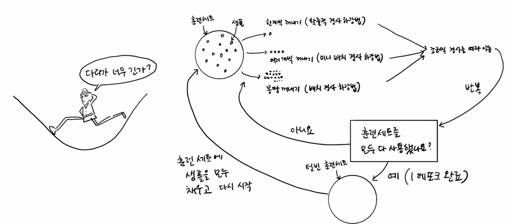

- 에포크(epoch): 전체 훈련 데이터셋을 한 번 완전히 훈련하는 주기를 의미하며, 
  그리스어의 '중단, 특정시점'이라는 말에서 유래함

### 장단점
- 장점
  - 빠른 훈련 속도
  - 적은 메모리 사용
  - 온라인 훈련 가능

- 단점
  - 경로가 불안정 (지그재그)
  - 정확한 최적점 도달 어려움
  - 하이퍼파라미터 조정 필요

### 손실함수/비용함수
- 손실함수(Loss Function)는 샘플 하나에 대한 손실이고 비용함수(Cost Function)는 모든 샘플에 대한 손실의 합임 
- L(θ) = 예측값과 실제값의 차이를 수치화한 함수
- 손실함수는 AI의 "성적표"이자 "내비게이션": 실제값과의 차이를 측정하는 지표 
- 손실함수는 '정답이 있는 경우' 사용
- 부적합한 분야: 주관적, 규칙적, 통계적 평가

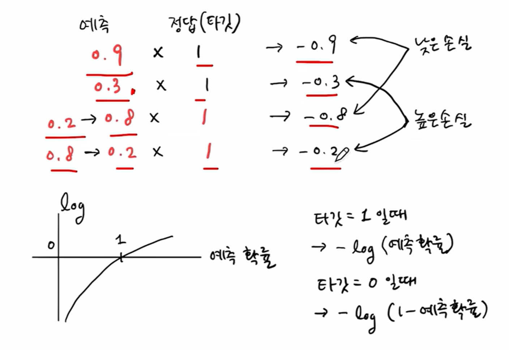

참고) log는 "밑을 몇 번 곱해야 원하는 수가 되는가?"를 나타내는 수학 도구

### 크로스 엔트로피(Cross Entropy) 
분류에서 사용되는 손실함수의 한 종류 
```
MSE (회귀):        Cross-Entropy (분류):
실제: 5.0          실제: 고양이(1, 0, 0)
예측: 4.8          예측: (0.7, 0.2, 0.1)
오차: 0.04         오차: 0.357

연속적 값          확률 분포
```

- 분류는 크로스엔트로피, 회귀는 MSE 또는 MAE사용
  

- MSE(Mean Squad Error)와 MAE(Mean Absolute Error)
  

### SGD Classifier 예제
- max_iter: Epoch(에포크) 횟수 
- log: 손실함수 종류
- partial_fit: 추가 훈련 메소드 
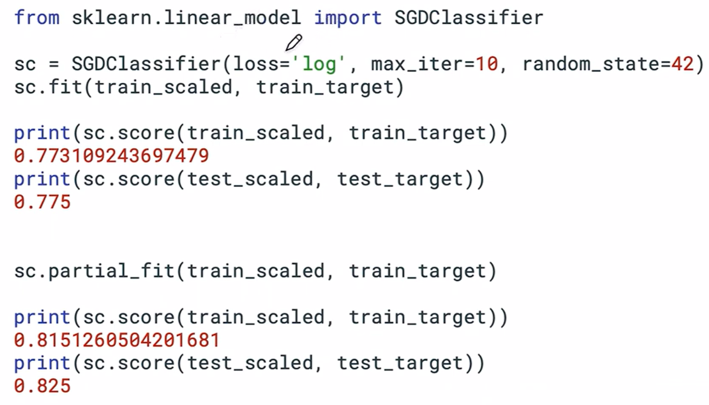

- SGD의 규제 수단은 에포크  
  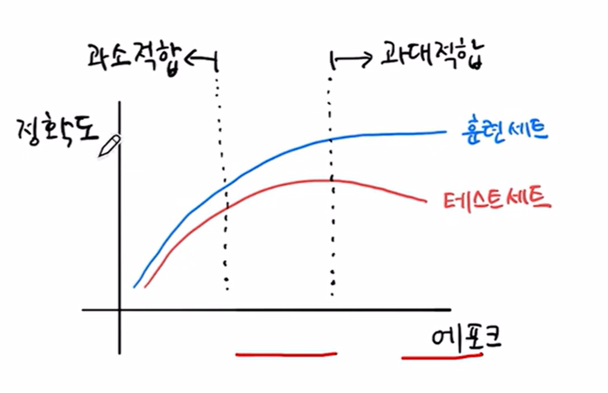

- 스코어가 높으면서 가장 최소의 에포크는 100번 정도  
  

- 에포크가 많아질수록 과대적합됨
  
| [Top](#목차) |

---

## 결정 트리(Decision Tree)
### 개념
- 특성과 특성의 기준값에 대한 결과값을 반복하여 예측하는 방법 
- 마치 스무고개 게임처럼 질문과 답을 반복하며 정답의 범위를 좁혀가는 원리
- 노드(Node)와 브랜치(Branch)로 구성되며 가장 상위 노드를 루트 노드라 하고 가장 하위 노드를 리프노드라고 함 
- 앙상블 모델의 핵심 모델 
- 트리 모양으로 이해하기 쉬운 모델 생성 가능 


### 불순도(Gini Impurity)
- 클래스가 섞여 있는 정도
- Gini = 1 - Σ(pᵢ)² : 1에서 각 클래스의 비율을 제곱한 총합을 뺀 값
- 가장 최적의 질문을 찾는데 사용됨 
- Decesion Tree에서는 Geni 대신에 Entropy를 사용할 수 있음 
  - Entropy = -Σ(pᵢ × log₂(pᵢ))
  - 결과가 비슷하고 더 간단한 Gini를 사용
  - SGD에서 실제값과의 차이를 측정하는 Cross Entropy와 Entropy는 전혀 다름
- 어원은 Corrado Gini 라는 이탈리아 통계학자의 이름이며 Gini는 지니계수라는 불평등 측정 지표를 만든 사람임  
  
### 예시: 특성인 Sugar값에 따라 Decision Tree 작성
- gini: 불순도
- samples: 샘플 데이터 갯수
- values: 음성클래스 갯수와 양성클래스 갯수(갯수/총갯수가 0.5 초과면 양성 클래스) 
    
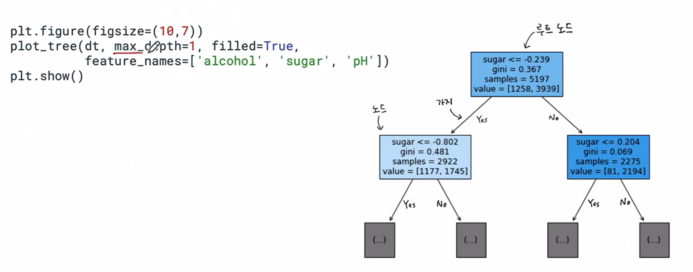

### 정보획득(Informaion Gain)
- 부모의 불순도에서 자식들의 가중 평균 불순도를 뺀 값이 정보획득값임
- Decesion Tree에서는 이 정보획득값을 최대화하는 질문을 선택하는것이 핵심  
- 정보획득값이 크다는 것은 결국 부모는 많이 섞여있고 자식들을 최소로 섞여 있다는 것임     
- 계산식
  ```
  IG = I(부모) - [N_left/N_parent × I(left) + N_right/N_parent × I(right)]

  여기서:
  - IG = Information Gain (정보 획득)
  - I(·) = Impurity (불순도: Gini 또는 Entropy)
  - N = 샘플 개수
  ``` 

### Decesion Tree는 데이터 전처리 불필요
- 선형회귀나 로지스틱회귀에서는 훈련/테스트 데이터의 Feature간 스케일이 다르면 스케일이 큰 Feature가 가장 중요한 특성이 되버림 
  - 선형회귀: y = w₁x₁ + w₂x₂ + ... + b
  - 로지스틱회귀: z = w₁x₁ + w₂x₂ + ... + b, σ(z) = 1 / (1 + e^(-z)) 
- Decesion Tree는 각 Feature간 영향도가 없으므로 전처리 불필요 

| [Top](#목차) |

---

## 교차검증과 그리드 서치

### 검증셋트 필요성
- 훈련세트와 테스트세트로 모델을 훈련시킬 때 문제 
  - 테스트 셋트의 정확도를 높이기 위해 파라미터를 계속 조정해 감
  - 결국 테스트 셋트에 최적화된 모델이 되버려 실제 현실과의 괴리가 생길 수 있음 

- 해결책
  - 검증셋트를 추가: 예) 훈련:검증:테스트 비율을 6:2:2로 함
  - 하이퍼 파라미터 튜닝을 하여 검증셋트의 정확도를 높이고 테스트 셋트는 가장 마지막에 한번만 사용함
  - 데이터 양이 10000개 이상이라면 검증과 테스트 비율을 좀 더 줄여도 됨 
  
### 교차검증(Cross validation): cross_validate()
- 훈련과 검증 데이터를 조합하여 여러개의 그룹으로 나눔. 나뉘어진 각 데이터 그룹을 폴드(fold)라고 함
  폴드 예시: 3개 폴드로 나눈 예 
  ```
  전체 데이터: [1, 2, 3, 4, 5, 6, 7, 8, 9, 10]

  ━━━━━━━━━━━━━━━━━━━━━━━━━━━━━━━━━━━━━━━━━━━━

  【Fold 1】
  ┌─────────────┬─────────────┬──────────┐
  │  훈련A(3개)  │  훈련B(4개)  │  검증(3개) │
  │  [4,5,6]    │  [7,8,9,10] │  [1,2,3]  │
  │   ████      │   █████     │    🔴     │
  └─────────────┴─────────────┴──────────┘
      30%           40%          30%


  【Fold 2】
  ┌─────────────┬─────────────┬──────────┐
  │  훈련A(3개)  │  훈련B(4개)  │  검증(3개) │
  │  [1,2,3]    │  [7,8,9,10] │  [4,5,6]  │
  │   ████      │   █████     │    🔴     │
  └─────────────┴─────────────┴──────────┘
      30%           40%          30%


  【Fold 3】
  ┌─────────────┬─────────────┬──────────┐
  │  훈련A(3개)  │  훈련B(3개)  │  검증(4개) │
  │  [1,2,3]    │  [4,5,6]    │[7,8,9,10] │
  │   ████      │   ████      │    🔴     │
  └─────────────┴─────────────┴──────────┘
      30%           30%          40%

  ━━━━━━━━━━━━━━━━━━━━━━━━━━━━━━━━━━━━━━━━━━━━
  ```
- 각 폴드별로 검증셋트로 모델을 평가   
- 폴드를 나누는 목적: 다양한 조합으로 훈련하여 평균 성능을 높임. 어떤 폴드가 최고 모델인가를 찾는것이 아님. 
- 폴드의 갯수는 일반적으로 5~10개로 함  
- 예시: 
  - cross_validate: 테스트 셋트를 제외한 훈련과 검증셋트를 폴드로 분할하여 훈련 및 교차 검증하는 함수 
  - 아래 예에서 5개 폴드로 나누었고 test_score에 각 폴드의 스코어가 나옴. 평균값은 약 0.855가 됨.  
   

### 폴드 분할기 
- 사이킷런은 분류모델인 경우 StratifiedKFold, 회귀모델인 경우 KFold 라이브러리 사용 
- 이 폴드분할기가 각 폴드에 골고루 데이터가 조합되도록 해줌 
- 예제:
  기본값이 5개 폴드로 나눔
  

  n_splits에 폴드 갯수를 넣어 지정한 수만큼의 폴드를 생성하도록 함
  
  
### 그리드 서치(Grid Search): GridSearchCV
- 머신러닝 모델의 최적 하이퍼파라미터를 찾기 위한 체계적인 탐색 방법
- 비유: 
  ```
  "최고의 레시피 찾기"
  마치 요리할 때 최적의 맛을 내기 위해 아래와 같이 각 Factor를 바꿔가며 최적의 조합을 찾는 것. 
  소금의 양: 1작은술, 2작은술, 3작은술
  설탕의 양: 반 작은술, 1작은술, 2작은술
  조리 시간: 10분, 15분, 20분
  ``` 
- 단일 파라미터 방식: 한가지 파라미터의 값만 바꿔가며 탐색 
  - min_impurity_decrease: 불순도 값이 어느 값 이하면 중단할 것인가 ? 
  - 'n_jobs: -1': 모든 Core를 사용하는 옵션 
  - 예시: 
    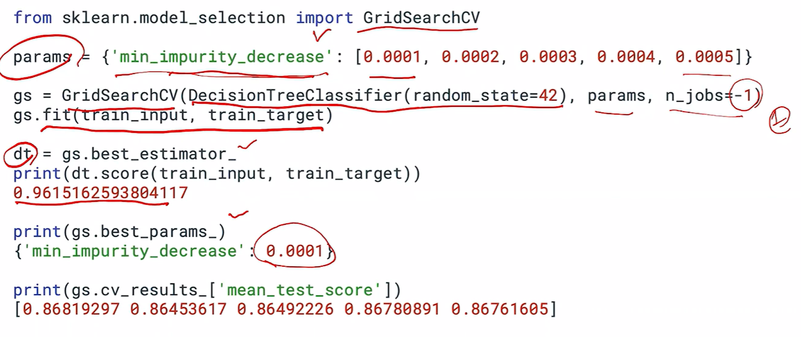   
    
    3가지 주요 결과물 확인  
    ```
    # 세 가지 주요 결과물
    dt = gs.best_estimator_        # ← 최적 모델 (바로 사용 가능)
    best_params = gs.best_params_   # ← 최적 파라미터 값들
    best_score = gs.best_score_     # ← 최고 점수
    ```

- 다중 파라미터 방식: 복수 파라미터의 값을 조합해가며 탐색 
  ```
  params = {
      'min_impurity_decrease': [0.0001, 0.0003, 0.0005],  # 3개로 줄임
      'max_depth': [5, 10, 15],                           # 3개
      'min_samples_split': [2, 5, 10],                    # 3개
      'criterion': ['gini', 'entropy']                     # 2개
  }
  # 총 3 × 3 × 3 × 2 = 54가지 조합
  ``` 

### 랜덤서치: RandomizedSearchCV
- 파라미터의 값을 랜덤하게 뽑아서 최적 하이퍼파라미터를 찾는 방법 
- randint와 uniform 사용하여 파라미터값을 랜덤하게 구함 
  - randint: 지정된 범위에서 랜덤 정수값 구할 때 사용
  - uniform: 지정된 범위에서 랜덤 소수값 구할 때 사용
  - rvs: 뽑을 난수의 갯수 
  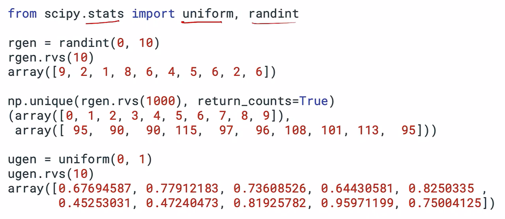
- 예제
  

| [Top](#목차) |

---

## 트리의 앙상블
### 앙상블 개념
- 여러 모델을 결합해 더 나은 성능을 얻는 알고리즘
- 정형데이터를 처리하는 가장 좋은 알고리즘
- Bagging, Boosting, Stacking의 3가지 방법이 있음
  - Bagging: 여러 모델의 결과 중 다수 결과 채택. Bootstrap AGGregatING의 약자로 자력으로 돌아가는 모델(Bootstrap)의 집단지성을 집계(Aggregating)하는 방식 
  - Boosting: 각 모델을 순차적으로 훈련시키면서 이전 모델의 잘못을 바로잡는 방식. 점진적으로 성능을 높이는(Boosting) 방식 
  - Stacking: 여러 모델의 결과를 모아서 판단 모델이 최종 결과를 내는 방식. 여러 모델이 있는 층(Stack)과 판단하는 층(Stack)으로 나누어져 있음
  
### 랜덤포레스트: RandomForestClassifier
- 랜덤포레스트는 Bagging 방식의 앙상블 알고리즘 
- 랜덤포레스트(Random forest)는 복수개의 Decesion Tree 모델을 랜덤하게 생성하여 모델숲을 만들어 성능을 최적화 
- 목적: 성능 최적화, 과적합 최소화, 중요 변수 포착 
- 방법
  - Bootstrap Sampling: 훈련 세트에서 무작위로 샘플 데이터 샘플링
  - Feature Sampling: 특성 집합에서 특성개수의 루트개 만큼 무작위로 특성 선택 
  - Voting: 각 모델의 결과에서 다수 결과를 예측으로 결정

  

- 예시)
  - 1단계: 부트스트랩 샘플링 (Bootstrap Sampling)
    ```
    원본 데이터: [1, 2, 3, 4, 5, 6, 7, 8, 9, 10]

    무작위 복원 추출

    샘플1: [1, 3, 3, 5, 7, 9, 10, 10] → 나무1 훈련
    샘플2: [2, 2, 4, 6, 7, 8, 9, 10]  → 나무2 훈련
    샘플3: [1, 2, 4, 5, 5, 7, 8, 9]   → 나무3 훈련
    ...
    샘플100까지
    ```

  - 2단계: 랜덤 특성 선택 (Random Feature Selection)
    각 특성 갯수: 루트 9이므로 3이됨 
    ```
    전체 특성: [크기, 색깔, 무게, 당도, 향, 길이, 넓이, 염분, 칼로리]
            ↓
    각 나무는 무작위로 일부만 사용

    나무1: [크기, 향, 칼로리]만 사용
    나무2: [색깔, 당도, 넓이]만 사용
    나무3: [무게, 길이, 염분]만 사용
    ```

  - 3단계: 다수결 투표 (Voting)
    ```
    새로운 과일 예측 시:

    나무1: "사과" 
    나무2: "사과"
    나무3: "배"
    나무4: "사과"
    ...
    나무100: "사과"

    최종 결과: "사과" (다수결) 
    ```
  
  - RandomForestClassifier 예제 
    - cross_validate: 사전 모델 평가(훈련하고 결과 버림)
    - fit: 실제 모델 훈련 
    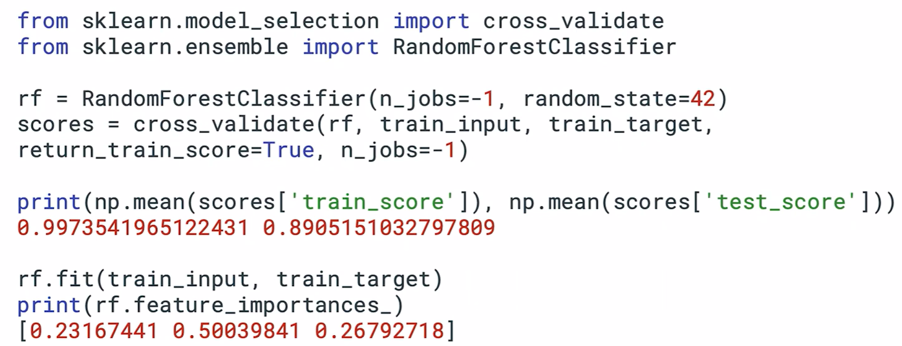 

    - OOB(Out Of Bag) 활용: 무료 검증 셋트 
      - bootstrap 샘플링 시 훈련 셋트의 67%만 사용. OOB는 샘플링하지 않은 나머지 훈련세트를 의미
      - OOB를 무료 검증 셋트로 활용하여 모델을 평가할 수 있음: oob_score=True
       
       

### 엑스트라 트리: ExtraTreesClassifier 
- Random Forest 보다 더 빠르고 과적합을 더 줄이기 위한 앙상블 알고리즘
- 방법:
  - Random sampling 않하고 각 모델이 100%의 훈련셋트로 훈련 
  - Random feature selection은 수행 
  - 각 Feature의 최적 분할점을 랜덤하게 수행 
    ```
    Random Forest - "최선의 분할점 찾기"

    키로 분류할 때:
    150cm 시도 → 정보이득: 0.3
    160cm 시도 → 정보이득: 0.5  ✓ 최고!
    170cm 시도 → 정보이득: 0.4
        ↓
    160cm 선택 (최적값 탐색)

    ---

    🎲 Extra Trees - "랜덤 분할"

    키로 분류할 때:
    난수 생성 → 163cm 나옴
        ↓
    163cm 선택 (계산 안 함, 즉시 사용)
    ```  
- 단점: 정확도는 떨어질 수 있음

### 그레이디언트 부스팅: GradientBoostingClassifier
- 각 모델을 순차적으로 훈련시키면서 이전 모델의 잘못을 바로잡는 방식. 점진적으로 성능을 높이는(Boosting) 방식 
- 정확도가 높기 때문에 **제일 많이 사용하는 알고리즘** 
- 비유) 오답 노트 만들어서 성적 올리기
- 예시)
  ```
  ### 경사하강법 원리
  손실 함수 (Loss Function)
        ↓
    실제 - 예측 = 오차
        ↓
    오차를 줄이는 방향으로 이동
        ↓
    Gradient (기울기) 계산
        ↓
    그 방향으로 한 걸음 (learning_rate)
  ```

  **수식으로 보면:**
  ```
  새로운 예측 = 이전 예측 - (훈련률 × 그레이디언트)

  예측₁ = 70
  그레이디언트₁ = -30 (오차)
  예측₂ = 70 - (0.1 × -30) = 73

  예측₂ = 73
  그레이디언트₂ = -27
  예측₃ = 73 - (0.1 × -27) = 75.7

  ...계속
  ```  
- Key
  - 순차적 훈련 (이전 실수 보완)
  - learning_rate (보폭 조절)
  - 약한 훈련기 여러 개 (max_depth 작게)
- 권장조합
  ```
  n_estimators=100
  learning_rate=0.1
  max_depth=3
  ``` 
- 코드예제:
  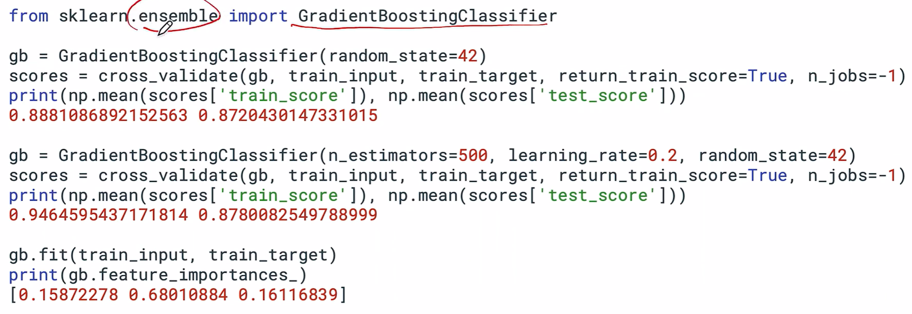

### 히스토그램 기반 그레이디언트 부스팅: HistGradientBootingClassifier
- 목적:
  - 속도 혁명: 기존 GB 대비 10~100배 빠름
  - 정확도 유지: 성능은 GB와 비슷
  - 대용량 데이터 처리: 데이터 압축으로 메모를 절약하여 대량 데이터 처리
- 방법
  - 데이터 전처리 방식: 구간화(Bining)
    ```
    GB:
    원본 데이터 그대로 사용
    [152.3, 163.7, 158.9, 171.2, ...]
        ↓
    모든 값을 float로 메모리에 저장

    ---

    Hist GB:
    히스토그램 변환 (구간화)
    [152.3, 163.7, 158.9, 171.2, ...]
        ↓
    [20, 45, 32, 78, ...] (8비트 정수)
        ↓
    메모리 75% 절약!
    ```
  - 분할점 탐색 방식
    ```
    GB:
    모든 고유값을 분할점 후보로 시도
    값 10,000개 → 10,000번 비교

    ---

    Hist GB:
    구간(bin)만 분할점 후보로 시도
    최대 255개 구간 → 255번 비교
    ``` 
  - 결측치 처리 방식
    ```
    GB:
    ❌ 결측치 있으면 에러!
    전처리 필수 (imputation)

    ---

    Hist GB:
    ✅ 결측치를 별도 구간(bin)으로 자동 처리
    전처리 불필요!
    ``` 
  - 트리 성장 방식
    ```
    GB:
    Level-wise (수평 성장)
        Root
        /    \
      A      B    ← 레벨 완성 후 다음
      / \    / \
    C   D  E   F

    ---

    Hist GB:
    Leaf-wise (최적 우선 성장)
        Root
        /    \
      A      B
      / \
    C   D        ← 손실 큰 곳 우선
    /
    E
    ``` 

- 강점
  - 히스토그램 변환 (Binning): 모든 값 → 255개 구간
  - 정수 변환 (8비트): 메모리 75% 절약
  - 결측치 자동 처리: 전처리 불필요

- 프로그램 예시
  ```
  from sklearn.ensemble import HistGradientBoostingClassifier

  hgb = HistGradientBoostingClassifier(
      max_iter=100,           # 충분한 반복
      max_bins=255,           # 최대 정밀도
      learning_rate=0.1,      # 표준 훈련률
      max_leaf_nodes=31,      # 과적합 방지
      early_stopping=True,    # 조기 종료
      validation_fraction=0.1, # 검증 세트
      random_state=42
  )

  hgb.fit(X_train, y_train)
  ``` 

- Hist GB는 'feature_importances_' 대신에 Permutation(순열) Importance를 사용
  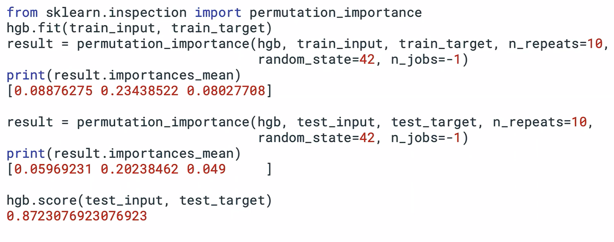 

  참고) 순열: 총 n개의 원소에서 r개를 배열하는 것 
  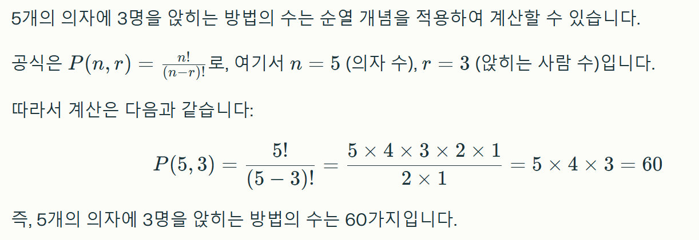
  
### XGB(XGBoost) and LGBM(LightGBM): XGBClassifier and LGBMClassifier
- XGB와 LGBM 모두 Gradiant Boosting을 발전시킨 알고리즘으로 실무에서 제일 많이 사용됨 
- 훈련데이터가 대용량(약 100만 이상)이면 LGBM, 그 이하이면 XGB가 좋음
- LGBM은 Hist GB기반으로 MS가 만들었으며 XGB보다 더 빠르고 메모리 효율적인 알고리즘
  
   
- XGB도 tree_method를 hist로 변경하여 Hist GB 기반으로 동작하게 할 수 있음
  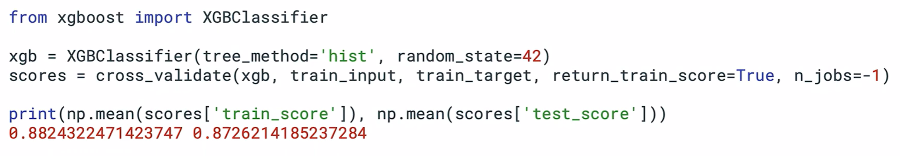 

| [Top](#목차) |

---
