# 머신러닝: 비지도 훈련

비지도훈련은 정답 없이 입력 데이터만으로 정답을 예측하는 방법

유투브 강의 영상 
https://www.youtube.com/playlist?list=PLVsNizTWUw7E2RxZ4aspcR9vNamXccmFE

코드예제.   
https://github.com/rickiepark/hg-mldl


# 목차 
- [머신러닝: 비지도 훈련](#머신러닝-비지도-훈련)
- [목차](#목차)
  - [군집(Custering) 알고리즘](#군집custering-알고리즘)
    - [차원 변경 후 평균값으로 구별해 보기](#차원-변경-후-평균값으로-구별해-보기)
    - [평균과 가장 가까운 사과 찾기](#평균과-가장-가까운-사과-찾기)
  - [K-Mean](#k-mean)
    - [K-Mean 동작 원리](#k-mean-동작-원리)
    - [KMeans 예제](#kmeans-예제)
    - [최적의 k값(클러스터 갯수) 찾기: Elbow Method](#최적의-k값클러스터-갯수-찾기-elbow-method)
  - [PCA(주성분 분석: Principle Component Analysis)](#pca주성분-분석-principle-component-analysis)
    - [차원과 벡터의 차이 이해](#차원과-벡터의-차이-이해)
    - [차원축소(Dimentionality Reduction)의 의미](#차원축소dimentionality-reduction의-의미)
    - [PCA 개념](#pca-개념)
    - [PCA 동작원리](#pca-동작원리)
    - [프로그램 예시: 사과, 파인애플, 바나나 이미지 차원 축소](#프로그램-예시-사과-파인애플-바나나-이미지-차원-축소)
    - [로지스틱 회귀와 함께 사용하기](#로지스틱-회귀와-함께-사용하기)
    - [K-Mean알고리즘과 함께 사용하기](#k-mean알고리즘과-함께-사용하기)

---

## 군집(Custering) 알고리즘

사과, 파인애플, 바나나의 밝기 데이터를 이용하여 구별하기   
정답 없이 샘플 데이터만을 이용하여 클러스터링하는 방법을 사용함.      

### 차원 변경 후 평균값으로 구별해 보기    
- ML에서는 이미지의 밝기값을 반전하여 처리: 
  - 밝기값은 0이 검정이고 255가 흰색임.
  - 원래 밝기값으로 하면 아래와 같이 배경이 높은 밝기값을 갖게 되어 처리가 어려움
       
  - 그래서 아래와 같이 색깔값을 반전하여 처리     
       

      
    
- 많은 ML 알고리즘은 처리를 간단하게 하기 위해 1차원 배열만 지원하는 것이 많음    
  3개의 정사각형이 각각 3개의 어떤 특성값(예: 가로, 세로, 색깔)을 가질 때 3번째 정사각형의 세로 길이를 구한다면,    
  2차원 배열은 3행을 찾고 3번째 값인 9를 찾아야 함.     
  1차원 배열은 9번째 값을 바로 찾을 수 있음.      
  ```
  # 변환 전: 3×3 정사각형
  [[1, 2, 3],
  [4, 5, 6],
  [7, 8, 9]]

  # 변환 후: 1×9 한 줄
  [1, 2, 3, 4, 5, 6, 7, 8, 9]
  ``` 
  
  차원 변경 예시:    
  100개의 사과, 100개의 파인애플, 100개의 바나나 데이터의 가로 100개, 세로 100개의 색깔값을 10000개의 일차원 배열로 바꿈.     
  reshape의 첫번째 인자 '-1'은 자동으로 앞에 지정한 fruit갯수만큼 차원을 변형하라는 뜻임.    
  

- 밝기값 평균 히스토그램
  - 밝기 평균값을 구하는 방식은 수평으로 각 이미지별 밝기값의 평균을 구하는 방법과 수직으로 각 밝기 픽셀 위치별 평균값을 구하는 방식이 있음    
  - 각 이미지의 밝기를 평균했을 때: x 축은 밝기값(0~255)의 평균값, y축은 해당 평균값을 가지는 과일의 갯수임.     
        
    바나나는 어느정도 구별이 되나 파인애플과 사과는 구별이 힘듦    

  - 각 픽셀의 위치 평균값을 구할 때: x축은 밝기 픽셀의 위치(0~9999), y축은 그 위치의 밝기 픽셀 평균 값 
      
    역시 각 과일을 구별하기 힘듦    

  - 평균값 구하는 방식 비교      
    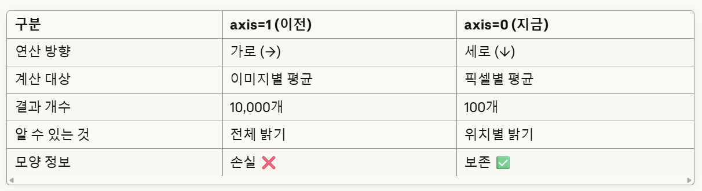

- 각 픽셀 밝기 평균을 100 * 100으로 reshape하여 이미지 그리기    
  쉽게 얘기하면 100개의 이미지를 각 픽셀 위치의 평균값으로 그리는것임.    
  

  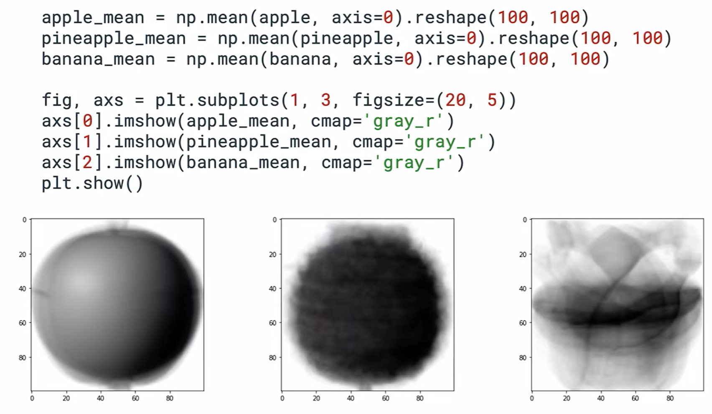


### 평균과 가장 가까운 사과 찾기    
- 이것은 마치 평균값과 가장 작은 차이가 나는 답안을 찾는것과 같음.      
  ```
  🍎 평균 = 모범 답안

  학생1 답안: 모범 답안과 50점 차이
  학생2 답안: 모범 답안과 85점 차이  
  학생3 답안: 모범 답안과 15점 차이 ← 가장 비슷함!
  ...
  학생300 답안: 모범 답안과 300점 차이
  ```
- 전체 과일의 각 픽셀 위치별 값 합치기
  ```
  fruits = np.concatenate([apple, pineapple, banana], axis=0)
  ``` 

- 사과의 각 픽셀 위치별 평균 구하기
  ```
  apple_mean = np.mean(apple, axis=0)
  ```    
  결과:
  ```
  apple_mean.shape = (10000,)
  # [평균0, 평균1, 평균2, ..., 평균9999]
  ```
- 전체 과일의 각 픽셀 위치별 밝기값과 사과의 각 픽셀 위치별 평균의 차이 구하기    
  ```
  abs_diff = np.abs(fruits - apple_mean)  # (300, 10000)
  ``` 

- 각 과일(총 300개)의 평균 차이 구하기  
  ```
  abs_mean = np.mean(abs_diff, axis=1)
  ``` 
- 가장 사과와 근접한 이미지 찾기
  가장 평균과 차이가 적은 이미지의 위치를 총 300개 과일에서 찾음.      
  ```
  most_similar_idx = np.argmin(abs_mean)
  print(f"가장 비슷한 이미지: {most_similar_idx}번")
  print(f"평균 차이: {abs_mean[most_similar_idx]}")
  ```
  
  이를 가시적으로 표현하면 아래와 같음   
  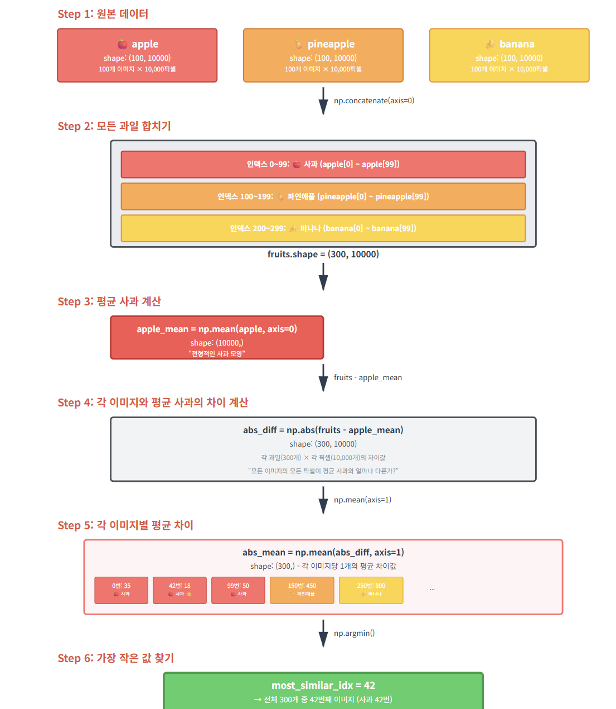

- 이 예제는 진정한 비지도훈련이 아님
  - 전체 과일 중 사과가 무엇인지 알아야 사과의 픽셀 평균값(apple_mean)을 구할 수 있음
  - 비지도 훈련은 전체 중 찾으려는 클러스터가 뭔지 모를 때 쓰는 방법이므로 진정한 비지도훈련은 아님

| [Top](#목차) |

---

## K-Mean
군집(Clustering)의 대표적인 알고리즘    

### K-Mean 동작 원리
랜덤하게 **중앙점(centroid: 도형상의 모든점들의 평균 위치)** 선정 -> 주변 데이터 라벨링 ->  센트로이드 이동     
-> 라벨링과 이동을 반복하면서 더 이상 움직일 필요 없을때까지 반복   

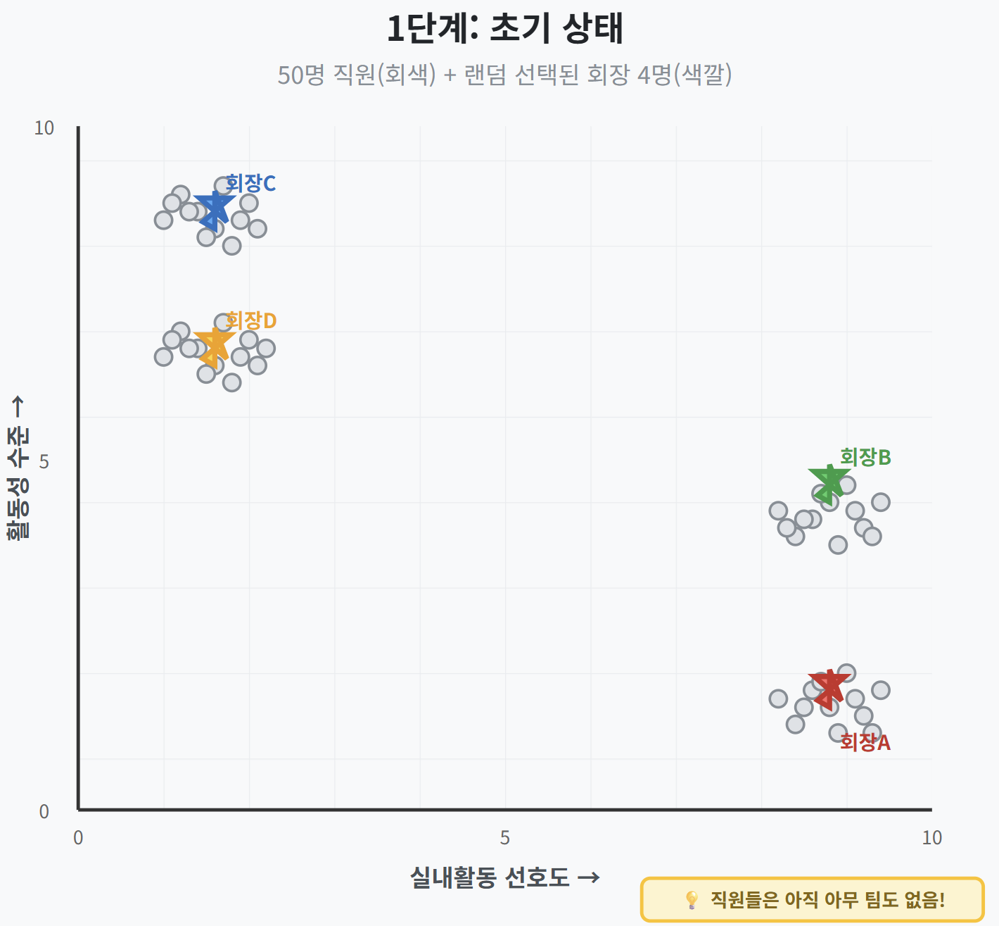    
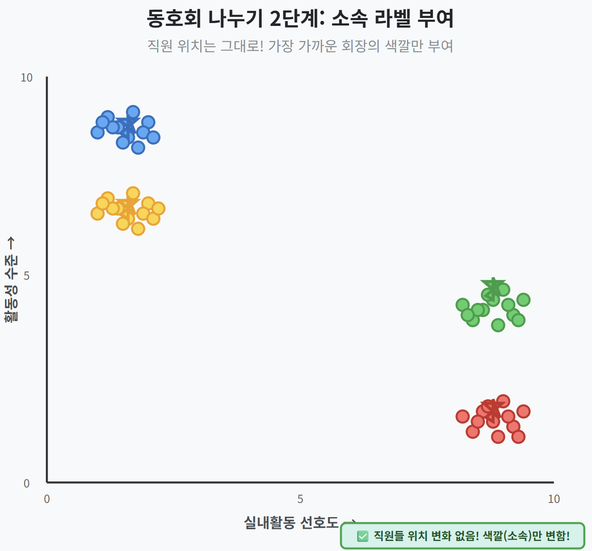   
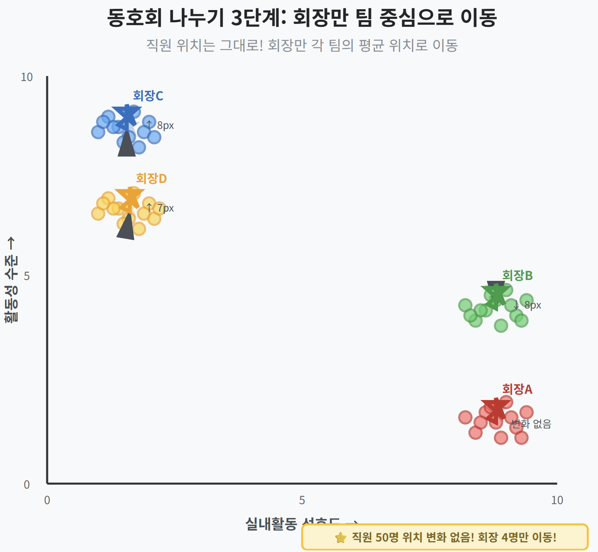   


단점: 최초 K값(클러스터 갯수)에 따라 결과가 달라질 수 있음 
왜냐하면 몇개의 클러스터가 있을 지 알 수 없는데 클러스터 갯수를 미리 지정해야 하기 때문임     

### KMeans 예제
- 0 클러스터가 91개, 1 클러스터가 98개, 2 클러스터가 111개 묶임. 0/1/2가 무엇인지
  
- 클러스터 확인
  0 클러스터는 파인애플임을 확인할 수 있음. 나머지 클러스터도 km_labels_ 값을 바꿔서 확인.     
  ```
  draw_fruites(fruits[km.labels_ ==0])
  ``` 
  

- 각 클러스터의 평균값을 이미지로 표현 
  km.cluster_centers_ : 클러스터 중심점 평균값 리스트 
  reshape: 1차원 배열을 2차월 배열로 변경
  ratio: 확대 비율 
   

- 새로운 과일의 클러스터 예측
  - transform: 새로운 과일 데이터와 각 클러스터 간의 거리 
  - predict: 새로운 과일의 클러스터 예측
  - km.n_iter_ : 주변 데이터 라벨링과 센트로이드 이동을 몇번 했는지 리턴  
  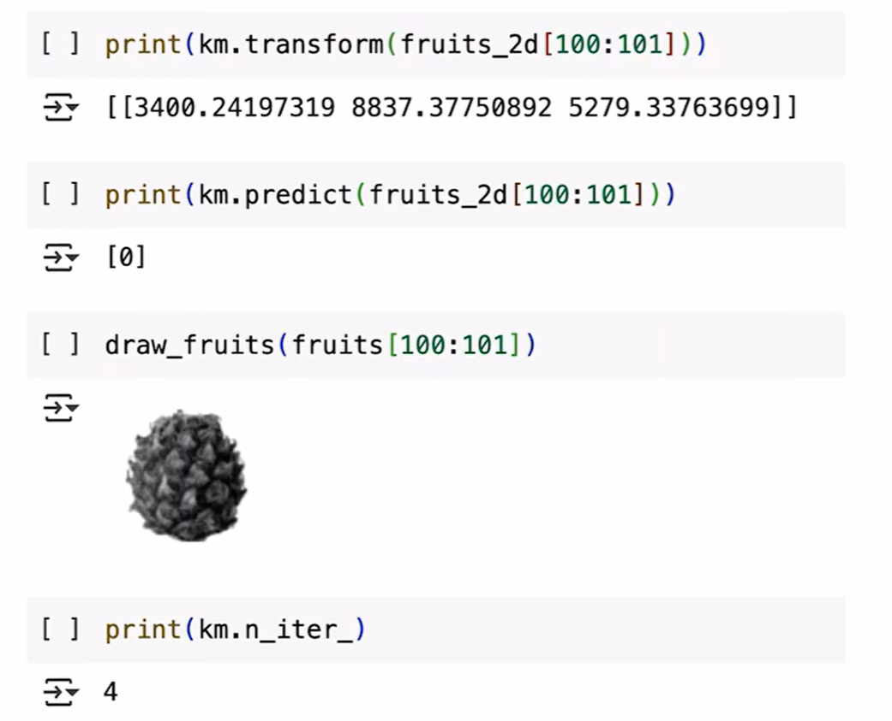


### 최적의 k값(클러스터 갯수) 찾기: Elbow Method
Elbow는 팔꿈치라는 뜻으로 이 방법으로 그래프를 그리면 팔꿈치처럼 구부러진 곳의 K값이 최적이기 때문에 이름 붙여짐.     
inertia는 클러스터의 응집도를 나타냄. 즉, 얼마나 Tight Coupling 되었나이며 값이 낮을 수록 응집도가 높는 것임.   


```
inertia = []                    # 결과 저장할 리스트
for k in range(2, 7):           # K=2부터 6까지 시도
    km = KMeans(n_clusters=k)   # K개 그룹으로 나누기
    km.fit(fruits_2d)           # 훈련 실행
    inertia.append(km.inertia_) # Inertia 값 저장

# 결과:
# k=2: inertia = 5,750,000,000
# k=3: inertia = 4,000,000,000  ⭐ 급감!
# k=4: inertia = 3,850,000,000  (조금만 감소)
# k=5: inertia = 3,750,000,000  (조금만 감소)
# k=6: inertia = 3,700,000,000  (조금만 감소)
```

가시적으로 표현하면 아래와 같음
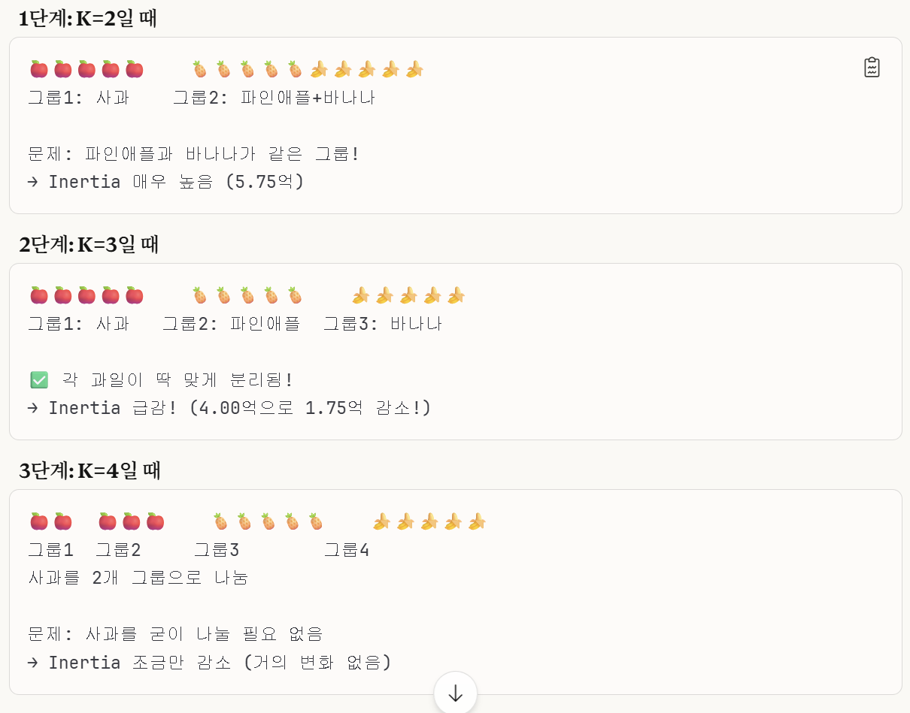

| [Top](#목차) |

---

## PCA(주성분 분석: Principle Component Analysis)
### 차원과 벡터의 차이 이해
- 벡터와 Feautre의 차이 이해
  ```
  Feature Name = Key ✅
  Feature Value = 하나의 Value ✅
  Feature Vector = 모든 Values의 배열 🎯

  비유: '키'라는 Feature의 value는 '175'이고 '몸무게'라는 Feature의 value는 70임. **Feature Value의 배열이 벡터임**. 
  사전(Dictionary): {'키': 175, '몸무게': 70}
  배열(Vector): [175, 70]
  ```
- 차원은 선(1차원), 면(2차원), 입체(3차원)을 의미. 벡터는 Feature 값의 배열을 의미
- 벡터의 값의 갯수에 따라 N차원 벡터라고 부름 (예: 값이 10개면 10차원 벡터임)

### 차원축소(Dimentionality Reduction)의 의미
- 선/면/입체와 같은 차원을 축소하는 것이 아님
- Vector의 값의 갯수를 줄이는 것을 의미
- 벡터값에서 중요한 것만 선택하는 방식(Feature selection)과 새로운 벡터값으로 차원을 축소하는 방법(Feature transformation)이 있음 
- 일반적으로 Feature Transformation을 사용 
- 차원축소의 알고리즘 중 대표적인 방식이 주성분 분석(PCA:Principle Component Analysic)임  

### PCA 개념
- 목표: 중요한 특징값은 최대한 유지하면서, 덜 중요한 특징값은 버림으로써 **데이터를 가장 잘 설명하는 축(주성분)을 찾는 것** 
- 비유: 그림자 놀이 
  ```
  - 3D 물체(원본 데이터)를 다양한 각도에서 벽에 비추면 여러 그림자(투영)가 생깁니다
  - 가장 많은 정보를 담고 있는 각도를 찾는 것이 PCA!
  - 그 각도에서 본 그림자가 바로 "주성분"입니다
  ``` 

### PCA 동작원리 
수학과 과학점수의 2차원 벡터를 종합학업능력이라는 벡터로 축소하는 예시   

- 1단계: 원본 데이터 준비
  ```
  학생    수학    과학
  --------------------
  민지    80      75
  서준    60      65
  하은    90      85
  준호    70      70
  지우    50      55
  ```     
- 2단계: 데이터중심화(Centering)
  - 각 Feature의 평균을 구함
    ```
    수학 평균: μ₁ = (80 + 60 + 90 + 70 + 50) / 5 = 70
    과학 평균: μ₂ = (75 + 65 + 85 + 70 + 55) / 5 = 70
    ```
  - 데이터 중심화: 각 점수 - 평균을 하여 0점을 중심으로 데이터 재배치
    ```
    X_centered = [80-70  75-70]   [10   5]
                [60-70  65-70] = [-10  -5]
                [90-70  85-70]   [20  15]
                [70-70  70-70]   [ 0   0]
                [50-70  55-70]   [-20 -15]
    ```  
    

- 3단계: 공분산 행렬 계산
  - 공분산 계산
    - 공분산은 Feature간의 상관 관계를 의미. 양수이면 같은 방향으로 상관관계, 음수이면 다른 방향으로 상관관계가 있는 것임 
    - 공식: Sum(Feature1 * Feature2 * ...) / 데이터 갯수
    - 공분산(수학, 과학) = 공분산(과학, 수학) = (10 * 5 + -10 * -5 + 20 * 15 + 0 * 0 + -20 * -15) / 5 = 700 / 5 = 140
    - 양수이므로 수학점수가 높으면 과학점수도 높다는 것임 
  - 분산 계산
    - 분산은 각 Feature가 평균과 얼마나 떨어져 있는지를 의미. 값이 높으면 점수가 고르지 않다는 것을 의미.   
    - 공식: Sum(Feature^2) / 데이터 갯수
    - 분산(수학) = (10^2 + -10^2 + 20^2 + 0^2 + -20^2) / 5 = 200
    - 분산(과학) = (5^2 + -5 ^2 + 15^2 + 0^2 + -15^2) / 5 = 100
    - 수학 점수는 과학 점수에 비해 고르지 않음
    - 분산(수학) = 공분산(수학, 수학), 분산(과학) = 공분산(과학, 과학)임. 즉 분산은 자기 자신과의 공분산임.   
  - 공분산 행렬
    - 행과 열에 Feature값을 표시하고 행/열 Feature의 공분산값을 배치 
      ``` 
              수학    과학
      --------------------
      수학    200     140
      과학    140     100
      ```

  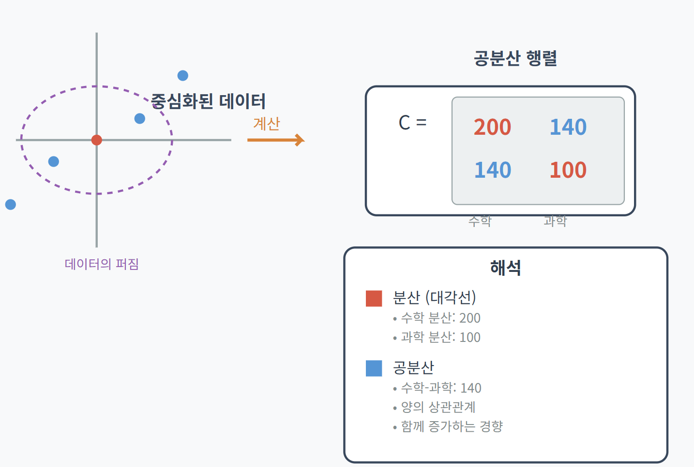  

- 4단계: 고유값과 고유벡터 계산   
  공분산 행렬은 "상관관계가 있다"는 것만 알려줌. 하지만 **정확히 어느 방향으로 얼마나 많이 퍼져있는지**는 알아야 함         
  '그림자 놀이' 비유에서 조명의 방향이 고유벡터이고 고유값이 그림자의 길이라고 생각하면 됨.  

  - 고유값
    - 고유값은 퍼진 방향에 얼마나 많은 데이터가 존재하는지 알려줌    
    - 공식: det(C - λI) = 0. 
      - det: determinant. 행렬식을 의미 
      - C: 공분산 행렬
      - λ: 람다. 고유값
      - I: Identity Matrix. 단위행렬. 행렬 C의 값을 변화시키지 않게 하기 위한 행렬로 대각선 방향만 1이고 나머지는 0임   
    - 계산
      ```
      C - λI = [200  140] - λ[1  0]
                [140  100]    [0  1]

      = [200-λ   140  ]
        [140     100-λ]

      행렬식으로 변환은 아래와 같이 해야 함   
      |a  b|
      |c  d| = ad - bc
      
      따라서 아래와 같이 고유값을 구하면 됨.   
      (200-λ)(100-λ) - 140² = 0
      => λ² - 300λ + 400 = 0

      근의 공식을 적용하면 고유값은 람다1과 람다2가 나옴  
      람다2는 가장 큰 방향의 정확히 수직 방향에 얼마나 많은 데이터가 있는지를 나타냄   

      λ₁ = (300 + 297.32) / 2
          = 597.32 / 2
          = 298.66
      
      λ₂ = (300 - 297.32) / 2
          = 2.68 / 2
          = 1.34 ✓
      ``` 

      참고) 근의 공식
      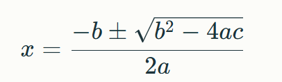  
      
    - 가장 큰 방향의 고유값이 전체 300중에 298.66이므로 99.5%의 데이터가 주성분에 분포되어 있는것임
  
  - 고유벡터
    - 고유벡터는 어느 방향인지를 나타냄      
    - 계산
      ```
      [200-298.66    140     ] [v₁]   [0]
      [140         100-298.66] [v₂] = [0]

      [-98.66   140  ] [v₁]   [0]
      [140    -198.66] [v₂] = [0]

      -98.66v₁ + 140v₂ = 0

      140v₂ = 98.66v₁
      v₂ = (98.66/140)v₁
      v₂ = 0.7047v₁  

      v₁을 1로 임의 설정하여 비정화된 벡터값을 구함.  
      v₁ = 1
      v₂ = 0.7047

      비정규화 벡터: [1, 0.7047]ᵀ

      앞의 벡터값이 커지면 무수히 많은 벡터값이 나옴
      [1, 0.7047]ᵀ
      [2, 1.4094]ᵀ
      [100, 70.47]ᵀ
      크기를 1로 통일하여 벡터크기를 구함  

      벡터 크기 = (1² + 0.7047²)
            = 루트 (1 + 0.4966)
            = 루트 1.4966
            = 1.2235

      정규화된 고유벡터   
      v̂₁ = v₁ / ||v|| = 1 / 1.2235 = 0.8174
      v̂₂ = v₂ / ||v|| = 0.7047 / 1.2235 = 0.5759
      ``` 

    - 동일한 방식으로 고유값2에 대한 고유벡터를 구함    
      v₂ = [0.576, -0.817]ᵀ (제2주성분 방향)

    - 고유벡터를 그래프에 배치하면 아래와 같음  
      ```
      v̂₁ = [0.817, 0.576]  
      v̂₂ = [0.576, -0.817]  ← 수학은 양수, 물리는 음수
      ```
      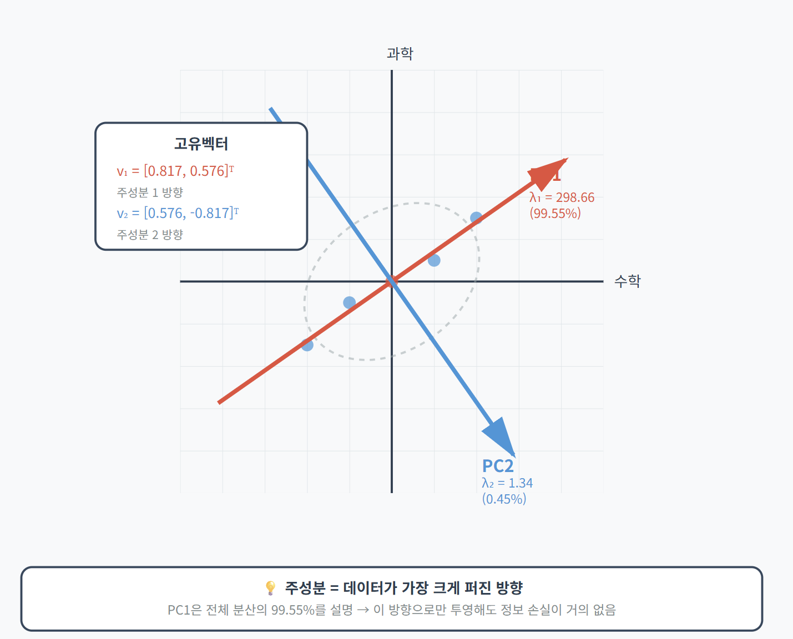

- 5단계: 주성분 점수 계산   
  제1 주성분 점수: PC1 = 0.817×수학 + 0.576×과학 → **"종합 학업 능력"**을 나타냄 
  ```
  민지: 10×0.817 + 5×0.576 = 11.05
  서준: -10×0.817 + (-5)×0.576 = -11.05
  하은: 20×0.817 + 15×0.576 = 24.99
  준호: 0×0.817 + 0×0.576 = 0
  지우: -20×0.817 + (-15)×0.576 = -24.99
  ``` 

  

- 결과: 수학과 과학의 2차원 벡터를 종합학업능력이라는 1차원 벡터로 차원 축소

### 프로그램 예시: 사과, 파인애플, 바나나 이미지 차원 축소
원본이 10000차원 벡터(가로 100픽셀 * 세로 100픽셀)를 50차원으로 축소       
- 훈련 단계: 주성분 계산
  ```
  from sklearn.decomposition import PCA

  pca = PCA(n_components=50)
  pca.fit(fruits_2d)
  ``` 
  
  축소된 벡터는 pca.components_ 에 있음.    
  50개의 주성분이 원본 10000개의 픽셀을 대표한다는 의미     
  ```
  print(pca.components_.shape)
  # 결과: (50, 10000)
  ```

  결과확인
  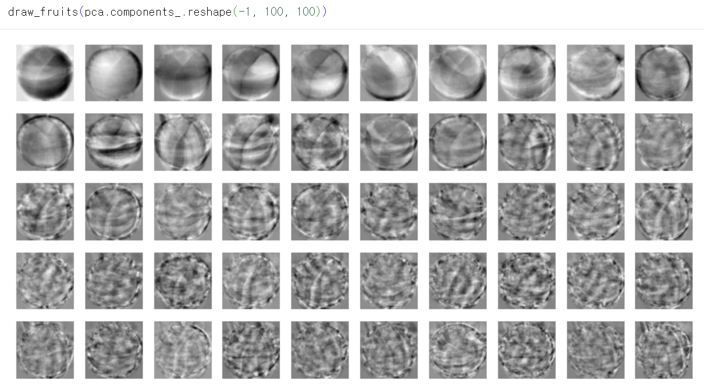

- 변환 단계: 훈련된 주성분으로 데이터 변환
  ```
  fruits_pca = pca.transform(fruits_2d)
  ```   
  결과 확인: 300개의 이미지를 50차원 벡터로 축소
  ```
  print(fruits_pca.shape)
  # 결과: (300, 50)
  ```

- 원본 데이터 재생: inverse_transform으로 원본 데이터 재생
  ```
  fruits_inverse = pca.inverse_transform(fruits_pca)
  print(fruits_inverse.shape) # 결과: (300, 10000)

  fruits_reconstruct = fruits_inverse.reshape(-1, 100, 100)

  for start in [0, 100, 200]:
      draw_fruits(fruits_reconstruct[start:start+100])
      print("\n")
  ```
  

  10000픽셀을 50차원으로 축소해도 원본 데이터를 잘 표현하고 있음을 확인   

- 주성분 50개가 원본 데이터를 얼마나 잘 설명하고 있는지 확인: explained_variance_ratio_
  ```
  print(np.sum(pca.explained_variance_ratio_))
  # 결과: 0.9215686742307752
  ``` 

  X축은 주성분, Y축은 설명하는 데이터 비율    
  10개 정도의 주성분이 대부분의 데이터를 설명하고 있음을 알 수 있음     
  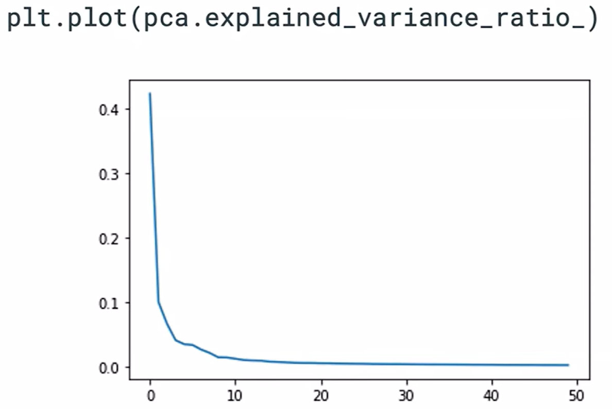

- 주성분 갯수가 아닌 설명할 데이터 비율로 지정하는 방법
  n_components에 정수가 아닌 실수로 지정하면 됨     
   

### 로지스틱 회귀와 함께 사용하기
PCA알고리즘이 동일 정확도를 유지하며 훨씬 빠르게 훈련함.   
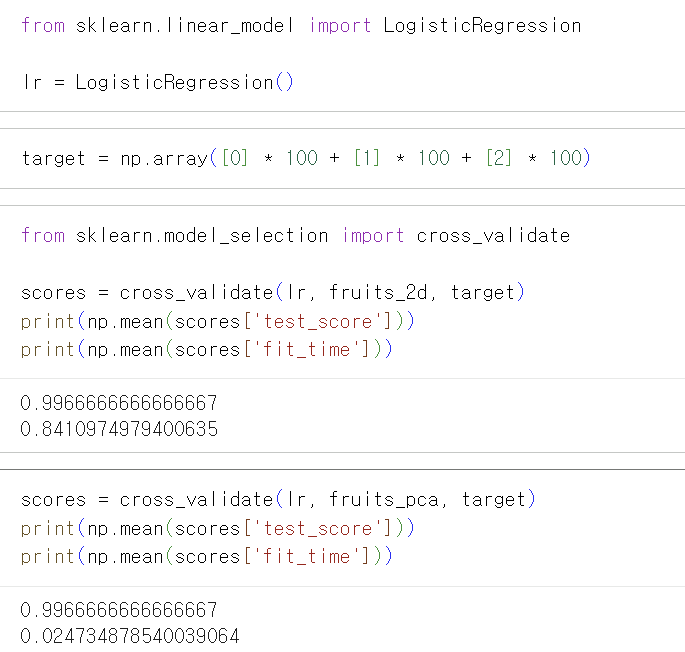

### K-Mean알고리즘과 함께 사용하기
```
pca = PCA(n_components=0.6) # 60% 커버
pca.fit(fruits_2d)

print(pca.n_components_)    # 결과: 4. 4개 주성분으로 60% 데이터 설명  

fruits_pca = pca.transform(fruits_2d)
print(fruits_pca.shape) # 결과: (300, 4)

scores = cross_validate(lr, fruits_pca, target)
print(np.mean(scores['test_score']))  # 결과: 0.9933333333333334
print(np.mean(scores['fit_time']))    # 결과: 0.01770186424255371

from sklearn.cluster import KMeans

km = KMeans(n_clusters=3, random_state=42)
km.fit(fruits_pca)      # 차원 축소한 벡터배열값으로 K-Mean 알고리즘 학슴

#결과: (array([0, 1, 2], dtype=int32), array([111,  98,  91]))
print(np.unique(km.labels_, return_counts=True))            

# 결과 그리기  
for label in range(0, 3):
  draw_fruits(fruits[km.labels_ == label])
  print("\n")
``` 

첫번째 클러스터에 사과와 바나나가 조금 섞이지만 잘 분류함

- 군집 시각화
주성분 중 첫번째와 두번째만 사용하여 표현    
```
for label in range(0, 3):
    data = fruits_pca[km.labels_ == label]
    plt.scatter(data[:,0], data[:,1])
plt.legend(['apple', 'banana', 'pineapple'])
plt.show()
```

x축은 주성분1의 점수, Y축은 주성분2의 점수임        
각 주성분 점수: 중심화된 데이터 × 정규화한 고유벡터(주성분 가중치)
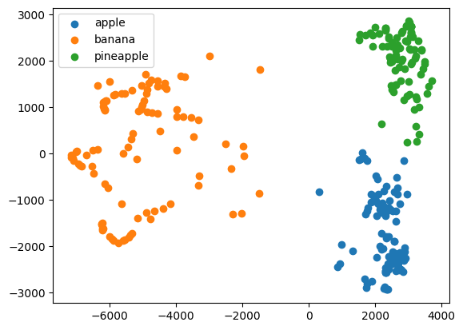

| [Top](#목차) |

---
