# 딥러닝

유투브 강의 영상 
https://www.youtube.com/playlist?list=PLVsNizTWUw7E2RxZ4aspcR9vNamXccmFE

코드예제.   
https://github.com/rickiepark/hg-mldl


# 목차 
- [딥러닝](#딥러닝)
- [목차](#목차)
  - [훈련 데이터셋트](#훈련-데이터셋트)
  - [인공 신경망(ANN: Artificial Neural Network)](#인공-신경망ann-artificial-neural-network)
    - [개념](#개념)
    - [인공신경망 예시](#인공신경망-예시)
    - [인공신경망 실습](#인공신경망-실습)
  - [심층 신경망(DNN: Deep Neural Network)](#심층-신경망dnn-deep-neural-network)
    - [개념](#개념-1)
    - [DNN 예제](#dnn-예제)
    - [신경망 층의 파라미터란?](#신경망-층의-파라미터란)
    - [렐루(ReLu)함수와 Flatten 층](#렐루relu함수와-flatten-층)
    - [옵티마이저 지정](#옵티마이저-지정)
    - [적응적 훈련 옵티마이저: Adam, RMSprop, AdaGrad](#적응적-훈련-옵티마이저-adam-rmsprop-adagrad)
  - [신경망 모델 훈련 Best Practice](#신경망-모델-훈련-best-practice)
    - [손실과 정확도 곡선](#손실과-정확도-곡선)
    - [검증 손실 비교](#검증-손실-비교)
    - [드롭아웃: 과대적합 줄이기 모범사례](#드롭아웃-과대적합-줄이기-모범사례)
    - [모델 저장과 복원](#모델-저장과-복원)
    - [콜백 (Callback)](#콜백-callback)
    - [조기종료 (Early Stopping)](#조기종료-early-stopping)
  - [이미지를 위한 ANN:합성곱 신경망의 구성요소](#이미지를-위한-ann합성곱-신경망의-구성요소)
    - [합성곱 신경망(CNN: Convolutional Neural Network)의 개념](#합성곱-신경망cnn-convolutional-neural-network의-개념)
    - [용어 이해](#용어-이해)
    - [CNN 개념도](#cnn-개념도)
    - [패딩(Padding)](#패딩padding)
    - [풀링(Pooling)](#풀링pooling)
    - [합성곱신경망의 전체 처리 순서](#합성곱신경망의-전체-처리-순서)
  - [이미지를 위한 ANN:합성곱 신경망을 사용한 이미지 분류](#이미지를-위한-ann합성곱-신경망을-사용한-이미지-분류)
    - [케라스를 사용한 예제](#케라스를-사용한-예제)
  - [이미지를 위한 ANN:합성곱 신경망의 시각화](#이미지를-위한-ann합성곱-신경망의-시각화)
    - [합성곱 모델의 레이어와 가중치 확인](#합성곱-모델의-레이어와-가중치-확인)
    - [층의 가중치 시각화](#층의-가중치-시각화)
    - [함수형 API를 이용한 모델 생성](#함수형-api를-이용한-모델-생성)
    - [합성층별 결과를 시각화 하기](#합성층별-결과를-시각화-하기)
  - [순차 텍스트를 위한 ANN:순차 데이터와 순환 신경망](#순차-텍스트를-위한-ann순차-데이터와-순환-신경망)
    - [기본 개념](#기본-개념)
    - [용어 정리](#용어-정리)
    - [뉴런 간 상호 참조](#뉴런-간-상호-참조)
    - [예제로 RNN 동작원리 이해](#예제로-rnn-동작원리-이해)
    - [RNN 핵심 공식](#rnn-핵심-공식)
    - [합성곱 신경망과 비교](#합성곱-신경망과-비교)
    - [각 입력은 벡터로 변환](#각-입력은-벡터로-변환)
    - [순환 신경망을 사용한 예측 전체 과정 개념도](#순환-신경망을-사용한-예측-전체-과정-개념도)
  - [순차 텍스트를 위한 ANN:순환신경망으로 IMDB리뷰 분류하기](#순차-텍스트를-위한-ann순환신경망으로-imdb리뷰-분류하기)
    - [IMDB리뷰 데이터셋](#imdb리뷰-데이터셋)
    - [예제](#예제)
    - [임베딩](#임베딩)
  - [순차 텍스트를 위한 ANN:LSTM 셀과 GRU 셀](#순차-텍스트를-위한-annlstm-셀과-gru-셀)
    - [LSTM 셀 개념](#lstm-셀-개념)
    - [LSTM 셀 예제: 기본](#lstm-셀-예제-기본)
    - [LSTM 셀 예제: 순환층에 dropout 적용](#lstm-셀-예제-순환층에-dropout-적용)
    - [LSTM 셀 예제: 2개 순환층 연결](#lstm-셀-예제-2개-순환층-연결)
    - [GRU 셀: 개념](#gru-셀-개념)
    - [GRU 셀: 예제](#gru-셀-예제)
    - [예제로 이해하는 LSTM셀과 GRU셀](#예제로-이해하는-lstm셀과-gru셀)
    - [전체 학습과정 개념도](#전체-학습과정-개념도)

---

## 훈련 데이터셋트 
- 붓꽃(IRIS) 데이터셋트와 MNIST데이터셋트가 가장 많이 사용됨   
- 패션 MNIST 데이터셋트는 MNIST데이터 셋트를 조금 더 복잡하게 만든 옷 데이터 셋트
- 최근에는 캐글에 좋은 데이터셋트가 많이 공개되어 있음
- 데이터셋 준비    
  훈련과 테스트 input 데이터는 60000개이고 각각 28*28 픽셀임    
  훈련과 테스트 traget(정답) 데이터는 역시 60000개이고 10가지 종류 옷이므로 0~9까지의 숫자로 되어 있음    
  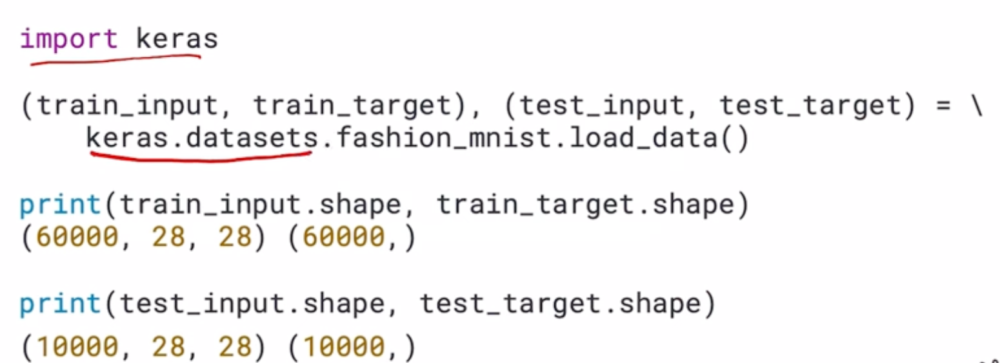
- 로지스틱회귀로 훈련 예제
  - train_scaled: 
    - '0-255'의 각 픽셀 데이터를 '0-1' 사이의 실수로 만듦: 예) 픽셀값 127 → 127/255 ≈ 0.498   
    - reshape하여 2차원을 1차원으로 변환시킴. 784(28*28)차원 벡터가 생성됨   
  - SGC(확률적 경사하강법)으로 교차검증(cross_validate)하여 훈련함. 에포크(모든 데이터 셋 훈련 반복 수)는 5회 수행    
  - 정확도 점수는 약 82점으로 준수한 편   
  

## 인공 신경망(ANN: Artificial Neural Network)

### 개념
- 뇌 뉴런의 모양을 흉내낸 기계훈련 알고리즘. 동작 방식을 모방한것은 아님.
- 매컬론과 피츠가 1943년에 제안
- 입력층(Input layer), 은닉층(Hidden Layer), 출력층(Output Layer)으로 구성되었으며 각 층에 여러개의 뉴런(노드)이 있음
- 가장 단순한 인공신경망은 은닉층에서 입력층 뉴런 * 가중치의 총합으로 출력층 뉴런을 만들고 출력층 뉴런값을 임계값과 비교하여 판단.   
- 활성화함수(Activation function): 은닉층과 출력층의 노드 결과값을 비선형으로 변환하는 함수. 비선형이란 곡선을 의미. 
  - 선형보다 비선형으로 변환 시 더 정확한 값을 구할 수 있음(선형회귀보다 로지스틱회귀가 더 정확도가 높음)
  - Sigmoid(0~1 출력), ReLU(음수는 0, 양수는 그대로), Softmax(각 노드의 확률)가 사용됨
- 훈련 과정은 순전파(forward propagation)로 예측하고, 역전파(backpropagation)로 오차를 줄이는 과정의 반복    
- 역전파(BackPropagation)
  - 가중치를 줄여가면서 최적의 가중치를 구하는 것임 
  - 손실함수(예측값과 실제값의 차이)를 최소화하기 위해 경사하강법으로 가중치를 줄여 나감 
  - 손실함수는 분류 문제에서는 교차 엔트로피(Cross-Entropy), 회귀 문제에서는 평균 제곱 오차(MSE)를 주로 사용    
  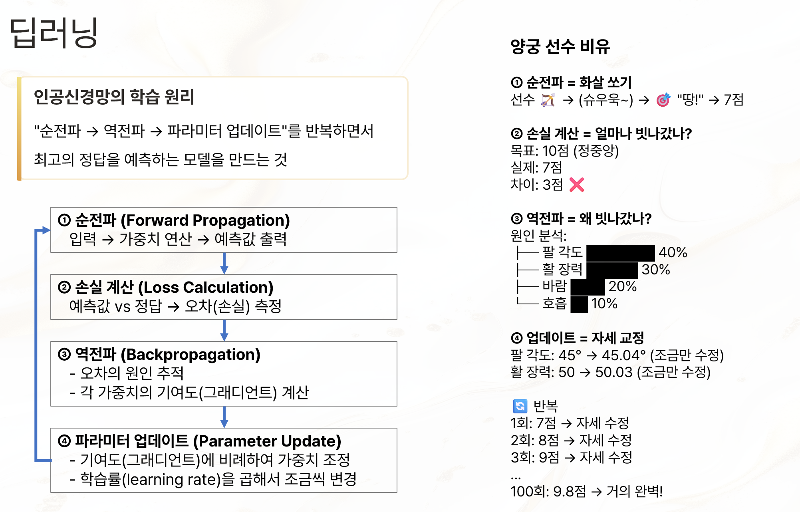    

- 대표적인 딥러닝 프레임워크
  - 파이토치(Pytorch): Meta 개발. 연구자들이 선호
  - 텐서플로우(TensorFlow): Google 개발. 대중적으로 선호됨.
  - 케라스(Keras): 프랑소와 솔레 개발. 텐서플로우의 고수준API. 2019년 텐서플로우와 통합
  - 기타
    - 잭스(JAX): Google 개발. 고성능컴퓨팅 필요 시 사용
    - PaddlePaddle: Baidu 개발. 중국에서 주로 사용 


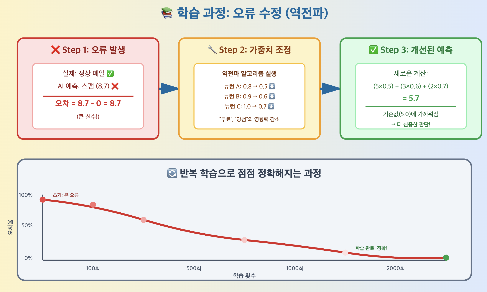

### 인공신경망 예시

**"나에게 좋은 집일 확률 구하기"**      

**1.전체 과정 정리**    

Step1 원본 데이터 (입력층)

| 조건 | 원본 점수 | 점수 범위 |
|------|----------|----------|
| 역까지 거리 | 8점 | 0~10점 |
| 집 크기 | 6점 | 0~10점 |
| 층수 | 9점 | 0~10점 |
| 주변 소음 | 4점 | 0~10점 |

Step2 정규화: 0~1 범위로 변환 (은닉층) 

**공식:** `정규화 값 = 원본 점수 ÷ 최대값(10)`

| 조건 | 원본 점수 | 계산 | 정규화 값 |
|------|----------|------|----------|
| 역까지 거리 | 8점 | 8 ÷ 10 | **0.8** |
| 집 크기 | 6점 | 6 ÷ 10 | **0.6** |
| 층수 | 9점 | 9 ÷ 10 | **0.9** |
| 주변 소음 | 4점 | 4 ÷ 10 | **0.4** |

Step3 가중치 곱하기 (은닉층)

| 조건 | 정규화 값 | 가중치 | 계산 | 결과 |
|------|----------|--------|------|------|
| 역까지 거리 | 0.8 | ×3 | 0.8 × 3 | **2.4** |
| 집 크기 | 0.6 | ×2 | 0.6 × 2 | **1.2** |
| 층수 | 0.9 | ×1 | 0.9 × 1 | **0.9** |
| 주변 소음 | 0.4 | ×2 | 0.4 × 2 | **0.8** |

Step4 합산 + 편향 (은닉층)
```
합계 = 2.4 + 1.2 + 0.9 + 0.8 + b(편향)
     = 5.3 + 0
     = 5.3
```

Step5 활성화 함수 시그모이드 함수로 확률 변환 (은닉층)

```
              1                  1
확률 = ───────────────── = ─────────────
        1 + e^(-5.3)       1 + 0.005
        
     = 0.995
     
     = 99.5%
```

Step6 최종 출력 (출력층)

> **"이 집이 나에게 좋은 집일 확률: 99.5%"** 🏠✨
  
**2.전체 흐름 시각화**    

```
[원본 데이터]     [정규화]      [가중치]      [합산]    [시그모이드]  [출력]
                                                                  
  역거리: 8  ──÷10──→ 0.8 ──×3──→ 2.4 ─┐                             
                                    │                           
  집크기: 6  ──÷10──→ 0.6 ──×2──→ 1.2 ─┼──→ 5.3 ──→ σ(5.3) ──→ 99.5%
                                    │                           
  층수:   9  ──÷10──→ 0.9 ──×1──→ 0.9 ─┤                           
                                    │                           
  소음:   4  ──÷10──→ 0.4 ──×2──→ 0.8 ─┘                          
                                                                  
  [입력층]                   [은닉층 연산]                 [출력층]     
```

| 단계 | 이름 | 하는 일 | 예시 |
|------|------|--------|------|
| 1 | **입력** | 원본 데이터 | 8, 6, 9, 4 |
| 2 | **정규화** | 0~1 범위로 변환 | 0.8, 0.6, 0.9, 0.4 |
| 3 | **가중치 적용** | 중요도 반영 | 2.4, 1.2, 0.9, 0.8 |
| 4 | **합산** | 모두 더하기 | 5.3 |
| 5 | **활성화 함수** | 확률로 변환 | 99.5% |
| 6 | **출력** | 최종 판단 | 좋은 집! ✅ |


**① ~ ④ 의 과정을 반복하면서 최고의 정답을 예측하는것이 인공신경망의 기본 원리**         
① 순전파 (Forward Propagation): 입력 → 가중치 연산 → 예측값 출력
② 손실 계산 (Loss Calculation): 예측값 vs 정답 → 오차(틀린 정도) 측정
③ 역전파 (Backpropagation): 오차의 원인 추적 → 각 가중치의 책임(오차에 기여한 정도) 계산
④ 가중치 업데이트 (Weight Update): 책임만큼 가중치 조정 


### 인공신경망 실습
- 프레임워크는 케라스 사용: 텐서플로우, 파이토치, 잭스를 백엔드로 쉽게 사용하게 해주는 딥러닝 프레임워크  
  

- 예제
  - 데이터 로딩
    ```
    import tensorflow as tf
    from tensorflow import keras
    (train_input, train_target), (test_input, test_target) = keras.datasets.fashion_mnist.load_data()

    from sklearn.model_selection import train_test_split
    ```
  - 훈련셋티와 검증셋트 나누기
    ``` 
    train_scaled, val_scaled, train_target, val_target = train_test_split(
      train_scaled, train_target, test_size=0.2, random_state=42)

    print(train_scaled.shape, train_target.shape) # 결과: (48000, 784) (48000,)
    print(val_scaled.shape, val_target.shape) # 결과: (12000, 784) (12000,)
    ``` 
  - 모델 만들기
    - keras.layers.Input: 입력층
    - keras.layers.Dense: 출력층. 10개 뉴런을 지정하고 활성화함수르 softmax 사용
    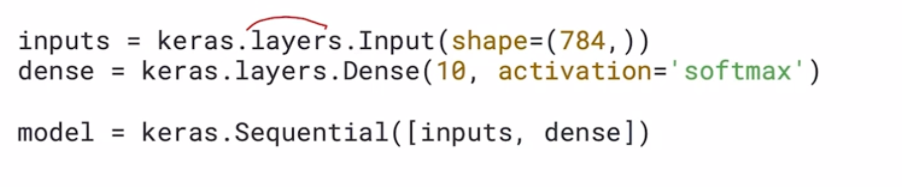  
  - 훈련 
    - compile: 훈련 환경 설정
      - 손실함수로 cross entropy인 sparse_categorical_crossentropy 사용. 
      - metrics: 손실값에 추가로 정확도도 출력하도록 하는 옵션
    - fit: 훈련. 모든 훈련 데이터를 몇번 반복할 지 에포크(epochs)로 지정   
      
        
      결과: 
      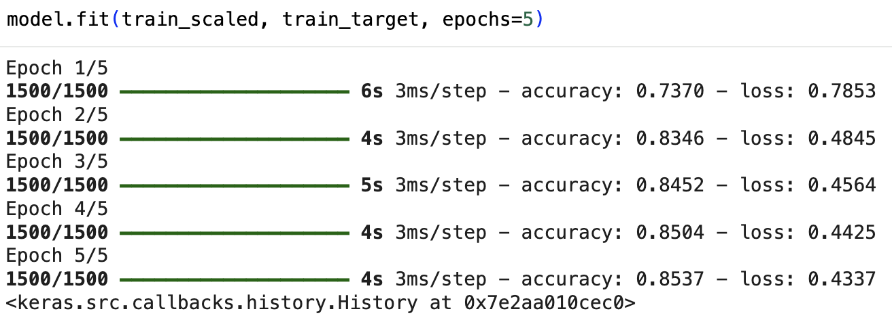
  
  - 평가
    ```
    model.evaluate(val_scaled, val_target)
    ```
    결과: 
    - 정확도: 약 86%의 정확도. 로지스틱회귀의 약 82%보다 높아짐.
    - 손실함수값(예측치-정답): 0.44(0에 가까울수록 정확. 0.5가 평균)로 보통 수준임.      
      
  
| [Top](#목차) |

---

## 심층 신경망(DNN: Deep Neural Network)

### 개념
- ANN은 0~2개의 은닉측을 가지는 단순한 알고리즘이고 DNN은 3개 이상의 은닉층을 가지는 알고리즘
- 마치 레고블록처럼, 작은 조각(입력층)을 계속 쌓아(은닉층) 큰 성(출력층)을 만드는 인공지능 훈련 방법 
- 정답을 가르쳐 주지 않아도 패턴을 발견해 결과를 예측할 수 있음 
- DNN의 가장 최신/최고의 방법이 Transformer 모델임

### DNN 예제
- 데이터 로딩
  ```
  import tensorflow as tf
  from tensorflow import keras
  (train_input, train_target), (test_input, test_target) = keras.datasets.fashion_mnist.load_data()

  from sklearn.model_selection import train_test_split
  ```
- 훈련셋티와 검증셋트 나누기
  ``` 
  train_scaled, val_scaled, train_target, val_target = train_test_split(
    train_scaled, train_target, test_size=0.2, random_state=42)

  print(train_scaled.shape, train_target.shape) # 결과: (48000, 784) (48000,)
  print(val_scaled.shape, val_target.shape) # 결과: (12000, 784) (12000,)
  ``` 
- 모델 만들기
  dense1: 100개의 뉴런을 가지는 은닉층. 활성화 함수는 sigmoid를 사용.     
  dense2: 10개의 뉴런을 가지는 출력층. 활성화 함수는 softmax 사용.     
  ```
  inputs = keras.layers.Input(shape=(28*28,))
  dense1 = keras.layers.Dense(100, activation='sigmoid')
  dense2 = keras.layers.Dense(10, activation='softmax')

  model = keras.Sequential([inputs, dense1, dense2])
  ``` 

  구성된 DNN을 표시
  ```
  model.summary()
  ```
  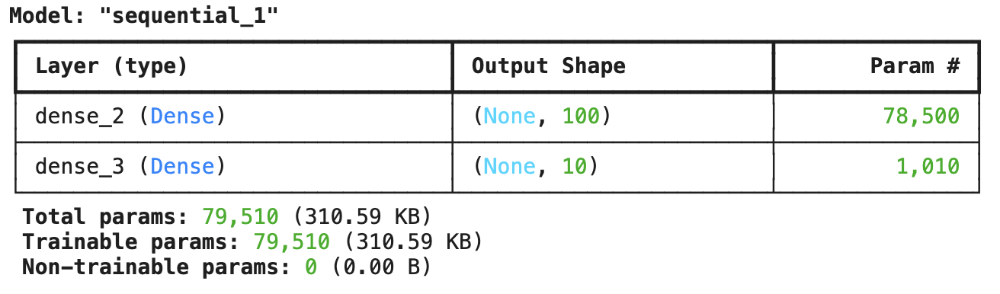

  참고) 파라미터 갯수: (이전 레이어의 노드 갯수) * (노드 갯수) + (절편 갯수). 절편(Bias)는 노드 당 1개임.  
  - 은닉층: 784 * 100 + 100 = 78500
  - 출력층: 100 * 10 + 10 = 1010   
- 층을 정의하는 다른 방법: 아래 두 방법 중 하나를 쓸 수도 있음   
  - Sequential 함수의 파라미터로 층 정의
    ```
    model = keras.Sequential([
      keras.layers.Input(shape=(784,)),
      keras.layers.Dense(100, activation='sigmoid', name='hidden'),
      keras.layers.Dense(10, activation='softmax', name='output')
    ], name='패션 MNIST 모델')
    ``` 
  - model.add로 층 추가 
    ```
    model = keras.Sequential()
    model.add(keras.layers.Input(shapre(784,)))
    model.add(keras.layers.Dense(100, activation='sigmoid')
    model.add(keras.layers.Dense(10, activation='softmax')
    ``` 
- 훈련 및 평가
  ```
  model.compile(loss='sparse_categorical_crossentropy', metrics=['accuracy'])
  model.fit(train_scaled, train_target, epochs=5)

  model.evaluate(val_scaled, val_target)
  ```

### 신경망 층의 파라미터란?  
**1.모델 파라미터 (Model Parameters)**    
| 특성 | 설명 |
|------|------|
| **정의** | 모델이 학습 과정에서 **자동으로 조정**하는 값 |
| **예시** | 가중치(Weights), 편향(Bias) |
| **특징** | 데이터로부터 학습됨, 사람이 직접 설정하지 않음 |
    
앞의 예제는 모든 입력이 모든 뉴런에 연결되는 완전연결망이므로 이때 파라미터가 갯수는 입력수 * 뉴런수가 됨    

LLM에서 몇십억개의 파라미터라고 말할때 이 모델 파라미터를 의미함    

**2.하이퍼파라미터 (Hyperparameters)** - 훈련/출력 조정용

| 특성 | 설명 |
|------|------|
| **정의** | **사람이 직접 설정**하는 학습 환경 값 |
| **예시** | Learning Rate, Epoch 수, Batch Size, Dropout 비율 |
| **특징** | 학습 전에 미리 결정, 모델 성능에 큰 영향 |


### 렐루(ReLu)함수와 Flatten 층 
- Flatten층: 노드를 1차원 배열로 변환한 층(reshape함수로 2차원 배열을 1차원 배열로 변환하는것과 동일 기능) 
- 활성화함수 ReLu: 
  - 0보다 작은 값은 0을 리턴하고 양수이면 그 값을 리턴하는 함수: max(0, z)
  - 신경망에서 더 나은 성능을 내서 sigmoid 보다 더 많이 사용하는 추세  
  - 이미지 분류 시 보통 relu 함수 사용  
  - 시그모이드와 렐루 사용 시 그래프 비교     
       
    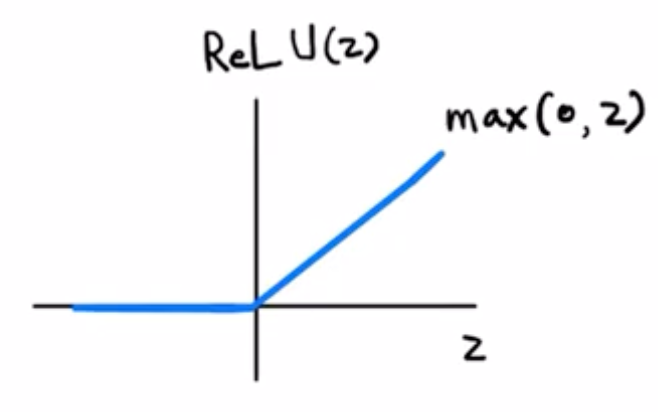 
- 코드
  Input함수 대신에 Flatten의 파라미터로 input_shape를 지정하면 내부적으로 Input층 생김  
  ```
  model = keras.Sequential()
  model.add(keras.layers.Flatten(input_shape=(28, 28)))
  model.add(keras.layers.Dense(100, activation='relu'))
  model.add(keras.layers.Dense(10, activation='softmax'))
  ```  

  DNN 구조 보기: model.summary()
  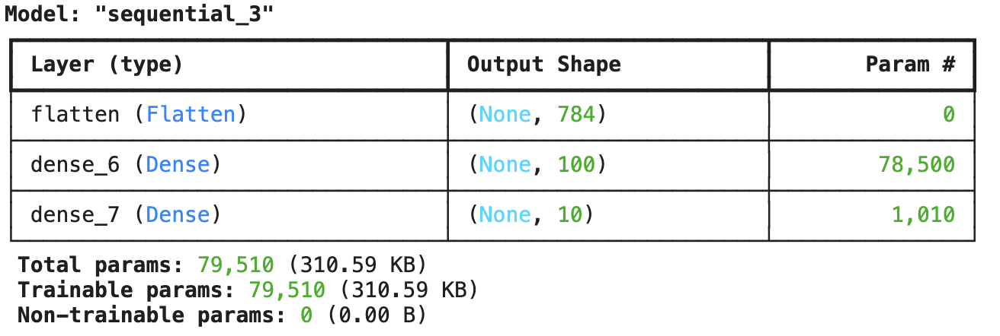
  
### 옵티마이저 지정
- 옵티마이저: 가중치를 조정하기 위한 알고리즘으로 compile 함수의 'optimizer' 파라미터로 지정
- keras의 디폴트 옵티마이저는 rmsprop임. 아래와 같이 optimizer를 다르게 변경할 수 있음   
  ```
  model.compile(optimizer='sgd', loss='sparse_categorical_crossentropy', metrics=['accuracy'])
  ``` 

  또는   
  ```
  sgd = keras.optimizers.SGD()
  model.compile(optimizer=sgd, loss='sparse_categorical_crossentropy', metrics=['accuracy'])
  ```

- 훈련률 지정: SGD알고리즘 사용 시 한 번에 가중치를 얼마나 조정할지 지정   
  ```
  sgd = keras.optimizers.SGD(learning_rate=0.1)
  model.compile(optimizer=sgd, loss='sparse_categorical_crossentropy', metrics=['accuracy'])
  ```
  기본값은 0.01임.   

- momentum: 정답을 찾아가는 방향을 얼마나 유지할 지 지정하는 파라미터 
  - momentum을 지정하지 않으면 매번 다른 방향으로 훈련할 수 있음  
  - momentum은 0~1까지의 값으로 지정하며 100을 곱하여 몇 %나 이전 방향성을 유지할 지 지정   
  - 보통 0.9를 사용함    
  - 네스트로프(nestrov)는 좀 더 향상된 momentum 옵션이며 momentum 지정 시 true로 지정
  ```
  sgd = keras.optimizers.SGD(momentum=0.9, nesterov=True)
  ``` 

### 적응적 훈련 옵티마이저: Adam, RMSprop, AdaGrad 
- 훈련률을 자동으로 조정하는 옵티마이저로서 adam을 가장 많이 사용  
- 알엠에스프롭(RMSprop): 최근기울기의 제곱평균으로 훈련률 조정. Root Mean Square Propagation
- 아다그래드(AdaGrad): 자주 업데이트 되는 파라미터는 큰 훈련률, 그 반대는 작은 훈련률로 조정. Adaptive Gradient  
- 아담(Adam): RMSProp과 AdaGrad의 장점을 결합한 알고리즘. Adaptive Moment Estimation   
  ```
  adam = keras.optimizers.Adam()
  model.compile(optimizer=adam, loss='sparse_categorical_crossentropy', metrics=['accuracy'])
  ```

  ```
  rmsprop = keras.optimizers.RMSprop()
  model.compile(optimizer=rmsprop, loss='sparse_categorical_crossentropy', metrics=['accuracy'])
  ``` 

| [Top](#목차) |

---

## 신경망 모델 훈련 Best Practice

신경망 모델을 훈련하는 모범사례와 유용한 도구에 대해 훈련    

### 손실과 정확도 곡선
- 모델 작성: 함수 사용 예제    
  ```
  def model_fn(a_layer=None):
      model = keras.Sequential()
      model.add(keras.layers.Flatten(input_shape=(28, 28)))
      model.add(keras.layers.Dense(100, activation='relu'))
      if a_layer:
          model.add(a_layer)
      model.add(keras.layers.Dense(10, activation='softmax'))
      return model

  model = model_fn()
  ```
- 모델 설정 및 훈련
  ```
  model.compile(loss='sparse_categorical_crossentropy', metrics=['accuracy'])

  learn = model.fit(train_scaled, train_target, epochs=5, verbose=0)
  ```

  참고) verbose: 훈련과정을 얼마나 자세하게 출력할지 지정. 
  - 0: 출력 없음
  - 1: 진행률을 막대 그래프로 표시. 기본값
    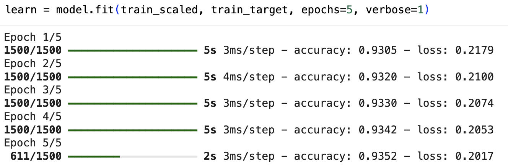   
  - 2: 진행률을 텍스트로 표시    
    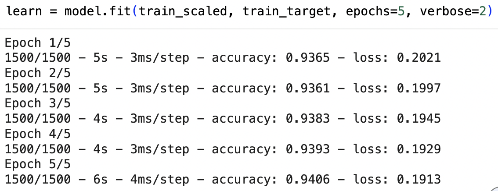 

- 훈련데이터의 손실값과 정확도 표시  
  ```
  print(learn.history.keys()) # 결과: dict_keys(['accuracy', 'loss'])

  import matplotlib.pyplot as plt

  plt.plot(learn.history['loss'])
  plt.xlabel('epoch')
  plt.ylabel('loss')
  plt.show()
  ```
  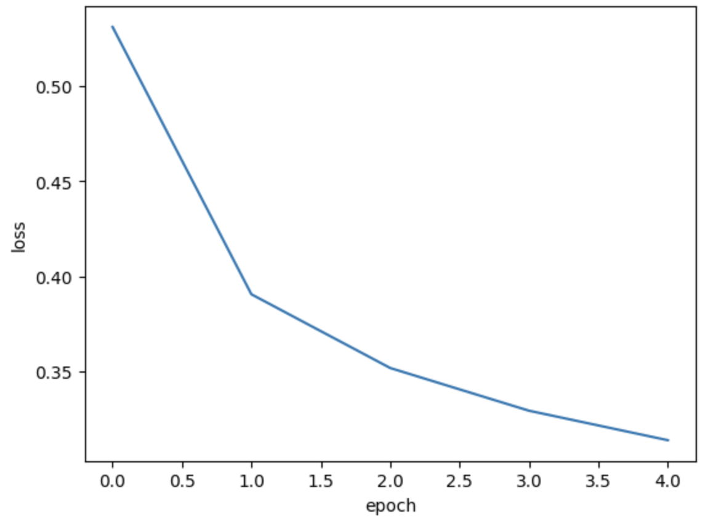

  ```
  plt.plot(learn.history['accuracy'])
  plt.xlabel('epoch')
  plt.ylabel('accuracy')
  plt.show()
  ```  
  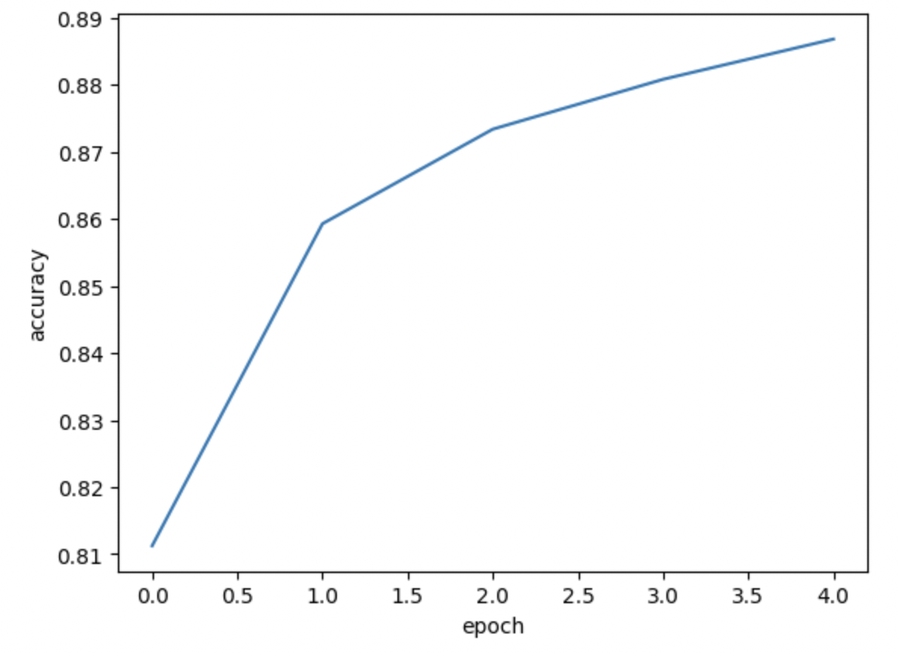

### 검증 손실 비교
- 목적: 과대적합 또는 과소적합 파악    
- 방법: 훈련 시 검증데이터 셋트를 추가하여 epoch에 따른 손실값 추이를 파악   
- 예제: 'validation_data'파라미터로 검증데이터 셋트 추가   
  ```
  model = model_fn()
  model.compile(loss='sparse_categorical_crossentropy', metrics=['accuracy'])

  history = model.fit(train_scaled, train_target, epochs=20, verbose=0,
                    validation_data=(val_scaled, val_target))
  
  print(history.history.keys()) # 결과: dict_keys(['accuracy', 'loss', 'val_accuracy', 'val_loss'])
  ```  

  ```
  plt.plot(history.history['loss'])
  plt.plot(history.history['val_loss'])
  plt.xlabel('epoch')
  plt.ylabel('loss')
  plt.legend(['train', 'val'])
  plt.show()
  ```
  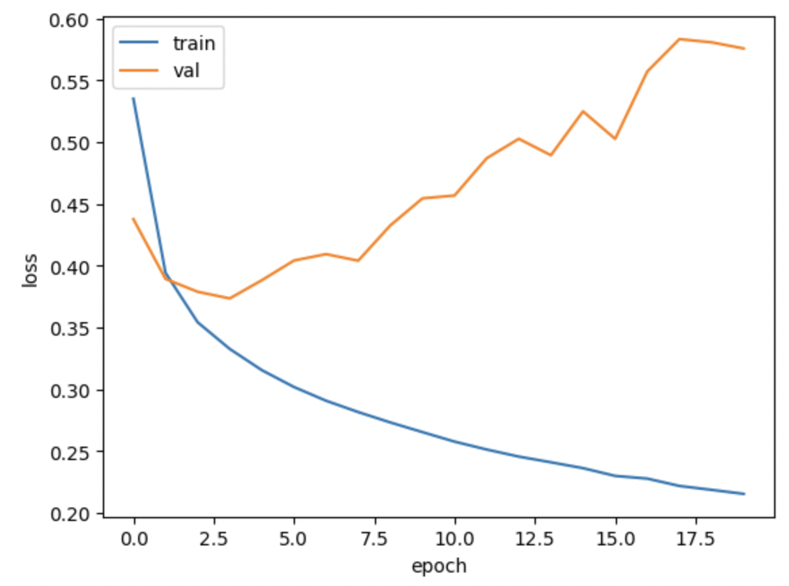

- 2번째 훈련이후로 과대적합되기 시작함을 알 수 있음
  - 손실값이 훈련데이터는 정상적으로 떨어지는데 검증데이터는 계속 올라가서 차이가 벌어짐   
  - 훈련데이터에 과대적합됨을 의미함 

### 드롭아웃: 과대적합 줄이기 모범사례
- 목적: 과대적합 줄이기 
- 방법: 
  - 과대적합의 원인은 특정 뉴런에 과도하게 의존하기 때문임  
  - 은닉층의 일부 뉴런(=노드=유닛)을 훈련과정에서 제외(Dropout)함   
  - 훈련 시에만 제외되는 것이며 매 배치(Epoch)마다 제외되는 뉴런은 달라짐
  - 예측 시에는 Dropout 하지 않음 
  - 일반적인 비율은 0.2 ~ 0.5이며 대규모일수록 값을 크게 함  
  - 시각적 표현    
    ```
    훈련 1회차: ●●●○○●●○●● (30% 비활성)
              ↓ 학습
    훈련 2회차: ○●●●○○●●●○ (다른 30% 비활성)
              ↓ 학습
    훈련 3회차: ●○●○●●○●○● (또 다른 30% 비활성)
              
    → 결과: 모든 뉴런이 독립적으로 기여하도록 훈련됨
    ```

- 예제: Drop 은닉층을 추가. 예제에서는 30%의 뉴런은 훈련과정에서 제외하게 함  
  - 모델 구성
        
  
    

  - 훈련
    ```
    model.compile(optimizer='adam', loss='sparse_categorical_crossentropy',
                  metrics=['accuracy'])

    history = model.fit(train_scaled, train_target, epochs=20, verbose=0,
                        validation_data=(val_scaled, val_target))
    ```
  - 가시화
    ```
    plt.plot(history.history['loss'])
    plt.plot(history.history['val_loss'])
    plt.xlabel('epoch')
    plt.ylabel('loss')
    plt.legend(['train', 'val'])
    plt.show()
    ``` 
    
  
  - 과대적합이 상당히 줄었으며 검증데이터의 손실값도 낮게 잘 유지됨    

### 모델 저장과 복원
- 목적: 학습된 모델을 저장하고 복원함
- 방법: 
  - 모델 저장: model.save(모델명.keras)
  - 가중치 저장: model.save_weights(가중치명)
  - 모델 복원: keras.model.load_model(모델명.keras)
  - 가중치 복원: model.load_weights(가중치명)
- 예제
  - 모델 구성 및 학습
    ```
    model = model_fn(keras.layers.Dropout(0.3)) # 파라미터로 Dropout 층 전달하여 구성 
    model.compile(optimizer='adam', loss='sparse_categorical_crossentropy',
                  metrics=['accuracy'])

    history = model.fit(train_scaled, train_target, epochs=10, verbose=0,
                        validation_data=(val_scaled, val_target))
    ```  
  - 모델/가중치 저장 
    저장되는 모델에는 가중치를 포함하여 모델 구조, 가중치, 컴파일 설정이 모두 저장됨    
    ```
    model.save('model-whole.keras')
    model.save_weights('model.weights.h5')
    ```   

    파일로 저장 확인: 파이썬에서 '!'를 붙이면 리눅스 명령 수행함     
    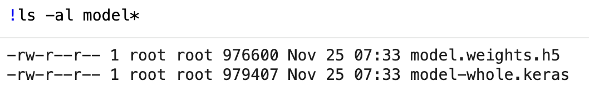  
  
  - 가중치만 복원  
    동일한 모델 구조를 생성한 후 가중치를 로딩해야 제대로 수행됨    
    ```
    model = model_fn(keras.layers.Dropout(0.3))
    model.load_weights('model.weights.h5')
    ``` 
  
    예측 수행
    ```
    import numpy as np

    val_labels = np.argmax(model.predict(val_scaled), axis=-1)
    
    print(np.mean(val_labels == val_target)) #결과: 0.878
    ```
  - 모델 복원  
    ```
    model = keras.models.load_model('model-whole.keras')
    model.evaluate(val_scaled, val_target) # 결과: [0.33735886216163635, 0.878000020980835]
    ``` 
  - predict vs evaluate
    - predict는 예측, evaluate는 성능 측정이 목적임  
    - 가중치만 복원하여 evaluate하려면 컴파일 설정을 동일하게 해줘야 함
      ```
      model.load_weights('model.weights.h5')
      # 가중치만 로드하면 compile 정보가 없음!
      # evaluate 사용 전 반드시 compile 필요
      model.compile(optimizer='adam', 
                    loss='sparse_categorical_crossentropy',
                    metrics=['accuracy'])
      model.evaluate(val_scaled, val_target)  
      ``` 
  - np.argmax 수행 이해
    **확률이 가장 높은 인덱스를 리턴**하는 함수    
    ```
    import numpy as np

    # 가상의 3개 샘플, 5개 클래스 문제
    predictions = np.array([
        [0.1, 0.2, 0.6, 0.05, 0.05],  # 샘플 1: 클래스 2가 60%
        [0.7, 0.1, 0.1, 0.05, 0.05],  # 샘플 2: 클래스 0이 70%
        [0.2, 0.3, 0.1, 0.3,  0.1]    # 샘플 3: 클래스 1이 30%
    ])

    val_target = np.array([2, 0, 3])  # 실제 정답

    # 1단계: 예측 레이블 추출
    val_labels = np.argmax(predictions, axis=-1)
    print("예측 레이블:", val_labels)  # [2, 0, 1]

    # 2단계: 정답과 비교
    comparison = (val_labels == val_target)
    print("비교 결과:", comparison)  # [True, True, False]

    # 3단계: 정확도 계산
    accuracy = np.mean(comparison)
    print("정확도:", accuracy)  # 0.6666... (66.67%)

    # 상세 분석
    for i in range(len(val_labels)):
        correct = "✓" if comparison[i] else "✗"
        print(f"샘플 {i}: 예측={val_labels[i]}, "
              f"정답={val_target[i]} {correct}")
    ``` 

    결과
    ```
    예측 레이블: [2 0 1]
    비교 결과: [ True  True False]
    정확도: 0.6666666666666666
    샘플 0: 예측=2, 정답=2 ✓
    샘플 1: 예측=0, 정답=0 ✓
    샘플 2: 예측=1, 정답=3 ✗
    ```

### 콜백 (Callback)
- **목적**: 훈련 과정 중 검증 성능이 가장 우수한 모델을 자동으로 저장
- **원리**: 
  - 매 에포크마다 검증 데이터로 모델 성능을 평가
  - 검증 손실(validation loss)이 **이전 최저값보다 낮으면** 해당 모델을 저장
  - 과적합이 시작되기 전의 최적 모델을 보존
  
- **사용 방법**: 
```python
  checkpoint_cb = keras.callbacks.ModelCheckpoint(
      'best-model.keras',        # 저장할 파일명
      save_best_only=True,       # 최고 성능 모델만 저장
      monitor='val_loss',        # 모니터링 대상 (기본값)
      verbose=1                  # 저장 시 메시지 출력
  )

  model.fit(train_scaled, train_target, 
            epochs=20,
            validation_data=(val_scaled, val_target),  # 필수!
            callbacks=[checkpoint_cb])
```

- **주의사항**:
  - validation_data를 반드시 제공해야 함
  - 조기종료(EarlyStopping)과 함께 사용하면 더 효과적

### 조기종료 (Early Stopping)
- **목적**: 과적합이 시작되는 시점을 자동으로 감지하여 훈련을 중단
- **원리**: 
  - 매 에포크마다 검증 손실(validation loss)을 모니터링
  - 검증 손실이 **일정 에포크 동안 개선되지 않으면** 훈련을 자동 중단
  - 불필요한 훈련 시간을 절약하고 과적합을 방지
  
- **사용 방법 (ModelCheckpoint와 함께 사용 권장)**: 
```python
  # 최고 성능 모델 저장
  checkpoint_cb = keras.callbacks.ModelCheckpoint(
      'best-model.keras',
      save_best_only=True,
      monitor='val_loss',
      verbose=1
  )

  # 조기 종료
  early_stopping_cb = keras.callbacks.EarlyStopping(
      patience=5,                  # 몇개까지의 개선 없는 에포크 수를 기다릴것인가?
      monitor='val_loss',          # 모니터링 대상 (기본값)
      restore_best_weights=True,   # 최고 성능 가중치로 복원
      verbose=1                    # 중단 시 메시지 출력
  )

  # 두 콜백을 함께 사용
  model.fit(train_scaled, train_target, 
            epochs=100,  # 충분히 큰 값 설정
            validation_data=(val_scaled, val_target),  # 필수!
            callbacks=[checkpoint_cb, early_stopping_cb])

  # 몇번째 에포크에서 멈췄는지 확인
  print(early_stopping_cb.stopped_epoch)  
```

- **주요 파라미터**:
  - `patience`: 성능 개선이 없어도 기다릴 에포크 수 (예: 5)
  - `restore_best_weights`: True면 최고 성능 시점의 가중치로 복원
  - `monitor`: 모니터링할 메트릭 (기본값: 'val_loss')
  - `min_delta`: 개선으로 인정할 최소 변화량 (기본값: 0)

- **실전 활용 팁**:
  - epochs는 충분히 큰 값(50~100)으로 설정
  - patience는 모델 복잡도에 따라 조정 (간단한 모델: 3~5, 복잡한 모델: 10~20)    
  - restore_best_weights=True 설정 권장 (최적 모델 자동 복원)
  
- **주의사항**:
  - validation_data를 반드시 제공해야 함
  - patience가 너무 작으면 충분히 학습하기 전에 중단될 수 있음
  - patience가 너무 크면 과적합을 충분히 방지하지 못할 수 있음


| [Top](#목차) |

---

## 이미지를 위한 ANN:합성곱 신경망의 구성요소

### 합성곱 신경망(CNN: Convolutional Neural Network)의 개념
- 목적: 파라미터 수를 최소로 줄여 가성비 있게 최고의 성능을 내기 위함 
  - 완전 연결 신경망(=밀집 신경망): 모든 입력 특성값에 가중치 합산하여 결과 도출 
    ```
    [원본 데이터]     [정규화]      [가중치]      [합산]    [시그모이드]  [출력]
                                                                      
      역거리: 8  ──÷10──→ 0.8 ──×3──→ 2.4 ─┐                             
                                        │                           
      집크기: 6  ──÷10──→ 0.6 ──×2──→ 1.2 ─┼──→ 5.3 ──→ σ(5.3) ──→ 99.5%
                                        │                           
      층수:   9  ──÷10──→ 0.9 ──×1──→ 0.9 ─┤                           
                                        │                           
      소음:   4  ──÷10──→ 0.4 ──×2──→ 0.8 ─┘                          
                                                                      
      [입력층]                   [은닉층 연산]                 [출력층]     
    ```     
  - 완전 연결 신경망은 이미지/영상 데이터의 딥러닝에는 적용 불가능     
    예) 256×256 컬러 이미지 하나만 해도 196,608개의 입력 뉴런이 필요하고, 이걸 1,000개 은닉층에 연결하면 파라미터가 약 2억 개임  
  
- 방법: **지역연결(Local Connectivity)과 가중치 공유**
  - 지역 연결
    ```
    밀집 신경망: 모든 픽셀과 연결 (전체 연결)
    ─────────────────────────────────────
    입력 (5×5=25개)         은닉층 (10개)

    □ □ □ □ □              
    □ □ □ □ □  ──전부──→   ○ ○ ○ ○ ○ ○ ○ ○ ○ ○
    □ □ □ □ □     연결
    □ □ □ □ □              
    □ □ □ □ □              

    연결 수 = 25 × 10 = 250개


    CNN: 주변 픽셀만 연결 (지역 연결)
    ─────────────────────────────────────
    입력 (5×5)              출력

    □ □ □ □ □              
    □ ■ ■ ■ □  ──3×3만──→   ○  (한 점)
    □ ■ ■ ■ □     연결
    □ ■ ■ ■ □              
    □ □ □ □ □              

    연결 수 = 3 × 3 = 9개
    ```
  - 가중치 공유
    ```
    밀집 신경망: 위치마다 다른 가중치
    ─────────────────────────────────────
    위치1 볼 때: w1, w2, w3, w4, w5, w6, w7, w8, w9
    위치2 볼 때: w10, w11, w12, w13, w14, w15, w16, w17, w18
    위치3 볼 때: w19, w20, w21 ...
        ↓
    가중치가 계속 늘어남!


    CNN: 모든 위치에서 같은 가중치 재사용
    ─────────────────────────────────────
    ┌───┬───┬───┐
    │ w1│ w2│ w3│  ← 이 9개를
    ├───┼───┼───┤
    │ w4│ w5│ w6│     모든 위치에서
    ├───┼───┼───┤
    │ w7│ w8│ w9│     똑같이 사용!
    └───┴───┴───┘

    위치1 볼 때: w1~w9
    위치2 볼 때: w1~w9 (동일!)
    위치3 볼 때: w1~w9 (동일!)
        ↓
    가중치는 9개로 고정!
    ```

### 용어 이해
| 용어 | 직관적 의미 | 실제 역할 |
|------|------------|----------|
| **채널** | 통로, 경로 | 정보가 흐르는 층  |
| **커널** | 핵심, 알맹이 | 특징을 보는 작은 창. 연산의 핵심 행렬  |
| **필터** | 걸러내는 것 | 특정 특징 추출기  |
| **바이어스** | 치우침 | 판단을 조정하는 보정값 |
| **특성맵** | - | 커널이 이동하면서 출력하는 값의 행렬 |
| **스트라이드**(Stride) | 발걸음 | 커널이 이동하는 단위 | 
| **채널크기** | - | 채널 갯수 또는 특성맵의 깊이. 특성맵 채널크기와 필터의 갯수는 동일 | 

**"그림에서 고양이 찾기"**     
  
**1. 채널은 "정보가 흐르는 층"**    

```
사진을 3장의 투명 필름으로 분리한다고 생각하세요     

원본 사진
    │
    ├──→ 빨간색만 보이는 필름 (R)
    ├──→ 초록색만 보이는 필름 (G)  
    └──→ 파란색만 보이는 필름 (B)

┌────────┐   ┌────────┐   ┌────────┐
│ 🔴🔴🔴  │   │ 🟢🟢🟢  │   │ 🔵🔵🔵  │
│ 🔴🔴🔴  │ + │ 🟢🟢🟢  │ + │ 🔵🔵🔵  │ = 컬러사진
│ 🔴🔴🔴  │   │ 🟢🟢🟢  │   │ 🔵🔵🔵  │
└────────┘   └────────┘   └────────┘
  1번 채널      2번 채널      3번 채널

∴ 컬러 사진 = 3채널
∴ 흑백 사진 = 1채널
```

**2.커널은 "특징을 보는 작은 창"**       
    
```
5×5 이미지에서 3×3 돋보기로 훑어본다고 상상!

이미지:                    3×3 돋보기(커널): 각 값은 가중치  
┌───┬───┬───┬───┬───┐      ┌───┬───┬───┐
│ 1 │ 2 │ 3 │ 0 │ 1 │      │-1 │-1 │-1 │
├───┼───┼───┼───┼───┤      ├───┼───┼───┤
│ 0 │ 5 │ 6 │ 1 │ 2 │      │-1 │ 8 │-1 │ ← 9개 숫자
├───┼───┼───┼───┼───┤      ├───┼───┼───┤
│ 1 │ 4 │ 7 │ 2 │ 1 │      │-1 │-1 │-1 │
├───┼───┼───┼───┼───┤      └───┴───┴───┘
│ 2 │ 1 │ 0 │ 3 │ 2 │
├───┼───┼───┼───┼───┤
│ 0 │ 2 │ 1 │ 0 │ 1 │
└───┴───┴───┴───┴───┘

돋보기를 왼쪽 위부터 한 칸씩 이동하며 봄!
```
    
커널이 하는 계산:  
```
첫 번째 위치:
┌───┬───┬───┐
│ 1 │ 2 │ 3 │  각 위치를 곱해서 더함
├───┼───┼───┤
│ 0 │ 5 │ 6 │  = 1×(-1) + 2×(-1) + 3×(-1)
├───┼───┼───┤    + 0×(-1) + 5×(8) + 6×(-1)
│ 1 │ 4 │ 7 │    + 1×(-1) + 4×(-1) + 7×(-1)
└───┴───┴───┘  
              = -1-2-3-0+40-6-1-4-7 = 16
```

특성맵: 각 커널의 출력 맵   
위 예에서는 3 * 3 맵의 특성맵이 도출됨    
- 입력 데이터를 3X3 커널로 한칸씩 이동하면 총 9개(3 x 3)의 위치에 대한 계산 결과가 나옮
  

**3.필터는 특정 특징 추출기**      
각 필터마다 커널의 가중치는 다름!
그래야 각 특징을 찾아낼 수 있기 때문임.      
```
🔍 핵심: 컬러 사진(3채널)을 보려면 돋보기도 3겹 필요!

        하나의 "고양이 귀 탐정" (=필터 1개)
    ┌─────────────────────────────────┐
    │                                 │
    │   🔴용        🟢용        🔵용   │
    │  돋보기      돋보기      돋보기  │
    │  ┌───┐      ┌───┐      ┌───┐   │
    │  │3×3│      │3×3│      │3×3│   │
    │  └───┘      └───┘      └───┘   │
    │   커널1      커널2      커널3   │
    │                                 │
    └─────────────────────────────────┘
                    │
                    ▼
            "여기 귀가 있다!" 
              (출력 1개)
```

**여러 탐정 고용하기:**
```
필터1: 고양이 "귀" 찾는 탐정   → 출력채널1
필터2: 고양이 "눈" 찾는 탐정   → 출력채널2  
필터3: 고양이 "코" 찾는 탐정   → 출력채널3
필터4: 고양이 "수염" 찾는 탐정 → 출력채널4
...

32명 탐정 고용 = 32개 필터 = 32개 출력채널 = 32개 특성맵    
특성맵 채널크기와 필터의 갯수는 동일  
```

**4. 바이어스 = 판단을 조정하는 보정값**
```

        탐정 결과         바이어스        최종 판단
        ─────────        ─────────      ─────────
예1)    "귀 점수: 2점"  +  (+3)     =    5점 → "귀 맞음!"
예2)    "귀 점수: 2점"  +  (-5)     =   -3점 → "귀 아님"

바이어스가 높으면 → 쉽게 "발견!" 외침  
바이어스가 낮으면 → 확실할 때만 "발견!"
★ 각 탐정(필터)마다 자기만의 다이얼 1개 : 32명 탐정 = 32개 바이어스
```

**파라미터 계산**:   
> "돋보기 크기 × 필름 수 × 탐정 수 + 탐정 수"
> = (커널 길이 × 커널 높이 × 입력채널 수× 필터 수) + 바이어스 수

### CNN 개념도
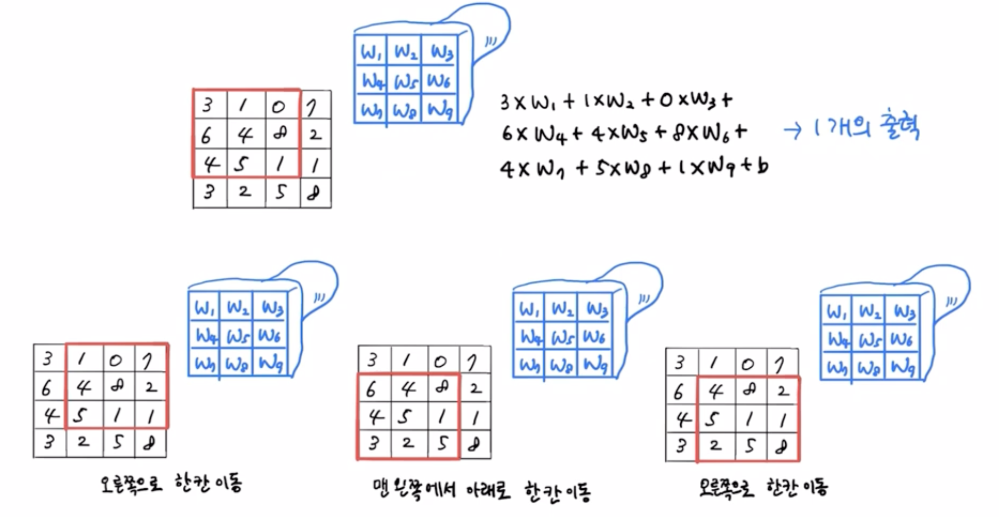

### 패딩(Padding)


- 개념: 입력 데이터나 feature map의 가장자리에 추가 픽셀을 덧붙이는 기법
- 목적: 
  - 출력 크기 유지: 각 레이어마다 출력 크기가 줄어들면 결국엔 데이터 자체가 사라짐 
  - 가장자리 정보 보전: 중앙의 값은 여러번 계산되지만 가장 자리의 값은 적게 계산되어 중요한 데이터가 처리되지 않을 가능성 있음  
- 방법: 입력 데이터 가장자리를 0으로 채움. 이 방법을 Zero Padding이라고 함.   

### 풀링(Pooling)
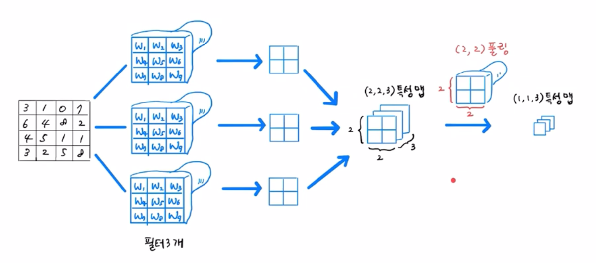

- 개념: 특성맵의 차원을 축소하는 것
- 목적: 메모리 사용량 절감과 학습속도 향상
- 방법: 
  - 각 영역의 최대값 또는 평균값을 선택하여 구성. 풀링층이라는 새로운 레이어를 만듦
  - 스트라이드(커널의 이동 단위)는 풀링 결과로 나오는 특성맵의 차원과 동일함 
    예) 2*2 특성맵을 만들려면 스트라이드는 2여야 함  

### 합성곱신경망의 전체 처리 순서   
순전파 -> 손실 계산 -> 역전파 -> 필터 가중치 조정을 반복하면서 학습함       
   
    
합성곱신경만 처리는 기본적으로 3차원이어야 함   
따라서 2차원인 경우 채널(깊이)이 1개인 3차원 배열로 변환하여 처리함.    

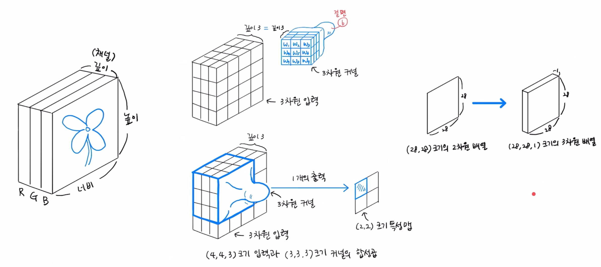

| [Top](#목차) |

---

## 이미지를 위한 ANN:합성곱 신경망을 사용한 이미지 분류

### 케라스를 사용한 예제
**1.첫번째 합성곱 층**         
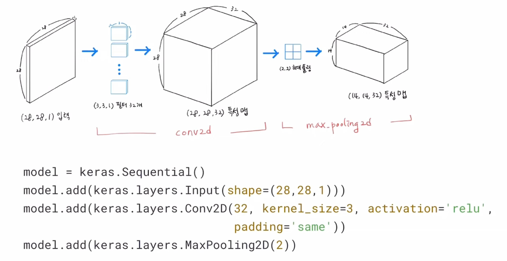

```
model = keras.Sequential()

model.add(keras.layers.Conv2D(32, kernel_size=3, activation='relu',
                              padding='same', input_shape=(28,28,1)))

model.add(keras.layers.MaxPooling2D(2))
```

**2.두번째 합성곱층과 밀집 층**    
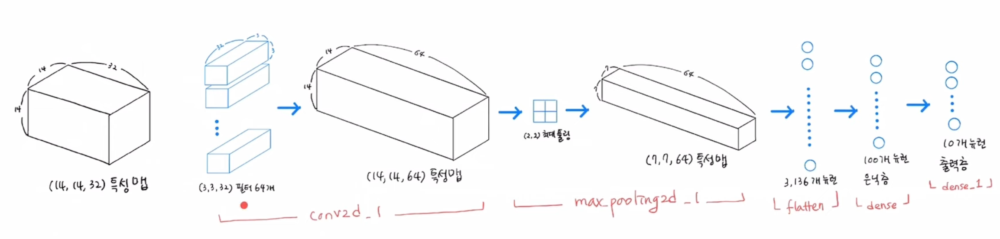
```
model.add(keras.layers.Conv2D(64, kernel_size=(3,3), activation='relu',
                              padding='same'))
model.add(keras.layers.MaxPooling2D(2))

model.add(keras.layers.Flatten())
model.add(keras.layers.Dense(100, activation='relu'))
model.add(keras.layers.Dropout(0.4))
model.add(keras.layers.Dense(10, activation='softmax'))
```

합성곱층과 밀집층 정보 표시
```
model.summary()
```


**3.모델 컴파일과 훈련**     
```
model.compile(optimizer='adam', loss='sparse_categorical_crossentropy',
              metrics=['accuracy'])

checkpoint_cb = keras.callbacks.ModelCheckpoint('best-cnn-model.keras',
                                                save_best_only=True)
early_stopping_cb = keras.callbacks.EarlyStopping(patience=2,
                                                  restore_best_weights=True)

history = model.fit(train_scaled, train_target, epochs=20,
                    validation_data=(val_scaled, val_target),
                    callbacks=[checkpoint_cb, early_stopping_cb])
```

**4.모델 훈련 결과 표시**    
1)에포크에 따른 손실점수 표시         
```
import matplotlib.pyplot as plt

plt.plot(history.history['loss'])
plt.plot(history.history['val_loss'])
plt.xlabel('epoch')
plt.ylabel('loss')
plt.legend(['train', 'val'])
plt.show()
```

5번 에포크 이후에는 검증점수가 더 이상 줄어들지 않아 2번의 에포크까지 한 후 7번째 에포크에서 중단됨   

2)모델 평가      
```
model.evaluate(val_scaled, val_target)
```
결과: 약 92% 정확도이고 손실점수는 약 0.22(오차점수. 0가 가까울 수록 좋음. 0.22는 양호)
```
375/375 ━━━━━━━━━━━━━━━━━━━━ 1s 3ms/step - accuracy: 0.9234 - loss: 0.2096
[0.22005362808704376, 0.9202499985694885]
```

**5.모델을 이용한 예측**    
검증 데이터 셋트의 첫번째 데이터가 무엇인지 예측     
1)이미지 그려보기       
가방인듯 함
```
plt.imshow(val_scaled[0].reshape(28, 28), cmap='gray_r')
plt.show()
```
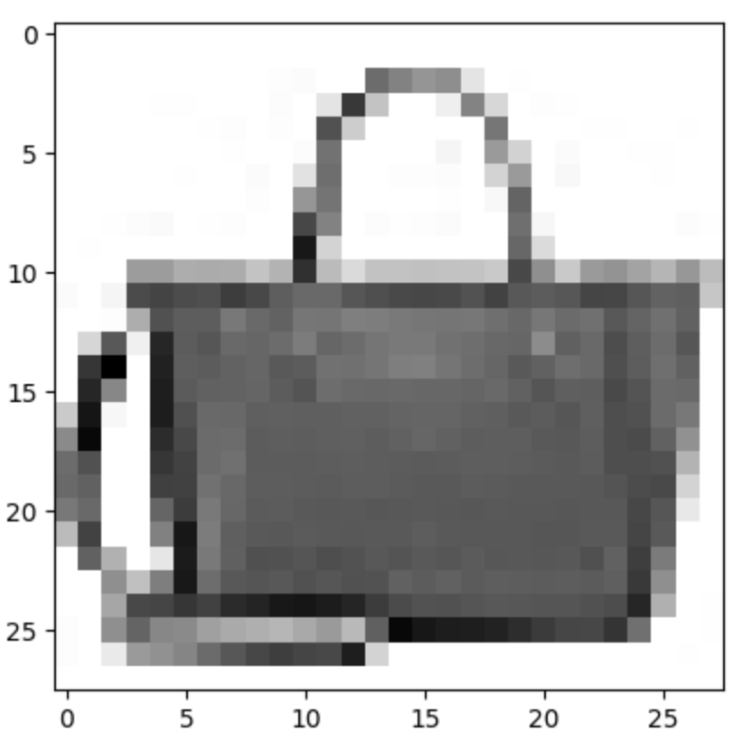

2)진짜 가방인지 예측 결과 보기
```
preds = model.predict(val_scaled[0:1])
print(preds)
```
결과:
9번째 Class로 예측함   
```
[[2.4567913e-17 4.5715461e-23 8.8957614e-20 6.0725004e-18 8.0334706e-18
  1.5484204e-18 1.5557679e-18 6.1831409e-16 1.0000000e+00 3.3490770e-19]]
```

각 Class의 확률값을 그래프로 그려봄
```
plt.bar(range(1, 11), preds[0])
plt.xlabel('class')
plt.ylabel('prob.')
plt.show()
```


3)Class 명 구하기
```
classes = ['티셔츠', '바지', '스웨터', '드레스', '코트',
           '샌달', '셔츠', '스니커즈', '가방', '앵클 부츠']

import numpy as np
print(classes[np.argmax(preds)]). #결과: 가방
```

**6.테스트 데이터로 모델 평가**     
```
test_scaled = test_input.reshape(-1, 28, 28, 1) / 255.0

model.evaluate(test_scaled, test_target)
```

결과: 약 91% 정확도, 손실점수는 약 0.25 
```
313/313 ━━━━━━━━━━━━━━━━━━━━ 2s 4ms/step - accuracy: 0.9100 - loss: 0.2590
[0.24962453544139862, 0.9114000201225281]
```

| [Top](#목차) |

---

## 이미지를 위한 ANN:합성곱 신경망의 시각화

아래와 같이 훈련된 모델을 로딩함    


### 합성곱 모델의 레이어와 가중치 확인   

**1.모델 로딩 및 레이어 구성 확인**       
```
import tensorflow as tf
from tensorflow import keras

!wget https://github.com/rickiepark/hg-mldl/raw/master/best-cnn-model.keras
model = keras.models.load_model('best-cnn-model.keras')

model.layers     
```
  
결과:  
```
[<Conv2D name=conv2d, built=True>,
 <MaxPooling2D name=max_pooling2d, built=True>,
 <Conv2D name=conv2d_1, built=True>,
 <MaxPooling2D name=max_pooling2d_1, built=True>,
 <Flatten name=flatten, built=True>,
 <Dense name=dense, built=True>,
 <Dropout name=dropout, built=True>,
 <Dense name=dense_1, built=True>]
```
참고) 입력층이 레이어에 안 나타나는 이유    
아래와 같이 파라미터로 입력층을 설정하면 암묵적 입력층이 생성되고 별도의 입력층이 생기지 않음     
```
model = Sequential()
model.add(keras.layers.Conv2D(32, kernel_size=3, activation='relu',
                              padding='same', input_shape=(28,28,1)))
```
명시적 입력층이 생기게 하려면 아래와 같이 변경해야 함    
```
model = Sequential()
model.add(Input(shape=(28, 28, 1)))      # 명시적 입력층
model.add(keras.layers.Conv2D(32, kernel_size=3, activation='relu',
                              padding='same')
```
  
**2.첫번째 레이어인 합성층의 커널과 바이어스 확인**      
```
conv = model.layers[0]

print(conv.weights[0].shape, conv.weights[1].shape) # 결과 (3, 3, 1, 32) (32,)
```

1)결과 설명:     
conv.weights[0].shape → (3, 3, 1, 32): 커널(필터)  
```
(3, 3, 1, 32)
 │  │  │  └── 필터 개수: 32개
 │  │  └───── 입력 채널 수: 1 (흑백 이미지)
 │  └──────── 필터 높이: 3
 └─────────── 필터 너비: 3
```
conv.weights[1].shape → (32,): 바이어스    
각 필터마다 **1개의 바이어스** 값이 존재 → 32개 필터 = 32개 바이어스     
  
**총 파라미터 수**: (3 × 3 × 1 × 32) + 32 = **288 + 32 = 320개**    

2)커널 가중치값    
```
kernels = conv.weights[0].numpy()
filter_0 = kernels[:, :, :, 0]  # 첫번째 필터값만 확인  
print(filter_0.squeeze())  # 2D로 보기 쉽게
```
결과:   
```
[[ 0.2742824  -0.23858844 -0.14460737]
 [ 0.19392076 -0.00764737  0.01478171]
 [-0.00868339 -0.0895784   0.05076608]]
```

3)바이어스 값 
```
biases = conv.weights[1].numpy()  # 또는 conv.get_weights()[1]
print(biases)  # 32개의 바이어스 값
```
결과:
```
[-9.8264171e-03 -2.5412224e-02  6.3462020e-03 -7.9317461e-04
  1.1249937e-02 -1.7684806e-02 -1.7509054e-01 -1.1502851e-02
  3.6798655e-03 -1.1050852e-02  1.1385297e-03  5.4643098e-03
 -1.1137835e-02  1.3938491e-01 -3.3817443e-05 -4.5283418e-02
  2.0456554e-02 -1.3015689e-01 -1.1310920e-02  1.0778768e-03
 -6.5029832e-03  6.8443930e-03  3.7618491e-03 -5.7523353e-03
 -5.9535120e-02  1.2934269e-01 -4.5140348e-02 -1.5515901e-02
 -3.9069828e-02 -5.1507261e-03 -5.3907048e-02 -1.5607314e-02]
```

4)가중치 분포 그리기     
```
conv_weights = conv.weights[0].numpy()
plt.hist(conv_weights.reshape(-1, 1))
plt.xlabel('weight')
plt.ylabel('count')
plt.show()
```
결과:
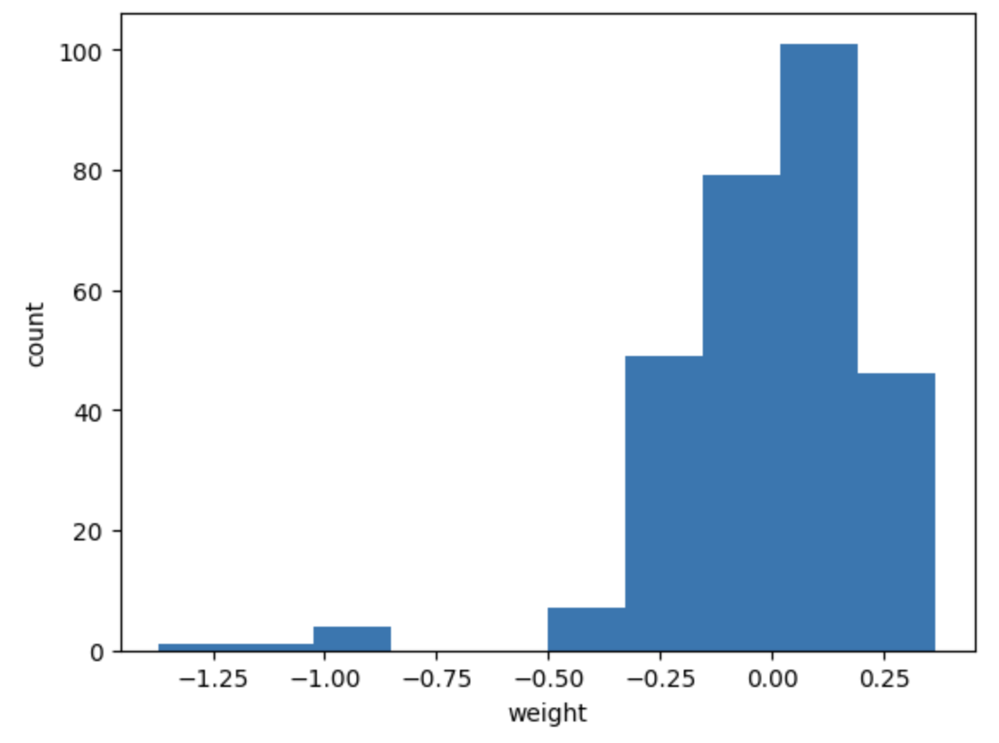

- 0을 중심으로 종모양으로 분산되는게 이상적임.   
- 현재 가중치 분포는 약간의 이상치가 있으나 양호하다고 판단됨.   
- 약간의 이상치는 특정 필터가 강한 특징(예: 엣지)을 학습한 결과로 보임
- 엣지란 사람 얼굴의 눈, 코, 입의 윤곽선과 같이 이미지에서 밝기나 색상이 갑자기 변하는 경계선을 의미함   

### 층의 가중치 시각화

첫번째 레이어(conv.weights[0].numpy())의 모든 필터의 가중치값을 시각화함   
```
fig, axs = plt.subplots(2, 16, figsize=(15,2))

for i in range(2):
    for j in range(16):
        axs[i, j].imshow(conv_weights[:,:,0,i*16 + j], vmin=-0.5, vmax=0.5)
        axs[i, j].axis('off')

plt.show()
```
결과:


밝은색은 양수값, 어두운색은 음수값에 가까운 가중치를 나타냄.   
모델 학습전에 필터의 가중치는 아래와 같음. 즉, 학습 후 각 필터가 가중치를 특징에 맞게 조정되었음을 알 수 있음.   


### 함수형 API를 이용한 모델 생성
- 함수형 API 개념: 레이어를 "함수처럼 호출"하는 방식   
  ```python
  inputs = keras.Input(shape=(784,))
  dense1 = keras.layers.Dense(100, activation='relu')
  dense2 = keras.layers.Dense(10, activation='softmax')

  hidden = dense1(inputs)    # dense1 레이어를 함수처럼 호출
  outputs = dense2(hidden)   # dense2 레이어를 함수처럼 호출

  model = keras.Model(inputs, outputs)
  ```
  **레이어 객체를 마치 함수를 호출하듯 `( )` 괄호와 함께 사용  

- 목적: 복잡한 모델 구조(다중 입력, 다중 출력, 분기, 병합)를 자유롭게 설계하기 위함   
  ```python
  # 분기와 병합이 가능
  branch1 = dense_a(inputs)
  branch2 = dense_b(inputs)
  merged = keras.layers.concatenate([branch1, branch2])
  ```

  Sequential로는 이런 구조를 만들 수 없음   

- 방법: Sequential 방식을 함수형 API 방식으로 변경  
  ```python
  # Sequential 방식 (선언적)
  model = keras.Sequential([
      keras.layers.Dense(100, activation='relu'),
      keras.layers.Dense(10, activation='softmax')
  ])

  # Functional 방식 (함수 호출)
  hidden = dense1(inputs)   # ← 함수 호출 문법!
  outputs = dense2(hidden)  # ← 함수 호출 문법!
  ```

- 함수형 API 특징:  
  - 함수 합성(Function Composition)
    - `f(g(x))` 처럼 함수를 연쇄적으로 적용하는 패턴
    - `dense2(dense1(inputs))` ← 이렇게도 쓸 수 있습니다
  - Callable 객체 활용
   - Python에서 `__call__` 메서드를 가진 객체는 함수처럼 호출 가능
   - Keras 레이어는 이 패턴을 활용하여 `layer(tensor)` 형태로 사용
  - 데이터 흐름을 명시적으로 표현
    - 입력 → 변환 → 출력의 흐름이 함수 호출 체인으로 표현됨

- 함수형 API로 모델 생성 예시  
  ```
  from tensorflow.keras import Input, Model
  from tensorflow.keras.layers import Conv2D, MaxPooling2D, Flatten, Dense

  # 함수형 API로 처음부터 모델 생성
  inputs = Input(shape=(28, 28, 1))
  x = Conv2D(32, (3,3), activation='relu')(inputs)
  x = MaxPooling2D((2,2))(x)
  x = Conv2D(64, (3,3), activation='relu')(x)
  x = MaxPooling2D((2,2))(x)
  x = Flatten()(x)
  x = Dense(100, activation='relu')(x)
  outputs = Dense(10, activation='softmax')(x)

  model = Model(inputs, outputs)
  ```

### 합성층별 결과를 시각화 하기      
입력에 가까운 합성곱 층은 경계, 색깔 같은 저수준의 특징을 감지하고,   
출력에 가까운 합성층은 추상적인 특징을 감지함을 체험합니다.      

**1.첫번째 합성층 모델의 결과 시각화**          
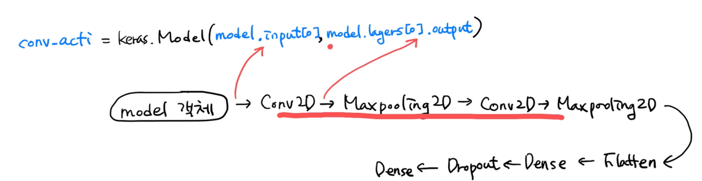
```
conv_acti = keras.Model(model.inputs[0], model.layers[0].output)

(train_input, train_target), (test_input, test_target) = keras.datasets.fashion_mnist.load_data()

inputs = train_input[0:1].reshape(-1, 28, 28, 1)/255.0
feature_maps = conv_acti.predict(inputs)
print(feature_maps.shape) # 결과: (1, 28, 28, 32)
```

시각화:  
```
fig, axs = plt.subplots(4, 8, figsize=(15,8))

for i in range(4):
    for j in range(8):
        axs[i, j].imshow(feature_maps[0,:,:,i*8 + j])
        axs[i, j].axis('off')

plt.show()
```

결과:  
**각 필터가 특정 특징에 특화되어 학습하는 것을 알 수 있음**  
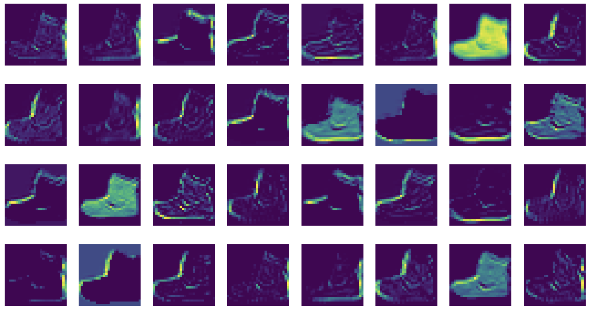  


**2.첫번째 합성층 모델의 결과 시각화**   

두번째 합성층은 아래와 같이 2*2로 Max Pooling하였고,   
필터를 64개로 늘렸으므로 특성맵이 '(1, 14, 14, 64)'으로 나옮    
```
model.add(keras.layers.Conv2D(32, kernel_size=3, activation='relu',
                              padding='same', input_shape=(28,28,1)))
model.add(keras.layers.MaxPooling2D(2))
model.add(keras.layers.Conv2D(64, kernel_size=(3,3), activation='relu',
                              padding='same'))
```

```
conv2_acti = keras.Model(model.inputs, model.layers[2].output)
feature_maps = conv2_acti.predict(train_input[0:1].reshape(-1, 28, 28, 1)/255.0)
print(feature_maps.shape) # 결과 (1, 14, 14, 64)
```

각 필터의 학습 결과를 시각화   
**각 필터를 통한 학습결과가 상당히 추상적으로 변경됨을 알 수 있음**      
```
fig, axs = plt.subplots(8, 8, figsize=(12,12))

for i in range(8):
    for j in range(8):
        axs[i, j].imshow(feature_maps[0,:,:,i*8 + j])
        axs[i, j].axis('off')

plt.show()
```


| [Top](#목차) |

---

## 순차 텍스트를 위한 ANN:순차 데이터와 순환 신경망
순환신경망(RNN: Recurrent Neural Network)은 순서가 있는 텍스트나 시계열 데이터를 처리하는 인공신경망입니다.

### 기본 개념  
- 목적: 순서가 있는 데이터에서 **이전 정보를 기억하며 다음에 올 것을 예측**하기 위함
- 방법: 각 시점에서 **현재입력+이전기억을 함께 처리**하고, **업데이트된 기억을 다음 시점에 전달**    
- 예시: 
   

- (중요) 각 시점에서 사용되는 **가중치 W_h 와 W_x는 일관된 처리 규칙 적용을 위해 동일한 값을 사용**함       
- 활성화 함수 tanh     
     
  - 출력값을 **-1 ~ +1 사이**로 제한
  - 기억이 너무 커지거나 작아지는 것을 방지
  - 그래프처럼 부드러운 S자 곡선

### 용어 정리
  
| 용어 | 영어 | 정의 | 비유 (건물 점검) |
|------|------|------|------------------|
| **샘플** | Sample | 입력 데이터 | - |
| **순환층** | Recurrent Layer | RNN이 작동하는 한 겹의 층 | 건물의 한 층 |
| **셀** | Cell | 매번 같은 방식으로 입력을 처리하는 계산기 | 점검팀 (같은 팀이 모든 방 점검) |
| **뉴런** | Neuron | 셀 안에서 각자 맡은 특징을 추적하는 담당자 | 점검 전문가 (안전/위생/시설) |
| **타임스텝** | Timestep | 입력을 처리하는 각 단계 | 각 방 (101호→102호→103호→104호) |
| **은닉상태** | Hidden State | 각 타임스텝의 결과로 누적된 기억 | 점검 체크리스트 (다음 방에 전달) |


```
건물 1층 (순환층)
━━━━━━━━━━━━━━━━━━━━━━━━━━━━━━━━━━━━━━━━━━━━
  ┌─────┐   ┌─────┐   ┌─────┐   ┌─────┐
  │ 101 │ → │ 102 │ → │ 103 │ → │ 104 │   ← 타임스텝 (방)
  └─────┘   └─────┘   └─────┘   └─────┘
      ↓         ↓         ↓         ↓
   [점검팀]  [점검팀]  [점검팀]  [점검팀]     ← 셀 (같은 팀!)
   안전/위생  안전/위생  안전/위생  안전/위생   ← 뉴런 (전문가)
      ↓         ↓         ↓         ↓
     h₁   →    h₂   →    h₃   →    h₄       ← 은닉상태 (체크리스트)
   
   "이전 방 점검 결과를 참고해서 다음 방 점검"
```
     
### 뉴런 간 상호 참조   

  
뇌의 비유로 이해: 뉴런 3개
```
📚 "나는 학교에"를 이해할 때

이전 시점의 뇌 상태:
├─ 언어영역(r₁): "주어 파악됨"
├─ 문법영역(r₂): "1인칭 확인"  
└─ 감정영역(r₃): "중립 상태"

        ↓ 새 단어 "학교에" 처리 시

현재 시점 각 영역은 이전의 모든 영역을 참조:
├─ 언어영역(r₁): 이전 언어+문법+감정 → "장소 추가"
├─ 문법영역(r₂): 이전 언어+문법+감정 → "목적어 확인"
└─ 감정영역(r₃): 이전 언어+문법+감정 → "학교=일상"

→ 뇌의 각 영역이 다른 영역의 정보도 통합하여 처리
→ 이것이 RNN에서 뉴런 간 상호 참조의 의미
```

### 예제로 RNN 동작원리 이해   


### RNN 핵심 공식
- 은닉 상태 업데이트 (Hidden State Update)    
  $$h_t = \tanh(W_h \cdot h_{t-1} + W_x \cdot x_t + b_h)$$

  | 기호 | 의미 |
  |------|------|
  | $h_t$ | 현재 시점의 은닉 상태 |
  | $h_{t-1}$ | 이전 시점의 은닉 상태 | 
  | $x_t$ | 현재 시점의 입력 |
  | $W_h$ | 은닉 가중치 |
  | $W_x$ | 입력 가중치 |
  | $b_h$ | 은닉층 편향 |
  | $\tanh$ | 활성화 함수(출력 범위: -1 ~ +1) |

  * 입력 가중치, 은닉 가중치의 크기
  ```
  Wx 크기 = (뉴런 개수, 입력 차원) 
  Wh 크기 = (뉴런 개수, 뉴런 개수) 
  ```
  예시)
  ```
  뉴런이 10개면 타임스텝 t-1의 은닉 상태 (이전 상태)는 아래와 같이 10개  
  h_{t-1} = [0.2, 0.5, 0.1, 0.8, 0.3, 0.4, 0.6, 0.7, 0.2, 0.9]
            ↑    ↑    ↑    ↑    ↑    ↑    ↑    ↑    ↑    ↑
            뉴런1 뉴런2 뉴런3 뉴런4 뉴런5 뉴런6 뉴런7 뉴런8 뉴런9 뉴런10
  ```
  은닉 가중치 Wh는 아래 예와 같이 10 * 10이 됨
  ```
                                  이전 시점 뉴런 (입력)
                  1    2    3    4    5    6    7    8    9   10
                ┌────────────────────────────────────────────────--┐
  현재 시점  1    │ 0.1  0.3  0.2  0.1  0.4  0.2  0.1  0.3  0.2  0.1 │
  뉴런       2   │ 0.2  0.1  0.4  0.3  0.1  0.2  0.3  0.1  0.4  0.2 │
  (출력)     3   │ 0.3  0.2  0.1  0.2  0.3  0.1  0.2  0.4  0.1  0.3 │
            4   │ ...                                              │
            5   │ ...                                              │
            6   │ ...                                              │
            7   │ ...                                              │
            8   │ ...                                              │
            9   │ ...                                              │
            10  │ 0.2  0.1  0.3  0.4  0.2  0.1  0.3  0.2  0.1  0.4 │
                └───────────────────────────────────────────────--─┘
                            Wh: 10 x 10 행렬
  ```

- 출력 계산 (Output Calculation)   
  $$y_t = \text{softmax}(W_y \cdot h_t + b_y)$$

  | 기호 | 의미 |
  |------|------|
  | $y_t$ | 현재 시점의 출력 (예측 확률) |
  | $W_y$ | 출력 가중치 | 
  | $h_t$ | 현재 시점의 은닉 상태 |
  | $b_y$ | 출력층 편향 | 
  | $\text{softmax}$ | 확률 변환 함수(총합 = 1) |

### 합성곱 신경망과 비교   

| 구분 | 순환신경망 (RNN) | 합성곱신경망 (CNN) |
|------|------------------|-------------------|
| **영문명** | Recurrent Neural Network | Convolutional Neural Network |
| **주요 목적** | 순서/시간 데이터 처리 | 공간/이미지 데이터 처리 |
| **핵심 아이디어** | 시간에 따른 기억 전달 | 지역적 패턴 추출 |
| **비유** | 📖 책을 순서대로 읽는 독자 | 🔍 돋보기로 그림을 훑는 관찰자 |
| **처리 단위** | 셀 (Cell) | 필터/커널 (Filter/Kernel) |
| **핵심 연산** | 순환 연산 (Recurrence) | 합성곱 연산 (Convolution) |
| **내부 상태** | 은닉 상태 h (기억) | 특성 맵 (Feature Map) |
| **가중치 공유** | 모든 시점에서 동일 | 모든 위치에서 동일 |
| **연결 특성** | 시간적 연결 | 공간적 지역 연결 |
| **적용 분야** | 번역, 음성인식, 챗봇 | 이미지 분류, 객체 탐지 |

### 각 입력은 벡터로 변환
- 벡터는 Feature 값의 배열을 의미    
  예) '키'라는 Feature의 value는 '175'이고 '몸무게'라는 Feature의 value는 70일 때 Vector는 [175, 70]    

- 'I am a boy'의 벡터 변환 예제   
  ```
            [명사성, 동사성, 인칭성]
  "I"   →   [0.2,   0.1,   0.9]   ← 인칭대명사 (인칭성↑)
  "am"  →   [0.1,   0.9,   0.7]   ← 동사 (동사성↑)
  "a"   →   [0.3,   0.0,   0.0]   ← 관사 (모두 낮음)
  "boy" →   [0.9,   0.1,   0.2]   ← 명사 (명사성↑)
  ```

### 순환 신경망을 사용한 예측 전체 과정 개념도
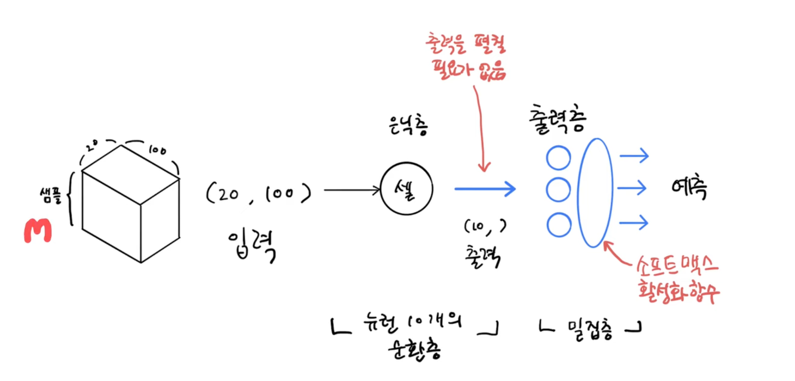

- 샘플은 20개의 타임스텝(단어가 20개)이고 각 타임스텝의 단어는 200차원 벡터로 변환되므로 입력층은 (20, 100)배열임 
- 뉴런이 몇개인지는 표시 안됨
- 은닉층은 순환층과 동일한 의미이며 10개 순환층 존재
- 각 순환층마다 출력이 1개이므로 10개의 출력이 출력층에 생성됨 


| [Top](#목차) |

---

## 순차 텍스트를 위한 ANN:순환신경망으로 IMDB리뷰 분류하기

영화 소개 사이트인 IMDB의 리뷰를 분류하는 순환신경망 모델을 케라스를 이용하여 만듭니다.    

### IMDB리뷰 데이터셋  
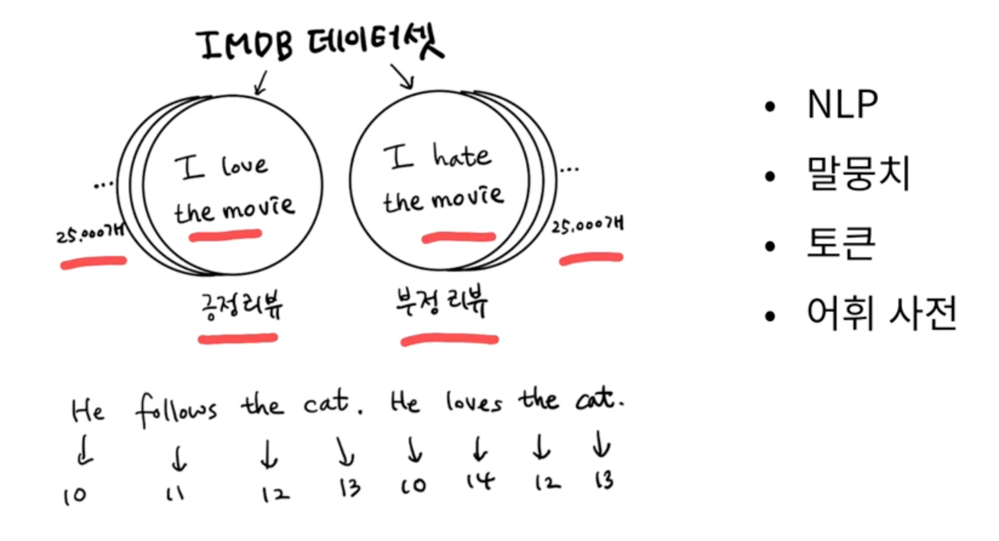
  
| 용어 | 원문 영어 | 의미 | 예시 (이미지 기반) |
|------|-----------|------|-------------------|
| **NLP** | Natural Language Processing (자연어 처리) | 컴퓨터가 **인간의 언어를 이해하고 처리하는 AI 기술** 분야 | IMDB 리뷰를 긍정/부정으로 분류하는 감성 분석 |
| **말뭉치** | Corpus | 특정 목적을 위해 수집된 대량의 **텍스트 데이터 집합** | IMDB 데이터셋: 긍정리뷰 25,000개 + 부정리뷰 25,000개 = 총 50,000개 |
| **토큰** | Token | **텍스트를 의미 있는 최소 단위(단어, 문장부호 등)로 분리한 것** | "He follows the cat." → `He`, `follows`, `the`, `cat` (4개 토큰) |
| **어휘 사전** | Vocabulary | 말뭉치에 등장하는 **고유 토큰들을 숫자 인덱스로 매핑한 목록** | `He`→10, `follows`→11, `the`→12, `cat`→13, `loves`→14 |

### 예제  
- 케라스의 데이터셋에서 IMDB 데이터셋 로딩   
  ```
  from tensorflow.keras.datasets import imdb

  (train_input, train_target), (test_input, test_target) = imdb.load_data(
      num_words=200)
  ``` 
    
  참고) `num_words=200`은 **어휘 사전의 크기를 200개로 제한**한다는 의미    
  구체적으로:   
  - IMDB 데이터셋은 영화 리뷰 텍스트를 **단어 빈도 순위에 따른 정수 인덱스**로 인코딩해 제공
  - `num_words=200`으로 설정하면 **가장 자주 등장하는 상위 200개 단어만** 유지됨 
  - 200위 밖의 단어들은 모두 `2` (OOV, Out-Of-Vocabulary)로 대체됨  
  - 인덱스 체계: `0`=패딩, `1`=시퀀스 시작, `2`=OOV, `3`부터 실제 단어
  ```python
  # 예시: 원본이 [1, 14, 22, 16, 43, 530, 973] 였다면
  # num_words=200 적용 시 → [1, 14, 22, 16, 43, 2, 2]
  # (530, 973은 200위 밖이므로 2로 대체)
  ```

- 말뭉치(Corpus) 확인  
  긍정 말뭉치와 부정 말뭉치가 각각 25000개 있음  
  ```
  print(train_input.shape, test_input.shape) # 결과: (25000, ) (25000, 0)
  ``` 

  첫번째 훈련 데이터 리뷰의 길이 확인   
  ```
  print(len(train_input[0]))  #결과: 218
  ```

  첫번째 훈련 데이터 리뷰의 벡터 확인   
  ```
  print(train_input[0])
  결과: 
  [1, 14, 22, 16, 43, 2, 2, 2, 2, 65, 2, 2, 66, 2, 4, 173, 36, 2, 5, 25, 100, 43, 2, 112, 50, 2, 2, 9, 35, 2, 2, 5, 150, 4, 172, 112, 167, 2, 2, 2, 39, 4, 172, 2, 2, 17, 2, 38, 13, 2, 4, 192, 50, 16, 6, 147, 2, 19, 14, 22, 4, 2, 2, 2, 4, 22, 71, 87, 12, 16, 43, 2, 38, 76, 15, 13, 2, 4, 22, 17, 2, 17, 12, 16, 2, 18, 2, 5, 62, 2, 12, 8, 2, 8, 106, 5, 4, 2, 2, 16, 2, 66, 2, 33, 4, 130, 12, 16, 38, 2, 5, 25, 124, 51, 36, 135, 48, 25, 2, 33, 6, 22, 12, 2, 28, 77, 52, 5, 14, 2, 16, 82, 2, 8, 4, 107, 117, 2, 15, 2, 4, 2, 7, 2, 5, 2, 36, 71, 43, 2, 2, 26, 2, 2, 46, 7, 4, 2, 2, 13, 104, 88, 4, 2, 15, 2, 98, 32, 2, 56, 26, 141, 6, 194, 2, 18, 4, 2, 22, 21, 134, 2, 26, 2, 5, 144, 30, 2, 18, 51, 36, 28, 2, 92, 25, 104, 4, 2, 65, 16, 38, 2, 88, 12, 16, 2, 5, 16, 2, 113, 103, 32, 15, 16, 2, 19, 178, 32]
  ```

  첫번째 훈련 데이터 리뷰의 텍스트 확인    
  ```
  word_index = imdb.get_word_index()
  reverse_index = {v+3: k for k, v in word_index.items()}
  reverse_index[1] = '<START>'
  reverse_index[2] = '<OOV>'

  print([reverse_index.get(i, '?') for i in train_input[0][:218]])

  결과: 
  ['<START>', 'this', 'film', 'was', 'just', '<OOV>', '<OOV>', '<OOV>', '<OOV>', 'story', '<OOV>', '<OOV>', 'really', '<OOV>', 'the', 'part', 'they', '<OOV>', 'and', 'you', 'could', 'just', '<OOV>', 'being', 'there', '<OOV>', '<OOV>', 'is', 'an', '<OOV>', '<OOV>', 'and', 'now', 'the', 'same', 'being', 'director', '<OOV>', '<OOV>', '<OOV>', 'from', 'the', 'same', '<OOV>', '<OOV>', 'as', '<OOV>', 'so', 'i', '<OOV>', 'the', 'fact', 'there', 'was', 'a', 'real', '<OOV>', 'with', 'this', 'film', 'the', '<OOV>', '<OOV>', '<OOV>', 'the', 'film', 'were', 'great', 'it', 'was', 'just', '<OOV>', 'so', 'much', 'that', 'i', '<OOV>', 'the', 'film', 'as', '<OOV>', 'as', 'it', 'was', '<OOV>', 'for', '<OOV>', 'and', 'would', '<OOV>', 'it', 'to', '<OOV>', 'to', 'watch', 'and', 'the', '<OOV>', '<OOV>', 'was', '<OOV>', 'really', '<OOV>', 'at', 'the', 'end', 'it', 'was', 'so', '<OOV>', 'and', 'you', 'know', 'what', 'they', 'say', 'if', 'you', '<OOV>', 'at', 'a', 'film', 'it', '<OOV>', 'have', 'been', 'good', 'and', 'this', '<OOV>', 'was', 'also', '<OOV>', 'to', 'the', 'two', 'little', '<OOV>', 'that', '<OOV>', 'the', '<OOV>', 'of', '<OOV>', 'and', '<OOV>', 'they', 'were', 'just', '<OOV>', '<OOV>', 'are', '<OOV>', '<OOV>', 'out', 'of', 'the', '<OOV>', '<OOV>', 'i', 'think', 'because', 'the', '<OOV>', 'that', '<OOV>', 'them', 'all', '<OOV>', 'up', 'are', 'such', 'a', 'big', '<OOV>', 'for', 'the', '<OOV>', 'film', 'but', 'these', '<OOV>', 'are', '<OOV>', 'and', 'should', 'be', '<OOV>', 'for', 'what', 'they', 'have', '<OOV>', "don't", 'you', 'think', 'the', '<OOV>', 'story', 'was', 'so', '<OOV>', 'because', 'it', 'was', '<OOV>', 'and', 'was', '<OOV>', 'life', 'after', 'all', 'that', 'was', '<OOV>', 'with', 'us', 'all']
  ```
  
  훈련 데이터의 정답 데이터 셋트는 총 25000개이고 긍정은 1, 부정은 0으로 채워져 있음.  
  일부 값만 찍어보면 아래와 같음 
  ```
  print(train_target[:20])
  결과: [1 0 0 1 0 0 1 0 1 0 1 0 0 0 0 0 1 1 0 1]
  ```

- 학습데이터의 벡터 길이 평균값과 중앙값 구하기    
  벡터화 한 각 리뷰의 길이의 평균값과 중앙값을 구함으로써    
  리뷰의 길이가 어떻게 분포되었는지를 대략 추정할 수 있음   

  **예시:**
  ```python
  data = [100, 120, 130, 140, 150, 2000]  # 2000이 이상치

  np.mean(data)    # 440 (이상치에 끌려감)
  np.median(data)  # 135 (실제 중심에 가까움)
  ```
  위와 같이 평균값이 중앙값보다 크다면 평균을 사용하면 대다수 리뷰를 커버하지 못할 수 있음    
  그래서 실무에서는 중앙값 또는 **75~90 백분위수**를 많이 사용함   

  ```python
  np.percentile(lengths, 90)  # 상위 90% 커버하는 길이
  ```
  
  예제에서 평균값과 중앙값을 구함   
  예제도 평균값이 중앙값보다 크므로 이상치(너무 크거나 너무 작음)가 많음을 추정할 수 있음      
  ```
  from sklearn.model_selection import train_test_split

  train_input, val_input, train_target, val_target = train_test_split(
    train_input, train_target, test_size=0.2, random_state=42)

  import numpy as np

  lengths = np.array([len(x) for x in train_input])

  print(np.mean(lengths), np.median(lengths))
  # 결과: 237.9088125 179.0   
  ```

  실제 리뷰 길이의 히스토그램을 그려보면 아래와 같음   
  ```
  import matplotlib.pyplot as plt

  plt.hist(lengths)
  plt.xlabel('length')
  plt.ylabel('frequency')
  plt.show()
  ```
  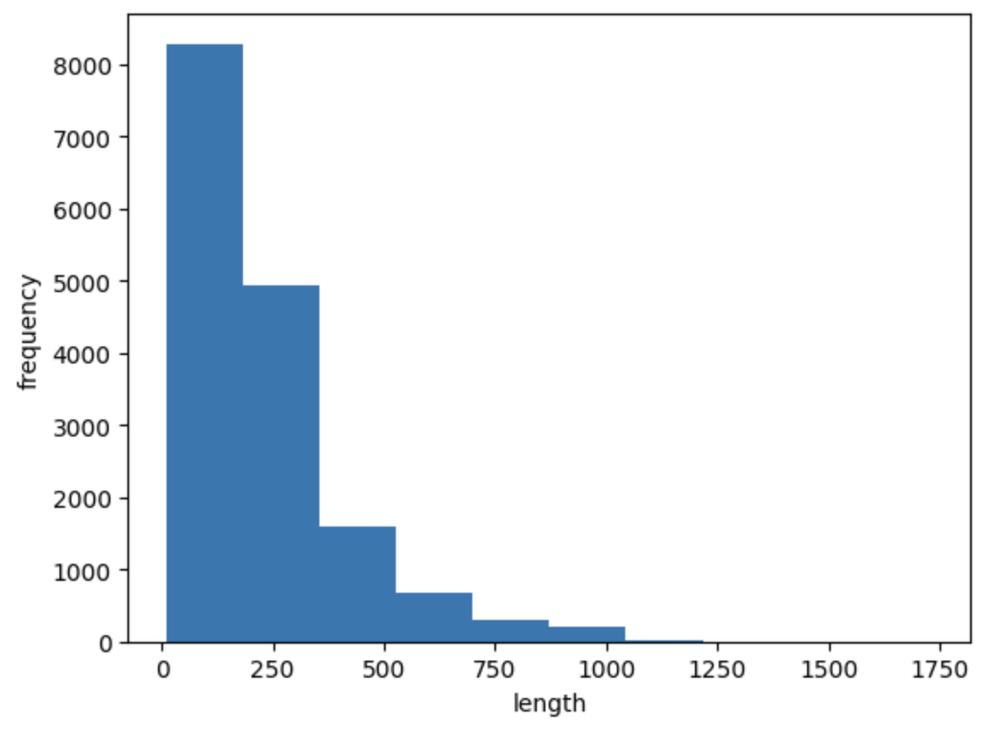

- 시퀀스 패딩: 
  각 학습데이터의 길이를 일정 길이로 맞추는 작업    
  지정한 길이 이하면 앞에 0을 채우고 이상이면 초과값은 버림.    

  아래와 같이 pad_sequence 함수 사용    
  20000개의 훈련 데이터의 길이가 100으로 동일하게 맞춰짐  
  ```
  from tensorflow.keras.preprocessing.sequence import pad_sequences

  train_seq = pad_sequences(train_input, maxlen=100)
  val_seq = pad_sequences(val_input, maxlen=100) #검증데이터 셋트도 패딩함  

  print(train_seq.shape)
  # 결과: (20000  100)
  ```   

  길이가 100 이하인 학습데이터 셋트를 찾아서 확인해 보면 앞에 0으로 채워져 있음을 알 수 있음    
  ```
  # 길이가 100 이하인 데이터의 인덱스 찾기
  short_indices = [i for i, x in enumerate(train_input) if len(x) <= 100]

  print(f"개수: {len(short_indices)}")
  print(f"인덱스: {short_indices[:10]}...")  # 처음 10개만 출력
  # 결과: 
  개수: 1800
  인덱스: [12, 25, 44, 56, 57, 59, 80, 118, 130, 131]...
  ```

  12번째 학습데이터의 벡터 확인   
  ```
  print(train_seq[12])
  # 결과: 
  [  0   0   0   0   0   0   0   0   0   0   0   0   0   0   0   0   0   0
   0   1  92   2   2   8 106  14   2   2   2  12   9   6   2   2   2  35
   2 119   2   2   2  84  37  28   2  57   2  18   2  85  50   9  57   2
  11  14  65  57 147   2  57 147   2  12   9   6   2   2   2  46   5   2
  17  36   2   5  12 152  60   2   4   2   2   7   2   2 193 148   2   2
   7 129 113   5   2  98  18 142  53   2]
  ```

- 순환신경망으로 모델 만들기   
  ```
  from tensorflow import keras

  model = keras.Sequential()

  model.add(keras.layers.SimpleRNN(8, input_shape=(100, 200)))
  model.add(keras.layers.Dense(1, activation='sigmoid'))  
  ```
    
  1)왜 순환층의 input 데이터 사이즈를  100, 200으로 지정했는가?      
  - 각 리뷰는 100개의 단어(토큰)로 구성. 시퀀스 길이가 100임. 타임스텝도 100이 될것임.   
  - 훈련데이터 세트(train_seq)와 검증데이터 세트(val_seq)의 각 리뷰는 어휘 사전(vocabulary)에서 단어 인덱스를 갖고 있음   
    예)  
    [ 1  92   2   2   8 106  14   2   2   2  12   9   6   2  ...] 
  - 이 단어 인덱스는 최대 200개인 어휘사전에서 몇번째인지를 나타냄   
    예) 'just'는 92번째, 'awesome'은 106번째  
  - 순환신경망은 이 단어인덱스를 그대로 처리하지 못함.    
    각 리뷰 데이터의 각 단어 인덱스(총 100개)를 200차원 벡터에서 해당 단어 인덱스 위치만 1이고 나머지는 0인 값으로 채운 배열로 변환해야 함. 이 방법을 원-핫 인코딩이라고 함.     
    예) 특정 리뷰의 벡터가 [ 3 4 .... ]와 같다면,    
    - 단어인덱스 3의 원-핫 인코딩 결과: [ 0 0 0 1 0 ....0 ]
    - 단어인덱스 4의 원-핫 인코딩 결과: [ 0 0 0 0 1 ....0 ]   
  - 그래서 그래서 input_shape를 **(100, 200)**으로 지정하는 것임   
    
  2)모델 파라미터 보기    
  ```
  model.summary()
  ```
  결과: 
  

  ```
  SimpleRNN 파라미터 공식:
    파라미터 = (입력 벡터차원 × 뉴런 수) + (뉴런 수 × 뉴런 수) + 바이어스

    계산:
    - input_shape=(100, 200) → 입력 벡터차원 = 200 (토큰/타임스텝 100, 각 토큰은 200차원 벡터)
    - units(=뉴런) = 8

    = (200 × 8) + (8 × 8) + 8
    = 1600 + 64 + 8
    = 1672

    각 항목의 의미:
    - 1600 (200 × 8): 입력 → 은닉 상태 가중치 (W_xh)
    - 64 (8 × 8): 이전 은닉 상태 → 현재 은닉 상태 가중치 (W_hh, 순환 연결)
    - 8: 편향(bias)

  밀집층:  
    파라미터 = (입력 뉴런 * 출력 뉴런) + 바이어스
          = 8 * 1 + 1 = 9
  ```

- 원-핫 인코딩   
  ```
  train_oh = keras.utils.to_categorical(train_seq)
  print(train_oh.shape) # 결과: (20000, 100, 200)
  ``` 
  첫번째 리뷰의 첫번째 단어(토큰)의 원-핫 인코딩 결과. 12번째까지만 표시 
  ```
  print(train_oh[0][0][:12])
  #결과: [0. 0. 0. 0. 0. 0. 0. 0. 0. 0. 1. 0.]
  ```

  검증데이터 셋트도 원-핫 인코딩 함    
  ```
  val_oh = keras.utils.to_categorical(val_seq)
  ```

- 순환신경망 모델 훈련
  ```
  rmsprop = keras.optimizers.RMSprop(learning_rate=1e-4)
  model.compile(optimizer=rmsprop, loss='binary_crossentropy',
                metrics=['accuracy'])

  checkpoint_cb = keras.callbacks.ModelCheckpoint('best-simplernn-model.keras',
                                                  save_best_only=True)
  early_stopping_cb = keras.callbacks.EarlyStopping(patience=3,
                                                    restore_best_weights=True)

  history = model.fit(train_oh, train_target, epochs=100, batch_size=64,
                      validation_data=(val_oh, val_target),
                      callbacks=[checkpoint_cb, early_stopping_cb])

  ``` 
  참고) batch_size는 한번의 가중치 업데이트에 사용할 샘플 갯수로서 미니배치 경사하강법을 사용하고 있음을 알 수 있음 (배치경사하강법은 전체 샘플 사용. 확률적 경사하강법은 한개의 샘플만 사용)

  훈련 결과 시각화   
  ```
  plt.plot(history.history['loss'])
  plt.plot(history.history['val_loss'])
  plt.xlabel('epoch')
  plt.ylabel('loss')
  plt.legend(['train', 'val'])
  plt.show()
  ```
  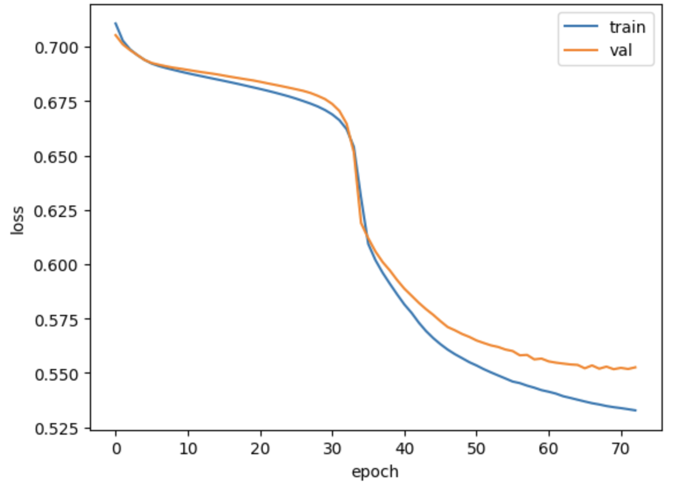 

- 모델 평가:
  ```
  test_seq = pad_sequences(test_input, maxlen=100)
  test_oh = keras.utils.to_categorical(test_seq, num_classes=200)

  # 평가
  loss, accuracy = model.evaluate(test_oh, test_target)
  print(f'손실: {loss:.4f}, 정확도: {accuracy:.4f}')
  ``` 

### 임베딩
원-핫 인코딩은 어휘 크기만큼의 희소 벡터를 생성하여 메모리 비효율적이고 의미적 유사성을 표현할 수 없음.   
그래서 저차원의 밀집 벡터로 단어를 표현하며, 의미적 관계가 학습되는 임베딩을 더 많이 사용함.   

좀 더 쉽게 설명하면,   
원-핫 인코딩은 단어마다 엄청 긴 벡터가 필요해서 메모리 낭비가 심함.       
그래서 **단어를 짧은 실수 리스트로 바꾸면서, 비슷한 의미의 단어는 비슷한 실수를 갖게 하는 임베딩**을 더 많이 사용함.     
  

- 모델 생성   
  어휘 사전 200개, 각 단어(토큰)은 16차원 벡터로 임베딩, 샘플 단어는 100차원 벡터로 패딩됨     
  ```
  model2 = keras.Sequential()

  model2.add(keras.layers.Embedding(200, 16, input_shape=(100,)))
  model2.add(keras.layers.SimpleRNN(8))
  model2.add(keras.layers.Dense(1, activation='sigmoid'))
  
  model2.summary()
  ```
  

- 모델 훈련
  ```
  rmsprop = keras.optimizers.RMSprop(learning_rate=1e-4)
  model2.compile(optimizer=rmsprop, loss='binary_crossentropy',
                metrics=['accuracy'])

  checkpoint_cb = keras.callbacks.ModelCheckpoint('best-embedding-model.keras',
                                                  save_best_only=True)
  early_stopping_cb = keras.callbacks.EarlyStopping(patience=3,
                                                    restore_best_weights=True)

  history = model2.fit(train_seq, train_target, epochs=100, batch_size=64,
                      validation_data=(val_seq, val_target),
                      callbacks=[checkpoint_cb, early_stopping_cb])
  ``` 

- 결과 시각화
  ```
  plt.plot(history.history['loss'])
  plt.plot(history.history['val_loss'])
  plt.xlabel('epoch')
  plt.ylabel('loss')
  plt.legend(['train', 'val'])
  plt.show()
  ``` 

  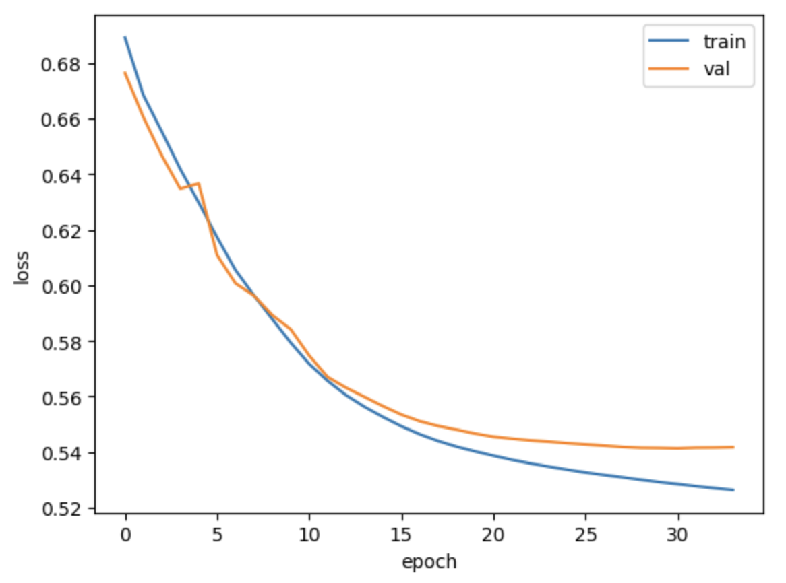


| [Top](#목차) |

---

## 순차 텍스트를 위한 ANN:LSTM 셀과 GRU 셀

### LSTM 셀 개념 
LSTM은 Long Short-Term Memory의 약자임      
- 목적: 오래된 정보도 필요하면 기억하고, 불필요한 건 잊는 똑똑한 기억 시스템을 만들기 위함     
       (SimpleRNN은 문장이 길어지면 앞 부분을 기억 못함)     
    
- 방법: 4개의 게이트(망각, 셀, 입력, 출력)가 동작하여 수행됨     
    

  ```
  1. 입력: h(t-1), x(t), C(t-1) 
    
  2. 처리 
    ① f = σ(W_f·[h(t-1),x(t)]+b_f) -> 뭘 잊을까(-1 ~ 1)
      망각 게이트 = 
      망각 가중치 * [이전 스텝 결과 + 이번 스텝 입력] + 망각 바이어스의 결과를 시그모이드 함수로 변환 
      
    ② c̃ = tanh(W_c·[h(t-1),x(t)]+b_c)  → 새 후보는? (-1~1) 
      셀 게이트 =  
      셀 가중치 * [이전 스텝 결과 + 이번 스텝 입력] + 셀 바이어스의 결과를 탄에이치 함수로 변환 

    ③ i = σ(W_i·[h(t-1),x(t)]+b_i)     → 얼마나 저장? (0~1) 
      입력 게이트 = 
      입력 가중치 * [이전 스텝 결과 + 이번 스텝 입력] + 입력 바이어스의 결과를 시그모이드 함수로 변환
                                                              
    ④ C(t) = f×C(t-1) + i×c̃   → 기억 업데이트
      새 장기기억 = 
      망각게이트 결과 * 이전 장기기억 + 입력게이트 결과(기억 비율) * 셀 게이트 결과(기억 후보)           
                                                            
    ⑤ o = σ(W_o·[h(t-1),x(t)]+b_o)     → 얼마나 출력? (0~1) 
      출력 게이트 =  
      출력 가중치 * [이전 스텝 결과 + 이번 스텝 입력] + 출력 바이어스의 결과를 시그모이드 함수로 변환   
                                                          
    ⑥ h(t) = o × tanh(C(t))   → 최종 출력 
      최종 출력 = 
      출력 게이트 결과 * 새 장기기억의 탄에이치 함수 변환 결과               
      * tanh 사용 이유: C(t)는 계속 더해지면서 값이 커질 수 있으므로 -1 ~ 1로 범위로 제한하기 위함  

  3. 출력: h(t), C(t) → 다음 타임스텝으로 전달 
  ```

### LSTM 셀 예제: 기본 
**1.데이터 구성**      
```
from tensorflow.keras.datasets import imdb
from sklearn.model_selection import train_test_split

(train_input, train_target), (test_input, test_target) = imdb.load_data(
    num_words=500)

train_input, val_input, train_target, val_target = train_test_split(
    train_input, train_target, test_size=0.2, random_state=42)

from tensorflow.keras.preprocessing.sequence import pad_sequences

train_seq = pad_sequences(train_input, maxlen=100)
val_seq = pad_sequences(val_input, maxlen=100)    
```   
  
**2.모델 구성**    
500개 어휘사전, 임베딩 벡터 16차원, 입력 샘플 100개.   
순환층 뉴런 갯수 8개이며 LSTM 셀 사용.       
```
from tensorflow import keras

model = keras.Sequential()

model.add(keras.layers.Embedding(500, 16, input_shape=(100,)))
model.add(keras.layers.LSTM(8))
model.add(keras.layers.Dense(1, activation='sigmoid'))

model.summary()
```
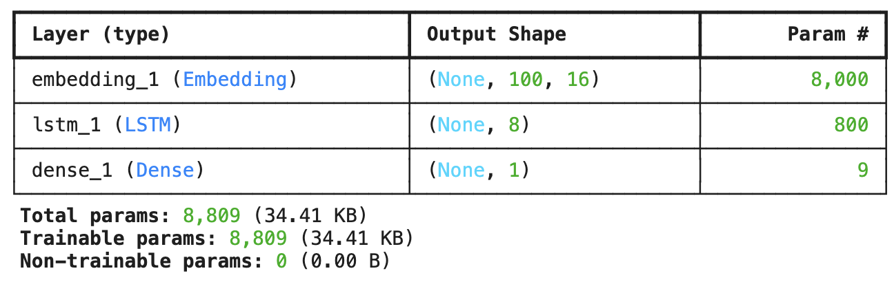
```
파라미터 수 계산:  
- Embedding 층 = vocab_size × embedding_dim
      = 500 × 16 = 8,000
  * 입력 데이터 100개는 시퀀스 길이(=타임스텝)이므로 파라미터 수에 영향을 미치지 않음  
- LSTM 층 = 4 × [(input_dim × units) + (units × units) + units]
      = 4 × [(16 × 8) + (8 × 8) + 8]
      = 4 × [128 + 64 + 8]
      = 4 × 200 = 800
  * 4개의 게이트(forget, input, cell, output)를 가지며, 각 게이트마다 가중치가 필요

- 밀집층 = (input_dim × output_dim) + bias
      = (8 × 1) + 1 = 9
```

**3.모델 훈련**    
```
rmsprop = keras.optimizers.RMSprop(learning_rate=1e-4)
model.compile(optimizer=rmsprop, loss='binary_crossentropy',
              metrics=['accuracy'])

checkpoint_cb = keras.callbacks.ModelCheckpoint('best-lstm-model.keras',
                                                save_best_only=True)
early_stopping_cb = keras.callbacks.EarlyStopping(patience=3,
                                                  restore_best_weights=True)

history = model.fit(train_seq, train_target, epochs=100, batch_size=64,
                    validation_data=(val_seq, val_target),
                    callbacks=[checkpoint_cb, early_stopping_cb])
```

가시화
```
import matplotlib.pyplot as plt

plt.plot(history.history['loss'])
plt.plot(history.history['val_loss'])
plt.xlabel('epoch')
plt.ylabel('loss')
plt.legend(['train', 'val'])
plt.show()
```
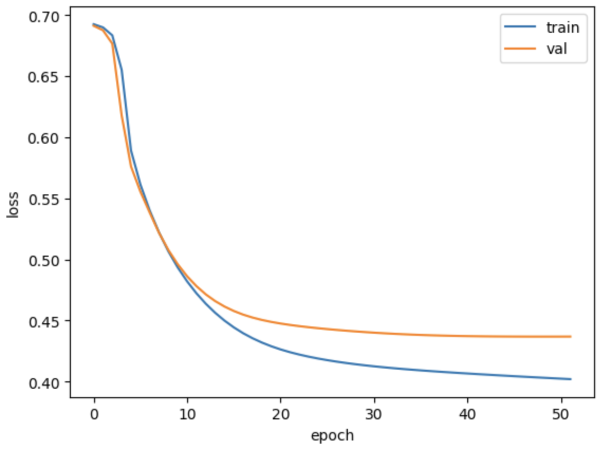

### LSTM 셀 예제: 순환층에 dropout 적용
**1.dropout 적용하여 모델 구성**         
```
model2 = keras.Sequential()

model2.add(keras.layers.Embedding(500, 16, input_shape=(100,)))
model2.add(keras.layers.LSTM(8, dropout=0.3))
model2.add(keras.layers.Dense(1, activation='sigmoid'))
```

**2.모델 훈련**     
```
rmsprop = keras.optimizers.RMSprop(learning_rate=1e-4)
model2.compile(optimizer=rmsprop, loss='binary_crossentropy',
               metrics=['accuracy'])

checkpoint_cb = keras.callbacks.ModelCheckpoint('best-dropout-model.keras',
                                                save_best_only=True)
early_stopping_cb = keras.callbacks.EarlyStopping(patience=3,
                                                  restore_best_weights=True)

history = model2.fit(train_seq, train_target, epochs=100, batch_size=64,
                     validation_data=(val_seq, val_target),
                     callbacks=[checkpoint_cb, early_stopping_cb])
```
   

**3.Dropout 적용 전후 학습 곡선 비교 분석**     
| 구분 | Dropout 미적용 (Image 1) | Dropout 적용 (Image 2) |
|------|-------------------------|------------------------|
| **총 Epoch** | 50 | ~42 (Early Stopping 추정) |
| **최종 Train Loss** | ~0.40 | ~0.41 |
| **최종 Val Loss** | ~0.44 | ~0.44 |
| **Train-Val Gap** | ~0.04 (넓음) | ~0.03 (좁음) |
| **곡선 특성** | 매우 Smooth | Fluctuation 존재 |
| **수렴 시점** | Epoch 35~40 | Epoch 30~35 |

1)핵심 관찰:        
- **Dropout 미적용**: Epoch 15 이후 train과 val 곡선이 점진적으로 벌어지며, train loss가 계속 하락하는 동안 val loss는 정체 → **Overfitting 징후**
- **Dropout 적용**: 두 곡선이 더 가깝게 유지되며, 곡선에 노이즈가 있지만 generalization gap이 작음

2)Dropout 효과     
- Overfitting 억제 효과 확인
- Dropout의 정규화 효과
  Dropout 적용 시:
  - 학습 과정에서 랜덤하게 뉴런을 비활성화하므로 곡선에 **fluctuation(떨림)**이 발생: 정상적 현상 
  - 앙상블 효과로 인해 모델이 특정 뉴런에 과도하게 의존하지 않게 됨
  - 결과적으로 **train-val gap 감소** → 일반화 성능 개선
- Early Stopping과의 시너지
  Dropout 적용 그래프가 42 epoch에서 종료된 것은 validation loss가 개선되지 않아 Early Stopping이 작동한 것으로 보임  

### LSTM 셀 예제: 2개 순환층 연결   
각 순환층은 이전 순환층의 모든 타입스텝 결과를 받아야 동작하므로 return_sequence=True를 설정함    
```
입력: (batch, 100, 16)  ← Embedding 출력
        ↓
첫 번째 LSTM (return_sequences=True): (batch, 100, 8)  ← 100개 타임스텝 모두 출력
        ↓
두 번째 LSTM (return_sequences=False): (batch, 8)  ← 마지막 타임스텝만 출력
        ↓
Dense: (batch, 1)
```

**1.모델구성**    
```
model3 = keras.Sequential()

model3.add(keras.layers.Embedding(500, 16, input_shape=(100,)))
model3.add(keras.layers.LSTM(8, dropout=0.3, return_sequences=True))
model3.add(keras.layers.LSTM(8, dropout=0.3))
model3.add(keras.layers.Dense(1, activation='sigmoid'))

model3.summary()
```
   

```
1. Embedding 레이어: **8,000**
파라미터 = vocab_size × embedding_dim
         = 500 × 16 = 8,000

각 단어(500개)마다 16차원 벡터를 저장하는 룩업 테이블입니다.

2. 첫 번째 LSTM: **800**
파라미터 = 4 × [(input_dim × units) + (units × units) + units]
         = 4 × [(16 × 8) + (8 × 8) + 8]
         = 4 × [128 + 64 + 8]
         = 4 × 200 = 800

3. 두 번째 LSTM: **544**
파라미터 = 4 × [(8 × 8) + (8 × 8) + 8]
         = 4 × [64 + 64 + 8]
         = 4 × 136 = 544
이전 LSTM 출력이 8이므로 input_dim = 8

4. Dense 레이어: **9**
파라미터 = (input_dim × units) + units
         = (8 × 1) + 1 = 9
```

**2.모델훈련**        
```
rmsprop = keras.optimizers.RMSprop(learning_rate=1e-4)
model3.compile(optimizer=rmsprop, loss='binary_crossentropy',
               metrics=['accuracy'])

checkpoint_cb = keras.callbacks.ModelCheckpoint('best-2rnn-model.keras',
                                                save_best_only=True)
early_stopping_cb = keras.callbacks.EarlyStopping(patience=3,
                                                  restore_best_weights=True)

history = model3.fit(train_seq, train_target, epochs=100, batch_size=64,
                     validation_data=(val_seq, val_target),
                     callbacks=[checkpoint_cb, early_stopping_cb])
```
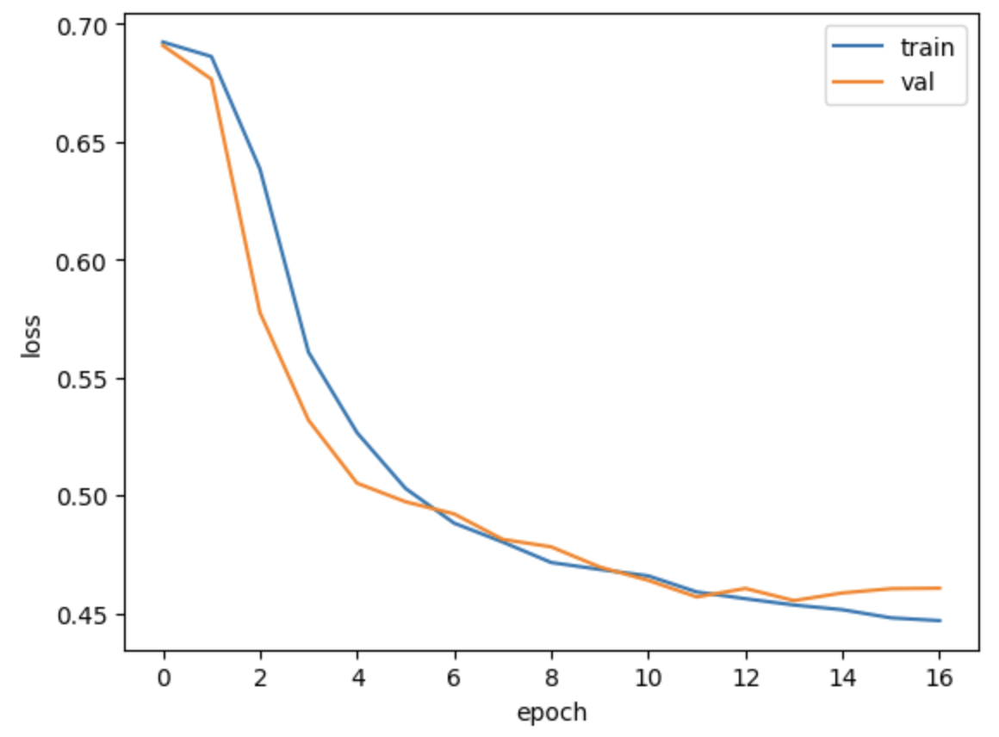


### GRU 셀: 개념
GRU는 Gated Recurrent Unit의 약자임.  Gated는 '게이트(문)가 있는'이라는 의미.   
- 목적
  LSTM과 동일하게 오래된 정보도 필요하면 기억하고, 불필요한 건 잊는 똑똑한 기억 시스템을 만들기 위함.    
  **단, LSTM보다 구조가 단순하여 학습이 빠르고 파라미터가 적음**

- LSTM과의 핵심 차이점

  | 구분 | LSTM | GRU |
  |------|------|-----|
  | 게이트 수 | 4개 (망각, 셀, 입력, 출력) | **2개 (리셋, 업데이트)** |
  | 상태 | 셀 상태(C) + 은닉 상태(h) | **은닉 상태(h)만 사용** |
  | 파라미터 수 | 많음 | **적음 (약 25% 감소)** |
  | 학습 속도 | 느림 | **빠름** |
    
  (주의)GRU의 게이트는 2개이나 연산은 3개 단계(리셋,업데이트,후보 생성)이므로 파라미터 수 계산시에는 3을 곱해야 함. 


- 방법: 2개의 게이트 + 후보 생성이 동작하여 수행됨
  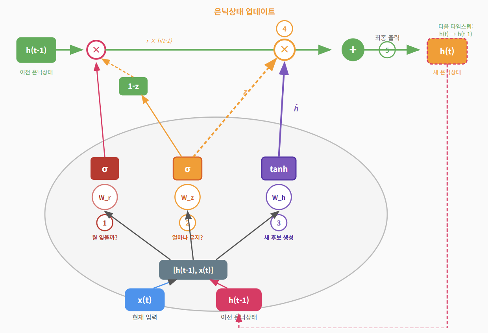

  ```
  1. 입력: h(t-1), x(t)
    * LSTM과 달리 별도의 셀 상태(C) 없음!
    
  2. 처리 
    ① r = σ(W_r·[h(t-1),x(t)]+b_r) → 뭘 잊을까? (0~1)
      리셋 게이트 = 
      리셋 가중치 × [이전 은닉상태 + 이번 입력] + 리셋 바이어스의 결과를 시그모이드 함수로 변환 
      * 이전 정보를 얼마나 "리셋(무시)"할지 결정
      
    ② z = σ(W_z·[h(t-1),x(t)]+b_z) → 얼마나 유지? (0~1)
      업데이트 게이트 = 
      업데이트 가중치 × [이전 은닉상태 + 이번 입력] + 업데이트 바이어스의 결과를 시그모이드 함수로 변환
      * 이전 정보와 새 정보의 "혼합 비율" 결정
      * LSTM의 망각 게이트 + 입력 게이트 역할을 하나로 통합!
                                                                
    ③ h̃ = tanh(W_h·[r×h(t-1), x(t)]+b_h) → 새 후보는? (-1~1)
      후보 은닉상태 = 
      후보 가중치 × [리셋된 이전 은닉상태 + 이번 입력] + 후보 바이어스의 결과를 탄에이치 함수로 변환
      * 핵심: r×h(t-1)로 이전 정보를 선택적으로 반영
      * r=0이면 이전 정보 완전 무시, r=1이면 이전 정보 전부 사용
                                                              
    ④ h(t) = (1-z)×h(t-1) + z×h̃ → 은닉상태 업데이트
      새 은닉상태 = 
      (1-업데이트 게이트) × 이전 은닉상태 + 업데이트 게이트 × 후보 은닉상태
      * z=0: 이전 상태 100% 유지 (새 정보 무시)
      * z=1: 새 후보로 100% 교체 (이전 정보 무시)
      * LSTM과 달리 별도의 출력 게이트 없이 h(t)가 바로 출력!

    ⑤ 최종 출력 = h(t)
      * 별도의 변환 없이 은닉상태가 그대로 출력됨

  3. 출력: h(t) → 다음 타임스텝으로 전달
    * LSTM처럼 C(t)를 별도로 전달하지 않음
  ```

- GRU의 장단점

  **장점:**
  - 파라미터가 적어 학습이 빠름
  - 과적합 위험이 낮음
  - 작은 데이터셋에서 효과적

  **단점:**
  - 매우 긴 시퀀스에서는 LSTM보다 성능이 떨어질 수 있음
  - 복잡한 패턴 학습에는 LSTM이 유리할 수 있음

- 언제 GRU vs LSTM?

  | 상황 | 추천 |
  |------|------|
  | 데이터셋이 작을 때 | **GRU** |
  | 학습 속도가 중요할 때 | **GRU** |
  | 매우 긴 시퀀스 (1000+ 토큰) | LSTM |
  | 리소스가 제한적일 때 | **GRU** |


### GRU 셀: 예제
**1.모델구성**    
```
model4 = keras.Sequential()

model4.add(keras.layers.Embedding(500, 16, input_shape=(100,)))
model4.add(keras.layers.GRU(8))
model4.add(keras.layers.Dense(1, activation='sigmoid'))

model4.summary()
```
 

```
1. Embedding 레이어: **8,000**
파라미터 = vocab_size × embedding_dim
         = 500 × 16 = 8,000

각 단어(500개)마다 16차원 벡터를 저장하는 룩업 테이블입니다.

2. GRU: **624**
파라미터 = 3 × [(input_dim × units) + (units × units) + (2 * units)]
         = 3 × [(16 × 8) + (8 × 8) + (2*8)]
         = 3 × [128 + 64 + 16]
         = 3 × 208 = 624
┌───────────────────────────────────────────────────────────────── ┐
│  GRU = 3 × [(input_dim × units) + (units × units) + (2 × units)] │
│                    ↓              ↓               ↓              │
│               입력 가중치     은닉 가중치      바이어스(2개)              │
│                  (W)            (U)           (b_input, b_hidden)│
└─────────────────────────────────────────────────────────────────-┘

3. Dense 레이어: **9**
파라미터 = (input_dim × units) + units
         = (8 × 1) + 1 = 9
```

**2.모델훈련**       
```
rmsprop = keras.optimizers.RMSprop(learning_rate=1e-4)
model4.compile(optimizer=rmsprop, loss='binary_crossentropy',
               metrics=['accuracy'])

checkpoint_cb = keras.callbacks.ModelCheckpoint('best-gru-model.keras',
                                                save_best_only=True)
early_stopping_cb = keras.callbacks.EarlyStopping(patience=3,
                                                  restore_best_weights=True)

history = model4.fit(train_seq, train_target, epochs=100, batch_size=64,
                     validation_data=(val_seq, val_target),
                     callbacks=[checkpoint_cb, early_stopping_cb])
```

```
plt.plot(history.history['loss'])
plt.plot(history.history['val_loss'])
plt.xlabel('epoch')
plt.ylabel('loss')
plt.legend(['train', 'val'])
plt.show()
```
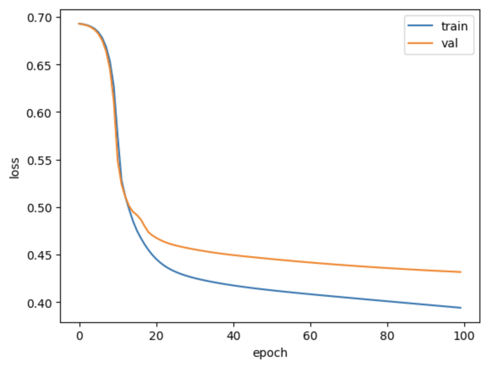 


### 예제로 이해하는 LSTM셀과 GRU셀 

아래 링크의 html을 파일로 만들어 브라우저에서 열어 LSTM셀과 GRU셀에 대해 완벽히 이해     
https://github.com/cna-bootcamp/aistudy/blob/main/mldl/textbook/explain/lstm-gru-sample.html


### 전체 학습과정 개념도    
순전파 -> 손실계산 -> 역전파 -> 어휘사전 벡터(=임베딩 테이블)의 벡터 조정을 반복하면서 학습   
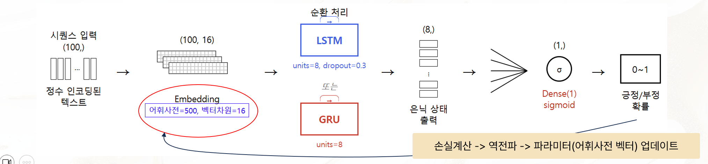   
  
| [Top](#목차) |

---
