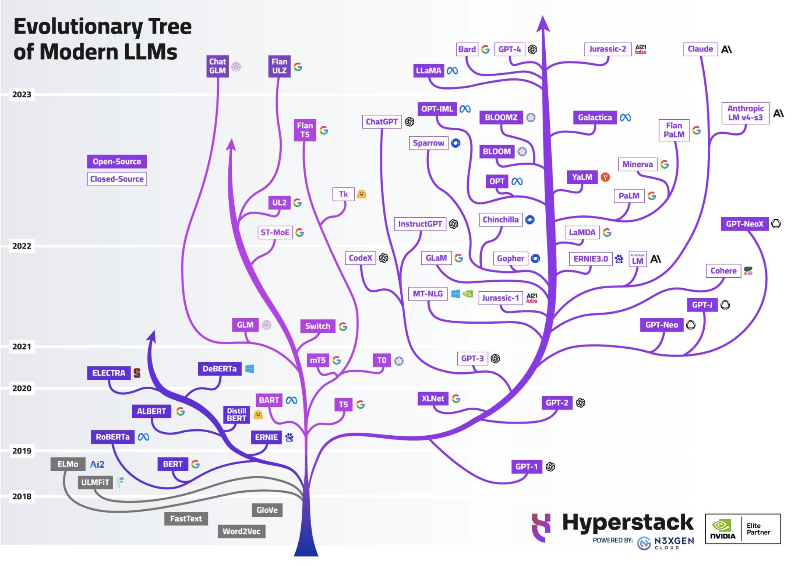
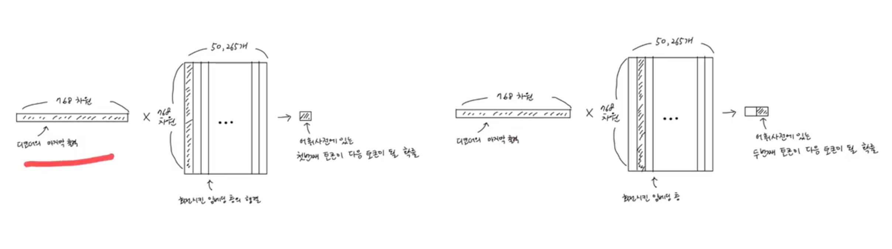
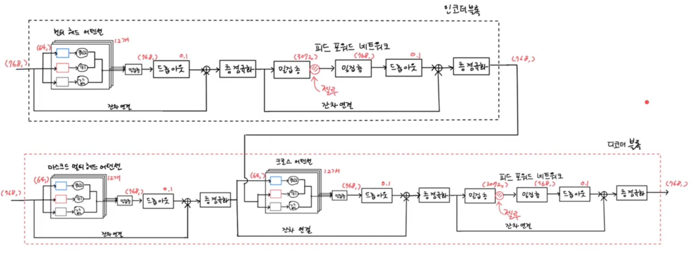
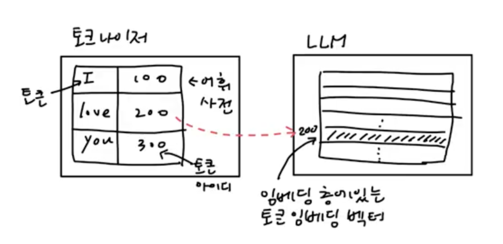
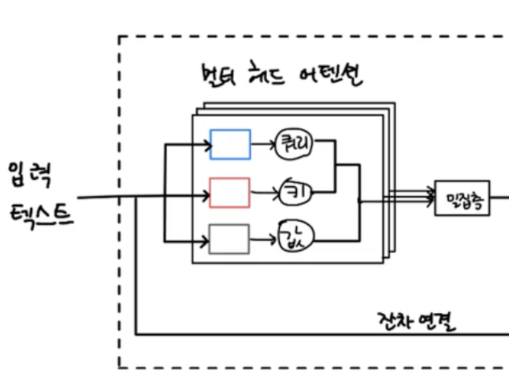
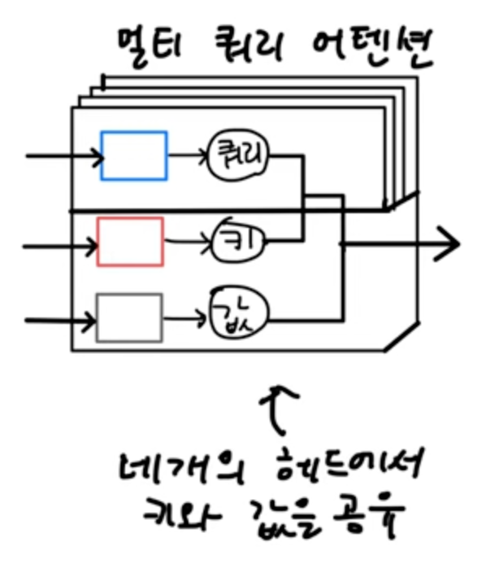
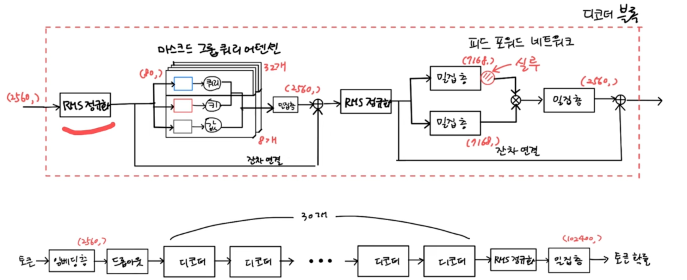

# 트랜스포머(Transformaer)

유투브 강의 영상 
https://www.youtube.com/playlist?list=PLVsNizTWUw7E2RxZ4aspcR9vNamXccmFE

코드예제.   
https://github.com/rickiepark/hg-mldl


# 목차 
- [트랜스포머(Transformaer)](#트랜스포머transformaer)
- [목차](#목차)
  - [언어 모델을 위한 ANN:어텐션 메커니즘과 트랜스포머](#언어-모델을-위한-ann어텐션-메커니즘과-트랜스포머)
    - [인코더-디코더 신경망](#인코더-디코더-신경망)
    - [어텐션 메커니즘](#어텐션-메커니즘)
    - [어텐션메커니즘의 학습](#어텐션메커니즘의-학습)
    - [트랜스포머](#트랜스포머)
  - [트랜스포머로 상품 설명 요약하기](#트랜스포머로-상품-설명-요약하기)
    - [트랜스포머 모델 유형](#트랜스포머-모델-유형)
    - [GPT나 클로드가 디코딩 기반 모델을 사용할 수 있는 이유](#gpt나-클로드가-디코딩-기반-모델을-사용할-수-있는-이유)
    - [오픈소스 모델 비교](#오픈소스-모델-비교)
    - [BART 모델 개념](#bart-모델-개념)
    - [BART 인코더와 디코더](#bart-인코더와-디코더)
    - [허깅페이스에서 KoBART 모델 로드](#허깅페이스에서-kobart-모델-로드)
    - [DAPT (Domain-Adaptive Pre-training)](#dapt-domain-adaptive-pre-training)
    - [텍스트 토큰화](#텍스트-토큰화)
      - [핵심 요약](#핵심-요약)
      - [활용 케이스 상세 설명](#활용-케이스-상세-설명)
      - [BPE(Byte Pair Encoding)](#bpebyte-pair-encoding)
      - [워드피스(Wordpiece)](#워드피스wordpiece)
      - [유니그램(Unigram).](#유니그램unigram)
      - [SentencePiece](#sentencepiece)
  - [대규모 언어 모델로 텍스트 생성하기](#대규모-언어-모델로-텍스트-생성하기)
    - [멀티쿼리 어텐션과 그룹쿼리 어텐션](#멀티쿼리-어텐션과-그룹쿼리-어텐션)
    - [SwiGLU 활성화](#swiglu-활성화)
    - [RMS 정규화](#rms-정규화)
    - [EXAONE-3.5](#exaone-35)
    - [토큰 디코딩 전략](#토큰-디코딩-전략)

---

## 언어 모델을 위한 ANN:어텐션 메커니즘과 트랜스포머

### 인코더-디코더 신경망
**1.목적**: 한 형태의 정보를 다른 형태로 **변환**     
**2.방법**: **인코더**에서 입력 문장을 순차적으로 읽어 **요약**하고 그 결과를 **디코더**에서 하나씩 **출력**함  
   
- 인코더(Encoder) - "듣고 이해하는 단계"
  - 입력 문장을 순차적으로 읽음
  - 전체 의미를 하나의 컨텍스트 벡터(고정 길이 숫자 배열)로 압축
  - 마치 책 한 권을 읽고 핵심 요약문을 만드는 것

- 디코더(Decoder) - "이해한 것을 표현하는 단계"
  - 컨텍스트 벡터를 받아서
  - 한 단어씩 순차적으로 출력을 생성
  - 마치 요약문을 보고 새로운 글을 쓰는 것   
  
**3.문제점**: **정보손실** 발생  
  아무리 긴 문장이라도 고정된 크기의 벡터 하나에 담아야 하기 때문에 정보 손실 발생     

### 어텐션 메커니즘  
**1.목적: 중요한 부분에 집중**     
예) 시험문제 풀기    
```
문제: "다음 중 광합성에서 산소가 발생하는 장소는?"

학생의 사고 과정:
- 전체 교과서 내용 중
- "광합성" 관련 부분에 집중 ← 어텐션!
- "산소 발생" 키워드에 더 집중 ← 어텐션!
- 답: "엽록체의 틸라코이드"
```

**2.방법**:   
1)인코더의 **각 토큰의 은닉상태를 디코더에서 참조**    
어텐션이 없는 경우: 인코더-디코더 신경망     
```
입력: [단어1] → [단어2] → [단어3] → [단어4]
                                      ↓
                              [압축된 벡터 하나]
                                      ↓
출력:                         [전체를 기반으로 생성]
```
어텐션이 있는 경우   
```
입력: [단어1] [단어2] [단어3] [단어4]
        ↓       ↓       ↓       ↓
      [h1]    [h2]    [h3]    [h4]  ← 각각의 상태 저장
        ↘      ↓       ↓      ↙
           [필요한 것만 골라서 참조]
                    ↓
출력:    [매 단어마다 다르게 집중하며 생성]
```

2)각 토큰의 중요도를 계산해 **중요한 부분에 집중**         
| 단계 | 설명 | 비유 |
|------|------|------|
| 1. **Query** 생성 | "지금 내가 찾는 게 뭐지?" | 질문하기 |
| 2. **Key** 비교 | "각 단어가 내 질문과 얼마나 관련있지?" | 목차 훑어보기 |
| 3. 가중치 계산 | 관련도를 0~1 사이 점수로 변환 | 중요도 매기기 |
| 4. **Value** 조합 | 중요한 것에 더 많은 비중을 두고 합산 | 핵심만 정리 |

예시)
```
┌─────────────────────────────────────────────────────────────┐
│                    Query, Key, Value 흐름                    │
└─────────────────────────────────────────────────────────────┘

입력 문장: [고양이] [가] [생선을] [먹는다]
              ↓      ↓      ↓       ↓
           ┌──────────────────────────────┐
           │     선형 변환 (학습된 가중치)     │
           └──────────────────────────────┘
              ↓      ↓      ↓       ↓
           ┌────┐ ┌────┐ ┌────┐ ┌────┐
     Key:  │ K1 │ │ K2 │ │ K3 │ │ K4 │  ← "이 단어는 이런 특성"
           └────┘ └────┘ └────┘ └────┘
           
           ┌────┐ ┌────┐ ┌────┐ ┌────┐
   Value:  │ V1 │ │ V2 │ │ V3 │ │ V4 │  ← "실제 가져갈 정보"
           └────┘ └────┘ └────┘ └────┘


디코더 (현재 "fish" 생성 중)
              ↓
           ┌────┐
   Query:  │ Q  │  ← "음식 관련 정보가 필요해!"
           └────┘
              ↓
    ┌─────────────────────────────────┐
    │     Q × K (유사도 계산)            │
    │  [0.27] [0.13] [0.87] [0.59]    │
    └─────────────────────────────────┘
              ↓
    ┌─────────────────────────────────┐
    │        Softmax (정규화)           │
    │  [0.20] [0.17] [0.36] [0.27]    │
    │   20%   17%   36%🎯  27%        │
    └─────────────────────────────────┘
              ↓
    ┌─────────────────────────────────┐
    │  가중치 × Value = Context         │
    │  0.20×V1 + 0.17×V2 + 0.36×V3    │
    │         + 0.27×V4               │
    └─────────────────────────────────┘
              ↓
         [Context Vector]
              ↓
         "fish" 생성! 🐟
```

**3.문제점**:   
| 한계점 | 설명 |
|--------|------|
| **순차적 처리** | RNN 특성상 t번째 단어를 처리하려면 t-1번째까지 완료해야 함 → 병렬화 불가 |
| **학습 속도 저하** | 긴 시퀀스일수록 학습 시간이 선형적으로 증가 |
| **장거리 의존성 문제** | 문장이 길어지면 앞쪽 정보가 희석되는 vanishing gradient 문제 |
| **계산 병목** | GPU의 병렬 처리 능력을 제대로 활용하지 못함 |

| [Top](#목차) |

---

### 어텐션메커니즘의 학습
  
━━━━━━━━━━━━━━━━━━━━━━━━━━━━━━━━━━━━━━━━━━━━━━━━━━━━  
 **최종 목표: Task 성공 (번역, 요약, 질의응답 등)**  
━━━━━━━━━━━━━━━━━━━━━━━━━━━━━━━━━━━━━━━━━━━━━━━━━━━━  
  
**1.임베딩 행렬 학습**   
1)쉬운 설명  
**왜 필요할까?**    
컴퓨터가 단어의 의미를 이해할 수 있게 숫자로 바꿔야 해요   
  
**어떻게 학습할까?**  
- 처음엔 단어를 아무 숫자로 바꿔요  
- AI가 실수하면 "이 단어는 이렇게 표현하면 더 좋겠구나!"하고 숫자를 조금씩 바꿔요  
- 계속 연습하면서 의미가 비슷한 단어들의 숫자도 비슷해져요  
  
**결과는?**  
- '고양이'와 '강아지'같은 비슷한 단어들이 비슷한 숫자로 표현돼요  
- AI가 일을 잘할 수 있게 단어의 특징이 숫자에 담겨요  
  
2)기술적 설명   
**목적:** Task에 유용한 단어 표현으로 최적화
  
**방법:** 
- 학습하면서 어휘사전의 각 단어들의 벡터값을 Task에 맞게 조정
- 역전파(Backpropagation)를 통해 손실이 줄어드는 방향으로 임베딩 값 업데이트
- 예측 결과와 정답의 차이를 기반으로 각 단어 벡터의 각 차원값을 미세 조정
  
**결과:** 
- 유사 단어들이 자연스럽게 가까워짐
- Task 수행에 중요한 의미적 특성이 벡터에 인코딩됨
  
**2.Q/K/V 가중치 행렬 학습**   
1)쉬운 설명   
**왜 필요할까?**    
긴 문장에서 어떤 단어가 중요한지 찾아야 해요   
  
**어떻게 학습할까?**  

📌 **질문 만드는 법 배우기 (Q 학습)**   
- "뭘 찾아야 하지?"를 잘 물어보는 방법을 배워요  
- 잘못된 단어를 중요하게 봤다면 → 질문하는 방식을 고쳐요  
- 올바른 단어를 찾을 수 있게 점점 발전해요  
  
📌 **특징 표시하는 법 배우기 (K 학습)**  
- 각 단어의 특징을 잘 드러내는 방법을 배워요  
- 중요한 단어인데 눈에 안 띄었다면 → 특징을 더 강하게 표시해요  
- 중요한 단어가 잘 보이게 점점 발전해요  
  
📌 **정보 정리하는 법 배우기 (V 학습)**  
- 찾은 단어에서 필요한 정보만 뽑아내는 방법을 배워요  
- 틀린 답을 냈다면 → 정보를 뽑아내는 방식을 고쳐요  
- 답하는데 꼭 필요한 정보만 담게 점점 발전해요  
  
📌 **함께 발전하기**  
- 위 세 가지를 동시에 연습해요  
- 답을 맞히면 → "잘했어!" 틀리면 → "이렇게 해봐!" 하면서 계속 개선해요  
  
**결과는?**
- 문장에서 정말 중요한 단어를 정확히 찾아요
- 상황에 맞게 집중할 단어를 알아서 바꿔가며 찾아요
  
2.기술적 설명    
**목적:** 올바른 attention 패턴 생성 (어떤 단어에 얼마나 집중할지)
  
**방법:**   
- **W_q 학습**: 중요 정보를 찾는 Query 표현이 생성되도록 가중치 조정  
  잘못된 단어에 attention → W_q 업데이트 → 올바른 단어와 높은 유사도 생성
  
- **W_k 학습**: 중요 단어의 특성이 잘 드러나는 Key 표현이 생성되도록 가중치 조정  
  중요 단어가 낮은 점수 → W_k 업데이트 → 중요 단어의 특성 강화
  
- **W_v 학습**: 예측에 필요한 정보를 담는 Value 표현이 생성되도록 가중치 조정  
  잘못된 예측 → W_v 업데이트 → 올바른 예측에 필요한 정보 인코딩
  
- **통합 학습**: 역전파를 통해 W_q, W_k, W_v를 동시에 최적화  
  예측 → 손실 계산 → 기울기 계산 → 파라미터 업데이트 → 반복
  
**결과:**   
- 중요한 단어를 정확히 찾아냄
- 문맥에 따라 동적으로 올바른 attention 분포 생성
  
| [Top](#목차) |

---
  
### 트랜스포머
**1.목적**: **병렬 처리**로 **학습 속도를 극대화**하면서, **장거리 의존성을 효과적으로 학습**    
- 2017년 구글의 **"Attention is All You Need"** 논문에서 제안  
- **RNN을 완전히 제거**하고 어텐션만으로 순서가 있는 데이터를 처리  
  
**2.핵심 아이디어**     
1)병렬처리: 모든 단어를 차례대로가 아닌 동시에 처리하여 학습 속도 극대화    
2)Self-Attention: 문장의 모든 단어가 서로의 관계를 파악하여 문맥 이해      
3)Multi-Head Attention: 복수개의 다른 관점으로 동시에 문장을 분석  
4)잔차연결(Residual Connection): 원본 정보를 계속 보존하면서 새 정보를 누적       
5)Cross Attention: 정답 출력시 생성되는 각 단어가 입력 정보를 지속적으로 참조    
6)Masked Self-Attention: 정답 출력 시 아직 생성 안된 미래 단어는 참조 금지시킴       
7)Feed Forward Network: 각 단어를 독립적으로 차원 확장→비선형 변환→차원 축소하여 복잡한 패턴 학습   
                        Attention이 단어 '간' 관계라면, FFN은 각 단어 '내' 심층 분석  
  
**3.방법**:    
  
**■ 1단계: 입력 준비 (임베딩 + 위치 인코딩)**    

- **단어 임베딩**: 단어를 숫자로 변환   

  컴퓨터는 글자를 모르니까, 각 단어를 **숫자 벡터**로 바꿈   

  ```
  "나는"    → [0.2, 0.8, 0.1, 0.5]  (실제로는 512차원)
  "사과를"  → [0.5, 0.3, 0.7, 0.2]
  "먹었다"  → [0.1, 0.9, 0.4, 0.6]
  ```
  
- **위치 인코딩**: 순서 정보 추가  

  트랜스포머는 **모든 단어를 동시에** 보기 때문에 "몇 번째 단어인지" 정보를 별도로 추가    

  ```
  "나는"   + [1번째 위치 정보] → [0.2+위치, 0.8+위치, 0.1+위치, 0.5+위치]
  "사과를" + [2번째 위치 정보] → [0.5+위치, 0.3+위치, 0.7+위치, 0.2+위치]
  "먹었다" + [3번째 위치 정보] → [0.1+위치, 0.9+위치, 0.4+위치, 0.6+위치]
  ```

  **비유**: 학생 3명이 원형으로 앉아있는데, 각자 "나는 1번", "나는 2번", "나는 3번" 번호표를 달고 있는 것
  
**■ 2단계: Self-Attention**       

- **목표**: 각 단어가 문장에서 어떤 단어와 관련 있는지 파악    
  
  **"먹었다"** 가 다른 단어들에게 질문: "나(먹었다)와 관련 있는 단어가 누구야?"     

  ```
  "먹었다" ↔ "나는"   : 관련 높음 (주어니까, 누가 먹었는지)
  "먹었다" ↔ "사과를" : 관련 매우 높음 (목적어니까, 뭘 먹었는지)
  "먹었다" ↔ "먹었다" : 자기 자신도 참조
  ```
  
- **Q, K, V 벡터 생성**   

  모든 단어가 3가지 역할을 동시에 수행:

  ```
          Query(Q)              Key(K)               Value(V)
          "누구와 관련있지?"     "내 특징은 이거야"    "전달할 정보"
          
  나는     [0.3, 0.7, 0.2, 0.5]  [0.4, 0.6, 0.1, 0.3]  [0.2, 0.8, 0.1, 0.5]
  사과를   [0.5, 0.2, 0.8, 0.4]  [0.6, 0.4, 0.7, 0.2]  [0.5, 0.3, 0.7, 0.2]
  먹었다   [0.4, 0.8, 0.3, 0.6]  [0.3, 0.7, 0.5, 0.4]  [0.1, 0.9, 0.4, 0.6]
  ```
  
- **수식**: Attention = softmax(QK^T / √d_k) × V   
  
  "먹었다"의 관점에서 계산 예시    
  
  **① QK^T**: "먹었다"의 Query와 각 단어의 Key를 내적(Dot Product)       
  
  내적이란 '두 벡터가 얼마나 같은 방향을 가리키는지 측정하는 연산'임     
   
  ```
  "먹었다" Q · "나는" K^T
  = [0.4, 0.8, 0.3, 0.6] · [0.4, 0.6, 0.1, 0.3]
  = (0.4×0.4) + (0.8×0.6) + (0.3×0.1) + (0.6×0.3)
  = 0.16 + 0.48 + 0.03 + 0.18
  = 0.85
  
  "먹었다" Q · "사과를" K^T
  = [0.4, 0.8, 0.3, 0.6] · [0.6, 0.4, 0.7, 0.2]
  = (0.4×0.6) + (0.8×0.4) + (0.3×0.7) + (0.6×0.2)
  = 0.24 + 0.32 + 0.21 + 0.12
  = 0.89
  
  "먹었다" Q · "먹었다" K^T
  = [0.4, 0.8, 0.3, 0.6] · [0.3, 0.7, 0.5, 0.4]
  = (0.4×0.3) + (0.8×0.7) + (0.3×0.5) + (0.6×0.4)
  = 0.12 + 0.56 + 0.15 + 0.24
  = 1.07
  ```
  
  ```
  QK^T 결과: [0.85, 0.89, 1.07]  (나는, 사과를, 먹었다 순)
  ```
  
  **② √d_k로 나누기**: 스케일링

  d_k = 4 (벡터 차원), √4 = 2

  ```
  [0.85, 0.89, 1.07] / 2 = [0.425, 0.445, 0.535]
  ```
  
  > **왜 나누나?** 차원이 크면 내적 값이 너무 커져서 softmax가 한 단어에만 집중하게 됨       
  
  **③ Softmax**: 확률로 변환 (합이 1이 되도록)    
  
  ```
  softmax([0.425, 0.445, 0.535]) = [0.30, 0.31, 0.39]
                                  나는  사과를 먹었다
  ```
  
  → "먹었다"는 자기 자신(39%), 사과를(31%), 나는(30%)을 참조    

  **④ × V**: Value 가중 합산   
  
  ```
  새로운 "먹었다" 벡터 
  = 0.30 × [0.2, 0.8, 0.1, 0.5]  (나는의 V)
  + 0.31 × [0.5, 0.3, 0.7, 0.2]  (사과를의 V)
  + 0.39 × [0.1, 0.9, 0.4, 0.6]  (먹었다의 V)

  = [0.06, 0.24, 0.03, 0.15]
  + [0.155, 0.093, 0.217, 0.062]
  + [0.039, 0.351, 0.156, 0.234]

  = [0.254, 0.684, 0.403, 0.446]  ← 문맥 정보가 담긴 새로운 벡터!    
  ```

  **결과**: "먹었다"가 이제 "나는 사과를 먹었다"라는 문맥 정보를 품게 됨    
  
**■ 3단계: Multi-Head Attention**    

멀티 헤드 어텐션: **복수의 Self-Attention**을 서로 다른 관점에서 **동시에 수행**하는 것
  
```
"나는 사과를 먹었다" 문장을 8가지 관점으로 분석:

Head 1: 주어-동사 관계    → "나는" ↔ "먹었다" 연결 강조
Head 2: 목적어-동사 관계  → "사과를" ↔ "먹었다" 연결 강조
Head 3: 순서 관계        → 1번째 → 2번째 → 3번째 흐름
Head 4: 의미적 유사성    → "사과"와 "먹다"는 음식 관련
...
Head 8: 또 다른 패턴

→ 8개 결과를 합쳐서(concatenate) 최종 출력
```
  
- **구현 세부사항**

  ```
  원본 벡터 (512차원)
       ↓
  8개로 분할 (각 64차원)
       ↓
  각각 독립적으로 Self-Attention 수행
  Head 1: [64차원 출력]
  Head 2: [64차원 출력]
  ...
  Head 8: [64차원 출력]
       ↓
  Concatenate (연결): [512차원 출력]
       ↓
  Linear 변환 (가중치 행렬 곱셈)
       ↓
  최종 출력 [512차원]
  ```
  
**■ 4단계: 인코더 블록 (×6 반복)**  

```
입력: "나는 사과를 먹었다" (임베딩 + 위치 인코딩)
            ↓
┌──────────────────────────────┐
│   Multi-Head Self-Attention  │ ← 단어들끼리 서로 관계 파악
├──────────────────────────────┤
│   Add & Norm(잔차+정규화)      │ ← 원본 + 어텐션 결과, 정규화
├──────────────────────────────┤
│   Feed Forward Network       │ ← 각 단어 벡터를 비선형 변환
├──────────────────────────────┤
│   Add & Norm(잔차+정규화)      │
└──────────────────────────────┘
             ↓
      (이 블록을 6번 반복)
            ↓
인코더 출력: "나는 사과를 먹었다"의 깊은 이해 (문맥이 담긴 벡터들)
```
  
- **Add & Norm(잔차+정규화) 상세 설명**    
  
  **잔차 연결(Residual Connection)**: 원래 **정보는 보존하면서 새로운 문맥 정보를 추가**하는 처리   

  ```python
  output = LayerNorm(x + Attention(x))
                     ↑        ↑
                 원본 벡터  변환된 벡터

  # "나는"의 경우:
  원본 "나는" 벡터 + Attention으로 변환된 "나는" 벡터 → 정규화
  ```   
  
  **Layer Normalization**: 벡터의 평균과 분산을 조정
  
  ```
  예시: "먹었다" 벡터 [1.2, 3.5, 0.8, 2.1]

  ① 평균 계산: (1.2 + 3.5 + 0.8 + 2.1) / 4 = 1.9
  ② 표준편차 계산: 약 1.1
  ③ 정규화: (각 값 - 평균) / 표준편차
     → [−0.64, 1.45, −1.00, 0.18]
  
  왜 필요한가?
  - 학습 안정성 향상 (값이 너무 크거나 작아지는 것 방지)
  - 빠른 수렴 (학습 속도 향상)
  - 기울기 소실/폭발 문제 완화
  ```
  
- **Feed Forward Network (FFN) 상세 설명**
  
  ```
  Feed Forward Network (위치별 완전연결 신경망)
  - 각 단어 벡터를 독립적으로 처리 (단어 간 상호작용 없음)
  - 2층 구조: 확장(×4) → 축소(원래 크기)

  예시: "먹었다" 벡터 [0.254, 0.684, 0.403, 0.446]  (512차원)
        ↓
  1층: Linear + ReLU
  512차원 → 2048차원 (×4 확장)
  W1 × [0.254, 0.684, 0.403, 0.446] + b1
        ↓ 
  ReLU(x) = max(0, x)  ← 음수는 0으로, 양수는 그대로
        ↓
  2층: Linear  
  2048차원 → 512차원 (원래 크기로 축소)
  W2 × [2048차원 벡터] + b2
        ↓
  [새로운 512차원 벡터]

  역할: 
  - Self-Attention으로 얻은 문맥 정보를 비선형 변환
  - 더 복잡한 패턴 학습 가능
  - 각 위치(단어)별로 독립적 처리
  ```
  
  ```python
  # 수식으로 표현
  FFN(x) = ReLU(xW1 + b1)W2 + b2
  
  여기서:
  - x: 입력 벡터 (512차원)
  - W1: 512 × 2048 가중치 행렬
  - b1: 2048차원 편향
  - W2: 2048 × 512 가중치 행렬
  - b2: 512차원 편향
  ```
  
**■ 5단계: 디코더 (영어 출력 생성)**     

- **한 단어씩 순차적으로 생성**

  ```
  인코더 출력: "나는 사과를 먹었다"의 이해 정보

  Step 1: [<시작>]                        → "I" 생성
  Step 2: [<시작>, I]                     → "ate" 생성
  Step 3: [<시작>, I, ate]                → "an" 생성
  Step 4: [<시작>, I, ate, an]            → "apple" 생성
  Step 5: [<시작>, I, ate, an, apple]     → <끝> 생성
  ```
  
- **디코더 블록의 3가지 Attention**

  ```
  ┌─────────────────────────────────┐
  │ ① Masked Self-Attention         │ ← 이미 생성된 영어 단어들만 참조
  ├─────────────────────────────────┤
  │   Add & Norm                    │
  ├─────────────────────────────────┤
  │ ② Cross-Attention               │ ← 인코더 출력(한국어) 참조
  ├─────────────────────────────────┤
  │   Add & Norm                    │
  ├─────────────────────────────────┤
  │ ③ Feed Forward Network          │ ← 비선형 변환
  ├─────────────────────────────────┤
  │   Add & Norm                    │
  └─────────────────────────────────┘
  ```
  
- **① Masked Self-Attention (미래 정보 차단)**      

  **Masked Self-Attention**: 아직 생성되지 않은 **미래 단어를 보지 못하게 가리는 Self-Attention**      
  
  시험 볼 때 다음 문제 답을 미리 보면 안 되는 것처럼, 순차 생성 시 **커닝 방지**    

  "ate"를 생성할 때 아직 안 나온 "an", "apple"을 보면 안됨!   

  ```
          I     ate    an    apple
  I         ✓      ✗      ✗      ✗     ← "I"는 자기만 봄
  ate       ✓      ✓      ✗      ✗     ← "ate"는 "I"만 봄
  an        ✓      ✓      ✓      ✗     ← "an"은 "I", "ate"만 봄
  apple     ✓      ✓      ✓      ✓     ← "apple"은 앞의 모든 것 봄
  ```
  
  **구현 방법**: Attention 점수 계산 시 미래 위치에 −∞ 적용
  
  ```
  Softmax 전:
  [0.5, 0.7, −∞, −∞]  ← "ate" 위치에서
        ↓
  Softmax 후:
  [0.45, 0.55, 0.0, 0.0]  ← 미래는 0% 확률
  ```
  
- **② Cross-Attention (인코더-디코더 연결)**   

  Cross-Attention: **인코더와 디코더 사이를 연결**하는 Attention      
  
  번역할 때 원문을 참조하는 것처럼, **출력 생성 시 입력 정보 활용**하는 것임        

  - **정확한 타이밍**
  
    ```
    인코더: 전체 문장 한 번에 처리 (병렬)
    "나는 사과를 먹었다" → 최종 출력 벡터들 생성
                        ↓
                  (여기서 저장!)

    디코더: 단어 하나씩 생성할 때마다 참조

    Step 1: <시작> → "I" 생성
            ↓ Cross-Attention으로 인코더 전체 참조

    Step 2: "I" → "ate" 생성  
            ↓ Cross-Attention으로 인코더 전체 참조
            
    Step 3: "I ate" → "an" 생성
            ↓ Cross-Attention으로 인코더 전체 참조

    핵심: 매 생성 단계마다 인코더의 "모든" 정보 활용
    ```
  
  - 디코더가 "ate"를 생성할 때:  
  
    ```
    Query: 디코더 현재 상태 ("I" 다음에 뭐가 올까?)
    Key, Value: 인코더 출력 ("나는 사과를 먹었다"의 정보)

    "ate" Query가 인코더의 각 단어 Key와 비교:
    - "먹었다"와 가장 높은 점수! → "먹었다"의 Value 정보를 많이 가져옴
    - → "ate" 생성
    ```
  
  - 디코더가 "apple"을 생성할 때:  
  
    ```
    "apple" Query가 인코더의 각 단어 Key와 비교:
    - "사과를"과 가장 높은 점수! → "사과를"의 Value 정보를 많이 가져옴
    - → "apple" 생성
    ```
  
- **③ Feed Forward Network**

  인코더의 FFN과 동일한 구조 (512 → 2048 → 512)
  
**■ 6단계: 최종 출력 레이어 (Linear + Softmax)**

단어 예측 과정
  
```
디코더 마지막 벡터: [0.3, 0.7, 0.2, ...]  (512차원)
        ↓
Linear 레이어: 512차원 → 어휘 크기(예: 50,000차원)
각 차원 = 각 단어의 "점수"
        ↓
Softmax: 점수를 확률로 변환 (합이 1)

예시: "ate" 다음 단어 예측
- "an"    : 45% ← 가장 높음, 선택!
- "the"   : 30%
- "a"     : 15%
- "apple" : 5%
- 기타    : 5%
```
  
**학습 시**: 정답과 비교하여 오차 계산 (Cross-Entropy Loss)

```
예측 확률: "an" 45%, "the" 30%, "a" 15%, ...
정답:      "an" (100%)

손실 = −log(0.45) = 0.80

목표: 이 손실을 최소화하도록 모든 가중치 업데이트
```
  
**추론 시**: 가장 높은 확률의 단어 선택 (Greedy) 또는 상위 k개 중 샘플링 (Beam Search)
  
  
**4.병렬 처리의 구체적 의미**

```
RNN (순차 처리):
"나는" 처리 완료 → "사과를" 처리 → "먹었다" 처리
    1초        →    1초      →    1초     
총 3초 (병렬 불가능)

┌─────┐    ┌─────┐    ┌─────┐
│ 나는 │ → │사과를│ → │먹었다│
└─────┘    └─────┘    └─────┘
  처리1      처리2      처리3

Transformer (병렬 처리):
"나는", "사과를", "먹었다" 동시 처리
           1초
총 1초 (3배 빠름!)

┌─────┐
│ 나는 │
└─────┘
┌─────┐  ← 동시에 처리!
│사과를│
└─────┘
┌─────┐
│먹었다│
└─────┘
```
  
**어떻게 가능?**
  
```
1. Self-Attention이 행렬 연산으로 구현됨
   
   Q, K, V 모두 행렬로 표현:
   Q = [나는, 사과를, 먹었다] (3 × 512)
   K = [나는, 사과를, 먹었다] (3 × 512)
   
   QK^T = 한 번의 행렬 곱셈으로 모든 단어 쌍 계산!
   ┌         ┐
   │ 0.85 0.60 0.73 │  ← "나는"와 모든 단어 관계
   │ 0.70 0.92 0.81 │  ← "사과를"과 모든 단어 관계
   │ 0.85 0.89 1.07 │  ← "먹었다"와 모든 단어 관계
   └         ┘
  
2. GPU가 행렬 곱셈을 병렬로 처리
   - 3개 단어 × 3개 단어 = 9개 계산을 동시에!
   
3. 위치 인코딩으로 순서 정보는 보존
   - 병렬 처리해도 "몇 번째 단어"인지는 알 수 있음
```

**5.학습 vs 추론(생성) 차이**

**학습 시 (Teacher Forcing)**

```
입력: "나는 사과를 먹었다"
정답: "I ate an apple"

디코더에 정답 전체를 한 번에 입력!
[<시작>, I, ate, an, apple] → 병렬 학습

각 위치에서 다음 단어 예측:
┌─────────┬──────────┬─────────┐
│ 입력     │ 예측 목표 │ 손실 계산│
├─────────┼──────────┼─────────┤
│ <시작>   │ "I"      │ Loss1   │
│ I        │ "ate"    │ Loss2   │
│ ate      │ "an"     │ Loss3   │
│ an       │ "apple"  │ Loss4   │
│ apple    │ <끝>     │ Loss5   │
└─────────┴──────────┴─────────┘

총 손실 = Loss1 + Loss2 + Loss3 + Loss4 + Loss5
         ↓
    역전파로 가중치 업데이트

장점: 병렬 처리 가능 (모든 위치 동시 학습)
```
  
**추론 시 (Auto-regressive 생성)**
  
```
정답 없이 한 단어씩 순차 생성

Step 1: [<시작>] → "I" 생성
Step 2: [<시작>, I] → "ate" 생성  
Step 3: [<시작>, I, ate] → "an" 생성
Step 4: [<시작>, I, ate, an] → "apple" 생성
Step 5: [<시작>, I, ate, an, apple] → <끝> 생성

단점: 순차 처리 필수 (병렬 불가)
장점: 실제 사용 시나리오
```

**6.전체 흐름 요약**   

```
입력: "나는 사과를 먹었다"
            ↓
┌────────────────────────────────────────┐
│         임베딩 + 위치 인코딩              │
│  나는[+pos1], 사과를[+pos2], 먹었다[+pos3]│
└──────────────┬─────────────────────────┘
            ↓
┌──────────────────────────────────────┐
│           인코더 블록 ×6               │
│  ┌──────────────────────────────┐    │
│  │ Multi-Head Self-Attention    │    │
│  │ Add & Norm                   │    │
│  │ Feed Forward Network         │    │
│  │ Add & Norm                   │    │
│  └──────────────────────────────┘    │
│                                      │
│  "먹었다"가 "나는"과 "사과를" 참조       │
└──────────────┬───────────────────────┘
            │ (문맥이 담긴 벡터 전달)
            ↓
┌──────────────────────────────────────────┐
│           디코더 블록 ×6                   │
│  ┌──────────────────────────────┐        │
│  │ Masked Self-Attention        │        │
│  │ Add & Norm                   │        │
│  │ Cross-Attention              │        │
│  │ Add & Norm                   │        │
│  │ Feed Forward Network         │        │
│  │ Add & Norm                   │        │
│  └──────────────────────────────┘        │
│                                          │
│  Step 1: → "I"                           │
│  Step 2: "I" → "ate"                     │
│  Step 3: "I ate" → "an"                  │
│  Step 4: "I ate an" → "apple"            │
└──────────────┬───────────────────────────┘
            ↓
┌──────────────────────────────────────┐
│     Linear + Softmax               │
│  512차원 → 50,000차원 → 확률        │
└──────────────┬───────────────────────┘
            ↓
출력: "I ate an apple"
```

**7.핵심 정리**

| 구성 요소 | 역할 | "나는 사과를 먹었다" 예시 |
|-----------|------|--------------------------|
| **임베딩** | 단어 → 숫자 벡터 | "먹었다" → [0.1, 0.9, 0.4, 0.6] |
| **위치 인코딩** | 순서 정보 추가 | "먹었다"는 3번째 |
| **Self-Attention** | 단어간 관계 파악 | "먹었다"가 "사과를"에 31% 집중 |
| **Multi-Head** | 여러 관점 분석 | 문법, 의미, 순서 등 8가지 관점 |
| **Feed Forward** | 비선형 변환 | 512 → 2048 → 512 차원 변환 |
| **Layer Norm** | 학습 안정화 | 평균 0, 분산 1로 정규화 |
| **인코더** | 입력 문장 이해 | 한국어 문장의 깊은 이해 |
| **디코더** | 출력 문장 생성 | 영어 단어 하나씩 생성 |
| **Masked Attention** | 미래 차단 | "ate" 생성 시 "apple" 못 봄 |
| **Cross-Attention** | 번역 연결고리 | "먹었다" 참조 → "ate" 생성 |
| **Linear + Softmax** | 단어 선택 | 50,000개 중 "an" 선택 (45%) |
  
**8.실제 구현 시 추가 고려사항**

```python
# Dropout: 과적합 방지 (학습 시에만 적용)
Attention = Dropout(softmax(QK^T / √d_k)) × V

# Batch 처리: 여러 문장 동시 처리
shape: (batch_size, seq_len, d_model)
예: (32, 50, 512) = 32개 문장, 각 50단어, 512차원

# Multi-Head 구현
for i in range(num_heads):  # 8개 헤드
    head_i = Attention(Q_i, K_i, V_i)
output = Concat(head_1, ..., head_8) × W_o

# 학습률 스케줄링 (Warmup + Decay)
lr = d_model^(-0.5) × min(step^(-0.5), step × warmup^(-1.5))
```

**9.개념도**     

    

   

| [Top](#목차) |

---

## 트랜스포머로 상품 설명 요약하기   

### 트랜스포머 모델 유형
   
- 가장 왼쪽: 초기 LLM 모델. 트랜스포머 사용 안함      
- 좌: 인코더 기반 모델. 2021년 이후 발전 안함  
- 중: 인코더-디코더 기반 모델. 
- 우: 디코더 기반 모델. 가장 활발히 발전하고 있음  
바탕색이 하얀색인 모델은 오픈소스 모델이고, 그 중 메타에서 공개한 **라마(Llama)**가 가장 유명     

1.**인코더 기반 모델 (Encoder-only)**    
- **특징**: 입력 텍스트를 이해하고 **은닉 벡터(임베딩)로 변환**하는 데 특화
- **대표 모델**: BERT, RoBERTa, ELECTRA
- **적합한 작업**:
  - 텍스트 분류 (긍정/부정 판별)
  - 개체명 인식 (Named Entity Recognition) - 사람 이름, 지역명, 회사명 식별
  - 문장 유사도 측정 (STS: Semantic Textual Similarity)
```
[입력 텍스트] → [인코더] → [문맥을 이해한 벡터 표현]
```

2.**디코더 기반 모델 (Decoder-only)**     
- **특징**: 타임스텝마다 **하나의 토큰을 순차적으로 생성**
- **대표 모델**: GPT 시리즈, LLaMA, Claude
- **적합한 작업**:
  - 텍스트 생성
  - 대화 시스템
  - 코드 생성
  - Q&A
```
[시작 토큰] → [디코더] → [토큰1] → [토큰2] → ... → [완성된 문장]
```

3.**인코더-디코더 기반 모델 (Encoder-Decoder)**   
- **특징**: 입력 시퀀스를 이해(인코더)하고, 다른 형태의 출력 시퀀스를 생성(디코더)
- **대표 모델**: T5, BART, 원조 Transformer
- **적합한 작업**:
  - 번역 (한국어 → 영어)
  - 요약

```
[입력 문장] → [인코더] → [문맥 벡터] → [디코더] → [출력 문장]
```

💡 핵심 포인트    
**세 구조의 출력 형태가 모두 동일한 형태의 은닉 벡터**이기 때문에   
특정 작업에 따라 적절한 구조를 선택할 수 있는 것이 트랜스포머의 강점
  
### GPT나 클로드가 디코딩 기반 모델을 사용할 수 있는 이유   
  
충분히 큰 모델과 데이터로 **단방향만으로도 문맥 파악** 가능    

디코딩 기반 모델은 **입력 프롬프트도 "이전에 쓴 글"처럼 취급**     
비유로 설명하면:      
**인코더-디코더 (번역가)**
```
[한국어 문장 전체를 읽음] → [머릿속 정리] → [영어로 새로 씀]
       인코더                              디코더
```

**디코더만 (소설가)**
```
"옛날 옛적에..." → "한 소녀가..." → "살았는데..." → ...
   (이전 내용만 보면서 다음 단어를 이어씀)
```
  
### 오픈소스 모델 비교
2025년 현재 유명한 오픈소스 모델    
- 메타의 라마(Llama): 
- 구글의 젬마(Gemma)
- 마이크로소프트의 파이(Phi) 모델
- 알리바바의 콴(Qwen)
- IBM의 그래닛(Granite)

**1.종합평가**      
| Factor | Llama 3 | Gemma 2 | Phi-3 | Qwen 2 | Granite |
|--------|:-------:|:-------:|:-----:|:------:|:-------:|
| **벤치마크 성능** | 100 | 80 | 80 | 100 | 60 |
| **한국어 성능** | 60 | 60 | 40 | 100 | 40 |
| **추론 효율성** | 80 | 100 | 100 | 80 | 60 |
| **파인튜닝 용이성** | 100 | 80 | 60 | 80 | 80 |
| **라이선스 유연성** | 80 | 100 | 80 | 60 | 100 |
| **모델 크기 다양성** | 100 | 60 | 80 | 100 | 80 |
| **안전성** | 100 | 100 | 80 | 60 | 100 |
| **커뮤니티/생태계** | 100 | 80 | 60 | 80 | 40 |
| **총점** | **87.5** | **82.5** | **72.5** | **82.5** | **72.5** |

 **2.강점**     
| 순위 | 모델 | 총점 | 특징 |
|:----:|------|:----:|------|
| 🥇 | **Llama 3** | 87.5 | 균형 잡힌 올라운더 |
| 🥈 | **Gemma 2** | 82.5 | 효율성 + 안전성 |
| 🥈 | **Qwen 2** | 82.5 | 한국어 최강 |
| 🥉 | **Phi-3** | 72.5 | 소형 모델 특화 |
| 🥉 | **Granite** | 72.5 | 엔터프라이즈 안정성 |

**3.전이학습**     
이미 훈련된 모델을 새로운 작업에 맞춰 재사용하거나 약간 조정하여 사용하는 방법    


  
대표적 인코딩-디코딩 모델인 BART모델로 전이학습 소개   

### BART 모델 개념    
**1.BART 모델 구조**     


**1.위치 임베딩 vs 위치 인코딩**          

1)차이점     
| 구분 | 위치 인코딩 (Positional Encoding) | 위치 임베딩 (Positional Embedding) |
|------|----------------------------------|-----------------------------------|
| **방식** | 고정된 수학 함수 (sin/cos) | 학습 가능한 파라미터 |
| **사용 모델** | 원본 Transformer | BART, GPT, BERT |
| **유연성** | 고정값, 학습 불가 | 데이터에서 최적 위치 표현 학습 |

2)왜 위치 임베딩을 사용하는가?     
**학습 가능한 장점**: BART는 위치 임베딩을 학습 파라미터로 두어, 특정 태스크(요약, 번역 등)에 최적화된 위치 표현을 자동으로 학습   

3)위치임베딩 방법     
**위치 임베딩도 토큰 임베딩과 동일한 "룩업 테이블" 방식**으로 구현       

예시    
**문장:** "나는 학교에 간다"
```
토큰화 결과: ["나는", "학교에", "간다"]
토큰 ID:     [  42,     128,     76  ]
위치 ID:     [   0,       1,      2  ]
```

**Step 1: 토큰 임베딩 테이블에서 조회**
```
토큰 임베딩 테이블 (50,000개 어휘사전 × 768차원 벡터)
┌─────────────────────────────┐
│ ID 0:   [0.12, -0.34, ...]  │
│ ID 1:   [0.45,  0.23, ...]  │
│ ...                          │
│ ID 42:  [0.82, -0.15, ...]  │ ← "나는"
│ ...                          │
│ ID 76:  [0.33,  0.67, ...]  │ ← "간다"
│ ...                          │
│ ID 128: [0.91, -0.42, ...]  │ ← "학교에"
└─────────────────────────────┘
```

**Step 2: 위치 임베딩 테이블에서 조회 (동일한 방식!)**
```
위치 임베딩 테이블 (512개 위치 × 768차원 벡터)
┌─────────────────────────────┐
│ 위치 0: [0.01,  0.05, ...]  │ ← 첫 번째 위치
│ 위치 1: [0.03, -0.02, ...]  │ ← 두 번째 위치
│ 위치 2: [0.07,  0.11, ...]  │ ← 세 번째 위치
│ ...                          │
│ 위치 511: [...]              │
└─────────────────────────────┘
```

**Step 3: 두 임베딩을 더함**
```python
# PyTorch 구현 예시
token_embed = token_embedding_table[token_ids]   # (3, 768)
pos_embed = position_embedding_table[pos_ids]    # (3, 768)

final_input = token_embed + pos_embed            # (3, 768)
```

```
"나는" 최종 표현 = [0.82, -0.15, ...] + [0.01, 0.05, ...] = [0.83, -0.10, ...]
"학교에" 최종 표현 = [0.91, -0.42, ...] + [0.03, -0.02, ...] = [0.94, -0.44, ...]
"간다" 최종 표현 = [0.33, 0.67, ...] + [0.07, 0.11, ...] = [0.40, 0.78, ...]
```
  
**2.인코더와 디코더가 동일 임베딩층을 공유하는 이유**    
- **파라미터 효율성**: 어휘 크기가 50,000개이고 임베딩 차원이 768이면, 임베딩 행렬만 ~38M 파라미터임. 공유하면 이를 절반으로 줄일 수 있음    
- **의미 공간 일관성**: 인코더가 "학교"를 벡터 v로 표현했다면, 디코더도 동일한 v로 이해해야 Cross-Attention이 제대로 작동  
```
인코더: "학교" → 임베딩층 → 벡터 v → 인코딩
디코더: "학교" → 동일 임베딩층 → 동일 벡터 v → 디코딩
```
  
**3.가중치 공유(Weight Tying)**       
다이어그램 맨 오른쪽의 **세로로 회전된 "임베딩층"**은 **Weight Tying (가중치 공유)** 기법임    
가중치 공유(Weight Tying)란 **입력 임베딩과 출력 임베딩의 가중치를 공유**하는 기법   


**1)왜 임베딩 행렬을 재사용하는가:**    
- **의미적 일관성**: "고양이" 벡터와 가장 유사한 은닉상태(hidden state)는 "고양이" 토큰을 출력해야 함. 같은 임베딩 공간을 사용하면 이것이 자연스럽게 보장됨.    
- **파라미터 절약**: 별도의 출력 행렬을 두면 추가로 ~38M 파라미터가 필요하지만, 공유하면 0   
- **학습 안정성**: 입력과 출력이 같은 의미 공간을 공유하여 학습이 더 안정적이 됨   

**2)수행예시**    

1단계: 디코더 마지막 출력이 만들어지는 과정     

**번역 예시:** "I love you" → "나는 너를 사랑해"

```
┌─────────────────────────────────────────────────────────────────┐
│                     디코더 내부 처리 과정                         │
├─────────────────────────────────────────────────────────────────┤
│                                                                  │
│  입력: <SOS> (문장 시작 토큰)                                    │
│           ↓                                                      │
│  ┌─────────────────┐                                            │
│  │   디코더 레이어 1  │                                          │
│  │   (Self-Attention │                                          │
│  │   + Cross-Attention│                                          │
│  │   + FFN)          │                                           │
│  └────────┬──────────┘                                          │
│           ↓                                                      │
│  ┌─────────────────┐                                            │
│  │   디코더 레이어 2  │                                          │
│  └────────┬──────────┘                                          │
│           ↓                                                      │
│          ...                                                     │
│           ↓                                                      │
│  ┌─────────────────┐                                            │
│  │   디코더 레이어 6  │                                          │
│  └────────┬──────────┘                                          │
│           ↓                                                      │
│  ┌─────────────────────────────────────────┐                    │
│  │  디코더 마지막 출력 (Hidden State)        │                   │
│  │  768개의 숫자로 구성된 벡터               │                    │
│  │  [0.82, -0.15, 0.43, 0.91, ..., 0.27]   │                    │
│  │   ↑                                      │                    │
│  │   이 벡터가 "다음에 올 단어의 특성"을      │                    │
│  │   768차원 공간에서 표현한 것              │                    │
│  └─────────────────────────────────────────┘                    │
│                                                                  │
└─────────────────────────────────────────────────────────────────┘
```
  
2단계: 디코더 마지막 출력의 구체적 예시
  
```
디코더 마지막 출력 벡터 (1 × 768)
┌────────────────────────────────────────────────────────────────┐
│                                                                 │
│  인덱스:   0      1      2      3      4     ...    767        │
│         ┌──────┬──────┬──────┬──────┬──────┬─────┬──────┐      │
│  값:     │ 0.82 │-0.15 │ 0.43 │ 0.91 │-0.33 │ ... │ 0.27 │      │
│         └──────┴──────┴──────┴──────┴──────┴─────┴──────┘      │
│                                                                 │
│  의미 해석 (예시):                                              │
│  - 인덱스 0~100: 품사 관련 특성 → 0.82 (명사/대명사 성향 높음)   │
│  - 인덱스 101~200: 주어/목적어 특성 → 주어 위치 성향             │
│  - 인덱스 201~300: 시제 관련 특성                               │
│  - ... (실제로는 해석 불가능한 추상적 특성들)                    │
│                                                                 │
│  → 이 벡터는 "나는"과 비슷한 특성을 가진 단어를 찾아야 함        │
│                                                                 │
└────────────────────────────────────────────────────────────────┘
```
  
3단계: 임베딩 행렬과 전치된 임베딩 행렬   

```
┌─────────────────────────────────────────────────────────────────┐
│                    원본 임베딩 행렬 E                            │
│                    (입력 시 사용)                                │
├─────────────────────────────────────────────────────────────────┤
│                                                                  │
│                        768개 열 (임베딩 차원)                    │
│                    ←─────────────────────────→                  │
│                    열0    열1    열2   ...  열767                │
│                 ┌───────────────────────────────┐               │
│    행0 "나는"   │ 0.91   0.12  -0.34  ...  0.45 │  ↑            │
│    행1 "너를"   │ 0.23   0.78  -0.12  ...  0.67 │  │            │
│    행2 "사랑해" │ 0.34   0.45   0.89  ... -0.23 │  │ 50,265개   │
│    행3 "학교"   │ 0.12   0.89  -0.56  ...  0.34 │  │ 행          │
│    행4 "간다"   │ 0.56  -0.23   0.45  ...  0.12 │  │ (어휘 수)   │
│       ...       │  ...   ...    ...   ...  ...  │  │            │
│    행50264     │ 0.78   0.34   0.12  ...  0.89 │  ↓            │
│                 └───────────────────────────────┘               │
│                                                                  │
│                 크기: 50,265 행 × 768 열                        │
│                                                                  │
└─────────────────────────────────────────────────────────────────┘


┌─────────────────────────────────────────────────────────────────┐
│                  전치된 임베딩 행렬 E^T                          │
│                    (출력 시 사용)                                │
├─────────────────────────────────────────────────────────────────┤
│                                                                  │
│                      50,265개 열 (어휘 수)                       │
│                 ←───────────────────────────────→               │
│                  열0     열1     열2    열3   ... 열50264        │
│                 "나는"  "너를" "사랑해" "학교" ...               │
│              ┌──────────────────────────────────────┐           │
│    행0      │  0.91    0.23    0.34   0.12  ...  0.78 │  ↑      │
│    행1      │  0.12    0.78    0.45   0.89  ...  0.34 │  │      │
│    행2      │ -0.34   -0.12    0.89  -0.56  ...  0.12 │  │ 768개│
│    ...      │  ...     ...     ...    ...   ...  ...  │  │ 행   │
│    행767    │  0.45    0.67   -0.23   0.34  ...  0.89 │  ↓      │
│              └──────────────────────────────────────┘           │
│                                                                  │
│                 크기: 768 행 × 50,265 열                        │
│                                                                  │
│    ※ 원본의 행↔열이 바뀜!                                       │
│    ※ "나는"의 임베딩 [0.91, 0.12, -0.34, ..., 0.45]가           │
│       이제 첫 번째 "열"로 세로로 배치됨                          │
│                                                                  │
└─────────────────────────────────────────────────────────────────┘
```

4단계: 행렬 곱셈으로 다음 토큰 예측   

```
┌─────────────────────────────────────────────────────────────────┐
│                        행렬 곱셈 연산                            │
├─────────────────────────────────────────────────────────────────┤
│                                                                  │
│   디코더 출력 (1×768)      ×      전치 임베딩 (768×50,265)       │
│                                                                  │
│   [0.82, -0.15, 0.43, ..., 0.27]                                │
│            (1 × 768)                                            │
│                                                                  │
│              ×                                                   │
│                                                                  │
│   ┌─────────────────────────────────────────┐                   │
│   │  0.91    0.23    0.34    0.12   ...     │ ← 행0             │
│   │  0.12    0.78    0.45    0.89   ...     │ ← 행1             │
│   │ -0.34   -0.12    0.89   -0.56   ...     │ ← 행2             │
│   │  ...     ...     ...     ...    ...     │                   │
│   │  0.45    0.67   -0.23    0.34   ...     │ ← 행767           │
│   └─────────────────────────────────────────┘                   │
│     ↑        ↑       ↑       ↑                                  │
│   "나는"   "너를" "사랑해" "학교"                                │
│            (768 × 50,265)                                       │
│                                                                  │
│              ↓                                                   │
│                                                                  │
│   결과: 각 단어와의 유사도 점수 (1 × 50,265)                    │
│                                                                  │
│   ┌─────────────────────────────────────────┐                   │
│   │  0.89     0.23     0.31     0.12  ...   │                   │
│   └─────────────────────────────────────────┘                   │
│      ↑        ↑        ↑        ↑                               │
│   "나는"   "너를"  "사랑해"  "학교"                              │
│    최고!                                                         │
│                                                                  │
└─────────────────────────────────────────────────────────────────┘
```

5단계: 유사도 계산의 실제 연산  

```
┌─────────────────────────────────────────────────────────────────┐
│              "나는"과의 유사도 계산 (내적)                        │
├─────────────────────────────────────────────────────────────────┤
│                                                                  │
│  디코더 출력:    [0.82,  -0.15,  0.43, ...,  0.27]               │
│                   ×       ×      ×           ×                   │
│  "나는" 임베딩:  [0.91,   0.12, -0.34, ...,  0.45]               │
│                   ↓       ↓      ↓           ↓                   │
│                  0.75 + (-0.02) + (-0.15) + ... + 0.12           │
│                   ↓                                              │
│               = 0.89 (높은 유사도!)                              │
│                                                                  │
├─────────────────────────────────────────────────────────────────┤
│              "학교"와의 유사도 계산 (내적)                        │
├─────────────────────────────────────────────────────────────────┤
│                                                                  │
│  디코더 출력:    [0.82,  -0.15,  0.43, ...,  0.27]               │
│                   ×       ×      ×           ×                   │
│  "학교" 임베딩:  [0.12,   0.89, -0.56, ...,  0.34]               │
│                   ↓       ↓      ↓           ↓                   │
│                  0.10 + (-0.13) + (-0.24) + ... + 0.09           │
│                   ↓                                              │
│               = 0.12 (낮은 유사도)                               │
│                                                                  │
└─────────────────────────────────────────────────────────────────┘
```

6단계: 최종 토큰 선택

```
┌─────────────────────────────────────────────────────────────────┐
│                    Softmax → 확률 변환                           │
├─────────────────────────────────────────────────────────────────┤
│                                                                  │
│  유사도 점수:     [0.89,   0.23,   0.31,   0.12, ...]            │
│                  "나는"  "너를" "사랑해" "학교"                   │
│                                                                  │
│                      ↓ softmax                                   │
│                                                                  │
│  확률:            [0.47,   0.12,   0.15,   0.08, ...]            │
│                   47%     12%     15%      8%                    │
│                    ↑                                             │
│                  최고 확률!                                       │
│                                                                  │
│                      ↓ argmax                                    │
│                                                                  │
│  선택된 토큰:     "나는" (ID: 0)                                  │
│                                                                  │
└─────────────────────────────────────────────────────────────────┘
```

| [Top](#목차) |

---

### BART 인코더와 디코더



1.숫자별 의미 정리    

```
┌─────────────────────────────────────────────────────────────────┐
│                      BART-base 하이퍼파라미터                    │
├──────────────┬──────────────┬───────────────────────────────────┤
│    숫자      │     의미     │              설명                  │
├──────────────┼──────────────┼───────────────────────────────────┤
│   (768,)     │  hidden_dim  │  모델의 기본 임베딩/은닉 차원      │
├──────────────┼──────────────┼───────────────────────────────────┤
│   (64,)      │  head_dim    │  각 어텐션 헤드의 차원             │
│              │              │  768 ÷ 12 = 64                    │
├──────────────┼──────────────┼───────────────────────────────────┤
│    12개      │  num_heads   │  멀티헤드 어텐션의 헤드 수         │
├──────────────┼──────────────┼───────────────────────────────────┤
│  (3072,)     │  ffn_dim     │  피드포워드 네트워크 중간층 차원   │
│              │              │  768 × 4 = 3072                   │
├──────────────┼──────────────┼───────────────────────────────────┤
│    0.1       │  dropout     │  드롭아웃 확률 (10%)               │
└──────────────┴──────────────┴───────────────────────────────────┘
```
  
1)(768,) - Hidden Dimension
```
┌─────────────────────────────────────────────────────────────────┐
│                                                                  │
│   입력 토큰 → 임베딩 → [768차원 벡터]                            │
│                                                                  │
│   "나는" → [0.12, -0.34, 0.56, ..., 0.78]                       │
│            └──────────── 768개 ────────────┘                    │
│                                                                  │
│   • 블록 입력: (768,)                                           │
│   • 블록 출력: (768,)                                           │
│   • 모든 층에서 이 차원 유지                                     │
│                                                                  │
└─────────────────────────────────────────────────────────────────┘
```
  
2)(64,) 와 12개 - 멀티헤드 어텐션

```
┌─────────────────────────────────────────────────────────────────┐
│                    멀티헤드 어텐션 분할                           │
├─────────────────────────────────────────────────────────────────┤
│                                                                  │
│   입력 (768,)                                                    │
│       ↓                                                          │
│   ┌─────────────────────────────────────────────────────────┐   │
│   │  헤드1   헤드2   헤드3   헤드4  ...  헤드11  헤드12      │   │
│   │  (64,)  (64,)  (64,)  (64,)       (64,)   (64,)       │   │
│   └─────────────────────────────────────────────────────────┘   │
│       ↓       ↓       ↓       ↓              ↓       ↓          │
│   각 헤드가 독립적으로 어텐션 계산                               │
│       ↓       ↓       ↓       ↓              ↓       ↓          │
│   ┌─────────────────────────────────────────────────────────┐   │
│   │            Concatenate (연결)                            │   │
│   │     64 × 12 = 768                                       │   │
│   └─────────────────────────────────────────────────────────┘   │
│       ↓                                                          │
│   출력 (768,)                                                    │
│                                                                  │
├─────────────────────────────────────────────────────────────────┤
│   왜 12개로 나누는가?                                            │
│   • 각 헤드가 다른 관점에서 관계를 학습                          │
│   • 헤드1: 문법적 관계 / 헤드2: 의미적 관계 / ...               │
│   • 병렬 처리로 효율성 증가                                      │
└─────────────────────────────────────────────────────────────────┘
```
  
3)(3072,) - 피드포워드 네트워크 (FFN)

```
┌─────────────────────────────────────────────────────────────────┐
│                    피드포워드 네트워크 구조                       │
├─────────────────────────────────────────────────────────────────┤
│                                                                  │
│   입력 (768,)                                                    │
│       │                                                          │
│       ▼                                                          │
│   ┌─────────┐                                                   │
│   │ 선형층1  │  768 → 3072  (확장: ×4)                          │
│   └────┬────┘                                                   │
│        ▼                                                         │
│   ┌─────────┐                                                   │
│   │  GELU   │  활성화 함수                                      │
│   └────┬────┘                                                   │
│        ▼                                                         │
│   (3072,)  ← 중간층 (더 넓은 표현 공간)                         │
│        │                                                         │
│        ▼                                                         │
│   ┌─────────┐                                                   │
│   │ 선형층2  │  3072 → 768  (축소: ÷4)                          │
│   └────┬────┘                                                   │
│        ▼                                                         │
│   출력 (768,)                                                    │
│                                                                  │
├─────────────────────────────────────────────────────────────────┤
│   왜 4배로 확장하는가?                                           │
│   • 더 넓은 공간에서 비선형 변환 수행                            │
│   • 복잡한 패턴 학습 가능                                        │
│   • 경험적으로 4배가 최적 성능                                   │
└─────────────────────────────────────────────────────────────────┘
```

**활성화 함수 젤루(GeLU)**    
x에 "x가 다른 값보다 클 확률"을 곱함.   
값이 클수록 더 많이 통과시키는 "확률적 게이트"     
```
┌─────────────────────────────────────────────────────────────────┐
│                      수식 비교                                   │
├─────────────────────────────────────────────────────────────────┤
│                                                                  │
│   ReLU:    f(x) = max(0, x)                                     │
│                                                                  │
│            x < 0  →  0                                          │
│            x ≥ 0  →  x                                          │
│                                                                  │
├─────────────────────────────────────────────────────────────────┤
│                                                                  │
│   GeLU:    f(x) = x · Φ(x)                                      │
│                                                                  │
│            Φ(x) = 표준정규분포의 누적분포함수 (CDF)              │
│                 = P(X ≤ x), X ~ N(0,1)                          │
│                                                                  │
│            즉, x에 "x가 다른 값보다 클 확률"을 곱함              │
│                                                                  │
├─────────────────────────────────────────────────────────────────┤
│                                                                  │
│   GeLU 근사식 (계산 효율):                                       │
│                                                                  │
│   f(x) ≈ 0.5x(1 + tanh(√(2/π)(x + 0.044715x³)))                │
│                                                                  │
└─────────────────────────────────────────────────────────────────┘
```


4)0.1 - 드롭아웃 (Dropout)

```
┌─────────────────────────────────────────────────────────────────┐
│                      드롭아웃 적용 위치                          │
├─────────────────────────────────────────────────────────────────┤
│                                                                  │
│   학습 시: 10%의 뉴런을 무작위로 비활성화                        │
│                                                                  │
│   원본:    [0.5,  0.3,  0.8,  0.2,  0.6,  0.4,  0.9,  0.1, ...] │
│                    ↓ 드롭아웃 (0.1)                              │
│   결과:    [0.5,  0.0,  0.8,  0.2,  0.6,  0.0,  0.9,  0.1, ...] │
│                    ↑                      ↑                      │
│                 10% 확률로 0으로 설정                            │
│                                                                  │
├─────────────────────────────────────────────────────────────────┤
│   적용 위치 (그림에서 0.1 표시된 곳):                            │
│   • 어텐션 출력 후                                               │
│   • FFN 중간층 후                                                │
│   • FFN 최종 출력 후                                             │
├─────────────────────────────────────────────────────────────────┤
│   목적:                                                          │
│   • 과적합(Overfitting) 방지                                     │
│   • 모델의 일반화 능력 향상                                      │
│   • 추론 시에는 비활성화                                         │
└─────────────────────────────────────────────────────────────────┘
```

| [Top](#목차) |

---

### 허깅페이스에서 KoBART 모델 로드   
허깅페이스(https://huggingface.co)는 트랜스포머 기반의 오픈소스 모델 공유 사이트임    

**1.예제**      
```
from transformers import pipeline
pipe = pipeline(task='summarization', model='EbanLee/kobart-summary-v3', device=0)

sample_text = """{요약할 텍스트}"""
pipe(sample_text)
```

**2.모델 정보 보기**      
https://huggingface.co/{모델 경로}로 모델 페이지 접근    
예) https://huggingface.co/EbanLee/kobart-summary-v3

Model card에서 기본 정보 확인   


Files and versions > config.json에서 설정 정보 확인    


모델 기본 정보의 예제 코드   
```
from transformers import PreTrainedTokenizerFast, BartForConditionalGeneration

# Load Model and Tokenizer
tokenizer = PreTrainedTokenizerFast.from_pretrained("EbanLee/kobart-summary-v3")
model = BartForConditionalGeneration.from_pretrained("EbanLee/kobart-summary-v3")

# Encoding
input_text = "10년 논란 끝에 밑글씨까지 새기고 제작 완료를 눈앞에 둔 ‘광화문 현판’을 원점에서 재검토해 한글 현판으로 교체하자는 주장이 문화계 명사들이 포함된 자칭 ‘시민모임’에서 나왔다.\n  이들은 문화재청이 지난해 8월 최종 확정한 복원안이 시민 의견과 시대정신을 반영한 것이 아니라면서 오는 한글날까지 대대적인 현판 교체 시민운동을 벌이겠다고 예고했다.\n  ‘광화문 현판 훈민정음체로 시민모임’(공동대표 강병인‧한재준, 이하 ‘시민모임’)에 이름을 올린 문화예술인은 현재까지 총 24명.\n  이 중엔 2014~2016년 서울시 총괄건축가를 지낸 승효상 이로재 대표와 ‘안상수체’로 유명한 안상수 파주타이포그라피학교 교장, 유영숙 전 환경부장관(세종사랑방 회장), 임옥상 미술가 등이 있다.\n  공동대표인 강병인 작가는 ‘참이슬’ ‘화요’ 등의 상표 글씨로 유명한 캘리그라피(서체) 작가다.\n  ‘시민모임’은 14일 오후 서울 종로구의 한 서점에서 기자간담회를 열고 이 같은 입장과 함께 훈민정음 해례 글자꼴로 시범 제작한 모형 현판(1/2 크기 축소판)도 공개할 예정이다.\n  강 공동대표는 13일 기자와 통화에서 “새 현판 제작 과정에서 한글로 만들자는 의견은 묵살됐다”면서 “지난해 8월 이후 문화재청에 거듭 입장을 전했지만 반영되지 않아 시민운동에 나서기로 했다”고 말했다.\n  일단 문화예술인 주축으로 꾸렸지만 조만간 한글협회 등 한글 관련단체들과 연대한다는 방침이다.\n  이들이 배포한 사전자료엔 ^한자현판 설치는 중국의 속국임을 표시하는 것으로 대한민국 정체성에 도움이 되지 않고 ^광화문은 21세기의 중건이지 복원이 아니므로 당대의 시대정신인 한글로 현판을 써야하며 ^한글현판은 미래에 남겨줄 우리 유산을 재창조한다는 의미라는 주장이 담겼다.\n  현재 광화문 현판에 대해선 “고종이 경복궁을 중건할 때 당시 훈련대장이던 임태영이 쓴 광화문 현판의 글씨를 조그만 사진에서 스캐닝하고 이를 다듬어 이명박정부 때 설치된 것”이라면서 복원 기준으로서의 정당성을 깎아내렸다.\n    ‘시민모임’에 참여한 승효상 대표도 개인의견을 전제로 “현판을 꼭 한가지만 고집할 필요도 없다.\n  매년 교체할 수도 있고, 광장에서 보이는 정면엔 한글현판, 반대편엔 한자현판을 다는 아이디어도 가능한 것 아니냐”고 말했다.\n  그러면서 “문화재 전문가들은 보수적일 수밖에 없지만 현판이란 게 요즘 말로는 ‘간판’인데 새 시대에 맞게 바꿔 다는 게 바람직하다”고 주장했다.\n"
inputs = tokenizer(input_text, return_tensors="pt", padding="max_length", truncation=True, max_length=1026)

# Generate Summary Text Ids
summary_text_ids = model.generate(
input_ids=inputs['input_ids'],
attention_mask=inputs['attention_mask'],
bos_token_id=model.config.bos_token_id,
eos_token_id=model.config.eos_token_id,
length_penalty=1.0,
max_length=300,
min_length=12,
num_beams=6,
repetition_penalty=1.5,
no_repeat_ngram_size=15,
)

# Decoding Text Ids
print(tokenizer.decode(summary_text_ids[0], skip_special_tokens=True))

```

| [Top](#목차) |

---

### DAPT (Domain-Adaptive Pre-training)

**1.정의**   
**DAPT (Domain-Adaptive Pre-training)**는 범용 사전훈련 모델을 **특정 도메인의 텍스트로 추가 사전훈련**하여 해당 도메인에 적응시키는 기법   
  
**2.목적**    

| 목적 | 설명 |
|------|------|
| **도메인 용어 학습** | 전문 용어의 의미와 맥락 이해 |
| **도메인 문체 적응** | 해당 분야 특유의 표현 방식 학습 |
| **레이블 비용 절감** | 적은 레이블 데이터로 높은 성능 달성 |
| **성능 향상** | 도메인 특화 태스크에서 정확도 개선 |
   
이론적으로 태스크별 학습방법은 아래와 같음        
    
그러나 레이블링에는 비용이 많이 들기 때문에 DAPT로 레이블 없이 자기지도학습을 하고   
소량의 레이블로 지동학습을 함   

**3.방법**   

1)전체 프로세스   

```
┌─────────────────────────────────────────────────────────┐
│                    DAPT 수행 절차                        │
├─────────────────────────────────────────────────────────┤
│                                                         │
│   [Step 1] 도메인 텍스트 수집                            │
│   ───────────────────────                               │
│   • 레이블 불필요 ❌                                     │
│   • 양이 많을수록 좋음 (수만~수십만 문서)                  │
│   • 예: 의료 논문, 진료 기록, 의학 교과서                 │
│                                                         │
│                        ↓                                │
│                                                         │
│   [Step 2] 자기지도학습으로 추가 사전훈련                 │
│   ───────────────────────                               │
│   • BERT: MLM (Masked Language Modeling)                │
│   • GPT: CLM (Causal Language Modeling)                 │
│                                                         │
│                        ↓                                │
│                                                         │
│   [Step 3] 태스크별 Fine-tuning                         │
│   ───────────────────────                               │
│   • 소량의 레이블 데이터로 학습                          │
│   • 분류, 개체명 인식 등 수행                            │
│                                                         │
└─────────────────────────────────────────────────────────┘
```

**4.MLM과 CLM 학습 방식 비교**    

1)정의   
  
| 방식 | 전체 이름 | 대표 모델 | 핵심 아이디어 |
|------|-----------|-----------|---------------|
| **MLM** | Masked Language Modeling | BERT | 빈칸 채우기 |
| **CLM** | Causal Language Modeling | GPT | 다음 단어 예측 |

2)MLM (Masked Language Modeling)   

- 원리: 빈칸 채우기 시험  

	```
	┌─────────────────────────────────────────────────────────┐
	│                    MLM 학습 방식                         │
	├─────────────────────────────────────────────────────────┤
	│                                                         │
	│   원본 문장:                                             │
	│   "환자는 급성 심근경색 진단을 받았다"                    │
	│                                                         │
	│                 ↓ 15% 랜덤 마스킹                        │
	│                                                         │
	│   입력:                                                  │
	│   "환자는 [MASK] 심근경색 [MASK]을 받았다"               │
	│                                                         │
	│                 ↓ 모델이 예측                            │
	│                                                         │
	│   예측:                                                  │
	│   "[MASK]" → "급성"     ✅ 정답!                        │
	│   "[MASK]" → "진단"     ✅ 정답!                        │
	│                                                         │
	│                                                         │
	└─────────────────────────────────────────────────────────┘
	```

3)CLM (Causal Language Modeling)   

- 원리: 다음 단어 맞추기

	```
	┌─────────────────────────────────────────────────────────┐
	│                    CLM 학습 방식                         │
	├─────────────────────────────────────────────────────────┤
	│                                                         │
	│   원본 문장:                                             │
	│   "오늘 날씨가 좋아서 산책을 했다"                        │
	│                                                         │
	│                 ↓ 순차적 예측                            │
	│                                                         │
	│   Step 1: "오늘" → 다음은? → "날씨가" ✅                 │
	│   Step 2: "오늘 날씨가" → 다음은? → "좋아서" ✅           │
	│   Step 3: "오늘 날씨가 좋아서" → 다음은? → "산책을" ✅    │
	│   Step 4: "오늘 날씨가 좋아서 산책을" → 다음은? → "했다" ✅│
	│                                                         │
	│   💡 앞 문맥만 봄 (뒤는 못 봄 = Causal)                   │
	│                                                         │
	└─────────────────────────────────────────────────────────┘
	```
  
4)MLM vs CLM 비교  
- 특징 비교표

	| 특징 | MLM (BERT) | CLM (GPT) |
	|------|------------|-----------|
	| **문맥 참조** | 양방향 (앞뒤 모두) | 단방향 (앞만) |
	| **학습 방식** | 15% 토큰 마스킹 후 예측 | 다음 토큰 연속 예측 |
	| **강점** | 문맥 이해, 분류 | 텍스트 생성 |
	| **약점** | 생성 어려움 | 양방향 문맥 못 봄 |
	| **대표 태스크** | 분류, NER(Named Entity Recognition), QA | 대화, 글쓰기, 코딩 | 
	 
- 문맥 참조 방향

	```
	┌─────────────────────────────────────────────────────────┐
	│                   문맥 참조 방향 비교                    │
	├─────────────────────────────────────────────────────────┤
	│                                                         │
	│   MLM (BERT) - 양방향:                                  │
	│   ─────────────────────                                 │
	│                                                         │
	│      "환자는"  ←──→  [MASK]  ←──→  "심근경색"            │
	│          ↑              ↑              ↑                │
	│          └──────────────┴──────────────┘                │
	│                    모두 참조                             │
	│                                                         │
	│   ─────────────────────────────────────────────         │
	│                                                         │
	│   CLM (GPT) - 단방향:                                   │
	│   ─────────────────────                                 │
	│                                                         │
	│      "오늘"  →  "날씨가"  →  "좋아서"  →  [예측]         │
	│        ↓          ↓           ↓            ↑            │
	│        └──────────┴───────────┴────────────┘            │
	│                    앞만 참조                             │
	│                                                         │
	└─────────────────────────────────────────────────────────┘
	```
  
- 실제 학습 예시 비교

	```
	원본: "고객님의 주문이 발송되었습니다"
	```

	- MLM 방식 (BERT)
	```
	┌─────────────────────────────────────────────────────────┐
	│   입력: "고객님의 [MASK]이 발송되었습니다"                │
	│   정답: "주문"                                          │
	│                                                         │
	│   입력: "고객님의 주문이 [MASK]되었습니다"                │
	│   정답: "발송"                                          │
	│                                                         │
	│   입력: "[MASK]의 주문이 발송되었습니다"                  │
	│   정답: "고객님"                                         │
	│                                                         │
	│   💡 무작위 위치를 마스킹하여 여러 번 학습                │
	└─────────────────────────────────────────────────────────┘
	```

	- CLM 방식 (GPT)
	```
	┌─────────────────────────────────────────────────────────┐
	│   입력: "고객님의"          → 정답: "주문이"             │
	│   입력: "고객님의 주문이"    → 정답: "발송"              │
	│   입력: "고객님의 주문이 발송" → 정답: "되었습니다"       │
	│                                                         │
	│   💡 한 문장에서 순차적으로 여러 학습 샘플 생성           │
	└─────────────────────────────────────────────────────────┘
	```
  
**5.학습 방식별 코드**   

1)BERT 계열 (MLM 방식)  

```python
from transformers import (
    AutoModelForMaskedLM,
    AutoTokenizer,
    DataCollatorForLanguageModeling,
    Trainer,
    TrainingArguments
)
from datasets import Dataset

# 1. 도메인 텍스트 준비 (레이블 없음)
domain_texts = [
    "환자는 급성 심근경색 진단 하에 PCI 시술을 받았다.",
    "심전도상 ST분절 상승이 관찰되어 응급 관상동맥 조영술 시행.",
    "좌전하행지 근위부 완전 폐색 소견으로 약물 용출 스텐트 삽입.",
    # ... 수만 개의 의료 텍스트
]

dataset = Dataset.from_dict({"text": domain_texts})

# 2. 모델 및 토크나이저 로드
tokenizer = AutoTokenizer.from_pretrained("bert-base-multilingual-cased")
model = AutoModelForMaskedLM.from_pretrained("bert-base-multilingual-cased")

# 3. 토큰화
def tokenize(examples):
    return tokenizer(
        examples["text"],
        truncation=True,
        max_length=512
    )

dataset = dataset.map(tokenize, batched=True)

# 4. MLM 데이터 콜레이터 (15% 자동 마스킹)
data_collator = DataCollatorForLanguageModeling(
    tokenizer=tokenizer,
    mlm=True,
    mlm_probability=0.15
)

# 5. 학습 설정
training_args = TrainingArguments(
    output_dir="./medical-bert",
    num_train_epochs=3,
    per_device_train_batch_size=16,
    learning_rate=5e-5,
    warmup_ratio=0.1,
    save_steps=5000,
    logging_steps=500,
)

# 6. 학습 실행
trainer = Trainer(
    model=model,
    args=training_args,
    train_dataset=dataset,
    data_collator=data_collator,
)

trainer.train()
trainer.save_model("./medical-bert")
```

2)GPT 계열 (CLM 방식)

```python
from transformers import (
    AutoModelForCausalLM,
    AutoTokenizer,
    DataCollatorForLanguageModeling,
    Trainer,
    TrainingArguments
)

# 1. 도메인 텍스트 준비
domain_texts = [
    "본 계약에서 '갑'이라 함은 채권자를 의미하며...",
    "민법 제548조에 따른 해제권의 행사는...",
    # ... 수만 개의 법률 텍스트
]

# 2. 모델 로드
tokenizer = AutoTokenizer.from_pretrained("gpt2")
model = AutoModelForCausalLM.from_pretrained("gpt2")

# 패딩 토큰 설정
tokenizer.pad_token = tokenizer.eos_token

# 3. CLM 데이터 콜레이터 (다음 토큰 예측)
data_collator = DataCollatorForLanguageModeling(
    tokenizer=tokenizer,
    mlm=False  # ← CLM 모드
)

# 4. 학습 (이하 동일)
```
  

**참고) DAPT vs 관련 개념 비교**      

| 개념 | 데이터 | 목적 | 레이블 |
|------|--------|------|--------|
| **Pre-training** | 대규모 범용 텍스트 | 언어 이해 기초 | ❌ |
| **DAPT** | 도메인 특화 텍스트 | 도메인 적응 | ❌ |
| **TAPT** | 태스크 관련 텍스트 | 태스크 적응 | ❌ |
| **Fine-tuning** | 태스크 데이터 | 태스크 수행 | ✅ |
  
```
┌─────────────────────────────────────────────────────────┐
│                  DAPT vs TAPT 차이                      │
├─────────────────────────────────────────────────────────┤
│                                                         │
│   DAPT: 도메인 전체 텍스트로 학습                        │
│   ────                                                  │
│   • 의료 도메인 → 모든 의료 문서                         │
│   • 넓은 범위의 도메인 지식 학습                         │
│                                                         │
│   TAPT: 실제 태스크 데이터(레이블 제외)로 학습            │
│   ────                                                  │
│   • 의료 감성 분류 → 해당 리뷰 텍스트만                   │
│   • 좁지만 태스크에 직접적으로 관련된 지식                 │
│                                                         │
│   💡 DAPT + TAPT 조합이 가장 효과적!                     │
│                                                         │
└─────────────────────────────────────────────────────────┘
```

| [Top](#목차) |

---

### 텍스트 토큰화

#### 핵심 요약  
| 구분 | BPE | WordPiece | Unigram | SentencePiece |
|------|-----|-----------|---------|---------------|
| **정의** | 가장 빈번한 문자쌍을<br>반복 병합 | 가장 가깝게 등장하는<br>문자쌍을 반복 병합 | 손실이 적은 토큰을<br>반복 제거 | 공백을 특수문자로 치환하여 공백 구분없이<br>문자열 전체를 직접 토큰화 |
| **학습<br>방향** | Bottom-up (병합) | Bottom-up (병합) | Top-down (제거) | BPE 또는 Unigram 선택 |
| **핵심<br>기준** | 빈도 | 우도(likelihood, 尤度) | 손실(loss) | 선택한 알고리즘에 따름 |
| **특징** | 단순, 구현 쉬움 | 언어 모델에 최적화 | 확률 기반 유연한 분할 | 다국어, 전처리 불필요 |
| **대표<br>모델** | GPT-2, GPT-3 | BERT, Electra | XLNet, ALBERT | T5, LLaMA |
| **활용<br>케이스** | • 영어 중심 텍스트<br>• 코드 생성 (Codex, Copilot)<br>• 빠른 프로토타이핑<br>• 단순한 파이프라인 | • 텍스트 분류/감성 분석<br>• 질의응답<br>• 명명된 개체 인식 (NER)<br>• 문장 유사도 측정 | • 형태소 복잡한 언어<br>(한국어, 일본어, 터키어)<br>• 학습 시 토큰 분할을<br>다양하게 변형 필요 시 | • 다국어/번역 모델<br>• 학습데이터가 적은 언어(몽골어 등)<br>• 공백 없는 언어 (중국어, 태국어 등)<br>• 코드+자연어 혼합 데이터 |


* 우도(尤度: Likelihood): 어떤 사건이 일어날 가능성의 정도   

한 줄 요약: 
| 알고리즘 | 핵심 아이디어 |
|----------|--------------|
| **BPE** | "자주 붙어 나오면 하나로 합치자" |
| **WordPiece** | "합쳤을 때 의미가 커지면 합치자" |
| **Unigram** | "없어도 별 손해 없으면 빼자" |
| **SentencePiece** | "공백 구분 없이 통째로 학습하자" |

토크나이저(Tokenizer)와 임베딩 벡터     
**토크나이저**는 **모델과 별도로 존재**하며 **어휘사전을 사용해 토큰을 토큰 아이디로 변환**함    
토큰을 단어 임베딩으로 변환하는 역할은 LLM 모델의 임베딩 층이 담당함    



#### 활용 케이스 상세 설명

**1.BPE - 생성 중심, 단순함 우선**  
```
적합한 경우:
✓ 영어 위주의 텍스트 생성
✓ 소스 코드 생성 (변수명, 함수명 처리에 강점)
✓ 빠른 실험과 프로토타이핑
✓ 학습 데이터가 충분한 경우

부적합한 경우:
✗ 형태소가 복잡한 교착어 (한국어, 터키어)
✗ 다국어 혼합 텍스트
```

**2.WordPiece - 이해 중심, 정확도 우선**  
```
적합한 경우:
✓ 문서 분류, 감성 분석
✓ 질의응답 시스템
✓ 개체명 인식 (NER)
✓ 의미적 유사도 측정

부적합한 경우:
✗ 긴 텍스트 생성
✗ 전처리가 어려운 언어
```

**3.Unigram - 유연성 중심, 확률적 접근**   
```
적합한 경우:
✓ 한국어, 일본어 등 교착어 처리
✓ 동일 단어의 다양한 분할이 필요한 경우
✓ 데이터 증강 (확률적 샘플링)
✓ 형태소 분석이 중요한 태스크

부적합한 경우:
✗ 결정론적 토큰화가 필요한 경우
✗ 매우 빠른 추론이 필요한 경우
```

**4.SentencePiece - 범용성 중심, 다국어 우선**    
```
적합한 경우:
✓ 100개 이상 언어 지원 모델
✓ 저자원 언어 (학습 데이터 부족)
✓ 공백 구분이 없는 언어 (중국어, 태국어, 일본어)
✓ 코드와 자연어가 섞인 데이터
✓ 원본 텍스트 완벽 복원이 필요한 경우

부적합한 경우:
✗ 단일 언어 + 단순한 요구사항 (오버스펙)
```

**5.선택 가이드 플로우차트**    

```
시작
  │
  ├─ 다국어 지원 필요? ─────── Yes ──→ SentencePiece
  │         │
  │        No
  │         │
  ├─ 공백 없는 언어? ─────── Yes ──→ SentencePiece
  │         │
  │        No
  │         │
  ├─ 형태소 복잡한 언어? ──── Yes ──→ Unigram (또는 SentencePiece+Unigram)
  │         │
  │        No
  │         │
  ├─ 주요 태스크?
  │    │
  │    ├─ 텍스트 생성 ─────────────→ BPE
  │    │
  │    ├─ 텍스트 이해/분류 ────────→ WordPiece
  │    │
  │    └─ 코드 생성 ───────────────→ BPE
  │
  └─ 빠른 프로토타이핑? ──── Yes ──→ BPE (가장 단순)
```
    
---

#### BPE(Byte Pair Encoding)
가장 빈번한 문자 쌍을 반복 병합   
즉, '자주 붙어 나오면 하나로 합치자'   

**1단계: 원본 코퍼스 (실제 텍스트)**
```
low low low low low
lower lower
newest newest newest newest newest newest
widest widest widest
```

**2단계: 단어별 빈도 집계**
| 단어 | 등장 횟수 |
|------|----------|
| low | 5회 |
| lower | 2회 |
| newest | 6회 |
| widest | 3회 |


**3단계: 문자 단위로 분리 (빈도 유지)**

```
l o w </w>       : 5회
l o w e r </w>   : 2회
n e w e s t </w> : 6회
w i d e s t </w> : 3회
```

**4단계: 인접 문자 쌍 빈도 계산**
```
(e, s) → newest(6) + widest(3) = 9회 ← 최빈
(s, t) → newest(6) + widest(3) = 9회
(t, </w>) → newest(6) + widest(3) = 9회
(l, o) → low(5) + lower(2) = 7회
(o, w) → low(5) + lower(2) = 7회
...
```

**5단계: 최빈 쌍 병합 → `es`**
```
l o w </w>       : 5회
l o w e r </w>   : 2회
n e w es t </w>  : 6회
w i d es t </w>  : 3회
```

**6단계: 다시 최빈 쌍 찾기 → `est` 병합**
```
l o w </w>       : 5회
l o w e r </w>   : 2회
n e w est </w>   : 6회
w i d est </w>   : 3회
```

이 과정을 **목표 어휘 크기에 도달할 때까지 반복**      
아래는 목표 어휘 크기 지정 예제임   
```
# Hugging Face tokenizers 예시
from tokenizers import Tokenizer
from tokenizers.models import BPE
from tokenizers.trainers import BpeTrainer

trainer = BpeTrainer(
    vocab_size=30000,  # ← 최종 어휘 크기 직접 지정
    min_frequency=2
)
```

---

#### 워드피스(Wordpiece)

**1단계: 원본 코퍼스 (BPE와 동일)**

```
low low low low low
lower lower
newest newest newest newest newest newest
widest widest widest
```

**2단계: 단어별 빈도 집계**

| 단어 | 등장 횟수 |
|------|----------|
| low | 5회 |
| lower | 2회 |
| newest | 6회 |
| widest | 3회 |

**3단계: 문자 단위로 분리**

```
l o w </w>       : 5회
l o w e r </w>   : 2회
n e w e s t </w> : 6회
w i d e s t </w> : 3회
```

**4단계: 각 문자의 전체 빈도 계산** ⬅️ BPE와 다른 점!

| 문자 | 계산 | 총 빈도 |
|------|------|--------|
| l | 5 + 2 | 7 |
| o | 5 + 2 | 7 |
| w | 5 + 2 + 6 + 3 | 16 |
| e | 2 + 6×2 + 3 | 17 |
| r | 2 | 2 |
| n | 6 | 6 |
| s | 6 + 3 | 9 |
| t | 6 + 3 | 9 |
| i | 3 | 3 |
| d | 3 | 3 |
| </w> | 5 + 2 + 6 + 3 | 16 |

※ newest에는 `e`가 2번 등장 (n**e**w**e**st)

**5단계: 인접 쌍 빈도 계산**

| 쌍 | 등장 단어 | 쌍 빈도 |
|----|----------|--------|
| (e, s) | newest(6) + widest(3) | 9 |
| (s, t) | newest(6) + widest(3) | 9 |
| (l, o) | low(5) + lower(2) | 7 |
| (o, w) | low(5) + lower(2) | 7 |
| (i, d) | widest(3) | 3 |
| (d, e) | widest(3) | 3 |

**6단계: WordPiece 점수 계산** ⬅️ 핵심 차이!

```
우도(Likelihood) 공식: Score(A, B) = freq(AB) / (freq(A) × freq(B))
```

| 쌍 | 계산 | 점수 |
|----|------|------|
| (i, d) | 3 / (3 × 3) | **0.333** ⬅️ 최고! |
| (l, o) | 7 / (7 × 7) | 0.143 |
| (s, t) | 9 / (9 × 9) | 0.111 |
| (e, s) | 9 / (17 × 9) | 0.059 |
| (o, w) | 7 / (7 × 16) | 0.063 |
| (d, e) | 3 / (3 × 17) | 0.059 |

**7단계: 최고 점수 쌍 병합 → `id`**

```
l o w </w>       : 5회
l o w e r </w>   : 2회
n e w e s t </w> : 6회
w id e s t </w>  : 3회  ⬅️ i d → id
```

**8단계: 빈도 재계산 후 다음 병합**

새로운 토큰 빈도 계산 → 다음 최고 점수 쌍 찾기 → 반복

BPE와 차이점:  
```
BPE 관점:
(e, s)가 9번 등장 → 가장 많으니까 병합!

WordPiece 관점:
- (e, s): e가 17번 중 9번만 s와 인접 → 결합 확률 낮음
- (i, d): i가 3번 등장, 그 3번 모두 d와 인접 → 결합 확률 100%!
         → "i와 d는 거의 항상 붙어다닌다" → 먼저 병합
```

WordPiece는 **"얼마나 자주 함께 등장하는가"** 의 상대적 비율을 중시함   
  
---
  
#### 유니그램(Unigram). 
**핵심 차이**: 
- BPE/WordPiece는 **작은 것 → 큰 것 (병합, Bottom-Up)**    
- Unigram은 **큰 것 → 작은 것 (제거, Top-Down)**      
  
1단계: 원본 코퍼스
```
low low low low low
lower lower
newest newest newest newest newest newest
widest widest widest
```
  
2단계: 단어별 빈도 집계
| 단어 | 등장 횟수 |
|------|----------|
| low | 5회 |
| lower | 2회 |
| newest | 6회 |
| widest | 3회 |

**총 단어 수**: 16회
  
3단계: 초기 어휘 구성 ⬅️ 핵심 차이!

BPE/WordPiece와 달리, **가능한 모든 서브워드**를 초기 어휘로 시작합니다.

```
필수 유지 토큰 (절대 제거 안 함): 개별 문자는 반드시 있어야 함   
- 개별 문자: l, o, w, e, r, n, s, t, i, d 
- 특수 토큰: <unk>, <s>, </s> 등

제거 대상 후보:
- 2글자: lo, ow, we, er, ne, ew, es, st, wi, id, de, ...
- 3글자: low, owe, wer, new, est, wid, ...
- 4글자 이상: lowe, newe, west, wide, lower, newest, widest, ...
```

4단계: EM 알고리즘으로 확률 추정 ⬅️ 중요!

단순 빈도 카운팅이 아니라, **EM(Expectation-Maximization) 알고리즘**으로 각 서브워드의 최적 확률을 반복 추정합니다.
   
**E-step (기대)**: 현재 확률로 각 단어의 가능한 분할들의 기대값 계산   
**M-step (최대화)**: 기대값을 바탕으로 확률 업데이트

```
예시 - "newest"의 분할 가능성:
  [newest]       → 확률 p₁
  [new][est]     → 확률 p₂  
  [n][e][w][e][s][t] → 확률 p₃
  
→ EM이 각 분할의 기여도를 계산하여 토큰별 확률 업데이트
```

**수렴 후 확률 예시**:

| 서브워드 | 확률 | 설명 |
|----------|------|------|
| low | 0.15 | 자주 사용되는 의미 단위 |
| est | 0.12 | 접미사로 자주 등장 |
| new | 0.10 | 의미 단위 |
| er | 0.08 | 비교급 접미사 |
| wid | 0.05 | wide의 어근 |
| newest | 0.04 | 완전 단어 |
| widest | 0.03 | 완전 단어 |
| l, o, w, ... | 0.01 | 개별 문자 (낮은 확률) |
  
5단계: 토큰 제거 시 손실(Loss) 계산 ⬅️ 핵심 단계!

**손실 = 코퍼스 전체의 음의 로그 우도(Negative Log-Likelihood) 증가량**

```
손실 공식:
L = -Σ log P(단어) 
  = -Σ log [Σ P(분할)]

특정 토큰 제거 시:
ΔL = L(제거 후) - L(제거 전)
```

예시 1: "newest" 토큰 제거 평가
```
제거 전 (newest 토큰 사용 가능):
  "newest" → [newest] 선택 가능
  log P([newest]) = log(0.04) = -3.22

제거 후 (newest 토큰 없음):
  "newest" → [new][est]로 분할해야 함
  log P([new][est]) = log(0.10) + log(0.12) = -2.30 + (-2.12) = -4.42

단어당 손실 증가: -4.42 - (-3.22) = -1.20
코퍼스 전체 손실: -1.20 × 6회 = -7.20
```

**해석**: `new`와 `est`가 높은 확률을 가지므로, 대체해도 **손실이 상대적으로 작음**

예시 2: "low" 토큰 제거 평가

```
제거 전:
  "low" → [low] 
  log P([low]) = log(0.15) = -1.90

제거 후:
  "low" → [l][o][w]로 분할해야 함
  log P([l][o][w]) = log(0.01) + log(0.01) + log(0.01) = -4.61 × 3 = -13.82

단어당 손실 증가: -13.82 - (-1.90) = -11.92
코퍼스 전체 손실: -11.92 × 5회 = -59.6

추가로 "lower"도 영향받음:
  [low][er] → [l][o][w][er]
  추가 손실 × 2회
```

**해석**: 개별 문자의 확률이 매우 낮아서, 대체하면 **손실이 매우 큼**

손실 비교 요약   
| 제거 후보 | 단어당 손실 | 영향 단어 수 | 총 손실 | 판정 |
|----------|------------|-------------|--------|------|
| newest | -1.20 | 6 | **-7.2** | 작음 → 제거 ✓ |
| widest | -1.50 | 3 | **-4.5** | 작음 → 제거 ✓ |
| low | -11.92 | 7 (low+lower) | **-83+** | 큼 → 유지 ✗ |
| est | -2.00 | 9 (newest+widest) | **-18** | 중간 |

**결론**: Unigram은 **"대체 가능한 토큰"을 먼저 제거**하고, **"필수적인 토큰"을 남김**

  
6단계: 손실 최소 토큰 제거 (반복)

```
초기 어휘: {l, o, w, e, r, n, s, t, i, d, lo, ow, low, er, 
           new, est, wid, newest, widest, lower, ...} (수천 개)

1차 제거: 손실 최소 토큰들 10~20% 제거
  → "newest", "widest" 등 완전 단어 우선 제거
  
2차 제거: 확률 재추정(EM) 후, 다시 손실 최소 토큰 제거
  → "lower" 등 조합 가능한 단어 제거

... 목표 어휘 크기까지 반복 (보통 수천~수만 회)
```

7단계: 최종 어휘 (예: 크기 15)

```
최종 어휘 (절대 제거 안 되는 것 + 생존 토큰):
{l, o, w, e, r, n, s, t, i, d,  ← 개별 문자 (필수 유지)
 low, er, new, est, wid}        ← 생존한 서브워드
```
  
8단계: 토큰화 - Viterbi 알고리즘 ⬅️ 효율적 탐색

새로운 단어를 토큰화할 때, **모든 분할을 열거하지 않고** Viterbi 알고리즘으로 최적 경로를 효율적으로 탐색.   

```
"newest" 토큰화 (동적 프로그래밍):

위치 0: 시작
위치 1: n  → best_score[1] = log P(n)
위치 2: ne → best_score[2] = max(best[1]+log P(e), log P(ne))
위치 3: new → best_score[3] = max(best[2]+log P(w), best[0]+log P(new))
...
위치 6: newest → 역추적하여 최적 분할 복원
```

분할 점수 비교 (개념 이해용)   

```
"newest" 분할 점수 비교:

방법 1: [new][est]
  점수 = log(0.10) + log(0.12) = -2.30 + (-2.12) = -4.42 ✓ 최고!

방법 2: [new][e][st]  
  점수 = log(0.10) + log(0.02) + log(0.04) = -2.30 + (-3.91) + (-3.22) = -9.43

방법 3: [n][e][w][e][s][t]
  점수 = 6개 문자의 로그합 ≈ -27.64 (최악)
```

**결과**: "newest" → `["new", "est"]`

     
**Unigram의 장점**:   

```
"lowest"를 토큰화할 때:

BPE/WordPiece: 학습된 순서대로 고정 분할
→ ["low", "est"] (항상 동일)

Unigram: 확률 기반 분할 (학습 시 다양성 제공 가능)
→ ["low", "est"] (확률 80%)
→ ["lowest"] (확률 15%)
→ ["low", "e", "st"] (확률 5%)

이 다양성이 모델 학습에 정규화(regularization) 효과를 줌
```

---

#### SentencePiece   
SentencePiece는 **언어 독립적인 서브워드 토큰화 라이브러리**로,   
BPE와 Unigram 알고리즘을 모두 지원.   
핵심 차이점은 **사전 토큰화(pre-tokenization) 없이 raw text에서 직접 학습**한다는 점임.

1단계: 원본 코퍼스 (Raw Text)

```
low low low low low
lower lower
newest newest newest newest newest newest
widest widest widest
```
  
**기존 방식**: 공백으로 분리 → `["low", "lower", "newest", "widest"]`  
**SentencePiece**: 분리하지 않고 **문자열 그대로** 처리
  
2단계: 공백을 특수 문자로 변환 ⬅️ 핵심!

SentencePiece는 **공백을 `▁` 으로 대체**.   

```
원본:
"low low low low low"

변환 후:
"▁low▁low▁low▁low▁low"

전체 코퍼스 변환:
▁low▁low▁low▁low▁low
▁lower▁lower
▁newest▁newest▁newest▁newest▁newest▁newest
▁widest▁widest▁widest
```

**왜 공백을 변환하나?**
```
문제: "New York" vs "NewYork"
      공백이 사라지면 구분 불가능 -> 원래 문자가 어떤건지 복원 불가능   

해결: "▁New▁York" vs "▁NewYork"
      공백 정보가 토큰에 포함됨 -> 원래 문자가 둘 중의 어떤 건지 구별됨 -> 완전 복원 가능
```

3단계: 초기 어휘 구성

- Unigram 모드 (model_type='unigram')

  ```
  필수 유지 토큰:
  - 개별 문자: ▁, l, o, w, e, r, n, s, t, i, d
  - 특수 토큰: <unk>, <s>, </s>, <pad>

  제거 후보 (가능한 모든 서브워드):
  - ▁l, ▁lo, ▁low, ▁lowe, ▁lower
  - ▁n, ▁ne, ▁new, ▁newe, ▁newes, ▁newest
  - ▁w, ▁wi, ▁wid, ▁wide, ▁wides, ▁widest
  - low, owe, wer, est, ...
  ```

- BPE 모드 (model_type='bpe')

  ```
  초기 어휘 (문자 단위):
  {▁, l, o, w, e, r, n, s, t, i, d, <unk>, <s>, </s>}

  이후 빈도 기반 병합 진행
  ```

4단계: 학습 (Unigram 모드 기준)

- 4-1. EM 알고리즘으로 확률 추정
  ```
  "▁low"의 분할 가능성:
    [▁low]           → 확률 p₁
    [▁][low]         → 확률 p₂
    [▁l][ow]         → 확률 p₃
    [▁][l][o][w]     → 확률 p₄
  ```

- 4-2. 수렴 후 확률 예시

  | 서브워드 | 확률 | 설명 |
  |----------|------|------|
  | ▁low | 0.12 | 단어 시작 + low |
  | ▁new | 0.10 | 단어 시작 + new |
  | est | 0.08 | 접미사 |
  | er | 0.06 | 접미사 |
  | ▁ | 0.05 | 공백 단독 |
  | low | 0.04 | 단어 중간의 low |
  | ▁newest | 0.03 | 완전 단어 |

**주목**: `▁low`와 `low`가 **별개 토큰**으로 존재
- `▁low`: 단어의 시작 (앞에 공백)
- `low`: 단어의 중간/끝 (앞에 공백 없음)
  
5단계: 토큰 제거 (손실 최소화)   
1.제거 후보 평가  

```
"▁newest" 토큰 제거 시:

제거 전:
  "▁newest" → [▁newest]
  log P = log(0.03) = -3.51

제거 후:
  "▁newest" → [▁new][est]
  log P = log(0.10) + log(0.08) = -2.30 + (-2.53) = -4.83

손실 증가: -4.83 - (-3.51) = -1.32
```

2.손실 비교  

| 제거 후보 | 손실 증가 | 판정 |
|----------|----------|------|
| ▁newest | -1.32 | 작음 → 제거 ✓ |
| ▁widest | -1.45 | 작음 → 제거 ✓ |
| ▁low | -8.50 | 큼 → 유지 ✗ |
| ▁ (공백) | -∞ | 필수 → 유지 ✗ |
  
6단계: 최종 어휘 (예: 크기 20)

```
{
  <unk>, <s>, </s>, <pad>,     ← 특수 토큰
  ▁, l, o, w, e, r, n, s, t, i, d,  ← 필수 문자
  ▁low, ▁new, est, er, ▁wid   ← 생존 서브워드
}
```

7단계: 토큰화 (Viterbi 알고리즘)

- 예시 1: "lowest" 토큰화

  ```
  입력: "lowest"
  전처리: "▁lowest" (문장 시작이면 공백 추가)

  Viterbi 탐색:
  위치 0→4: ▁low  (어휘에 있음) ✓
  위치 4→7: est   (어휘에 있음) ✓

  결과: ["▁low", "est"]
  ```

- 예시 2: "the newest" 토큰화

  ```
  입력: "the newest"
  전처리: "▁the▁newest"

  Viterbi 탐색:
  위치 0→4:  ▁the  → 없음 → [▁][t][h][e]로 분할
  위치 4→8:  ▁new  (어휘에 있음) ✓
  위치 8→11: est   (어휘에 있음) ✓

  결과: ["▁", "t", "h", "e", "▁new", "est"]
  ```

- 예시 3: 복원 (Detokenization)

  ```
  토큰: ["▁", "t", "h", "e", "▁new", "est"]

  복원 과정:
  1. 토큰 연결: "▁the▁newest"
  2. ▁를 공백으로 변환: " the newest"
  3. 선행 공백 제거: "the newest"

  결과: "the newest" ✓ 완벽 복원!
  ```

8단계: 코드 예시

```python
import sentencepiece as spm

# 학습
spm.SentencePieceTrainer.train(
    input='corpus.txt',
    model_prefix='my_model',
    vocab_size=1000,
    model_type='unigram',      # 또는 'bpe'
    character_coverage=1.0,    # 모든 문자 커버
    pad_id=0,
    unk_id=1,
    bos_id=2,
    eos_id=3,
)

# 로드
sp = spm.SentencePieceProcessor()
sp.load('my_model.model')

# 토큰화
tokens = sp.encode_as_pieces("lowest newest")
print(tokens)  # ['▁low', 'est', '▁new', 'est']

# ID로 변환
ids = sp.encode_as_ids("lowest newest")
print(ids)  # [15, 18, 16, 18]

# 복원
text = sp.decode_pieces(['▁low', 'est', '▁new', 'est'])
print(text)  # "lowest newest"
```

SentencePiece의 핵심 장점 요약

- 완전한 가역성

  ```
  기존 방식:
    "New York" → ["New", "York"] → "New York" ✓
    "NewYork"  → ["New", "York"] → "New York" ✗ (원본과 다름!)

  SentencePiece:
    "New York" → ["▁New", "▁York"] → "New York" ✓
    "NewYork"  → ["▁New", "York"]  → "NewYork"  ✓ (완벽 복원!)
  ```

- 언어 독립적

  ```
  영어:  "hello world"  → ["▁hello", "▁world"]
  일본어: "こんにちは"    → ["▁こん", "にち", "は"]
  중국어: "你好世界"      → ["▁你好", "世界"]
  혼합:  "hello世界"     → ["▁hello", "世界"]

  → 동일한 알고리즘으로 모든 언어 처리!
  ```

- 단어 경계 정보 보존

  ```
  "unlike" vs "un like"

  기존: ["un", "like"] vs ["un", "like"]  → 구분 불가
  SentencePiece: ["▁un", "like"] vs ["▁un", "▁like"]  → 구분 가능!
  ```

🧩 비유로 이해하기

```
레고 비유 확장:

기존 방식:
  문장 = 상자에 담긴 레고 (공백으로 구분)
  "New York" → [상자1: New] [상자2: York]
  문제: 상자 경계 정보가 토큰에 없음

SentencePiece:
  문장 = 연결된 레고 체인 (공백도 레고 조각)
  "New York" → [▁New] [▁York]  (▁ = 이음새 조각)
  장점: 이음새 정보가 토큰 자체에 포함됨

→ 조립/분해 시 원본 완벽 복원!
```

| [Top](#목차) |

---

## 대규모 언어 모델로 텍스트 생성하기
디코더 기반 모델로 텍스트 생성 실습   
실습은 LG AI연구원의 엑사원(EXAONE) LLM을 사용함    

LMArena는 요구에 맞는 적합한 LLM을 추천해 주는 서비스입니다.     
https://lmarena.ai/ko

이 사이트의 리더보드(https://lmarena.ai/ko/leaderboard)에서는 각 분야별 LLM 랭킹을 제공함   
   

### 멀티쿼리 어텐션과 그룹쿼리 어텐션
**1.기존 Multi-Head Attention의 문제**   
표준 Multi-Head Attention(MHA)에서는 각 헤드마다 독립적인 **Query(Q), Key(K), Value(V)** 프로젝션을 가짐   
  

```
MHA: 헤드 수 = h개
- Q 프로젝션: h개
- K 프로젝션: h개  
- V 프로젝션: h개
```
**문제점:** 추론(inference) 시 K와 V를 캐싱해야 하는데, 헤드 수만큼 메모리가 선형 증가. 이를 **KV 캐시(KV Cache)** 문제라고 함   

**2.멀티쿼리 어텐션: Multi-Query Attention (MQA)**    
- **목적:** KV 캐시 메모리를 대폭 줄여 추론 속도 향상
- **동작 원리:**
  - **Q는 기존처럼** 헤드별로 독립적 프로젝션 유지
  - **K와 V는 모든 헤드가 공유** (단 1개씩만 존재)
  ```
  MQA: 헤드 수 = h개
  - Q 프로젝션: h개 (헤드별 독립)
  - K 프로젝션: 1개 (전체 공유)
  - V 프로젝션: 1개 (전체 공유)
  ```
  

- **장점:** KV 캐시가 1/h로 감소 → 메모리 절약, 추론 속도 향상
- **단점:** 품질 저하 가능성 (K, V의 표현력 감소)
  
**3.그룹쿼리 어텐션: Grouped-Query Attention (GQA)**
- **목적:** MQA와 MHA의 절충안 - 품질과 효율성의 균형
- **동작 원리:**
  - Q 헤드들을 **G개의 그룹**으로 나눔
  - 각 그룹이 **하나의 K, V를 공유**

  ```
  GQA: 헤드 수 = h개, 그룹 수 = G개
  - Q 프로젝션: h개 (헤드별 독립)
  - K 프로젝션: G개 (그룹별 공유)
  - V 프로젝션: G개 (그룹별 공유)
  ```

  **예시 (h=8, G=2인 경우):**
  ```
  그룹 1: Q1, Q2, Q3, Q4 → K1, V1 공유
  그룹 2: Q5, Q6, Q7, Q8 → K2, V2 공유
  ```
    

**4.GQA가 가장 실용적 선택**    
- LLaMA 2, Mistral 등 최신 오픈소스 LLM들이 GQA를 채택
- MQA는 너무 극단적이라 품질 손실이 체감되고, MHA는 대규모 모델에서 메모리 병목이 심함
- 그룹 수 G를 '4-8' 정도로 설정하면 MHA 대비 90% 이상의 품질을 유지하면서 메모리를 '4-8'배 절약할 수 있음

| [Top](#목차) |

---

### SwiGLU 활성화
**1.목적**        
| 목적 | 설명 | 효과 | 
|------|------|--------|
| **표현력 향상** | 기존 ReLU/GELU 대비 더 풍부한 비선형 변환 | 더 다양한 패턴을 학습 | 
| **선택적 정보 흐름** | 게이팅으로 "어떤 정보를 통과시킬지" 학습 | 중요한 정보만 골라서 통과 시킴 | 
| **학습 안정성** | SiLU의 부드러운 곡선으로 그래디언트 흐름 개선 | 학습중에 덜 튀어 부드럽게 학습 | 
| **성능 향상** | 동일 파라미터 대비 더 낮은 perplexity(예측 어려움) 달성 | 동일 비용으로 더 좋은 결과 | 
  
**2.구성 요소**       
(1)SiLU (Swish) 함수

$$\text{SiLU}(x) = x \cdot \sigma(x) = x \cdot \frac{1}{1 + e^{-x}}$$    
```
입력값 × 시그모이드(입력값)
         ↓
    0~1 사이 값으로 스케일링
```

(2)GLU (Gated Linear Unit) 구조      
```
두 개의 병렬 경로 → 하나가 다른 하나를 "조절"
```

**3.동작원리**        
1)전체 구조  
```
         ┌──→ [밀집층 W₁] ──→ [SiLU] ──┐   🚪 게이트 (통과량 결정)
         │                             │
  입력 ──┤                             ⊗──→ [밀집층 W₃] ──→ 출력
         │                             │
         └──→ [밀집층 W₂] ────────────┘   📦 값 (실제 정보)
```

2)수식   

$$\text{SwiGLU}(x) = \text{SiLU}(xW_1) \otimes (xW_2)$$

$$\text{출력} = \text{SwiGLU}(x) \cdot W_3$$

3)단계별 동작     
```python
def SwiGLU_FFN(x, W1, W2, W3):
    # Step 1: 두 경로로 분기
    gate_path = x @ W1          # 게이트 경로
    value_path = x @ W2         # 값 경로
    
    # Step 2: 게이트 경로에 SiLU 적용
    gate = SiLU(gate_path)      # 0~무한대 범위, 조절 역할
    
    # Step 3: 게이트와 값을 element-wise 곱셈
    hidden = gate * value_path  # 게이트가 값의 흐름 조절
    
    # Step 4: 최종 출력 변환
    output = hidden @ W3
    
    return output
```

**4.왜 SwiGLU인가?**    
- Google의 2020년 연구 결과:
  "GLU Variants Improve Transformer" 논문에서 다양한 GLU 변형을 실험한 결과,   
  SwiGLU와 GeGLU가 가장 우수   
  
- Transformer의 Self-Attention이 "어디를 볼지"를 학습한다면,    
  SwiGLU는 "무엇을 통과시킬지"를 학습   
  두 메커니즘이 시너지를 내면서 최신 LLM의 성능을 끌어올리고 있음
  
| [Top](#목차) |

---

### RMS 정규화
RMS(Root Mean Square:제곱 평균 제곱근) 정규화는 **층 정규화(Layer Normalization)의 단순화된 버전**    

**1.목적**       
- **계산 효율성**: Layer Norm 대비 평균 계산을 생략하여 약 10-15% 연산량 절감
- **학습 안정화**: 레이어 출력의 스케일을 일정하게 유지

**2.동작원리**     
**Layer Normalization vs RMSNorm 비교:**

1)층 정규화(Layer Nomalization)   
축약형:  
$$y = \frac{x - \mu}{\sigma} \times \gamma + \beta$$

전체:  
$$y = \frac{x - \frac{1}{n}\sum_{i=1}^{n}x_i}{\sqrt{\frac{1}{n}\sum_{i=1}^{n}\left(x_i - \frac{1}{n}\sum_{j=1}^{n}x_j\right)^2}} \times \gamma + \beta$$

| 구성요소 | 이름 | 공식 |
|----------|------|------|
| $\mu$ | 평균(뮤) | $\mu = \frac{1}{n}\sum_{i=1}^{n}x_i$ |
| $\sigma^2$ | 분산(시그마 제곱) | $\sigma^2 = \frac{1}{n}\sum_{i=1}^{n}(x_i - \mu)^2$ |
| $\sigma$ | 표준편차(시그마) | $\sigma = \sqrt{\frac{1}{n}\sum_{i=1}^{n}(x_i - \mu)^2}$ |

2)RMS 정규화   
$$y = \frac{x}{\sqrt{\frac{1}{n} \sum_{i=1}^{n} x_i^2}} \times \gamma$$

| 단계 | 연산 |
|------|------|
| 1 | 각 값을 제곱: $x_i^2$ |
| 2 | 평균 계산: $\frac{1}{n} \sum x_i^2$ |
| 3 | 제곱근: $\sqrt{\cdot}$ |
| 4 | 나누기: $x \div$ 결과 |
| 5 | 스케일: $\times \gamma$ |

3)단계별 동작 예시   
```
입력: x = [2, 4, 6]

1단계: 제곱 평균 계산
       (2² + 4² + 6²) / 3 = (4 + 16 + 36) / 3 = 18.67

2단계: RMS 계산 (제곱근)
       √18.67 ≈ 4.32

3단계: 정규화
       [2/4.32, 4/4.32, 6/4.32] = [0.46, 0.93, 1.39]

4단계: 스케일 파라미터 γ 적용 (학습 가능)
       결과 × γ
```

| [Top](#목차) |

---

### EXAONE-3.5

 

**코드예제**        


| [Top](#목차) |

---

### 토큰 디코딩 전략   
**1. 정의**
| 파라미터 | 정의 | 값 범위 | 효과 |
|----------|------|---------|------|
| **Temperature** | 확률 분포의 평탄화 정도 조절 | 0 ~ 2 | 낮으면 고확률 토큰 집중,<br>높으면 저확률 토큰도 선택 가능 |
| **Top-K** | 상위 K개 토큰만 후보로 고정 | 1 ~ 전체 | 후보 수 고정으로 극단적 토큰 제외<br>(현대 API에서 잘 사용 안 함) |
| **Top-P** | 누적 확률 P까지 동적 후보 선정 | 0 ~ 1 | 맥락에 따라 후보 수 자동 조절,<br>Top-K보다 유연함 |

**2. 용도별 적절 파라미터값**
| 용도 | Temperature | Top-P | Top-K | 비고 |
|------|-------------|-------|-------|------|
| 코드 생성 | 0.2 | 0.9 | - | 정확성 우선 |
| 일반 대화 | 0.7 | 0.95 | - | 균형잡힌 응답 |
| 창작 글쓰기 | 1.0~1.2 | 0.95 | - | 다양성 확보 |
| 브레인스토밍 | 1.3 | 1.0 | 100 | 극단적 아이디어 허용 |

> 💡 **Top-K 값이 대부분 "-"인 이유**: 
> 현대 LLM API(OpenAI, Anthropic 등)에서는 Top-P가 Top-K보다 유연하여 기본 옵션으로 채택됨.    
> Top-K는 특수 용도나 연구 목적 외에는 조정 불필요.  

**3.예시**      
모델이 "오늘 날씨가 정말 ___" 다음 단어를 예측한다고 가정    

| 토큰 | 확률 |
|------|------|
| 좋다 | 35% |
| 춥다 | 25% |
| 덥다 | 20% |
| 맑다 | 10% |
| 흐리다 | 5% |
| 이상하다 | 3% |
| 환상적이다 | 2% |

1)Temperature (온도)   
확률 분포의 평탄화 정도를 조절   

Temperature = 0.2     
예측 가능하고 일관된 출력    
```
좋다: 70% ████████████████████
춥다: 20% ██████
덥다: 8%  ██
나머지: 2%
```
- 가장 확률 높은 토큰에 집중
- 팩트 기반 답변에 적합

Temperature = 1.0 (기본값)  
```
좋다: 35% ██████████
춥다: 25% ███████
덥다: 20% ██████
맑다: 10% ███
```
- 원래 확률 분포 유지

Temperature = 1.5   
다양한 출력   
```
좋다: 25% ███████
춥다: 20% ██████
덥다: 18% █████
맑다: 15% ████
이상하다: 12% ███
환상적이다: 10% ███
```
- 확률이 **평탄화**되어 다양한 선택 가능
- 창의적 글쓰기에 적합
- 너무 높으면 횡설수설
  
2)Top-K 샘플링   
상위 K개 토큰만 후보로 선택     

Top-K = 3   
```
후보: 좋다(35%), 춥다(25%), 덥다(20%)
→ 이 3개 중에서만 확률적 선택
→ "맑다", "흐리다" 등은 아예 제외
```

Top-K = 50    
- 상위 50개 토큰 중 선택
- 더 다양한 표현 가능

**한계:** 확률 분포와 무관하게 고정된 개수만 선택    
  
3)Top-P (Nucleus Sampling)   
누적 확률 P까지의 토큰만 후보로 선택   

Top-P = 0.8 (80%)
```
좋다: 35% → 누적 35%
춥다: 25% → 누적 60%
덥다: 20% → 누적 80% ✓ 여기서 컷!

후보: 좋다, 춥다, 덥다 (3개)
```

Top-P = 0.95 (95%)
```
좋다: 35% → 누적 35%
춥다: 25% → 누적 60%
덥다: 20% → 누적 80%
맑다: 10% → 누적 90%
흐리다: 5% → 누적 95% ✓

후보: 좋다, 춥다, 덥다, 맑다, 흐리다 (5개)
```

**장점:** 확률 분포에 **적응적**으로 후보 수가 결정됨

| [Top](#목차) |

---
