**혼자서 공부하는 머신러닝과 딥러닝**

유투브 강의 영상 
https://www.youtube.com/playlist?list=PLVsNizTWUw7E2RxZ4aspcR9vNamXccmFE

코드예제.   
https://github.com/rickiepark/hg-mldl


# 목차 
- [목차](#목차)
- [머신러닝: 지도훈련](#머신러닝-지도훈련)
  - [KNN(K-Nearlest Neightbors) Classifier](#knnk-nearlest-neightbors-classifier)
  - [훈련 셋트와 테스트 셋트](#훈련-셋트와-테스트-셋트)
  - [데이터 전처리](#데이터-전처리)
  - [KNN(K-Nearlest Neightbors) Regressor: K 최근접 이웃 회귀 알고리즘](#knnk-nearlest-neightbors-regressor-k-최근접-이웃-회귀-알고리즘)
  - [선형회귀(Linear Regression): LenearRegression](#선형회귀linear-regression-lenearregression)
  - [특성공학(Feature Engineering)과 규제(Ridge and Lasso)](#특성공학feature-engineering과-규제ridge-and-lasso)
  - [로지스틱 회귀(Logistic Regression): LogisticRegression](#로지스틱-회귀logistic-regression-logisticregression)
    - [선형회귀와 로지스틱 회귀의 계산방식 차이](#선형회귀와-로지스틱-회귀의-계산방식-차이)
    - [로지스틱 회귀의 개념](#로지스틱-회귀의-개념)
    - [로지스틱 회귀 필요성](#로지스틱-회귀-필요성)
    - [이항분류/다항분류](#이항분류다항분류)
  - [확률적 경사 하강법(SGD: Stochastic Gradient Descent)](#확률적-경사-하강법sgd-stochastic-gradient-descent)
    - [개념](#개념)
    - [장단점](#장단점)
    - [손실함수/비용함수](#손실함수비용함수)
    - [크로스 엔트로피(Cross Entropy)](#크로스-엔트로피cross-entropy)
    - [SGD Classifier 예제](#sgd-classifier-예제)
  - [결정 트리(Decision Tree)](#결정-트리decision-tree)
    - [개념](#개념-1)
    - [불순도(Gini Impurity)](#불순도gini-impurity)
    - [예시: 특성인 Sugar값에 따라 Decision Tree 작성](#예시-특성인-sugar값에-따라-decision-tree-작성)
    - [정보획득(Informaion Gain)](#정보획득informaion-gain)
    - [Decesion Tree는 데이터 전처리 불필요](#decesion-tree는-데이터-전처리-불필요)
  - [교차검증과 그리드 서치](#교차검증과-그리드-서치)
    - [검증셋트 필요성](#검증셋트-필요성)
    - [교차검증(Cross validation): cross\_validate()](#교차검증cross-validation-cross_validate)
    - [폴드 분할기](#폴드-분할기)
    - [그리드 서치(Grid Search): GridSearchCV](#그리드-서치grid-search-gridsearchcv)
    - [랜덤서치: RandomizedSearchCV](#랜덤서치-randomizedsearchcv)
  - [트리의 앙상블](#트리의-앙상블)
    - [앙상블 개념](#앙상블-개념)
    - [랜덤포레스트: RandomForestClassifier](#랜덤포레스트-randomforestclassifier)
    - [엑스트라 트리: ExtraTreesClassifier](#엑스트라-트리-extratreesclassifier)
    - [그레이디언트 부스팅: GradientBoostingClassifier](#그레이디언트-부스팅-gradientboostingclassifier)
    - [히스토그램 기반 그레이디언트 부스팅: HistGradientBootingClassifier](#히스토그램-기반-그레이디언트-부스팅-histgradientbootingclassifier)
    - [XGB(XGBoost) and LGBM(LightGBM): XGBClassifier and LGBMClassifier](#xgbxgboost-and-lgbmlightgbm-xgbclassifier-and-lgbmclassifier)
- [머신러닝: 비지도 훈련](#머신러닝-비지도-훈련)
  - [군집(Custering) 알고리즘](#군집custering-알고리즘)
    - [차원 변경 후 평균값으로 구별해 보기](#차원-변경-후-평균값으로-구별해-보기)
    - [평균과 가장 가까운 사과 찾기](#평균과-가장-가까운-사과-찾기)
  - [K-Mean](#k-mean)
    - [K-Mean 동작 원리](#k-mean-동작-원리)
    - [KMeans 예제](#kmeans-예제)
    - [최적의 k값(클러스터 갯수) 찾기: Elbow Method](#최적의-k값클러스터-갯수-찾기-elbow-method)
  - [PCA(주성분 분석: Principle Component Analysis)](#pca주성분-분석-principle-component-analysis)
    - [차원과 벡터의 차이 이해](#차원과-벡터의-차이-이해)
    - [차원축소(Dimentionality Reduction)의 의미](#차원축소dimentionality-reduction의-의미)
    - [PCA 개념](#pca-개념)
    - [PCA 동작원리](#pca-동작원리)
    - [프로그램 예시: 사과, 파인애플, 바나나 이미지 차원 축소](#프로그램-예시-사과-파인애플-바나나-이미지-차원-축소)
    - [로지스틱 회귀와 함께 사용하기](#로지스틱-회귀와-함께-사용하기)
    - [K-Mean알고리즘과 함께 사용하기](#k-mean알고리즘과-함께-사용하기)
- [딥러닝](#딥러닝)
  - [훈련 데이터셋트](#훈련-데이터셋트)
  - [인공 신경망(ANN: Artificial Neural Network)](#인공-신경망ann-artificial-neural-network)
    - [개념](#개념-2)
    - [인공신경망 예시](#인공신경망-예시)
    - [인공신경망 실습](#인공신경망-실습)
  - [심층 신경망(DNN: Deep Neural Network)](#심층-신경망dnn-deep-neural-network)
    - [개념](#개념-3)
    - [DNN 예제](#dnn-예제)
    - [신경망 층의 파라미터란?](#신경망-층의-파라미터란)
    - [렐루(ReLu)함수와 Flatten 층](#렐루relu함수와-flatten-층)
    - [옵티마이저 지정](#옵티마이저-지정)
    - [적응적 훈련 옵티마이저: Adam, RMSprop, AdaGrad](#적응적-훈련-옵티마이저-adam-rmsprop-adagrad)
  - [신경망 모델 훈련 Best Practice](#신경망-모델-훈련-best-practice)
    - [손실과 정확도 곡선](#손실과-정확도-곡선)
    - [검증 손실 비교](#검증-손실-비교)
    - [드롭아웃: 과대적합 줄이기 모범사례](#드롭아웃-과대적합-줄이기-모범사례)
    - [모델 저장과 복원](#모델-저장과-복원)
    - [콜백 (Callback)](#콜백-callback)
    - [조기종료 (Early Stopping)](#조기종료-early-stopping)
  - [이미지를 위한 ANN:합성곱 신경망의 구성요소](#이미지를-위한-ann합성곱-신경망의-구성요소)
    - [합성곱 신경망(CNN: Convolutional Neural Network)의 개념](#합성곱-신경망cnn-convolutional-neural-network의-개념)
    - [용어 이해](#용어-이해)
    - [CNN 개념도](#cnn-개념도)
    - [패딩(Padding)](#패딩padding)
    - [풀링(Pooling)](#풀링pooling)
    - [합성곱신경망의 전체 처리 순서](#합성곱신경망의-전체-처리-순서)
  - [이미지를 위한 ANN:합성곱 신경망을 사용한 이미지 분류](#이미지를-위한-ann합성곱-신경망을-사용한-이미지-분류)
    - [케라스를 사용한 예제](#케라스를-사용한-예제)
  - [이미지를 위한 ANN:합성곱 신경망의 시각화](#이미지를-위한-ann합성곱-신경망의-시각화)
    - [합성곱 모델의 레이어와 가중치 확인](#합성곱-모델의-레이어와-가중치-확인)
    - [층의 가중치 시각화](#층의-가중치-시각화)
    - [함수형 API를 이용한 모델 생성](#함수형-api를-이용한-모델-생성)
    - [합성층별 결과를 시각화 하기](#합성층별-결과를-시각화-하기)
  - [순차 텍스트를 위한 ANN:순차 데이터와 순환 신경망](#순차-텍스트를-위한-ann순차-데이터와-순환-신경망)
    - [기본 개념](#기본-개념)
    - [용어 정리](#용어-정리)
    - [뉴런 간 상호 참조](#뉴런-간-상호-참조)
    - [예제로 RNN 동작원리 이해](#예제로-rnn-동작원리-이해)
    - [RNN 핵심 공식](#rnn-핵심-공식)
    - [합성곱 신경망과 비교](#합성곱-신경망과-비교)
    - [각 입력은 벡터로 변환](#각-입력은-벡터로-변환)
    - [순환 신경망을 사용한 예측 전체 과정 개념도](#순환-신경망을-사용한-예측-전체-과정-개념도)
  - [순차 텍스트를 위한 ANN:순환신경망으로 IMDB리뷰 분류하기](#순차-텍스트를-위한-ann순환신경망으로-imdb리뷰-분류하기)
    - [IMDB리뷰 데이터셋](#imdb리뷰-데이터셋)
    - [예제](#예제)
    - [임베딩](#임베딩)
  - [순차 텍스트를 위한 ANN:LSTM 셀과 GRU 셀](#순차-텍스트를-위한-annlstm-셀과-gru-셀)
    - [LSTM 셀 개념](#lstm-셀-개념)
    - [LSTM 셀 예제: 기본](#lstm-셀-예제-기본)
    - [LSTM 셀 예제: 순환층에 dropout 적용](#lstm-셀-예제-순환층에-dropout-적용)
    - [LSTM 셀 예제: 2개 순환층 연결](#lstm-셀-예제-2개-순환층-연결)
    - [GRU 셀: 개념](#gru-셀-개념)
    - [GRU 셀: 예제](#gru-셀-예제)
    - [예제로 이해하는 LSTM셀과 GRU셀](#예제로-이해하는-lstm셀과-gru셀)
    - [전체 학습과정 개념도](#전체-학습과정-개념도)
  - [언어 모델을 위한 ANN:어텐션 메커니즘과 트랜스포머](#언어-모델을-위한-ann어텐션-메커니즘과-트랜스포머)
    - [인코더-디코더 신경망](#인코더-디코더-신경망)
    - [어텐션 메커니즘](#어텐션-메커니즘)
    - [어텐션메커니즘의 학습](#어텐션메커니즘의-학습)
    - [트랜스포머](#트랜스포머)
  - [트랜스포머로 상품 설명 요약하기](#트랜스포머로-상품-설명-요약하기)
    - [트랜스포머 모델 유형](#트랜스포머-모델-유형)
    - [GPT나 클로드가 디코딩 기반 모델을 사용할 수 있는 이유](#gpt나-클로드가-디코딩-기반-모델을-사용할-수-있는-이유)
    - [오픈소스 모델 비교](#오픈소스-모델-비교)
    - [BART 모델 개념](#bart-모델-개념)
    - [BART 인코더와 디코더](#bart-인코더와-디코더)
    - [허깅페이스에서 KoBART 모델 로드](#허깅페이스에서-kobart-모델-로드)
    - [DAPT (Domain-Adaptive Pre-training)](#dapt-domain-adaptive-pre-training)
    - [텍스트 토큰화](#텍스트-토큰화)
      - [핵심 요약](#핵심-요약)
      - [활용 케이스 상세 설명](#활용-케이스-상세-설명)
      - [BPE(Byte Pair Encoding)](#bpebyte-pair-encoding)
      - [워드피스(Wordpiece)](#워드피스wordpiece)
      - [유니그램(Unigram).](#유니그램unigram)
      - [SentencePiece](#sentencepiece)
  - [대규모 언어 모델로 텍스트 생성하기](#대규모-언어-모델로-텍스트-생성하기)
    - [멀티쿼리 어텐션과 그룹쿼리 어텐션](#멀티쿼리-어텐션과-그룹쿼리-어텐션)
    - [SwiGLU 활성화](#swiglu-활성화)
    - [RMS 정규화](#rms-정규화)
    - [EXAONE-3.5](#exaone-35)
    - [토큰 디코딩 전략](#토큰-디코딩-전략)

---

# 머신러닝: 지도훈련

## KNN(K-Nearlest Neightbors) Classifier

- 머신러닝은 규칙을 데이터를 기반으로 기계가 찾게하는 것
- 용어
  - class: 다른 특성을 가지는 객체들을 추상화한 것
  - classification: class를 분류하는 작업
  - Scatter Plot(산점도) 
    - class의 특성을 그래프 상에 점으로 표시한 그림 
    - matplotlib.pyplot 사용 
    - 예시 
      
  
- 사이킷런(Scikit-learn) 
  - 파이썬 기반의 대표적인 오픈소스 머신러닝 라이브러리 
  - 데이터 전처리, 모델 훈련, 평가, 하이퍼파라미터 튜닝 등 머신러닝의 거의 모든 단계에서 활용
     
- KNN(K-Nearlest Neightbors) Classifier: k-최근접 이웃 분류 알고리즘 
  - 특정 데이터와 인접한 k개(보통 5개)의 데이터를 바탕으로 그 객체의 클래스를 분류하는 알고리즘 
  - 모델 선택 -> 훈련(fit) -> 평가(score)
    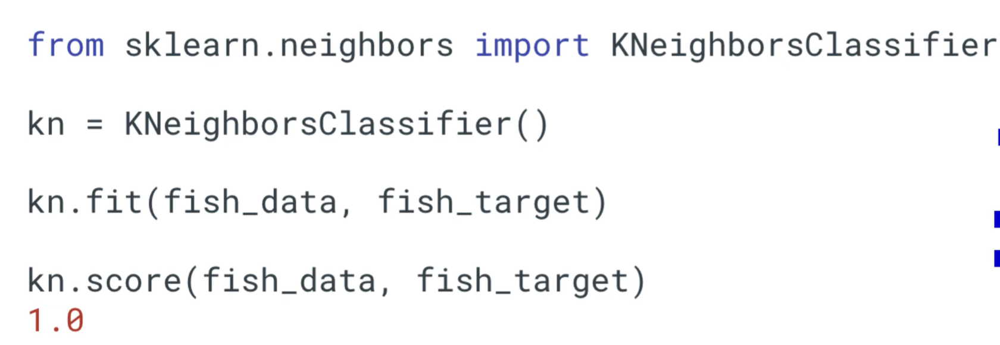
  - 훈련한 결과를 바탕으로 예측(predict)
     

  - 주변 샘플 갯수를 늘리면 알고리즘의 정확도가 달라짐. 총 갯수인 49개로 늘리면 도미 분류 정확도는 0.71이 됨  
    
  
| [Top](#목차) |

---

## 훈련 셋트와 테스트 셋트
- 지도훈련, 비지도훈련, 강화훈련 
  - 정답을 제공하면 지도훈련, 제공하지 않으면 비지도훈련
  - 환경에 적응하며 보상을 최대화하는 방식이 강화훈련  

- 훈련셋트는 훈련을 위한 데이터 셋트이고 테스트 셋트는 훈련 결과를 검증하기 위한 데이터 셋트
- 훈련셋트와 테스트 셋트에 객체 데이터를 섞어야 함 
  
- numpy(넘파이) 라이브러리를 사용하여 섞음 
  

- 섞는 방법은 훈련+테스트 셋트의 인덱스를 랜덤하게 섞음
  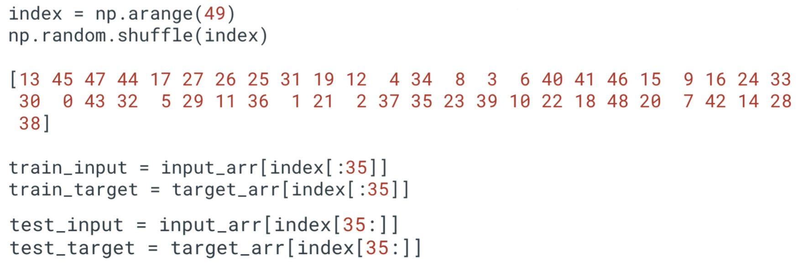

- train test split라이브러리로 데이터 나누기   
  random_state값은 항상 동일하게 섞이도록 하는 조정함수로 실제 현실에서는 사용하지 않음. 값은 아무값이나 넣으면 되나 보통 42를 사용('은하수를 건너는 히치하이커를 위한 안내서' 영화에서 만물의 비밀을 푸는 숫자에서 유래)  
  stratify는 target(정답)값을 기준으로 데이터를 섞도록 함 
   

| [Top](#목차) |

---

## 데이터 전처리

- 문제: 길이 25, 무게 150인 고기는 도미(우 상단 파란 동그라미/마름모 클래스)인데 빙어(좌하단 동그라미/마름모 클래스)로 판단      
  KNN Classification 알고리즘이 판단한 가장 가까운 객체(마름모)중 1개만 도미이고 4개가 빙어이기 때문.  
   

  실제 거리가 빙어쪽 객체들이 더 가깝기 때문임. x축과 y축 스케일을 1000으로 같게 해보면 알 수 있음. 
  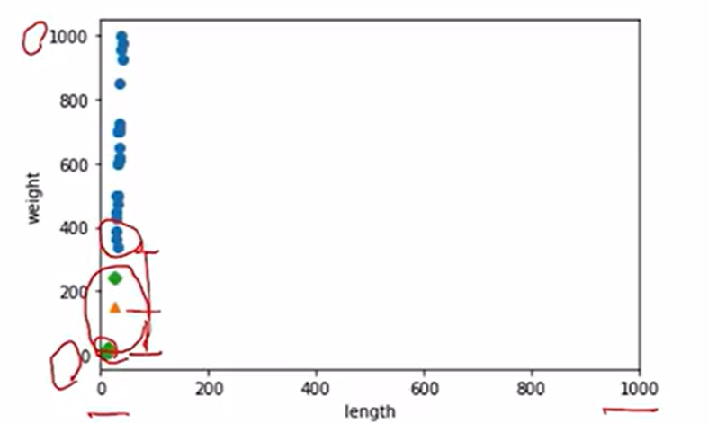

- 표준점수 환산
  - 거리에 민감한 알고리즘은 반드시 표준점수화 해야 함 
  - (훈련 데이터 - 훈련 데이터 평균) / 훈련 데이터 표준편차 
    

      
  - 새 훈련 또는 테스트 데이터도 반드시 훈련 데이터 평균과 표준편차로 표준점수화 해야 함 
    그렇게 하면 가장 가까운 데이터가 도미가 되기 때문에 정확한 결과가 나옴 
     

| [Top](#목차) |

---

## KNN(K-Nearlest Neightbors) Regressor: K 최근접 이웃 회귀 알고리즘 
- 회귀의 본래 뜻은 '원래 값이나 평균으로 돌아간다'라는 의미이나, 머신러닝에서는 '데이터 간 관계를 모델링해 **연속적인 값을 예측**하는 과정'으로 이해해야 함 
- K-최근접 이웃 회귀 개념  
  
- 예제: 도미의 길이와 무게를 훈련하여 무게 예측 
  - 훈련, 테스트 데이터 만들기 
    scikit-learn의 모델들은 2차원 배열을 입력으로 요구하므로 일차원 배열을 이차원 배열로 만듬.   
    ```
    reshape(-1, 1)의 의미:
    - `-1`: 자동으로 행의 개수를 계산
    - `1`: 열의 개수를 1개로 고정
    - 1차원 배열 `[1, 2, 3]`을 2차원 배열 `[[1], [2], [3]]`으로 변환
    ```
    

   - 훈련, 평가: R2로 예측값이 실제값과 얼마나 유사한지 스코어링 
     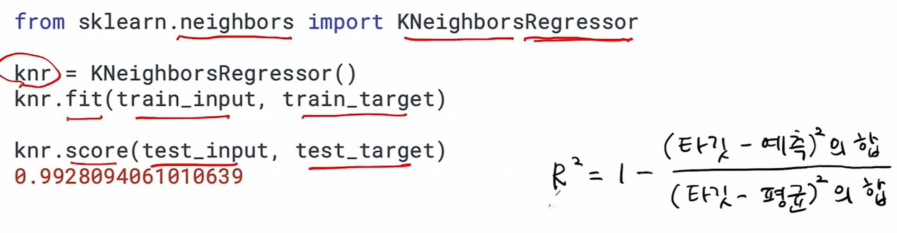
   
     테스트 데이터로 평가한 오차 구하기: 약 19g 오차를 의미  
      

- 과대적합(Overfitting)과 과소적합(Underfitting)
  - 훈련데이터 셋트의 스코어가 테스트 셋트의 스코어보다 작으면 과소적합. 그 반대면 과대적합
  - 비유: 
    - 과대적합: 과거 시험의 정답만 달달 외웠을때 과거 시험지로 보면 점수가 높지만 실제 테스트에서는 점수가 낮게 나오는 것임 
    - 과소적합: 과거 시험조차 대충 공부해서 오히려 테스트 점수가 더 높게 나오는 것임   
  - 과대/과소 적합의 해결책
    - 훈련데이터의 양과 질을 조정하는게 제일 좋으나 노력이 많이 들어감
    - 훈련데이터 조정 대신에 이웃 갯수를 줄이면 더 빨리 양질의 결과를 얻을 수 있음 
    - 이웃 갯수를 줄이면 과대적합이 되고 줄이면 과소적합이 됨. 적절한 숫자(보통 5~10)로 조정하여 훈련과 테스트 셋트의 스코어를 비슷하게 맞춰야 함
    - 비유: 1명에게만 식당 추천을 받으면 그 사람의 과거 훈련에만 의존하는 과대적합이 됨. 
      반면 취향이 다른 사람을 포함하여 30명의 의견을 들으면 관련 없는 식당을 선택하게 되는 과소적합이 됨.      
    
    

| [Top](#목차) |

---

## 선형회귀(Linear Regression): LenearRegression 
**1.배경**: 훈련데이터를 기반으로 훈련데이터를 조정하지 않고 모델을 훈련해야 함    
**2.목적**: 훈련데이터 범위 밖의 값을 예측       
**3.방법**:   
- 선형회귀 사용: 각 입력 데이터에 가중치를 곱한 결과를 더하고 조정값인 바이어스를 더하여 결과 산출              
- 계산식: y = w₁x₁ + w₂x₂ + ... + b
  
**4.예제:**   
아래 예제에서는 y = ax + b로 feature가 1개일때의 예제임.   
여기서 절편(b)는 Bias라는 말로 더 많이 사용됨.    
Bias는 편향이 아니라 결과를 조정하는 기준값이라는 의미임     
(트랜지스터의 기준 동작점을 설정하는 전압인 Bias Voltage에서 유래)
   


다항 회귀를 사용하여 예측 정확도를 높일 수 있음.    
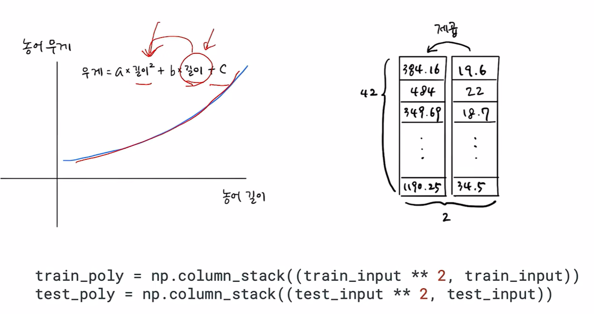

| [Top](#목차) |

---

## 특성공학(Feature Engineering)과 규제(Ridge and Lasso)
- **특성공학**: **복수개의 특성(Features)**을 이용한 회귀 기법
- 판다스(Pandas) 라이브러리: 고수준의 배열 라이브러리
  - 판다스 데이터프레임: 엑셀 시트와 같은 컬럼과 행으로 구성된 인-메모리(in-memory) 2D 테이블
- 예제 
  - transform: 특성을 추가 
  - shape: 행 갯수와 특성 갯수 출력
  - get_feature_names_out: 특정 리스트 출력
  
  

  - 훈련 및 스코어 확인  
  

- 특성 수 증가 시키기: degree 
  
  
  테스트 셋트 스코어가 매우 나쁜 이유: 과대적합되어 훈련데이터에 지나치게 의존하므로(족보만 달달 외운 수험생이 수능에서 실패하는것과 유사)

- 규제(Regulations): 과대적합 문제를 해결하는 또 다른 해결 방법 
  - 훈련셋트를 지나치게 훈련하지 못하도록 제한하는 것
  - 선형회귀 모델의 기울기(계수)를 줄이면 됨
  - 이를 위해 StandardScaler를 사용하여 데이터를 정제함 
  - 릿지(Ridge)와 라쏘(Lasso)
    - 릿지는 계수를 제곱한 값으로 제한, 라쏘는 절대 계수값으로 제한
    - StandardScaler로 정제한 데이터에 Ridge 또는 Lasso로 계수값을 제한
    
    ```
    from sklearn.preprocessing import StandardScaler

    ss = StandardScaler()
    ss.fit(train_poly)

    train_scaled = ss.transform(train_poly)
    test_scaled = ss.transform(test_poly)
    
    
    from sklearn.linear_model import Ridge

    ridge = Ridge()
    ridge.fit(train_scaled, train_target)
    print(ridge.score(train_scaled, train_target))
    ```
    - 비유:
      ```
      ### **Ridge = 음량 조절기**
      모든 악기 볼륨을 조금씩 낮춤
      - 바이올린: 100 → 80
      - 피아노: 100 → 85
      - 드럼: 100 → 75
      (모든 악기 연주는 계속됨)
    
      ### **Lasso = 악기 선택**
      중요한 악기만 연주
      - 바이올린: 100 ✓
      - 피아노: 0 ✗ (완전히 제거)
      - 드럼: 100 ✓
      (일부 악기는 아예 안 씀)
      ``` 

| [Top](#목차) |

---

## 로지스틱 회귀(Logistic Regression): LogisticRegression
선형회귀는 연속적인 특정 값을 정확하게 예측하는 기법이라면    
로지스틱 회귀는 클래스(범주)에 속할 확률을 예측하는 기법임.    
예) '공부 시간에 따른 시험 점수 예측'은 선형회귀 사용, '공부 시간에 따른 합격/불합격 예측'은 로지스틱 회귀 사용

로지스틱 회귀는 "이름은 회귀지만 실제로는 분류"

### 선형회귀와 로지스틱 회귀의 계산방식 차이
  - 선형 회귀 
    ```
    # 수식
    y = w₁x₁ + w₂x₂ + ... + b

    # 예시
    집값 = (3만원 × 평수) + (500만원 × 방개수) + 1억원
        = 3 × 30 + 500 × 3 + 10000
        = 11,590만원
    ``` 

  - 로지스틱 회귀: Sigmoid 함수 사용(e는 자연상수로 약 2.71828) 
    ```
    # 수식
    z = w₁x₁ + w₂x₂ + ... + b
    y = 1 / (1 + e^(-z))  ← Sigmoid 함수

    # 예시
    z = (0.5 × 공부시간) - 2
      = 0.5 × 6 - 2 = 1

    y = 1 / (1 + e^(-1))
      = 1 / (1 + 0.368)
      = 0.73 (73% 합격 확률)
    ```

  - 참고
    - Sigmoid는 'S처럼 생긴'이라는 뜻으로 z의 값에 따른 결과값 y의 그래프가 S모양으로 그려지기 때문에 붙여짐. 로지스틱 함수라고도 함. 
    - Logistic은 S자 곡선 모양의 성장 패턴을 의미하며 '합리적, 계산적'이라는 그리스어에서 유래 
    - Logistic 함수는 인구 성장 패턴, 경제 성장 패턴, 한계 효용의 법칙 등 성장 패턴을 합리적으로 설명하는데 사용할 수 있음. 
    - 자연상수 'e'
      - 베르누이(통계학과 미적분학의 선구자)의 복리이자 계산에서 산출됨: 무한대로 복리 이자를 주면 원금 1원은 얼마가 될까 ? -> 약 2.71828원이 됨 
      - 오일러(천재 수학자)가 산출 공식을 수학적으로 단순화 하고 상수 'e'라고 명명
        -> 'e = 1/0! + 1/1! + 1/2! + 1/3! + 1/4! + ...'
        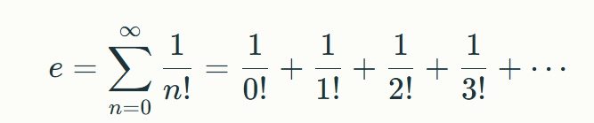 
      - 생물 성장, 방사능 붕괴, 소리 감쇠 등 자연현상을 계산할 때 'e'값이 완벽하게 적용되므로 자연상수라고 함. 

### 로지스틱 회귀의 개념
   

### 로지스틱 회귀 필요성
  - KNN Classifier를 이용한 확률 계산의 한계 
    - KNN Classifier는 근접한 데이터를 바탕으로 확률을 추정
    - KNN Classifier의 predict_proba 함수 사용
      ```
      from sklearn.neighbors import KNeighborsClassifier

      kn = KNeighborsClassifier(n_neighbors=3)
      kn.fit(train_scaled, train_target)

      ... 

      import numpy as np

      proba = kn.predict_proba(test_scaled[:5])
      print(np.round(proba, decimals=4))
      ```   
    - 이웃의 수에 따라 확률이 나올 경우의 수가 결정: 3개인 경우 4개(0/3, 1/3, 2/3, 3/3)
    - 결론적으로 KNN Classifier로는 정확한 확률 예측 한계 
     
  - 로지스틱 회귀로 개선
    - 계산식
      ```
      1단계: 선형 결합 (Linear Combination)
      z = β₀ + β₁x₁ + β₂x₂ + ... + βₙxₙ

      2단계: Sigmoid 변환
      σ(z) = 1 / (1 + e^(-z))
      ``` 
      'σ'는 small 시그마라고 부름. 표준편차나 시그모이드 함수를 나타냄.   
      참고로 'Σ'는 capital 시그마로 부르고 합을 나타냄.    

    - 예시
      - 'C': 
        - 규제(Contraints)의 수준을 정의한 하이퍼 파라미터
        - 규제란 훈련데이터를 얼마나 충실하게 훈련할지를 의미함. 값이 높으면 훈련데이터를 많이 훈련하게됨
        - 기본값은 '1.0'이고 복잡한 모델일 수록 값을 높임. 높아 질수록 과적합 위험은 커짐.  
      
      ```
      from sklearn.linear_model import LogisticRegression

      lr = LogisticRegression(C=20, max_iter=1000)
      lr.fit(train_scaled, train_target)

      proba = lr.predict_proba(test_scaled[:5])
      print(np.round(proba, decimals=3))
      ``` 

      ```
      [[0.    0.014 0.842 0.    0.135 0.007 0.003]
      [0.    0.003 0.044 0.    0.007 0.946 0.   ]
      [0.    0.    0.034 0.934 0.015 0.016 0.   ]
      [0.011 0.034 0.305 0.006 0.567 0.    0.076]
      [0.    0.    0.904 0.002 0.089 0.002 0.001]]
      ```

      ```
      print(lr.classes_)
      ['Bream' 'Parkki' 'Perch' 'Pike' 'Roach' 'Smelt' 'Whitefish']
      ```

    - 위 로지스틱 회귀 함수의 내부적 처리
      결정함수값 z 구하기  
      ```
      decision = lr.decision_function(test_scaled[:5])
      print(np.round(decision, decimals=2))
      ```     

      Sigmoid함수로 결과값 구하기   
      softmax는 총합이 1이 되도록 만드는 역할.  
      ```
      from scipy.special import softmax

      proba = softmax(decision, axis=1)
      print(np.round(proba, decimals=3))
      ```

### 이항분류/다항분류
찾아야 할 클래스의 숫자에 따라 2개인 경우와 2개 이상인 경우를 의미.   
로지스틱 회귀는 이항분류와 다항분류를 모두 계산할 수 있음.    
다항분류 예제는 위에 있고 아래는 이진분류 예제임.   


확률이 0/5 초과면 양성 클래스, 미만이면 음성 클래스라고 함 

| [Top](#목차) |

---

## 확률적 경사 하강법(SGD: Stochastic Gradient Descent)

### 개념
**랜덤 샘플로 빠르게 배우는 AI 훈련법**

```
'안개 낀 산에서 내려오기'

- 산 정상에서 아래로 내려가고 싶은데 시야가 흐림
- 전체 길을 다 볼 수 없으니 발 주변만 보고 가장 낮은 방향으로 한 걸음씩
- 때로는 조금 돌아가기도 하지만 계속 내려가다 보면 골짜기에 도착"
```


- 에포크(epoch): 전체 훈련 데이터셋을 한 번 완전히 훈련하는 주기를 의미하며, 
  그리스어의 '중단, 특정시점'이라는 말에서 유래함

### 장단점
- 장점
  - 빠른 훈련 속도
  - 적은 메모리 사용
  - 온라인 훈련 가능

- 단점
  - 경로가 불안정 (지그재그)
  - 정확한 최적점 도달 어려움
  - 하이퍼파라미터 조정 필요

### 손실함수/비용함수
- 손실함수(Loss Function)는 샘플 하나에 대한 손실이고 비용함수(Cost Function)는 모든 샘플에 대한 손실의 합임 
- L(θ) = 예측값과 실제값의 차이를 수치화한 함수
- 손실함수는 AI의 "성적표"이자 "내비게이션": 실제값과의 차이를 측정하는 지표 
- 손실함수는 '정답이 있는 경우' 사용
- 부적합한 분야: 주관적, 규칙적, 통계적 평가


참고) log는 "밑을 몇 번 곱해야 원하는 수가 되는가?"를 나타내는 수학 도구

### 크로스 엔트로피(Cross Entropy) 
분류에서 사용되는 손실함수의 한 종류 
```
MSE (회귀):        Cross-Entropy (분류):
실제: 5.0          실제: 고양이(1, 0, 0)
예측: 4.8          예측: (0.7, 0.2, 0.1)
오차: 0.04         오차: 0.357

연속적 값          확률 분포
```

- 분류는 크로스엔트로피, 회귀는 MSE 또는 MAE사용
  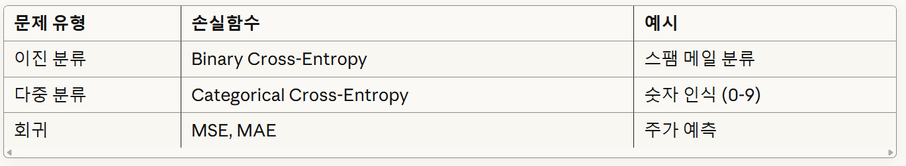

- MSE(Mean Squad Error)와 MAE(Mean Absolute Error)
  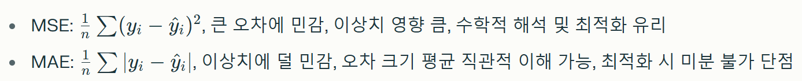

### SGD Classifier 예제
- max_iter: Epoch(에포크) 횟수 
- log: 손실함수 종류
- partial_fit: 추가 훈련 메소드 


- SGD의 규제 수단은 에포크  
  

- 스코어가 높으면서 가장 최소의 에포크는 100번 정도  
  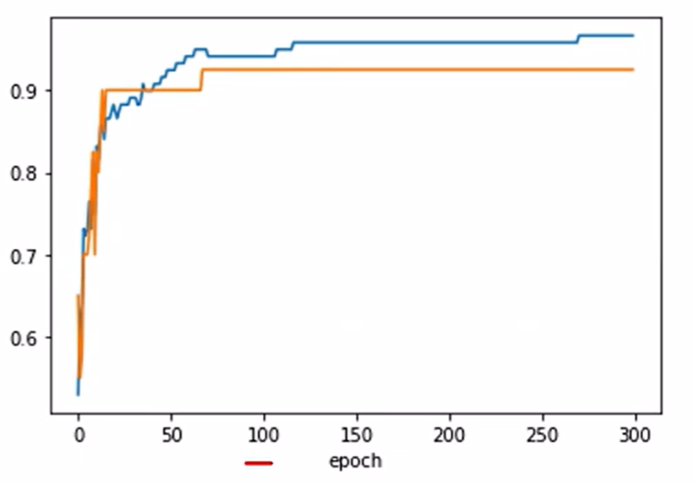

- 에포크가 많아질수록 과대적합됨
  
| [Top](#목차) |

---

## 결정 트리(Decision Tree)
### 개념
- 특성과 특성의 기준값에 대한 결과값을 반복하여 예측하는 방법 
- 마치 스무고개 게임처럼 질문과 답을 반복하며 정답의 범위를 좁혀가는 원리
- 노드(Node)와 브랜치(Branch)로 구성되며 가장 상위 노드를 루트 노드라 하고 가장 하위 노드를 리프노드라고 함 
- 앙상블 모델의 핵심 모델 
- 트리 모양으로 이해하기 쉬운 모델 생성 가능 

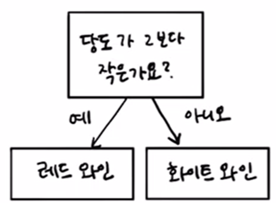

### 불순도(Gini Impurity)
- 클래스가 섞여 있는 정도
- Gini = 1 - Σ(pᵢ)² : 1에서 각 클래스의 비율을 제곱한 총합을 뺀 값
- 가장 최적의 질문을 찾는데 사용됨 
- Decesion Tree에서는 Geni 대신에 Entropy를 사용할 수 있음 
  - Entropy = -Σ(pᵢ × log₂(pᵢ))
  - 결과가 비슷하고 더 간단한 Gini를 사용
  - SGD에서 실제값과의 차이를 측정하는 Cross Entropy와 Entropy는 전혀 다름
- 어원은 Corrado Gini 라는 이탈리아 통계학자의 이름이며 Gini는 지니계수라는 불평등 측정 지표를 만든 사람임  
  
### 예시: 특성인 Sugar값에 따라 Decision Tree 작성
- gini: 불순도
- samples: 샘플 데이터 갯수
- values: 음성클래스 갯수와 양성클래스 갯수(갯수/총갯수가 0.5 초과면 양성 클래스) 
    


### 정보획득(Informaion Gain)
- 부모의 불순도에서 자식들의 가중 평균 불순도를 뺀 값이 정보획득값임
- Decesion Tree에서는 이 정보획득값을 최대화하는 질문을 선택하는것이 핵심  
- 정보획득값이 크다는 것은 결국 부모는 많이 섞여있고 자식들을 최소로 섞여 있다는 것임     
- 계산식
  ```
  IG = I(부모) - [N_left/N_parent × I(left) + N_right/N_parent × I(right)]

  여기서:
  - IG = Information Gain (정보 획득)
  - I(·) = Impurity (불순도: Gini 또는 Entropy)
  - N = 샘플 개수
  ``` 

### Decesion Tree는 데이터 전처리 불필요
- 선형회귀나 로지스틱회귀에서는 훈련/테스트 데이터의 Feature간 스케일이 다르면 스케일이 큰 Feature가 가장 중요한 특성이 되버림 
  - 선형회귀: y = w₁x₁ + w₂x₂ + ... + b
  - 로지스틱회귀: z = w₁x₁ + w₂x₂ + ... + b, σ(z) = 1 / (1 + e^(-z)) 
- Decesion Tree는 각 Feature간 영향도가 없으므로 전처리 불필요 

| [Top](#목차) |

---

## 교차검증과 그리드 서치

### 검증셋트 필요성
- 훈련세트와 테스트세트로 모델을 훈련시킬 때 문제 
  - 테스트 셋트의 정확도를 높이기 위해 파라미터를 계속 조정해 감
  - 결국 테스트 셋트에 최적화된 모델이 되버려 실제 현실과의 괴리가 생길 수 있음 

- 해결책
  - 검증셋트를 추가: 예) 훈련:검증:테스트 비율을 6:2:2로 함
  - 하이퍼 파라미터 튜닝을 하여 검증셋트의 정확도를 높이고 테스트 셋트는 가장 마지막에 한번만 사용함
  - 데이터 양이 10000개 이상이라면 검증과 테스트 비율을 좀 더 줄여도 됨 
  
### 교차검증(Cross validation): cross_validate()
- 훈련과 검증 데이터를 조합하여 여러개의 그룹으로 나눔. 나뉘어진 각 데이터 그룹을 폴드(fold)라고 함
  폴드 예시: 3개 폴드로 나눈 예 
  ```
  전체 데이터: [1, 2, 3, 4, 5, 6, 7, 8, 9, 10]

  ━━━━━━━━━━━━━━━━━━━━━━━━━━━━━━━━━━━━━━━━━━━━

  【Fold 1】
  ┌─────────────┬─────────────┬──────────┐
  │  훈련A(3개)  │  훈련B(4개)  │  검증(3개) │
  │  [4,5,6]    │  [7,8,9,10] │  [1,2,3]  │
  │   ████      │   █████     │    🔴     │
  └─────────────┴─────────────┴──────────┘
      30%           40%          30%


  【Fold 2】
  ┌─────────────┬─────────────┬──────────┐
  │  훈련A(3개)  │  훈련B(4개)  │  검증(3개) │
  │  [1,2,3]    │  [7,8,9,10] │  [4,5,6]  │
  │   ████      │   █████     │    🔴     │
  └─────────────┴─────────────┴──────────┘
      30%           40%          30%


  【Fold 3】
  ┌─────────────┬─────────────┬──────────┐
  │  훈련A(3개)  │  훈련B(3개)  │  검증(4개) │
  │  [1,2,3]    │  [4,5,6]    │[7,8,9,10] │
  │   ████      │   ████      │    🔴     │
  └─────────────┴─────────────┴──────────┘
      30%           30%          40%

  ━━━━━━━━━━━━━━━━━━━━━━━━━━━━━━━━━━━━━━━━━━━━
  ```
- 각 폴드별로 검증셋트로 모델을 평가   
- 폴드를 나누는 목적: 다양한 조합으로 훈련하여 평균 성능을 높임. 어떤 폴드가 최고 모델인가를 찾는것이 아님. 
- 폴드의 갯수는 일반적으로 5~10개로 함  
- 예시: 
  - cross_validate: 테스트 셋트를 제외한 훈련과 검증셋트를 폴드로 분할하여 훈련 및 교차 검증하는 함수 
  - 아래 예에서 5개 폴드로 나누었고 test_score에 각 폴드의 스코어가 나옴. 평균값은 약 0.855가 됨.  
  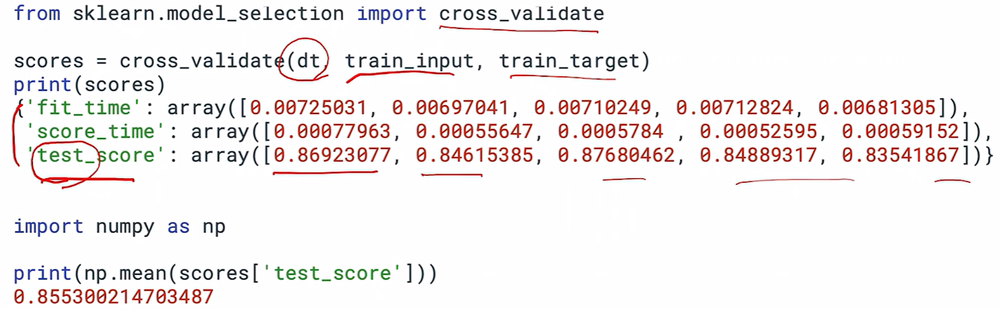 

### 폴드 분할기 
- 사이킷런은 분류모델인 경우 StratifiedKFold, 회귀모델인 경우 KFold 라이브러리 사용 
- 이 폴드분할기가 각 폴드에 골고루 데이터가 조합되도록 해줌 
- 예제:
  기본값이 5개 폴드로 나눔
  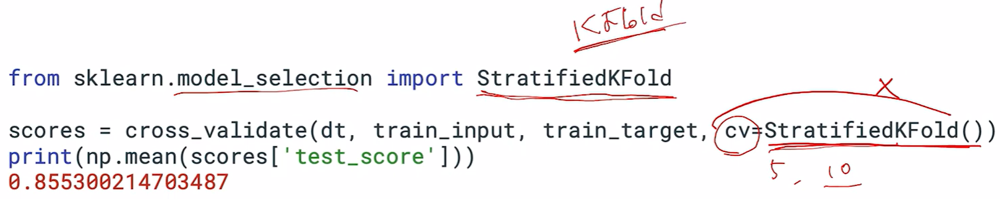

  n_splits에 폴드 갯수를 넣어 지정한 수만큼의 폴드를 생성하도록 함
  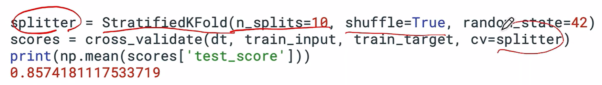
  
### 그리드 서치(Grid Search): GridSearchCV
- 머신러닝 모델의 최적 하이퍼파라미터를 찾기 위한 체계적인 탐색 방법
- 비유: 
  ```
  "최고의 레시피 찾기"
  마치 요리할 때 최적의 맛을 내기 위해 아래와 같이 각 Factor를 바꿔가며 최적의 조합을 찾는 것. 
  소금의 양: 1작은술, 2작은술, 3작은술
  설탕의 양: 반 작은술, 1작은술, 2작은술
  조리 시간: 10분, 15분, 20분
  ``` 
- 단일 파라미터 방식: 한가지 파라미터의 값만 바꿔가며 탐색 
  - min_impurity_decrease: 불순도 값이 어느 값 이하면 중단할 것인가 ? 
  - 'n_jobs: -1': 모든 Core를 사용하는 옵션 
  - 예시: 
       
    
    3가지 주요 결과물 확인  
    ```
    # 세 가지 주요 결과물
    dt = gs.best_estimator_        # ← 최적 모델 (바로 사용 가능)
    best_params = gs.best_params_   # ← 최적 파라미터 값들
    best_score = gs.best_score_     # ← 최고 점수
    ```

- 다중 파라미터 방식: 복수 파라미터의 값을 조합해가며 탐색 
  ```
  params = {
      'min_impurity_decrease': [0.0001, 0.0003, 0.0005],  # 3개로 줄임
      'max_depth': [5, 10, 15],                           # 3개
      'min_samples_split': [2, 5, 10],                    # 3개
      'criterion': ['gini', 'entropy']                     # 2개
  }
  # 총 3 × 3 × 3 × 2 = 54가지 조합
  ``` 

### 랜덤서치: RandomizedSearchCV
- 파라미터의 값을 랜덤하게 뽑아서 최적 하이퍼파라미터를 찾는 방법 
- randint와 uniform 사용하여 파라미터값을 랜덤하게 구함 
  - randint: 지정된 범위에서 랜덤 정수값 구할 때 사용
  - uniform: 지정된 범위에서 랜덤 소수값 구할 때 사용
  - rvs: 뽑을 난수의 갯수 
  
- 예제
  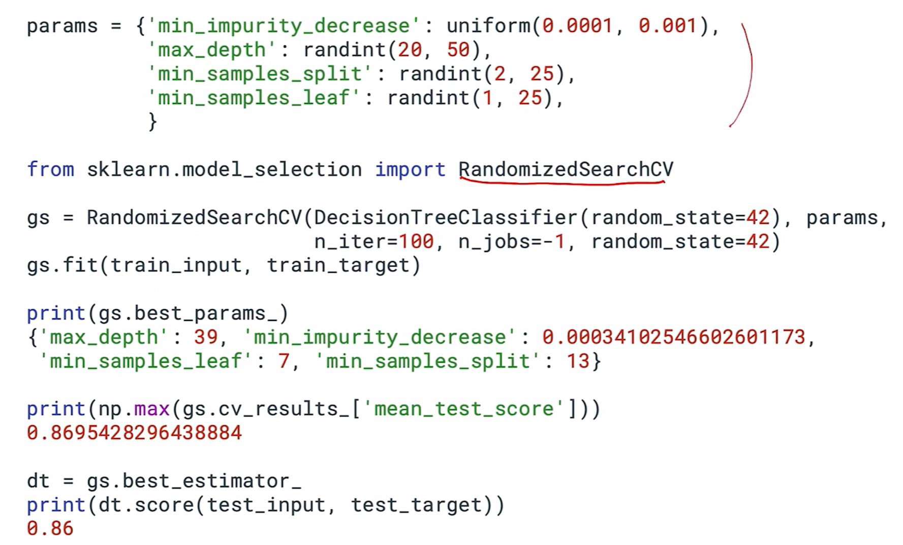

| [Top](#목차) |

---

## 트리의 앙상블
### 앙상블 개념
- 여러 모델을 결합해 더 나은 성능을 얻는 알고리즘
- 정형데이터를 처리하는 가장 좋은 알고리즘
- Bagging, Boosting, Stacking의 3가지 방법이 있음
  - Bagging: 여러 모델의 결과 중 다수 결과 채택. Bootstrap AGGregatING의 약자로 자력으로 돌아가는 모델(Bootstrap)의 집단지성을 집계(Aggregating)하는 방식 
  - Boosting: 각 모델을 순차적으로 훈련시키면서 이전 모델의 잘못을 바로잡는 방식. 점진적으로 성능을 높이는(Boosting) 방식 
  - Stacking: 여러 모델의 결과를 모아서 판단 모델이 최종 결과를 내는 방식. 여러 모델이 있는 층(Stack)과 판단하는 층(Stack)으로 나누어져 있음
  
### 랜덤포레스트: RandomForestClassifier
- 랜덤포레스트는 Bagging 방식의 앙상블 알고리즘 
- 랜덤포레스트(Random forest)는 복수개의 Decesion Tree 모델을 랜덤하게 생성하여 모델숲을 만들어 성능을 최적화 
- 목적: 성능 최적화, 과적합 최소화, 중요 변수 포착 
- 방법
  - Bootstrap Sampling: 훈련 세트에서 무작위로 샘플 데이터 샘플링
  - Feature Sampling: 특성 집합에서 특성개수의 루트개 만큼 무작위로 특성 선택 
  - Voting: 각 모델의 결과에서 다수 결과를 예측으로 결정

  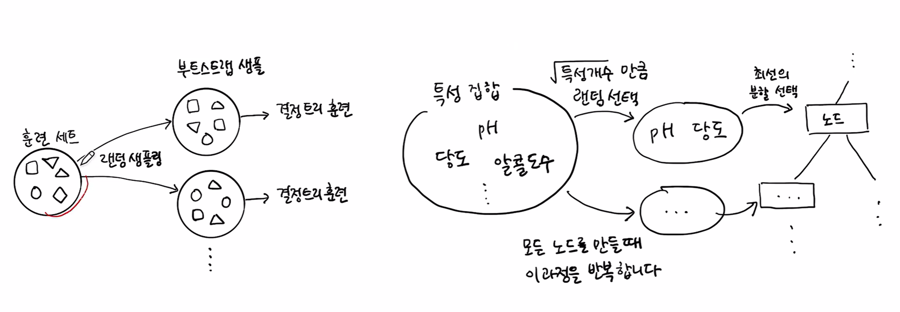

- 예시)
  - 1단계: 부트스트랩 샘플링 (Bootstrap Sampling)
    ```
    원본 데이터: [1, 2, 3, 4, 5, 6, 7, 8, 9, 10]

    무작위 복원 추출

    샘플1: [1, 3, 3, 5, 7, 9, 10, 10] → 나무1 훈련
    샘플2: [2, 2, 4, 6, 7, 8, 9, 10]  → 나무2 훈련
    샘플3: [1, 2, 4, 5, 5, 7, 8, 9]   → 나무3 훈련
    ...
    샘플100까지
    ```

  - 2단계: 랜덤 특성 선택 (Random Feature Selection)
    각 특성 갯수: 루트 9이므로 3이됨 
    ```
    전체 특성: [크기, 색깔, 무게, 당도, 향, 길이, 넓이, 염분, 칼로리]
            ↓
    각 나무는 무작위로 일부만 사용

    나무1: [크기, 향, 칼로리]만 사용
    나무2: [색깔, 당도, 넓이]만 사용
    나무3: [무게, 길이, 염분]만 사용
    ```

  - 3단계: 다수결 투표 (Voting)
    ```
    새로운 과일 예측 시:

    나무1: "사과" 
    나무2: "사과"
    나무3: "배"
    나무4: "사과"
    ...
    나무100: "사과"

    최종 결과: "사과" (다수결) 
    ```
  
  - RandomForestClassifier 예제 
    - cross_validate: 사전 모델 평가(훈련하고 결과 버림)
    - fit: 실제 모델 훈련 
     

    - OOB(Out Of Bag) 활용: 무료 검증 셋트 
      - bootstrap 샘플링 시 훈련 셋트의 67%만 사용. OOB는 샘플링하지 않은 나머지 훈련세트를 의미
      - OOB를 무료 검증 셋트로 활용하여 모델을 평가할 수 있음: oob_score=True
       
      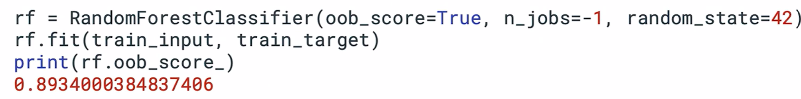 

### 엑스트라 트리: ExtraTreesClassifier 
- Random Forest 보다 더 빠르고 과적합을 더 줄이기 위한 앙상블 알고리즘
- 방법:
  - Random sampling 않하고 각 모델이 100%의 훈련셋트로 훈련 
  - Random feature selection은 수행 
  - 각 Feature의 최적 분할점을 랜덤하게 수행 
    ```
    Random Forest - "최선의 분할점 찾기"

    키로 분류할 때:
    150cm 시도 → 정보이득: 0.3
    160cm 시도 → 정보이득: 0.5  ✓ 최고!
    170cm 시도 → 정보이득: 0.4
        ↓
    160cm 선택 (최적값 탐색)

    ---

    🎲 Extra Trees - "랜덤 분할"

    키로 분류할 때:
    난수 생성 → 163cm 나옴
        ↓
    163cm 선택 (계산 안 함, 즉시 사용)
    ```  
- 단점: 정확도는 떨어질 수 있음

### 그레이디언트 부스팅: GradientBoostingClassifier
- 각 모델을 순차적으로 훈련시키면서 이전 모델의 잘못을 바로잡는 방식. 점진적으로 성능을 높이는(Boosting) 방식 
- 정확도가 높기 때문에 **제일 많이 사용하는 알고리즘** 
- 비유) 오답 노트 만들어서 성적 올리기
- 예시)
  ```
  ### 경사하강법 원리
  손실 함수 (Loss Function)
        ↓
    실제 - 예측 = 오차
        ↓
    오차를 줄이는 방향으로 이동
        ↓
    Gradient (기울기) 계산
        ↓
    그 방향으로 한 걸음 (learning_rate)
  ```

  **수식으로 보면:**
  ```
  새로운 예측 = 이전 예측 - (훈련률 × 그레이디언트)

  예측₁ = 70
  그레이디언트₁ = -30 (오차)
  예측₂ = 70 - (0.1 × -30) = 73

  예측₂ = 73
  그레이디언트₂ = -27
  예측₃ = 73 - (0.1 × -27) = 75.7

  ...계속
  ```  
- Key
  - 순차적 훈련 (이전 실수 보완)
  - learning_rate (보폭 조절)
  - 약한 훈련기 여러 개 (max_depth 작게)
- 권장조합
  ```
  n_estimators=100
  learning_rate=0.1
  max_depth=3
  ``` 
- 코드예제:
  

### 히스토그램 기반 그레이디언트 부스팅: HistGradientBootingClassifier
- 목적:
  - 속도 혁명: 기존 GB 대비 10~100배 빠름
  - 정확도 유지: 성능은 GB와 비슷
  - 대용량 데이터 처리: 데이터 압축으로 메모를 절약하여 대량 데이터 처리
- 방법
  - 데이터 전처리 방식: 구간화(Bining)
    ```
    GB:
    원본 데이터 그대로 사용
    [152.3, 163.7, 158.9, 171.2, ...]
        ↓
    모든 값을 float로 메모리에 저장

    ---

    Hist GB:
    히스토그램 변환 (구간화)
    [152.3, 163.7, 158.9, 171.2, ...]
        ↓
    [20, 45, 32, 78, ...] (8비트 정수)
        ↓
    메모리 75% 절약!
    ```
  - 분할점 탐색 방식
    ```
    GB:
    모든 고유값을 분할점 후보로 시도
    값 10,000개 → 10,000번 비교

    ---

    Hist GB:
    구간(bin)만 분할점 후보로 시도
    최대 255개 구간 → 255번 비교
    ``` 
  - 결측치 처리 방식
    ```
    GB:
    ❌ 결측치 있으면 에러!
    전처리 필수 (imputation)

    ---

    Hist GB:
    ✅ 결측치를 별도 구간(bin)으로 자동 처리
    전처리 불필요!
    ``` 
  - 트리 성장 방식
    ```
    GB:
    Level-wise (수평 성장)
        Root
        /    \
      A      B    ← 레벨 완성 후 다음
      / \    / \
    C   D  E   F

    ---

    Hist GB:
    Leaf-wise (최적 우선 성장)
        Root
        /    \
      A      B
      / \
    C   D        ← 손실 큰 곳 우선
    /
    E
    ``` 

- 강점
  - 히스토그램 변환 (Binning): 모든 값 → 255개 구간
  - 정수 변환 (8비트): 메모리 75% 절약
  - 결측치 자동 처리: 전처리 불필요

- 프로그램 예시
  ```
  from sklearn.ensemble import HistGradientBoostingClassifier

  hgb = HistGradientBoostingClassifier(
      max_iter=100,           # 충분한 반복
      max_bins=255,           # 최대 정밀도
      learning_rate=0.1,      # 표준 훈련률
      max_leaf_nodes=31,      # 과적합 방지
      early_stopping=True,    # 조기 종료
      validation_fraction=0.1, # 검증 세트
      random_state=42
  )

  hgb.fit(X_train, y_train)
  ``` 

- Hist GB는 'feature_importances_' 대신에 Permutation(순열) Importance를 사용
   

  참고) 순열: 총 n개의 원소에서 r개를 배열하는 것 
  
  
### XGB(XGBoost) and LGBM(LightGBM): XGBClassifier and LGBMClassifier
- XGB와 LGBM 모두 Gradiant Boosting을 발전시킨 알고리즘으로 실무에서 제일 많이 사용됨 
- 훈련데이터가 대용량(약 100만 이상)이면 LGBM, 그 이하이면 XGB가 좋음
- LGBM은 Hist GB기반으로 MS가 만들었으며 XGB보다 더 빠르고 메모리 효율적인 알고리즘
  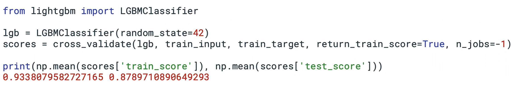
   
- XGB도 tree_method를 hist로 변경하여 Hist GB 기반으로 동작하게 할 수 있음
   

| [Top](#목차) |

---

# 머신러닝: 비지도 훈련

비지도훈련은 정답 없이 입력 데이터만으로 정답을 예측하는 방법

## 군집(Custering) 알고리즘

사과, 파인애플, 바나나의 밝기 데이터를 이용하여 구별하기   
정답 없이 샘플 데이터만을 이용하여 클러스터링하는 방법을 사용함.      

### 차원 변경 후 평균값으로 구별해 보기    
- ML에서는 이미지의 밝기값을 반전하여 처리: 
  - 밝기값은 0이 검정이고 255가 흰색임.
  - 원래 밝기값으로 하면 아래와 같이 배경이 높은 밝기값을 갖게 되어 처리가 어려움
    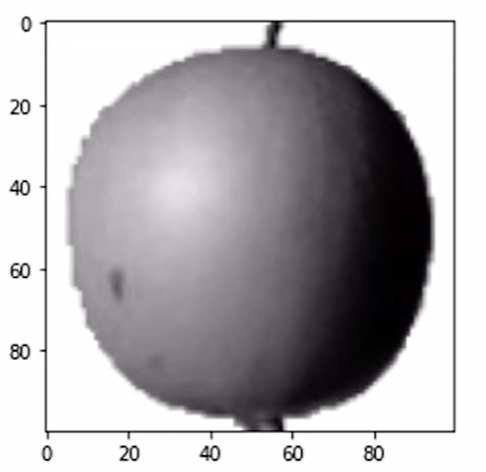   
  - 그래서 아래와 같이 색깔값을 반전하여 처리     
    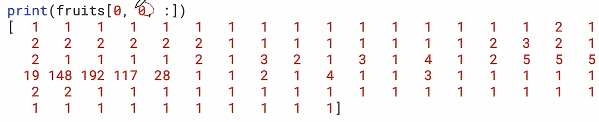   

    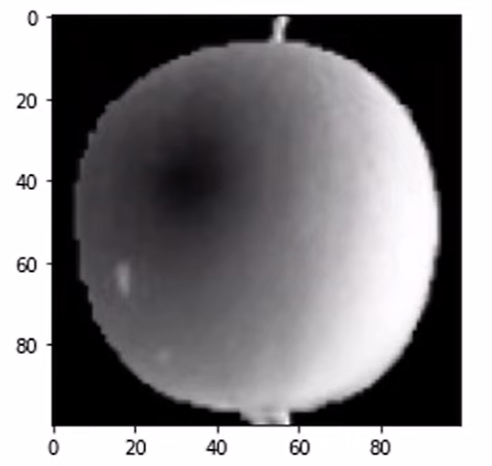  
    
- 많은 ML 알고리즘은 처리를 간단하게 하기 위해 1차원 배열만 지원하는 것이 많음    
  3개의 정사각형이 각각 3개의 어떤 특성값(예: 가로, 세로, 색깔)을 가질 때 3번째 정사각형의 세로 길이를 구한다면,    
  2차원 배열은 3행을 찾고 3번째 값인 9를 찾아야 함.     
  1차원 배열은 9번째 값을 바로 찾을 수 있음.      
  ```
  # 변환 전: 3×3 정사각형
  [[1, 2, 3],
  [4, 5, 6],
  [7, 8, 9]]

  # 변환 후: 1×9 한 줄
  [1, 2, 3, 4, 5, 6, 7, 8, 9]
  ``` 
  
  차원 변경 예시:    
  100개의 사과, 100개의 파인애플, 100개의 바나나 데이터의 가로 100개, 세로 100개의 색깔값을 10000개의 일차원 배열로 바꿈.     
  reshape의 첫번째 인자 '-1'은 자동으로 앞에 지정한 fruit갯수만큼 차원을 변형하라는 뜻임.    
  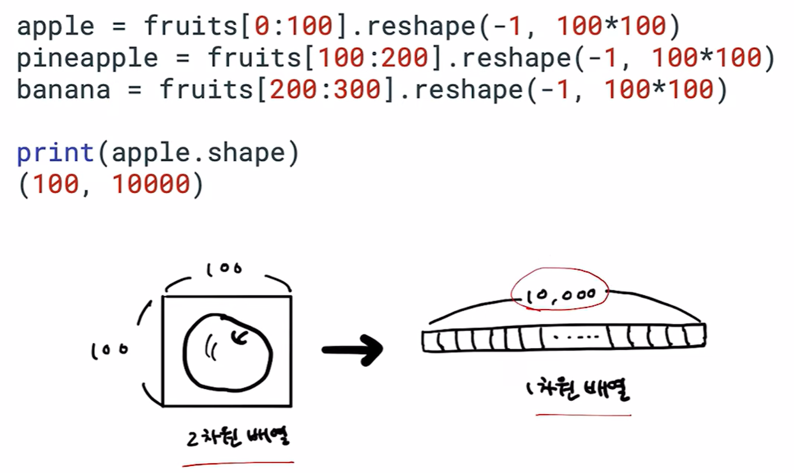

- 밝기값 평균 히스토그램
  - 밝기 평균값을 구하는 방식은 수평으로 각 이미지별 밝기값의 평균을 구하는 방법과 수직으로 각 밝기 픽셀 위치별 평균값을 구하는 방식이 있음    
  - 각 이미지의 밝기를 평균했을 때: x 축은 밝기값(0~255)의 평균값, y축은 해당 평균값을 가지는 과일의 갯수임.     
    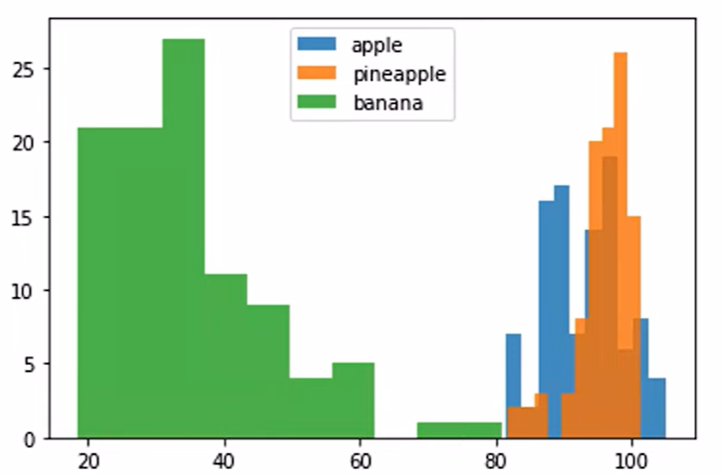    
    바나나는 어느정도 구별이 되나 파인애플과 사과는 구별이 힘듦    

  - 각 픽셀의 위치 평균값을 구할 때: x축은 밝기 픽셀의 위치(0~9999), y축은 그 위치의 밝기 픽셀 평균 값 
    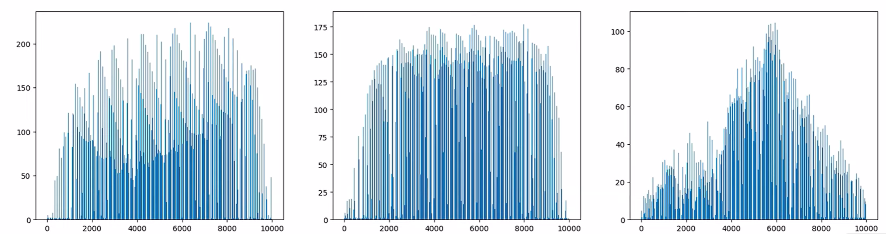  
    역시 각 과일을 구별하기 힘듦    

  - 평균값 구하는 방식 비교      
    

- 각 픽셀 밝기 평균을 100 * 100으로 reshape하여 이미지 그리기    
  쉽게 얘기하면 100개의 이미지를 각 픽셀 위치의 평균값으로 그리는것임.    
  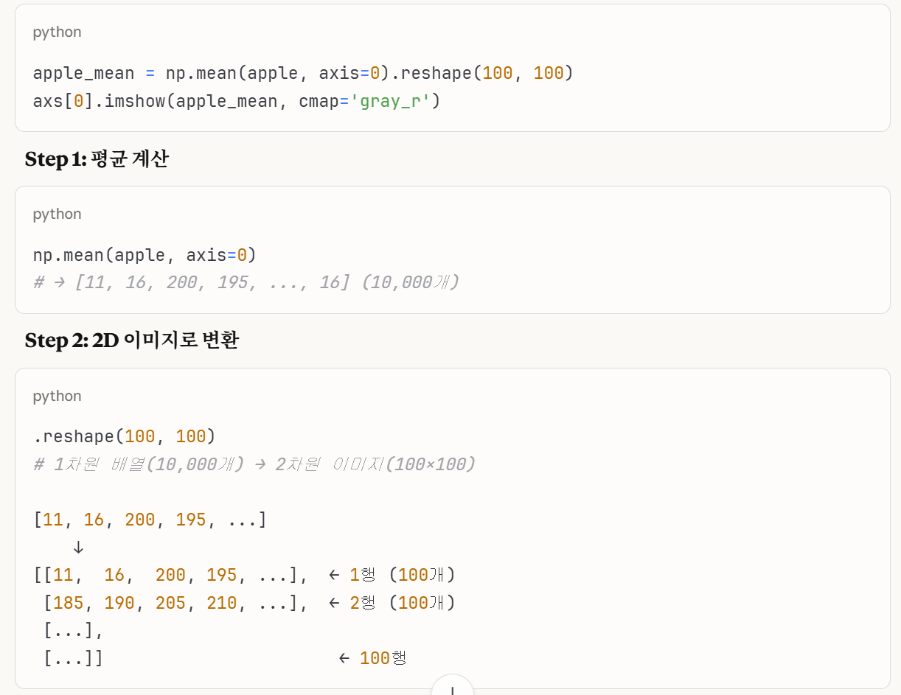

  


### 평균과 가장 가까운 사과 찾기    
- 이것은 마치 평균값과 가장 작은 차이가 나는 답안을 찾는것과 같음.      
  ```
  🍎 평균 = 모범 답안

  학생1 답안: 모범 답안과 50점 차이
  학생2 답안: 모범 답안과 85점 차이  
  학생3 답안: 모범 답안과 15점 차이 ← 가장 비슷함!
  ...
  학생300 답안: 모범 답안과 300점 차이
  ```
- 전체 과일의 각 픽셀 위치별 값 합치기
  ```
  fruits = np.concatenate([apple, pineapple, banana], axis=0)
  ``` 

- 사과의 각 픽셀 위치별 평균 구하기
  ```
  apple_mean = np.mean(apple, axis=0)
  ```    
  결과:
  ```
  apple_mean.shape = (10000,)
  # [평균0, 평균1, 평균2, ..., 평균9999]
  ```
- 전체 과일의 각 픽셀 위치별 밝기값과 사과의 각 픽셀 위치별 평균의 차이 구하기    
  ```
  abs_diff = np.abs(fruits - apple_mean)  # (300, 10000)
  ``` 

- 각 과일(총 300개)의 평균 차이 구하기  
  ```
  abs_mean = np.mean(abs_diff, axis=1)
  ``` 
- 가장 사과와 근접한 이미지 찾기
  가장 평균과 차이가 적은 이미지의 위치를 총 300개 과일에서 찾음.      
  ```
  most_similar_idx = np.argmin(abs_mean)
  print(f"가장 비슷한 이미지: {most_similar_idx}번")
  print(f"평균 차이: {abs_mean[most_similar_idx]}")
  ```
  
  이를 가시적으로 표현하면 아래와 같음   
  

- 이 예제는 진정한 비지도훈련이 아님
  - 전체 과일 중 사과가 무엇인지 알아야 사과의 픽셀 평균값(apple_mean)을 구할 수 있음
  - 비지도 훈련은 전체 중 찾으려는 클러스터가 뭔지 모를 때 쓰는 방법이므로 진정한 비지도훈련은 아님

| [Top](#목차) |

---

## K-Mean
군집(Clustering)의 대표적인 알고리즘    

### K-Mean 동작 원리
랜덤하게 **중앙점(centroid: 도형상의 모든점들의 평균 위치)** 선정 -> 주변 데이터 라벨링 ->  센트로이드 이동     
-> 라벨링과 이동을 반복하면서 더 이상 움직일 필요 없을때까지 반복   

    
   
   
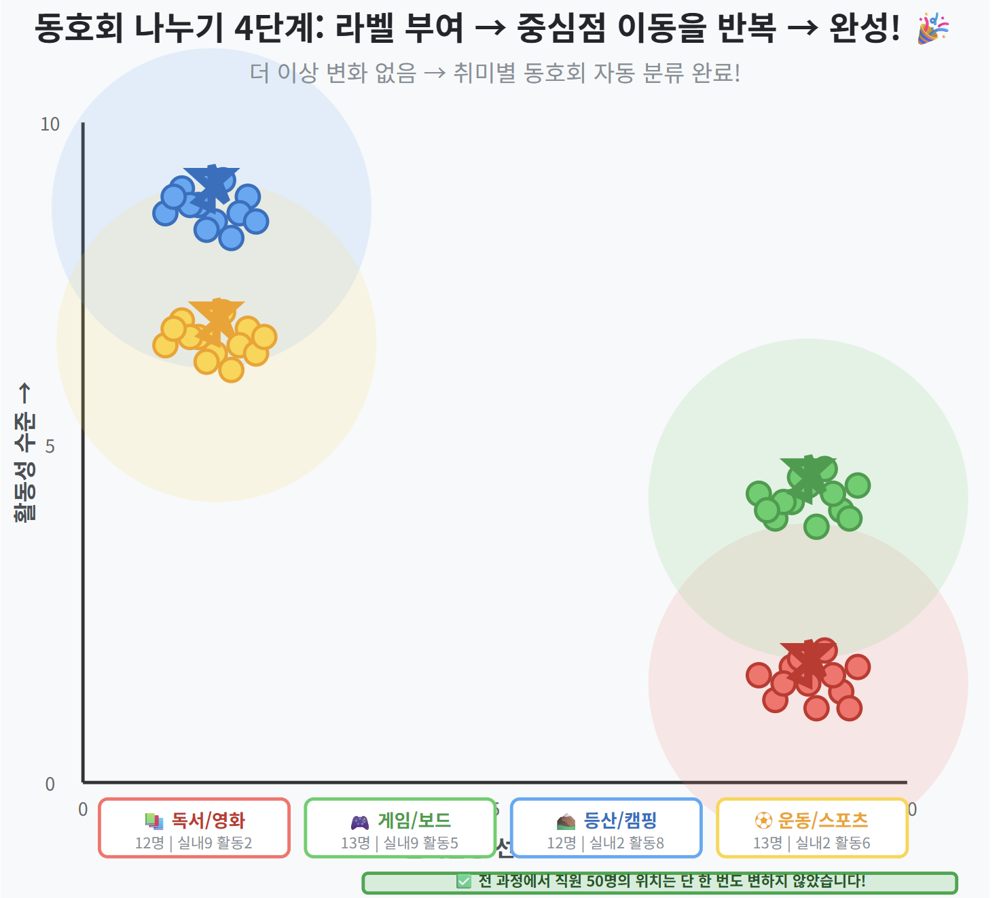

단점: 최초 K값(클러스터 갯수)에 따라 결과가 달라질 수 있음 
왜냐하면 몇개의 클러스터가 있을 지 알 수 없는데 클러스터 갯수를 미리 지정해야 하기 때문임     

### KMeans 예제
- 0 클러스터가 91개, 1 클러스터가 98개, 2 클러스터가 111개 묶임. 0/1/2가 무엇인지
  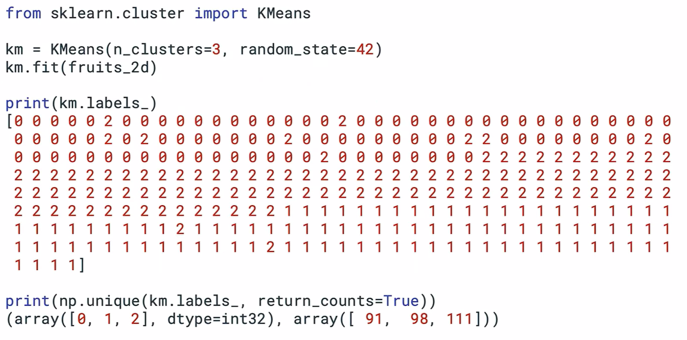
- 클러스터 확인
  0 클러스터는 파인애플임을 확인할 수 있음. 나머지 클러스터도 km_labels_ 값을 바꿔서 확인.     
  ```
  draw_fruites(fruits[km.labels_ ==0])
  ``` 
  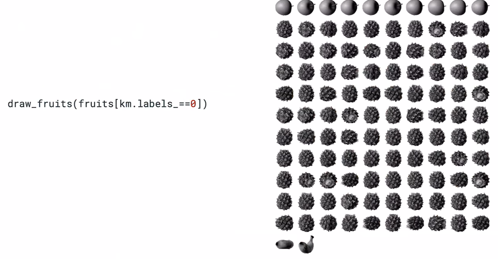

- 각 클러스터의 평균값을 이미지로 표현 
  km.cluster_centers_ : 클러스터 중심점 평균값 리스트 
  reshape: 1차원 배열을 2차월 배열로 변경
  ratio: 확대 비율 
  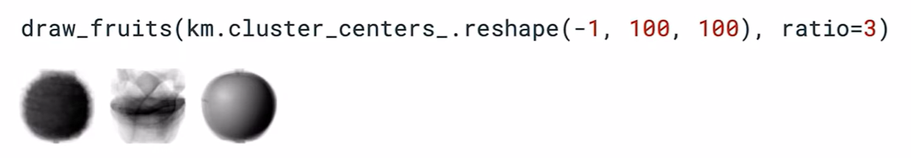 

- 새로운 과일의 클러스터 예측
  - transform: 새로운 과일 데이터와 각 클러스터 간의 거리 
  - predict: 새로운 과일의 클러스터 예측
  - km.n_iter_ : 주변 데이터 라벨링과 센트로이드 이동을 몇번 했는지 리턴  
  


### 최적의 k값(클러스터 갯수) 찾기: Elbow Method
Elbow는 팔꿈치라는 뜻으로 이 방법으로 그래프를 그리면 팔꿈치처럼 구부러진 곳의 K값이 최적이기 때문에 이름 붙여짐.     
inertia는 클러스터의 응집도를 나타냄. 즉, 얼마나 Tight Coupling 되었나이며 값이 낮을 수록 응집도가 높는 것임.   

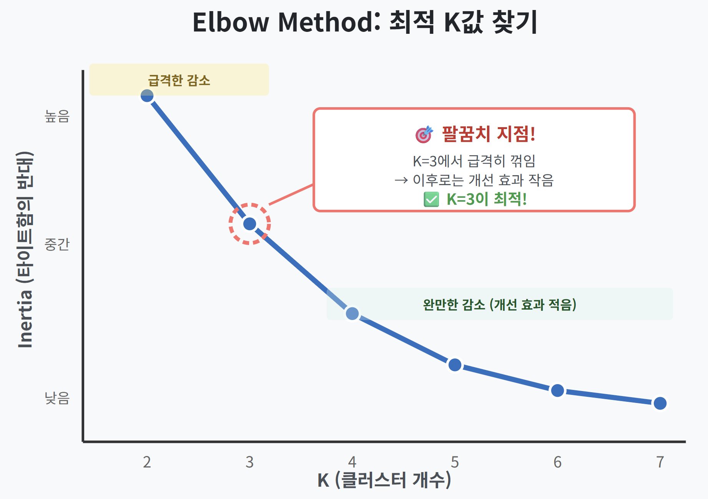

```
inertia = []                    # 결과 저장할 리스트
for k in range(2, 7):           # K=2부터 6까지 시도
    km = KMeans(n_clusters=k)   # K개 그룹으로 나누기
    km.fit(fruits_2d)           # 훈련 실행
    inertia.append(km.inertia_) # Inertia 값 저장

# 결과:
# k=2: inertia = 5,750,000,000
# k=3: inertia = 4,000,000,000  ⭐ 급감!
# k=4: inertia = 3,850,000,000  (조금만 감소)
# k=5: inertia = 3,750,000,000  (조금만 감소)
# k=6: inertia = 3,700,000,000  (조금만 감소)
```

가시적으로 표현하면 아래와 같음


| [Top](#목차) |

---

## PCA(주성분 분석: Principle Component Analysis)
### 차원과 벡터의 차이 이해
- 벡터와 Feautre의 차이 이해
  ```
  Feature Name = Key ✅
  Feature Value = 하나의 Value ✅
  Feature Vector = 모든 Values의 배열 🎯

  비유: '키'라는 Feature의 value는 '175'이고 '몸무게'라는 Feature의 value는 70임. **Feature Value의 배열이 벡터임**. 
  사전(Dictionary): {'키': 175, '몸무게': 70}
  배열(Vector): [175, 70]
  ```
- 차원은 선(1차원), 면(2차원), 입체(3차원)을 의미. 벡터는 Feature 값의 배열을 의미
- 벡터의 값의 갯수에 따라 N차원 벡터라고 부름 (예: 값이 10개면 10차원 벡터임)

### 차원축소(Dimentionality Reduction)의 의미
- 선/면/입체와 같은 차원을 축소하는 것이 아님
- Vector의 값의 갯수를 줄이는 것을 의미
- 벡터값에서 중요한 것만 선택하는 방식(Feature selection)과 새로운 벡터값으로 차원을 축소하는 방법(Feature transformation)이 있음 
- 일반적으로 Feature Transformation을 사용 
- 차원축소의 알고리즘 중 대표적인 방식이 주성분 분석(PCA:Principle Component Analysic)임  

### PCA 개념
- 목표: 중요한 특징값은 최대한 유지하면서, 덜 중요한 특징값은 버림으로써 **데이터를 가장 잘 설명하는 축(주성분)을 찾는 것** 
- 비유: 그림자 놀이 
  ```
  - 3D 물체(원본 데이터)를 다양한 각도에서 벽에 비추면 여러 그림자(투영)가 생깁니다
  - 가장 많은 정보를 담고 있는 각도를 찾는 것이 PCA!
  - 그 각도에서 본 그림자가 바로 "주성분"입니다
  ``` 

### PCA 동작원리 
수학과 과학점수의 2차원 벡터를 종합학업능력이라는 벡터로 축소하는 예시   

- 1단계: 원본 데이터 준비
  ```
  학생    수학    과학
  --------------------
  민지    80      75
  서준    60      65
  하은    90      85
  준호    70      70
  지우    50      55
  ```     
- 2단계: 데이터중심화(Centering)
  - 각 Feature의 평균을 구함
    ```
    수학 평균: μ₁ = (80 + 60 + 90 + 70 + 50) / 5 = 70
    과학 평균: μ₂ = (75 + 65 + 85 + 70 + 55) / 5 = 70
    ```
  - 데이터 중심화: 각 점수 - 평균을 하여 0점을 중심으로 데이터 재배치
    ```
    X_centered = [80-70  75-70]   [10   5]
                [60-70  65-70] = [-10  -5]
                [90-70  85-70]   [20  15]
                [70-70  70-70]   [ 0   0]
                [50-70  55-70]   [-20 -15]
    ```  
    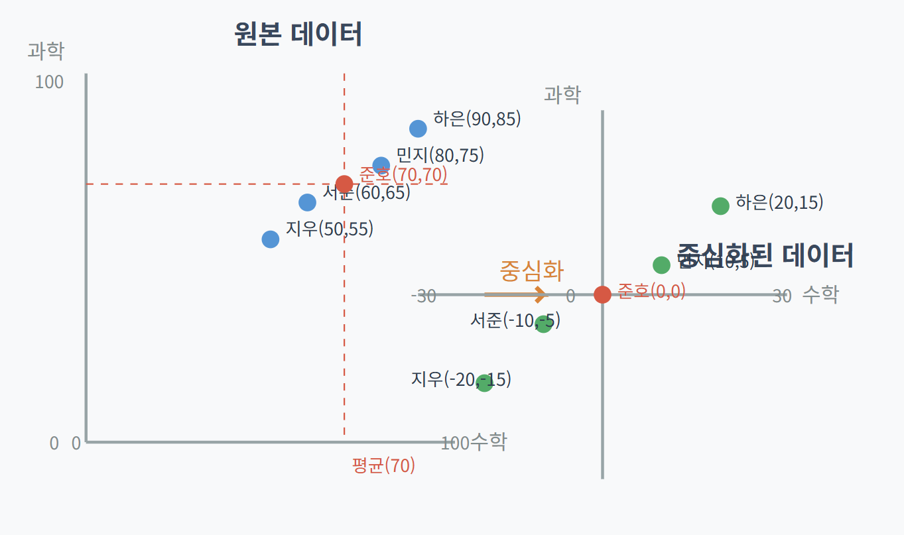

- 3단계: 공분산 행렬 계산
  - 공분산 계산
    - 공분산은 Feature간의 상관 관계를 의미. 양수이면 같은 방향으로 상관관계, 음수이면 다른 방향으로 상관관계가 있는 것임 
    - 공식: Sum(Feature1 * Feature2 * ...) / 데이터 갯수
    - 공분산(수학, 과학) = 공분산(과학, 수학) = (10 * 5 + -10 * -5 + 20 * 15 + 0 * 0 + -20 * -15) / 5 = 700 / 5 = 140
    - 양수이므로 수학점수가 높으면 과학점수도 높다는 것임 
  - 분산 계산
    - 분산은 각 Feature가 평균과 얼마나 떨어져 있는지를 의미. 값이 높으면 점수가 고르지 않다는 것을 의미.   
    - 공식: Sum(Feature^2) / 데이터 갯수
    - 분산(수학) = (10^2 + -10^2 + 20^2 + 0^2 + -20^2) / 5 = 200
    - 분산(과학) = (5^2 + -5 ^2 + 15^2 + 0^2 + -15^2) / 5 = 100
    - 수학 점수는 과학 점수에 비해 고르지 않음
    - 분산(수학) = 공분산(수학, 수학), 분산(과학) = 공분산(과학, 과학)임. 즉 분산은 자기 자신과의 공분산임.   
  - 공분산 행렬
    - 행과 열에 Feature값을 표시하고 행/열 Feature의 공분산값을 배치 
      ``` 
              수학    과학
      --------------------
      수학    200     140
      과학    140     100
      ```

    

- 4단계: 고유값과 고유벡터 계산   
  공분산 행렬은 "상관관계가 있다"는 것만 알려줌. 하지만 **정확히 어느 방향으로 얼마나 많이 퍼져있는지**는 알아야 함         
  '그림자 놀이' 비유에서 조명의 방향이 고유벡터이고 고유값이 그림자의 길이라고 생각하면 됨.  

  - 고유값
    - 고유값은 퍼진 방향에 얼마나 많은 데이터가 존재하는지 알려줌    
    - 공식: det(C - λI) = 0. 
      - det: determinant. 행렬식을 의미 
      - C: 공분산 행렬
      - λ: 람다. 고유값
      - I: Identity Matrix. 단위행렬. 행렬 C의 값을 변화시키지 않게 하기 위한 행렬로 대각선 방향만 1이고 나머지는 0임   
    - 계산
      ```
      C - λI = [200  140] - λ[1  0]
                [140  100]    [0  1]

      = [200-λ   140  ]
        [140     100-λ]

      행렬식으로 변환은 아래와 같이 해야 함   
      |a  b|
      |c  d| = ad - bc
      
      따라서 아래와 같이 고유값을 구하면 됨.   
      (200-λ)(100-λ) - 140² = 0
      => λ² - 300λ + 400 = 0

      근의 공식을 적용하면 고유값은 람다1과 람다2가 나옴  
      람다2는 가장 큰 방향의 정확히 수직 방향에 얼마나 많은 데이터가 있는지를 나타냄   

      λ₁ = (300 + 297.32) / 2
          = 597.32 / 2
          = 298.66
      
      λ₂ = (300 - 297.32) / 2
          = 2.68 / 2
          = 1.34 ✓
      ``` 

      참고) 근의 공식
        
      
    - 가장 큰 방향의 고유값이 전체 300중에 298.66이므로 99.5%의 데이터가 주성분에 분포되어 있는것임
  
  - 고유벡터
    - 고유벡터는 어느 방향인지를 나타냄      
    - 계산
      ```
      [200-298.66    140     ] [v₁]   [0]
      [140         100-298.66] [v₂] = [0]

      [-98.66   140  ] [v₁]   [0]
      [140    -198.66] [v₂] = [0]

      -98.66v₁ + 140v₂ = 0

      140v₂ = 98.66v₁
      v₂ = (98.66/140)v₁
      v₂ = 0.7047v₁  

      v₁을 1로 임의 설정하여 비정화된 벡터값을 구함.  
      v₁ = 1
      v₂ = 0.7047

      비정규화 벡터: [1, 0.7047]ᵀ

      앞의 벡터값이 커지면 무수히 많은 벡터값이 나옴
      [1, 0.7047]ᵀ
      [2, 1.4094]ᵀ
      [100, 70.47]ᵀ
      크기를 1로 통일하여 벡터크기를 구함  

      벡터 크기 = (1² + 0.7047²)
            = 루트 (1 + 0.4966)
            = 루트 1.4966
            = 1.2235

      정규화된 고유벡터   
      v̂₁ = v₁ / ||v|| = 1 / 1.2235 = 0.8174
      v̂₂ = v₂ / ||v|| = 0.7047 / 1.2235 = 0.5759
      ``` 

    - 동일한 방식으로 고유값2에 대한 고유벡터를 구함    
      v₂ = [0.576, -0.817]ᵀ (제2주성분 방향)

    - 고유벡터를 그래프에 배치하면 아래와 같음  
      ```
      v̂₁ = [0.817, 0.576]  
      v̂₂ = [0.576, -0.817]  ← 수학은 양수, 물리는 음수
      ```
      

- 5단계: 주성분 점수 계산   
  제1 주성분 점수: PC1 = 0.817×수학 + 0.576×과학 → **"종합 학업 능력"**을 나타냄 
  ```
  민지: 10×0.817 + 5×0.576 = 11.05
  서준: -10×0.817 + (-5)×0.576 = -11.05
  하은: 20×0.817 + 15×0.576 = 24.99
  준호: 0×0.817 + 0×0.576 = 0
  지우: -20×0.817 + (-15)×0.576 = -24.99
  ``` 

  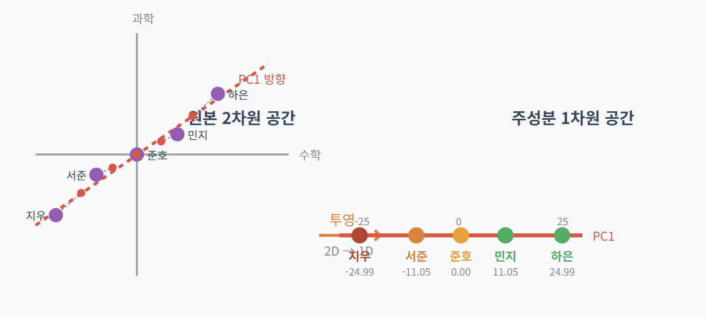

- 결과: 수학과 과학의 2차원 벡터를 종합학업능력이라는 1차원 벡터로 차원 축소

### 프로그램 예시: 사과, 파인애플, 바나나 이미지 차원 축소
원본이 10000차원 벡터(가로 100픽셀 * 세로 100픽셀)를 50차원으로 축소       
- 훈련 단계: 주성분 계산
  ```
  from sklearn.decomposition import PCA

  pca = PCA(n_components=50)
  pca.fit(fruits_2d)
  ``` 
  
  축소된 벡터는 pca.components_ 에 있음.    
  50개의 주성분이 원본 10000개의 픽셀을 대표한다는 의미     
  ```
  print(pca.components_.shape)
  # 결과: (50, 10000)
  ```

  결과확인
  

- 변환 단계: 훈련된 주성분으로 데이터 변환
  ```
  fruits_pca = pca.transform(fruits_2d)
  ```   
  결과 확인: 300개의 이미지를 50차원 벡터로 축소
  ```
  print(fruits_pca.shape)
  # 결과: (300, 50)
  ```

- 원본 데이터 재생: inverse_transform으로 원본 데이터 재생
  ```
  fruits_inverse = pca.inverse_transform(fruits_pca)
  print(fruits_inverse.shape) # 결과: (300, 10000)

  fruits_reconstruct = fruits_inverse.reshape(-1, 100, 100)

  for start in [0, 100, 200]:
      draw_fruits(fruits_reconstruct[start:start+100])
      print("\n")
  ```
  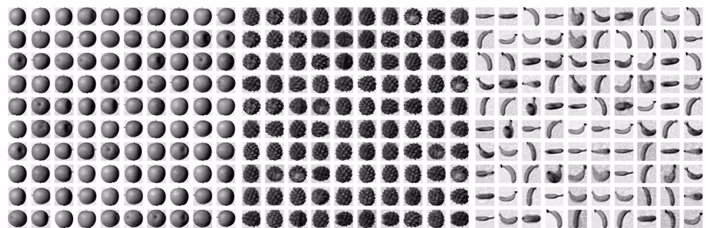

  10000픽셀을 50차원으로 축소해도 원본 데이터를 잘 표현하고 있음을 확인   

- 주성분 50개가 원본 데이터를 얼마나 잘 설명하고 있는지 확인: explained_variance_ratio_
  ```
  print(np.sum(pca.explained_variance_ratio_))
  # 결과: 0.9215686742307752
  ``` 

  X축은 주성분, Y축은 설명하는 데이터 비율    
  10개 정도의 주성분이 대부분의 데이터를 설명하고 있음을 알 수 있음     
  

- 주성분 갯수가 아닌 설명할 데이터 비율로 지정하는 방법
  n_components에 정수가 아닌 실수로 지정하면 됨     
  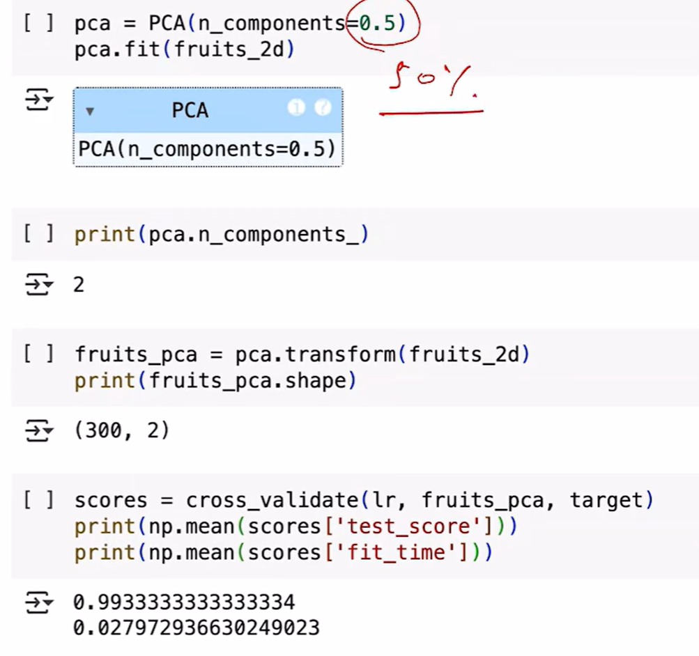 

### 로지스틱 회귀와 함께 사용하기
PCA알고리즘이 동일 정확도를 유지하며 훨씬 빠르게 훈련함.   


### K-Mean알고리즘과 함께 사용하기
```
pca = PCA(n_components=0.6) # 60% 커버
pca.fit(fruits_2d)

print(pca.n_components_)    # 결과: 4. 4개 주성분으로 60% 데이터 설명  

fruits_pca = pca.transform(fruits_2d)
print(fruits_pca.shape) # 결과: (300, 4)

scores = cross_validate(lr, fruits_pca, target)
print(np.mean(scores['test_score']))  # 결과: 0.9933333333333334
print(np.mean(scores['fit_time']))    # 결과: 0.01770186424255371

from sklearn.cluster import KMeans

km = KMeans(n_clusters=3, random_state=42)
km.fit(fruits_pca)      # 차원 축소한 벡터배열값으로 K-Mean 알고리즘 학슴

#결과: (array([0, 1, 2], dtype=int32), array([111,  98,  91]))
print(np.unique(km.labels_, return_counts=True))            

# 결과 그리기  
for label in range(0, 3):
  draw_fruits(fruits[km.labels_ == label])
  print("\n")
``` 
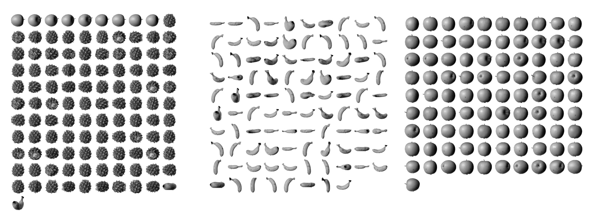
첫번째 클러스터에 사과와 바나나가 조금 섞이지만 잘 분류함

- 군집 시각화
주성분 중 첫번째와 두번째만 사용하여 표현    
```
for label in range(0, 3):
    data = fruits_pca[km.labels_ == label]
    plt.scatter(data[:,0], data[:,1])
plt.legend(['apple', 'banana', 'pineapple'])
plt.show()
```

x축은 주성분1의 점수, Y축은 주성분2의 점수임        
각 주성분 점수: 중심화된 데이터 × 정규화한 고유벡터(주성분 가중치)


| [Top](#목차) |

---

# 딥러닝

## 훈련 데이터셋트 
- 붓꽃(IRIS) 데이터셋트와 MNIST데이터셋트가 가장 많이 사용됨   
- 패션 MNIST 데이터셋트는 MNIST데이터 셋트를 조금 더 복잡하게 만든 옷 데이터 셋트
- 최근에는 캐글에 좋은 데이터셋트가 많이 공개되어 있음
- 데이터셋 준비    
  훈련과 테스트 input 데이터는 60000개이고 각각 28*28 픽셀임    
  훈련과 테스트 traget(정답) 데이터는 역시 60000개이고 10가지 종류 옷이므로 0~9까지의 숫자로 되어 있음    
  
- 로지스틱회귀로 훈련 예제
  - train_scaled: 
    - '0-255'의 각 픽셀 데이터를 '0-1' 사이의 실수로 만듦: 예) 픽셀값 127 → 127/255 ≈ 0.498   
    - reshape하여 2차원을 1차원으로 변환시킴. 784(28*28)차원 벡터가 생성됨   
  - SGC(확률적 경사하강법)으로 교차검증(cross_validate)하여 훈련함. 에포크(모든 데이터 셋 훈련 반복 수)는 5회 수행    
  - 정확도 점수는 약 82점으로 준수한 편   
  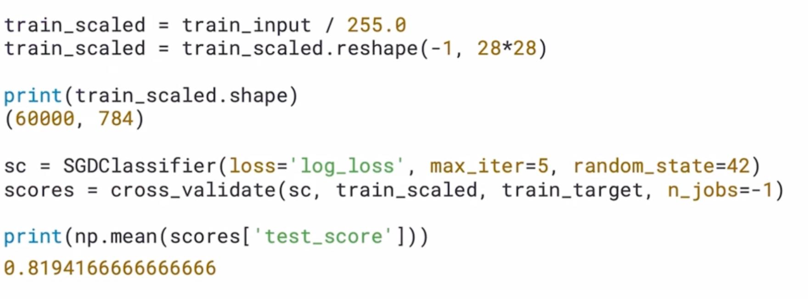

## 인공 신경망(ANN: Artificial Neural Network)

### 개념
- 뇌 뉴런의 모양을 흉내낸 기계훈련 알고리즘. 동작 방식을 모방한것은 아님.
- 매컬론과 피츠가 1943년에 제안
- 입력층(Input layer), 은닉층(Hidden Layer), 출력층(Output Layer)으로 구성되었으며 각 층에 여러개의 뉴런(노드)이 있음
- 가장 단순한 인공신경망은 은닉층에서 입력층 뉴런 * 가중치의 총합으로 출력층 뉴런을 만들고 출력층 뉴런값을 임계값과 비교하여 판단.   
- 활성화함수(Activation function): 은닉층과 출력층의 노드 결과값을 비선형으로 변환하는 함수. 비선형이란 곡선을 의미. 
  - 선형보다 비선형으로 변환 시 더 정확한 값을 구할 수 있음(선형회귀보다 로지스틱회귀가 더 정확도가 높음)
  - Sigmoid(0~1 출력), ReLU(음수는 0, 양수는 그대로), Softmax(각 노드의 확률)가 사용됨
- 훈련 과정은 순전파(forward propagation)로 예측하고, 역전파(backpropagation)로 오차를 줄이는 과정의 반복    
- 역전파(BackPropagation)
  - 가중치를 줄여가면서 최적의 가중치를 구하는 것임 
  - 손실함수(예측값과 실제값의 차이)를 최소화하기 위해 경사하강법으로 가중치를 줄여 나감 
  - 손실함수는 분류 문제에서는 교차 엔트로피(Cross-Entropy), 회귀 문제에서는 평균 제곱 오차(MSE)를 주로 사용    
      

- 대표적인 딥러닝 프레임워크
  - 파이토치(Pytorch): Meta 개발. 연구자들이 선호
  - 텐서플로우(TensorFlow): Google 개발. 대중적으로 선호됨.
  - 케라스(Keras): 프랑소와 솔레 개발. 텐서플로우의 고수준API. 2019년 텐서플로우와 통합
  - 기타
    - 잭스(JAX): Google 개발. 고성능컴퓨팅 필요 시 사용
    - PaddlePaddle: Baidu 개발. 중국에서 주로 사용 

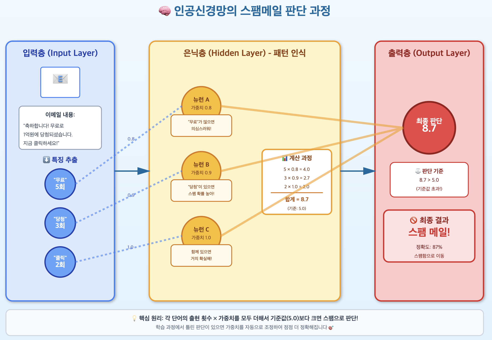


### 인공신경망 예시

**"나에게 좋은 집일 확률 구하기"**      

**1.전체 과정 정리**    

Step1 원본 데이터 (입력층)

| 조건 | 원본 점수 | 점수 범위 |
|------|----------|----------|
| 역까지 거리 | 8점 | 0~10점 |
| 집 크기 | 6점 | 0~10점 |
| 층수 | 9점 | 0~10점 |
| 주변 소음 | 4점 | 0~10점 |

Step2 정규화: 0~1 범위로 변환 (은닉층) 

**공식:** `정규화 값 = 원본 점수 ÷ 최대값(10)`

| 조건 | 원본 점수 | 계산 | 정규화 값 |
|------|----------|------|----------|
| 역까지 거리 | 8점 | 8 ÷ 10 | **0.8** |
| 집 크기 | 6점 | 6 ÷ 10 | **0.6** |
| 층수 | 9점 | 9 ÷ 10 | **0.9** |
| 주변 소음 | 4점 | 4 ÷ 10 | **0.4** |

Step3 가중치 곱하기 (은닉층)

| 조건 | 정규화 값 | 가중치 | 계산 | 결과 |
|------|----------|--------|------|------|
| 역까지 거리 | 0.8 | ×3 | 0.8 × 3 | **2.4** |
| 집 크기 | 0.6 | ×2 | 0.6 × 2 | **1.2** |
| 층수 | 0.9 | ×1 | 0.9 × 1 | **0.9** |
| 주변 소음 | 0.4 | ×2 | 0.4 × 2 | **0.8** |

Step4 합산 + 편향 (은닉층)
```
합계 = 2.4 + 1.2 + 0.9 + 0.8 + b(편향)
     = 5.3 + 0
     = 5.3
```

Step5 활성화 함수 시그모이드 함수로 확률 변환 (은닉층)

```
              1                  1
확률 = ───────────────── = ─────────────
        1 + e^(-5.3)       1 + 0.005
        
     = 0.995
     
     = 99.5%
```

Step6 최종 출력 (출력층)

> **"이 집이 나에게 좋은 집일 확률: 99.5%"** 🏠✨
  
**2.전체 흐름 시각화**    

```
[원본 데이터]     [정규화]      [가중치]      [합산]    [시그모이드]  [출력]
                                                                  
  역거리: 8  ──÷10──→ 0.8 ──×3──→ 2.4 ─┐                             
                                    │                           
  집크기: 6  ──÷10──→ 0.6 ──×2──→ 1.2 ─┼──→ 5.3 ──→ σ(5.3) ──→ 99.5%
                                    │                           
  층수:   9  ──÷10──→ 0.9 ──×1──→ 0.9 ─┤                           
                                    │                           
  소음:   4  ──÷10──→ 0.4 ──×2──→ 0.8 ─┘                          
                                                                  
  [입력층]                   [은닉층 연산]                 [출력층]     
```

| 단계 | 이름 | 하는 일 | 예시 |
|------|------|--------|------|
| 1 | **입력** | 원본 데이터 | 8, 6, 9, 4 |
| 2 | **정규화** | 0~1 범위로 변환 | 0.8, 0.6, 0.9, 0.4 |
| 3 | **가중치 적용** | 중요도 반영 | 2.4, 1.2, 0.9, 0.8 |
| 4 | **합산** | 모두 더하기 | 5.3 |
| 5 | **활성화 함수** | 확률로 변환 | 99.5% |
| 6 | **출력** | 최종 판단 | 좋은 집! ✅ |


**① ~ ④ 의 과정을 반복하면서 최고의 정답을 예측하는것이 인공신경망의 기본 원리**         
① 순전파 (Forward Propagation): 입력 → 가중치 연산 → 예측값 출력
② 손실 계산 (Loss Calculation): 예측값 vs 정답 → 오차(틀린 정도) 측정
③ 역전파 (Backpropagation): 오차의 원인 추적 → 각 가중치의 책임(오차에 기여한 정도) 계산
④ 가중치 업데이트 (Weight Update): 책임만큼 가중치 조정 


### 인공신경망 실습
- 프레임워크는 케라스 사용: 텐서플로우, 파이토치, 잭스를 백엔드로 쉽게 사용하게 해주는 딥러닝 프레임워크  
  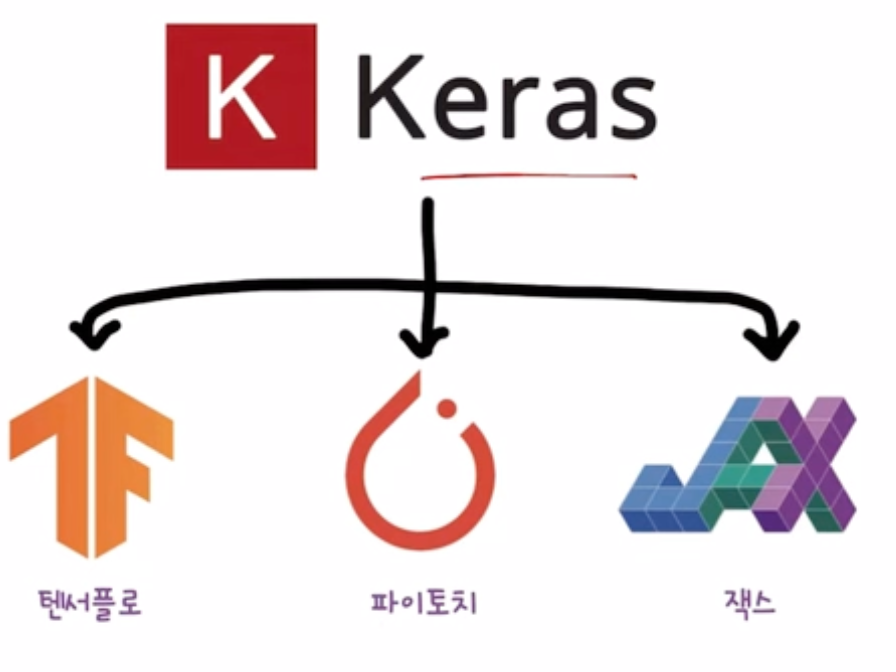

- 예제
  - 데이터 로딩
    ```
    import tensorflow as tf
    from tensorflow import keras
    (train_input, train_target), (test_input, test_target) = keras.datasets.fashion_mnist.load_data()

    from sklearn.model_selection import train_test_split
    ```
  - 훈련셋티와 검증셋트 나누기
    ``` 
    train_scaled, val_scaled, train_target, val_target = train_test_split(
      train_scaled, train_target, test_size=0.2, random_state=42)

    print(train_scaled.shape, train_target.shape) # 결과: (48000, 784) (48000,)
    print(val_scaled.shape, val_target.shape) # 결과: (12000, 784) (12000,)
    ``` 
  - 모델 만들기
    - keras.layers.Input: 입력층
    - keras.layers.Dense: 출력층. 10개 뉴런을 지정하고 활성화함수르 softmax 사용
      
  - 훈련 
    - compile: 훈련 환경 설정
      - 손실함수로 cross entropy인 sparse_categorical_crossentropy 사용. 
      - metrics: 손실값에 추가로 정확도도 출력하도록 하는 옵션
    - fit: 훈련. 모든 훈련 데이터를 몇번 반복할 지 에포크(epochs)로 지정   
      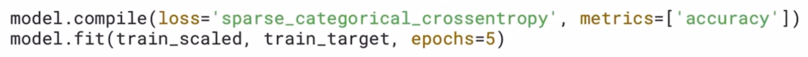
        
      결과: 
      
  
  - 평가
    ```
    model.evaluate(val_scaled, val_target)
    ```
    결과: 
    - 정확도: 약 86%의 정확도. 로지스틱회귀의 약 82%보다 높아짐.
    - 손실함수값(예측치-정답): 0.44(0에 가까울수록 정확. 0.5가 평균)로 보통 수준임.      
    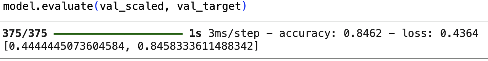  
  
| [Top](#목차) |

---

## 심층 신경망(DNN: Deep Neural Network)

### 개념
- ANN은 0~2개의 은닉측을 가지는 단순한 알고리즘이고 DNN은 3개 이상의 은닉층을 가지는 알고리즘
- 마치 레고블록처럼, 작은 조각(입력층)을 계속 쌓아(은닉층) 큰 성(출력층)을 만드는 인공지능 훈련 방법 
- 정답을 가르쳐 주지 않아도 패턴을 발견해 결과를 예측할 수 있음 
- DNN의 가장 최신/최고의 방법이 Transformer 모델임

### DNN 예제
- 데이터 로딩
  ```
  import tensorflow as tf
  from tensorflow import keras
  (train_input, train_target), (test_input, test_target) = keras.datasets.fashion_mnist.load_data()

  from sklearn.model_selection import train_test_split
  ```
- 훈련셋티와 검증셋트 나누기
  ``` 
  train_scaled, val_scaled, train_target, val_target = train_test_split(
    train_scaled, train_target, test_size=0.2, random_state=42)

  print(train_scaled.shape, train_target.shape) # 결과: (48000, 784) (48000,)
  print(val_scaled.shape, val_target.shape) # 결과: (12000, 784) (12000,)
  ``` 
- 모델 만들기
  dense1: 100개의 뉴런을 가지는 은닉층. 활성화 함수는 sigmoid를 사용.     
  dense2: 10개의 뉴런을 가지는 출력층. 활성화 함수는 softmax 사용.     
  ```
  inputs = keras.layers.Input(shape=(28*28,))
  dense1 = keras.layers.Dense(100, activation='sigmoid')
  dense2 = keras.layers.Dense(10, activation='softmax')

  model = keras.Sequential([inputs, dense1, dense2])
  ``` 

  구성된 DNN을 표시
  ```
  model.summary()
  ```
  

  참고) 파라미터 갯수: (이전 레이어의 노드 갯수) * (노드 갯수) + (절편 갯수). 절편(Bias)는 노드 당 1개임.  
  - 은닉층: 784 * 100 + 100 = 78500
  - 출력층: 100 * 10 + 10 = 1010   
- 층을 정의하는 다른 방법: 아래 두 방법 중 하나를 쓸 수도 있음   
  - Sequential 함수의 파라미터로 층 정의
    ```
    model = keras.Sequential([
      keras.layers.Input(shape=(784,)),
      keras.layers.Dense(100, activation='sigmoid', name='hidden'),
      keras.layers.Dense(10, activation='softmax', name='output')
    ], name='패션 MNIST 모델')
    ``` 
  - model.add로 층 추가 
    ```
    model = keras.Sequential()
    model.add(keras.layers.Input(shapre(784,)))
    model.add(keras.layers.Dense(100, activation='sigmoid')
    model.add(keras.layers.Dense(10, activation='softmax')
    ``` 
- 훈련 및 평가
  ```
  model.compile(loss='sparse_categorical_crossentropy', metrics=['accuracy'])
  model.fit(train_scaled, train_target, epochs=5)

  model.evaluate(val_scaled, val_target)
  ```

### 신경망 층의 파라미터란?  
**1.모델 파라미터 (Model Parameters)**    
| 특성 | 설명 |
|------|------|
| **정의** | 모델이 학습 과정에서 **자동으로 조정**하는 값 |
| **예시** | 가중치(Weights), 편향(Bias) |
| **특징** | 데이터로부터 학습됨, 사람이 직접 설정하지 않음 |
    
앞의 예제는 모든 입력이 모든 뉴런에 연결되는 완전연결망이므로 이때 파라미터가 갯수는 입력수 * 뉴런수가 됨    

LLM에서 몇십억개의 파라미터라고 말할때 이 모델 파라미터를 의미함    

**2.하이퍼파라미터 (Hyperparameters)** - 훈련/출력 조정용

| 특성 | 설명 |
|------|------|
| **정의** | **사람이 직접 설정**하는 학습 환경 값 |
| **예시** | Learning Rate, Epoch 수, Batch Size, Dropout 비율 |
| **특징** | 학습 전에 미리 결정, 모델 성능에 큰 영향 |


### 렐루(ReLu)함수와 Flatten 층 
- Flatten층: 노드를 1차원 배열로 변환한 층(reshape함수로 2차원 배열을 1차원 배열로 변환하는것과 동일 기능) 
- 활성화함수 ReLu: 
  - 0보다 작은 값은 0을 리턴하고 양수이면 그 값을 리턴하는 함수: max(0, z)
  - 신경망에서 더 나은 성능을 내서 sigmoid 보다 더 많이 사용하는 추세  
  - 이미지 분류 시 보통 relu 함수 사용  
  - 시그모이드와 렐루 사용 시 그래프 비교     
    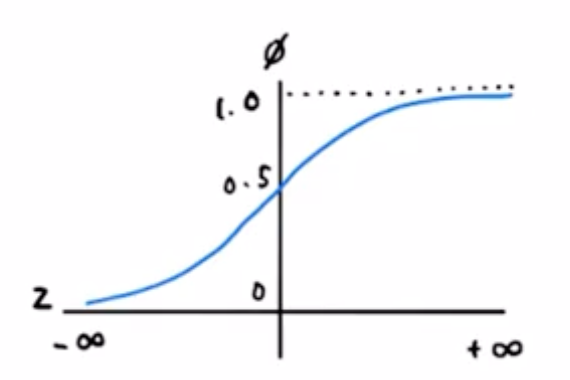   
     
- 코드
  Input함수 대신에 Flatten의 파라미터로 input_shape를 지정하면 내부적으로 Input층 생김  
  ```
  model = keras.Sequential()
  model.add(keras.layers.Flatten(input_shape=(28, 28)))
  model.add(keras.layers.Dense(100, activation='relu'))
  model.add(keras.layers.Dense(10, activation='softmax'))
  ```  

  DNN 구조 보기: model.summary()
  
  
### 옵티마이저 지정
- 옵티마이저: 가중치를 조정하기 위한 알고리즘으로 compile 함수의 'optimizer' 파라미터로 지정
- keras의 디폴트 옵티마이저는 rmsprop임. 아래와 같이 optimizer를 다르게 변경할 수 있음   
  ```
  model.compile(optimizer='sgd', loss='sparse_categorical_crossentropy', metrics=['accuracy'])
  ``` 

  또는   
  ```
  sgd = keras.optimizers.SGD()
  model.compile(optimizer=sgd, loss='sparse_categorical_crossentropy', metrics=['accuracy'])
  ```

- 훈련률 지정: SGD알고리즘 사용 시 한 번에 가중치를 얼마나 조정할지 지정   
  ```
  sgd = keras.optimizers.SGD(learning_rate=0.1)
  model.compile(optimizer=sgd, loss='sparse_categorical_crossentropy', metrics=['accuracy'])
  ```
  기본값은 0.01임.   

- momentum: 정답을 찾아가는 방향을 얼마나 유지할 지 지정하는 파라미터 
  - momentum을 지정하지 않으면 매번 다른 방향으로 훈련할 수 있음  
  - momentum은 0~1까지의 값으로 지정하며 100을 곱하여 몇 %나 이전 방향성을 유지할 지 지정   
  - 보통 0.9를 사용함    
  - 네스트로프(nestrov)는 좀 더 향상된 momentum 옵션이며 momentum 지정 시 true로 지정
  ```
  sgd = keras.optimizers.SGD(momentum=0.9, nesterov=True)
  ``` 

### 적응적 훈련 옵티마이저: Adam, RMSprop, AdaGrad 
- 훈련률을 자동으로 조정하는 옵티마이저로서 adam을 가장 많이 사용  
- 알엠에스프롭(RMSprop): 최근기울기의 제곱평균으로 훈련률 조정. Root Mean Square Propagation
- 아다그래드(AdaGrad): 자주 업데이트 되는 파라미터는 큰 훈련률, 그 반대는 작은 훈련률로 조정. Adaptive Gradient  
- 아담(Adam): RMSProp과 AdaGrad의 장점을 결합한 알고리즘. Adaptive Moment Estimation   
  ```
  adam = keras.optimizers.Adam()
  model.compile(optimizer=adam, loss='sparse_categorical_crossentropy', metrics=['accuracy'])
  ```

  ```
  rmsprop = keras.optimizers.RMSprop()
  model.compile(optimizer=rmsprop, loss='sparse_categorical_crossentropy', metrics=['accuracy'])
  ``` 

| [Top](#목차) |

---

## 신경망 모델 훈련 Best Practice

신경망 모델을 훈련하는 모범사례와 유용한 도구에 대해 훈련    

### 손실과 정확도 곡선
- 모델 작성: 함수 사용 예제    
  ```
  def model_fn(a_layer=None):
      model = keras.Sequential()
      model.add(keras.layers.Flatten(input_shape=(28, 28)))
      model.add(keras.layers.Dense(100, activation='relu'))
      if a_layer:
          model.add(a_layer)
      model.add(keras.layers.Dense(10, activation='softmax'))
      return model

  model = model_fn()
  ```
- 모델 설정 및 훈련
  ```
  model.compile(loss='sparse_categorical_crossentropy', metrics=['accuracy'])

  learn = model.fit(train_scaled, train_target, epochs=5, verbose=0)
  ```

  참고) verbose: 훈련과정을 얼마나 자세하게 출력할지 지정. 
  - 0: 출력 없음
  - 1: 진행률을 막대 그래프로 표시. 기본값
       
  - 2: 진행률을 텍스트로 표시    
     

- 훈련데이터의 손실값과 정확도 표시  
  ```
  print(learn.history.keys()) # 결과: dict_keys(['accuracy', 'loss'])

  import matplotlib.pyplot as plt

  plt.plot(learn.history['loss'])
  plt.xlabel('epoch')
  plt.ylabel('loss')
  plt.show()
  ```
  

  ```
  plt.plot(learn.history['accuracy'])
  plt.xlabel('epoch')
  plt.ylabel('accuracy')
  plt.show()
  ```  
  

### 검증 손실 비교
- 목적: 과대적합 또는 과소적합 파악    
- 방법: 훈련 시 검증데이터 셋트를 추가하여 epoch에 따른 손실값 추이를 파악   
- 예제: 'validation_data'파라미터로 검증데이터 셋트 추가   
  ```
  model = model_fn()
  model.compile(loss='sparse_categorical_crossentropy', metrics=['accuracy'])

  history = model.fit(train_scaled, train_target, epochs=20, verbose=0,
                    validation_data=(val_scaled, val_target))
  
  print(history.history.keys()) # 결과: dict_keys(['accuracy', 'loss', 'val_accuracy', 'val_loss'])
  ```  

  ```
  plt.plot(history.history['loss'])
  plt.plot(history.history['val_loss'])
  plt.xlabel('epoch')
  plt.ylabel('loss')
  plt.legend(['train', 'val'])
  plt.show()
  ```
  

- 2번째 훈련이후로 과대적합되기 시작함을 알 수 있음
  - 손실값이 훈련데이터는 정상적으로 떨어지는데 검증데이터는 계속 올라가서 차이가 벌어짐   
  - 훈련데이터에 과대적합됨을 의미함 

### 드롭아웃: 과대적합 줄이기 모범사례
- 목적: 과대적합 줄이기 
- 방법: 
  - 과대적합의 원인은 특정 뉴런에 과도하게 의존하기 때문임  
  - 은닉층의 일부 뉴런(=노드=유닛)을 훈련과정에서 제외(Dropout)함   
  - 훈련 시에만 제외되는 것이며 매 배치(Epoch)마다 제외되는 뉴런은 달라짐
  - 예측 시에는 Dropout 하지 않음 
  - 일반적인 비율은 0.2 ~ 0.5이며 대규모일수록 값을 크게 함  
  - 시각적 표현    
    ```
    훈련 1회차: ●●●○○●●○●● (30% 비활성)
              ↓ 학습
    훈련 2회차: ○●●●○○●●●○ (다른 30% 비활성)
              ↓ 학습
    훈련 3회차: ●○●○●●○●○● (또 다른 30% 비활성)
              
    → 결과: 모든 뉴런이 독립적으로 기여하도록 훈련됨
    ```

- 예제: Drop 은닉층을 추가. 예제에서는 30%의 뉴런은 훈련과정에서 제외하게 함  
  - 모델 구성
    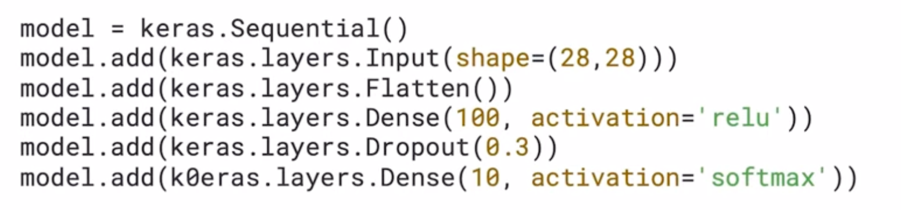    
  
    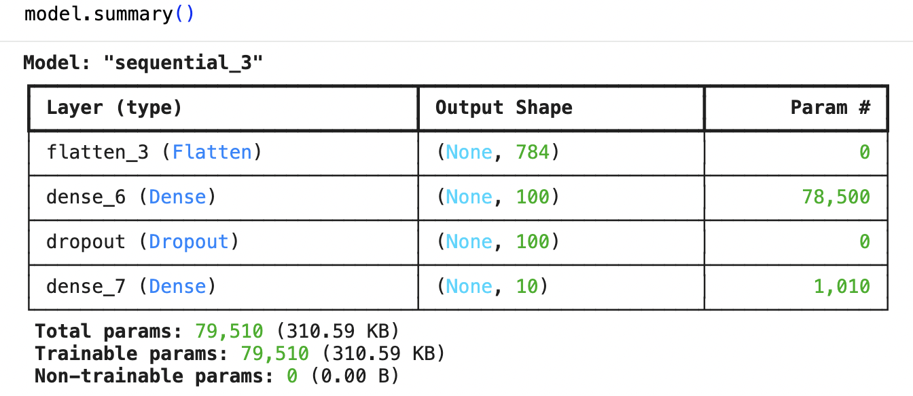

  - 훈련
    ```
    model.compile(optimizer='adam', loss='sparse_categorical_crossentropy',
                  metrics=['accuracy'])

    history = model.fit(train_scaled, train_target, epochs=20, verbose=0,
                        validation_data=(val_scaled, val_target))
    ```
  - 가시화
    ```
    plt.plot(history.history['loss'])
    plt.plot(history.history['val_loss'])
    plt.xlabel('epoch')
    plt.ylabel('loss')
    plt.legend(['train', 'val'])
    plt.show()
    ``` 
    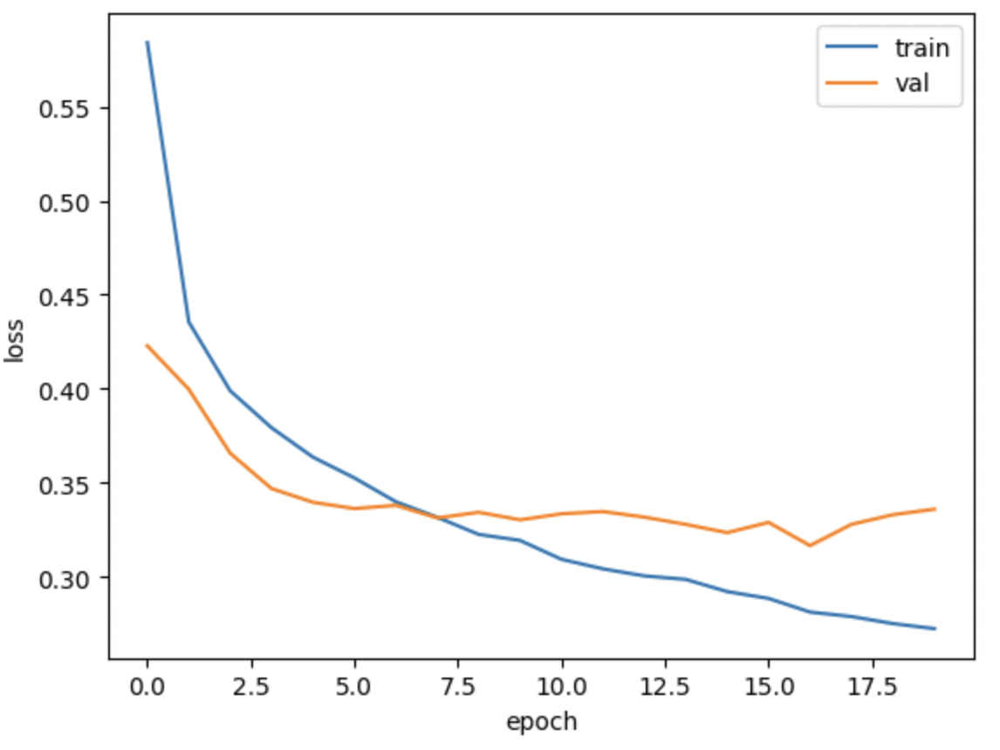
  
  - 과대적합이 상당히 줄었으며 검증데이터의 손실값도 낮게 잘 유지됨    

### 모델 저장과 복원
- 목적: 학습된 모델을 저장하고 복원함
- 방법: 
  - 모델 저장: model.save(모델명.keras)
  - 가중치 저장: model.save_weights(가중치명)
  - 모델 복원: keras.model.load_model(모델명.keras)
  - 가중치 복원: model.load_weights(가중치명)
- 예제
  - 모델 구성 및 학습
    ```
    model = model_fn(keras.layers.Dropout(0.3)) # 파라미터로 Dropout 층 전달하여 구성 
    model.compile(optimizer='adam', loss='sparse_categorical_crossentropy',
                  metrics=['accuracy'])

    history = model.fit(train_scaled, train_target, epochs=10, verbose=0,
                        validation_data=(val_scaled, val_target))
    ```  
  - 모델/가중치 저장 
    저장되는 모델에는 가중치를 포함하여 모델 구조, 가중치, 컴파일 설정이 모두 저장됨    
    ```
    model.save('model-whole.keras')
    model.save_weights('model.weights.h5')
    ```   

    파일로 저장 확인: 파이썬에서 '!'를 붙이면 리눅스 명령 수행함     
      
  
  - 가중치만 복원  
    동일한 모델 구조를 생성한 후 가중치를 로딩해야 제대로 수행됨    
    ```
    model = model_fn(keras.layers.Dropout(0.3))
    model.load_weights('model.weights.h5')
    ``` 
  
    예측 수행
    ```
    import numpy as np

    val_labels = np.argmax(model.predict(val_scaled), axis=-1)
    
    print(np.mean(val_labels == val_target)) #결과: 0.878
    ```
  - 모델 복원  
    ```
    model = keras.models.load_model('model-whole.keras')
    model.evaluate(val_scaled, val_target) # 결과: [0.33735886216163635, 0.878000020980835]
    ``` 
  - predict vs evaluate
    - predict는 예측, evaluate는 성능 측정이 목적임  
    - 가중치만 복원하여 evaluate하려면 컴파일 설정을 동일하게 해줘야 함
      ```
      model.load_weights('model.weights.h5')
      # 가중치만 로드하면 compile 정보가 없음!
      # evaluate 사용 전 반드시 compile 필요
      model.compile(optimizer='adam', 
                    loss='sparse_categorical_crossentropy',
                    metrics=['accuracy'])
      model.evaluate(val_scaled, val_target)  
      ``` 
  - np.argmax 수행 이해
    **확률이 가장 높은 인덱스를 리턴**하는 함수    
    ```
    import numpy as np

    # 가상의 3개 샘플, 5개 클래스 문제
    predictions = np.array([
        [0.1, 0.2, 0.6, 0.05, 0.05],  # 샘플 1: 클래스 2가 60%
        [0.7, 0.1, 0.1, 0.05, 0.05],  # 샘플 2: 클래스 0이 70%
        [0.2, 0.3, 0.1, 0.3,  0.1]    # 샘플 3: 클래스 1이 30%
    ])

    val_target = np.array([2, 0, 3])  # 실제 정답

    # 1단계: 예측 레이블 추출
    val_labels = np.argmax(predictions, axis=-1)
    print("예측 레이블:", val_labels)  # [2, 0, 1]

    # 2단계: 정답과 비교
    comparison = (val_labels == val_target)
    print("비교 결과:", comparison)  # [True, True, False]

    # 3단계: 정확도 계산
    accuracy = np.mean(comparison)
    print("정확도:", accuracy)  # 0.6666... (66.67%)

    # 상세 분석
    for i in range(len(val_labels)):
        correct = "✓" if comparison[i] else "✗"
        print(f"샘플 {i}: 예측={val_labels[i]}, "
              f"정답={val_target[i]} {correct}")
    ``` 

    결과
    ```
    예측 레이블: [2 0 1]
    비교 결과: [ True  True False]
    정확도: 0.6666666666666666
    샘플 0: 예측=2, 정답=2 ✓
    샘플 1: 예측=0, 정답=0 ✓
    샘플 2: 예측=1, 정답=3 ✗
    ```

### 콜백 (Callback)
- **목적**: 훈련 과정 중 검증 성능이 가장 우수한 모델을 자동으로 저장
- **원리**: 
  - 매 에포크마다 검증 데이터로 모델 성능을 평가
  - 검증 손실(validation loss)이 **이전 최저값보다 낮으면** 해당 모델을 저장
  - 과적합이 시작되기 전의 최적 모델을 보존
  
- **사용 방법**: 
```python
  checkpoint_cb = keras.callbacks.ModelCheckpoint(
      'best-model.keras',        # 저장할 파일명
      save_best_only=True,       # 최고 성능 모델만 저장
      monitor='val_loss',        # 모니터링 대상 (기본값)
      verbose=1                  # 저장 시 메시지 출력
  )

  model.fit(train_scaled, train_target, 
            epochs=20,
            validation_data=(val_scaled, val_target),  # 필수!
            callbacks=[checkpoint_cb])
```

- **주의사항**:
  - validation_data를 반드시 제공해야 함
  - 조기종료(EarlyStopping)과 함께 사용하면 더 효과적

### 조기종료 (Early Stopping)
- **목적**: 과적합이 시작되는 시점을 자동으로 감지하여 훈련을 중단
- **원리**: 
  - 매 에포크마다 검증 손실(validation loss)을 모니터링
  - 검증 손실이 **일정 에포크 동안 개선되지 않으면** 훈련을 자동 중단
  - 불필요한 훈련 시간을 절약하고 과적합을 방지
  
- **사용 방법 (ModelCheckpoint와 함께 사용 권장)**: 
```python
  # 최고 성능 모델 저장
  checkpoint_cb = keras.callbacks.ModelCheckpoint(
      'best-model.keras',
      save_best_only=True,
      monitor='val_loss',
      verbose=1
  )

  # 조기 종료
  early_stopping_cb = keras.callbacks.EarlyStopping(
      patience=5,                  # 몇개까지의 개선 없는 에포크 수를 기다릴것인가?
      monitor='val_loss',          # 모니터링 대상 (기본값)
      restore_best_weights=True,   # 최고 성능 가중치로 복원
      verbose=1                    # 중단 시 메시지 출력
  )

  # 두 콜백을 함께 사용
  model.fit(train_scaled, train_target, 
            epochs=100,  # 충분히 큰 값 설정
            validation_data=(val_scaled, val_target),  # 필수!
            callbacks=[checkpoint_cb, early_stopping_cb])

  # 몇번째 에포크에서 멈췄는지 확인
  print(early_stopping_cb.stopped_epoch)  
```

- **주요 파라미터**:
  - `patience`: 성능 개선이 없어도 기다릴 에포크 수 (예: 5)
  - `restore_best_weights`: True면 최고 성능 시점의 가중치로 복원
  - `monitor`: 모니터링할 메트릭 (기본값: 'val_loss')
  - `min_delta`: 개선으로 인정할 최소 변화량 (기본값: 0)

- **실전 활용 팁**:
  - epochs는 충분히 큰 값(50~100)으로 설정
  - patience는 모델 복잡도에 따라 조정 (간단한 모델: 3~5, 복잡한 모델: 10~20)    
  - restore_best_weights=True 설정 권장 (최적 모델 자동 복원)
  
- **주의사항**:
  - validation_data를 반드시 제공해야 함
  - patience가 너무 작으면 충분히 학습하기 전에 중단될 수 있음
  - patience가 너무 크면 과적합을 충분히 방지하지 못할 수 있음


| [Top](#목차) |

---

## 이미지를 위한 ANN:합성곱 신경망의 구성요소

### 합성곱 신경망(CNN: Convolutional Neural Network)의 개념
- 목적: 파라미터 수를 최소로 줄여 가성비 있게 최고의 성능을 내기 위함 
  - 완전 연결 신경망(=밀집 신경망): 모든 입력 특성값에 가중치 합산하여 결과 도출 
    ```
    [원본 데이터]     [정규화]      [가중치]      [합산]    [시그모이드]  [출력]
                                                                      
      역거리: 8  ──÷10──→ 0.8 ──×3──→ 2.4 ─┐                             
                                        │                           
      집크기: 6  ──÷10──→ 0.6 ──×2──→ 1.2 ─┼──→ 5.3 ──→ σ(5.3) ──→ 99.5%
                                        │                           
      층수:   9  ──÷10──→ 0.9 ──×1──→ 0.9 ─┤                           
                                        │                           
      소음:   4  ──÷10──→ 0.4 ──×2──→ 0.8 ─┘                          
                                                                      
      [입력층]                   [은닉층 연산]                 [출력층]     
    ```     
  - 완전 연결 신경망은 이미지/영상 데이터의 딥러닝에는 적용 불가능     
    예) 256×256 컬러 이미지 하나만 해도 196,608개의 입력 뉴런이 필요하고, 이걸 1,000개 은닉층에 연결하면 파라미터가 약 2억 개임  
  
- 방법: **지역연결(Local Connectivity)과 가중치 공유**
  - 지역 연결
    ```
    밀집 신경망: 모든 픽셀과 연결 (전체 연결)
    ─────────────────────────────────────
    입력 (5×5=25개)         은닉층 (10개)

    □ □ □ □ □              
    □ □ □ □ □  ──전부──→   ○ ○ ○ ○ ○ ○ ○ ○ ○ ○
    □ □ □ □ □     연결
    □ □ □ □ □              
    □ □ □ □ □              

    연결 수 = 25 × 10 = 250개


    CNN: 주변 픽셀만 연결 (지역 연결)
    ─────────────────────────────────────
    입력 (5×5)              출력

    □ □ □ □ □              
    □ ■ ■ ■ □  ──3×3만──→   ○  (한 점)
    □ ■ ■ ■ □     연결
    □ ■ ■ ■ □              
    □ □ □ □ □              

    연결 수 = 3 × 3 = 9개
    ```
  - 가중치 공유
    ```
    밀집 신경망: 위치마다 다른 가중치
    ─────────────────────────────────────
    위치1 볼 때: w1, w2, w3, w4, w5, w6, w7, w8, w9
    위치2 볼 때: w10, w11, w12, w13, w14, w15, w16, w17, w18
    위치3 볼 때: w19, w20, w21 ...
        ↓
    가중치가 계속 늘어남!


    CNN: 모든 위치에서 같은 가중치 재사용
    ─────────────────────────────────────
    ┌───┬───┬───┐
    │ w1│ w2│ w3│  ← 이 9개를
    ├───┼───┼───┤
    │ w4│ w5│ w6│     모든 위치에서
    ├───┼───┼───┤
    │ w7│ w8│ w9│     똑같이 사용!
    └───┴───┴───┘

    위치1 볼 때: w1~w9
    위치2 볼 때: w1~w9 (동일!)
    위치3 볼 때: w1~w9 (동일!)
        ↓
    가중치는 9개로 고정!
    ```

### 용어 이해
| 용어 | 직관적 의미 | 실제 역할 |
|------|------------|----------|
| **채널** | 통로, 경로 | 정보가 흐르는 층  |
| **커널** | 핵심, 알맹이 | 특징을 보는 작은 창. 연산의 핵심 행렬  |
| **필터** | 걸러내는 것 | 특정 특징 추출기  |
| **바이어스** | 치우침 | 판단을 조정하는 보정값 |
| **특성맵** | - | 커널이 이동하면서 출력하는 값의 행렬 |
| **스트라이드**(Stride) | 발걸음 | 커널이 이동하는 단위 | 
| **채널크기** | - | 채널 갯수 또는 특성맵의 깊이. 특성맵 채널크기와 필터의 갯수는 동일 | 

**"그림에서 고양이 찾기"**     
  
**1. 채널은 "정보가 흐르는 층"**    

```
사진을 3장의 투명 필름으로 분리한다고 생각하세요     

원본 사진
    │
    ├──→ 빨간색만 보이는 필름 (R)
    ├──→ 초록색만 보이는 필름 (G)  
    └──→ 파란색만 보이는 필름 (B)

┌────────┐   ┌────────┐   ┌────────┐
│ 🔴🔴🔴  │   │ 🟢🟢🟢  │   │ 🔵🔵🔵  │
│ 🔴🔴🔴  │ + │ 🟢🟢🟢  │ + │ 🔵🔵🔵  │ = 컬러사진
│ 🔴🔴🔴  │   │ 🟢🟢🟢  │   │ 🔵🔵🔵  │
└────────┘   └────────┘   └────────┘
  1번 채널      2번 채널      3번 채널

∴ 컬러 사진 = 3채널
∴ 흑백 사진 = 1채널
```

**2.커널은 "특징을 보는 작은 창"**       
    
```
5×5 이미지에서 3×3 돋보기로 훑어본다고 상상!

이미지:                    3×3 돋보기(커널): 각 값은 가중치  
┌───┬───┬───┬───┬───┐      ┌───┬───┬───┐
│ 1 │ 2 │ 3 │ 0 │ 1 │      │-1 │-1 │-1 │
├───┼───┼───┼───┼───┤      ├───┼───┼───┤
│ 0 │ 5 │ 6 │ 1 │ 2 │      │-1 │ 8 │-1 │ ← 9개 숫자
├───┼───┼───┼───┼───┤      ├───┼───┼───┤
│ 1 │ 4 │ 7 │ 2 │ 1 │      │-1 │-1 │-1 │
├───┼───┼───┼───┼───┤      └───┴───┴───┘
│ 2 │ 1 │ 0 │ 3 │ 2 │
├───┼───┼───┼───┼───┤
│ 0 │ 2 │ 1 │ 0 │ 1 │
└───┴───┴───┴───┴───┘

돋보기를 왼쪽 위부터 한 칸씩 이동하며 봄!
```
    
커널이 하는 계산:  
```
첫 번째 위치:
┌───┬───┬───┐
│ 1 │ 2 │ 3 │  각 위치를 곱해서 더함
├───┼───┼───┤
│ 0 │ 5 │ 6 │  = 1×(-1) + 2×(-1) + 3×(-1)
├───┼───┼───┤    + 0×(-1) + 5×(8) + 6×(-1)
│ 1 │ 4 │ 7 │    + 1×(-1) + 4×(-1) + 7×(-1)
└───┴───┴───┘  
              = -1-2-3-0+40-6-1-4-7 = 16
```

특성맵: 각 커널의 출력 맵   
위 예에서는 3 * 3 맵의 특성맵이 도출됨    
- 입력 데이터를 3X3 커널로 한칸씩 이동하면 총 9개(3 x 3)의 위치에 대한 계산 결과가 나옮
  

**3.필터는 특정 특징 추출기**      
각 필터마다 커널의 가중치는 다름!
그래야 각 특징을 찾아낼 수 있기 때문임.      
```
🔍 핵심: 컬러 사진(3채널)을 보려면 돋보기도 3겹 필요!

        하나의 "고양이 귀 탐정" (=필터 1개)
    ┌─────────────────────────────────┐
    │                                 │
    │   🔴용        🟢용        🔵용   │
    │  돋보기      돋보기      돋보기  │
    │  ┌───┐      ┌───┐      ┌───┐   │
    │  │3×3│      │3×3│      │3×3│   │
    │  └───┘      └───┘      └───┘   │
    │   커널1      커널2      커널3   │
    │                                 │
    └─────────────────────────────────┘
                    │
                    ▼
            "여기 귀가 있다!" 
              (출력 1개)
```

**여러 탐정 고용하기:**
```
필터1: 고양이 "귀" 찾는 탐정   → 출력채널1
필터2: 고양이 "눈" 찾는 탐정   → 출력채널2  
필터3: 고양이 "코" 찾는 탐정   → 출력채널3
필터4: 고양이 "수염" 찾는 탐정 → 출력채널4
...

32명 탐정 고용 = 32개 필터 = 32개 출력채널 = 32개 특성맵    
특성맵 채널크기와 필터의 갯수는 동일  
```

**4. 바이어스 = 판단을 조정하는 보정값**
```

        탐정 결과         바이어스        최종 판단
        ─────────        ─────────      ─────────
예1)    "귀 점수: 2점"  +  (+3)     =    5점 → "귀 맞음!"
예2)    "귀 점수: 2점"  +  (-5)     =   -3점 → "귀 아님"

바이어스가 높으면 → 쉽게 "발견!" 외침  
바이어스가 낮으면 → 확실할 때만 "발견!"
★ 각 탐정(필터)마다 자기만의 다이얼 1개 : 32명 탐정 = 32개 바이어스
```

**파라미터 계산**:   
> "돋보기 크기 × 필름 수 × 탐정 수 + 탐정 수"
> = (커널 길이 × 커널 높이 × 입력채널 수× 필터 수) + 바이어스 수

### CNN 개념도


### 패딩(Padding)

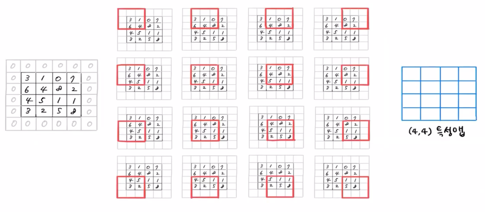
- 개념: 입력 데이터나 feature map의 가장자리에 추가 픽셀을 덧붙이는 기법
- 목적: 
  - 출력 크기 유지: 각 레이어마다 출력 크기가 줄어들면 결국엔 데이터 자체가 사라짐 
  - 가장자리 정보 보전: 중앙의 값은 여러번 계산되지만 가장 자리의 값은 적게 계산되어 중요한 데이터가 처리되지 않을 가능성 있음  
- 방법: 입력 데이터 가장자리를 0으로 채움. 이 방법을 Zero Padding이라고 함.   

### 풀링(Pooling)


- 개념: 특성맵의 차원을 축소하는 것
- 목적: 메모리 사용량 절감과 학습속도 향상
- 방법: 
  - 각 영역의 최대값 또는 평균값을 선택하여 구성. 풀링층이라는 새로운 레이어를 만듦
  - 스트라이드(커널의 이동 단위)는 풀링 결과로 나오는 특성맵의 차원과 동일함 
    예) 2*2 특성맵을 만들려면 스트라이드는 2여야 함  

### 합성곱신경망의 전체 처리 순서   
순전파 -> 손실 계산 -> 역전파 -> 필터 가중치 조정을 반복하면서 학습함       
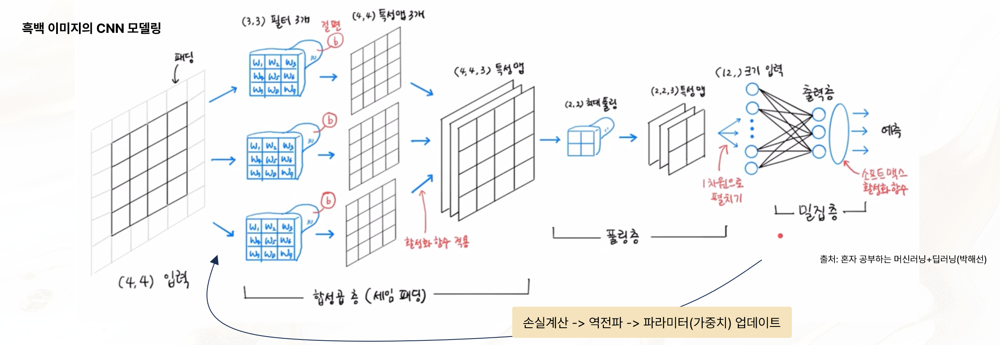   
    
합성곱신경만 처리는 기본적으로 3차원이어야 함   
따라서 2차원인 경우 채널(깊이)이 1개인 3차원 배열로 변환하여 처리함.    


| [Top](#목차) |

---

## 이미지를 위한 ANN:합성곱 신경망을 사용한 이미지 분류

### 케라스를 사용한 예제
**1.첫번째 합성곱 층**         


```
model = keras.Sequential()

model.add(keras.layers.Conv2D(32, kernel_size=3, activation='relu',
                              padding='same', input_shape=(28,28,1)))

model.add(keras.layers.MaxPooling2D(2))
```

**2.두번째 합성곱층과 밀집 층**    

```
model.add(keras.layers.Conv2D(64, kernel_size=(3,3), activation='relu',
                              padding='same'))
model.add(keras.layers.MaxPooling2D(2))

model.add(keras.layers.Flatten())
model.add(keras.layers.Dense(100, activation='relu'))
model.add(keras.layers.Dropout(0.4))
model.add(keras.layers.Dense(10, activation='softmax'))
```

합성곱층과 밀집층 정보 표시
```
model.summary()
```
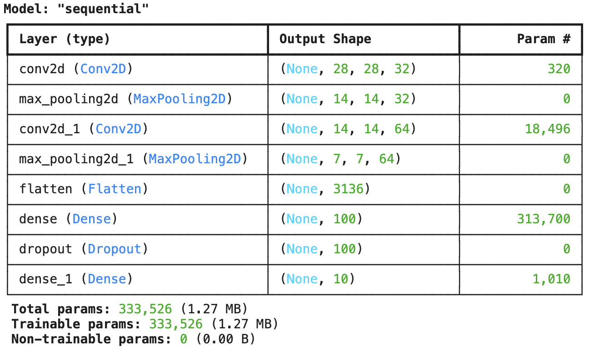

**3.모델 컴파일과 훈련**     
```
model.compile(optimizer='adam', loss='sparse_categorical_crossentropy',
              metrics=['accuracy'])

checkpoint_cb = keras.callbacks.ModelCheckpoint('best-cnn-model.keras',
                                                save_best_only=True)
early_stopping_cb = keras.callbacks.EarlyStopping(patience=2,
                                                  restore_best_weights=True)

history = model.fit(train_scaled, train_target, epochs=20,
                    validation_data=(val_scaled, val_target),
                    callbacks=[checkpoint_cb, early_stopping_cb])
```

**4.모델 훈련 결과 표시**    
1)에포크에 따른 손실점수 표시         
```
import matplotlib.pyplot as plt

plt.plot(history.history['loss'])
plt.plot(history.history['val_loss'])
plt.xlabel('epoch')
plt.ylabel('loss')
plt.legend(['train', 'val'])
plt.show()
```
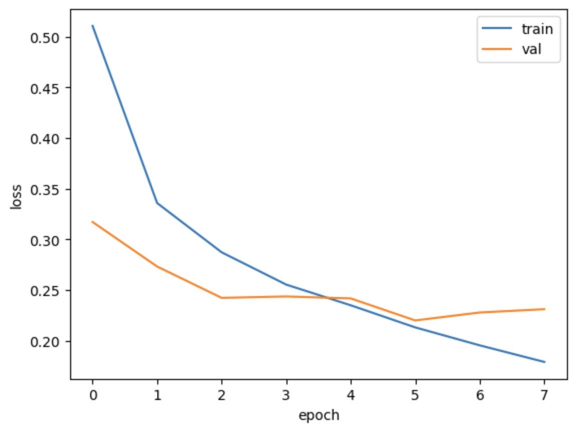
5번 에포크 이후에는 검증점수가 더 이상 줄어들지 않아 2번의 에포크까지 한 후 7번째 에포크에서 중단됨   

2)모델 평가      
```
model.evaluate(val_scaled, val_target)
```
결과: 약 92% 정확도이고 손실점수는 약 0.22(오차점수. 0가 가까울 수록 좋음. 0.22는 양호)
```
375/375 ━━━━━━━━━━━━━━━━━━━━ 1s 3ms/step - accuracy: 0.9234 - loss: 0.2096
[0.22005362808704376, 0.9202499985694885]
```

**5.모델을 이용한 예측**    
검증 데이터 셋트의 첫번째 데이터가 무엇인지 예측     
1)이미지 그려보기       
가방인듯 함
```
plt.imshow(val_scaled[0].reshape(28, 28), cmap='gray_r')
plt.show()
```


2)진짜 가방인지 예측 결과 보기
```
preds = model.predict(val_scaled[0:1])
print(preds)
```
결과:
9번째 Class로 예측함   
```
[[2.4567913e-17 4.5715461e-23 8.8957614e-20 6.0725004e-18 8.0334706e-18
  1.5484204e-18 1.5557679e-18 6.1831409e-16 1.0000000e+00 3.3490770e-19]]
```

각 Class의 확률값을 그래프로 그려봄
```
plt.bar(range(1, 11), preds[0])
plt.xlabel('class')
plt.ylabel('prob.')
plt.show()
```
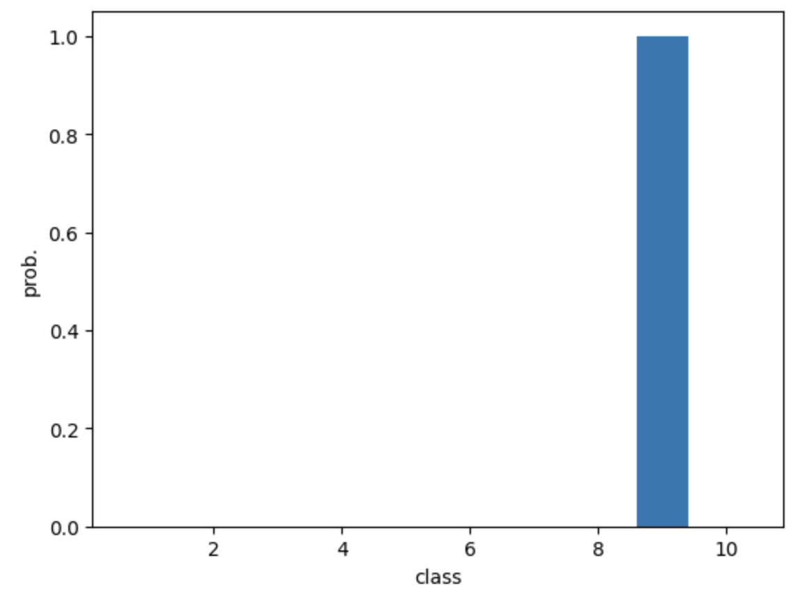

3)Class 명 구하기
```
classes = ['티셔츠', '바지', '스웨터', '드레스', '코트',
           '샌달', '셔츠', '스니커즈', '가방', '앵클 부츠']

import numpy as np
print(classes[np.argmax(preds)]). #결과: 가방
```

**6.테스트 데이터로 모델 평가**     
```
test_scaled = test_input.reshape(-1, 28, 28, 1) / 255.0

model.evaluate(test_scaled, test_target)
```

결과: 약 91% 정확도, 손실점수는 약 0.25 
```
313/313 ━━━━━━━━━━━━━━━━━━━━ 2s 4ms/step - accuracy: 0.9100 - loss: 0.2590
[0.24962453544139862, 0.9114000201225281]
```

| [Top](#목차) |

---

## 이미지를 위한 ANN:합성곱 신경망의 시각화

아래와 같이 훈련된 모델을 로딩함    
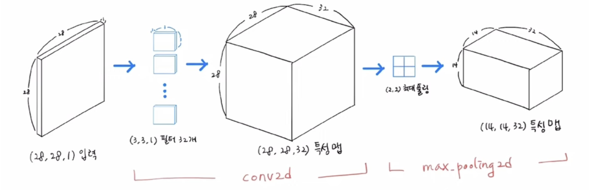


### 합성곱 모델의 레이어와 가중치 확인   

**1.모델 로딩 및 레이어 구성 확인**       
```
import tensorflow as tf
from tensorflow import keras

!wget https://github.com/rickiepark/hg-mldl/raw/master/best-cnn-model.keras
model = keras.models.load_model('best-cnn-model.keras')

model.layers     
```
  
결과:  
```
[<Conv2D name=conv2d, built=True>,
 <MaxPooling2D name=max_pooling2d, built=True>,
 <Conv2D name=conv2d_1, built=True>,
 <MaxPooling2D name=max_pooling2d_1, built=True>,
 <Flatten name=flatten, built=True>,
 <Dense name=dense, built=True>,
 <Dropout name=dropout, built=True>,
 <Dense name=dense_1, built=True>]
```
참고) 입력층이 레이어에 안 나타나는 이유    
아래와 같이 파라미터로 입력층을 설정하면 암묵적 입력층이 생성되고 별도의 입력층이 생기지 않음     
```
model = Sequential()
model.add(keras.layers.Conv2D(32, kernel_size=3, activation='relu',
                              padding='same', input_shape=(28,28,1)))
```
명시적 입력층이 생기게 하려면 아래와 같이 변경해야 함    
```
model = Sequential()
model.add(Input(shape=(28, 28, 1)))      # 명시적 입력층
model.add(keras.layers.Conv2D(32, kernel_size=3, activation='relu',
                              padding='same')
```
  
**2.첫번째 레이어인 합성층의 커널과 바이어스 확인**      
```
conv = model.layers[0]

print(conv.weights[0].shape, conv.weights[1].shape) # 결과 (3, 3, 1, 32) (32,)
```

1)결과 설명:     
conv.weights[0].shape → (3, 3, 1, 32): 커널(필터)  
```
(3, 3, 1, 32)
 │  │  │  └── 필터 개수: 32개
 │  │  └───── 입력 채널 수: 1 (흑백 이미지)
 │  └──────── 필터 높이: 3
 └─────────── 필터 너비: 3
```
conv.weights[1].shape → (32,): 바이어스    
각 필터마다 **1개의 바이어스** 값이 존재 → 32개 필터 = 32개 바이어스     
  
**총 파라미터 수**: (3 × 3 × 1 × 32) + 32 = **288 + 32 = 320개**    

2)커널 가중치값    
```
kernels = conv.weights[0].numpy()
filter_0 = kernels[:, :, :, 0]  # 첫번째 필터값만 확인  
print(filter_0.squeeze())  # 2D로 보기 쉽게
```
결과:   
```
[[ 0.2742824  -0.23858844 -0.14460737]
 [ 0.19392076 -0.00764737  0.01478171]
 [-0.00868339 -0.0895784   0.05076608]]
```

3)바이어스 값 
```
biases = conv.weights[1].numpy()  # 또는 conv.get_weights()[1]
print(biases)  # 32개의 바이어스 값
```
결과:
```
[-9.8264171e-03 -2.5412224e-02  6.3462020e-03 -7.9317461e-04
  1.1249937e-02 -1.7684806e-02 -1.7509054e-01 -1.1502851e-02
  3.6798655e-03 -1.1050852e-02  1.1385297e-03  5.4643098e-03
 -1.1137835e-02  1.3938491e-01 -3.3817443e-05 -4.5283418e-02
  2.0456554e-02 -1.3015689e-01 -1.1310920e-02  1.0778768e-03
 -6.5029832e-03  6.8443930e-03  3.7618491e-03 -5.7523353e-03
 -5.9535120e-02  1.2934269e-01 -4.5140348e-02 -1.5515901e-02
 -3.9069828e-02 -5.1507261e-03 -5.3907048e-02 -1.5607314e-02]
```

4)가중치 분포 그리기     
```
conv_weights = conv.weights[0].numpy()
plt.hist(conv_weights.reshape(-1, 1))
plt.xlabel('weight')
plt.ylabel('count')
plt.show()
```
결과:


- 0을 중심으로 종모양으로 분산되는게 이상적임.   
- 현재 가중치 분포는 약간의 이상치가 있으나 양호하다고 판단됨.   
- 약간의 이상치는 특정 필터가 강한 특징(예: 엣지)을 학습한 결과로 보임
- 엣지란 사람 얼굴의 눈, 코, 입의 윤곽선과 같이 이미지에서 밝기나 색상이 갑자기 변하는 경계선을 의미함   

### 층의 가중치 시각화

첫번째 레이어(conv.weights[0].numpy())의 모든 필터의 가중치값을 시각화함   
```
fig, axs = plt.subplots(2, 16, figsize=(15,2))

for i in range(2):
    for j in range(16):
        axs[i, j].imshow(conv_weights[:,:,0,i*16 + j], vmin=-0.5, vmax=0.5)
        axs[i, j].axis('off')

plt.show()
```
결과:


밝은색은 양수값, 어두운색은 음수값에 가까운 가중치를 나타냄.   
모델 학습전에 필터의 가중치는 아래와 같음. 즉, 학습 후 각 필터가 가중치를 특징에 맞게 조정되었음을 알 수 있음.   
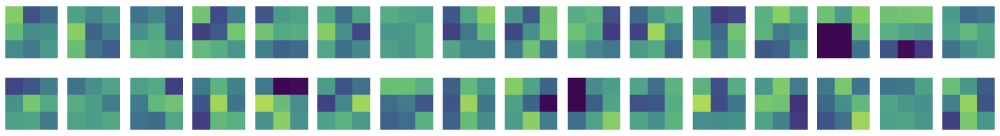


### 함수형 API를 이용한 모델 생성
- 함수형 API 개념: 레이어를 "함수처럼 호출"하는 방식   
  ```python
  inputs = keras.Input(shape=(784,))
  dense1 = keras.layers.Dense(100, activation='relu')
  dense2 = keras.layers.Dense(10, activation='softmax')

  hidden = dense1(inputs)    # dense1 레이어를 함수처럼 호출
  outputs = dense2(hidden)   # dense2 레이어를 함수처럼 호출

  model = keras.Model(inputs, outputs)
  ```
  **레이어 객체를 마치 함수를 호출하듯 `( )` 괄호와 함께 사용  

- 목적: 복잡한 모델 구조(다중 입력, 다중 출력, 분기, 병합)를 자유롭게 설계하기 위함   
  ```python
  # 분기와 병합이 가능
  branch1 = dense_a(inputs)
  branch2 = dense_b(inputs)
  merged = keras.layers.concatenate([branch1, branch2])
  ```

  Sequential로는 이런 구조를 만들 수 없음   

- 방법: Sequential 방식을 함수형 API 방식으로 변경  
  ```python
  # Sequential 방식 (선언적)
  model = keras.Sequential([
      keras.layers.Dense(100, activation='relu'),
      keras.layers.Dense(10, activation='softmax')
  ])

  # Functional 방식 (함수 호출)
  hidden = dense1(inputs)   # ← 함수 호출 문법!
  outputs = dense2(hidden)  # ← 함수 호출 문법!
  ```

- 함수형 API 특징:  
  - 함수 합성(Function Composition)
    - `f(g(x))` 처럼 함수를 연쇄적으로 적용하는 패턴
    - `dense2(dense1(inputs))` ← 이렇게도 쓸 수 있습니다
  - Callable 객체 활용
   - Python에서 `__call__` 메서드를 가진 객체는 함수처럼 호출 가능
   - Keras 레이어는 이 패턴을 활용하여 `layer(tensor)` 형태로 사용
  - 데이터 흐름을 명시적으로 표현
    - 입력 → 변환 → 출력의 흐름이 함수 호출 체인으로 표현됨

- 함수형 API로 모델 생성 예시  
  ```
  from tensorflow.keras import Input, Model
  from tensorflow.keras.layers import Conv2D, MaxPooling2D, Flatten, Dense

  # 함수형 API로 처음부터 모델 생성
  inputs = Input(shape=(28, 28, 1))
  x = Conv2D(32, (3,3), activation='relu')(inputs)
  x = MaxPooling2D((2,2))(x)
  x = Conv2D(64, (3,3), activation='relu')(x)
  x = MaxPooling2D((2,2))(x)
  x = Flatten()(x)
  x = Dense(100, activation='relu')(x)
  outputs = Dense(10, activation='softmax')(x)

  model = Model(inputs, outputs)
  ```

### 합성층별 결과를 시각화 하기      
입력에 가까운 합성곱 층은 경계, 색깔 같은 저수준의 특징을 감지하고,   
출력에 가까운 합성층은 추상적인 특징을 감지함을 체험합니다.      

**1.첫번째 합성층 모델의 결과 시각화**          

```
conv_acti = keras.Model(model.inputs[0], model.layers[0].output)

(train_input, train_target), (test_input, test_target) = keras.datasets.fashion_mnist.load_data()

inputs = train_input[0:1].reshape(-1, 28, 28, 1)/255.0
feature_maps = conv_acti.predict(inputs)
print(feature_maps.shape) # 결과: (1, 28, 28, 32)
```

시각화:  
```
fig, axs = plt.subplots(4, 8, figsize=(15,8))

for i in range(4):
    for j in range(8):
        axs[i, j].imshow(feature_maps[0,:,:,i*8 + j])
        axs[i, j].axis('off')

plt.show()
```

결과:  
**각 필터가 특정 특징에 특화되어 학습하는 것을 알 수 있음**  
  


**2.첫번째 합성층 모델의 결과 시각화**   

두번째 합성층은 아래와 같이 2*2로 Max Pooling하였고,   
필터를 64개로 늘렸으므로 특성맵이 '(1, 14, 14, 64)'으로 나옮    
```
model.add(keras.layers.Conv2D(32, kernel_size=3, activation='relu',
                              padding='same', input_shape=(28,28,1)))
model.add(keras.layers.MaxPooling2D(2))
model.add(keras.layers.Conv2D(64, kernel_size=(3,3), activation='relu',
                              padding='same'))
```

```
conv2_acti = keras.Model(model.inputs, model.layers[2].output)
feature_maps = conv2_acti.predict(train_input[0:1].reshape(-1, 28, 28, 1)/255.0)
print(feature_maps.shape) # 결과 (1, 14, 14, 64)
```

각 필터의 학습 결과를 시각화   
**각 필터를 통한 학습결과가 상당히 추상적으로 변경됨을 알 수 있음**      
```
fig, axs = plt.subplots(8, 8, figsize=(12,12))

for i in range(8):
    for j in range(8):
        axs[i, j].imshow(feature_maps[0,:,:,i*8 + j])
        axs[i, j].axis('off')

plt.show()
```
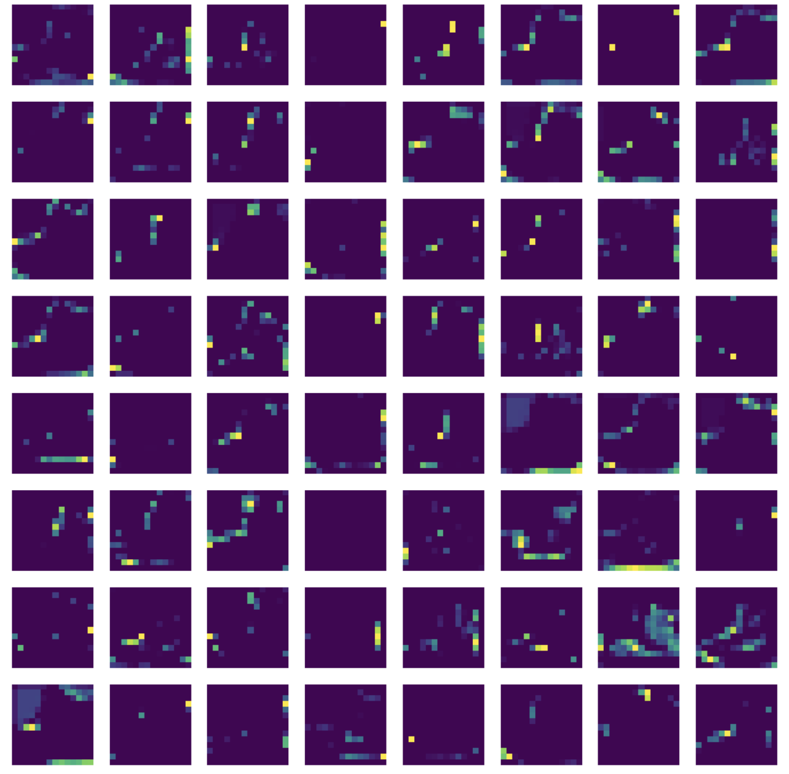


| [Top](#목차) |

---

## 순차 텍스트를 위한 ANN:순차 데이터와 순환 신경망
순환신경망(RNN: Recurrent Neural Network)은 순서가 있는 텍스트나 시계열 데이터를 처리하는 인공신경망입니다.

### 기본 개념  
- 목적: 순서가 있는 데이터에서 **이전 정보를 기억하며 다음에 올 것을 예측**하기 위함
- 방법: 각 시점에서 **현재입력+이전기억을 함께 처리**하고, **업데이트된 기억을 다음 시점에 전달**    
- 예시: 
  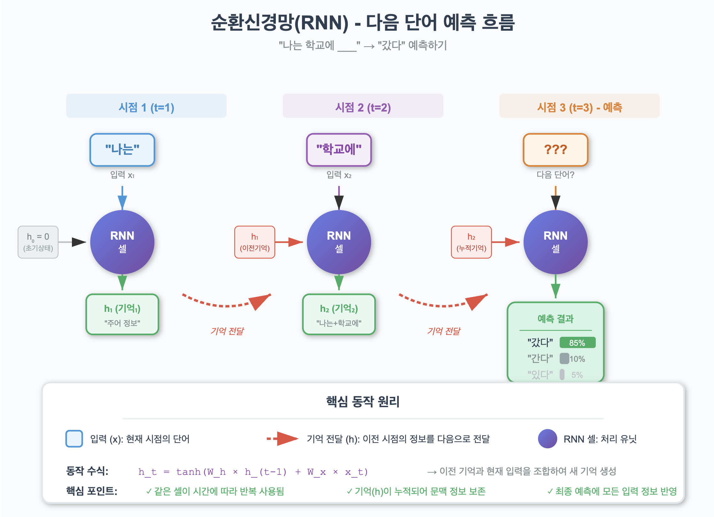 

- (중요) 각 시점에서 사용되는 **가중치 W_h 와 W_x는 일관된 처리 규칙 적용을 위해 동일한 값을 사용**함       
- 활성화 함수 tanh     
  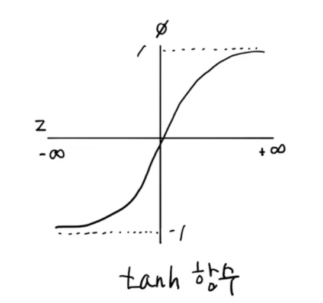   
  - 출력값을 **-1 ~ +1 사이**로 제한
  - 기억이 너무 커지거나 작아지는 것을 방지
  - 그래프처럼 부드러운 S자 곡선

### 용어 정리
  
| 용어 | 영어 | 정의 | 비유 (건물 점검) |
|------|------|------|------------------|
| **샘플** | Sample | 입력 데이터 | - |
| **순환층** | Recurrent Layer | RNN이 작동하는 한 겹의 층 | 건물의 한 층 |
| **셀** | Cell | 매번 같은 방식으로 입력을 처리하는 계산기 | 점검팀 (같은 팀이 모든 방 점검) |
| **뉴런** | Neuron | 셀 안에서 각자 맡은 특징을 추적하는 담당자 | 점검 전문가 (안전/위생/시설) |
| **타임스텝** | Timestep | 입력을 처리하는 각 단계 | 각 방 (101호→102호→103호→104호) |
| **은닉상태** | Hidden State | 각 타임스텝의 결과로 누적된 기억 | 점검 체크리스트 (다음 방에 전달) |


```
건물 1층 (순환층)
━━━━━━━━━━━━━━━━━━━━━━━━━━━━━━━━━━━━━━━━━━━━
  ┌─────┐   ┌─────┐   ┌─────┐   ┌─────┐
  │ 101 │ → │ 102 │ → │ 103 │ → │ 104 │   ← 타임스텝 (방)
  └─────┘   └─────┘   └─────┘   └─────┘
      ↓         ↓         ↓         ↓
   [점검팀]  [점검팀]  [점검팀]  [점검팀]     ← 셀 (같은 팀!)
   안전/위생  안전/위생  안전/위생  안전/위생   ← 뉴런 (전문가)
      ↓         ↓         ↓         ↓
     h₁   →    h₂   →    h₃   →    h₄       ← 은닉상태 (체크리스트)
   
   "이전 방 점검 결과를 참고해서 다음 방 점검"
```
     
### 뉴런 간 상호 참조   
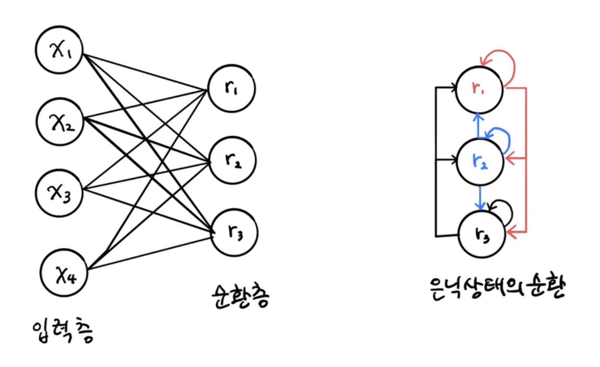
  
뇌의 비유로 이해: 뉴런 3개
```
📚 "나는 학교에"를 이해할 때

이전 시점의 뇌 상태:
├─ 언어영역(r₁): "주어 파악됨"
├─ 문법영역(r₂): "1인칭 확인"  
└─ 감정영역(r₃): "중립 상태"

        ↓ 새 단어 "학교에" 처리 시

현재 시점 각 영역은 이전의 모든 영역을 참조:
├─ 언어영역(r₁): 이전 언어+문법+감정 → "장소 추가"
├─ 문법영역(r₂): 이전 언어+문법+감정 → "목적어 확인"
└─ 감정영역(r₃): 이전 언어+문법+감정 → "학교=일상"

→ 뇌의 각 영역이 다른 영역의 정보도 통합하여 처리
→ 이것이 RNN에서 뉴런 간 상호 참조의 의미
```

### 예제로 RNN 동작원리 이해   
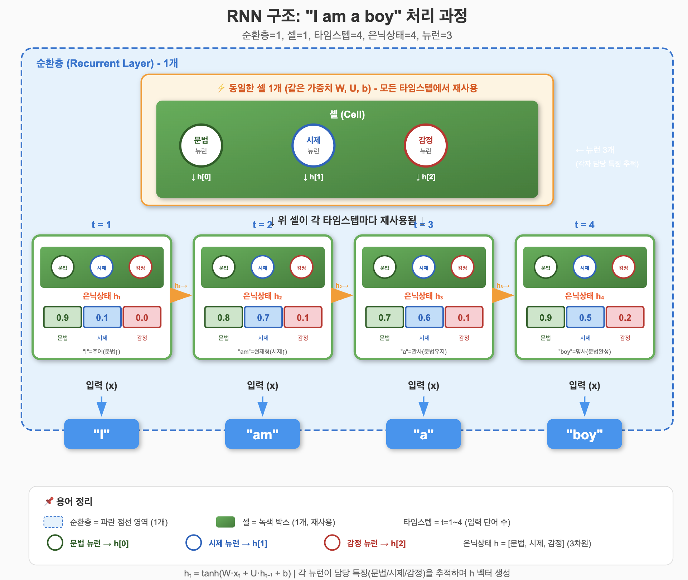

### RNN 핵심 공식
- 은닉 상태 업데이트 (Hidden State Update)    
  $$h_t = \tanh(W_h \cdot h_{t-1} + W_x \cdot x_t + b_h)$$

  | 기호 | 의미 |
  |------|------|
  | $h_t$ | 현재 시점의 은닉 상태 |
  | $h_{t-1}$ | 이전 시점의 은닉 상태 | 
  | $x_t$ | 현재 시점의 입력 |
  | $W_h$ | 은닉 가중치 |
  | $W_x$ | 입력 가중치 |
  | $b_h$ | 은닉층 편향 |
  | $\tanh$ | 활성화 함수(출력 범위: -1 ~ +1) |

  * 입력 가중치, 은닉 가중치의 크기
  ```
  Wx 크기 = (뉴런 개수, 입력 차원) 
  Wh 크기 = (뉴런 개수, 뉴런 개수) 
  ```
  예시)
  ```
  뉴런이 10개면 타임스텝 t-1의 은닉 상태 (이전 상태)는 아래와 같이 10개  
  h_{t-1} = [0.2, 0.5, 0.1, 0.8, 0.3, 0.4, 0.6, 0.7, 0.2, 0.9]
            ↑    ↑    ↑    ↑    ↑    ↑    ↑    ↑    ↑    ↑
            뉴런1 뉴런2 뉴런3 뉴런4 뉴런5 뉴런6 뉴런7 뉴런8 뉴런9 뉴런10
  ```
  은닉 가중치 Wh는 아래 예와 같이 10 * 10이 됨
  ```
                                  이전 시점 뉴런 (입력)
                  1    2    3    4    5    6    7    8    9   10
                ┌────────────────────────────────────────────────--┐
  현재 시점  1    │ 0.1  0.3  0.2  0.1  0.4  0.2  0.1  0.3  0.2  0.1 │
  뉴런       2   │ 0.2  0.1  0.4  0.3  0.1  0.2  0.3  0.1  0.4  0.2 │
  (출력)     3   │ 0.3  0.2  0.1  0.2  0.3  0.1  0.2  0.4  0.1  0.3 │
            4   │ ...                                              │
            5   │ ...                                              │
            6   │ ...                                              │
            7   │ ...                                              │
            8   │ ...                                              │
            9   │ ...                                              │
            10  │ 0.2  0.1  0.3  0.4  0.2  0.1  0.3  0.2  0.1  0.4 │
                └───────────────────────────────────────────────--─┘
                            Wh: 10 x 10 행렬
  ```

- 출력 계산 (Output Calculation)   
  $$y_t = \text{softmax}(W_y \cdot h_t + b_y)$$

  | 기호 | 의미 |
  |------|------|
  | $y_t$ | 현재 시점의 출력 (예측 확률) |
  | $W_y$ | 출력 가중치 | 
  | $h_t$ | 현재 시점의 은닉 상태 |
  | $b_y$ | 출력층 편향 | 
  | $\text{softmax}$ | 확률 변환 함수(총합 = 1) |

### 합성곱 신경망과 비교   

| 구분 | 순환신경망 (RNN) | 합성곱신경망 (CNN) |
|------|------------------|-------------------|
| **영문명** | Recurrent Neural Network | Convolutional Neural Network |
| **주요 목적** | 순서/시간 데이터 처리 | 공간/이미지 데이터 처리 |
| **핵심 아이디어** | 시간에 따른 기억 전달 | 지역적 패턴 추출 |
| **비유** | 📖 책을 순서대로 읽는 독자 | 🔍 돋보기로 그림을 훑는 관찰자 |
| **처리 단위** | 셀 (Cell) | 필터/커널 (Filter/Kernel) |
| **핵심 연산** | 순환 연산 (Recurrence) | 합성곱 연산 (Convolution) |
| **내부 상태** | 은닉 상태 h (기억) | 특성 맵 (Feature Map) |
| **가중치 공유** | 모든 시점에서 동일 | 모든 위치에서 동일 |
| **연결 특성** | 시간적 연결 | 공간적 지역 연결 |
| **적용 분야** | 번역, 음성인식, 챗봇 | 이미지 분류, 객체 탐지 |

### 각 입력은 벡터로 변환
- 벡터는 Feature 값의 배열을 의미    
  예) '키'라는 Feature의 value는 '175'이고 '몸무게'라는 Feature의 value는 70일 때 Vector는 [175, 70]    

- 'I am a boy'의 벡터 변환 예제   
  ```
            [명사성, 동사성, 인칭성]
  "I"   →   [0.2,   0.1,   0.9]   ← 인칭대명사 (인칭성↑)
  "am"  →   [0.1,   0.9,   0.7]   ← 동사 (동사성↑)
  "a"   →   [0.3,   0.0,   0.0]   ← 관사 (모두 낮음)
  "boy" →   [0.9,   0.1,   0.2]   ← 명사 (명사성↑)
  ```

### 순환 신경망을 사용한 예측 전체 과정 개념도


- 샘플은 20개의 타임스텝(단어가 20개)이고 각 타임스텝의 단어는 200차원 벡터로 변환되므로 입력층은 (20, 100)배열임 
- 뉴런이 몇개인지는 표시 안됨
- 은닉층은 순환층과 동일한 의미이며 10개 순환층 존재
- 각 순환층마다 출력이 1개이므로 10개의 출력이 출력층에 생성됨 


| [Top](#목차) |

---

## 순차 텍스트를 위한 ANN:순환신경망으로 IMDB리뷰 분류하기

영화 소개 사이트인 IMDB의 리뷰를 분류하는 순환신경망 모델을 케라스를 이용하여 만듭니다.    

### IMDB리뷰 데이터셋  

  
| 용어 | 원문 영어 | 의미 | 예시 (이미지 기반) |
|------|-----------|------|-------------------|
| **NLP** | Natural Language Processing (자연어 처리) | 컴퓨터가 **인간의 언어를 이해하고 처리하는 AI 기술** 분야 | IMDB 리뷰를 긍정/부정으로 분류하는 감성 분석 |
| **말뭉치** | Corpus | 특정 목적을 위해 수집된 대량의 **텍스트 데이터 집합** | IMDB 데이터셋: 긍정리뷰 25,000개 + 부정리뷰 25,000개 = 총 50,000개 |
| **토큰** | Token | **텍스트를 의미 있는 최소 단위(단어, 문장부호 등)로 분리한 것** | "He follows the cat." → `He`, `follows`, `the`, `cat` (4개 토큰) |
| **어휘 사전** | Vocabulary | 말뭉치에 등장하는 **고유 토큰들을 숫자 인덱스로 매핑한 목록** | `He`→10, `follows`→11, `the`→12, `cat`→13, `loves`→14 |

### 예제  
- 케라스의 데이터셋에서 IMDB 데이터셋 로딩   
  ```
  from tensorflow.keras.datasets import imdb

  (train_input, train_target), (test_input, test_target) = imdb.load_data(
      num_words=200)
  ``` 
    
  참고) `num_words=200`은 **어휘 사전의 크기를 200개로 제한**한다는 의미    
  구체적으로:   
  - IMDB 데이터셋은 영화 리뷰 텍스트를 **단어 빈도 순위에 따른 정수 인덱스**로 인코딩해 제공
  - `num_words=200`으로 설정하면 **가장 자주 등장하는 상위 200개 단어만** 유지됨 
  - 200위 밖의 단어들은 모두 `2` (OOV, Out-Of-Vocabulary)로 대체됨  
  - 인덱스 체계: `0`=패딩, `1`=시퀀스 시작, `2`=OOV, `3`부터 실제 단어
  ```python
  # 예시: 원본이 [1, 14, 22, 16, 43, 530, 973] 였다면
  # num_words=200 적용 시 → [1, 14, 22, 16, 43, 2, 2]
  # (530, 973은 200위 밖이므로 2로 대체)
  ```

- 말뭉치(Corpus) 확인  
  긍정 말뭉치와 부정 말뭉치가 각각 25000개 있음  
  ```
  print(train_input.shape, test_input.shape) # 결과: (25000, ) (25000, 0)
  ``` 

  첫번째 훈련 데이터 리뷰의 길이 확인   
  ```
  print(len(train_input[0]))  #결과: 218
  ```

  첫번째 훈련 데이터 리뷰의 벡터 확인   
  ```
  print(train_input[0])
  결과: 
  [1, 14, 22, 16, 43, 2, 2, 2, 2, 65, 2, 2, 66, 2, 4, 173, 36, 2, 5, 25, 100, 43, 2, 112, 50, 2, 2, 9, 35, 2, 2, 5, 150, 4, 172, 112, 167, 2, 2, 2, 39, 4, 172, 2, 2, 17, 2, 38, 13, 2, 4, 192, 50, 16, 6, 147, 2, 19, 14, 22, 4, 2, 2, 2, 4, 22, 71, 87, 12, 16, 43, 2, 38, 76, 15, 13, 2, 4, 22, 17, 2, 17, 12, 16, 2, 18, 2, 5, 62, 2, 12, 8, 2, 8, 106, 5, 4, 2, 2, 16, 2, 66, 2, 33, 4, 130, 12, 16, 38, 2, 5, 25, 124, 51, 36, 135, 48, 25, 2, 33, 6, 22, 12, 2, 28, 77, 52, 5, 14, 2, 16, 82, 2, 8, 4, 107, 117, 2, 15, 2, 4, 2, 7, 2, 5, 2, 36, 71, 43, 2, 2, 26, 2, 2, 46, 7, 4, 2, 2, 13, 104, 88, 4, 2, 15, 2, 98, 32, 2, 56, 26, 141, 6, 194, 2, 18, 4, 2, 22, 21, 134, 2, 26, 2, 5, 144, 30, 2, 18, 51, 36, 28, 2, 92, 25, 104, 4, 2, 65, 16, 38, 2, 88, 12, 16, 2, 5, 16, 2, 113, 103, 32, 15, 16, 2, 19, 178, 32]
  ```

  첫번째 훈련 데이터 리뷰의 텍스트 확인    
  ```
  word_index = imdb.get_word_index()
  reverse_index = {v+3: k for k, v in word_index.items()}
  reverse_index[1] = '<START>'
  reverse_index[2] = '<OOV>'

  print([reverse_index.get(i, '?') for i in train_input[0][:218]])

  결과: 
  ['<START>', 'this', 'film', 'was', 'just', '<OOV>', '<OOV>', '<OOV>', '<OOV>', 'story', '<OOV>', '<OOV>', 'really', '<OOV>', 'the', 'part', 'they', '<OOV>', 'and', 'you', 'could', 'just', '<OOV>', 'being', 'there', '<OOV>', '<OOV>', 'is', 'an', '<OOV>', '<OOV>', 'and', 'now', 'the', 'same', 'being', 'director', '<OOV>', '<OOV>', '<OOV>', 'from', 'the', 'same', '<OOV>', '<OOV>', 'as', '<OOV>', 'so', 'i', '<OOV>', 'the', 'fact', 'there', 'was', 'a', 'real', '<OOV>', 'with', 'this', 'film', 'the', '<OOV>', '<OOV>', '<OOV>', 'the', 'film', 'were', 'great', 'it', 'was', 'just', '<OOV>', 'so', 'much', 'that', 'i', '<OOV>', 'the', 'film', 'as', '<OOV>', 'as', 'it', 'was', '<OOV>', 'for', '<OOV>', 'and', 'would', '<OOV>', 'it', 'to', '<OOV>', 'to', 'watch', 'and', 'the', '<OOV>', '<OOV>', 'was', '<OOV>', 'really', '<OOV>', 'at', 'the', 'end', 'it', 'was', 'so', '<OOV>', 'and', 'you', 'know', 'what', 'they', 'say', 'if', 'you', '<OOV>', 'at', 'a', 'film', 'it', '<OOV>', 'have', 'been', 'good', 'and', 'this', '<OOV>', 'was', 'also', '<OOV>', 'to', 'the', 'two', 'little', '<OOV>', 'that', '<OOV>', 'the', '<OOV>', 'of', '<OOV>', 'and', '<OOV>', 'they', 'were', 'just', '<OOV>', '<OOV>', 'are', '<OOV>', '<OOV>', 'out', 'of', 'the', '<OOV>', '<OOV>', 'i', 'think', 'because', 'the', '<OOV>', 'that', '<OOV>', 'them', 'all', '<OOV>', 'up', 'are', 'such', 'a', 'big', '<OOV>', 'for', 'the', '<OOV>', 'film', 'but', 'these', '<OOV>', 'are', '<OOV>', 'and', 'should', 'be', '<OOV>', 'for', 'what', 'they', 'have', '<OOV>', "don't", 'you', 'think', 'the', '<OOV>', 'story', 'was', 'so', '<OOV>', 'because', 'it', 'was', '<OOV>', 'and', 'was', '<OOV>', 'life', 'after', 'all', 'that', 'was', '<OOV>', 'with', 'us', 'all']
  ```
  
  훈련 데이터의 정답 데이터 셋트는 총 25000개이고 긍정은 1, 부정은 0으로 채워져 있음.  
  일부 값만 찍어보면 아래와 같음 
  ```
  print(train_target[:20])
  결과: [1 0 0 1 0 0 1 0 1 0 1 0 0 0 0 0 1 1 0 1]
  ```

- 학습데이터의 벡터 길이 평균값과 중앙값 구하기    
  벡터화 한 각 리뷰의 길이의 평균값과 중앙값을 구함으로써    
  리뷰의 길이가 어떻게 분포되었는지를 대략 추정할 수 있음   

  **예시:**
  ```python
  data = [100, 120, 130, 140, 150, 2000]  # 2000이 이상치

  np.mean(data)    # 440 (이상치에 끌려감)
  np.median(data)  # 135 (실제 중심에 가까움)
  ```
  위와 같이 평균값이 중앙값보다 크다면 평균을 사용하면 대다수 리뷰를 커버하지 못할 수 있음    
  그래서 실무에서는 중앙값 또는 **75~90 백분위수**를 많이 사용함   

  ```python
  np.percentile(lengths, 90)  # 상위 90% 커버하는 길이
  ```
  
  예제에서 평균값과 중앙값을 구함   
  예제도 평균값이 중앙값보다 크므로 이상치(너무 크거나 너무 작음)가 많음을 추정할 수 있음      
  ```
  from sklearn.model_selection import train_test_split

  train_input, val_input, train_target, val_target = train_test_split(
    train_input, train_target, test_size=0.2, random_state=42)

  import numpy as np

  lengths = np.array([len(x) for x in train_input])

  print(np.mean(lengths), np.median(lengths))
  # 결과: 237.9088125 179.0   
  ```

  실제 리뷰 길이의 히스토그램을 그려보면 아래와 같음   
  ```
  import matplotlib.pyplot as plt

  plt.hist(lengths)
  plt.xlabel('length')
  plt.ylabel('frequency')
  plt.show()
  ```
  

- 시퀀스 패딩: 
  각 학습데이터의 길이를 일정 길이로 맞추는 작업    
  지정한 길이 이하면 앞에 0을 채우고 이상이면 초과값은 버림.    

  아래와 같이 pad_sequence 함수 사용    
  20000개의 훈련 데이터의 길이가 100으로 동일하게 맞춰짐  
  ```
  from tensorflow.keras.preprocessing.sequence import pad_sequences

  train_seq = pad_sequences(train_input, maxlen=100)
  val_seq = pad_sequences(val_input, maxlen=100) #검증데이터 셋트도 패딩함  

  print(train_seq.shape)
  # 결과: (20000  100)
  ```   

  길이가 100 이하인 학습데이터 셋트를 찾아서 확인해 보면 앞에 0으로 채워져 있음을 알 수 있음    
  ```
  # 길이가 100 이하인 데이터의 인덱스 찾기
  short_indices = [i for i, x in enumerate(train_input) if len(x) <= 100]

  print(f"개수: {len(short_indices)}")
  print(f"인덱스: {short_indices[:10]}...")  # 처음 10개만 출력
  # 결과: 
  개수: 1800
  인덱스: [12, 25, 44, 56, 57, 59, 80, 118, 130, 131]...
  ```

  12번째 학습데이터의 벡터 확인   
  ```
  print(train_seq[12])
  # 결과: 
  [  0   0   0   0   0   0   0   0   0   0   0   0   0   0   0   0   0   0
   0   1  92   2   2   8 106  14   2   2   2  12   9   6   2   2   2  35
   2 119   2   2   2  84  37  28   2  57   2  18   2  85  50   9  57   2
  11  14  65  57 147   2  57 147   2  12   9   6   2   2   2  46   5   2
  17  36   2   5  12 152  60   2   4   2   2   7   2   2 193 148   2   2
   7 129 113   5   2  98  18 142  53   2]
  ```

- 순환신경망으로 모델 만들기   
  ```
  from tensorflow import keras

  model = keras.Sequential()

  model.add(keras.layers.SimpleRNN(8, input_shape=(100, 200)))
  model.add(keras.layers.Dense(1, activation='sigmoid'))  
  ```
    
  1)왜 순환층의 input 데이터 사이즈를  100, 200으로 지정했는가?      
  - 각 리뷰는 100개의 단어(토큰)로 구성. 시퀀스 길이가 100임. 타임스텝도 100이 될것임.   
  - 훈련데이터 세트(train_seq)와 검증데이터 세트(val_seq)의 각 리뷰는 어휘 사전(vocabulary)에서 단어 인덱스를 갖고 있음   
    예)  
    [ 1  92   2   2   8 106  14   2   2   2  12   9   6   2  ...] 
  - 이 단어 인덱스는 최대 200개인 어휘사전에서 몇번째인지를 나타냄   
    예) 'just'는 92번째, 'awesome'은 106번째  
  - 순환신경망은 이 단어인덱스를 그대로 처리하지 못함.    
    각 리뷰 데이터의 각 단어 인덱스(총 100개)를 200차원 벡터에서 해당 단어 인덱스 위치만 1이고 나머지는 0인 값으로 채운 배열로 변환해야 함. 이 방법을 원-핫 인코딩이라고 함.     
    예) 특정 리뷰의 벡터가 [ 3 4 .... ]와 같다면,    
    - 단어인덱스 3의 원-핫 인코딩 결과: [ 0 0 0 1 0 ....0 ]
    - 단어인덱스 4의 원-핫 인코딩 결과: [ 0 0 0 0 1 ....0 ]   
  - 그래서 그래서 input_shape를 **(100, 200)**으로 지정하는 것임   
    
  2)모델 파라미터 보기    
  ```
  model.summary()
  ```
  결과: 
  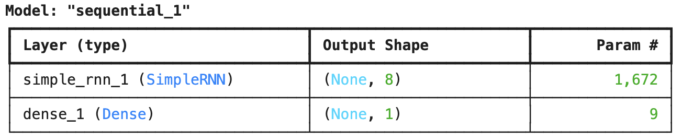

  ```
  SimpleRNN 파라미터 공식:
    파라미터 = (입력 벡터차원 × 뉴런 수) + (뉴런 수 × 뉴런 수) + 바이어스

    계산:
    - input_shape=(100, 200) → 입력 벡터차원 = 200 (토큰/타임스텝 100, 각 토큰은 200차원 벡터)
    - units(=뉴런) = 8

    = (200 × 8) + (8 × 8) + 8
    = 1600 + 64 + 8
    = 1672

    각 항목의 의미:
    - 1600 (200 × 8): 입력 → 은닉 상태 가중치 (W_xh)
    - 64 (8 × 8): 이전 은닉 상태 → 현재 은닉 상태 가중치 (W_hh, 순환 연결)
    - 8: 편향(bias)

  밀집층:  
    파라미터 = (입력 뉴런 * 출력 뉴런) + 바이어스
          = 8 * 1 + 1 = 9
  ```

- 원-핫 인코딩   
  ```
  train_oh = keras.utils.to_categorical(train_seq)
  print(train_oh.shape) # 결과: (20000, 100, 200)
  ``` 
  첫번째 리뷰의 첫번째 단어(토큰)의 원-핫 인코딩 결과. 12번째까지만 표시 
  ```
  print(train_oh[0][0][:12])
  #결과: [0. 0. 0. 0. 0. 0. 0. 0. 0. 0. 1. 0.]
  ```

  검증데이터 셋트도 원-핫 인코딩 함    
  ```
  val_oh = keras.utils.to_categorical(val_seq)
  ```

- 순환신경망 모델 훈련
  ```
  rmsprop = keras.optimizers.RMSprop(learning_rate=1e-4)
  model.compile(optimizer=rmsprop, loss='binary_crossentropy',
                metrics=['accuracy'])

  checkpoint_cb = keras.callbacks.ModelCheckpoint('best-simplernn-model.keras',
                                                  save_best_only=True)
  early_stopping_cb = keras.callbacks.EarlyStopping(patience=3,
                                                    restore_best_weights=True)

  history = model.fit(train_oh, train_target, epochs=100, batch_size=64,
                      validation_data=(val_oh, val_target),
                      callbacks=[checkpoint_cb, early_stopping_cb])

  ``` 
  참고) batch_size는 한번의 가중치 업데이트에 사용할 샘플 갯수로서 미니배치 경사하강법을 사용하고 있음을 알 수 있음 (배치경사하강법은 전체 샘플 사용. 확률적 경사하강법은 한개의 샘플만 사용)

  훈련 결과 시각화   
  ```
  plt.plot(history.history['loss'])
  plt.plot(history.history['val_loss'])
  plt.xlabel('epoch')
  plt.ylabel('loss')
  plt.legend(['train', 'val'])
  plt.show()
  ```
   

- 모델 평가:
  ```
  test_seq = pad_sequences(test_input, maxlen=100)
  test_oh = keras.utils.to_categorical(test_seq, num_classes=200)

  # 평가
  loss, accuracy = model.evaluate(test_oh, test_target)
  print(f'손실: {loss:.4f}, 정확도: {accuracy:.4f}')
  ``` 

### 임베딩
원-핫 인코딩은 어휘 크기만큼의 희소 벡터를 생성하여 메모리 비효율적이고 의미적 유사성을 표현할 수 없음.   
그래서 저차원의 밀집 벡터로 단어를 표현하며, 의미적 관계가 학습되는 임베딩을 더 많이 사용함.   

좀 더 쉽게 설명하면,   
원-핫 인코딩은 단어마다 엄청 긴 벡터가 필요해서 메모리 낭비가 심함.       
그래서 **단어를 짧은 실수 리스트로 바꾸면서, 비슷한 의미의 단어는 비슷한 실수를 갖게 하는 임베딩**을 더 많이 사용함.     
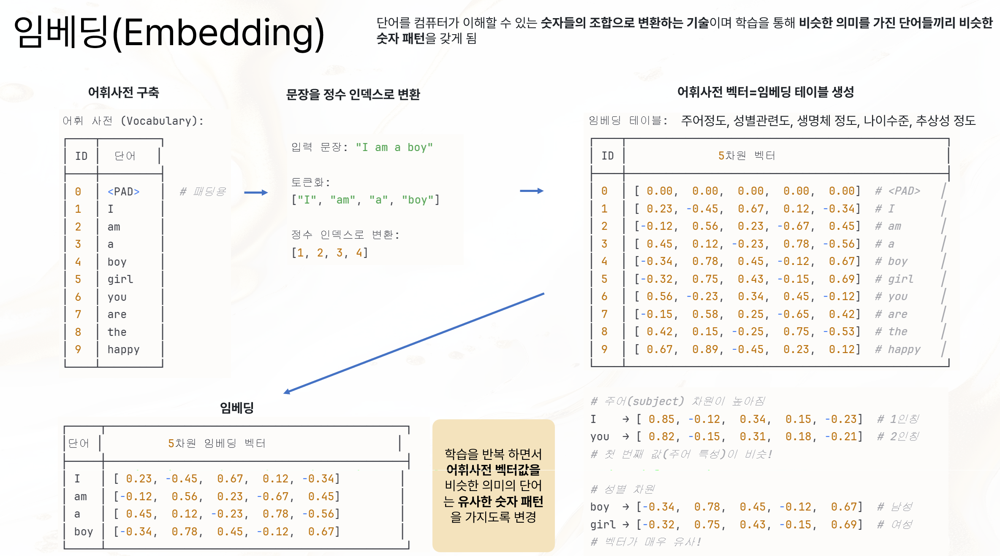  

- 모델 생성   
  어휘 사전 200개, 각 단어(토큰)은 16차원 벡터로 임베딩, 샘플 단어는 100차원 벡터로 패딩됨     
  ```
  model2 = keras.Sequential()

  model2.add(keras.layers.Embedding(200, 16, input_shape=(100,)))
  model2.add(keras.layers.SimpleRNN(8))
  model2.add(keras.layers.Dense(1, activation='sigmoid'))
  
  model2.summary()
  ```
  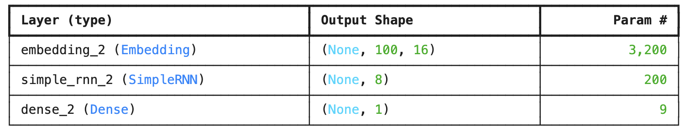

- 모델 훈련
  ```
  rmsprop = keras.optimizers.RMSprop(learning_rate=1e-4)
  model2.compile(optimizer=rmsprop, loss='binary_crossentropy',
                metrics=['accuracy'])

  checkpoint_cb = keras.callbacks.ModelCheckpoint('best-embedding-model.keras',
                                                  save_best_only=True)
  early_stopping_cb = keras.callbacks.EarlyStopping(patience=3,
                                                    restore_best_weights=True)

  history = model2.fit(train_seq, train_target, epochs=100, batch_size=64,
                      validation_data=(val_seq, val_target),
                      callbacks=[checkpoint_cb, early_stopping_cb])
  ``` 

- 결과 시각화
  ```
  plt.plot(history.history['loss'])
  plt.plot(history.history['val_loss'])
  plt.xlabel('epoch')
  plt.ylabel('loss')
  plt.legend(['train', 'val'])
  plt.show()
  ``` 

  


| [Top](#목차) |

---

## 순차 텍스트를 위한 ANN:LSTM 셀과 GRU 셀

### LSTM 셀 개념 
LSTM은 Long Short-Term Memory의 약자임      
- 목적: 오래된 정보도 필요하면 기억하고, 불필요한 건 잊는 똑똑한 기억 시스템을 만들기 위함     
       (SimpleRNN은 문장이 길어지면 앞 부분을 기억 못함)     
    
- 방법: 4개의 게이트(망각, 셀, 입력, 출력)가 동작하여 수행됨     
  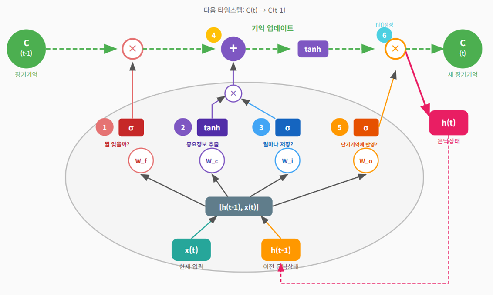  

  ```
  1. 입력: h(t-1), x(t), C(t-1) 
    
  2. 처리 
    ① f = σ(W_f·[h(t-1),x(t)]+b_f) -> 뭘 잊을까(-1 ~ 1)
      망각 게이트 = 
      망각 가중치 * [이전 스텝 결과 + 이번 스텝 입력] + 망각 바이어스의 결과를 시그모이드 함수로 변환 
      
    ② c̃ = tanh(W_c·[h(t-1),x(t)]+b_c)  → 새 후보는? (-1~1) 
      셀 게이트 =  
      셀 가중치 * [이전 스텝 결과 + 이번 스텝 입력] + 셀 바이어스의 결과를 탄에이치 함수로 변환 

    ③ i = σ(W_i·[h(t-1),x(t)]+b_i)     → 얼마나 저장? (0~1) 
      입력 게이트 = 
      입력 가중치 * [이전 스텝 결과 + 이번 스텝 입력] + 입력 바이어스의 결과를 시그모이드 함수로 변환
                                                              
    ④ C(t) = f×C(t-1) + i×c̃   → 기억 업데이트
      새 장기기억 = 
      망각게이트 결과 * 이전 장기기억 + 입력게이트 결과(기억 비율) * 셀 게이트 결과(기억 후보)           
                                                            
    ⑤ o = σ(W_o·[h(t-1),x(t)]+b_o)     → 얼마나 출력? (0~1) 
      출력 게이트 =  
      출력 가중치 * [이전 스텝 결과 + 이번 스텝 입력] + 출력 바이어스의 결과를 시그모이드 함수로 변환   
                                                          
    ⑥ h(t) = o × tanh(C(t))   → 최종 출력 
      최종 출력 = 
      출력 게이트 결과 * 새 장기기억의 탄에이치 함수 변환 결과               
      * tanh 사용 이유: C(t)는 계속 더해지면서 값이 커질 수 있으므로 -1 ~ 1로 범위로 제한하기 위함  

  3. 출력: h(t), C(t) → 다음 타임스텝으로 전달 
  ```

### LSTM 셀 예제: 기본 
**1.데이터 구성**      
```
from tensorflow.keras.datasets import imdb
from sklearn.model_selection import train_test_split

(train_input, train_target), (test_input, test_target) = imdb.load_data(
    num_words=500)

train_input, val_input, train_target, val_target = train_test_split(
    train_input, train_target, test_size=0.2, random_state=42)

from tensorflow.keras.preprocessing.sequence import pad_sequences

train_seq = pad_sequences(train_input, maxlen=100)
val_seq = pad_sequences(val_input, maxlen=100)    
```   
  
**2.모델 구성**    
500개 어휘사전, 임베딩 벡터 16차원, 입력 샘플 100개.   
순환층 뉴런 갯수 8개이며 LSTM 셀 사용.       
```
from tensorflow import keras

model = keras.Sequential()

model.add(keras.layers.Embedding(500, 16, input_shape=(100,)))
model.add(keras.layers.LSTM(8))
model.add(keras.layers.Dense(1, activation='sigmoid'))

model.summary()
```

```
파라미터 수 계산:  
- Embedding 층 = vocab_size × embedding_dim
      = 500 × 16 = 8,000
  * 입력 데이터 100개는 시퀀스 길이(=타임스텝)이므로 파라미터 수에 영향을 미치지 않음  
- LSTM 층 = 4 × [(input_dim × units) + (units × units) + units]
      = 4 × [(16 × 8) + (8 × 8) + 8]
      = 4 × [128 + 64 + 8]
      = 4 × 200 = 800
  * 4개의 게이트(forget, input, cell, output)를 가지며, 각 게이트마다 가중치가 필요

- 밀집층 = (input_dim × output_dim) + bias
      = (8 × 1) + 1 = 9
```

**3.모델 훈련**    
```
rmsprop = keras.optimizers.RMSprop(learning_rate=1e-4)
model.compile(optimizer=rmsprop, loss='binary_crossentropy',
              metrics=['accuracy'])

checkpoint_cb = keras.callbacks.ModelCheckpoint('best-lstm-model.keras',
                                                save_best_only=True)
early_stopping_cb = keras.callbacks.EarlyStopping(patience=3,
                                                  restore_best_weights=True)

history = model.fit(train_seq, train_target, epochs=100, batch_size=64,
                    validation_data=(val_seq, val_target),
                    callbacks=[checkpoint_cb, early_stopping_cb])
```

가시화
```
import matplotlib.pyplot as plt

plt.plot(history.history['loss'])
plt.plot(history.history['val_loss'])
plt.xlabel('epoch')
plt.ylabel('loss')
plt.legend(['train', 'val'])
plt.show()
```


### LSTM 셀 예제: 순환층에 dropout 적용
**1.dropout 적용하여 모델 구성**         
```
model2 = keras.Sequential()

model2.add(keras.layers.Embedding(500, 16, input_shape=(100,)))
model2.add(keras.layers.LSTM(8, dropout=0.3))
model2.add(keras.layers.Dense(1, activation='sigmoid'))
```

**2.모델 훈련**     
```
rmsprop = keras.optimizers.RMSprop(learning_rate=1e-4)
model2.compile(optimizer=rmsprop, loss='binary_crossentropy',
               metrics=['accuracy'])

checkpoint_cb = keras.callbacks.ModelCheckpoint('best-dropout-model.keras',
                                                save_best_only=True)
early_stopping_cb = keras.callbacks.EarlyStopping(patience=3,
                                                  restore_best_weights=True)

history = model2.fit(train_seq, train_target, epochs=100, batch_size=64,
                     validation_data=(val_seq, val_target),
                     callbacks=[checkpoint_cb, early_stopping_cb])
```
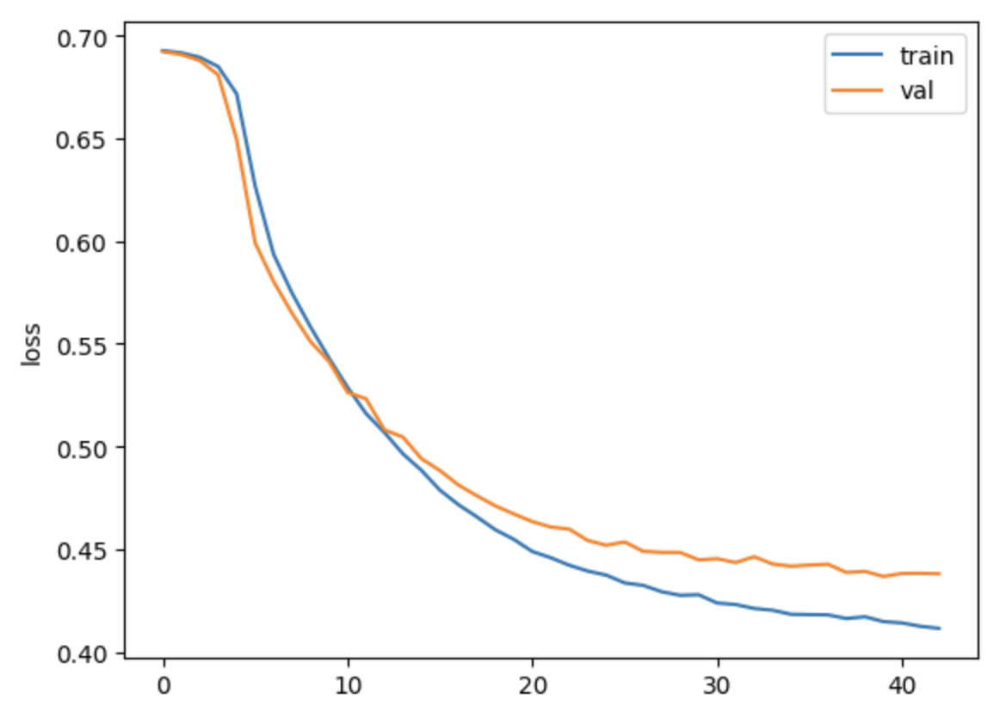   

**3.Dropout 적용 전후 학습 곡선 비교 분석**     
| 구분 | Dropout 미적용 (Image 1) | Dropout 적용 (Image 2) |
|------|-------------------------|------------------------|
| **총 Epoch** | 50 | ~42 (Early Stopping 추정) |
| **최종 Train Loss** | ~0.40 | ~0.41 |
| **최종 Val Loss** | ~0.44 | ~0.44 |
| **Train-Val Gap** | ~0.04 (넓음) | ~0.03 (좁음) |
| **곡선 특성** | 매우 Smooth | Fluctuation 존재 |
| **수렴 시점** | Epoch 35~40 | Epoch 30~35 |

1)핵심 관찰:        
- **Dropout 미적용**: Epoch 15 이후 train과 val 곡선이 점진적으로 벌어지며, train loss가 계속 하락하는 동안 val loss는 정체 → **Overfitting 징후**
- **Dropout 적용**: 두 곡선이 더 가깝게 유지되며, 곡선에 노이즈가 있지만 generalization gap이 작음

2)Dropout 효과     
- Overfitting 억제 효과 확인
- Dropout의 정규화 효과
  Dropout 적용 시:
  - 학습 과정에서 랜덤하게 뉴런을 비활성화하므로 곡선에 **fluctuation(떨림)**이 발생: 정상적 현상 
  - 앙상블 효과로 인해 모델이 특정 뉴런에 과도하게 의존하지 않게 됨
  - 결과적으로 **train-val gap 감소** → 일반화 성능 개선
- Early Stopping과의 시너지
  Dropout 적용 그래프가 42 epoch에서 종료된 것은 validation loss가 개선되지 않아 Early Stopping이 작동한 것으로 보임  

### LSTM 셀 예제: 2개 순환층 연결   
각 순환층은 이전 순환층의 모든 타입스텝 결과를 받아야 동작하므로 return_sequence=True를 설정함    
```
입력: (batch, 100, 16)  ← Embedding 출력
        ↓
첫 번째 LSTM (return_sequences=True): (batch, 100, 8)  ← 100개 타임스텝 모두 출력
        ↓
두 번째 LSTM (return_sequences=False): (batch, 8)  ← 마지막 타임스텝만 출력
        ↓
Dense: (batch, 1)
```

**1.모델구성**    
```
model3 = keras.Sequential()

model3.add(keras.layers.Embedding(500, 16, input_shape=(100,)))
model3.add(keras.layers.LSTM(8, dropout=0.3, return_sequences=True))
model3.add(keras.layers.LSTM(8, dropout=0.3))
model3.add(keras.layers.Dense(1, activation='sigmoid'))

model3.summary()
```
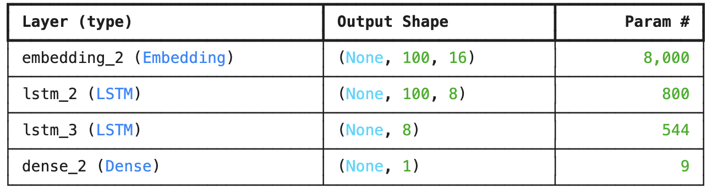   

```
1. Embedding 레이어: **8,000**
파라미터 = vocab_size × embedding_dim
         = 500 × 16 = 8,000

각 단어(500개)마다 16차원 벡터를 저장하는 룩업 테이블입니다.

2. 첫 번째 LSTM: **800**
파라미터 = 4 × [(input_dim × units) + (units × units) + units]
         = 4 × [(16 × 8) + (8 × 8) + 8]
         = 4 × [128 + 64 + 8]
         = 4 × 200 = 800

3. 두 번째 LSTM: **544**
파라미터 = 4 × [(8 × 8) + (8 × 8) + 8]
         = 4 × [64 + 64 + 8]
         = 4 × 136 = 544
이전 LSTM 출력이 8이므로 input_dim = 8

4. Dense 레이어: **9**
파라미터 = (input_dim × units) + units
         = (8 × 1) + 1 = 9
```

**2.모델훈련**        
```
rmsprop = keras.optimizers.RMSprop(learning_rate=1e-4)
model3.compile(optimizer=rmsprop, loss='binary_crossentropy',
               metrics=['accuracy'])

checkpoint_cb = keras.callbacks.ModelCheckpoint('best-2rnn-model.keras',
                                                save_best_only=True)
early_stopping_cb = keras.callbacks.EarlyStopping(patience=3,
                                                  restore_best_weights=True)

history = model3.fit(train_seq, train_target, epochs=100, batch_size=64,
                     validation_data=(val_seq, val_target),
                     callbacks=[checkpoint_cb, early_stopping_cb])
```


### GRU 셀: 개념
GRU는 Gated Recurrent Unit의 약자임.  Gated는 '게이트(문)가 있는'이라는 의미.   
- 목적
  LSTM과 동일하게 오래된 정보도 필요하면 기억하고, 불필요한 건 잊는 똑똑한 기억 시스템을 만들기 위함.    
  **단, LSTM보다 구조가 단순하여 학습이 빠르고 파라미터가 적음**

- LSTM과의 핵심 차이점

  | 구분 | LSTM | GRU |
  |------|------|-----|
  | 게이트 수 | 4개 (망각, 셀, 입력, 출력) | **2개 (리셋, 업데이트)** |
  | 상태 | 셀 상태(C) + 은닉 상태(h) | **은닉 상태(h)만 사용** |
  | 파라미터 수 | 많음 | **적음 (약 25% 감소)** |
  | 학습 속도 | 느림 | **빠름** |
    
  (주의)GRU의 게이트는 2개이나 연산은 3개 단계(리셋,업데이트,후보 생성)이므로 파라미터 수 계산시에는 3을 곱해야 함. 


- 방법: 2개의 게이트 + 후보 생성이 동작하여 수행됨
  

  ```
  1. 입력: h(t-1), x(t)
    * LSTM과 달리 별도의 셀 상태(C) 없음!
    
  2. 처리 
    ① r = σ(W_r·[h(t-1),x(t)]+b_r) → 뭘 잊을까? (0~1)
      리셋 게이트 = 
      리셋 가중치 × [이전 은닉상태 + 이번 입력] + 리셋 바이어스의 결과를 시그모이드 함수로 변환 
      * 이전 정보를 얼마나 "리셋(무시)"할지 결정
      
    ② z = σ(W_z·[h(t-1),x(t)]+b_z) → 얼마나 유지? (0~1)
      업데이트 게이트 = 
      업데이트 가중치 × [이전 은닉상태 + 이번 입력] + 업데이트 바이어스의 결과를 시그모이드 함수로 변환
      * 이전 정보와 새 정보의 "혼합 비율" 결정
      * LSTM의 망각 게이트 + 입력 게이트 역할을 하나로 통합!
                                                                
    ③ h̃ = tanh(W_h·[r×h(t-1), x(t)]+b_h) → 새 후보는? (-1~1)
      후보 은닉상태 = 
      후보 가중치 × [리셋된 이전 은닉상태 + 이번 입력] + 후보 바이어스의 결과를 탄에이치 함수로 변환
      * 핵심: r×h(t-1)로 이전 정보를 선택적으로 반영
      * r=0이면 이전 정보 완전 무시, r=1이면 이전 정보 전부 사용
                                                              
    ④ h(t) = (1-z)×h(t-1) + z×h̃ → 은닉상태 업데이트
      새 은닉상태 = 
      (1-업데이트 게이트) × 이전 은닉상태 + 업데이트 게이트 × 후보 은닉상태
      * z=0: 이전 상태 100% 유지 (새 정보 무시)
      * z=1: 새 후보로 100% 교체 (이전 정보 무시)
      * LSTM과 달리 별도의 출력 게이트 없이 h(t)가 바로 출력!

    ⑤ 최종 출력 = h(t)
      * 별도의 변환 없이 은닉상태가 그대로 출력됨

  3. 출력: h(t) → 다음 타임스텝으로 전달
    * LSTM처럼 C(t)를 별도로 전달하지 않음
  ```

- GRU의 장단점

  **장점:**
  - 파라미터가 적어 학습이 빠름
  - 과적합 위험이 낮음
  - 작은 데이터셋에서 효과적

  **단점:**
  - 매우 긴 시퀀스에서는 LSTM보다 성능이 떨어질 수 있음
  - 복잡한 패턴 학습에는 LSTM이 유리할 수 있음

- 언제 GRU vs LSTM?

  | 상황 | 추천 |
  |------|------|
  | 데이터셋이 작을 때 | **GRU** |
  | 학습 속도가 중요할 때 | **GRU** |
  | 매우 긴 시퀀스 (1000+ 토큰) | LSTM |
  | 리소스가 제한적일 때 | **GRU** |


### GRU 셀: 예제
**1.모델구성**    
```
model4 = keras.Sequential()

model4.add(keras.layers.Embedding(500, 16, input_shape=(100,)))
model4.add(keras.layers.GRU(8))
model4.add(keras.layers.Dense(1, activation='sigmoid'))

model4.summary()
```
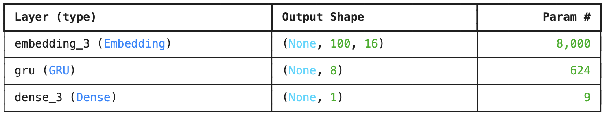 

```
1. Embedding 레이어: **8,000**
파라미터 = vocab_size × embedding_dim
         = 500 × 16 = 8,000

각 단어(500개)마다 16차원 벡터를 저장하는 룩업 테이블입니다.

2. GRU: **624**
파라미터 = 3 × [(input_dim × units) + (units × units) + (2 * units)]
         = 3 × [(16 × 8) + (8 × 8) + (2*8)]
         = 3 × [128 + 64 + 16]
         = 3 × 208 = 624
┌───────────────────────────────────────────────────────────────── ┐
│  GRU = 3 × [(input_dim × units) + (units × units) + (2 × units)] │
│                    ↓              ↓               ↓              │
│               입력 가중치     은닉 가중치      바이어스(2개)              │
│                  (W)            (U)           (b_input, b_hidden)│
└─────────────────────────────────────────────────────────────────-┘

3. Dense 레이어: **9**
파라미터 = (input_dim × units) + units
         = (8 × 1) + 1 = 9
```

**2.모델훈련**       
```
rmsprop = keras.optimizers.RMSprop(learning_rate=1e-4)
model4.compile(optimizer=rmsprop, loss='binary_crossentropy',
               metrics=['accuracy'])

checkpoint_cb = keras.callbacks.ModelCheckpoint('best-gru-model.keras',
                                                save_best_only=True)
early_stopping_cb = keras.callbacks.EarlyStopping(patience=3,
                                                  restore_best_weights=True)

history = model4.fit(train_seq, train_target, epochs=100, batch_size=64,
                     validation_data=(val_seq, val_target),
                     callbacks=[checkpoint_cb, early_stopping_cb])
```

```
plt.plot(history.history['loss'])
plt.plot(history.history['val_loss'])
plt.xlabel('epoch')
plt.ylabel('loss')
plt.legend(['train', 'val'])
plt.show()
```
 


### 예제로 이해하는 LSTM셀과 GRU셀 

아래 링크의 html을 파일로 만들어 브라우저에서 열어 LSTM셀과 GRU셀에 대해 완벽히 이해     
https://github.com/agilepia/aistudy/blob/main/start-here/lstm-gru-sample.html


### 전체 학습과정 개념도    
순전파 -> 손실계산 -> 역전파 -> 어휘사전 벡터(=임베딩 테이블)의 벡터 조정을 반복하면서 학습   
   
  
| [Top](#목차) |

---

## 언어 모델을 위한 ANN:어텐션 메커니즘과 트랜스포머

### 인코더-디코더 신경망
**1.목적**: 한 형태의 정보를 다른 형태로 **변환**     
**2.방법**: **인코더**에서 입력 문장을 순차적으로 읽어 **요약**하고 그 결과를 **디코더**에서 하나씩 **출력**함  
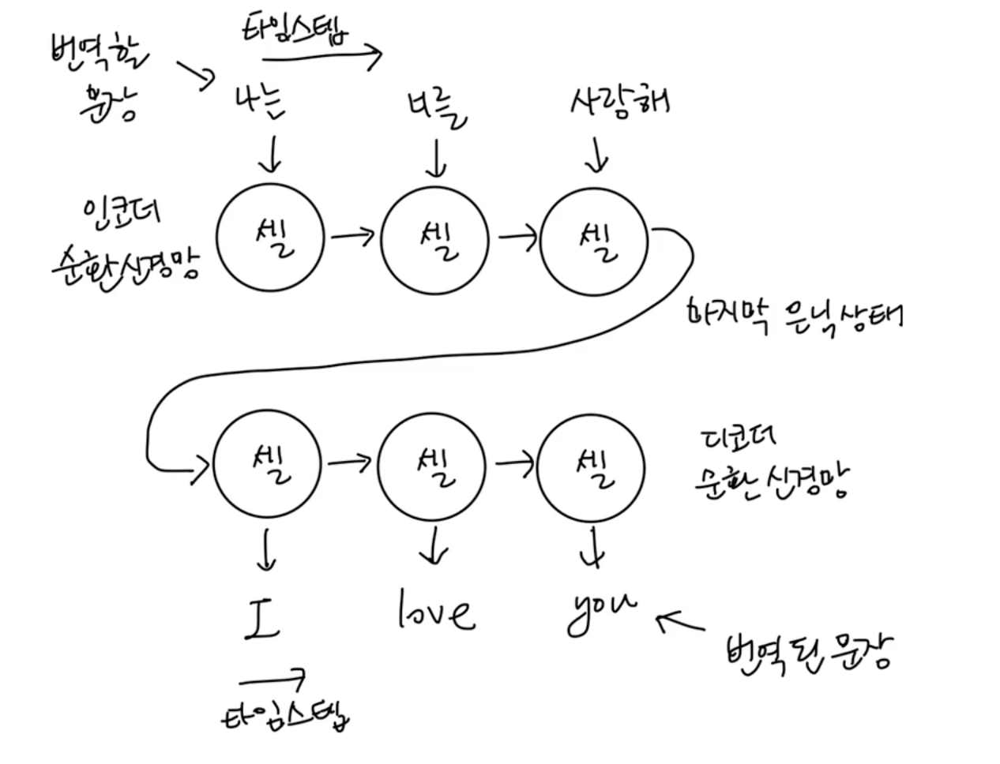   
- 인코더(Encoder) - "듣고 이해하는 단계"
  - 입력 문장을 순차적으로 읽음
  - 전체 의미를 하나의 컨텍스트 벡터(고정 길이 숫자 배열)로 압축
  - 마치 책 한 권을 읽고 핵심 요약문을 만드는 것

- 디코더(Decoder) - "이해한 것을 표현하는 단계"
  - 컨텍스트 벡터를 받아서
  - 한 단어씩 순차적으로 출력을 생성
  - 마치 요약문을 보고 새로운 글을 쓰는 것   
  
**3.문제점**: **정보손실** 발생  
  아무리 긴 문장이라도 고정된 크기의 벡터 하나에 담아야 하기 때문에 정보 손실 발생     

### 어텐션 메커니즘  
**1.목적: 중요한 부분에 집중**     
예) 시험문제 풀기    
```
문제: "다음 중 광합성에서 산소가 발생하는 장소는?"

학생의 사고 과정:
- 전체 교과서 내용 중
- "광합성" 관련 부분에 집중 ← 어텐션!
- "산소 발생" 키워드에 더 집중 ← 어텐션!
- 답: "엽록체의 틸라코이드"
```

**2.방법**:   
1)인코더의 **각 토큰의 은닉상태를 디코더에서 참조**    
어텐션이 없는 경우: 인코더-디코더 신경망     
```
입력: [단어1] → [단어2] → [단어3] → [단어4]
                                      ↓
                              [압축된 벡터 하나]
                                      ↓
출력:                         [전체를 기반으로 생성]
```
어텐션이 있는 경우   
```
입력: [단어1] [단어2] [단어3] [단어4]
        ↓       ↓       ↓       ↓
      [h1]    [h2]    [h3]    [h4]  ← 각각의 상태 저장
        ↘      ↓       ↓      ↙
           [필요한 것만 골라서 참조]
                    ↓
출력:    [매 단어마다 다르게 집중하며 생성]
```

2)각 토큰의 중요도를 계산해 **중요한 부분에 집중**         
| 단계 | 설명 | 비유 |
|------|------|------|
| 1. **Query** 생성 | "지금 내가 찾는 게 뭐지?" | 질문하기 |
| 2. **Key** 비교 | "각 단어가 내 질문과 얼마나 관련있지?" | 목차 훑어보기 |
| 3. 가중치 계산 | 관련도를 0~1 사이 점수로 변환 | 중요도 매기기 |
| 4. **Value** 조합 | 중요한 것에 더 많은 비중을 두고 합산 | 핵심만 정리 |

예시)
```
┌─────────────────────────────────────────────────────────────┐
│                    Query, Key, Value 흐름                    │
└─────────────────────────────────────────────────────────────┘

입력 문장: [고양이] [가] [생선을] [먹는다]
              ↓      ↓      ↓       ↓
           ┌──────────────────────────────┐
           │     선형 변환 (학습된 가중치)     │
           └──────────────────────────────┘
              ↓      ↓      ↓       ↓
           ┌────┐ ┌────┐ ┌────┐ ┌────┐
     Key:  │ K1 │ │ K2 │ │ K3 │ │ K4 │  ← "이 단어는 이런 특성"
           └────┘ └────┘ └────┘ └────┘
           
           ┌────┐ ┌────┐ ┌────┐ ┌────┐
   Value:  │ V1 │ │ V2 │ │ V3 │ │ V4 │  ← "실제 가져갈 정보"
           └────┘ └────┘ └────┘ └────┘


디코더 (현재 "fish" 생성 중)
              ↓
           ┌────┐
   Query:  │ Q  │  ← "음식 관련 정보가 필요해!"
           └────┘
              ↓
    ┌─────────────────────────────────┐
    │     Q × K (유사도 계산)            │
    │  [0.27] [0.13] [0.87] [0.59]    │
    └─────────────────────────────────┘
              ↓
    ┌─────────────────────────────────┐
    │        Softmax (정규화)           │
    │  [0.20] [0.17] [0.36] [0.27]    │
    │   20%   17%   36%🎯  27%        │
    └─────────────────────────────────┘
              ↓
    ┌─────────────────────────────────┐
    │  가중치 × Value = Context         │
    │  0.20×V1 + 0.17×V2 + 0.36×V3    │
    │         + 0.27×V4               │
    └─────────────────────────────────┘
              ↓
         [Context Vector]
              ↓
         "fish" 생성! 🐟
```

**3.문제점**:   
| 한계점 | 설명 |
|--------|------|
| **순차적 처리** | RNN 특성상 t번째 단어를 처리하려면 t-1번째까지 완료해야 함 → 병렬화 불가 |
| **학습 속도 저하** | 긴 시퀀스일수록 학습 시간이 선형적으로 증가 |
| **장거리 의존성 문제** | 문장이 길어지면 앞쪽 정보가 희석되는 vanishing gradient 문제 |
| **계산 병목** | GPU의 병렬 처리 능력을 제대로 활용하지 못함 |

| [Top](#목차) |

---

### 어텐션메커니즘의 학습
  
━━━━━━━━━━━━━━━━━━━━━━━━━━━━━━━━━━━━━━━━━━━━━━━━━━━━  
 **최종 목표: Task 성공 (번역, 요약, 질의응답 등)**  
━━━━━━━━━━━━━━━━━━━━━━━━━━━━━━━━━━━━━━━━━━━━━━━━━━━━  
  
**1.임베딩 행렬 학습**   
1)쉬운 설명  
**왜 필요할까?**    
컴퓨터가 단어의 의미를 이해할 수 있게 숫자로 바꿔야 해요   
  
**어떻게 학습할까?**  
- 처음엔 단어를 아무 숫자로 바꿔요  
- AI가 실수하면 "이 단어는 이렇게 표현하면 더 좋겠구나!"하고 숫자를 조금씩 바꿔요  
- 계속 연습하면서 의미가 비슷한 단어들의 숫자도 비슷해져요  
  
**결과는?**  
- '고양이'와 '강아지'같은 비슷한 단어들이 비슷한 숫자로 표현돼요  
- AI가 일을 잘할 수 있게 단어의 특징이 숫자에 담겨요  
  
2)기술적 설명   
**목적:** Task에 유용한 단어 표현으로 최적화
  
**방법:** 
- 학습하면서 어휘사전의 각 단어들의 벡터값을 Task에 맞게 조정
- 역전파(Backpropagation)를 통해 손실이 줄어드는 방향으로 임베딩 값 업데이트
- 예측 결과와 정답의 차이를 기반으로 각 단어 벡터의 각 차원값을 미세 조정
  
**결과:** 
- 유사 단어들이 자연스럽게 가까워짐
- Task 수행에 중요한 의미적 특성이 벡터에 인코딩됨
  
**2.Q/K/V 가중치 행렬 학습**   
1)쉬운 설명   
**왜 필요할까?**    
긴 문장에서 어떤 단어가 중요한지 찾아야 해요   
  
**어떻게 학습할까?**  

📌 **질문 만드는 법 배우기 (Q 학습)**   
- "뭘 찾아야 하지?"를 잘 물어보는 방법을 배워요  
- 잘못된 단어를 중요하게 봤다면 → 질문하는 방식을 고쳐요  
- 올바른 단어를 찾을 수 있게 점점 발전해요  
  
📌 **특징 표시하는 법 배우기 (K 학습)**  
- 각 단어의 특징을 잘 드러내는 방법을 배워요  
- 중요한 단어인데 눈에 안 띄었다면 → 특징을 더 강하게 표시해요  
- 중요한 단어가 잘 보이게 점점 발전해요  
  
📌 **정보 정리하는 법 배우기 (V 학습)**  
- 찾은 단어에서 필요한 정보만 뽑아내는 방법을 배워요  
- 틀린 답을 냈다면 → 정보를 뽑아내는 방식을 고쳐요  
- 답하는데 꼭 필요한 정보만 담게 점점 발전해요  
  
📌 **함께 발전하기**  
- 위 세 가지를 동시에 연습해요  
- 답을 맞히면 → "잘했어!" 틀리면 → "이렇게 해봐!" 하면서 계속 개선해요  
  
**결과는?**
- 문장에서 정말 중요한 단어를 정확히 찾아요
- 상황에 맞게 집중할 단어를 알아서 바꿔가며 찾아요
  
2.기술적 설명    
**목적:** 올바른 attention 패턴 생성 (어떤 단어에 얼마나 집중할지)
  
**방법:**   
- **W_q 학습**: 중요 정보를 찾는 Query 표현이 생성되도록 가중치 조정  
  잘못된 단어에 attention → W_q 업데이트 → 올바른 단어와 높은 유사도 생성
  
- **W_k 학습**: 중요 단어의 특성이 잘 드러나는 Key 표현이 생성되도록 가중치 조정  
  중요 단어가 낮은 점수 → W_k 업데이트 → 중요 단어의 특성 강화
  
- **W_v 학습**: 예측에 필요한 정보를 담는 Value 표현이 생성되도록 가중치 조정  
  잘못된 예측 → W_v 업데이트 → 올바른 예측에 필요한 정보 인코딩
  
- **통합 학습**: 역전파를 통해 W_q, W_k, W_v를 동시에 최적화  
  예측 → 손실 계산 → 기울기 계산 → 파라미터 업데이트 → 반복
  
**결과:**   
- 중요한 단어를 정확히 찾아냄
- 문맥에 따라 동적으로 올바른 attention 분포 생성
  
| [Top](#목차) |

---
  
### 트랜스포머
**1.목적**: **병렬 처리**로 **학습 속도를 극대화**하면서, **장거리 의존성을 효과적으로 학습**    
- 2017년 구글의 **"Attention is All You Need"** 논문에서 제안  
- **RNN을 완전히 제거**하고 어텐션만으로 순서가 있는 데이터를 처리  
  
**2.핵심 아이디어**     
1)병렬처리: 모든 단어를 차례대로가 아닌 동시에 처리하여 학습 속도 극대화    
2)Self-Attention: 문장의 모든 단어가 서로의 관계를 파악하여 문맥 이해      
3)Multi-Head Attention: 복수개의 다른 관점으로 동시에 문장을 분석  
4)잔차연결(Residual Connection): 원본 정보를 계속 보존하면서 새 정보를 누적       
5)Cross Attention: 정답 출력시 생성되는 각 단어가 입력 정보를 지속적으로 참조    
6)Masked Self-Attention: 정답 출력 시 아직 생성 안된 미래 단어는 참조 금지시킴       
7)Feed Forward Network: 각 단어를 독립적으로 차원 확장→비선형 변환→차원 축소하여 복잡한 패턴 학습   
                        Attention이 단어 '간' 관계라면, FFN은 각 단어 '내' 심층 분석  
  
**3.방법**:    
  
**■ 1단계: 입력 준비 (임베딩 + 위치 인코딩)**    

- **단어 임베딩**: 단어를 숫자로 변환   

  컴퓨터는 글자를 모르니까, 각 단어를 **숫자 벡터**로 바꿈   

  ```
  "나는"    → [0.2, 0.8, 0.1, 0.5]  (실제로는 512차원)
  "사과를"  → [0.5, 0.3, 0.7, 0.2]
  "먹었다"  → [0.1, 0.9, 0.4, 0.6]
  ```
  
- **위치 인코딩**: 순서 정보 추가  

  트랜스포머는 **모든 단어를 동시에** 보기 때문에 "몇 번째 단어인지" 정보를 별도로 추가    

  ```
  "나는"   + [1번째 위치 정보] → [0.2+위치, 0.8+위치, 0.1+위치, 0.5+위치]
  "사과를" + [2번째 위치 정보] → [0.5+위치, 0.3+위치, 0.7+위치, 0.2+위치]
  "먹었다" + [3번째 위치 정보] → [0.1+위치, 0.9+위치, 0.4+위치, 0.6+위치]
  ```

  **비유**: 학생 3명이 원형으로 앉아있는데, 각자 "나는 1번", "나는 2번", "나는 3번" 번호표를 달고 있는 것
  
**■ 2단계: Self-Attention**       

- **목표**: 각 단어가 문장에서 어떤 단어와 관련 있는지 파악    
  
  **"먹었다"** 가 다른 단어들에게 질문: "나(먹었다)와 관련 있는 단어가 누구야?"     

  ```
  "먹었다" ↔ "나는"   : 관련 높음 (주어니까, 누가 먹었는지)
  "먹었다" ↔ "사과를" : 관련 매우 높음 (목적어니까, 뭘 먹었는지)
  "먹었다" ↔ "먹었다" : 자기 자신도 참조
  ```
  
- **Q, K, V 벡터 생성**   

  모든 단어가 3가지 역할을 동시에 수행:

  ```
          Query(Q)              Key(K)               Value(V)
          "누구와 관련있지?"     "내 특징은 이거야"    "전달할 정보"
          
  나는     [0.3, 0.7, 0.2, 0.5]  [0.4, 0.6, 0.1, 0.3]  [0.2, 0.8, 0.1, 0.5]
  사과를   [0.5, 0.2, 0.8, 0.4]  [0.6, 0.4, 0.7, 0.2]  [0.5, 0.3, 0.7, 0.2]
  먹었다   [0.4, 0.8, 0.3, 0.6]  [0.3, 0.7, 0.5, 0.4]  [0.1, 0.9, 0.4, 0.6]
  ```
  
- **수식**: Attention = softmax(QK^T / √d_k) × V   
  
  "먹었다"의 관점에서 계산 예시    
  
  **① QK^T**: "먹었다"의 Query와 각 단어의 Key를 내적(Dot Product)       
  
  내적이란 '두 벡터가 얼마나 같은 방향을 가리키는지 측정하는 연산'임     
   
  ```
  "먹었다" Q · "나는" K^T
  = [0.4, 0.8, 0.3, 0.6] · [0.4, 0.6, 0.1, 0.3]
  = (0.4×0.4) + (0.8×0.6) + (0.3×0.1) + (0.6×0.3)
  = 0.16 + 0.48 + 0.03 + 0.18
  = 0.85
  
  "먹었다" Q · "사과를" K^T
  = [0.4, 0.8, 0.3, 0.6] · [0.6, 0.4, 0.7, 0.2]
  = (0.4×0.6) + (0.8×0.4) + (0.3×0.7) + (0.6×0.2)
  = 0.24 + 0.32 + 0.21 + 0.12
  = 0.89
  
  "먹었다" Q · "먹었다" K^T
  = [0.4, 0.8, 0.3, 0.6] · [0.3, 0.7, 0.5, 0.4]
  = (0.4×0.3) + (0.8×0.7) + (0.3×0.5) + (0.6×0.4)
  = 0.12 + 0.56 + 0.15 + 0.24
  = 1.07
  ```
  
  ```
  QK^T 결과: [0.85, 0.89, 1.07]  (나는, 사과를, 먹었다 순)
  ```
  
  **② √d_k로 나누기**: 스케일링

  d_k = 4 (벡터 차원), √4 = 2

  ```
  [0.85, 0.89, 1.07] / 2 = [0.425, 0.445, 0.535]
  ```
  
  > **왜 나누나?** 차원이 크면 내적 값이 너무 커져서 softmax가 한 단어에만 집중하게 됨       
  
  **③ Softmax**: 확률로 변환 (합이 1이 되도록)    
  
  ```
  softmax([0.425, 0.445, 0.535]) = [0.30, 0.31, 0.39]
                                  나는  사과를 먹었다
  ```
  
  → "먹었다"는 자기 자신(39%), 사과를(31%), 나는(30%)을 참조    

  **④ × V**: Value 가중 합산   
  
  ```
  새로운 "먹었다" 벡터 
  = 0.30 × [0.2, 0.8, 0.1, 0.5]  (나는의 V)
  + 0.31 × [0.5, 0.3, 0.7, 0.2]  (사과를의 V)
  + 0.39 × [0.1, 0.9, 0.4, 0.6]  (먹었다의 V)

  = [0.06, 0.24, 0.03, 0.15]
  + [0.155, 0.093, 0.217, 0.062]
  + [0.039, 0.351, 0.156, 0.234]

  = [0.254, 0.684, 0.403, 0.446]  ← 문맥 정보가 담긴 새로운 벡터!    
  ```

  **결과**: "먹었다"가 이제 "나는 사과를 먹었다"라는 문맥 정보를 품게 됨    
  
**■ 3단계: Multi-Head Attention**    

멀티 헤드 어텐션: **복수의 Self-Attention**을 서로 다른 관점에서 **동시에 수행**하는 것
  
```
"나는 사과를 먹었다" 문장을 8가지 관점으로 분석:

Head 1: 주어-동사 관계    → "나는" ↔ "먹었다" 연결 강조
Head 2: 목적어-동사 관계  → "사과를" ↔ "먹었다" 연결 강조
Head 3: 순서 관계        → 1번째 → 2번째 → 3번째 흐름
Head 4: 의미적 유사성    → "사과"와 "먹다"는 음식 관련
...
Head 8: 또 다른 패턴

→ 8개 결과를 합쳐서(concatenate) 최종 출력
```
  
- **구현 세부사항**

  ```
  원본 벡터 (512차원)
       ↓
  8개로 분할 (각 64차원)
       ↓
  각각 독립적으로 Self-Attention 수행
  Head 1: [64차원 출력]
  Head 2: [64차원 출력]
  ...
  Head 8: [64차원 출력]
       ↓
  Concatenate (연결): [512차원 출력]
       ↓
  Linear 변환 (가중치 행렬 곱셈)
       ↓
  최종 출력 [512차원]
  ```
  
**■ 4단계: 인코더 블록 (×6 반복)**  

```
입력: "나는 사과를 먹었다" (임베딩 + 위치 인코딩)
            ↓
┌──────────────────────────────┐
│   Multi-Head Self-Attention  │ ← 단어들끼리 서로 관계 파악
├──────────────────────────────┤
│   Add & Norm(잔차+정규화)      │ ← 원본 + 어텐션 결과, 정규화
├──────────────────────────────┤
│   Feed Forward Network       │ ← 각 단어 벡터를 비선형 변환
├──────────────────────────────┤
│   Add & Norm(잔차+정규화)      │
└──────────────────────────────┘
             ↓
      (이 블록을 6번 반복)
            ↓
인코더 출력: "나는 사과를 먹었다"의 깊은 이해 (문맥이 담긴 벡터들)
```
  
- **Add & Norm(잔차+정규화) 상세 설명**    
  
  **잔차 연결(Residual Connection)**: 원래 **정보는 보존하면서 새로운 문맥 정보를 추가**하는 처리   

  ```python
  output = LayerNorm(x + Attention(x))
                     ↑        ↑
                 원본 벡터  변환된 벡터

  # "나는"의 경우:
  원본 "나는" 벡터 + Attention으로 변환된 "나는" 벡터 → 정규화
  ```   
  
  **Layer Normalization**: 벡터의 평균과 분산을 조정
  
  ```
  예시: "먹었다" 벡터 [1.2, 3.5, 0.8, 2.1]

  ① 평균 계산: (1.2 + 3.5 + 0.8 + 2.1) / 4 = 1.9
  ② 표준편차 계산: 약 1.1
  ③ 정규화: (각 값 - 평균) / 표준편차
     → [−0.64, 1.45, −1.00, 0.18]
  
  왜 필요한가?
  - 학습 안정성 향상 (값이 너무 크거나 작아지는 것 방지)
  - 빠른 수렴 (학습 속도 향상)
  - 기울기 소실/폭발 문제 완화
  ```
  
- **Feed Forward Network (FFN) 상세 설명**
  
  ```
  Feed Forward Network (위치별 완전연결 신경망)
  - 각 단어 벡터를 독립적으로 처리 (단어 간 상호작용 없음)
  - 2층 구조: 확장(×4) → 축소(원래 크기)

  예시: "먹었다" 벡터 [0.254, 0.684, 0.403, 0.446]  (512차원)
        ↓
  1층: Linear + ReLU
  512차원 → 2048차원 (×4 확장)
  W1 × [0.254, 0.684, 0.403, 0.446] + b1
        ↓ 
  ReLU(x) = max(0, x)  ← 음수는 0으로, 양수는 그대로
        ↓
  2층: Linear  
  2048차원 → 512차원 (원래 크기로 축소)
  W2 × [2048차원 벡터] + b2
        ↓
  [새로운 512차원 벡터]

  역할: 
  - Self-Attention으로 얻은 문맥 정보를 비선형 변환
  - 더 복잡한 패턴 학습 가능
  - 각 위치(단어)별로 독립적 처리
  ```
  
  ```python
  # 수식으로 표현
  FFN(x) = ReLU(xW1 + b1)W2 + b2
  
  여기서:
  - x: 입력 벡터 (512차원)
  - W1: 512 × 2048 가중치 행렬
  - b1: 2048차원 편향
  - W2: 2048 × 512 가중치 행렬
  - b2: 512차원 편향
  ```
  
**■ 5단계: 디코더 (영어 출력 생성)**     

- **한 단어씩 순차적으로 생성**

  ```
  인코더 출력: "나는 사과를 먹었다"의 이해 정보

  Step 1: [<시작>]                        → "I" 생성
  Step 2: [<시작>, I]                     → "ate" 생성
  Step 3: [<시작>, I, ate]                → "an" 생성
  Step 4: [<시작>, I, ate, an]            → "apple" 생성
  Step 5: [<시작>, I, ate, an, apple]     → <끝> 생성
  ```
  
- **디코더 블록의 3가지 Attention**

  ```
  ┌─────────────────────────────────┐
  │ ① Masked Self-Attention         │ ← 이미 생성된 영어 단어들만 참조
  ├─────────────────────────────────┤
  │   Add & Norm                    │
  ├─────────────────────────────────┤
  │ ② Cross-Attention               │ ← 인코더 출력(한국어) 참조
  ├─────────────────────────────────┤
  │   Add & Norm                    │
  ├─────────────────────────────────┤
  │ ③ Feed Forward Network          │ ← 비선형 변환
  ├─────────────────────────────────┤
  │   Add & Norm                    │
  └─────────────────────────────────┘
  ```
  
- **① Masked Self-Attention (미래 정보 차단)**      

  **Masked Self-Attention**: 아직 생성되지 않은 **미래 단어를 보지 못하게 가리는 Self-Attention**      
  
  시험 볼 때 다음 문제 답을 미리 보면 안 되는 것처럼, 순차 생성 시 **커닝 방지**    

  "ate"를 생성할 때 아직 안 나온 "an", "apple"을 보면 안됨!   

  ```
          I     ate    an    apple
  I         ✓      ✗      ✗      ✗     ← "I"는 자기만 봄
  ate       ✓      ✓      ✗      ✗     ← "ate"는 "I"만 봄
  an        ✓      ✓      ✓      ✗     ← "an"은 "I", "ate"만 봄
  apple     ✓      ✓      ✓      ✓     ← "apple"은 앞의 모든 것 봄
  ```
  
  **구현 방법**: Attention 점수 계산 시 미래 위치에 −∞ 적용
  
  ```
  Softmax 전:
  [0.5, 0.7, −∞, −∞]  ← "ate" 위치에서
        ↓
  Softmax 후:
  [0.45, 0.55, 0.0, 0.0]  ← 미래는 0% 확률
  ```
  
- **② Cross-Attention (인코더-디코더 연결)**   

  Cross-Attention: **인코더와 디코더 사이를 연결**하는 Attention      
  
  번역할 때 원문을 참조하는 것처럼, **출력 생성 시 입력 정보 활용**하는 것임        

  - **정확한 타이밍**
  
    ```
    인코더: 전체 문장 한 번에 처리 (병렬)
    "나는 사과를 먹었다" → 최종 출력 벡터들 생성
                        ↓
                  (여기서 저장!)

    디코더: 단어 하나씩 생성할 때마다 참조

    Step 1: <시작> → "I" 생성
            ↓ Cross-Attention으로 인코더 전체 참조

    Step 2: "I" → "ate" 생성  
            ↓ Cross-Attention으로 인코더 전체 참조
            
    Step 3: "I ate" → "an" 생성
            ↓ Cross-Attention으로 인코더 전체 참조

    핵심: 매 생성 단계마다 인코더의 "모든" 정보 활용
    ```
  
  - 디코더가 "ate"를 생성할 때:  
  
    ```
    Query: 디코더 현재 상태 ("I" 다음에 뭐가 올까?)
    Key, Value: 인코더 출력 ("나는 사과를 먹었다"의 정보)

    "ate" Query가 인코더의 각 단어 Key와 비교:
    - "먹었다"와 가장 높은 점수! → "먹었다"의 Value 정보를 많이 가져옴
    - → "ate" 생성
    ```
  
  - 디코더가 "apple"을 생성할 때:  
  
    ```
    "apple" Query가 인코더의 각 단어 Key와 비교:
    - "사과를"과 가장 높은 점수! → "사과를"의 Value 정보를 많이 가져옴
    - → "apple" 생성
    ```
  
- **③ Feed Forward Network**

  인코더의 FFN과 동일한 구조 (512 → 2048 → 512)
  
**■ 6단계: 최종 출력 레이어 (Linear + Softmax)**

단어 예측 과정
  
```
디코더 마지막 벡터: [0.3, 0.7, 0.2, ...]  (512차원)
        ↓
Linear 레이어: 512차원 → 어휘 크기(예: 50,000차원)
각 차원 = 각 단어의 "점수"
        ↓
Softmax: 점수를 확률로 변환 (합이 1)

예시: "ate" 다음 단어 예측
- "an"    : 45% ← 가장 높음, 선택!
- "the"   : 30%
- "a"     : 15%
- "apple" : 5%
- 기타    : 5%
```
  
**학습 시**: 정답과 비교하여 오차 계산 (Cross-Entropy Loss)

```
예측 확률: "an" 45%, "the" 30%, "a" 15%, ...
정답:      "an" (100%)

손실 = −log(0.45) = 0.80

목표: 이 손실을 최소화하도록 모든 가중치 업데이트
```
  
**추론 시**: 가장 높은 확률의 단어 선택 (Greedy) 또는 상위 k개 중 샘플링 (Beam Search)
  
  
**4.병렬 처리의 구체적 의미**

```
RNN (순차 처리):
"나는" 처리 완료 → "사과를" 처리 → "먹었다" 처리
    1초        →    1초      →    1초     
총 3초 (병렬 불가능)

┌─────┐    ┌─────┐    ┌─────┐
│ 나는 │ → │사과를│ → │먹었다│
└─────┘    └─────┘    └─────┘
  처리1      처리2      처리3

Transformer (병렬 처리):
"나는", "사과를", "먹었다" 동시 처리
           1초
총 1초 (3배 빠름!)

┌─────┐
│ 나는 │
└─────┘
┌─────┐  ← 동시에 처리!
│사과를│
└─────┘
┌─────┐
│먹었다│
└─────┘
```
  
**어떻게 가능?**
  
```
1. Self-Attention이 행렬 연산으로 구현됨
   
   Q, K, V 모두 행렬로 표현:
   Q = [나는, 사과를, 먹었다] (3 × 512)
   K = [나는, 사과를, 먹었다] (3 × 512)
   
   QK^T = 한 번의 행렬 곱셈으로 모든 단어 쌍 계산!
   ┌         ┐
   │ 0.85 0.60 0.73 │  ← "나는"와 모든 단어 관계
   │ 0.70 0.92 0.81 │  ← "사과를"과 모든 단어 관계
   │ 0.85 0.89 1.07 │  ← "먹었다"와 모든 단어 관계
   └         ┘
  
2. GPU가 행렬 곱셈을 병렬로 처리
   - 3개 단어 × 3개 단어 = 9개 계산을 동시에!
   
3. 위치 인코딩으로 순서 정보는 보존
   - 병렬 처리해도 "몇 번째 단어"인지는 알 수 있음
```

**5.학습 vs 추론(생성) 차이**

**학습 시 (Teacher Forcing)**

```
입력: "나는 사과를 먹었다"
정답: "I ate an apple"

디코더에 정답 전체를 한 번에 입력!
[<시작>, I, ate, an, apple] → 병렬 학습

각 위치에서 다음 단어 예측:
┌─────────┬──────────┬─────────┐
│ 입력     │ 예측 목표 │ 손실 계산│
├─────────┼──────────┼─────────┤
│ <시작>   │ "I"      │ Loss1   │
│ I        │ "ate"    │ Loss2   │
│ ate      │ "an"     │ Loss3   │
│ an       │ "apple"  │ Loss4   │
│ apple    │ <끝>     │ Loss5   │
└─────────┴──────────┴─────────┘

총 손실 = Loss1 + Loss2 + Loss3 + Loss4 + Loss5
         ↓
    역전파로 가중치 업데이트

장점: 병렬 처리 가능 (모든 위치 동시 학습)
```
  
**추론 시 (Auto-regressive 생성)**
  
```
정답 없이 한 단어씩 순차 생성

Step 1: [<시작>] → "I" 생성
Step 2: [<시작>, I] → "ate" 생성  
Step 3: [<시작>, I, ate] → "an" 생성
Step 4: [<시작>, I, ate, an] → "apple" 생성
Step 5: [<시작>, I, ate, an, apple] → <끝> 생성

단점: 순차 처리 필수 (병렬 불가)
장점: 실제 사용 시나리오
```

**6.전체 흐름 요약**   

```
입력: "나는 사과를 먹었다"
            ↓
┌────────────────────────────────────────┐
│         임베딩 + 위치 인코딩              │
│  나는[+pos1], 사과를[+pos2], 먹었다[+pos3]│
└──────────────┬─────────────────────────┘
            ↓
┌──────────────────────────────────────┐
│           인코더 블록 ×6               │
│  ┌──────────────────────────────┐    │
│  │ Multi-Head Self-Attention    │    │
│  │ Add & Norm                   │    │
│  │ Feed Forward Network         │    │
│  │ Add & Norm                   │    │
│  └──────────────────────────────┘    │
│                                      │
│  "먹었다"가 "나는"과 "사과를" 참조       │
└──────────────┬───────────────────────┘
            │ (문맥이 담긴 벡터 전달)
            ↓
┌──────────────────────────────────────────┐
│           디코더 블록 ×6                   │
│  ┌──────────────────────────────┐        │
│  │ Masked Self-Attention        │        │
│  │ Add & Norm                   │        │
│  │ Cross-Attention              │        │
│  │ Add & Norm                   │        │
│  │ Feed Forward Network         │        │
│  │ Add & Norm                   │        │
│  └──────────────────────────────┘        │
│                                          │
│  Step 1: → "I"                           │
│  Step 2: "I" → "ate"                     │
│  Step 3: "I ate" → "an"                  │
│  Step 4: "I ate an" → "apple"            │
└──────────────┬───────────────────────────┘
            ↓
┌──────────────────────────────────────┐
│     Linear + Softmax               │
│  512차원 → 50,000차원 → 확률        │
└──────────────┬───────────────────────┘
            ↓
출력: "I ate an apple"
```

**7.핵심 정리**

| 구성 요소 | 역할 | "나는 사과를 먹었다" 예시 |
|-----------|------|--------------------------|
| **임베딩** | 단어 → 숫자 벡터 | "먹었다" → [0.1, 0.9, 0.4, 0.6] |
| **위치 인코딩** | 순서 정보 추가 | "먹었다"는 3번째 |
| **Self-Attention** | 단어간 관계 파악 | "먹었다"가 "사과를"에 31% 집중 |
| **Multi-Head** | 여러 관점 분석 | 문법, 의미, 순서 등 8가지 관점 |
| **Feed Forward** | 비선형 변환 | 512 → 2048 → 512 차원 변환 |
| **Layer Norm** | 학습 안정화 | 평균 0, 분산 1로 정규화 |
| **인코더** | 입력 문장 이해 | 한국어 문장의 깊은 이해 |
| **디코더** | 출력 문장 생성 | 영어 단어 하나씩 생성 |
| **Masked Attention** | 미래 차단 | "ate" 생성 시 "apple" 못 봄 |
| **Cross-Attention** | 번역 연결고리 | "먹었다" 참조 → "ate" 생성 |
| **Linear + Softmax** | 단어 선택 | 50,000개 중 "an" 선택 (45%) |
  
**8.실제 구현 시 추가 고려사항**

```python
# Dropout: 과적합 방지 (학습 시에만 적용)
Attention = Dropout(softmax(QK^T / √d_k)) × V

# Batch 처리: 여러 문장 동시 처리
shape: (batch_size, seq_len, d_model)
예: (32, 50, 512) = 32개 문장, 각 50단어, 512차원

# Multi-Head 구현
for i in range(num_heads):  # 8개 헤드
    head_i = Attention(Q_i, K_i, V_i)
output = Concat(head_1, ..., head_8) × W_o

# 학습률 스케줄링 (Warmup + Decay)
lr = d_model^(-0.5) × min(step^(-0.5), step × warmup^(-1.5))
```

**9.개념도**     

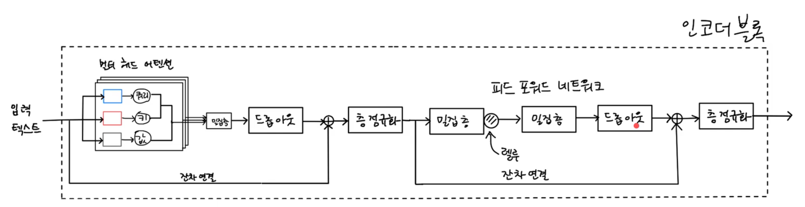    

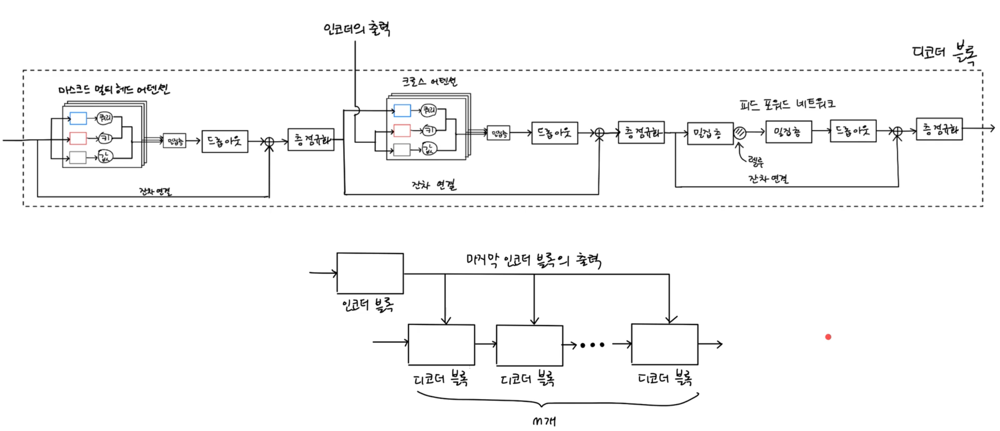   

| [Top](#목차) |

---

## 트랜스포머로 상품 설명 요약하기   

### 트랜스포머 모델 유형
   
- 가장 왼쪽: 초기 LLM 모델. 트랜스포머 사용 안함      
- 좌: 인코더 기반 모델. 2021년 이후 발전 안함  
- 중: 인코더-디코더 기반 모델. 
- 우: 디코더 기반 모델. 가장 활발히 발전하고 있음  
바탕색이 하얀색인 모델은 오픈소스 모델이고, 그 중 메타에서 공개한 **라마(Llama)**가 가장 유명     

1.**인코더 기반 모델 (Encoder-only)**    
- **특징**: 입력 텍스트를 이해하고 **은닉 벡터(임베딩)로 변환**하는 데 특화
- **대표 모델**: BERT, RoBERTa, ELECTRA
- **적합한 작업**:
  - 텍스트 분류 (긍정/부정 판별)
  - 개체명 인식 (Named Entity Recognition) - 사람 이름, 지역명, 회사명 식별
  - 문장 유사도 측정 (STS: Semantic Textual Similarity)
```
[입력 텍스트] → [인코더] → [문맥을 이해한 벡터 표현]
```

2.**디코더 기반 모델 (Decoder-only)**     
- **특징**: 타임스텝마다 **하나의 토큰을 순차적으로 생성**
- **대표 모델**: GPT 시리즈, LLaMA, Claude
- **적합한 작업**:
  - 텍스트 생성
  - 대화 시스템
  - 코드 생성
  - Q&A
```
[시작 토큰] → [디코더] → [토큰1] → [토큰2] → ... → [완성된 문장]
```

3.**인코더-디코더 기반 모델 (Encoder-Decoder)**   
- **특징**: 입력 시퀀스를 이해(인코더)하고, 다른 형태의 출력 시퀀스를 생성(디코더)
- **대표 모델**: T5, BART, 원조 Transformer
- **적합한 작업**:
  - 번역 (한국어 → 영어)
  - 요약

```
[입력 문장] → [인코더] → [문맥 벡터] → [디코더] → [출력 문장]
```

💡 핵심 포인트    
**세 구조의 출력 형태가 모두 동일한 형태의 은닉 벡터**이기 때문에   
특정 작업에 따라 적절한 구조를 선택할 수 있는 것이 트랜스포머의 강점
  
### GPT나 클로드가 디코딩 기반 모델을 사용할 수 있는 이유   
  
충분히 큰 모델과 데이터로 **단방향만으로도 문맥 파악** 가능    

디코딩 기반 모델은 **입력 프롬프트도 "이전에 쓴 글"처럼 취급**     
비유로 설명하면:      
**인코더-디코더 (번역가)**
```
[한국어 문장 전체를 읽음] → [머릿속 정리] → [영어로 새로 씀]
       인코더                              디코더
```

**디코더만 (소설가)**
```
"옛날 옛적에..." → "한 소녀가..." → "살았는데..." → ...
   (이전 내용만 보면서 다음 단어를 이어씀)
```
  
### 오픈소스 모델 비교
2025년 현재 유명한 오픈소스 모델    
- 메타의 라마(Llama): 
- 구글의 젬마(Gemma)
- 마이크로소프트의 파이(Phi) 모델
- 알리바바의 콴(Qwen)
- IBM의 그래닛(Granite)

**1.종합평가**      
| Factor | Llama 3 | Gemma 2 | Phi-3 | Qwen 2 | Granite |
|--------|:-------:|:-------:|:-----:|:------:|:-------:|
| **벤치마크 성능** | 100 | 80 | 80 | 100 | 60 |
| **한국어 성능** | 60 | 60 | 40 | 100 | 40 |
| **추론 효율성** | 80 | 100 | 100 | 80 | 60 |
| **파인튜닝 용이성** | 100 | 80 | 60 | 80 | 80 |
| **라이선스 유연성** | 80 | 100 | 80 | 60 | 100 |
| **모델 크기 다양성** | 100 | 60 | 80 | 100 | 80 |
| **안전성** | 100 | 100 | 80 | 60 | 100 |
| **커뮤니티/생태계** | 100 | 80 | 60 | 80 | 40 |
| **총점** | **87.5** | **82.5** | **72.5** | **82.5** | **72.5** |

 **2.강점**     
| 순위 | 모델 | 총점 | 특징 |
|:----:|------|:----:|------|
| 🥇 | **Llama 3** | 87.5 | 균형 잡힌 올라운더 |
| 🥈 | **Gemma 2** | 82.5 | 효율성 + 안전성 |
| 🥈 | **Qwen 2** | 82.5 | 한국어 최강 |
| 🥉 | **Phi-3** | 72.5 | 소형 모델 특화 |
| 🥉 | **Granite** | 72.5 | 엔터프라이즈 안정성 |

**3.전이학습**     
이미 훈련된 모델을 새로운 작업에 맞춰 재사용하거나 약간 조정하여 사용하는 방법    
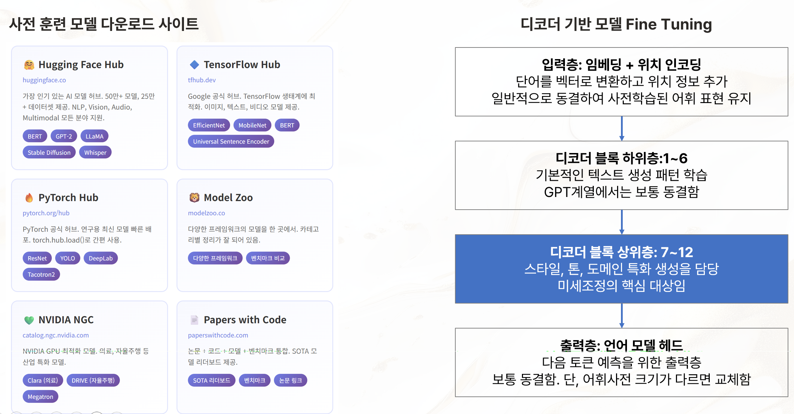

  
대표적 인코딩-디코딩 모델인 BART모델로 전이학습 소개   

### BART 모델 개념    
**1.BART 모델 구조**     
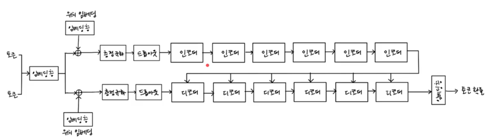

**1.위치 임베딩 vs 위치 인코딩**          

1)차이점     
| 구분 | 위치 인코딩 (Positional Encoding) | 위치 임베딩 (Positional Embedding) |
|------|----------------------------------|-----------------------------------|
| **방식** | 고정된 수학 함수 (sin/cos) | 학습 가능한 파라미터 |
| **사용 모델** | 원본 Transformer | BART, GPT, BERT |
| **유연성** | 고정값, 학습 불가 | 데이터에서 최적 위치 표현 학습 |

2)왜 위치 임베딩을 사용하는가?     
**학습 가능한 장점**: BART는 위치 임베딩을 학습 파라미터로 두어, 특정 태스크(요약, 번역 등)에 최적화된 위치 표현을 자동으로 학습   

3)위치임베딩 방법     
**위치 임베딩도 토큰 임베딩과 동일한 "룩업 테이블" 방식**으로 구현       

예시    
**문장:** "나는 학교에 간다"
```
토큰화 결과: ["나는", "학교에", "간다"]
토큰 ID:     [  42,     128,     76  ]
위치 ID:     [   0,       1,      2  ]
```

**Step 1: 토큰 임베딩 테이블에서 조회**
```
토큰 임베딩 테이블 (50,000개 어휘사전 × 768차원 벡터)
┌─────────────────────────────┐
│ ID 0:   [0.12, -0.34, ...]  │
│ ID 1:   [0.45,  0.23, ...]  │
│ ...                          │
│ ID 42:  [0.82, -0.15, ...]  │ ← "나는"
│ ...                          │
│ ID 76:  [0.33,  0.67, ...]  │ ← "간다"
│ ...                          │
│ ID 128: [0.91, -0.42, ...]  │ ← "학교에"
└─────────────────────────────┘
```

**Step 2: 위치 임베딩 테이블에서 조회 (동일한 방식!)**
```
위치 임베딩 테이블 (512개 위치 × 768차원 벡터)
┌─────────────────────────────┐
│ 위치 0: [0.01,  0.05, ...]  │ ← 첫 번째 위치
│ 위치 1: [0.03, -0.02, ...]  │ ← 두 번째 위치
│ 위치 2: [0.07,  0.11, ...]  │ ← 세 번째 위치
│ ...                          │
│ 위치 511: [...]              │
└─────────────────────────────┘
```

**Step 3: 두 임베딩을 더함**
```python
# PyTorch 구현 예시
token_embed = token_embedding_table[token_ids]   # (3, 768)
pos_embed = position_embedding_table[pos_ids]    # (3, 768)

final_input = token_embed + pos_embed            # (3, 768)
```

```
"나는" 최종 표현 = [0.82, -0.15, ...] + [0.01, 0.05, ...] = [0.83, -0.10, ...]
"학교에" 최종 표현 = [0.91, -0.42, ...] + [0.03, -0.02, ...] = [0.94, -0.44, ...]
"간다" 최종 표현 = [0.33, 0.67, ...] + [0.07, 0.11, ...] = [0.40, 0.78, ...]
```
  
**2.인코더와 디코더가 동일 임베딩층을 공유하는 이유**    
- **파라미터 효율성**: 어휘 크기가 50,000개이고 임베딩 차원이 768이면, 임베딩 행렬만 ~38M 파라미터임. 공유하면 이를 절반으로 줄일 수 있음    
- **의미 공간 일관성**: 인코더가 "학교"를 벡터 v로 표현했다면, 디코더도 동일한 v로 이해해야 Cross-Attention이 제대로 작동  
```
인코더: "학교" → 임베딩층 → 벡터 v → 인코딩
디코더: "학교" → 동일 임베딩층 → 동일 벡터 v → 디코딩
```
  
**3.가중치 공유(Weight Tying)**       
다이어그램 맨 오른쪽의 **세로로 회전된 "임베딩층"**은 **Weight Tying (가중치 공유)** 기법임    
가중치 공유(Weight Tying)란 **입력 임베딩과 출력 임베딩의 가중치를 공유**하는 기법   


**1)왜 임베딩 행렬을 재사용하는가:**    
- **의미적 일관성**: "고양이" 벡터와 가장 유사한 은닉상태(hidden state)는 "고양이" 토큰을 출력해야 함. 같은 임베딩 공간을 사용하면 이것이 자연스럽게 보장됨.    
- **파라미터 절약**: 별도의 출력 행렬을 두면 추가로 ~38M 파라미터가 필요하지만, 공유하면 0   
- **학습 안정성**: 입력과 출력이 같은 의미 공간을 공유하여 학습이 더 안정적이 됨   

**2)수행예시**    

1단계: 디코더 마지막 출력이 만들어지는 과정     

**번역 예시:** "I love you" → "나는 너를 사랑해"

```
┌─────────────────────────────────────────────────────────────────┐
│                     디코더 내부 처리 과정                         │
├─────────────────────────────────────────────────────────────────┤
│                                                                  │
│  입력: <SOS> (문장 시작 토큰)                                    │
│           ↓                                                      │
│  ┌─────────────────┐                                            │
│  │   디코더 레이어 1  │                                          │
│  │   (Self-Attention │                                          │
│  │   + Cross-Attention│                                          │
│  │   + FFN)          │                                           │
│  └────────┬──────────┘                                          │
│           ↓                                                      │
│  ┌─────────────────┐                                            │
│  │   디코더 레이어 2  │                                          │
│  └────────┬──────────┘                                          │
│           ↓                                                      │
│          ...                                                     │
│           ↓                                                      │
│  ┌─────────────────┐                                            │
│  │   디코더 레이어 6  │                                          │
│  └────────┬──────────┘                                          │
│           ↓                                                      │
│  ┌─────────────────────────────────────────┐                    │
│  │  디코더 마지막 출력 (Hidden State)        │                   │
│  │  768개의 숫자로 구성된 벡터               │                    │
│  │  [0.82, -0.15, 0.43, 0.91, ..., 0.27]   │                    │
│  │   ↑                                      │                    │
│  │   이 벡터가 "다음에 올 단어의 특성"을      │                    │
│  │   768차원 공간에서 표현한 것              │                    │
│  └─────────────────────────────────────────┘                    │
│                                                                  │
└─────────────────────────────────────────────────────────────────┘
```
  
2단계: 디코더 마지막 출력의 구체적 예시
  
```
디코더 마지막 출력 벡터 (1 × 768)
┌────────────────────────────────────────────────────────────────┐
│                                                                 │
│  인덱스:   0      1      2      3      4     ...    767        │
│         ┌──────┬──────┬──────┬──────┬──────┬─────┬──────┐      │
│  값:     │ 0.82 │-0.15 │ 0.43 │ 0.91 │-0.33 │ ... │ 0.27 │      │
│         └──────┴──────┴──────┴──────┴──────┴─────┴──────┘      │
│                                                                 │
│  의미 해석 (예시):                                              │
│  - 인덱스 0~100: 품사 관련 특성 → 0.82 (명사/대명사 성향 높음)   │
│  - 인덱스 101~200: 주어/목적어 특성 → 주어 위치 성향             │
│  - 인덱스 201~300: 시제 관련 특성                               │
│  - ... (실제로는 해석 불가능한 추상적 특성들)                    │
│                                                                 │
│  → 이 벡터는 "나는"과 비슷한 특성을 가진 단어를 찾아야 함        │
│                                                                 │
└────────────────────────────────────────────────────────────────┘
```
  
3단계: 임베딩 행렬과 전치된 임베딩 행렬   

```
┌─────────────────────────────────────────────────────────────────┐
│                    원본 임베딩 행렬 E                            │
│                    (입력 시 사용)                                │
├─────────────────────────────────────────────────────────────────┤
│                                                                  │
│                        768개 열 (임베딩 차원)                    │
│                    ←─────────────────────────→                  │
│                    열0    열1    열2   ...  열767                │
│                 ┌───────────────────────────────┐               │
│    행0 "나는"   │ 0.91   0.12  -0.34  ...  0.45 │  ↑            │
│    행1 "너를"   │ 0.23   0.78  -0.12  ...  0.67 │  │            │
│    행2 "사랑해" │ 0.34   0.45   0.89  ... -0.23 │  │ 50,265개   │
│    행3 "학교"   │ 0.12   0.89  -0.56  ...  0.34 │  │ 행          │
│    행4 "간다"   │ 0.56  -0.23   0.45  ...  0.12 │  │ (어휘 수)   │
│       ...       │  ...   ...    ...   ...  ...  │  │            │
│    행50264     │ 0.78   0.34   0.12  ...  0.89 │  ↓            │
│                 └───────────────────────────────┘               │
│                                                                  │
│                 크기: 50,265 행 × 768 열                        │
│                                                                  │
└─────────────────────────────────────────────────────────────────┘


┌─────────────────────────────────────────────────────────────────┐
│                  전치된 임베딩 행렬 E^T                          │
│                    (출력 시 사용)                                │
├─────────────────────────────────────────────────────────────────┤
│                                                                  │
│                      50,265개 열 (어휘 수)                       │
│                 ←───────────────────────────────→               │
│                  열0     열1     열2    열3   ... 열50264        │
│                 "나는"  "너를" "사랑해" "학교" ...               │
│              ┌──────────────────────────────────────┐           │
│    행0      │  0.91    0.23    0.34   0.12  ...  0.78 │  ↑      │
│    행1      │  0.12    0.78    0.45   0.89  ...  0.34 │  │      │
│    행2      │ -0.34   -0.12    0.89  -0.56  ...  0.12 │  │ 768개│
│    ...      │  ...     ...     ...    ...   ...  ...  │  │ 행   │
│    행767    │  0.45    0.67   -0.23   0.34  ...  0.89 │  ↓      │
│              └──────────────────────────────────────┘           │
│                                                                  │
│                 크기: 768 행 × 50,265 열                        │
│                                                                  │
│    ※ 원본의 행↔열이 바뀜!                                       │
│    ※ "나는"의 임베딩 [0.91, 0.12, -0.34, ..., 0.45]가           │
│       이제 첫 번째 "열"로 세로로 배치됨                          │
│                                                                  │
└─────────────────────────────────────────────────────────────────┘
```

4단계: 행렬 곱셈으로 다음 토큰 예측   

```
┌─────────────────────────────────────────────────────────────────┐
│                        행렬 곱셈 연산                            │
├─────────────────────────────────────────────────────────────────┤
│                                                                  │
│   디코더 출력 (1×768)      ×      전치 임베딩 (768×50,265)       │
│                                                                  │
│   [0.82, -0.15, 0.43, ..., 0.27]                                │
│            (1 × 768)                                            │
│                                                                  │
│              ×                                                   │
│                                                                  │
│   ┌─────────────────────────────────────────┐                   │
│   │  0.91    0.23    0.34    0.12   ...     │ ← 행0             │
│   │  0.12    0.78    0.45    0.89   ...     │ ← 행1             │
│   │ -0.34   -0.12    0.89   -0.56   ...     │ ← 행2             │
│   │  ...     ...     ...     ...    ...     │                   │
│   │  0.45    0.67   -0.23    0.34   ...     │ ← 행767           │
│   └─────────────────────────────────────────┘                   │
│     ↑        ↑       ↑       ↑                                  │
│   "나는"   "너를" "사랑해" "학교"                                │
│            (768 × 50,265)                                       │
│                                                                  │
│              ↓                                                   │
│                                                                  │
│   결과: 각 단어와의 유사도 점수 (1 × 50,265)                    │
│                                                                  │
│   ┌─────────────────────────────────────────┐                   │
│   │  0.89     0.23     0.31     0.12  ...   │                   │
│   └─────────────────────────────────────────┘                   │
│      ↑        ↑        ↑        ↑                               │
│   "나는"   "너를"  "사랑해"  "학교"                              │
│    최고!                                                         │
│                                                                  │
└─────────────────────────────────────────────────────────────────┘
```

5단계: 유사도 계산의 실제 연산  

```
┌─────────────────────────────────────────────────────────────────┐
│              "나는"과의 유사도 계산 (내적)                        │
├─────────────────────────────────────────────────────────────────┤
│                                                                  │
│  디코더 출력:    [0.82,  -0.15,  0.43, ...,  0.27]               │
│                   ×       ×      ×           ×                   │
│  "나는" 임베딩:  [0.91,   0.12, -0.34, ...,  0.45]               │
│                   ↓       ↓      ↓           ↓                   │
│                  0.75 + (-0.02) + (-0.15) + ... + 0.12           │
│                   ↓                                              │
│               = 0.89 (높은 유사도!)                              │
│                                                                  │
├─────────────────────────────────────────────────────────────────┤
│              "학교"와의 유사도 계산 (내적)                        │
├─────────────────────────────────────────────────────────────────┤
│                                                                  │
│  디코더 출력:    [0.82,  -0.15,  0.43, ...,  0.27]               │
│                   ×       ×      ×           ×                   │
│  "학교" 임베딩:  [0.12,   0.89, -0.56, ...,  0.34]               │
│                   ↓       ↓      ↓           ↓                   │
│                  0.10 + (-0.13) + (-0.24) + ... + 0.09           │
│                   ↓                                              │
│               = 0.12 (낮은 유사도)                               │
│                                                                  │
└─────────────────────────────────────────────────────────────────┘
```

6단계: 최종 토큰 선택

```
┌─────────────────────────────────────────────────────────────────┐
│                    Softmax → 확률 변환                           │
├─────────────────────────────────────────────────────────────────┤
│                                                                  │
│  유사도 점수:     [0.89,   0.23,   0.31,   0.12, ...]            │
│                  "나는"  "너를" "사랑해" "학교"                   │
│                                                                  │
│                      ↓ softmax                                   │
│                                                                  │
│  확률:            [0.47,   0.12,   0.15,   0.08, ...]            │
│                   47%     12%     15%      8%                    │
│                    ↑                                             │
│                  최고 확률!                                       │
│                                                                  │
│                      ↓ argmax                                    │
│                                                                  │
│  선택된 토큰:     "나는" (ID: 0)                                  │
│                                                                  │
└─────────────────────────────────────────────────────────────────┘
```

| [Top](#목차) |

---

### BART 인코더와 디코더


1.숫자별 의미 정리    

```
┌─────────────────────────────────────────────────────────────────┐
│                      BART-base 하이퍼파라미터                    │
├──────────────┬──────────────┬───────────────────────────────────┤
│    숫자      │     의미     │              설명                  │
├──────────────┼──────────────┼───────────────────────────────────┤
│   (768,)     │  hidden_dim  │  모델의 기본 임베딩/은닉 차원      │
├──────────────┼──────────────┼───────────────────────────────────┤
│   (64,)      │  head_dim    │  각 어텐션 헤드의 차원             │
│              │              │  768 ÷ 12 = 64                    │
├──────────────┼──────────────┼───────────────────────────────────┤
│    12개      │  num_heads   │  멀티헤드 어텐션의 헤드 수         │
├──────────────┼──────────────┼───────────────────────────────────┤
│  (3072,)     │  ffn_dim     │  피드포워드 네트워크 중간층 차원   │
│              │              │  768 × 4 = 3072                   │
├──────────────┼──────────────┼───────────────────────────────────┤
│    0.1       │  dropout     │  드롭아웃 확률 (10%)               │
└──────────────┴──────────────┴───────────────────────────────────┘
```
  
1)(768,) - Hidden Dimension
```
┌─────────────────────────────────────────────────────────────────┐
│                                                                  │
│   입력 토큰 → 임베딩 → [768차원 벡터]                            │
│                                                                  │
│   "나는" → [0.12, -0.34, 0.56, ..., 0.78]                       │
│            └──────────── 768개 ────────────┘                    │
│                                                                  │
│   • 블록 입력: (768,)                                           │
│   • 블록 출력: (768,)                                           │
│   • 모든 층에서 이 차원 유지                                     │
│                                                                  │
└─────────────────────────────────────────────────────────────────┘
```
  
2)(64,) 와 12개 - 멀티헤드 어텐션

```
┌─────────────────────────────────────────────────────────────────┐
│                    멀티헤드 어텐션 분할                           │
├─────────────────────────────────────────────────────────────────┤
│                                                                  │
│   입력 (768,)                                                    │
│       ↓                                                          │
│   ┌─────────────────────────────────────────────────────────┐   │
│   │  헤드1   헤드2   헤드3   헤드4  ...  헤드11  헤드12      │   │
│   │  (64,)  (64,)  (64,)  (64,)       (64,)   (64,)       │   │
│   └─────────────────────────────────────────────────────────┘   │
│       ↓       ↓       ↓       ↓              ↓       ↓          │
│   각 헤드가 독립적으로 어텐션 계산                               │
│       ↓       ↓       ↓       ↓              ↓       ↓          │
│   ┌─────────────────────────────────────────────────────────┐   │
│   │            Concatenate (연결)                            │   │
│   │     64 × 12 = 768                                       │   │
│   └─────────────────────────────────────────────────────────┘   │
│       ↓                                                          │
│   출력 (768,)                                                    │
│                                                                  │
├─────────────────────────────────────────────────────────────────┤
│   왜 12개로 나누는가?                                            │
│   • 각 헤드가 다른 관점에서 관계를 학습                          │
│   • 헤드1: 문법적 관계 / 헤드2: 의미적 관계 / ...               │
│   • 병렬 처리로 효율성 증가                                      │
└─────────────────────────────────────────────────────────────────┘
```
  
3)(3072,) - 피드포워드 네트워크 (FFN)

```
┌─────────────────────────────────────────────────────────────────┐
│                    피드포워드 네트워크 구조                       │
├─────────────────────────────────────────────────────────────────┤
│                                                                  │
│   입력 (768,)                                                    │
│       │                                                          │
│       ▼                                                          │
│   ┌─────────┐                                                   │
│   │ 선형층1  │  768 → 3072  (확장: ×4)                          │
│   └────┬────┘                                                   │
│        ▼                                                         │
│   ┌─────────┐                                                   │
│   │  GELU   │  활성화 함수                                      │
│   └────┬────┘                                                   │
│        ▼                                                         │
│   (3072,)  ← 중간층 (더 넓은 표현 공간)                         │
│        │                                                         │
│        ▼                                                         │
│   ┌─────────┐                                                   │
│   │ 선형층2  │  3072 → 768  (축소: ÷4)                          │
│   └────┬────┘                                                   │
│        ▼                                                         │
│   출력 (768,)                                                    │
│                                                                  │
├─────────────────────────────────────────────────────────────────┤
│   왜 4배로 확장하는가?                                           │
│   • 더 넓은 공간에서 비선형 변환 수행                            │
│   • 복잡한 패턴 학습 가능                                        │
│   • 경험적으로 4배가 최적 성능                                   │
└─────────────────────────────────────────────────────────────────┘
```

**활성화 함수 젤루(GeLU)**    
x에 "x가 다른 값보다 클 확률"을 곱함.   
값이 클수록 더 많이 통과시키는 "확률적 게이트"     
```
┌─────────────────────────────────────────────────────────────────┐
│                      수식 비교                                   │
├─────────────────────────────────────────────────────────────────┤
│                                                                  │
│   ReLU:    f(x) = max(0, x)                                     │
│                                                                  │
│            x < 0  →  0                                          │
│            x ≥ 0  →  x                                          │
│                                                                  │
├─────────────────────────────────────────────────────────────────┤
│                                                                  │
│   GeLU:    f(x) = x · Φ(x)                                      │
│                                                                  │
│            Φ(x) = 표준정규분포의 누적분포함수 (CDF)              │
│                 = P(X ≤ x), X ~ N(0,1)                          │
│                                                                  │
│            즉, x에 "x가 다른 값보다 클 확률"을 곱함              │
│                                                                  │
├─────────────────────────────────────────────────────────────────┤
│                                                                  │
│   GeLU 근사식 (계산 효율):                                       │
│                                                                  │
│   f(x) ≈ 0.5x(1 + tanh(√(2/π)(x + 0.044715x³)))                │
│                                                                  │
└─────────────────────────────────────────────────────────────────┘
```


4)0.1 - 드롭아웃 (Dropout)

```
┌─────────────────────────────────────────────────────────────────┐
│                      드롭아웃 적용 위치                          │
├─────────────────────────────────────────────────────────────────┤
│                                                                  │
│   학습 시: 10%의 뉴런을 무작위로 비활성화                        │
│                                                                  │
│   원본:    [0.5,  0.3,  0.8,  0.2,  0.6,  0.4,  0.9,  0.1, ...] │
│                    ↓ 드롭아웃 (0.1)                              │
│   결과:    [0.5,  0.0,  0.8,  0.2,  0.6,  0.0,  0.9,  0.1, ...] │
│                    ↑                      ↑                      │
│                 10% 확률로 0으로 설정                            │
│                                                                  │
├─────────────────────────────────────────────────────────────────┤
│   적용 위치 (그림에서 0.1 표시된 곳):                            │
│   • 어텐션 출력 후                                               │
│   • FFN 중간층 후                                                │
│   • FFN 최종 출력 후                                             │
├─────────────────────────────────────────────────────────────────┤
│   목적:                                                          │
│   • 과적합(Overfitting) 방지                                     │
│   • 모델의 일반화 능력 향상                                      │
│   • 추론 시에는 비활성화                                         │
└─────────────────────────────────────────────────────────────────┘
```

| [Top](#목차) |

---

### 허깅페이스에서 KoBART 모델 로드   
허깅페이스(https://huggingface.co)는 트랜스포머 기반의 오픈소스 모델 공유 사이트임    

**1.예제**      
```
from transformers import pipeline
pipe = pipeline(task='summarization', model='EbanLee/kobart-summary-v3', device=0)

sample_text = """{요약할 텍스트}"""
pipe(sample_text)
```

**2.모델 정보 보기**      
https://huggingface.co/{모델 경로}로 모델 페이지 접근    
예) https://huggingface.co/EbanLee/kobart-summary-v3

Model card에서 기본 정보 확인   
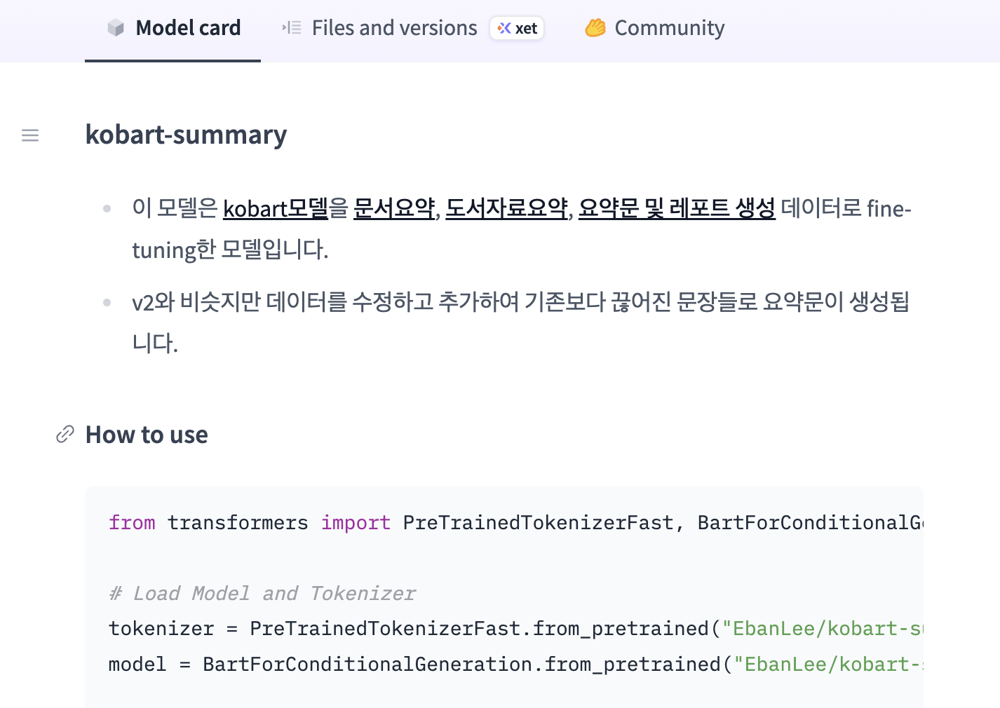

Files and versions > config.json에서 설정 정보 확인    
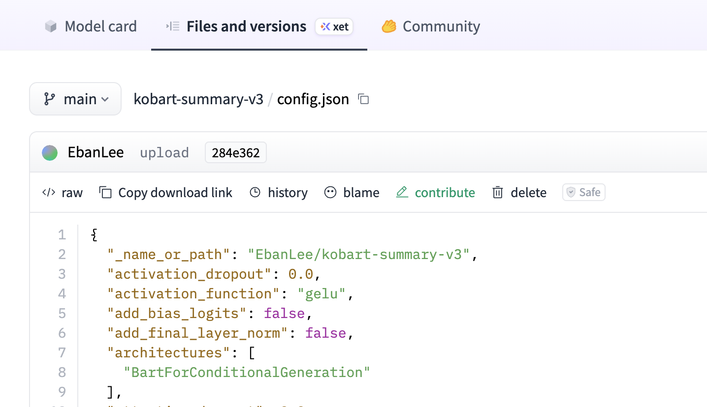

모델 기본 정보의 예제 코드   
```
from transformers import PreTrainedTokenizerFast, BartForConditionalGeneration

# Load Model and Tokenizer
tokenizer = PreTrainedTokenizerFast.from_pretrained("EbanLee/kobart-summary-v3")
model = BartForConditionalGeneration.from_pretrained("EbanLee/kobart-summary-v3")

# Encoding
input_text = "10년 논란 끝에 밑글씨까지 새기고 제작 완료를 눈앞에 둔 ‘광화문 현판’을 원점에서 재검토해 한글 현판으로 교체하자는 주장이 문화계 명사들이 포함된 자칭 ‘시민모임’에서 나왔다.\n  이들은 문화재청이 지난해 8월 최종 확정한 복원안이 시민 의견과 시대정신을 반영한 것이 아니라면서 오는 한글날까지 대대적인 현판 교체 시민운동을 벌이겠다고 예고했다.\n  ‘광화문 현판 훈민정음체로 시민모임’(공동대표 강병인‧한재준, 이하 ‘시민모임’)에 이름을 올린 문화예술인은 현재까지 총 24명.\n  이 중엔 2014~2016년 서울시 총괄건축가를 지낸 승효상 이로재 대표와 ‘안상수체’로 유명한 안상수 파주타이포그라피학교 교장, 유영숙 전 환경부장관(세종사랑방 회장), 임옥상 미술가 등이 있다.\n  공동대표인 강병인 작가는 ‘참이슬’ ‘화요’ 등의 상표 글씨로 유명한 캘리그라피(서체) 작가다.\n  ‘시민모임’은 14일 오후 서울 종로구의 한 서점에서 기자간담회를 열고 이 같은 입장과 함께 훈민정음 해례 글자꼴로 시범 제작한 모형 현판(1/2 크기 축소판)도 공개할 예정이다.\n  강 공동대표는 13일 기자와 통화에서 “새 현판 제작 과정에서 한글로 만들자는 의견은 묵살됐다”면서 “지난해 8월 이후 문화재청에 거듭 입장을 전했지만 반영되지 않아 시민운동에 나서기로 했다”고 말했다.\n  일단 문화예술인 주축으로 꾸렸지만 조만간 한글협회 등 한글 관련단체들과 연대한다는 방침이다.\n  이들이 배포한 사전자료엔 ^한자현판 설치는 중국의 속국임을 표시하는 것으로 대한민국 정체성에 도움이 되지 않고 ^광화문은 21세기의 중건이지 복원이 아니므로 당대의 시대정신인 한글로 현판을 써야하며 ^한글현판은 미래에 남겨줄 우리 유산을 재창조한다는 의미라는 주장이 담겼다.\n  현재 광화문 현판에 대해선 “고종이 경복궁을 중건할 때 당시 훈련대장이던 임태영이 쓴 광화문 현판의 글씨를 조그만 사진에서 스캐닝하고 이를 다듬어 이명박정부 때 설치된 것”이라면서 복원 기준으로서의 정당성을 깎아내렸다.\n    ‘시민모임’에 참여한 승효상 대표도 개인의견을 전제로 “현판을 꼭 한가지만 고집할 필요도 없다.\n  매년 교체할 수도 있고, 광장에서 보이는 정면엔 한글현판, 반대편엔 한자현판을 다는 아이디어도 가능한 것 아니냐”고 말했다.\n  그러면서 “문화재 전문가들은 보수적일 수밖에 없지만 현판이란 게 요즘 말로는 ‘간판’인데 새 시대에 맞게 바꿔 다는 게 바람직하다”고 주장했다.\n"
inputs = tokenizer(input_text, return_tensors="pt", padding="max_length", truncation=True, max_length=1026)

# Generate Summary Text Ids
summary_text_ids = model.generate(
input_ids=inputs['input_ids'],
attention_mask=inputs['attention_mask'],
bos_token_id=model.config.bos_token_id,
eos_token_id=model.config.eos_token_id,
length_penalty=1.0,
max_length=300,
min_length=12,
num_beams=6,
repetition_penalty=1.5,
no_repeat_ngram_size=15,
)

# Decoding Text Ids
print(tokenizer.decode(summary_text_ids[0], skip_special_tokens=True))

```

| [Top](#목차) |

---

### DAPT (Domain-Adaptive Pre-training)

**1.정의**   
**DAPT (Domain-Adaptive Pre-training)**는 범용 사전훈련 모델을 **특정 도메인의 텍스트로 추가 사전훈련**하여 해당 도메인에 적응시키는 기법   
  
**2.목적**    

| 목적 | 설명 |
|------|------|
| **도메인 용어 학습** | 전문 용어의 의미와 맥락 이해 |
| **도메인 문체 적응** | 해당 분야 특유의 표현 방식 학습 |
| **레이블 비용 절감** | 적은 레이블 데이터로 높은 성능 달성 |
| **성능 향상** | 도메인 특화 태스크에서 정확도 개선 |
   
이론적으로 태스크별 학습방법은 아래와 같음        
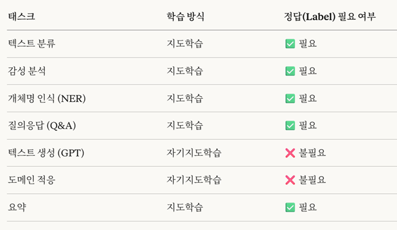    
그러나 레이블링에는 비용이 많이 들기 때문에 DAPT로 레이블 없이 자기지도학습을 하고   
소량의 레이블로 지동학습을 함   

**3.방법**   

1)전체 프로세스   

```
┌─────────────────────────────────────────────────────────┐
│                    DAPT 수행 절차                        │
├─────────────────────────────────────────────────────────┤
│                                                         │
│   [Step 1] 도메인 텍스트 수집                            │
│   ───────────────────────                               │
│   • 레이블 불필요 ❌                                     │
│   • 양이 많을수록 좋음 (수만~수십만 문서)                  │
│   • 예: 의료 논문, 진료 기록, 의학 교과서                 │
│                                                         │
│                        ↓                                │
│                                                         │
│   [Step 2] 자기지도학습으로 추가 사전훈련                 │
│   ───────────────────────                               │
│   • BERT: MLM (Masked Language Modeling)                │
│   • GPT: CLM (Causal Language Modeling)                 │
│                                                         │
│                        ↓                                │
│                                                         │
│   [Step 3] 태스크별 Fine-tuning                         │
│   ───────────────────────                               │
│   • 소량의 레이블 데이터로 학습                          │
│   • 분류, 개체명 인식 등 수행                            │
│                                                         │
└─────────────────────────────────────────────────────────┘
```

**4.MLM과 CLM 학습 방식 비교**    

1)정의   
  
| 방식 | 전체 이름 | 대표 모델 | 핵심 아이디어 |
|------|-----------|-----------|---------------|
| **MLM** | Masked Language Modeling | BERT | 빈칸 채우기 |
| **CLM** | Causal Language Modeling | GPT | 다음 단어 예측 |

2)MLM (Masked Language Modeling)   

- 원리: 빈칸 채우기 시험  

	```
	┌─────────────────────────────────────────────────────────┐
	│                    MLM 학습 방식                         │
	├─────────────────────────────────────────────────────────┤
	│                                                         │
	│   원본 문장:                                             │
	│   "환자는 급성 심근경색 진단을 받았다"                    │
	│                                                         │
	│                 ↓ 15% 랜덤 마스킹                        │
	│                                                         │
	│   입력:                                                  │
	│   "환자는 [MASK] 심근경색 [MASK]을 받았다"               │
	│                                                         │
	│                 ↓ 모델이 예측                            │
	│                                                         │
	│   예측:                                                  │
	│   "[MASK]" → "급성"     ✅ 정답!                        │
	│   "[MASK]" → "진단"     ✅ 정답!                        │
	│                                                         │
	│                                                         │
	└─────────────────────────────────────────────────────────┘
	```

3)CLM (Causal Language Modeling)   

- 원리: 다음 단어 맞추기

	```
	┌─────────────────────────────────────────────────────────┐
	│                    CLM 학습 방식                         │
	├─────────────────────────────────────────────────────────┤
	│                                                         │
	│   원본 문장:                                             │
	│   "오늘 날씨가 좋아서 산책을 했다"                        │
	│                                                         │
	│                 ↓ 순차적 예측                            │
	│                                                         │
	│   Step 1: "오늘" → 다음은? → "날씨가" ✅                 │
	│   Step 2: "오늘 날씨가" → 다음은? → "좋아서" ✅           │
	│   Step 3: "오늘 날씨가 좋아서" → 다음은? → "산책을" ✅    │
	│   Step 4: "오늘 날씨가 좋아서 산책을" → 다음은? → "했다" ✅│
	│                                                         │
	│   💡 앞 문맥만 봄 (뒤는 못 봄 = Causal)                   │
	│                                                         │
	└─────────────────────────────────────────────────────────┘
	```
  
4)MLM vs CLM 비교  
- 특징 비교표

	| 특징 | MLM (BERT) | CLM (GPT) |
	|------|------------|-----------|
	| **문맥 참조** | 양방향 (앞뒤 모두) | 단방향 (앞만) |
	| **학습 방식** | 15% 토큰 마스킹 후 예측 | 다음 토큰 연속 예측 |
	| **강점** | 문맥 이해, 분류 | 텍스트 생성 |
	| **약점** | 생성 어려움 | 양방향 문맥 못 봄 |
	| **대표 태스크** | 분류, NER(Named Entity Recognition), QA | 대화, 글쓰기, 코딩 | 
	 
- 문맥 참조 방향

	```
	┌─────────────────────────────────────────────────────────┐
	│                   문맥 참조 방향 비교                    │
	├─────────────────────────────────────────────────────────┤
	│                                                         │
	│   MLM (BERT) - 양방향:                                  │
	│   ─────────────────────                                 │
	│                                                         │
	│      "환자는"  ←──→  [MASK]  ←──→  "심근경색"            │
	│          ↑              ↑              ↑                │
	│          └──────────────┴──────────────┘                │
	│                    모두 참조                             │
	│                                                         │
	│   ─────────────────────────────────────────────         │
	│                                                         │
	│   CLM (GPT) - 단방향:                                   │
	│   ─────────────────────                                 │
	│                                                         │
	│      "오늘"  →  "날씨가"  →  "좋아서"  →  [예측]         │
	│        ↓          ↓           ↓            ↑            │
	│        └──────────┴───────────┴────────────┘            │
	│                    앞만 참조                             │
	│                                                         │
	└─────────────────────────────────────────────────────────┘
	```
  
- 실제 학습 예시 비교

	```
	원본: "고객님의 주문이 발송되었습니다"
	```

	- MLM 방식 (BERT)
	```
	┌─────────────────────────────────────────────────────────┐
	│   입력: "고객님의 [MASK]이 발송되었습니다"                │
	│   정답: "주문"                                          │
	│                                                         │
	│   입력: "고객님의 주문이 [MASK]되었습니다"                │
	│   정답: "발송"                                          │
	│                                                         │
	│   입력: "[MASK]의 주문이 발송되었습니다"                  │
	│   정답: "고객님"                                         │
	│                                                         │
	│   💡 무작위 위치를 마스킹하여 여러 번 학습                │
	└─────────────────────────────────────────────────────────┘
	```

	- CLM 방식 (GPT)
	```
	┌─────────────────────────────────────────────────────────┐
	│   입력: "고객님의"          → 정답: "주문이"             │
	│   입력: "고객님의 주문이"    → 정답: "발송"              │
	│   입력: "고객님의 주문이 발송" → 정답: "되었습니다"       │
	│                                                         │
	│   💡 한 문장에서 순차적으로 여러 학습 샘플 생성           │
	└─────────────────────────────────────────────────────────┘
	```
  
**5.학습 방식별 코드**   

1)BERT 계열 (MLM 방식)  

```python
from transformers import (
    AutoModelForMaskedLM,
    AutoTokenizer,
    DataCollatorForLanguageModeling,
    Trainer,
    TrainingArguments
)
from datasets import Dataset

# 1. 도메인 텍스트 준비 (레이블 없음)
domain_texts = [
    "환자는 급성 심근경색 진단 하에 PCI 시술을 받았다.",
    "심전도상 ST분절 상승이 관찰되어 응급 관상동맥 조영술 시행.",
    "좌전하행지 근위부 완전 폐색 소견으로 약물 용출 스텐트 삽입.",
    # ... 수만 개의 의료 텍스트
]

dataset = Dataset.from_dict({"text": domain_texts})

# 2. 모델 및 토크나이저 로드
tokenizer = AutoTokenizer.from_pretrained("bert-base-multilingual-cased")
model = AutoModelForMaskedLM.from_pretrained("bert-base-multilingual-cased")

# 3. 토큰화
def tokenize(examples):
    return tokenizer(
        examples["text"],
        truncation=True,
        max_length=512
    )

dataset = dataset.map(tokenize, batched=True)

# 4. MLM 데이터 콜레이터 (15% 자동 마스킹)
data_collator = DataCollatorForLanguageModeling(
    tokenizer=tokenizer,
    mlm=True,
    mlm_probability=0.15
)

# 5. 학습 설정
training_args = TrainingArguments(
    output_dir="./medical-bert",
    num_train_epochs=3,
    per_device_train_batch_size=16,
    learning_rate=5e-5,
    warmup_ratio=0.1,
    save_steps=5000,
    logging_steps=500,
)

# 6. 학습 실행
trainer = Trainer(
    model=model,
    args=training_args,
    train_dataset=dataset,
    data_collator=data_collator,
)

trainer.train()
trainer.save_model("./medical-bert")
```

2)GPT 계열 (CLM 방식)

```python
from transformers import (
    AutoModelForCausalLM,
    AutoTokenizer,
    DataCollatorForLanguageModeling,
    Trainer,
    TrainingArguments
)

# 1. 도메인 텍스트 준비
domain_texts = [
    "본 계약에서 '갑'이라 함은 채권자를 의미하며...",
    "민법 제548조에 따른 해제권의 행사는...",
    # ... 수만 개의 법률 텍스트
]

# 2. 모델 로드
tokenizer = AutoTokenizer.from_pretrained("gpt2")
model = AutoModelForCausalLM.from_pretrained("gpt2")

# 패딩 토큰 설정
tokenizer.pad_token = tokenizer.eos_token

# 3. CLM 데이터 콜레이터 (다음 토큰 예측)
data_collator = DataCollatorForLanguageModeling(
    tokenizer=tokenizer,
    mlm=False  # ← CLM 모드
)

# 4. 학습 (이하 동일)
```
  

**참고) DAPT vs 관련 개념 비교**      

| 개념 | 데이터 | 목적 | 레이블 |
|------|--------|------|--------|
| **Pre-training** | 대규모 범용 텍스트 | 언어 이해 기초 | ❌ |
| **DAPT** | 도메인 특화 텍스트 | 도메인 적응 | ❌ |
| **TAPT** | 태스크 관련 텍스트 | 태스크 적응 | ❌ |
| **Fine-tuning** | 태스크 데이터 | 태스크 수행 | ✅ |
  
```
┌─────────────────────────────────────────────────────────┐
│                  DAPT vs TAPT 차이                      │
├─────────────────────────────────────────────────────────┤
│                                                         │
│   DAPT: 도메인 전체 텍스트로 학습                        │
│   ────                                                  │
│   • 의료 도메인 → 모든 의료 문서                         │
│   • 넓은 범위의 도메인 지식 학습                         │
│                                                         │
│   TAPT: 실제 태스크 데이터(레이블 제외)로 학습            │
│   ────                                                  │
│   • 의료 감성 분류 → 해당 리뷰 텍스트만                   │
│   • 좁지만 태스크에 직접적으로 관련된 지식                 │
│                                                         │
│   💡 DAPT + TAPT 조합이 가장 효과적!                     │
│                                                         │
└─────────────────────────────────────────────────────────┘
```

| [Top](#목차) |

---

### 텍스트 토큰화

#### 핵심 요약  
| 구분 | BPE | WordPiece | Unigram | SentencePiece |
|------|-----|-----------|---------|---------------|
| **정의** | 가장 빈번한 문자쌍을<br>반복 병합 | 가장 가깝게 등장하는<br>문자쌍을 반복 병합 | 손실이 적은 토큰을<br>반복 제거 | 공백을 특수문자로 치환하여 공백 구분없이<br>문자열 전체를 직접 토큰화 |
| **학습<br>방향** | Bottom-up (병합) | Bottom-up (병합) | Top-down (제거) | BPE 또는 Unigram 선택 |
| **핵심<br>기준** | 빈도 | 우도(likelihood, 尤度) | 손실(loss) | 선택한 알고리즘에 따름 |
| **특징** | 단순, 구현 쉬움 | 언어 모델에 최적화 | 확률 기반 유연한 분할 | 다국어, 전처리 불필요 |
| **대표<br>모델** | GPT-2, GPT-3 | BERT, Electra | XLNet, ALBERT | T5, LLaMA |
| **활용<br>케이스** | • 영어 중심 텍스트<br>• 코드 생성 (Codex, Copilot)<br>• 빠른 프로토타이핑<br>• 단순한 파이프라인 | • 텍스트 분류/감성 분석<br>• 질의응답<br>• 명명된 개체 인식 (NER)<br>• 문장 유사도 측정 | • 형태소 복잡한 언어<br>(한국어, 일본어, 터키어)<br>• 학습 시 토큰 분할을<br>다양하게 변형 필요 시 | • 다국어/번역 모델<br>• 학습데이터가 적은 언어(몽골어 등)<br>• 공백 없는 언어 (중국어, 태국어 등)<br>• 코드+자연어 혼합 데이터 |


* 우도(尤度: Likelihood): 어떤 사건이 일어날 가능성의 정도   

한 줄 요약: 
| 알고리즘 | 핵심 아이디어 |
|----------|--------------|
| **BPE** | "자주 붙어 나오면 하나로 합치자" |
| **WordPiece** | "합쳤을 때 의미가 커지면 합치자" |
| **Unigram** | "없어도 별 손해 없으면 빼자" |
| **SentencePiece** | "공백 구분 없이 통째로 학습하자" |

토크나이저(Tokenizer)와 임베딩 벡터     
**토크나이저**는 **모델과 별도로 존재**하며 **어휘사전을 사용해 토큰을 토큰 아이디로 변환**함    
토큰을 단어 임베딩으로 변환하는 역할은 LLM 모델의 임베딩 층이 담당함    


#### 활용 케이스 상세 설명

**1.BPE - 생성 중심, 단순함 우선**  
```
적합한 경우:
✓ 영어 위주의 텍스트 생성
✓ 소스 코드 생성 (변수명, 함수명 처리에 강점)
✓ 빠른 실험과 프로토타이핑
✓ 학습 데이터가 충분한 경우

부적합한 경우:
✗ 형태소가 복잡한 교착어 (한국어, 터키어)
✗ 다국어 혼합 텍스트
```

**2.WordPiece - 이해 중심, 정확도 우선**  
```
적합한 경우:
✓ 문서 분류, 감성 분석
✓ 질의응답 시스템
✓ 개체명 인식 (NER)
✓ 의미적 유사도 측정

부적합한 경우:
✗ 긴 텍스트 생성
✗ 전처리가 어려운 언어
```

**3.Unigram - 유연성 중심, 확률적 접근**   
```
적합한 경우:
✓ 한국어, 일본어 등 교착어 처리
✓ 동일 단어의 다양한 분할이 필요한 경우
✓ 데이터 증강 (확률적 샘플링)
✓ 형태소 분석이 중요한 태스크

부적합한 경우:
✗ 결정론적 토큰화가 필요한 경우
✗ 매우 빠른 추론이 필요한 경우
```

**4.SentencePiece - 범용성 중심, 다국어 우선**    
```
적합한 경우:
✓ 100개 이상 언어 지원 모델
✓ 저자원 언어 (학습 데이터 부족)
✓ 공백 구분이 없는 언어 (중국어, 태국어, 일본어)
✓ 코드와 자연어가 섞인 데이터
✓ 원본 텍스트 완벽 복원이 필요한 경우

부적합한 경우:
✗ 단일 언어 + 단순한 요구사항 (오버스펙)
```

**5.선택 가이드 플로우차트**    

```
시작
  │
  ├─ 다국어 지원 필요? ─────── Yes ──→ SentencePiece
  │         │
  │        No
  │         │
  ├─ 공백 없는 언어? ─────── Yes ──→ SentencePiece
  │         │
  │        No
  │         │
  ├─ 형태소 복잡한 언어? ──── Yes ──→ Unigram (또는 SentencePiece+Unigram)
  │         │
  │        No
  │         │
  ├─ 주요 태스크?
  │    │
  │    ├─ 텍스트 생성 ─────────────→ BPE
  │    │
  │    ├─ 텍스트 이해/분류 ────────→ WordPiece
  │    │
  │    └─ 코드 생성 ───────────────→ BPE
  │
  └─ 빠른 프로토타이핑? ──── Yes ──→ BPE (가장 단순)
```
    
---

#### BPE(Byte Pair Encoding)
가장 빈번한 문자 쌍을 반복 병합   
즉, '자주 붙어 나오면 하나로 합치자'   

**1단계: 원본 코퍼스 (실제 텍스트)**
```
low low low low low
lower lower
newest newest newest newest newest newest
widest widest widest
```

**2단계: 단어별 빈도 집계**
| 단어 | 등장 횟수 |
|------|----------|
| low | 5회 |
| lower | 2회 |
| newest | 6회 |
| widest | 3회 |


**3단계: 문자 단위로 분리 (빈도 유지)**

```
l o w </w>       : 5회
l o w e r </w>   : 2회
n e w e s t </w> : 6회
w i d e s t </w> : 3회
```

**4단계: 인접 문자 쌍 빈도 계산**
```
(e, s) → newest(6) + widest(3) = 9회 ← 최빈
(s, t) → newest(6) + widest(3) = 9회
(t, </w>) → newest(6) + widest(3) = 9회
(l, o) → low(5) + lower(2) = 7회
(o, w) → low(5) + lower(2) = 7회
...
```

**5단계: 최빈 쌍 병합 → `es`**
```
l o w </w>       : 5회
l o w e r </w>   : 2회
n e w es t </w>  : 6회
w i d es t </w>  : 3회
```

**6단계: 다시 최빈 쌍 찾기 → `est` 병합**
```
l o w </w>       : 5회
l o w e r </w>   : 2회
n e w est </w>   : 6회
w i d est </w>   : 3회
```

이 과정을 **목표 어휘 크기에 도달할 때까지 반복**      
아래는 목표 어휘 크기 지정 예제임   
```
# Hugging Face tokenizers 예시
from tokenizers import Tokenizer
from tokenizers.models import BPE
from tokenizers.trainers import BpeTrainer

trainer = BpeTrainer(
    vocab_size=30000,  # ← 최종 어휘 크기 직접 지정
    min_frequency=2
)
```

---

#### 워드피스(Wordpiece)

**1단계: 원본 코퍼스 (BPE와 동일)**

```
low low low low low
lower lower
newest newest newest newest newest newest
widest widest widest
```

**2단계: 단어별 빈도 집계**

| 단어 | 등장 횟수 |
|------|----------|
| low | 5회 |
| lower | 2회 |
| newest | 6회 |
| widest | 3회 |

**3단계: 문자 단위로 분리**

```
l o w </w>       : 5회
l o w e r </w>   : 2회
n e w e s t </w> : 6회
w i d e s t </w> : 3회
```

**4단계: 각 문자의 전체 빈도 계산** ⬅️ BPE와 다른 점!

| 문자 | 계산 | 총 빈도 |
|------|------|--------|
| l | 5 + 2 | 7 |
| o | 5 + 2 | 7 |
| w | 5 + 2 + 6 + 3 | 16 |
| e | 2 + 6×2 + 3 | 17 |
| r | 2 | 2 |
| n | 6 | 6 |
| s | 6 + 3 | 9 |
| t | 6 + 3 | 9 |
| i | 3 | 3 |
| d | 3 | 3 |
| </w> | 5 + 2 + 6 + 3 | 16 |

※ newest에는 `e`가 2번 등장 (n**e**w**e**st)

**5단계: 인접 쌍 빈도 계산**

| 쌍 | 등장 단어 | 쌍 빈도 |
|----|----------|--------|
| (e, s) | newest(6) + widest(3) | 9 |
| (s, t) | newest(6) + widest(3) | 9 |
| (l, o) | low(5) + lower(2) | 7 |
| (o, w) | low(5) + lower(2) | 7 |
| (i, d) | widest(3) | 3 |
| (d, e) | widest(3) | 3 |

**6단계: WordPiece 점수 계산** ⬅️ 핵심 차이!

```
우도(Likelihood) 공식: Score(A, B) = freq(AB) / (freq(A) × freq(B))
```

| 쌍 | 계산 | 점수 |
|----|------|------|
| (i, d) | 3 / (3 × 3) | **0.333** ⬅️ 최고! |
| (l, o) | 7 / (7 × 7) | 0.143 |
| (s, t) | 9 / (9 × 9) | 0.111 |
| (e, s) | 9 / (17 × 9) | 0.059 |
| (o, w) | 7 / (7 × 16) | 0.063 |
| (d, e) | 3 / (3 × 17) | 0.059 |

**7단계: 최고 점수 쌍 병합 → `id`**

```
l o w </w>       : 5회
l o w e r </w>   : 2회
n e w e s t </w> : 6회
w id e s t </w>  : 3회  ⬅️ i d → id
```

**8단계: 빈도 재계산 후 다음 병합**

새로운 토큰 빈도 계산 → 다음 최고 점수 쌍 찾기 → 반복

BPE와 차이점:  
```
BPE 관점:
(e, s)가 9번 등장 → 가장 많으니까 병합!

WordPiece 관점:
- (e, s): e가 17번 중 9번만 s와 인접 → 결합 확률 낮음
- (i, d): i가 3번 등장, 그 3번 모두 d와 인접 → 결합 확률 100%!
         → "i와 d는 거의 항상 붙어다닌다" → 먼저 병합
```

WordPiece는 **"얼마나 자주 함께 등장하는가"** 의 상대적 비율을 중시함   
  
---
  
#### 유니그램(Unigram). 
**핵심 차이**: 
- BPE/WordPiece는 **작은 것 → 큰 것 (병합, Bottom-Up)**    
- Unigram은 **큰 것 → 작은 것 (제거, Top-Down)**      
  
1단계: 원본 코퍼스
```
low low low low low
lower lower
newest newest newest newest newest newest
widest widest widest
```
  
2단계: 단어별 빈도 집계
| 단어 | 등장 횟수 |
|------|----------|
| low | 5회 |
| lower | 2회 |
| newest | 6회 |
| widest | 3회 |

**총 단어 수**: 16회
  
3단계: 초기 어휘 구성 ⬅️ 핵심 차이!

BPE/WordPiece와 달리, **가능한 모든 서브워드**를 초기 어휘로 시작합니다.

```
필수 유지 토큰 (절대 제거 안 함): 개별 문자는 반드시 있어야 함   
- 개별 문자: l, o, w, e, r, n, s, t, i, d 
- 특수 토큰: <unk>, <s>, </s> 등

제거 대상 후보:
- 2글자: lo, ow, we, er, ne, ew, es, st, wi, id, de, ...
- 3글자: low, owe, wer, new, est, wid, ...
- 4글자 이상: lowe, newe, west, wide, lower, newest, widest, ...
```

4단계: EM 알고리즘으로 확률 추정 ⬅️ 중요!

단순 빈도 카운팅이 아니라, **EM(Expectation-Maximization) 알고리즘**으로 각 서브워드의 최적 확률을 반복 추정합니다.
   
**E-step (기대)**: 현재 확률로 각 단어의 가능한 분할들의 기대값 계산   
**M-step (최대화)**: 기대값을 바탕으로 확률 업데이트

```
예시 - "newest"의 분할 가능성:
  [newest]       → 확률 p₁
  [new][est]     → 확률 p₂  
  [n][e][w][e][s][t] → 확률 p₃
  
→ EM이 각 분할의 기여도를 계산하여 토큰별 확률 업데이트
```

**수렴 후 확률 예시**:

| 서브워드 | 확률 | 설명 |
|----------|------|------|
| low | 0.15 | 자주 사용되는 의미 단위 |
| est | 0.12 | 접미사로 자주 등장 |
| new | 0.10 | 의미 단위 |
| er | 0.08 | 비교급 접미사 |
| wid | 0.05 | wide의 어근 |
| newest | 0.04 | 완전 단어 |
| widest | 0.03 | 완전 단어 |
| l, o, w, ... | 0.01 | 개별 문자 (낮은 확률) |
  
5단계: 토큰 제거 시 손실(Loss) 계산 ⬅️ 핵심 단계!

**손실 = 코퍼스 전체의 음의 로그 우도(Negative Log-Likelihood) 증가량**

```
손실 공식:
L = -Σ log P(단어) 
  = -Σ log [Σ P(분할)]

특정 토큰 제거 시:
ΔL = L(제거 후) - L(제거 전)
```

예시 1: "newest" 토큰 제거 평가
```
제거 전 (newest 토큰 사용 가능):
  "newest" → [newest] 선택 가능
  log P([newest]) = log(0.04) = -3.22

제거 후 (newest 토큰 없음):
  "newest" → [new][est]로 분할해야 함
  log P([new][est]) = log(0.10) + log(0.12) = -2.30 + (-2.12) = -4.42

단어당 손실 증가: -4.42 - (-3.22) = -1.20
코퍼스 전체 손실: -1.20 × 6회 = -7.20
```

**해석**: `new`와 `est`가 높은 확률을 가지므로, 대체해도 **손실이 상대적으로 작음**

예시 2: "low" 토큰 제거 평가

```
제거 전:
  "low" → [low] 
  log P([low]) = log(0.15) = -1.90

제거 후:
  "low" → [l][o][w]로 분할해야 함
  log P([l][o][w]) = log(0.01) + log(0.01) + log(0.01) = -4.61 × 3 = -13.82

단어당 손실 증가: -13.82 - (-1.90) = -11.92
코퍼스 전체 손실: -11.92 × 5회 = -59.6

추가로 "lower"도 영향받음:
  [low][er] → [l][o][w][er]
  추가 손실 × 2회
```

**해석**: 개별 문자의 확률이 매우 낮아서, 대체하면 **손실이 매우 큼**

손실 비교 요약   
| 제거 후보 | 단어당 손실 | 영향 단어 수 | 총 손실 | 판정 |
|----------|------------|-------------|--------|------|
| newest | -1.20 | 6 | **-7.2** | 작음 → 제거 ✓ |
| widest | -1.50 | 3 | **-4.5** | 작음 → 제거 ✓ |
| low | -11.92 | 7 (low+lower) | **-83+** | 큼 → 유지 ✗ |
| est | -2.00 | 9 (newest+widest) | **-18** | 중간 |

**결론**: Unigram은 **"대체 가능한 토큰"을 먼저 제거**하고, **"필수적인 토큰"을 남김**

  
6단계: 손실 최소 토큰 제거 (반복)

```
초기 어휘: {l, o, w, e, r, n, s, t, i, d, lo, ow, low, er, 
           new, est, wid, newest, widest, lower, ...} (수천 개)

1차 제거: 손실 최소 토큰들 10~20% 제거
  → "newest", "widest" 등 완전 단어 우선 제거
  
2차 제거: 확률 재추정(EM) 후, 다시 손실 최소 토큰 제거
  → "lower" 등 조합 가능한 단어 제거

... 목표 어휘 크기까지 반복 (보통 수천~수만 회)
```

7단계: 최종 어휘 (예: 크기 15)

```
최종 어휘 (절대 제거 안 되는 것 + 생존 토큰):
{l, o, w, e, r, n, s, t, i, d,  ← 개별 문자 (필수 유지)
 low, er, new, est, wid}        ← 생존한 서브워드
```
  
8단계: 토큰화 - Viterbi 알고리즘 ⬅️ 효율적 탐색

새로운 단어를 토큰화할 때, **모든 분할을 열거하지 않고** Viterbi 알고리즘으로 최적 경로를 효율적으로 탐색.   

```
"newest" 토큰화 (동적 프로그래밍):

위치 0: 시작
위치 1: n  → best_score[1] = log P(n)
위치 2: ne → best_score[2] = max(best[1]+log P(e), log P(ne))
위치 3: new → best_score[3] = max(best[2]+log P(w), best[0]+log P(new))
...
위치 6: newest → 역추적하여 최적 분할 복원
```

분할 점수 비교 (개념 이해용)   

```
"newest" 분할 점수 비교:

방법 1: [new][est]
  점수 = log(0.10) + log(0.12) = -2.30 + (-2.12) = -4.42 ✓ 최고!

방법 2: [new][e][st]  
  점수 = log(0.10) + log(0.02) + log(0.04) = -2.30 + (-3.91) + (-3.22) = -9.43

방법 3: [n][e][w][e][s][t]
  점수 = 6개 문자의 로그합 ≈ -27.64 (최악)
```

**결과**: "newest" → `["new", "est"]`

     
**Unigram의 장점**:   

```
"lowest"를 토큰화할 때:

BPE/WordPiece: 학습된 순서대로 고정 분할
→ ["low", "est"] (항상 동일)

Unigram: 확률 기반 분할 (학습 시 다양성 제공 가능)
→ ["low", "est"] (확률 80%)
→ ["lowest"] (확률 15%)
→ ["low", "e", "st"] (확률 5%)

이 다양성이 모델 학습에 정규화(regularization) 효과를 줌
```

---

#### SentencePiece   
SentencePiece는 **언어 독립적인 서브워드 토큰화 라이브러리**로,   
BPE와 Unigram 알고리즘을 모두 지원.   
핵심 차이점은 **사전 토큰화(pre-tokenization) 없이 raw text에서 직접 학습**한다는 점임.

1단계: 원본 코퍼스 (Raw Text)

```
low low low low low
lower lower
newest newest newest newest newest newest
widest widest widest
```
  
**기존 방식**: 공백으로 분리 → `["low", "lower", "newest", "widest"]`  
**SentencePiece**: 분리하지 않고 **문자열 그대로** 처리
  
2단계: 공백을 특수 문자로 변환 ⬅️ 핵심!

SentencePiece는 **공백을 `▁` 으로 대체**.   

```
원본:
"low low low low low"

변환 후:
"▁low▁low▁low▁low▁low"

전체 코퍼스 변환:
▁low▁low▁low▁low▁low
▁lower▁lower
▁newest▁newest▁newest▁newest▁newest▁newest
▁widest▁widest▁widest
```

**왜 공백을 변환하나?**
```
문제: "New York" vs "NewYork"
      공백이 사라지면 구분 불가능 -> 원래 문자가 어떤건지 복원 불가능   

해결: "▁New▁York" vs "▁NewYork"
      공백 정보가 토큰에 포함됨 -> 원래 문자가 둘 중의 어떤 건지 구별됨 -> 완전 복원 가능
```

3단계: 초기 어휘 구성

- Unigram 모드 (model_type='unigram')

  ```
  필수 유지 토큰:
  - 개별 문자: ▁, l, o, w, e, r, n, s, t, i, d
  - 특수 토큰: <unk>, <s>, </s>, <pad>

  제거 후보 (가능한 모든 서브워드):
  - ▁l, ▁lo, ▁low, ▁lowe, ▁lower
  - ▁n, ▁ne, ▁new, ▁newe, ▁newes, ▁newest
  - ▁w, ▁wi, ▁wid, ▁wide, ▁wides, ▁widest
  - low, owe, wer, est, ...
  ```

- BPE 모드 (model_type='bpe')

  ```
  초기 어휘 (문자 단위):
  {▁, l, o, w, e, r, n, s, t, i, d, <unk>, <s>, </s>}

  이후 빈도 기반 병합 진행
  ```

4단계: 학습 (Unigram 모드 기준)

- 4-1. EM 알고리즘으로 확률 추정
  ```
  "▁low"의 분할 가능성:
    [▁low]           → 확률 p₁
    [▁][low]         → 확률 p₂
    [▁l][ow]         → 확률 p₃
    [▁][l][o][w]     → 확률 p₄
  ```

- 4-2. 수렴 후 확률 예시

  | 서브워드 | 확률 | 설명 |
  |----------|------|------|
  | ▁low | 0.12 | 단어 시작 + low |
  | ▁new | 0.10 | 단어 시작 + new |
  | est | 0.08 | 접미사 |
  | er | 0.06 | 접미사 |
  | ▁ | 0.05 | 공백 단독 |
  | low | 0.04 | 단어 중간의 low |
  | ▁newest | 0.03 | 완전 단어 |

**주목**: `▁low`와 `low`가 **별개 토큰**으로 존재
- `▁low`: 단어의 시작 (앞에 공백)
- `low`: 단어의 중간/끝 (앞에 공백 없음)
  
5단계: 토큰 제거 (손실 최소화)   
1.제거 후보 평가  

```
"▁newest" 토큰 제거 시:

제거 전:
  "▁newest" → [▁newest]
  log P = log(0.03) = -3.51

제거 후:
  "▁newest" → [▁new][est]
  log P = log(0.10) + log(0.08) = -2.30 + (-2.53) = -4.83

손실 증가: -4.83 - (-3.51) = -1.32
```

2.손실 비교  

| 제거 후보 | 손실 증가 | 판정 |
|----------|----------|------|
| ▁newest | -1.32 | 작음 → 제거 ✓ |
| ▁widest | -1.45 | 작음 → 제거 ✓ |
| ▁low | -8.50 | 큼 → 유지 ✗ |
| ▁ (공백) | -∞ | 필수 → 유지 ✗ |
  
6단계: 최종 어휘 (예: 크기 20)

```
{
  <unk>, <s>, </s>, <pad>,     ← 특수 토큰
  ▁, l, o, w, e, r, n, s, t, i, d,  ← 필수 문자
  ▁low, ▁new, est, er, ▁wid   ← 생존 서브워드
}
```

7단계: 토큰화 (Viterbi 알고리즘)

- 예시 1: "lowest" 토큰화

  ```
  입력: "lowest"
  전처리: "▁lowest" (문장 시작이면 공백 추가)

  Viterbi 탐색:
  위치 0→4: ▁low  (어휘에 있음) ✓
  위치 4→7: est   (어휘에 있음) ✓

  결과: ["▁low", "est"]
  ```

- 예시 2: "the newest" 토큰화

  ```
  입력: "the newest"
  전처리: "▁the▁newest"

  Viterbi 탐색:
  위치 0→4:  ▁the  → 없음 → [▁][t][h][e]로 분할
  위치 4→8:  ▁new  (어휘에 있음) ✓
  위치 8→11: est   (어휘에 있음) ✓

  결과: ["▁", "t", "h", "e", "▁new", "est"]
  ```

- 예시 3: 복원 (Detokenization)

  ```
  토큰: ["▁", "t", "h", "e", "▁new", "est"]

  복원 과정:
  1. 토큰 연결: "▁the▁newest"
  2. ▁를 공백으로 변환: " the newest"
  3. 선행 공백 제거: "the newest"

  결과: "the newest" ✓ 완벽 복원!
  ```

8단계: 코드 예시

```python
import sentencepiece as spm

# 학습
spm.SentencePieceTrainer.train(
    input='corpus.txt',
    model_prefix='my_model',
    vocab_size=1000,
    model_type='unigram',      # 또는 'bpe'
    character_coverage=1.0,    # 모든 문자 커버
    pad_id=0,
    unk_id=1,
    bos_id=2,
    eos_id=3,
)

# 로드
sp = spm.SentencePieceProcessor()
sp.load('my_model.model')

# 토큰화
tokens = sp.encode_as_pieces("lowest newest")
print(tokens)  # ['▁low', 'est', '▁new', 'est']

# ID로 변환
ids = sp.encode_as_ids("lowest newest")
print(ids)  # [15, 18, 16, 18]

# 복원
text = sp.decode_pieces(['▁low', 'est', '▁new', 'est'])
print(text)  # "lowest newest"
```

SentencePiece의 핵심 장점 요약

- 완전한 가역성

  ```
  기존 방식:
    "New York" → ["New", "York"] → "New York" ✓
    "NewYork"  → ["New", "York"] → "New York" ✗ (원본과 다름!)

  SentencePiece:
    "New York" → ["▁New", "▁York"] → "New York" ✓
    "NewYork"  → ["▁New", "York"]  → "NewYork"  ✓ (완벽 복원!)
  ```

- 언어 독립적

  ```
  영어:  "hello world"  → ["▁hello", "▁world"]
  일본어: "こんにちは"    → ["▁こん", "にち", "は"]
  중국어: "你好世界"      → ["▁你好", "世界"]
  혼합:  "hello世界"     → ["▁hello", "世界"]

  → 동일한 알고리즘으로 모든 언어 처리!
  ```

- 단어 경계 정보 보존

  ```
  "unlike" vs "un like"

  기존: ["un", "like"] vs ["un", "like"]  → 구분 불가
  SentencePiece: ["▁un", "like"] vs ["▁un", "▁like"]  → 구분 가능!
  ```

🧩 비유로 이해하기

```
레고 비유 확장:

기존 방식:
  문장 = 상자에 담긴 레고 (공백으로 구분)
  "New York" → [상자1: New] [상자2: York]
  문제: 상자 경계 정보가 토큰에 없음

SentencePiece:
  문장 = 연결된 레고 체인 (공백도 레고 조각)
  "New York" → [▁New] [▁York]  (▁ = 이음새 조각)
  장점: 이음새 정보가 토큰 자체에 포함됨

→ 조립/분해 시 원본 완벽 복원!
```

| [Top](#목차) |

---

## 대규모 언어 모델로 텍스트 생성하기
디코더 기반 모델로 텍스트 생성 실습   
실습은 LG AI연구원의 엑사원(EXAONE) LLM을 사용함    

LMArena는 요구에 맞는 적합한 LLM을 추천해 주는 서비스입니다.     
https://lmarena.ai/ko

이 사이트의 리더보드(https://lmarena.ai/ko/leaderboard)에서는 각 분야별 LLM 랭킹을 제공함   
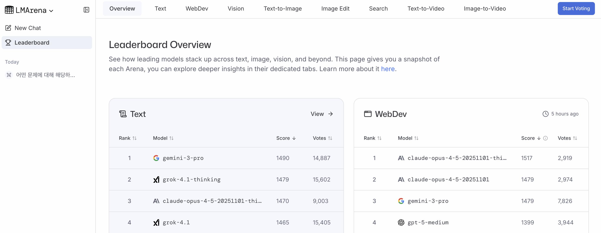   

### 멀티쿼리 어텐션과 그룹쿼리 어텐션
**1.기존 Multi-Head Attention의 문제**   
표준 Multi-Head Attention(MHA)에서는 각 헤드마다 독립적인 **Query(Q), Key(K), Value(V)** 프로젝션을 가짐   
  

```
MHA: 헤드 수 = h개
- Q 프로젝션: h개
- K 프로젝션: h개  
- V 프로젝션: h개
```
**문제점:** 추론(inference) 시 K와 V를 캐싱해야 하는데, 헤드 수만큼 메모리가 선형 증가. 이를 **KV 캐시(KV Cache)** 문제라고 함   

**2.멀티쿼리 어텐션: Multi-Query Attention (MQA)**    
- **목적:** KV 캐시 메모리를 대폭 줄여 추론 속도 향상
- **동작 원리:**
  - **Q는 기존처럼** 헤드별로 독립적 프로젝션 유지
  - **K와 V는 모든 헤드가 공유** (단 1개씩만 존재)
  ```
  MQA: 헤드 수 = h개
  - Q 프로젝션: h개 (헤드별 독립)
  - K 프로젝션: 1개 (전체 공유)
  - V 프로젝션: 1개 (전체 공유)
  ```
  

- **장점:** KV 캐시가 1/h로 감소 → 메모리 절약, 추론 속도 향상
- **단점:** 품질 저하 가능성 (K, V의 표현력 감소)
  
**3.그룹쿼리 어텐션: Grouped-Query Attention (GQA)**
- **목적:** MQA와 MHA의 절충안 - 품질과 효율성의 균형
- **동작 원리:**
  - Q 헤드들을 **G개의 그룹**으로 나눔
  - 각 그룹이 **하나의 K, V를 공유**

  ```
  GQA: 헤드 수 = h개, 그룹 수 = G개
  - Q 프로젝션: h개 (헤드별 독립)
  - K 프로젝션: G개 (그룹별 공유)
  - V 프로젝션: G개 (그룹별 공유)
  ```

  **예시 (h=8, G=2인 경우):**
  ```
  그룹 1: Q1, Q2, Q3, Q4 → K1, V1 공유
  그룹 2: Q5, Q6, Q7, Q8 → K2, V2 공유
  ```
  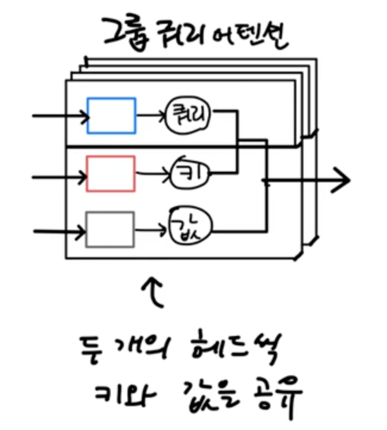  

**4.GQA가 가장 실용적 선택**    
- LLaMA 2, Mistral 등 최신 오픈소스 LLM들이 GQA를 채택
- MQA는 너무 극단적이라 품질 손실이 체감되고, MHA는 대규모 모델에서 메모리 병목이 심함
- 그룹 수 G를 '4-8' 정도로 설정하면 MHA 대비 90% 이상의 품질을 유지하면서 메모리를 '4-8'배 절약할 수 있음

| [Top](#목차) |

---

### SwiGLU 활성화
**1.목적**        
| 목적 | 설명 | 효과 | 
|------|------|--------|
| **표현력 향상** | 기존 ReLU/GELU 대비 더 풍부한 비선형 변환 | 더 다양한 패턴을 학습 | 
| **선택적 정보 흐름** | 게이팅으로 "어떤 정보를 통과시킬지" 학습 | 중요한 정보만 골라서 통과 시킴 | 
| **학습 안정성** | SiLU의 부드러운 곡선으로 그래디언트 흐름 개선 | 학습중에 덜 튀어 부드럽게 학습 | 
| **성능 향상** | 동일 파라미터 대비 더 낮은 perplexity(예측 어려움) 달성 | 동일 비용으로 더 좋은 결과 | 
  
**2.구성 요소**       
(1)SiLU (Swish) 함수

$$\text{SiLU}(x) = x \cdot \sigma(x) = x \cdot \frac{1}{1 + e^{-x}}$$    
```
입력값 × 시그모이드(입력값)
         ↓
    0~1 사이 값으로 스케일링
```

(2)GLU (Gated Linear Unit) 구조      
```
두 개의 병렬 경로 → 하나가 다른 하나를 "조절"
```

**3.동작원리**        
1)전체 구조  
```
         ┌──→ [밀집층 W₁] ──→ [SiLU] ──┐   🚪 게이트 (통과량 결정)
         │                             │
  입력 ──┤                             ⊗──→ [밀집층 W₃] ──→ 출력
         │                             │
         └──→ [밀집층 W₂] ────────────┘   📦 값 (실제 정보)
```

2)수식   

$$\text{SwiGLU}(x) = \text{SiLU}(xW_1) \otimes (xW_2)$$

$$\text{출력} = \text{SwiGLU}(x) \cdot W_3$$

3)단계별 동작     
```python
def SwiGLU_FFN(x, W1, W2, W3):
    # Step 1: 두 경로로 분기
    gate_path = x @ W1          # 게이트 경로
    value_path = x @ W2         # 값 경로
    
    # Step 2: 게이트 경로에 SiLU 적용
    gate = SiLU(gate_path)      # 0~무한대 범위, 조절 역할
    
    # Step 3: 게이트와 값을 element-wise 곱셈
    hidden = gate * value_path  # 게이트가 값의 흐름 조절
    
    # Step 4: 최종 출력 변환
    output = hidden @ W3
    
    return output
```

**4.왜 SwiGLU인가?**    
- Google의 2020년 연구 결과:
  "GLU Variants Improve Transformer" 논문에서 다양한 GLU 변형을 실험한 결과,   
  SwiGLU와 GeGLU가 가장 우수   
  
- Transformer의 Self-Attention이 "어디를 볼지"를 학습한다면,    
  SwiGLU는 "무엇을 통과시킬지"를 학습   
  두 메커니즘이 시너지를 내면서 최신 LLM의 성능을 끌어올리고 있음
  
| [Top](#목차) |

---

### RMS 정규화
RMS(Root Mean Square:제곱 평균 제곱근) 정규화는 **층 정규화(Layer Normalization)의 단순화된 버전**    

**1.목적**       
- **계산 효율성**: Layer Norm 대비 평균 계산을 생략하여 약 10-15% 연산량 절감
- **학습 안정화**: 레이어 출력의 스케일을 일정하게 유지

**2.동작원리**     
**Layer Normalization vs RMSNorm 비교:**

1)층 정규화(Layer Nomalization)   
축약형:  
$$y = \frac{x - \mu}{\sigma} \times \gamma + \beta$$

전체:  
$$y = \frac{x - \frac{1}{n}\sum_{i=1}^{n}x_i}{\sqrt{\frac{1}{n}\sum_{i=1}^{n}\left(x_i - \frac{1}{n}\sum_{j=1}^{n}x_j\right)^2}} \times \gamma + \beta$$

| 구성요소 | 이름 | 공식 |
|----------|------|------|
| $\mu$ | 평균(뮤) | $\mu = \frac{1}{n}\sum_{i=1}^{n}x_i$ |
| $\sigma^2$ | 분산(시그마 제곱) | $\sigma^2 = \frac{1}{n}\sum_{i=1}^{n}(x_i - \mu)^2$ |
| $\sigma$ | 표준편차(시그마) | $\sigma = \sqrt{\frac{1}{n}\sum_{i=1}^{n}(x_i - \mu)^2}$ |

2)RMS 정규화   
$$y = \frac{x}{\sqrt{\frac{1}{n} \sum_{i=1}^{n} x_i^2}} \times \gamma$$

| 단계 | 연산 |
|------|------|
| 1 | 각 값을 제곱: $x_i^2$ |
| 2 | 평균 계산: $\frac{1}{n} \sum x_i^2$ |
| 3 | 제곱근: $\sqrt{\cdot}$ |
| 4 | 나누기: $x \div$ 결과 |
| 5 | 스케일: $\times \gamma$ |

3)단계별 동작 예시   
```
입력: x = [2, 4, 6]

1단계: 제곱 평균 계산
       (2² + 4² + 6²) / 3 = (4 + 16 + 36) / 3 = 18.67

2단계: RMS 계산 (제곱근)
       √18.67 ≈ 4.32

3단계: 정규화
       [2/4.32, 4/4.32, 6/4.32] = [0.46, 0.93, 1.39]

4단계: 스케일 파라미터 γ 적용 (학습 가능)
       결과 × γ
```

| [Top](#목차) |

---

### EXAONE-3.5

 

**코드예제**        
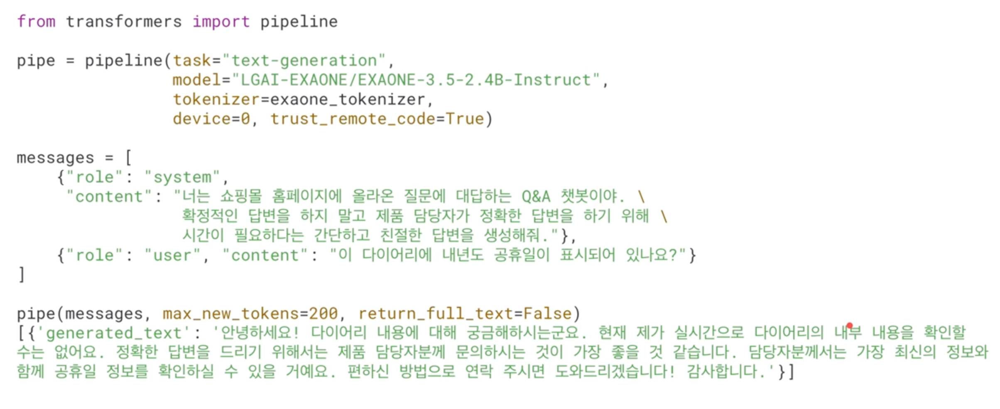


| [Top](#목차) |

---

### 토큰 디코딩 전략   
**1. 정의**
| 파라미터 | 정의 | 값 범위 | 효과 |
|----------|------|---------|------|
| **Temperature** | 확률 분포의 평탄화 정도 조절 | 0 ~ 2 | 낮으면 고확률 토큰 집중,<br>높으면 저확률 토큰도 선택 가능 |
| **Top-K** | 상위 K개 토큰만 후보로 고정 | 1 ~ 전체 | 후보 수 고정으로 극단적 토큰 제외<br>(현대 API에서 잘 사용 안 함) |
| **Top-P** | 누적 확률 P까지 동적 후보 선정 | 0 ~ 1 | 맥락에 따라 후보 수 자동 조절,<br>Top-K보다 유연함 |

**2. 용도별 적절 파라미터값**
| 용도 | Temperature | Top-P | Top-K | 비고 |
|------|-------------|-------|-------|------|
| 코드 생성 | 0.2 | 0.9 | - | 정확성 우선 |
| 일반 대화 | 0.7 | 0.95 | - | 균형잡힌 응답 |
| 창작 글쓰기 | 1.0~1.2 | 0.95 | - | 다양성 확보 |
| 브레인스토밍 | 1.3 | 1.0 | 100 | 극단적 아이디어 허용 |

> 💡 **Top-K 값이 대부분 "-"인 이유**: 
> 현대 LLM API(OpenAI, Anthropic 등)에서는 Top-P가 Top-K보다 유연하여 기본 옵션으로 채택됨.    
> Top-K는 특수 용도나 연구 목적 외에는 조정 불필요.  

**3.예시**      
모델이 "오늘 날씨가 정말 ___" 다음 단어를 예측한다고 가정    

| 토큰 | 확률 |
|------|------|
| 좋다 | 35% |
| 춥다 | 25% |
| 덥다 | 20% |
| 맑다 | 10% |
| 흐리다 | 5% |
| 이상하다 | 3% |
| 환상적이다 | 2% |

1)Temperature (온도)   
확률 분포의 평탄화 정도를 조절   

Temperature = 0.2     
예측 가능하고 일관된 출력    
```
좋다: 70% ████████████████████
춥다: 20% ██████
덥다: 8%  ██
나머지: 2%
```
- 가장 확률 높은 토큰에 집중
- 팩트 기반 답변에 적합

Temperature = 1.0 (기본값)  
```
좋다: 35% ██████████
춥다: 25% ███████
덥다: 20% ██████
맑다: 10% ███
```
- 원래 확률 분포 유지

Temperature = 1.5   
다양한 출력   
```
좋다: 25% ███████
춥다: 20% ██████
덥다: 18% █████
맑다: 15% ████
이상하다: 12% ███
환상적이다: 10% ███
```
- 확률이 **평탄화**되어 다양한 선택 가능
- 창의적 글쓰기에 적합
- 너무 높으면 횡설수설
  
2)Top-K 샘플링   
상위 K개 토큰만 후보로 선택     

Top-K = 3   
```
후보: 좋다(35%), 춥다(25%), 덥다(20%)
→ 이 3개 중에서만 확률적 선택
→ "맑다", "흐리다" 등은 아예 제외
```

Top-K = 50    
- 상위 50개 토큰 중 선택
- 더 다양한 표현 가능

**한계:** 확률 분포와 무관하게 고정된 개수만 선택    
  
3)Top-P (Nucleus Sampling)   
누적 확률 P까지의 토큰만 후보로 선택   

Top-P = 0.8 (80%)
```
좋다: 35% → 누적 35%
춥다: 25% → 누적 60%
덥다: 20% → 누적 80% ✓ 여기서 컷!

후보: 좋다, 춥다, 덥다 (3개)
```

Top-P = 0.95 (95%)
```
좋다: 35% → 누적 35%
춥다: 25% → 누적 60%
덥다: 20% → 누적 80%
맑다: 10% → 누적 90%
흐리다: 5% → 누적 95% ✓

후보: 좋다, 춥다, 덥다, 맑다, 흐리다 (5개)
```

**장점:** 확률 분포에 **적응적**으로 후보 수가 결정됨

| [Top](#목차) |

---
